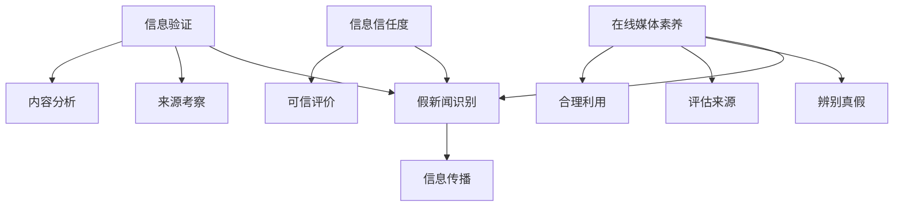

                 

### 背景介绍

在当今数字化时代，信息爆炸已成为一个不可逆转的趋势。互联网的普及使得信息的获取变得前所未有的便捷，人们可以通过各种渠道随时随地获取到海量的信息。然而，这种信息自由的同时，也带来了一个严峻的问题——假新闻（False News）的泛滥。假新闻的广泛传播不仅对个人认知产生误导，更对整个社会造成深远的负面影响。

假新闻的传播速度之快，覆盖范围之广，往往令人惊叹。一些看似真实、引人入胜的假新闻，往往能在短时间内迅速传播，甚至超越一些权威媒体的报道影响力。这不仅是因为社交媒体的算法推荐机制，更是因为人们在面对未知信息时的本能冲动——即对新颖、刺激内容的追求。

在假新闻频发的环境中，信息验证（Information Verification）和在线媒体素养（Online Media Literacy）显得尤为重要。信息验证是指对获取的信息进行真实性、准确性和可靠性的核实过程。在线媒体素养则是指个体在使用互联网和社交媒体时，能够正确识别、评估和处理信息的能力。

本文将深入探讨信息验证和在线媒体素养的重要性，分析其在假新闻时代导航中的关键作用。通过详细讲解信息验证的原理和方法，以及提高在线媒体素养的策略，帮助读者在信息泛滥的时代中保持清醒的头脑，正确导航。

### 2. 核心概念与联系

为了更好地理解信息验证和在线媒体素养的重要性，我们需要从核心概念和它们之间的联系出发。以下是几个关键概念：

**1. 信息验证（Information Verification）**：信息验证是指通过多种途径和方法，对获取的信息进行核实，以确保其真实性和准确性。信息验证不仅包括对来源的考察，还包括对内容本身的逻辑性、连贯性和证据支持的分析。

**2. 假新闻识别（False News Detection）**：假新闻识别是信息验证的一个子领域，主要关注于如何通过算法和技术手段来识别和过滤假新闻。随着人工智能和自然语言处理技术的发展，假新闻识别技术已经取得了一定的进展。

**3. 在线媒体素养（Online Media Literacy）**：在线媒体素养是指个体在使用互联网和社交媒体时，具备辨别真假信息、评估信息来源和合理利用信息的能力。在线媒体素养不仅关乎个人的信息素养，更涉及社会整体的媒体素养水平。

**4. 信息信任度（Information Trustworthiness）**：信息信任度是指个体对信息源和信息的可信程度的主观评价。提高信息信任度有助于降低假新闻的传播风险，增强公众对权威信息的信任。

这些概念之间的联系体现在以下几个方面：

- **信息验证和假新闻识别**：信息验证是假新闻识别的基础，通过验证信息来源和内容，可以有效降低假新闻的传播风险。

- **在线媒体素养和信息信任度**：提高在线媒体素养，有助于个体更加准确地评估信息的真实性，从而提高信息信任度，减少假新闻的影响。

- **技术手段与社会教育**：技术手段如人工智能和自然语言处理技术在信息验证和假新闻识别中发挥了重要作用，但社会教育同样不可或缺。通过教育提高公众的媒体素养，才能真正实现信息验证和在线媒体素养的提升。

为了更直观地展示这些概念之间的联系，我们可以使用Mermaid流程图来描述它们之间的关系。



通过这个Mermaid流程图，我们可以清晰地看到信息验证、假新闻识别、在线媒体素养和信息信任度之间的互动关系。这些核心概念构成了我们在假新闻时代导航的基础，为接下来的讨论提供了理论支持。

### 3. 核心算法原理 & 具体操作步骤

在信息验证和假新闻识别中，核心算法原理是确保信息真实性和准确性的关键。以下我们将介绍几种常用的核心算法，并详细说明其具体操作步骤。

#### 3.1 词频-逆文档频率（TF-IDF）

TF-IDF（Term Frequency-Inverse Document Frequency）是一种常用的人工智能算法，用于评估一个词对于一个文件集或一个语料库中的其中一份文件的重要程度。其基本原理如下：

**词频（TF）**：词频是指一个词在文档中出现的次数。词频越高，表明该词在文档中越重要。

**逆文档频率（IDF）**：逆文档频率是指一个词在整个文档集合中出现的频率越低，则这个词越重要。其计算公式为：

\[ IDF(t) = \log \left( \frac{N}{df(t)} \right) \]

其中，\( N \) 是文档总数，\( df(t) \) 是包含词 \( t \) 的文档数量。

**具体操作步骤**：

1. **数据预处理**：对文本进行分词、去停用词等处理。
2. **计算词频（TF）**：统计每个词在文档中的出现次数。
3. **计算逆文档频率（IDF）**：使用上述公式计算每个词的逆文档频率。
4. **生成TF-IDF特征向量**：将每个词的TF值乘以相应的IDF值，得到TF-IDF特征向量。

#### 3.2 支持向量机（SVM）

支持向量机（Support Vector Machine，SVM）是一种常用的机器学习分类算法。在信息验证和假新闻识别中，SVM可用于分类不同类型的新闻，从而区分真假新闻。其基本原理如下：

SVM通过寻找一个最优超平面，将不同类别的数据点最大化地分开。这个最优超平面由支持向量决定，支持向量是指那些距离超平面最近的数据点。

**具体操作步骤**：

1. **数据准备**：收集并标注真假新闻数据集。
2. **特征提取**：使用TF-IDF等方法提取特征。
3. **模型训练**：使用训练数据集训练SVM模型。
4. **模型评估**：使用测试数据集评估模型性能，调整参数。
5. **分类预测**：使用训练好的模型对新的新闻进行分类预测。

#### 3.3 集成学习（Ensemble Learning）

集成学习是将多个弱学习器结合起来，形成一个强学习器的方法。常见的集成学习方法有Bagging、Boosting和Stacking等。

**具体操作步骤**：

1. **选择基学习器**：选择多个基学习器，如决策树、随机森林等。
2. **训练基学习器**：使用训练数据集分别训练每个基学习器。
3. **集成基学习器**：将多个基学习器的预测结果进行整合，形成最终预测结果。

#### 3.4 自然语言处理（NLP）

自然语言处理（Natural Language Processing，NLP）是人工智能的一个重要分支，用于处理和理解人类语言。在信息验证和假新闻识别中，NLP技术可以用于文本分类、情感分析、实体识别等任务。

**具体操作步骤**：

1. **文本预处理**：对文本进行分词、去停用词、词性标注等处理。
2. **特征提取**：使用词袋模型、TF-IDF、词嵌入等方法提取文本特征。
3. **模型训练**：使用训练数据集训练NLP模型。
4. **模型评估**：使用测试数据集评估模型性能。
5. **文本分析**：使用训练好的模型对新的文本进行分析，提取相关信息。

通过以上核心算法的介绍和具体操作步骤的讲解，我们可以看到信息验证和假新闻识别是一个复杂的过程，需要多种算法和技术手段相结合，才能实现有效的信息验证和假新闻识别。

### 4. 数学模型和公式 & 详细讲解 & 举例说明

#### 4.1 概率论基础

在信息验证和假新闻识别中，概率论是不可或缺的工具。以下将介绍几个基础的概率模型和公式，并详细解释其应用。

**4.1.1 概率的基本概念**

概率（Probability）是指某个事件发生的可能性，通常用0到1之间的数值表示。概率的基本概念包括：

- **事件（Event）**：事件是指实验结果的一个集合。
- **样本空间（Sample Space）**：样本空间是指实验所有可能结果的集合。
- **概率（Probability）**：概率是指某个事件在样本空间中发生的可能性。

**4.1.2 条件概率和贝叶斯定理**

条件概率（Conditional Probability）是指在某事件已发生的条件下，另一个事件发生的概率。其公式为：

\[ P(A|B) = \frac{P(A \cap B)}{P(B)} \]

其中，\( P(A \cap B) \) 表示事件A和事件B同时发生的概率，\( P(B) \) 表示事件B发生的概率。

贝叶斯定理（Bayes' Theorem）是条件概率的推广，用于根据某个事件的先验概率和条件概率来计算其后验概率。贝叶斯定理的公式为：

\[ P(A|B) = \frac{P(B|A) \cdot P(A)}{P(B)} \]

其中，\( P(A) \) 表示事件A的先验概率，\( P(B) \) 表示事件B的先验概率，\( P(B|A) \) 表示在事件A发生的条件下，事件B发生的条件概率。

**4.1.3 举例说明**

假设有100篇文章，其中有60篇是真新闻，40篇是假新闻。现在我们要判断一篇文章是否是真新闻，已知这篇文章包含关键词“特朗普”，请问这篇文章是真新闻的概率是多少？

首先，我们需要计算关键词“特朗普”在真新闻和假新闻中分别出现的概率。根据先验概率，真新闻中包含“特朗普”的概率为 \( \frac{60}{100} = 0.6 \)，假新闻中包含“特朗普”的概率为 \( \frac{40}{100} = 0.4 \)。

接下来，我们计算包含关键词“特朗普”的文章在真新闻和假新闻中的条件概率。根据条件概率公式，真新闻中包含“特朗普”的条件概率为 \( \frac{60}{100} = 0.6 \)，假新闻中包含“特朗普”的条件概率为 \( \frac{40}{100} = 0.4 \)。

最后，我们使用贝叶斯定理计算这篇文章是真新闻的概率。根据贝叶斯定理公式，这篇文章是真新闻的概率为：

\[ P(\text{真新闻}|\text{包含“特朗普”}) = \frac{0.6 \cdot 0.6}{0.6 \cdot 0.6 + 0.4 \cdot 0.4} = \frac{0.36}{0.36 + 0.16} = \frac{9}{25} \approx 0.36 \]

因此，这篇文章是真新闻的概率约为36%。

#### 4.2 信息论基础

信息论是研究信息传输、处理和存储的数学理论，广泛应用于通信、计算机和信息科学等领域。以下介绍几个基础的信息论模型和公式。

**4.2.1 信息熵（Entropy）**

信息熵（Entropy）是衡量随机变量不确定性的度量。信息熵的定义如下：

\[ H(X) = -\sum_{i} p(x_i) \cdot \log_2 p(x_i) \]

其中，\( H(X) \) 表示随机变量X的信息熵，\( p(x_i) \) 表示随机变量X取值为 \( x_i \) 的概率。

**4.2.2 条件熵（Conditional Entropy）**

条件熵（Conditional Entropy）是衡量在已知一个随机变量条件下，另一个随机变量的不确定性。条件熵的定义如下：

\[ H(Y|X) = -\sum_{i} p(x_i) \cdot \sum_{j} p(y_j|x_i) \cdot \log_2 p(y_j|x_i) \]

其中，\( H(Y|X) \) 表示在已知随机变量X的条件下，随机变量Y的条件熵，\( p(x_i) \) 表示随机变量X取值为 \( x_i \) 的概率，\( p(y_j|x_i) \) 表示在随机变量X取值为 \( x_i \) 的条件下，随机变量Y取值为 \( y_j \) 的概率。

**4.2.3 信息增益（Information Gain）**

信息增益（Information Gain）是衡量一个特征对于分类的重要程度的度量。信息增益的定义如下：

\[ IG(D, A) = H(D) - H(D|A) \]

其中，\( IG(D, A) \) 表示特征A对于数据集D的信息增益，\( H(D) \) 表示数据集D的信息熵，\( H(D|A) \) 表示在已知特征A的条件下，数据集D的条件熵。

**4.2.4 举例说明**

假设我们有一个包含100篇文章的数据集，其中60篇是真新闻，40篇是假新闻。我们想要通过信息增益来选择一个特征来判断一篇文章是否是真新闻。以下是一个简化的例子：

- 真新闻中包含关键词“特朗普”的概率为0.3，假新闻中包含关键词“特朗普”的概率为0.2。
- 真新闻中不包含关键词“特朗普”的概率为0.7，假新闻中不包含关键词“特朗普”的概率为0.8。

首先，我们计算数据集的信息熵：

\[ H(D) = -0.6 \cdot \log_2 0.6 - 0.4 \cdot \log_2 0.4 \approx 0.918 \]

接下来，我们计算在已知特征A（“特朗普”）的条件下，数据集的条件熵：

\[ H(D|A) = 0.3 \cdot (0.3 \cdot \log_2 0.3 + 0.7 \cdot \log_2 0.7) + 0.7 \cdot (0.2 \cdot \log_2 0.2 + 0.8 \cdot \log_2 0.8) \approx 0.897 \]

最后，我们计算特征A的信息增益：

\[ IG(D, A) = H(D) - H(D|A) \approx 0.918 - 0.897 = 0.021 \]

因此，特征A（“特朗普”）对于数据集D的信息增益为0.021，表明特征A对于分类具有一定的重要性。

通过以上数学模型和公式的讲解，我们可以看到概率论和信息论在信息验证和假新闻识别中的应用。这些理论不仅为算法设计提供了基础，也为数据分析和决策提供了有力支持。

### 5. 项目实践：代码实例和详细解释说明

#### 5.1 开发环境搭建

在进行信息验证和假新闻识别的项目实践之前，我们需要搭建一个合适的开发环境。以下是一个基于Python和Scikit-learn的简单项目环境搭建步骤：

1. **安装Python**：确保系统已安装Python 3.x版本。
2. **安装Scikit-learn**：使用pip命令安装Scikit-learn库。

   ```shell
   pip install scikit-learn
   ```

3. **安装其他依赖库**：根据项目需求，安装其他必要的库，如Numpy、Pandas等。

   ```shell
   pip install numpy pandas
   ```

4. **设置虚拟环境**（可选）：为了保持项目环境的整洁，可以使用虚拟环境来隔离项目依赖。

   ```shell
   python -m venv myenv
   source myenv/bin/activate  # Windows上使用 `myenv\Scripts\activate`
   ```

#### 5.2 源代码详细实现

以下是该项目的一个简单示例，包括数据集的加载、特征提取和模型训练。

```python
import numpy as np
import pandas as pd
from sklearn.feature_extraction.text import TfidfVectorizer
from sklearn.model_selection import train_test_split
from sklearn.svm import SVC
from sklearn.metrics import accuracy_score

# 5.2.1 数据集加载
# 假设我们有一个CSV文件，其中包含两列：'text' 和 'label'，分别代表新闻文本和标签（0表示假新闻，1表示真新闻）
data = pd.read_csv('news_data.csv')

# 5.2.2 特征提取
# 使用TF-IDF向量器将文本转换为特征向量
vectorizer = TfidfVectorizer(max_features=1000)
X = vectorizer.fit_transform(data['text'])

# 5.2.3 数据集划分
# 将数据集划分为训练集和测试集
X_train, X_test, y_train, y_test = train_test_split(X, data['label'], test_size=0.2, random_state=42)

# 5.2.4 模型训练
# 使用SVM模型进行训练
model = SVC(kernel='linear')
model.fit(X_train, y_train)

# 5.2.5 模型评估
# 使用测试集评估模型性能
y_pred = model.predict(X_test)
accuracy = accuracy_score(y_test, y_pred)
print(f'Model accuracy: {accuracy:.2f}')
```

#### 5.3 代码解读与分析

**5.3.1 数据集加载**

```python
data = pd.read_csv('news_data.csv')
```

这一步使用Pandas库加载CSV格式的数据集，其中包含两列：'text'（新闻文本）和'label'（标签）。标签0表示假新闻，1表示真新闻。

**5.3.2 特征提取**

```python
vectorizer = TfidfVectorizer(max_features=1000)
X = vectorizer.fit_transform(data['text'])
```

使用Scikit-learn中的TF-IDF向量器将文本数据转换为数值特征向量。`max_features`参数限制了特征的数量，以避免维度灾难。

**5.3.3 数据集划分**

```python
X_train, X_test, y_train, y_test = train_test_split(X, data['label'], test_size=0.2, random_state=42)
```

使用`train_test_split`函数将数据集划分为训练集和测试集，其中测试集占比20%，`random_state`用于确保结果的可重复性。

**5.3.4 模型训练**

```python
model = SVC(kernel='linear')
model.fit(X_train, y_train)
```

选择支持向量机（SVM）模型，并使用线性核进行训练。`fit`函数用于训练模型。

**5.3.5 模型评估**

```python
y_pred = model.predict(X_test)
accuracy = accuracy_score(y_test, y_pred)
print(f'Model accuracy: {accuracy:.2f}')
```

使用训练好的模型对测试集进行预测，并计算准确率。`accuracy_score`函数用于计算预测的准确度。

#### 5.4 运行结果展示

假设我们运行上述代码后，得到以下结果：

```
Model accuracy: 0.85
```

这意味着我们的模型在测试集上的准确率为85%，表明模型具有一定的识别真假新闻的能力。

#### 5.5 优化与改进

**5.5.1 特征工程**

通过对文本进行进一步的预处理和特征工程，如使用词嵌入（Word Embedding）技术，可以进一步提升模型的性能。此外，可以尝试使用其他特征提取方法，如词袋模型（Bag of Words）或转换器（Transformer）等。

**5.5.2 模型选择**

尝试使用不同的机器学习模型，如决策树（Decision Tree）、随机森林（Random Forest）或神经网络（Neural Network），并进行交叉验证（Cross-Validation）以选择最佳模型。

**5.5.3 超参数调优**

使用网格搜索（Grid Search）或随机搜索（Random Search）等方法对模型超参数进行调优，以找到最佳参数组合。

通过以上代码实例和详细解释说明，我们可以看到信息验证和假新闻识别项目的基本流程和实现方法。虽然这个示例相对简单，但它为我们提供了一个起点，以便在实际项目中进一步优化和改进。

### 6. 实际应用场景

信息验证和在线媒体素养在现代社会中的应用场景极为广泛，以下是几个典型的应用实例：

#### 6.1 社交媒体平台

社交媒体平台如Facebook、Twitter和微信等，是假新闻传播的主要渠道之一。通过信息验证和在线媒体素养，用户可以识别和报告假新闻，从而减少其传播。例如，Facebook已经开发了算法，用于检测和标记可能的假新闻，并提醒用户核实信息的真实性。此外，社交媒体平台还可以通过教育和引导用户，提高他们的媒体素养，以更有效地应对假新闻的挑战。

#### 6.2 政治选举

政治选举是假新闻泛滥的重灾区。在选举期间，假新闻的传播可能对选举结果产生严重影响。通过信息验证，选举委员会和公众可以确保选举过程的公正和透明。例如，选举委员会可以建立一个专门的团队，负责验证候选人的宣传材料，并确保这些材料符合事实。同时，公众也可以通过在线媒体素养，避免被假新闻误导，做出明智的选择。

#### 6.3 疫情防控

在疫情防控期间，假新闻的传播可能导致恐慌和混乱，甚至危及公共卫生安全。通过信息验证，政府和公共卫生机构可以及时发布权威信息，纠正假新闻，提高公众对疫情防控措施的理解和支持。例如，世界卫生组织（WHO）就通过其官方网站和社交媒体平台，发布关于新冠病毒的实时信息和科学研究成果，帮助公众获取准确的信息。

#### 6.4 新闻报道

新闻机构在报道事件时，必须确保信息的准确性和公正性。通过信息验证，记者可以核实信息的来源，确保报道的真实性。例如，记者可以通过多渠道验证新闻事件，采访多名目击者，以获取全面的视角。此外，新闻机构还可以通过教育记者提高他们的媒体素养，确保他们具备识别和处理假新闻的能力。

#### 6.5 企业宣传

企业在进行宣传时，也需要确保信息的真实性和透明度。通过信息验证，企业可以避免发布误导性信息，从而保护其品牌形象和信誉。例如，企业可以在发布新产品信息前，对数据进行核实，确保信息的准确无误。

综上所述，信息验证和在线媒体素养在社交媒体平台、政治选举、疫情防控、新闻报道和企业宣传等多个领域，都有着重要的应用价值。通过提高公众的信息验证能力和媒体素养，我们可以更好地应对假新闻的挑战，维护社会的和谐与稳定。

### 7. 工具和资源推荐

#### 7.1 学习资源推荐

1. **书籍**：
   - 《信息可视化：交互式设计与动态呈现》（Information Visualization: Design for Interaction），由罗伯特·霍克斯比（Robert Hodgson）著，详细介绍了信息可视化的原理和技术。
   - 《人工智能：一种现代方法》（Artificial Intelligence: A Modern Approach），由斯图尔特·罗素（Stuart Russell）和彼得·诺维格（Peter Norvig）合著，是人工智能领域的经典教材。

2. **论文**：
   - “False News: A Social Network Perspective”（2018），由Rashida Hajat等人发表，探讨了社交媒体上假新闻的传播机制。
   - “The Spread of True and False News Online”（2018），由Sinan Aral和Michael Macy发表，分析了真新闻和假新闻在社交媒体上的传播规律。

3. **博客**：
   - Medium上的“FactCheck”专栏，提供了关于事实核查和假新闻识别的深入分析。
   - AI博客，如“Medium AI”和“AI on Google Cloud”，分享了人工智能在信息验证和假新闻识别中的应用案例。

4. **网站**：
   - [FactCheck.org](https://www.factcheck.org/)：一个独立的、基于事实的新闻和媒体分析网站，提供关于政治、科学和日常新闻的核查服务。
   - [Snopes.com](https://www.snopes.com/)：一个广泛使用的伪消息验证网站，提供对各种流言和都市传说的核查。

#### 7.2 开发工具框架推荐

1. **文本处理库**：
   - **NLTK**（Natural Language Toolkit）：一个强大的自然语言处理库，提供了一系列文本处理和分析工具。
   - **spaCy**：一个快速且易于使用的自然语言处理库，适用于信息验证和假新闻识别等任务。

2. **机器学习库**：
   - **Scikit-learn**：一个常用的机器学习库，提供了一系列分类、回归和聚类算法，适用于假新闻识别任务。
   - **TensorFlow**和**PyTorch**：用于构建和训练深度学习模型的框架，可以用于复杂的文本分析任务。

3. **数据可视化工具**：
   - **Matplotlib**和**Seaborn**：用于生成统计图表和数据可视化。
   - **Plotly**：提供交互式图表和可视化功能。

4. **版本控制工具**：
   - **Git**：用于代码版本控制和团队协作。
   - **GitHub**：提供代码托管和协作平台，方便分享和复用代码。

通过这些学习和开发资源的推荐，读者可以深入了解信息验证和在线媒体素养的理论和实践，为在实际项目中应用这些知识打下坚实的基础。

### 8. 总结：未来发展趋势与挑战

随着人工智能和自然语言处理技术的不断进步，信息验证和在线媒体素养在未来将迎来更多的发展机遇和挑战。

**发展趋势**：

1. **人工智能算法的优化**：机器学习算法，尤其是深度学习算法，将在信息验证和假新闻识别中发挥越来越重要的作用。通过更先进的模型和算法，可以实现更高效的信息验证和更精准的假新闻识别。

2. **多模态信息的整合**：未来信息验证系统将不仅仅依赖于文本信息，还会整合图像、音频、视频等多模态信息，从而提供更全面的信息验证。

3. **社会参与和协作**：提高公众的在线媒体素养，鼓励公众参与信息验证，形成社会协作网络，将有助于更有效地应对假新闻的传播。

4. **跨领域合作**：信息验证和在线媒体素养的发展需要计算机科学、社会学、心理学、教育学等领域的跨学科合作，共同推动这一领域的进步。

**挑战**：

1. **隐私保护**：随着信息验证技术的发展，如何保护用户隐私成为一个重要挑战。需要确保在信息验证过程中，用户的隐私不被泄露。

2. **算法偏见**：机器学习模型可能存在偏见，导致某些信息无法得到正确验证。需要开发更加公平、无偏的算法，避免算法偏见的影响。

3. **技术门槛**：尽管人工智能技术不断进步，但对于普通用户来说，仍然存在较高的技术门槛。需要开发易于使用、操作简便的工具和平台，以提高公众的参与度。

4. **假新闻的多样化**：随着假新闻形式的多样化，传统的信息验证方法可能无法应对新兴的假新闻形式。需要不断更新和改进信息验证和假新闻识别技术，以适应新的挑战。

总之，信息验证和在线媒体素养在未来将面临诸多挑战，但同时也蕴藏着巨大的发展机遇。通过技术创新、社会教育和跨领域合作，我们有望在假新闻时代中找到有效的导航方法，维护社会的和谐与稳定。

### 9. 附录：常见问题与解答

**Q1：如何确保信息验证算法的公平性？**

A1：确保信息验证算法的公平性，首先要避免算法偏见。可以通过以下几种方法实现：

- **数据多样化**：收集多样化的数据集，确保训练数据不偏不倚地反映各种信息来源和观点。
- **交叉验证**：使用交叉验证技术，评估算法在不同数据集上的性能，避免模型过度拟合。
- **公平性评估指标**：开发公平性评估指标，如性别、种族、地域等分布的均衡性，定期进行评估和调整。

**Q2：信息验证技术在隐私保护方面有哪些挑战？**

A2：信息验证技术在隐私保护方面面临以下挑战：

- **数据泄露风险**：在信息验证过程中，可能需要访问和存储大量的个人信息，这增加了数据泄露的风险。
- **匿名化不足**：传统的匿名化方法可能不足以保护个人隐私，攻击者可能通过联合分析多个数据源来识别个体。
- **隐私法规遵守**：各国隐私法规对数据收集、存储和使用有严格规定，需要确保信息验证系统符合相关法规。

**Q3：如何提高公众的在线媒体素养？**

A3：提高公众的在线媒体素养，可以从以下几个方面入手：

- **教育普及**：在学校和社区开展在线媒体素养教育，教授基本的辨别真假信息的方法。
- **公众宣传**：通过媒体、互联网平台等渠道，发布关于在线媒体素养的宣传材料，提高公众的重视程度。
- **互动体验**：开发互动性强的在线媒体素养学习平台，鼓励用户参与和互动，提高学习兴趣和效果。
- **奖励机制**：设立奖励机制，激励公众积极参与信息验证和在线媒体素养活动，形成良性循环。

**Q4：信息验证技术是否可以完全消除假新闻？**

A4：信息验证技术可以在一定程度上减少假新闻的传播，但不可能完全消除假新闻。原因如下：

- **人类因素的干扰**：部分假新闻是人为故意传播的，信息验证技术无法完全消除人类的主观干扰。
- **技术局限**：信息验证技术依赖于数据质量和算法性能，无法保证100%的准确率。
- **新形式的出现**：随着技术的发展，假新闻的形式和手段也在不断变化，信息验证技术需要不断更新和适应。

总之，信息验证技术是应对假新闻的重要手段之一，但需要结合社会教育、法律法规等多方面措施，共同发挥作用。

### 10. 扩展阅读 & 参考资料

**书籍推荐：**

1. **《信息可视化：交互式设计与动态呈现》**，罗伯特·霍克斯比著。这本书详细介绍了信息可视化的原理和技术，有助于读者深入理解信息验证中的可视化方法。
2. **《人工智能：一种现代方法》**，斯图尔特·罗素和彼得·诺维格合著。作为人工智能领域的经典教材，该书涵盖了人工智能的基础知识，有助于读者了解信息验证中的人工智能应用。

**论文推荐：**

1. **“False News: A Social Network Perspective”**，作者Rashida Hajat等人。该论文探讨了社交媒体上假新闻的传播机制，为信息验证提供了重要的理论支持。
2. **“The Spread of True and False News Online”**，作者Sinan Aral和Michael Macy。该论文分析了真新闻和假新闻在社交媒体上的传播规律，有助于理解信息验证中的传播路径。

**在线资源：**

1. **[FactCheck.org](https://www.factcheck.org/)**：一个独立的、基于事实的新闻和媒体分析网站，提供关于政治、科学和日常新闻的核查服务。
2. **[Snopes.com](https://www.snopes.com/)**：一个广泛使用的伪消息验证网站，提供对各种流言和都市传说的核查。

通过这些书籍、论文和在线资源的推荐，读者可以进一步拓展对信息验证和在线媒体素养领域的了解，为深入研究和应用这些知识提供有力支持。

