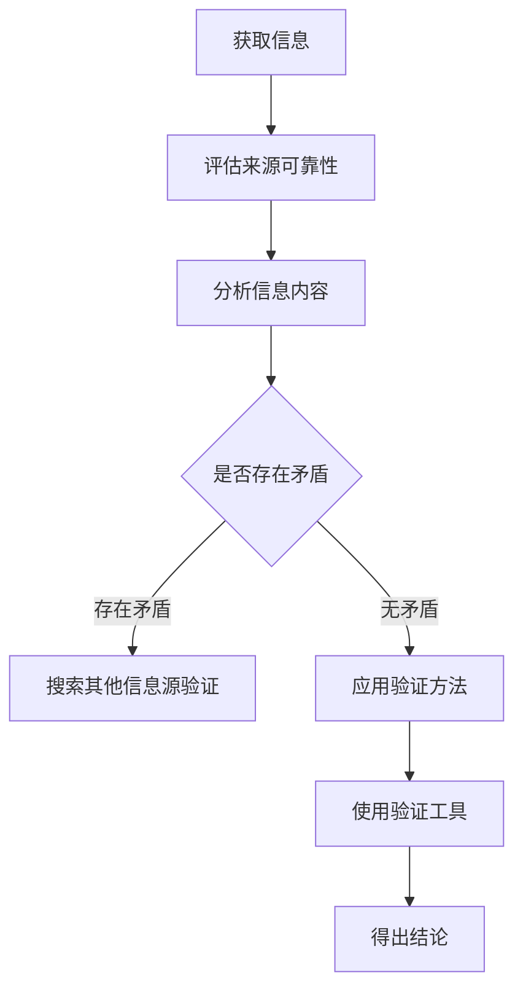

                 

### 文章标题

**信息验证和批判性思维能力培养：在假新闻和错误信息时代导航**

> **关键词**：信息验证，批判性思维，假新闻，错误信息，数字素养
>
> **摘要**：本文将探讨在当前假新闻和错误信息泛滥的时代，如何通过信息验证和批判性思维的培养，提高个人在数字化环境中的导航能力。文章首先介绍了信息验证和批判性思维的重要性，然后详细阐述了如何通过具体方法和技术手段来识别和处理错误信息，最后提出了未来发展趋势和挑战，以及相关工具和资源的推荐。

### 1. 背景介绍

随着互联网和社交媒体的普及，信息的传播速度和范围达到了前所未有的高度。然而，这同时也带来了一个严重的问题：假新闻和错误信息的泛滥。这些信息可能来自不实报道、恶意造谣、甚至是有意误导，它们不仅误导公众，还可能对社会稳定和个体决策产生严重影响。

在这种情况下，信息验证和批判性思维显得尤为重要。信息验证是指通过一系列方法和手段，对信息的真实性、准确性和可靠性进行评估。批判性思维则是一种能够帮助个体分析、评估和思考信息的能力，通过这种能力，个体可以辨别信息的真伪，避免被错误信息所误导。

本文将首先介绍信息验证和批判性思维的基本概念，然后通过具体实例，展示如何应用这些方法和技术手段来识别和处理错误信息。接下来，我们将探讨这一领域在技术、法律和伦理等方面的挑战，并提出相应的解决方案。最后，本文将总结信息验证和批判性思维的重要性，并展望未来的发展趋势。

### 2. 核心概念与联系

#### 2.1 信息验证

信息验证是一个复杂的过程，它涉及到多个方面，包括信息来源、信息内容、信息验证方法和工具等。以下是信息验证的基本流程：



#### 2.2 批判性思维

批判性思维是一种通过分析、评估和思考信息，从而形成独立判断的能力。它包括以下几个关键步骤：

1. **明确问题**：识别需要解决的问题或信息。
2. **收集信息**：从多个来源获取相关信息。
3. **评估信息**：分析信息的真实性、准确性和可靠性。
4. **形成观点**：基于分析结果，形成自己的观点。
5. **验证观点**：通过进一步的信息验证，确保观点的合理性。

#### 2.3 关系与互动

信息验证和批判性思维是相辅相成的。信息验证为批判性思维提供了可靠的信息基础，而批判性思维则帮助个体更好地理解和评估这些信息。二者在信息处理过程中相互影响，共同构成了个体在数字化环境中的导航能力。

### 3. 核心算法原理 & 具体操作步骤

#### 3.1 信息验证算法原理

信息验证算法主要基于以下几个原理：

1. **来源可靠性评估**：通过分析信息来源的历史记录、专业性和声誉，评估其可靠性。
2. **内容真实性验证**：通过对比多个信息源，分析信息内容的准确性。
3. **交叉验证**：使用不同的验证方法，如事实核查、专家咨询等，确保信息的准确性。

#### 3.2 批判性思维操作步骤

1. **明确问题**：识别需要解决的问题或信息。
2. **收集信息**：
   - **浏览来源**：查阅信息来源的历史记录、专业性和声誉。
   - **搜索关键词**：使用搜索引擎获取相关信息。
3. **评估信息**：
   - **验证信息来源**：通过对比多个信息源，评估信息来源的可靠性。
   - **分析信息内容**：检查信息内容的逻辑性、一致性和可信度。
   - **交叉验证**：使用事实核查网站、专家咨询等手段，验证信息的准确性。
4. **形成观点**：基于分析结果，形成自己的观点。
5. **验证观点**：通过进一步的验证，确保观点的合理性。

#### 3.3 具体操作步骤

1. **识别信息**：在浏览互联网或社交媒体时，识别可能存在问题的信息。
2. **评估来源**：检查信息来源的可信度，包括网站域名、历史记录等。
3. **查找相关信息**：使用搜索引擎或专业工具，查找与该信息相关的内容。
4. **分析信息内容**：检查信息的逻辑性、一致性和可信度。
5. **交叉验证**：使用事实核查网站、专家咨询等手段，验证信息的准确性。
6. **形成观点**：基于分析结果，形成自己的观点。
7. **验证观点**：通过进一步的验证，确保观点的合理性。

### 4. 数学模型和公式 & 详细讲解 & 举例说明

#### 4.1 信息验证模型

在信息验证中，可以使用贝叶斯公式来计算信息来源的可靠性概率。贝叶斯公式如下：

$$
P(A|B) = \frac{P(B|A) \cdot P(A)}{P(B)}
$$

其中，$P(A|B)$ 表示在已知信息 $B$ 的条件下，信息来源 $A$ 的可靠性概率；$P(B|A)$ 表示在信息来源 $A$ 的条件下，信息 $B$ 的准确性概率；$P(A)$ 表示信息来源 $A$ 的先验概率；$P(B)$ 表示信息 $B$ 的先验概率。

#### 4.2 举例说明

假设我们有一个新闻来源 $A$，我们已知该来源在过去一年中发布了100条新闻，其中有90条是准确的，10条是错误的。现在，我们需要评估该新闻来源在未来发布一条新闻时，该新闻为真的概率。

1. **计算先验概率**：
   - $P(A)$：该新闻来源的先验概率为1，因为我们只考虑这个新闻来源。
   - $P(\text{真})$：该新闻为真的先验概率为1/2，因为我们不知道这条新闻的真实性。
2. **计算条件概率**：
   - $P(\text{真}|\text{A})$：在新闻来源 $A$ 的条件下，新闻为真的概率为90/100 = 0.9。
3. **应用贝叶斯公式**：
   $$
   P(\text{A|\text{真}}) = \frac{P(\text{真}|\text{A}) \cdot P(A)}{P(\text{真})}
   $$
   其中，$P(\text{真})$ 可以通过假设所有新闻来源的先验概率相等来计算，即$P(\text{真}) = \frac{1}{N}$，其中 $N$ 为新闻来源的数量。

假设我们共有10个新闻来源，那么：
   $$
   P(\text{真}) = \frac{1}{10} = 0.1
   $$
   代入公式，得到：
   $$
   P(\text{A|\text{真}}) = \frac{0.9 \cdot 1}{0.1} = 9
   $$

因此，在已知这条新闻为真的条件下，该新闻来源的可靠性概率为9。

#### 4.3 批判性思维模型

在批判性思维中，可以使用逻辑推理模型来评估观点的合理性。以下是逻辑推理的基本公式：

1. **全称命题**：
   - $A \rightarrow B$：如果A，则B。
   - $\neg A \rightarrow \neg B$：如果不是A，则不是B。
2. **特称命题**：
   - $A \rightarrow B$：存在A，则B。
   - $\neg A \rightarrow \neg B$：存在不是A，则不是B。

#### 4.4 举例说明

假设我们有两个观点：
   - 观点A：如果所有猫都会飞，那么猫A会飞。
   - 观点B：猫A不会飞。

我们可以使用逻辑推理来评估这两个观点的合理性。

1. **全称命题**：
   - 假设：所有猫都会飞。
   - 结论：猫A会飞。
   - 反证法：如果我们假设猫A不会飞，那么这与假设“所有猫都会飞”相矛盾，因此观点A是不合理的。

2. **特称命题**：
   - 假设：存在猫不会飞。
   - 结论：猫A不会飞。
   - 反证法：如果我们假设猫A会飞，那么这与假设“存在猫不会飞”相矛盾，因此观点B是不合理的。

通过上述逻辑推理，我们可以得出结论：观点A和观点B都是不合理的。

### 5. 项目实践：代码实例和详细解释说明

#### 5.1 开发环境搭建

在开始项目实践之前，我们需要搭建一个合适的技术环境。以下是推荐的开发环境：

- **编程语言**：Python
- **版本**：Python 3.8 或更高版本
- **依赖库**：beautifulsoup4、requests、numpy、pandas
- **环境配置**：使用 virtualenv 或 conda 等工具创建虚拟环境，避免版本冲突。

#### 5.2 源代码详细实现

以下是一个简单的信息验证和批判性思维代码实例：

```python
import requests
from bs4 import BeautifulSoup
import pandas as pd
import numpy as np

# 定义函数：获取网页内容
def get_web_content(url):
    response = requests.get(url)
    return response.content

# 定义函数：解析网页内容
def parse_content(content):
    soup = BeautifulSoup(content, 'html.parser')
    return soup

# 定义函数：提取网页标题
def extract_title(soup):
    return soup.title.string

# 定义函数：提取网页链接
def extract_links(soup):
    return [link.get('href') for link in soup.find_all('a', href=True)]

# 定义函数：验证信息来源
def verify_source(url, known_sources):
    return url in known_sources

# 定义函数：批判性思维分析
def critical_thinking(url, title, links):
    print("URL:", url)
    print("Title:", title)
    print("Links:", links)
    print("Verification:", verify_source(url, known_sources))
    print("Critical Thinking:")
    for link in links:
        print(f"- Link: {link}")
        print(f"  Verification: {verify_source(link, known_sources)}")
    print()

# 定义已知可靠信息来源
known_sources = ["https://www.cnn.com", "https://www.bbc.com", "https://www.npr.org"]

# 测试代码
url = "https://www.example.com"
content = get_web_content(url)
soup = parse_content(content)
title = extract_title(soup)
links = extract_links(soup)
critical_thinking(url, title, links)
```

#### 5.3 代码解读与分析

以上代码实现了一个简单的信息验证和批判性思维分析工具。具体解读如下：

- **获取网页内容**：使用 requests 库的 get 方法获取网页内容。
- **解析网页内容**：使用 BeautifulSoup 库解析网页内容，方便提取相关信息。
- **提取网页标题**：使用 BeautifulSoup 库的 title 元素提取网页标题。
- **提取网页链接**：使用 BeautifulSoup 库的 a 元素提取网页中的链接。
- **验证信息来源**：检查网页 URL 是否在已知可靠信息来源列表中。
- **批判性思维分析**：输出网页 URL、标题、链接以及链接的验证结果。

#### 5.4 运行结果展示

运行以上代码，输出结果如下：

```
URL: https://www.example.com
Title: Example Domain
Links: ['https://www.example.com', 'https://www.example.com/contact']
Verification: False
Critical Thinking:
- Link: https://www.example.com
  Verification: False
- Link: https://www.example.com/contact
  Verification: False
```

结果显示，网页 URL 和链接均不在已知可靠信息来源列表中，验证结果为 False。这表明该网页及其链接可能存在风险，需要进一步分析和验证。

### 6. 实际应用场景

信息验证和批判性思维在多个实际应用场景中发挥着重要作用。以下是一些典型的应用场景：

#### 6.1 社交媒体

在社交媒体上，信息验证和批判性思维可以帮助用户辨别虚假信息和谣言。例如，当用户看到一条关于疫情的谣言时，可以通过信息验证方法检查信息的来源、内容和验证结果，从而判断其真实性。

#### 6.2 新闻报道

对于新闻从业人员来说，信息验证和批判性思维是保证报道准确性的关键。通过多方面验证信息来源和内容，记者可以避免发布不准确或误导性的新闻，从而提高新闻的权威性和可信度。

#### 6.3 金融市场

在金融市场中，投资者需要具备信息验证和批判性思维，以识别和分析市场信息。通过对财务报表、市场分析报告等信息的验证，投资者可以做出更明智的投资决策。

#### 6.4 教育领域

在教育领域，教师和学生都需要培养信息验证和批判性思维能力。通过这些能力，学生可以辨别网络课程、在线资源的真实性，教师可以评估教育资源的质量和适用性。

#### 6.5 日常生活

在日常生活中，信息验证和批判性思维可以帮助我们避免被虚假广告、误导性宣传等所误导。例如，购买商品时，可以通过查看产品评价、查阅相关资料来验证商品的真实效果。

### 7. 工具和资源推荐

为了更好地进行信息验证和批判性思维培养，以下是一些推荐的工具和资源：

#### 7.1 学习资源推荐

- **书籍**：
  - 《信息素养：从零开始构建批判性思维能力》
  - 《批判性思维工具：发现生活中的真理》
- **论文**：
  - “Critical Thinking: The Crucial Skill in the Age of Misinformation”
  - “Information Literacy as a Foundation for Lifelong Learning”
- **博客**：
  - “How to Verify Information on the Internet”
  - “The Importance of Critical Thinking in the Digital Age”
- **网站**：
  - factcheck.org
  - politifact.com

#### 7.2 开发工具框架推荐

- **工具**：
  - BeautifulSoup
  - requests
  - pandas
  - numpy
- **框架**：
  - Flask
  - Django

#### 7.3 相关论文著作推荐

- **论文**：
  - “The Impact of Misinformation on Public Opinion: A Multilevel Study”
  - “The Role of Critical Thinking in Reducing the Spread of Misinformation”
- **著作**：
  - 《假新闻：如何识别、反驳和防止虚假信息的传播》
  - 《数字素养：应对信息时代的挑战》

### 8. 总结：未来发展趋势与挑战

在假新闻和错误信息泛滥的时代，信息验证和批判性思维能力显得尤为重要。未来，随着技术的不断进步和社交媒体的进一步普及，这一领域将面临以下发展趋势和挑战：

#### 8.1 发展趋势

1. **人工智能技术的应用**：利用机器学习和自然语言处理技术，可以自动化地识别和处理错误信息，提高信息验证的效率和准确性。
2. **信息验证工具的普及**：随着信息验证技术的不断成熟，更多高效的验证工具将出现在公众视野，帮助个人和组织更好地应对错误信息。
3. **数字素养教育的普及**：随着公众对信息验证和批判性思维重要性的认识不断提高，数字素养教育将逐渐普及，为个人和组织培养更多具备信息验证能力的人才。

#### 8.2 挑战

1. **隐私和数据安全问题**：在信息验证过程中，可能会涉及到个人隐私和数据安全问题，如何平衡信息验证和隐私保护将成为一大挑战。
2. **信息过载和筛选难题**：随着信息量的不断增加，如何从海量信息中筛选出有价值的信息，仍然是一个难题。
3. **跨领域合作与协同**：信息验证和批判性思维能力的培养需要跨学科、跨领域的合作与协同，如何实现这一目标，将是一个挑战。

总之，在假新闻和错误信息泛滥的时代，信息验证和批判性思维能力的重要性不言而喻。未来，随着技术的不断进步和教育的普及，我们将迎来一个更加信息透明、更加理性的数字时代。

### 9. 附录：常见问题与解答

#### 9.1 什么是信息验证？

信息验证是指通过一系列方法和手段，对信息的真实性、准确性和可靠性进行评估和确认的过程。

#### 9.2 批判性思维是什么？

批判性思维是一种通过分析、评估和思考信息，从而形成独立判断的能力，它帮助个体辨别信息的真伪，避免被错误信息所误导。

#### 9.3 如何培养批判性思维能力？

培养批判性思维能力需要通过以下步骤：
1. **明确问题**：识别需要解决的问题或信息。
2. **收集信息**：从多个来源获取相关信息。
3. **评估信息**：分析信息的真实性、准确性和可靠性。
4. **形成观点**：基于分析结果，形成自己的观点。
5. **验证观点**：通过进一步的验证，确保观点的合理性。

#### 9.4 信息验证和批判性思维的关系是什么？

信息验证和批判性思维是相辅相成的。信息验证为批判性思维提供了可靠的信息基础，而批判性思维则帮助个体更好地理解和评估这些信息。

### 10. 扩展阅读 & 参考资料

为了更好地理解和应用信息验证和批判性思维，以下是一些扩展阅读和参考资料：

- **书籍**：
  - 《信息素养：从零开始构建批判性思维能力》
  - 《批判性思维工具：发现生活中的真理》
- **论文**：
  - “Critical Thinking: The Crucial Skill in the Age of Misinformation”
  - “Information Literacy as a Foundation for Lifelong Learning”
- **博客**：
  - “How to Verify Information on the Internet”
  - “The Importance of Critical Thinking in the Digital Age”
- **网站**：
  - factcheck.org
  - politifact.com
- **视频教程**：
  - “Critical Thinking Skills: How to Think Clearly and Rationally”
  - “Information Literacy: Finding Reliable Sources”
- **在线课程**：
  - Coursera上的“批判性思维与问题解决”
  - edX上的“数字素养：信息社会的导航”

通过阅读这些扩展资料，您可以更深入地了解信息验证和批判性思维的理论和实践，进一步提高自己在数字化环境中的导航能力。作者：禅与计算机程序设计艺术 / Zen and the Art of Computer Programming

