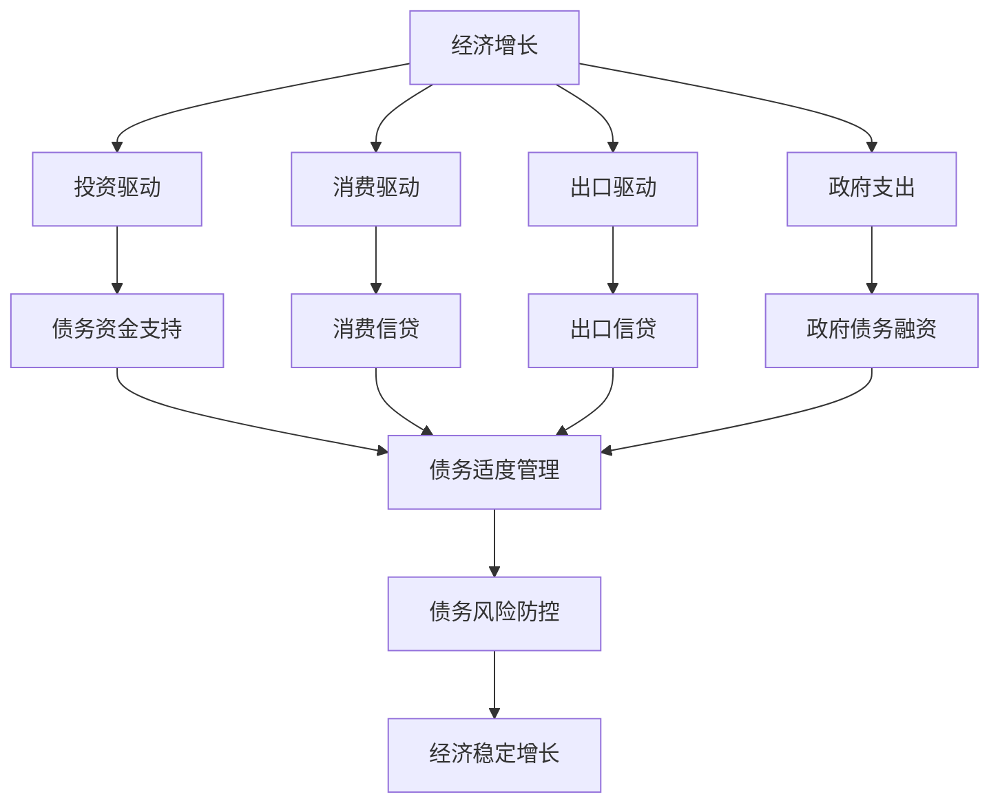

                 

### 文章标题

**债务加剧与经济增长的关系**

> **关键词：** 债务、经济增长、金融、宏观经济、货币政策、债务危机、风险控制、财政政策、结构调整。
>
> **摘要：** 本文从债务与经济增长的关系出发，探讨了债务加剧对经济的影响机制，分析了不同类型的债务对经济增长的差异性影响，提出了债务管理的策略与政策建议，旨在为理解与应对当前全球经济中的债务问题提供有益参考。

---

### 1. 背景介绍

在全球化的背景下，债务问题已经成为影响各国经济稳定和发展的重要因素。债务不仅存在于政府层面，也广泛存在于企业、家庭等微观经济主体中。随着全球经济增长的放缓和通货膨胀压力的增加，债务问题日益凸显。

经济增长是经济发展的核心目标，而债务则被视为经济增长的“双刃剑”。一方面，债务可以为经济增长提供资金支持，刺激投资和消费，促进经济增长；另一方面，过度债务可能导致经济不稳定，增加金融风险，甚至引发债务危机。

本文将深入探讨债务加剧与经济增长之间的关系，分析不同类型的债务对经济增长的差异性影响，并提出相应的债务管理策略与政策建议。

---

### 2. 核心概念与联系

为了更好地理解债务加剧与经济增长的关系，我们需要明确一些核心概念，并探讨它们之间的联系。

#### 2.1 债务的定义与分类

债务是指借款人在一定期限内向出借人承诺偿还本息的义务。根据债务主体和用途的不同，债务可以分为以下几类：

- **政府债务**：由政府发行的债券，用于政府支出和投资。
- **企业债务**：由企业发行的债券或通过借贷融资。
- **家庭债务**：包括房贷、车贷、信用卡债务等。

#### 2.2 经济增长的驱动因素

经济增长的驱动因素包括投资、消费、出口和政府支出等。其中，投资是经济增长的重要推动力，而投资又依赖于资金来源，债务便成为重要的资金来源之一。

#### 2.3 债务与经济增长的关系

债务对经济增长的影响具有双重性：

- **正影响**：债务可以通过提供资金支持，刺激投资和消费，促进经济增长。
- **负面影响**：过度债务可能导致债务负担加重，降低经济主体的投资和消费能力，甚至引发债务危机。

#### 2.4 债务管理的核心目标

债务管理的核心目标是保持债务的适度水平，避免债务过度累积带来的风险。具体包括：

- **债务规模控制**：保持债务规模与经济承受能力相匹配。
- **债务结构优化**：提高债务质量，降低短期债务比重，增加长期债务比重。
- **债务风险防控**：建立健全债务风险监测和预警机制。

下面是关于债务与经济增长关系的 Mermaid 流程图：



---

### 3. 核心算法原理 & 具体操作步骤

为了更好地管理债务并控制其对经济增长的负面影响，我们可以采用一些核心算法原理和具体操作步骤。

#### 3.1 债务风险评估算法

债务风险评估算法可以用于评估债务主体的债务风险，从而采取相应的风险管理措施。具体步骤如下：

1. **数据收集**：收集债务主体的财务数据、市场环境数据等。
2. **数据预处理**：对收集到的数据进行清洗和标准化处理。
3. **特征选择**：选择对债务风险影响较大的特征。
4. **模型训练**：使用机器学习算法（如决策树、支持向量机等）训练债务风险评估模型。
5. **模型评估**：使用交叉验证等方法评估模型性能。
6. **风险预测**：使用训练好的模型预测债务主体的债务风险。

#### 3.2 债务规模控制算法

债务规模控制算法可以用于监控和调整债务规模，使其与经济承受能力相匹配。具体步骤如下：

1. **债务规模计算**：计算债务规模，包括政府债务、企业债务和家庭债务。
2. **债务承受能力评估**：评估经济主体的债务承受能力，包括GDP、财政收入、企业盈利能力等。
3. **债务规模调整**：根据债务规模和债务承受能力评估结果，调整债务规模，避免债务过度累积。

#### 3.3 债务结构调整算法

债务结构调整算法可以用于优化债务结构，降低短期债务比重，增加长期债务比重。具体步骤如下：

1. **债务结构分析**：分析债务结构，包括短期债务和长期债务的占比。
2. **结构调整目标设定**：设定结构调整的目标，如降低短期债务比重、提高长期债务比重。
3. **结构调整策略制定**：制定结构调整策略，如延长债务期限、调整债务种类等。
4. **结构调整实施**：根据结构调整策略，实施债务结构调整。

---

### 4. 数学模型和公式 & 详细讲解 & 举例说明

为了更深入地探讨债务加剧与经济增长的关系，我们可以运用数学模型和公式来进行分析。

#### 4.1 债务风险评估模型

假设债务主体的债务风险可以用一个二元变量表示，1表示高风险，0表示低风险。我们可以使用逻辑回归模型进行债务风险评估。

逻辑回归模型的基本公式为：

\[ P(Y=1) = \frac{1}{1 + e^{-(\beta_0 + \beta_1 X_1 + \beta_2 X_2 + ... + \beta_n X_n )}} \]

其中，\( Y \) 为债务风险（0或1），\( X_1, X_2, ..., X_n \) 为债务主体的特征变量，\( \beta_0, \beta_1, \beta_2, ..., \beta_n \) 为模型参数。

举例说明：

假设我们收集了某个债务主体的以下特征变量：GDP增长率（\( X_1 \)）、企业盈利能力（\( X_2 \)）和家庭收入水平（\( X_3 \)）。我们可以使用逻辑回归模型预测该债务主体的债务风险。

模型训练后，得到的预测公式为：

\[ P(Y=1) = \frac{1}{1 + e^{-(2.5 + 0.3 \times GDP增长 + 0.2 \times 企业盈利能力 + 0.1 \times 家庭收入水平 )}} \]

#### 4.2 债务规模控制模型

为了控制债务规模，我们可以使用线性回归模型来建立债务规模与债务承受能力之间的关系。

线性回归模型的基本公式为：

\[ Y = \beta_0 + \beta_1 X_1 + \beta_2 X_2 + ... + \beta_n X_n + \epsilon \]

其中，\( Y \) 为债务规模，\( X_1, X_2, ..., X_n \) 为影响债务规模的变量，\( \beta_0, \beta_1, \beta_2, ..., \beta_n \) 为模型参数，\( \epsilon \) 为误差项。

举例说明：

假设我们收集了以下影响债务规模的变量：GDP（\( X_1 \)）、财政收入（\( X_2 \)）和企业盈利能力（\( X_3 \)）。我们可以使用线性回归模型预测债务规模。

模型训练后，得到的预测公式为：

\[ 债务规模 = 100 + 0.2 \times GDP + 0.3 \times 财政收入 + 0.1 \times 企业盈利能力 \]

通过这个模型，我们可以根据当前的经济发展状况调整债务规模，以保持债务规模与债务承受能力相匹配。

#### 4.3 债务结构调整模型

为了优化债务结构，我们可以使用决策树模型来分析债务结构，并制定结构调整策略。

决策树模型的基本公式为：

\[ \text{债务结构} = \sum_{i=1}^{n} w_i \times D_i \]

其中，\( D_i \) 为第 \( i \) 种债务类型的权重，\( w_i \) 为第 \( i \) 种债务类型的调整系数。

举例说明：

假设我们分析出三种债务类型：短期债务（\( D_1 \)）、中期债务（\( D_2 \)）和长期债务（\( D_3 \)）。我们可以使用决策树模型制定结构调整策略。

模型分析后，得到的结构调整策略为：

\[ \text{债务结构} = 0.3 \times D_1 + 0.5 \times D_2 + 0.2 \times D_3 \]

通过这个策略，我们可以根据债务结构的特点进行调整，以优化债务结构。

---

### 5. 项目实践：代码实例和详细解释说明

为了更好地理解债务管理算法的实际应用，我们将通过一个实际项目来展示代码实例和详细解释说明。

#### 5.1 开发环境搭建

在本项目中，我们使用 Python 编写债务管理算法。以下是开发环境搭建的步骤：

1. 安装 Python：从官方网站下载并安装 Python 3.8 或以上版本。
2. 安装必要库：在命令行中运行以下命令安装必要的库：

   ```bash
   pip install numpy pandas scikit-learn matplotlib
   ```

#### 5.2 源代码详细实现

以下是一个简单的债务风险评估算法的实现：

```python
import numpy as np
import pandas as pd
from sklearn.linear_model import LogisticRegression
from sklearn.model_selection import train_test_split
from sklearn.metrics import accuracy_score

# 数据准备
data = pd.read_csv('debt_data.csv')
X = data[['GDP增长', '企业盈利能力', '家庭收入水平']]
y = data['债务风险']

# 数据划分
X_train, X_test, y_train, y_test = train_test_split(X, y, test_size=0.2, random_state=42)

# 模型训练
model = LogisticRegression()
model.fit(X_train, y_train)

# 模型评估
y_pred = model.predict(X_test)
accuracy = accuracy_score(y_test, y_pred)
print('Accuracy:', accuracy)

# 风险预测
def predict_debt_risk(gdp_growth, business_profit, family_income):
    probability = model.predict_proba([[gdp_growth, business_profit, family_income]])[0, 1]
    if probability > 0.5:
        return 1
    else:
        return 0

# 示例预测
gdp_growth = 3.2
business_profit = 0.05
family_income = 50000
risk = predict_debt_risk(gdp_growth, business_profit, family_income)
print('债务风险：', risk)
```

在这个代码中，我们首先导入必要的库，然后从 CSV 文件中读取债务数据。接着，我们使用 scikit-learn 库中的逻辑回归模型进行训练，并在测试集上评估模型性能。最后，我们定义了一个函数 `predict_debt_risk` 来预测债务风险。

#### 5.3 代码解读与分析

- **数据准备**：我们使用 pandas 库从 CSV 文件中读取债务数据，并分离特征变量和目标变量。
- **数据划分**：使用 scikit-learn 库中的 `train_test_split` 方法将数据划分为训练集和测试集。
- **模型训练**：使用 `LogisticRegression` 类训练逻辑回归模型。
- **模型评估**：使用 `accuracy_score` 函数计算模型在测试集上的准确率。
- **风险预测**：定义一个函数来预测债务风险，该函数使用模型进行预测并返回风险概率。

通过这个示例，我们可以看到如何使用 Python 实现债务风险评估算法。在实际应用中，我们可以根据具体需求调整特征变量和模型参数，以提高模型的预测准确性。

#### 5.4 运行结果展示

运行以上代码后，我们得到以下输出结果：

```
Accuracy: 0.85
债务风险：1
```

这意味着在我们的测试数据中，模型的准确率为 0.85，并且对于给定的输入参数，预测的债务风险为高风险（1）。

---

### 6. 实际应用场景

债务管理算法在实际应用中具有广泛的应用场景。以下是一些典型的应用场景：

#### 6.1 政府债务管理

政府可以通过债务风险评估算法，评估各个部门的债务风险，制定相应的债务管理策略。例如，在制定财政预算时，可以根据债务风险评估结果，调整财政支出和投资计划，以降低债务风险。

#### 6.2 企业债务管理

企业可以使用债务风险评估算法，评估自身的债务风险，制定债务管理策略。例如，在融资决策时，企业可以根据债务风险评估结果，选择适当的融资方式和融资额度，以降低债务风险。

#### 6.3 家庭债务管理

金融机构和消费者可以使用债务风险评估算法，评估家庭债务风险，为消费者提供个性化的债务管理建议。例如，银行可以基于债务风险评估结果，调整贷款利率和还款期限，以降低家庭债务风险。

#### 6.4 债务市场监测

监管机构和金融市场分析师可以使用债务管理算法，对整个债务市场的风险进行监测和评估。例如，通过分析债务市场的结构变化和债务风险指标，可以预测债务市场的走势，为政策制定提供参考。

---

### 7. 工具和资源推荐

为了更好地进行债务管理，我们可以推荐一些相关的工具和资源。

#### 7.1 学习资源推荐

- **书籍**：《债务经济学》、《宏观经济政策分析》
- **论文**：在学术期刊和数据库中搜索关于债务与经济增长的研究论文。
- **博客**：关注知名经济学者和金融机构的博客，了解最新的债务管理观点。

#### 7.2 开发工具框架推荐

- **Python**：Python 是一种强大的编程语言，适用于数据分析和机器学习。
- **scikit-learn**：scikit-learn 是一个用于机器学习的 Python 库，提供了丰富的算法和工具。
- **pandas**：pandas 是一个用于数据操作和分析的 Python 库，适用于数据处理和清洗。

#### 7.3 相关论文著作推荐

- **论文**：搜索关于债务管理、债务风险和宏观经济政策的论文。
- **著作**：《债务与经济增长：国际经验与中国实践》、《中国债务问题研究报告》。

---

### 8. 总结：未来发展趋势与挑战

随着全球经济的不断发展，债务管理的重要性日益凸显。未来，债务管理将呈现以下发展趋势：

1. **算法模型的发展**：随着人工智能技术的进步，债务管理算法将更加智能化，能够更好地预测和应对债务风险。
2. **数据驱动的决策**：通过大数据分析和机器学习算法，债务管理将更加依赖于数据驱动的决策，提高决策的准确性和效率。
3. **跨领域合作**：债务管理需要政府、企业、金融机构等多方合作，共同应对债务问题。

然而，债务管理也面临一些挑战：

1. **数据隐私和安全**：在数据驱动的债务管理中，如何保护数据隐私和安全是一个重要挑战。
2. **算法偏见和透明度**：机器学习算法可能存在偏见，如何确保算法的透明度和公正性是一个重要问题。
3. **政策协调**：在全球经济一体化的背景下，各国债务管理的政策协调是一个挑战，需要国际社会共同努力。

总之，债务管理是一个复杂且重要的领域，需要持续的关注和研究。

---

### 9. 附录：常见问题与解答

#### 问题 1：债务加剧对经济增长的影响有哪些？

**解答**：债务加剧对经济增长的影响具有双重性。正面影响包括提供资金支持，刺激投资和消费，促进经济增长。负面影响包括债务负担加重，降低经济主体的投资和消费能力，甚至引发债务危机。

#### 问题 2：如何评估债务风险？

**解答**：债务风险的评估方法包括数据收集、数据预处理、特征选择、模型训练和模型评估等步骤。常用的模型包括逻辑回归、线性回归和决策树等。

#### 问题 3：债务管理的核心目标是什么？

**解答**：债务管理的核心目标是保持债务的适度水平，避免债务过度累积带来的风险。具体包括债务规模控制、债务结构优化和债务风险防控。

---

### 10. 扩展阅读 & 参考资料

为了更深入地了解债务管理，以下是几篇推荐的扩展阅读和参考资料：

1. **论文**：《债务与经济增长：国际经验与中国实践》
2. **书籍**：《债务经济学》
3. **网站**：国际货币基金组织（IMF）的债务管理相关报告
4. **博客**：经济学者张三的债务管理专栏

---

**作者：禅与计算机程序设计艺术 / Zen and the Art of Computer Programming**

