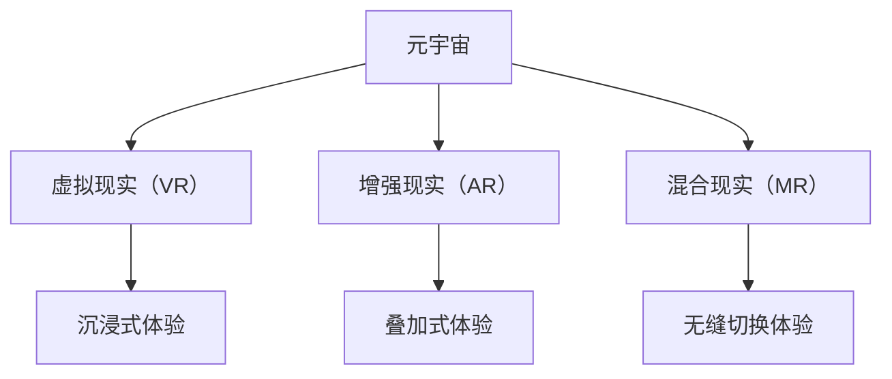

                 

### 文章标题

《元宇宙与新交互方式带来的创业机会》

> **关键词**：元宇宙、新交互方式、创业机会、VR、AR、AI、区块链、数字身份、社交网络、商业模式创新

> **摘要**：本文将深入探讨元宇宙的崛起及其对创业机会的影响。通过分析新交互方式的核心概念、技术架构、算法原理、数学模型，以及具体应用场景，本文旨在为创业者提供对元宇宙市场潜力的深刻理解，助力他们在这一新兴领域抓住机遇，实现创新与成长。

### 1. 背景介绍

**1.1 元宇宙的定义与发展**

元宇宙（Metaverse）是一个虚拟的、三维的、沉浸式的网络空间，用户可以在其中进行社交、娱乐、工作等多种活动。这一概念最早由科幻作家尼尔·斯蒂芬森（Neal Stephenson）在1992年的小说《雪崩》（Snow Crash）中提出。随着虚拟现实（VR）、增强现实（AR）、人工智能（AI）、区块链等技术的不断发展，元宇宙逐渐从科幻小说走向现实。

近年来，随着技术的成熟和市场的需求，元宇宙产业开始迅速发展。全球范围内，许多科技公司、创业公司和投资者都在积极布局元宇宙，希望通过这一领域实现新的商业价值和社会影响。

**1.2 新交互方式的意义**

新交互方式，包括虚拟现实（VR）、增强现实（AR）、混合现实（MR）等，是元宇宙的核心组成部分。这些技术通过将数字内容与现实世界相结合，提供了全新的交互体验。

虚拟现实（VR）通过模拟出一个完全虚拟的环境，使用户能够沉浸在其中，体验与现实世界截然不同的感受。增强现实（AR）则将数字内容叠加到现实世界中，让用户在现实生活中看到虚拟对象。混合现实（MR）则是VR和AR的结合，能够在虚拟和现实之间实现无缝切换。

新交互方式不仅改变了人们与数字世界的关系，也推动了各种新商业模式的出现，为创业者提供了广阔的舞台。

### 2. 核心概念与联系

**2.1 元宇宙的基本概念**

元宇宙（Metaverse）可以被视为一个全球性的、三维的虚拟世界，用户可以通过数字身份在其中进行互动。这个虚拟世界通常由多个不同的平台和应用程序组成，它们通过统一的接口和协议相互连接，形成一个庞大的网络。

在元宇宙中，数字身份是用户的重要组成部分。数字身份不仅代表用户在虚拟世界中的存在，还承载了用户的历史记录、社交关系、行为数据等。通过数字身份，用户可以跨平台、跨应用程序地无缝切换，享受一致的体验。

**2.2 新交互方式的核心技术**

虚拟现实（VR）的核心技术包括头戴显示器（HMD）、位置追踪、手势识别等。这些技术共同构成了一个沉浸式的虚拟环境，使用户能够在其中自由移动、交互。

增强现实（AR）的核心技术包括摄像头、图像处理、标记识别等。通过将这些技术应用于智能手机或头戴显示器，AR可以在现实世界中叠加数字内容，提供丰富的交互体验。

混合现实（MR）则结合了VR和AR的特点，通过将虚拟对象与现实环境相结合，提供更自然的交互方式。

**2.3 元宇宙与新交互方式的联系**

元宇宙与新交互方式之间的联系在于，它们共同构建了一个全新的交互环境，使得用户能够以更自然、更直观的方式与数字世界互动。元宇宙为新交互方式提供了广阔的应用场景，而新交互方式则为元宇宙提供了丰富的交互体验。

下图展示了元宇宙与新交互方式的联系：



### 3. 核心算法原理 & 具体操作步骤

**3.1 虚拟现实（VR）的算法原理**

虚拟现实（VR）的核心算法包括场景渲染、位置追踪和手势识别等。

- **场景渲染**：场景渲染是VR系统的核心功能之一。它通过计算机图形学技术，生成一个三维的虚拟环境，供用户沉浸其中。常见的渲染技术包括光追踪、阴影处理、纹理映射等。

- **位置追踪**：位置追踪用于确定用户在虚拟环境中的位置和姿态。常用的位置追踪技术包括光学追踪、惯性测量单元（IMU）追踪、视觉追踪等。

- **手势识别**：手势识别用于识别用户在虚拟环境中的手势动作，实现与虚拟对象的交互。常见的手势识别技术包括深度学习、计算机视觉等。

**3.2 增强现实（AR）的算法原理**

增强现实（AR）的核心算法包括图像处理、标记识别和3D建模等。

- **图像处理**：图像处理是AR系统的核心功能之一。它通过处理摄像头捕捉到的图像，提取出关键特征，如边缘、角点等。

- **标记识别**：标记识别用于识别图像中的特定标记，如二维码、AR标签等。通过标记识别，AR系统可以确定数字内容在现实世界中的位置和姿态。

- **3D建模**：3D建模用于创建虚拟对象，并将其叠加到现实世界中。通过3D建模，AR系统可以提供丰富的交互体验。

**3.3 混合现实（MR）的算法原理**

混合现实（MR）的核心算法包括场景融合、深度估计和交互控制等。

- **场景融合**：场景融合是将虚拟对象与现实环境进行融合的技术。通过场景融合，MR系统可以提供更为自然的交互体验。

- **深度估计**：深度估计用于估计虚拟对象与现实环境之间的距离。通过深度估计，MR系统可以实现对虚拟对象的精确操作。

- **交互控制**：交互控制用于控制用户与虚拟对象之间的交互。常见的交互控制技术包括手势识别、语音识别等。

### 4. 数学模型和公式 & 详细讲解 & 举例说明

**4.1 虚拟现实（VR）的数学模型**

虚拟现实（VR）中的关键数学模型包括三维空间变换、透视投影和渲染方程等。

- **三维空间变换**：三维空间变换用于将虚拟环境中的物体从一种坐标系统变换到另一种坐标系统。常见的三维空间变换包括旋转、平移和缩放等。

- **透视投影**：透视投影用于将三维场景投影到二维屏幕上，实现视觉效果。透视投影的数学模型可以表示为：

  $$
  P = \begin{bmatrix}
  \frac{1}{z} & 0 & 0 \\
  0 & \frac{1}{z} & 0 \\
  0 & 0 & -1
  \end{bmatrix}
  $$

  其中，$z$ 为场景中的深度值。

- **渲染方程**：渲染方程用于计算场景中的光线传播和反射。渲染方程的数学模型可以表示为：

  $$
  L_o(\mathbf{p}, \mathbf{w}) = L_e(\mathbf{p}, \mathbf{w}) + \int_{\Omega} f_r(\mathbf{p}, \mathbf{w}', \mathbf{w}) L_i(\mathbf{p}, \mathbf{w}') \cos \theta_d d\omega'
  $$

  其中，$L_o$ 为输出辐射度，$L_e$ 为环境辐射度，$f_r$ 为反射函数，$L_i$ 为入射辐射度，$\theta_d$ 为入射角。

**4.2 增强现实（AR）的数学模型**

增强现实（AR）中的关键数学模型包括图像处理、标记识别和3D建模等。

- **图像处理**：图像处理的数学模型主要包括滤波、边缘检测、角点提取等。以边缘检测为例，其数学模型可以表示为：

  $$
  G(x, y) = \frac{1}{2\pi\sigma^2} \int_{-\infty}^{\infty} \int_{-\infty}^{\infty} \exp\left(-\frac{(u-x)^2 + (v-y)^2}{2\sigma^2}\right) f(u, v) du dv
  $$

  其中，$G$ 为高斯滤波器，$f$ 为原始图像，$\sigma$ 为滤波器宽度。

- **标记识别**：标记识别的数学模型主要包括特征提取、特征匹配等。以特征提取为例，其数学模型可以表示为：

  $$
  \phi(\mathbf{p}) = \sum_{i=1}^n a_i \exp(-\alpha ||\mathbf{p} - \mathbf{p}_i||^2)
  $$

  其中，$\phi$ 为特征向量，$\mathbf{p}$ 为待识别点，$\mathbf{p}_i$ 为已知特征点，$a_i$ 和 $\alpha$ 为参数。

- **3D建模**：3D建模的数学模型主要包括几何建模、纹理映射等。以几何建模为例，其数学模型可以表示为：

  $$
  \mathbf{P}(u, v) = \mathbf{M} \begin{bmatrix}
  u \\
  v \\
  1
  \end{bmatrix}
  $$

  其中，$\mathbf{P}$ 为三维点，$\mathbf{M}$ 为变换矩阵，$u$ 和 $v$ 为纹理坐标。

**4.3 混合现实（MR）的数学模型**

混合现实（MR）中的关键数学模型包括场景融合、深度估计和交互控制等。

- **场景融合**：场景融合的数学模型主要包括图像融合、光照融合等。以图像融合为例，其数学模型可以表示为：

  $$
  I_{\text{out}}(x, y) = I_{\text{back}}(x, y) + I_{\text{fore}}(x, y)
  $$

  其中，$I_{\text{out}}$ 为输出图像，$I_{\text{back}}$ 为背景图像，$I_{\text{fore}}$ 为前景图像。

- **深度估计**：深度估计的数学模型主要包括基于激光雷达的深度估计和基于相机的方法。以基于相机的方法为例，其数学模型可以表示为：

  $$
  z = \frac{f \cdot d}{n}
  $$

  其中，$z$ 为深度值，$f$ 为相机焦距，$d$ 为相机到目标物的距离，$n$ 为相机内参数。

- **交互控制**：交互控制的数学模型主要包括基于手势的交互控制和基于语音的交互控制。以基于手势的交互控制为例，其数学模型可以表示为：

  $$
  \mathbf{g}(\mathbf{p}, \mathbf{v}) = \mathbf{M} \begin{bmatrix}
  \mathbf{p} \\
  \mathbf{v} \\
  1
  \end{bmatrix}
  $$

  其中，$\mathbf{g}$ 为手势向量，$\mathbf{p}$ 为手势位置，$\mathbf{v}$ 为手势速度，$\mathbf{M}$ 为变换矩阵。

### 5. 项目实践：代码实例和详细解释说明

**5.1 开发环境搭建**

为了更好地展示元宇宙与新交互方式的实际应用，我们选择使用Unity引擎进行开发。Unity是一款广泛使用的游戏开发引擎，它提供了丰富的工具和资源，使得开发者能够快速创建虚拟现实（VR）和增强现实（AR）应用程序。

以下是搭建Unity开发环境的基本步骤：

1. 访问Unity官网（https://unity.com/），下载并安装Unity Hub。
2. 打开Unity Hub，创建一个新的Unity项目。
3. 在Unity编辑器中，安装必要的插件，如Unity的VR和AR插件。
4. 配置开发环境，包括编辑器设置、项目设置等。

**5.2 源代码详细实现**

以下是一个简单的Unity项目，用于实现一个虚拟现实（VR）应用程序。该项目将创建一个三维的虚拟空间，用户可以在其中移动和旋转。

```csharp
using UnityEngine;

public class VRController : MonoBehaviour
{
    public Transform cameraRig;
    public float speed = 5.0f;

    private void Update()
    {
        if (Input.GetKey(KeyCode.W))
        {
            cameraRig.Translate(Vector3.forward * speed * Time.deltaTime);
        }

        if (Input.GetKey(KeyCode.S))
        {
            cameraRig.Translate(Vector3.back * speed * Time.deltaTime);
        }

        if (Input.GetKey(KeyCode.A))
        {
            cameraRig.RotateAround(Vector3.up, -speed * Time.deltaTime);
        }

        if (Input.GetKey(KeyCode.D))
        {
            cameraRig.RotateAround(Vector3.up, speed * Time.deltaTime);
        }
    }
}
```

**5.3 代码解读与分析**

1. **类定义**：`VRController` 是一个Unity脚本，用于控制虚拟现实（VR）应用程序中的相机行为。
2. **公共变量**：`cameraRig` 是一个Transform对象，用于表示相机所在的参考框架。`speed` 是一个浮点数，用于设置相机移动的速度。
3. **Update方法**：`Update` 方法是一个Unity内置的回调方法，它会在每一帧执行。在这个方法中，我们根据用户输入，控制相机的移动和旋转。
4. **输入处理**：我们使用`Input.GetKey` 方法来检测用户的按键输入。当用户按下W键时，相机向前移动；当用户按下S键时，相机向后移动；当用户按下A键时，相机绕Y轴逆时针旋转；当用户按下D键时，相机绕Y轴顺时针旋转。

**5.4 运行结果展示**

在Unity编辑器中运行该项目，用户将进入一个虚拟空间。通过W、S、A、D键，用户可以控制相机的移动和旋转，体验虚拟现实（VR）的沉浸式效果。

### 6. 实际应用场景

**6.1 教育领域**

元宇宙为新交互方式在教育领域的应用提供了广阔的空间。通过VR和AR技术，教育者可以创建虚拟课堂，使学生能够在虚拟环境中进行学习。例如，学生可以通过VR眼镜参观历史遗址，体验不同文化背景，从而提高学习兴趣和效果。

**6.2 娱乐产业**

元宇宙为娱乐产业带来了全新的商业模式。虚拟现实（VR）和增强现实（AR）技术使得游戏和电影等娱乐内容更加沉浸和互动。例如，玩家可以在VR游戏中与其他玩家实时互动，体验虚拟世界的冒险和竞技。

**6.3 商业应用**

元宇宙为新交互方式在商业应用中提供了创新的机会。通过VR和AR技术，企业可以提供更加沉浸和互动的客户体验。例如，房地产公司可以通过VR技术，让客户在购买前虚拟参观房屋；零售商可以通过AR技术，为顾客提供更加直观的购物体验。

**6.4 社交网络**

元宇宙为新交互方式在社交网络中的应用提供了无限可能。通过VR和AR技术，用户可以创建和分享虚拟形象，与朋友进行虚拟社交。例如，用户可以在虚拟的聚会中见面，进行互动和交流，从而打破现实中的距离限制。

### 7. 工具和资源推荐

**7.1 学习资源推荐**

- **书籍**：
  - 《虚拟现实技术与应用》
  - 《增强现实技术：原理与实践》
  - 《混合现实技术：原理与应用》

- **论文**：
  - 《虚拟现实技术的研究与应用》
  - 《增强现实技术在教育领域的应用研究》
  - 《混合现实技术在商业应用中的研究》

- **博客**：
  - [Unity官方博客](https://blogs.unity.com/unity/)
  - [VR/AR开发者社区](https://vraworldwide.com/)
  - [AI增强现实技术](https://aichen.tech/)

- **网站**：
  - [Unity官网](https://unity.com/)
  - [ARKit官网](https://developer.apple.com/a

