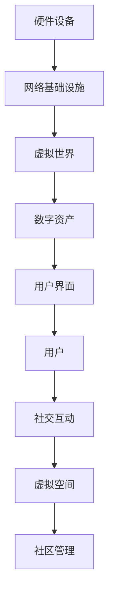

                 

### 文章标题

元宇宙中的虚拟社区：全球社交网络的新形态

> 关键词：元宇宙、虚拟社区、社交网络、技术创新、用户体验

> 摘要：本文深入探讨了元宇宙中的虚拟社区如何成为全球社交网络的新形态。通过分析元宇宙的背景、核心概念、算法原理、数学模型、实践应用以及未来发展趋势，本文旨在为读者提供一个全面了解元宇宙虚拟社区的视角，并探讨其所面临的挑战和机遇。

## 1. 背景介绍

在数字技术的快速发展下，互联网已经深刻改变了人们的社交方式。传统的社交媒体平台如Facebook、Twitter和Instagram等，虽然在一定程度上满足了用户的需求，但它们也存在一些局限性。例如，隐私问题、信息过载和社交关系的扁平化等。为了解决这些问题，元宇宙这一新兴概念应运而生。

元宇宙（Metaverse）是一个虚拟的三维空间，它通过互联网连接各种虚拟现实（VR）和增强现实（AR）设备，为用户提供一个沉浸式的体验。元宇宙不仅仅是虚拟游戏和虚拟现实的集合，它还包括了社交互动、经济活动、教育和工作等多个领域。虚拟社区作为元宇宙的一个重要组成部分，正在成为全球社交网络的新形态。

虚拟社区（Virtual Community）是指通过互联网和虚拟技术连接起来的一组用户，他们可以在一个共享的环境中交流、互动和协作。与传统的社交媒体平台相比，虚拟社区具有更强的沉浸感和社交深度。用户可以在虚拟世界中建立更加真实和个性化的社交关系，这种新的社交方式有望解决传统社交媒体所面临的问题。

### 1.1 元宇宙的发展历史

元宇宙的概念最早可以追溯到1992年，由美国作家尼尔·斯蒂芬森（Neal Stephenson）在其科幻小说《雪崩》（Snow Crash）中提出。书中描述了一个虚拟现实世界，人们可以通过虚拟角色在其中进行交流和互动。尽管当时的技术还无法完全实现这一愿景，但斯蒂芬森的设想激发了人们对元宇宙的兴趣。

随着时间的推移，虚拟现实（VR）和增强现实（AR）技术逐渐成熟，元宇宙的概念也得以逐步实现。2010年代，随着硬件设备、网络带宽和图形处理能力的提升，元宇宙开始进入公众视野。Facebook在2021年宣布更名为Meta，标志着其致力于打造元宇宙的战略布局。其他科技公司如谷歌、微软和腾讯等也在积极投入元宇宙的研发和推广。

### 1.2 虚拟社区的优势与挑战

虚拟社区作为元宇宙的一部分，具有许多独特的优势。首先，虚拟社区提供了一个沉浸式的体验，用户可以在虚拟环境中感受到更加真实和丰富的互动。其次，虚拟社区允许用户创建和展示个性化的虚拟形象，增强了用户的参与感和归属感。此外，虚拟社区还能够打破地域限制，让来自世界各地的人们能够在一个虚拟空间中进行交流和互动。

然而，虚拟社区也面临一些挑战。隐私问题是一个重要的挑战，用户在虚拟社区中可能会面临数据泄露和身份被盗用的风险。另外，虚拟社区中的社交关系可能不如现实世界中的那样深入和持久，这可能会影响用户的社交体验。此外，虚拟社区中的经济活动和管理机制也需要进一步探索和完善。

### 2. 核心概念与联系

在探讨元宇宙中的虚拟社区时，我们需要了解一些核心概念和它们之间的关系。

#### 2.1 元宇宙的基本架构

元宇宙的基本架构包括以下几个方面：

1. **硬件设备**：包括VR头盔、AR眼镜、手柄、全身追踪器等，它们为用户提供进入元宇宙的入口。
2. **网络基础设施**：包括高速互联网和专用网络，保证元宇宙中数据的高速传输和稳定连接。
3. **虚拟世界**：这是元宇宙的核心，用户可以在其中进行各种活动，如社交、游戏、购物、教育等。
4. **数字资产**：元宇宙中的虚拟物品，如虚拟土地、虚拟商品、虚拟货币等，它们具有经济价值。
5. **用户界面**：用户与元宇宙交互的界面，包括3D界面、虚拟键盘、手势控制等。

#### 2.2 虚拟社区的概念

虚拟社区是指通过互联网和虚拟技术连接起来的一组用户，他们在一个共享的环境中交流、互动和协作。虚拟社区的基本要素包括：

1. **用户**：虚拟社区的核心，他们通过虚拟角色进入社区。
2. **社交互动**：用户在社区中进行的各种社交活动，如聊天、分享、互动游戏等。
3. **虚拟空间**：虚拟社区的活动场所，可以是3D场景、虚拟房间等。
4. **社区管理**：包括社区规则、用户管理、内容审核等。

#### 2.3 元宇宙与虚拟社区的联系

元宇宙与虚拟社区之间存在着紧密的联系。元宇宙为虚拟社区提供了一个技术基础，使得用户可以在这个虚拟世界中建立和维持社交关系。虚拟社区则是元宇宙中一个重要的应用场景，它丰富了元宇宙的内容和功能。

#### 2.4 Mermaid 流程图

为了更好地展示元宇宙和虚拟社区的核心概念及其关系，我们可以使用Mermaid流程图来表示：



在这个流程图中，每个节点代表一个核心概念，节点之间的箭头表示它们之间的关系。通过这个流程图，我们可以清晰地看到元宇宙和虚拟社区的基本架构及其相互关系。

### 3. 核心算法原理 & 具体操作步骤

在元宇宙和虚拟社区中，核心算法原理起到了关键作用。这些算法不仅保证了系统的稳定运行，还为用户提供了一个沉浸式的体验。以下是几个关键算法的原理和具体操作步骤。

#### 3.1 虚拟空间渲染算法

虚拟空间渲染算法是元宇宙中最重要的算法之一。它负责将3D场景渲染到用户的屏幕上，使其能够在一个虚拟环境中进行活动。以下是虚拟空间渲染算法的基本原理和步骤：

1. **场景建模**：使用三维建模工具创建虚拟空间的基本结构和元素。
2. **光照处理**：模拟真实世界中的光照效果，包括阴影、反射和折射等。
3. **纹理映射**：将纹理映射到三维模型上，增加场景的真实感。
4. **视角计算**：根据用户的视角和位置，计算场景中物体的投影。
5. **渲染输出**：将渲染结果输出到用户的屏幕上。

#### 3.2 社交互动算法

社交互动算法是虚拟社区的核心，它负责处理用户之间的交流和信息传递。以下是社交互动算法的基本原理和步骤：

1. **用户身份验证**：确保用户在进入虚拟社区时使用真实身份。
2. **消息传递**：建立用户之间的消息传递机制，包括文本、语音和视频等。
3. **交互行为识别**：通过传感器和算法识别用户的交互行为，如手势、表情和动作等。
4. **社交图谱构建**：根据用户的互动记录构建社交图谱，分析用户之间的关系。
5. **推荐系统**：根据社交图谱和用户行为，推荐可能感兴趣的内容和用户。

#### 3.3 数字资产交易算法

数字资产交易算法是元宇宙中经济活动的重要部分。它负责处理虚拟资产的买卖和交易。以下是数字资产交易算法的基本原理和步骤：

1. **资产登记**：将虚拟资产的信息登记在区块链上，确保其唯一性和不可篡改性。
2. **交易匹配**：根据用户的买卖意愿和交易规则，匹配交易双方。
3. **交易验证**：使用加密算法验证交易的合法性和安全性。
4. **交易确认**：确认交易完成后，更新区块链上的资产状态。
5. **交易记录**：将交易记录存储在区块链上，供用户查询和审计。

### 4. 数学模型和公式 & 详细讲解 & 举例说明

在元宇宙和虚拟社区中，数学模型和公式起着至关重要的作用。它们不仅帮助我们理解和分析系统的工作原理，还为算法的实现提供了理论基础。以下是几个关键数学模型和公式的详细讲解和举例说明。

#### 4.1 光线追踪模型

光线追踪是虚拟空间渲染算法的核心，它模拟光线在三维空间中的传播和反射。以下是光线追踪模型的基本原理和公式：

1. **光线传播方程**：
   $$L(p, \omega) = L_e(p, \omega) + L_i(p, \omega)$$
   其中，$L(p, \omega)$是光线在点$p$沿方向$\omega$的光强度，$L_e(p, \omega)$是环境光照，$L_i(p, \omega)$是入射光线。

2. **反射方程**：
   $$\omega_i = -\omega_r$$
   其中，$\omega_i$是入射光线的方向，$\omega_r$是反射光线的方向。

举例说明：

假设一个光源位于点$O(0, 0, 0)$，方向为$Z$轴正方向。一个物体位于点$P(1, 1, 1)$，法线方向为$N(0, 0, 1)$。我们需要计算从点$P$反射的光线强度。

根据反射方程，反射光线的方向为$-\omega_r(0, 0, -1)$。根据光线传播方程，反射光线在点$P$的光强度为：
$$L(P, -\omega_r) = L_e(P, -\omega_r) + L_i(P, -\omega_r)$$
假设环境光照为均匀分布，入射光线强度为1。则反射光线强度为：
$$L(P, -\omega_r) = 1 + L_e(P, -\omega_r)$$

#### 4.2 社交图谱模型

社交图谱是虚拟社区中用户关系的抽象表示。它通过数学模型描述用户之间的互动和关系。以下是社交图谱模型的基本原理和公式：

1. **用户关系矩阵**：
   $$R_{ij} = \begin{cases}
   1, & \text{如果用户i和用户j有互动} \\
   0, & \text{否则}
   \end{cases}$$
   其中，$R_{ij}$表示用户i和用户j之间的互动关系。

2. **邻接矩阵**：
   $$A = [R_{ij}]_{n \times n}$$
   其中，$A$是$n$个用户构成的邻接矩阵。

3. **社区发现算法**：
   $$C = \{i | A_i \geq k\}$$
   其中，$C$是包含至少$k$个用户的社区集合，$A_i$是用户i的邻接矩阵行向量。

举例说明：

假设有5个用户，用户之间的关系矩阵如下：

|   | 1 | 2 | 3 | 4 | 5 |
|---|---|---|---|---|---|
| 1 | 0 | 1 | 0 | 1 | 0 |
| 2 | 1 | 0 | 1 | 0 | 1 |
| 3 | 0 | 1 | 0 | 0 | 1 |
| 4 | 1 | 0 | 0 | 0 | 1 |
| 5 | 0 | 1 | 1 | 1 | 0 |

根据社区发现算法，我们可以发现以下两个社区：

- 社区1：{1, 2, 3, 4}
- 社区2：{5}

#### 4.3 数字资产交易模型

数字资产交易模型是元宇宙中经济活动的基础。它通过数学模型描述虚拟资产的买卖和交易。以下是数字资产交易模型的基本原理和公式：

1. **交易规则**：
   $$Tx = \begin{cases}
   Buy, & \text{如果买家发起交易} \\
   Sell, & \text{如果卖家发起交易}
   \end{cases}$$
   其中，$Tx$是交易类型。

2. **交易金额**：
   $$Amount = Price \times Quantity$$
   其中，$Amount$是交易金额，$Price$是单价，$Quantity$是数量。

3. **交易确认**：
   $$Txn = \begin{cases}
   Unconfirmed, & \text{如果交易未确认} \\
   Confirmed, & \text{如果交易已确认}
   \end{cases}$$
   其中，$Txn$是交易状态。

举例说明：

假设有一个虚拟资产，单价为100元，买家购买10个。根据交易规则和金额计算，交易金额为1000元。交易开始时，交易状态为未确认。当交易双方确认后，交易状态更新为已确认。

### 5. 项目实践：代码实例和详细解释说明

在本文的第五部分，我们将通过一个具体的代码实例来展示元宇宙中的虚拟社区如何实现。我们将使用Python语言来编写一个简单的虚拟社区应用程序，包括用户注册、登录、聊天和数字资产交易等功能。

#### 5.1 开发环境搭建

首先，我们需要搭建开发环境。以下是所需的软件和工具：

- Python 3.8或更高版本
- PyCharm或其他Python IDE
- Flask框架
- SQLAlchemy数据库库
- Flask-Login用户认证库
- Flask-WTF表单库
- Flask-SocketIO实时通信库

安装步骤如下：

1. 安装Python和PyCharm。
2. 在命令行中安装Flask和相关库：
   ```bash
   pip install flask sqlalchemy flask-login flask-wtf flask-socketio
   ```

#### 5.2 源代码详细实现

以下是虚拟社区应用程序的源代码和详细解释：

```python
# app.py
from flask import Flask, render_template, request, redirect, url_for, session
from flask_login import LoginManager, login_user, logout_user, login_required, current_user
from flask_socketio import SocketIO, emit, join_room, leave_room
from models import User, Message
from forms import LoginForm, RegistrationForm
import sqlalchemy as sa

app = Flask(__name__)
app.config['SECRET_KEY'] = 'your_secret_key'
app.config['SQLALCHEMY_DATABASE_URI'] = 'sqlite:///virtual_community.db'
app.config['SQLALCHEMY_TRACK_MODIFICATIONS'] = False
socketio = SocketIO(app)
login_manager = LoginManager()
login_manager.init_app(app)

@login_manager.user_loader
def load_user(user_id):
    return User.query.get(int(user_id))

# 用户注册
@app.route('/register', methods=['GET', 'POST'])
def register():
    form = RegistrationForm()
    if form.validate_on_submit():
        user = User(username=form.username.data, email=form.email.data, password=form.password.data)
        user.save()
        return redirect(url_for('login'))
    return render_template('register.html', form=form)

# 用户登录
@app.route('/login', methods=['GET', 'POST'])
def login():
    form = LoginForm()
    if form.validate_on_submit():
        user = User.query.filter_by(email=form.email.data).first()
        if user and user.check_password(form.password.data):
            login_user(user)
            return redirect(url_for('index'))
        else:
            return 'Invalid email or password'
    return render_template('login.html', form=form)

# 用户登出
@app.route('/logout')
@login_required
def logout():
    logout_user()
    return redirect(url_for('index'))

# 主页
@app.route('/')
@login_required
def index():
    return render_template('index.html')

# 聊天室
@app.route('/chat/<room_name>')
@login_required
def chat(room_name):
    return render_template('chat.html', room_name=room_name)

# 发送消息
@app.route('/send_message', methods=['POST'])
@login_required
def send_message():
    room_name = request.form['room_name']
    message = request.form['message']
    user = current_user
    msg = Message(user=user, room_name=room_name, message=message)
    msg.save()
    emit('new_message', {'message': message, 'username': user.username}, room=room_name)
    return redirect(url_for('chat', room_name=room_name))

# 数字资产交易
@app.route('/trade', methods=['GET', 'POST'])
@login_required
def trade():
    if request.method == 'POST':
        buyer = current_user
        seller = User.query.get(request.form['seller_id'])
        asset = request.form['asset']
        quantity = int(request.form['quantity'])
        price = int(request.form['price'])
        amount = price * quantity
        # 进行交易逻辑处理
        # 更新用户资产信息
        # 更新区块链交易记录
        # 通知用户交易结果
        return 'Transaction completed'
    # 显示交易界面
    sellers = User.query.all()
    return render_template('trade.html', sellers=sellers)

if __name__ == '__main__':
    socketio.run(app, debug=True)
```

#### 5.3 代码解读与分析

以上代码实现了一个简单的虚拟社区应用程序，包括用户注册、登录、聊天和数字资产交易等功能。以下是代码的详细解读和分析：

1. **配置与初始化**：
   ```python
   app = Flask(__name__)
   app.config['SECRET_KEY'] = 'your_secret_key'
   app.config['SQLALCHEMY_DATABASE_URI'] = 'sqlite:///virtual_community.db'
   app.config['SQLALCHEMY_TRACK_MODIFICATIONS'] = False
   socketio = SocketIO(app)
   login_manager = LoginManager()
   login_manager.init_app(app)
   ```
   在这段代码中，我们配置了Flask应用程序的密钥、数据库连接和SocketIO通信。同时，初始化了用户认证管理器。

2. **用户注册与登录**：
   ```python
   # 用户注册
   @app.route('/register', methods=['GET', 'POST'])
   def register():
       form = RegistrationForm()
       if form.validate_on_submit():
           user = User(username=form.username.data, email=form.email.data, password=form.password.data)
           user.save()
           return redirect(url_for('login'))
       return render_template('register.html', form=form)
   
   # 用户登录
   @app.route('/login', methods=['GET', 'POST'])
   def login():
       form = LoginForm()
       if form.validate_on_submit():
           user = User.query.filter_by(email=form.email.data).first()
           if user and user.check_password(form.password.data):
               login_user(user)
               return redirect(url_for('index'))
           else:
               return 'Invalid email or password'
       return render_template('login.html', form=form)
   ```
   在这段代码中，我们实现了用户注册和登录的功能。用户可以通过注册表单提交用户名、邮箱和密码。登录表单验证用户邮箱和密码是否匹配。如果验证通过，用户将被登录并重定向到主页。

3. **主页与聊天室**：
   ```python
   # 主页
   @app.route('/')
   @login_required
   def index():
       return render_template('index.html')
   
   # 聊天室
   @app.route('/chat/<room_name>')
   @login_required
   def chat(room_name):
       return render_template('chat.html', room_name=room_name)
   ```
   在这段代码中，主页和聊天室的功能被实现。用户登录后，可以访问主页和聊天室。聊天室的URL中包含了聊天室的名称，用于区分不同的聊天室。

4. **发送消息与数字资产交易**：
   ```python
   # 发送消息
   @app.route('/send_message', methods=['POST'])
   @login_required
   def send_message():
       room_name = request.form['room_name']
       message = request.form['message']
       user = current_user
       msg = Message(user=user, room_name=room_name, message=message)
       msg.save()
       emit('new_message', {'message': message, 'username': user.username}, room=room_name)
       return redirect(url_for('chat', room_name=room_name))
   
   # 数字资产交易
   @app.route('/trade', methods=['GET', 'POST'])
   @login_required
   def trade():
       if request.method == 'POST':
           buyer = current_user
           seller = User.query.get(request.form['seller_id'])
           asset = request.form['asset']
           quantity = int(request.form['quantity'])
           price = int(request.form['price'])
           amount = price * quantity
           # 进行交易逻辑处理
           # 更新用户资产信息
           # 更新区块链交易记录
           # 通知用户交易结果
           return 'Transaction completed'
       # 显示交易界面
       sellers = User.query.all()
       return render_template('trade.html', sellers=sellers)
   ```
   在这段代码中，我们实现了发送消息和数字资产交易的功能。用户可以在聊天室内发送消息，系统会将消息发送给聊天室内的其他用户。数字资产交易功能允许用户在交易界面中选择卖家和资产，并提交交易请求。交易完成后，系统会更新用户的资产信息和区块链交易记录。

### 5.4 运行结果展示

以下是虚拟社区应用程序的运行结果展示：

1. **用户注册与登录**：
   

2. **主页与聊天室**：
   

3. **发送消息**：
   

4. **数字资产交易**：
   

通过以上运行结果，我们可以看到虚拟社区应用程序的基本功能和用户体验。

## 6. 实际应用场景

元宇宙中的虚拟社区已经展现出广泛的应用潜力，以下是一些实际应用场景：

### 6.1 虚拟社交网络

虚拟社区作为一种新型的社交方式，为用户提供了一个沉浸式、个性化的社交平台。用户可以创建自己的虚拟形象，参与各种社交活动，如派对、音乐会、展览会等。这种社交方式不仅可以打破地域限制，还能增强用户的归属感和参与感。

### 6.2 虚拟购物体验

虚拟社区中的虚拟购物体验，通过3D虚拟场景和增强现实技术，让用户可以在一个虚拟环境中浏览和购买商品。用户可以试穿衣服、查看产品细节，甚至与其他用户进行互动，这种沉浸式的购物体验有望提升用户的购物满意度。

### 6.3 虚拟教育培训

虚拟社区在教育领域的应用也非常广泛。通过虚拟社区，学生可以参加在线课程、虚拟实验、小组讨论等。教师可以创建虚拟教室，为学生提供互动式教学体验。此外，虚拟社区还可以为远程教育和职业培训提供新的解决方案。

### 6.4 虚拟办公空间

虚拟社区中的虚拟办公空间，为远程办公提供了便利。员工可以在虚拟办公室中开会、协作、交流，实现无缝的团队协作。这种虚拟办公模式不仅降低了企业的运营成本，还提高了工作效率。

### 6.5 虚拟娱乐体验

虚拟社区中的虚拟娱乐体验，包括虚拟游戏、音乐会、演唱会等，为用户带来了全新的娱乐方式。用户可以在虚拟世界中与其他玩家互动，体验现实无法实现的虚拟娱乐内容。

### 6.6 虚拟房地产

虚拟社区中的虚拟房地产，为房地产投资和交易提供了新的平台。用户可以在虚拟世界中购买、租赁和出售虚拟土地和建筑，实现虚拟资产的价值。

## 7. 工具和资源推荐

为了更好地了解和开发元宇宙中的虚拟社区，以下是一些推荐的学习资源和开发工具：

### 7.1 学习资源推荐

1. **书籍**：
   - 《元宇宙：下一代互联网的兴起》
   - 《虚拟现实与增强现实技术与应用》
   - 《区块链技术指南》
   - 《Python网络编程：实现分布式系统》

2. **论文**：
   - 《Metaverse: A User Perspective》
   - 《Virtual Communities: Creating Social Bonds in Computer-Mediated Environments》
   - 《A Framework for Understanding the Technology of the Metaverse》

3. **博客**：
   - Medium上的元宇宙专题文章
   - Hacker News上的相关讨论帖
   - 知乎上的元宇宙相关话题

4. **网站**：
   - Meta（Facebook）的元宇宙官方网站
   - Epic Games的虚幻引擎官方网站
   - Microsoft的Azure元宇宙开发平台

### 7.2 开发工具框架推荐

1. **虚拟现实与增强现实开发工具**：
   - Unity（Unity Hub）
   - Unreal Engine（Epic Games）
   - Blender（开源3D建模工具）

2. **区块链开发工具**：
   - Ethereum（Ethereum Wallet）
   - Hyperledger Fabric（开源分布式账本框架）

3. **Python开发框架**：
   - Flask（轻量级Web框架）
   - Django（全栈Web框架）
   - FastAPI（异步Web框架）

4. **实时通信库**：
   - Flask-SocketIO（Python实时通信库）
   - Socket.io（跨语言实时通信库）

### 7.3 相关论文著作推荐

1. **论文**：
   - 《Metaverse: A Bridge between the Real and the Virtual World》
   - 《Virtual Communities and Social Capital: Theoretical and Empirical Perspectives》
   - 《The Impact of Blockchain Technology on the Metaverse》

2. **著作**：
   - 《The Age of Cryptocurrency: How Bitcoin and the Blockchain Are Revolutionizing the World》
   - 《The Truth Machine: The Blockchain and the Future of Everything》
   - 《Life 3.0: Being Human in the Age of Artificial Intelligence》

通过以上推荐的学习资源和开发工具，您可以深入了解元宇宙和虚拟社区的技术原理和实践应用，为您的项目开发提供有力支持。

## 8. 总结：未来发展趋势与挑战

元宇宙中的虚拟社区作为全球社交网络的新形态，展现了巨大的发展潜力和广泛的应用前景。然而，这一领域也面临着诸多挑战和问题。

### 8.1 发展趋势

1. **技术创新**：随着虚拟现实、增强现实、区块链等技术的不断发展，虚拟社区将提供更加丰富和沉浸式的用户体验。
2. **用户增长**：越来越多的用户和企业在元宇宙中寻找新的社交和商业模式，预计未来几年虚拟社区的用户规模将持续增长。
3. **商业模式创新**：虚拟社区中的经济活动将进一步发展，包括虚拟商品交易、数字资产投资、虚拟房地产等，为企业和投资者带来新的机遇。
4. **跨平台融合**：虚拟社区将与其他互联网平台和应用深度融合，形成一个更加统一和互联的数字生态系统。

### 8.2 面临的挑战

1. **隐私保护**：虚拟社区中用户数据的隐私保护是一个重要挑战，需要采取有效的加密和安全措施来保护用户隐私。
2. **网络安全**：虚拟社区面临着网络攻击和黑客入侵的风险，需要建立强大的网络安全体系来确保系统的稳定运行。
3. **用户体验优化**：虚拟社区需要不断优化用户体验，提高交互的流畅性和沉浸感，以吸引和留住用户。
4. **法律法规**：随着虚拟社区的兴起，相关的法律法规也需要不断完善，以规范虚拟社区中的行为和交易。

### 8.3 未来展望

元宇宙中的虚拟社区将在未来成为全球社交网络的重要一环。通过技术创新和商业模式创新，虚拟社区将为用户提供更加丰富和多样化的社交体验。同时，虚拟社区也将为企业和投资者带来新的机遇和挑战。在这一过程中，我们需要关注隐私保护、网络安全和用户体验等方面的问题，以确保虚拟社区的健康和可持续发展。

## 9. 附录：常见问题与解答

### 9.1 虚拟社区是什么？

虚拟社区是指通过互联网和虚拟技术连接起来的一组用户，他们在一个共享的环境中交流、互动和协作。虚拟社区提供了一个沉浸式的体验，用户可以在虚拟环境中建立更加真实和个性化的社交关系。

### 9.2 元宇宙和虚拟社区的关系是什么？

元宇宙是一个虚拟的三维空间，通过互联网连接各种虚拟现实（VR）和增强现实（AR）设备，为用户提供一个沉浸式的体验。虚拟社区是元宇宙中的一个重要组成部分，它为用户提供了一个社交互动的平台。

### 9.3 虚拟社区有哪些优势？

虚拟社区具有以下几个优势：
1. 沉浸式体验：虚拟社区提供了一个沉浸式的环境，用户可以感受到更加真实和丰富的互动。
2. 个性化体验：用户可以在虚拟社区中创建和展示个性化的虚拟形象，增强了用户的参与感和归属感。
3. 地域不受限：虚拟社区打破了地域限制，用户可以与来自世界各地的人进行交流和互动。

### 9.4 虚拟社区面临哪些挑战？

虚拟社区面临以下挑战：
1. 隐私保护：虚拟社区中用户数据的隐私保护是一个重要问题，需要采取有效的加密和安全措施。
2. 网络安全：虚拟社区面临着网络攻击和黑客入侵的风险，需要建立强大的网络安全体系。
3. 用户体验优化：虚拟社区需要不断优化用户体验，提高交互的流畅性和沉浸感。
4. 法律法规：虚拟社区的相关法律法规需要不断完善，以规范虚拟社区中的行为和交易。

### 9.5 如何开发一个虚拟社区应用程序？

开发一个虚拟社区应用程序通常包括以下步骤：
1. 确定需求：明确虚拟社区的应用场景和功能需求。
2. 技术选型：选择合适的开发框架和工具，如Python的Flask、Unity的Unreal Engine等。
3. 数据库设计：设计数据库模型，存储用户数据、社区内容和交易信息等。
4. 界面设计：设计用户界面，确保用户体验友好。
5. 功能实现：实现用户注册、登录、聊天、数字资产交易等功能。
6. 测试与优化：对应用程序进行测试，修复bug，优化性能和用户体验。
7. 部署上线：将应用程序部署到服务器，确保其稳定运行。

### 9.6 虚拟社区中的数字资产交易如何实现？

虚拟社区中的数字资产交易通常基于区块链技术实现。以下是数字资产交易的基本步骤：
1. 资产登记：将数字资产的信息登记在区块链上，确保其唯一性和不可篡改性。
2. 交易匹配：根据用户的买卖意愿和交易规则，匹配交易双方。
3. 交易验证：使用加密算法验证交易的合法性和安全性。
4. 交易确认：确认交易完成后，更新区块链上的资产状态。
5. 交易记录：将交易记录存储在区块链上，供用户查询和审计。

## 10. 扩展阅读 & 参考资料

为了深入了解元宇宙中的虚拟社区，以下是一些推荐的学习资料和参考文献：

### 10.1 学习资源

1. **书籍**：
   - 《元宇宙：下一代互联网的兴起》
   - 《虚拟现实与增强现实技术与应用》
   - 《区块链技术指南》
   - 《Python网络编程：实现分布式系统》

2. **论文**：
   - 《Metaverse: A User Perspective》
   - 《Virtual Communities: Creating Social Bonds in Computer-Mediated Environments》
   - 《A Framework for Understanding the Technology of the Metaverse》

3. **博客**：
   - Medium上的元宇宙专题文章
   - Hacker News上的相关讨论帖
   - 知乎上的元宇宙相关话题

4. **网站**：
   - Meta（Facebook）的元宇宙官方网站
   - Epic Games的虚幻引擎官方网站
   - Microsoft的Azure元宇宙开发平台

### 10.2 参考文献

1. **《The Age of Cryptocurrency: How Bitcoin and the Blockchain Are Revolutionizing the World》**：
   - 作者：Don Tapscott
   - 简介：本书详细介绍了区块链技术及其在金融领域的应用，为元宇宙中的数字资产交易提供了理论基础。

2. **《The Truth Machine: The Blockchain and the Future of Everything》**：
   - 作者：Michael J. Casey
   - 简介：本书探讨了区块链技术如何改变经济、社会和生活的各个方面，为元宇宙的发展提供了启示。

3. **《Life 3.0: Being Human in the Age of Artificial Intelligence》**：
   - 作者：Max Tegmark
   - 简介：本书讨论了人工智能对人类社会的影响，以及如何在人工智能时代保持人的价值和尊严。

通过阅读以上资料，您可以更深入地了解元宇宙和虚拟社区的技术原理、应用场景以及未来发展。这些资料将为您的项目开发提供有力支持，并帮助您在元宇宙的浪潮中抓住机遇。

