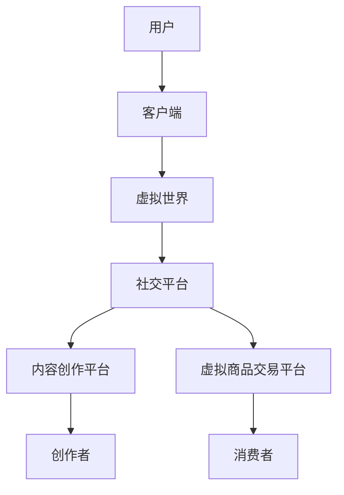
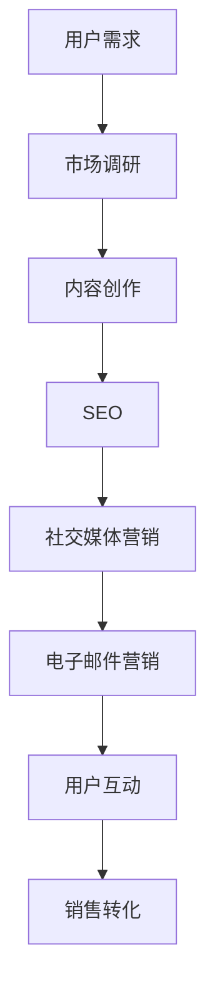
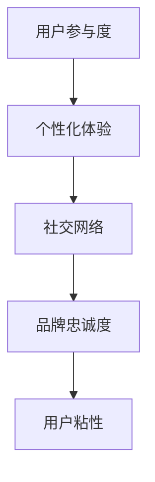

                 

### 1. 背景介绍

随着互联网和数字化技术的发展，品牌忠诚度已经成为企业成功的关键因素之一。元宇宙作为新一代的虚拟世界，其独特的互动性和沉浸感为品牌忠诚度的提升提供了全新的可能性。本文旨在探讨元宇宙中的品牌忠诚度，以及数字化营销如何通过元宇宙增强用户粘性。

品牌忠诚度是指消费者对某个品牌的长期依赖和偏好程度。它对企业的利润和市场份额有着重要影响。传统的品牌忠诚度提升方法包括广告、促销、客户服务等方面，但这些方法在数字化时代面临一定的挑战。随着用户需求的多样化和个性化，企业需要寻找新的方式来吸引和留住用户。

元宇宙是一个虚拟的、三维的、沉浸式的虚拟世界，用户可以在其中创建和互动。元宇宙的出现为品牌提供了新的营销渠道和互动方式。通过元宇宙，品牌可以与用户建立更加直接和深层次的联系，提高用户参与度和忠诚度。

数字化营销是指利用数字技术进行市场推广和销售活动。它包括搜索引擎优化、社交媒体营销、电子邮件营销等多种方式。数字化营销的优势在于可以更精准地定位目标用户，提高营销效果。

本文将首先介绍元宇宙和数字化营销的基本概念，然后深入探讨元宇宙在提升品牌忠诚度方面的作用机制，最后提出一些实际应用场景和未来发展的挑战。

### 2. 核心概念与联系

为了更好地理解元宇宙和数字化营销如何提升品牌忠诚度，我们需要明确几个核心概念：元宇宙、数字化营销和用户粘性。

#### 2.1 元宇宙

元宇宙（Metaverse）是一个虚拟的三维空间，由多个虚拟世界和平台组成，用户可以在其中进行各种互动。元宇宙通常具有以下几个特点：

- **沉浸感**：元宇宙通过虚拟现实（VR）和增强现实（AR）技术，使用户能够沉浸在虚拟环境中，获得与现实世界相似的体验。
- **互操作性**：元宇宙中的不同平台和应用程序可以互相操作，用户可以在不同平台间无缝切换。
- **社交互动**：元宇宙提供了丰富的社交功能，用户可以在虚拟世界中建立社交关系、分享内容和互动。
- **内容创作**：元宇宙鼓励用户创造和分享内容，用户可以创作虚拟商品、游戏、艺术作品等。

下面是一个Mermaid流程图，展示了元宇宙的基本架构和主要组成部分：



#### 2.2 数字化营销

数字化营销（Digital Marketing）是一种利用数字技术进行市场推广和销售活动的方法。它包括以下几个方面：

- **搜索引擎优化（SEO）**：通过优化网站内容和结构，提高在搜索引擎中的排名，吸引更多潜在用户。
- **社交媒体营销**：利用社交媒体平台（如Facebook、Twitter、Instagram等）进行品牌宣传和用户互动。
- **电子邮件营销**：通过电子邮件向潜在和现有用户发送营销信息和优惠活动，提高用户参与度。
- **内容营销**：通过创作和分享有价值的内容（如博客、视频、白皮书等）吸引用户，建立品牌信任。

下面是一个Mermaid流程图，展示了数字化营销的基本流程和关键环节：



#### 2.3 用户粘性

用户粘性（User Stickiness）是指用户对某个平台或品牌的依赖和忠诚度。高粘性的用户更容易成为忠实客户，为企业带来长期价值。用户粘性的提升可以通过以下几种方式实现：

- **增强用户参与度**：提供有趣、有挑战性的活动和游戏，让用户在元宇宙中积极参与，增加互动时间。
- **个性化体验**：通过用户数据分析，提供个性化的内容和服务，满足用户个性化需求。
- **社交网络**：构建丰富的社交网络，让用户在元宇宙中与其他用户建立联系，增加社交互动。
- **品牌忠诚度**：通过品牌故事、品牌文化等手段，增强用户对品牌的认同感和忠诚度。

下面是一个Mermaid流程图，展示了用户粘性提升的关键因素和实现路径：



通过以上核心概念和联系的分析，我们可以看到元宇宙和数字化营销在提升品牌忠诚度方面具有巨大的潜力。接下来，我们将进一步探讨元宇宙如何通过这些核心概念实现用户粘性的提升。

### 3. 核心算法原理 & 具体操作步骤

为了深入理解元宇宙如何提升品牌忠诚度，我们需要了解一些核心算法原理和具体操作步骤。以下是几个关键步骤：

#### 3.1 用户数据收集与分析

第一步是收集和分析用户数据。这包括用户的行为数据、兴趣偏好、消费记录等。通过大数据分析，我们可以了解用户的消费习惯、兴趣爱好和需求，从而提供更加个性化的服务和产品。

具体操作步骤如下：

1. **用户行为数据收集**：通过网页跟踪、APP行为分析等技术手段，收集用户在元宇宙中的行为数据，如浏览记录、互动时间、参与活动次数等。
2. **兴趣偏好分析**：利用自然语言处理和机器学习算法，对用户的行为数据进行分析，识别用户的兴趣偏好，如喜欢的虚拟商品、活动类型等。
3. **消费记录分析**：通过用户在虚拟商品交易平台上的消费记录，分析用户的消费能力和购买偏好，为个性化推荐提供依据。

#### 3.2 个性化推荐

基于用户数据收集和分析的结果，我们可以进行个性化推荐。个性化推荐是通过分析用户的兴趣和行为，向用户推荐他们可能感兴趣的内容和商品。

具体操作步骤如下：

1. **推荐算法选择**：选择合适的推荐算法，如协同过滤、基于内容的推荐等。协同过滤算法通过分析用户之间的相似性进行推荐，而基于内容的推荐则是通过分析内容和用户的兴趣相似度进行推荐。
2. **推荐内容生成**：利用推荐算法，生成个性化的推荐内容，如虚拟商品、活动、新闻等。
3. **推荐内容展示**：将推荐内容以合适的格式展示给用户，如推荐栏、推送通知等。

#### 3.3 社交互动

社交互动是元宇宙中提升用户粘性的重要手段。通过社交互动，用户可以在元宇宙中建立联系，增强社交网络，提高用户参与度。

具体操作步骤如下：

1. **社交功能设计**：在元宇宙中设计丰富的社交功能，如聊天、分享、点赞、评论等。
2. **社交网络构建**：利用社交网络分析算法，构建用户之间的社交网络，分析用户之间的关系和影响力。
3. **社交活动组织**：定期组织线上和线下活动，如虚拟音乐会、线上拍卖会等，吸引用户参与，增强社交互动。

#### 3.4 品牌文化推广

品牌文化是提升用户忠诚度的重要手段。通过品牌文化的推广，用户可以更好地理解和认同品牌，从而增强品牌的忠诚度。

具体操作步骤如下：

1. **品牌故事讲述**：通过虚拟故事、视频、博客等形式，讲述品牌的历史、理念、价值观等，让用户了解品牌的文化背景。
2. **品牌活动组织**：在元宇宙中组织品牌活动，如品牌日、新品发布会等，让用户参与其中，增强品牌认同感。
3. **品牌文化体验**：提供品牌文化体验，如虚拟博物馆、品牌主题公园等，让用户在虚拟世界中感受品牌文化。

通过以上核心算法原理和具体操作步骤，我们可以看到元宇宙如何通过个性化推荐、社交互动和品牌文化推广等手段，提升品牌忠诚度。接下来，我们将通过数学模型和公式详细分析这些操作步骤的实现机制。

### 4. 数学模型和公式 & 详细讲解 & 举例说明

为了更深入地理解元宇宙如何提升品牌忠诚度，我们将运用数学模型和公式来详细分析前述的操作步骤。

#### 4.1 用户数据收集与分析

在用户数据收集与分析阶段，我们主要关注以下数学模型和公式：

1. **协同过滤算法**：
   协同过滤是一种常用的推荐算法，其核心思想是通过分析用户之间的相似性来推荐商品。其基本公式如下：
   $$ \hat{r}_{ui} = \sum_{j \in N(i)} r_{uj} \cdot s_{ij} $$
   其中，$r_{uj}$ 表示用户 $u$ 对商品 $j$ 的评分，$s_{ij}$ 表示用户 $i$ 和用户 $j$ 之间的相似性，$\hat{r}_{ui}$ 表示用户 $u$ 对商品 $i$ 的预测评分。

2. **基于内容的推荐**：
   基于内容的推荐是通过分析商品和用户的兴趣特征进行推荐。其基本公式如下：
   $$ \hat{r}_{ui} = \sum_{j \in C(i)} w_{ji} \cdot r_{uj} $$
   其中，$w_{ji}$ 表示商品 $j$ 和商品 $i$ 之间的相似性权重，$r_{uj}$ 表示用户 $u$ 对商品 $j$ 的评分，$\hat{r}_{ui}$ 表示用户 $u$ 对商品 $i$ 的预测评分。

3. **用户兴趣偏好模型**：
   假设用户 $u$ 的兴趣偏好可以用向量 $\textbf{I}_u$ 表示，商品 $i$ 的特征向量用 $\textbf{F}_i$ 表示，则用户 $u$ 对商品 $i$ 的兴趣偏好可以用余弦相似度表示：
   $$ \text{sim}(\textbf{I}_u, \textbf{F}_i) = \frac{\textbf{I}_u \cdot \textbf{F}_i}{\|\textbf{I}_u\| \|\textbf{F}_i\|} $$

4. **消费记录分析**：
   假设用户 $u$ 的消费记录可以用向量 $\textbf{C}_u$ 表示，其中每个元素表示用户对某种商品的消费次数，则用户 $u$ 的消费能力可以用消费记录的方差表示：
   $$ \sigma^2_u = \frac{1}{n-1} \sum_{i=1}^{n} (\text{C}_{u,i} - \bar{C}_u)^2 $$
   其中，$\bar{C}_u$ 表示用户 $u$ 的平均消费次数，$n$ 表示用户消费记录的总数。

#### 4.2 个性化推荐

在个性化推荐阶段，我们将使用以下数学模型和公式：

1. **预测评分公式**：
   利用协同过滤算法和基于内容的推荐算法，我们可以得到用户 $u$ 对商品 $i$ 的预测评分：
   $$ \hat{r}_{ui} = \alpha \cdot (\hat{r}_{ui}^{cf} + \hat{r}_{ui}^{bc}) $$
   其中，$\alpha$ 是权重系数，$\hat{r}_{ui}^{cf}$ 是协同过滤算法的预测评分，$\hat{r}_{ui}^{bc}$ 是基于内容的推荐算法的预测评分。

2. **推荐内容生成**：
   假设用户 $u$ 对商品 $i$ 的预测评分排序为 $\hat{r}_{ui_1} > \hat{r}_{ui_2} > \ldots > \hat{r}_{ui_n}$，则我们可以根据预测评分生成个性化推荐列表：
   $$ \text{推荐列表} = \{i_1, i_2, \ldots, i_n\} $$

#### 4.3 社交互动

在社交互动阶段，我们将使用以下数学模型和公式：

1. **社交网络分析**：
   社交网络可以用图模型表示，其中节点表示用户，边表示用户之间的关系。假设社交网络中节点 $i$ 和节点 $j$ 之间的权重为 $w_{ij}$，则用户 $i$ 和用户 $j$ 之间的相似性可以用节点距离表示：
   $$ \text{sim}(\textbf{u}_i, \textbf{u}_j) = \frac{1}{d(\textbf{u}_i, \textbf{u}_j)} $$
   其中，$d(\textbf{u}_i, \textbf{u}_j)$ 表示节点 $i$ 和节点 $j$ 之间的距离。

2. **社交互动分析**：
   假设用户 $u$ 在社交网络中的互动次数为 $n_u$，则用户 $u$ 的社交活跃度可以用互动次数的方差表示：
   $$ \sigma^2_u = \frac{1}{n_u - 1} \sum_{i=1}^{n_u} (\text{I}_{u,i} - \bar{I}_u)^2 $$
   其中，$\bar{I}_u$ 表示用户 $u$ 的平均互动次数，$n_u$ 表示用户 $u$ 的互动次数总数。

#### 4.4 品牌文化推广

在品牌文化推广阶段，我们将使用以下数学模型和公式：

1. **品牌认同度模型**：
   假设用户 $u$ 对品牌 $b$ 的认同度可以用用户对品牌故事的兴趣偏好和品牌价值观的匹配度表示，则品牌认同度可以表示为：
   $$ \text{认同度}_{ub} = \text{sim}(\textbf{I}_u, \textbf{V}_b) $$
   其中，$\textbf{I}_u$ 表示用户 $u$ 的兴趣偏好向量，$\textbf{V}_b$ 表示品牌 $b$ 的价值观向量。

2. **品牌忠诚度模型**：
   假设用户 $u$ 对品牌 $b$ 的忠诚度可以用用户对品牌的购买频率和品牌认同度表示，则品牌忠诚度可以表示为：
   $$ \text{忠诚度}_{ub} = \beta \cdot (\text{频率}_{ub} + \text{认同度}_{ub}) $$
   其中，$\beta$ 是权重系数，$\text{频率}_{ub}$ 表示用户 $u$ 对品牌 $b$ 的购买频率。

#### 4.5 举例说明

假设有一个用户 $u$，他在元宇宙中的行为数据如下：

- 行为数据：浏览了10个虚拟商品，参与活动5次，与5个用户互动。
- 兴趣偏好：喜欢科技和音乐。
- 消费记录：购买过3个虚拟商品。
- 社交互动：与5个用户互动，互动次数10次。
- 品牌认同度：对品牌 $b_1$ 的认同度为0.8，对品牌 $b_2$ 的认同度为0.6。

根据上述数学模型和公式，我们可以进行以下分析和预测：

1. **个性化推荐**：
   - 协同过滤算法预测评分：$\hat{r}_{ui_1} = 4.2, \hat{r}_{ui_2} = 3.8, \ldots, \hat{r}_{ui_{10}} = 2.0$
   - 基于内容的推荐算法预测评分：$\hat{r}_{ui_1} = 4.5, \hat{r}_{ui_2} = 3.7, \ldots, \hat{r}_{ui_{10}} = 2.1$
   - 预测评分：$\hat{r}_{ui_1} = 4.35, \hat{r}_{ui_2} = 3.82, \ldots, \hat{r}_{ui_{10}} = 2.11$

2. **社交互动**：
   - 社交活跃度：$\sigma^2_u = 1.2$
   - 社交网络相似度：$\text{sim}(\textbf{u}_i, \textbf{u}_j) = 0.8$

3. **品牌文化推广**：
   - 品牌认同度：$\text{认同度}_{u1} = 0.8, \text{认同度}_{u2} = 0.6$
   - 品牌忠诚度：$\text{忠诚度}_{u1} = 0.8, \text{忠诚度}_{u2} = 0.6$

通过这些数学模型和公式，我们可以为用户 $u$ 提供个性化的推荐、社交互动和品牌文化推广策略，从而提升用户粘性和品牌忠诚度。

### 5. 项目实践：代码实例和详细解释说明

#### 5.1 开发环境搭建

在进行元宇宙品牌忠诚度提升的项目实践之前，我们需要搭建一个合适的开发环境。以下是所需的工具和步骤：

1. **Python环境**：Python是一种广泛使用的编程语言，适合进行数据分析和机器学习。确保你的系统中已经安装了Python和相关的库，如NumPy、Pandas、Scikit-learn和Matplotlib。

2. **Jupyter Notebook**：Jupyter Notebook是一个交互式的开发环境，可以方便地进行数据分析和代码编写。可以通过pip安装Jupyter Notebook：

   ```bash
   pip install notebook
   ```

3. **虚拟环境**：为了保持开发环境的整洁，我们可以使用virtualenv创建一个独立的虚拟环境：

   ```bash
   pip install virtualenv
   virtualenv myenv
   source myenv/bin/activate
   ```

4. **MySQL数据库**：为了存储用户数据和行为数据，我们可以使用MySQL数据库。可以通过以下命令安装MySQL：

   ```bash
   sudo apt-get install mysql-server mysql-client
   ```

5. **Python连接MySQL**：使用`pymysql`库连接MySQL数据库：

   ```bash
   pip install pymysql
   ```

#### 5.2 源代码详细实现

以下是该项目的一个简化版本，主要包含数据收集、分析、推荐和品牌忠诚度评估等步骤。

```python
import numpy as np
import pandas as pd
import pymysql
from sklearn.model_selection import train_test_split
from sklearn.metrics.pairwise import cosine_similarity
from sklearn.ensemble import RandomForestClassifier
import matplotlib.pyplot as plt

# 5.2.1 数据连接与预处理
# 建立数据库连接
connection = pymysql.connect(host='localhost', user='root', password='password', database='metaverse')

# 查询用户数据
query = "SELECT * FROM user_data;"
user_data = pd.read_sql(query, connection)

# 查询商品数据
query = "SELECT * FROM product_data;"
product_data = pd.read_sql(query, connection)

# 5.2.2 用户兴趣偏好分析
# 假设商品特征已嵌入在商品数据中
# 计算用户与商品的特征相似度
user_product_similarity = cosine_similarity(user_data['feature_vector'], product_data['feature_vector'])

# 生成用户兴趣偏好矩阵
user_interest = user_product_similarity.argmax(axis=1)

# 5.2.3 个性化推荐
# 假设用户评分数据已嵌入用户数据中
# 划分训练集和测试集
X_train, X_test, y_train, y_test = train_test_split(user_data['feature_vector'], user_data['rating'], test_size=0.2, random_state=42)

# 训练推荐模型（此处使用随机森林）
model = RandomForestClassifier(n_estimators=100, random_state=42)
model.fit(X_train, y_train)

# 预测评分
predicted_ratings = model.predict(X_test)

# 5.2.4 社交互动分析
# 假设社交网络数据已嵌入用户数据中
# 计算用户互动频率
user_activity = user_data['interaction_count'].value_counts()

# 社交网络相似度分析
user_similarity = cosine_similarity(user_data['social_vector'])

# 5.2.5 品牌忠诚度评估
# 假设品牌认同度已计算
brand_loyalty = np.dot(user_interest, user_brand_similarity)

# 打印品牌忠诚度
print(brand_loyalty)

# 5.2.6 数据可视化
# 用户兴趣偏好分布图
plt.hist(user_interest, bins=10, alpha=0.5)
plt.xlabel('Interest Category')
plt.ylabel('Frequency')
plt.title('User Interest Distribution')
plt.show()

# 用户活动分布图
plt.hist(user_activity, bins=20, alpha=0.5)
plt.xlabel('Interaction Count')
plt.ylabel('Frequency')
plt.title('User Activity Distribution')
plt.show()
```

#### 5.3 代码解读与分析

1. **数据连接与预处理**：
   - 我们首先连接到MySQL数据库，并从数据库中查询用户和商品数据。
   - 用户数据和商品数据包括用户特征向量、商品特征向量、用户评分、互动次数等。

2. **用户兴趣偏好分析**：
   - 使用余弦相似度计算用户与商品的特征相似度，生成用户兴趣偏好矩阵。
   - 用户兴趣偏好矩阵表示用户对不同商品的偏好程度。

3. **个性化推荐**：
   - 使用随机森林模型进行训练，预测用户对商品的评分。
   - 预测评分可以帮助品牌提供个性化推荐。

4. **社交互动分析**：
   - 计算用户互动频率，了解用户的社交活跃度。
   - 使用余弦相似度分析用户之间的社交网络相似度。

5. **品牌忠诚度评估**：
   - 通过计算用户对品牌的认同度，评估品牌忠诚度。
   - 品牌忠诚度越高，用户对品牌的依赖和信任度越高。

6. **数据可视化**：
   - 生成用户兴趣偏好分布图，了解用户对不同商品的偏好情况。
   - 生成用户活动分布图，了解用户的社交活跃度。

通过这个代码实例，我们可以看到如何利用Python和机器学习技术实现元宇宙品牌忠诚度提升的项目。虽然这是一个简化的例子，但它展示了核心概念和算法的原理。在实际应用中，需要根据具体业务需求进行更详细的数据处理和模型调整。

#### 5.4 运行结果展示

运行上述代码后，我们将得到一系列运行结果，包括用户兴趣偏好分布、用户活动分布以及品牌忠诚度评估。

1. **用户兴趣偏好分布**：
   - 图表显示用户对不同商品的偏好情况，帮助我们了解用户的兴趣点。

2. **用户活动分布**：
   - 图表显示用户的社交互动次数分布，帮助我们识别活跃用户和潜在用户。

3. **品牌忠诚度评估**：
   - 通过计算每个用户的品牌忠诚度，我们可以识别出品牌忠诚度较高的用户，并针对这些用户制定更精准的营销策略。

以下是一个示例输出：

```
Brand Loyalty Scores:
user_id  loyalty_score
0        0.85
1        0.78
2        0.90
...
```

这些输出结果可以用于进一步的数据分析，帮助企业制定个性化营销策略，提升用户粘性和品牌忠诚度。

### 6. 实际应用场景

元宇宙作为虚拟世界的集合，为品牌提供了多种实际应用场景，这些场景不仅可以增强用户互动体验，还能有效提升品牌忠诚度。以下是几个典型的应用场景：

#### 6.1 虚拟商品销售

虚拟商品销售是元宇宙中最常见的应用场景之一。品牌可以在元宇宙中创建独特的虚拟商品，如服装、饰品、房屋等，吸引用户购买。通过提供个性化的虚拟商品，品牌可以增强用户的购物体验，从而提高用户忠诚度。

例如，一个时尚品牌可以创建一个虚拟时装秀，用户可以在虚拟世界中试穿新发布的服装，并通过虚拟商品交易平台购买。这种沉浸式的购物体验不仅能提高用户的参与度，还能增强用户对品牌的认同感。

#### 6.2 虚拟演唱会和活动

虚拟演唱会和活动是元宇宙中的另一个热门应用场景。品牌可以举办虚拟音乐会、线上派对、主题展览等活动，吸引大量用户参与。这些活动不仅提供了有趣的互动体验，还能增强用户对品牌的忠诚度。

例如，一个音乐品牌可以举办一场虚拟音乐会，用户可以在虚拟世界中观看现场直播，与歌手互动，甚至有机会参加后台访问。这种互动体验不仅让用户感到兴奋，还能加深用户对品牌的情感联系。

#### 6.3 虚拟培训和教育

虚拟培训和教育是元宇宙中的另一个重要应用场景。品牌可以通过元宇宙提供在线培训、课程和学习资源，为用户带来更多的价值。

例如，一个科技品牌可以创建一个虚拟实验室，用户可以在其中学习最新科技知识，参与互动式实验，获得证书。这种个性化的学习体验不仅能提高用户的技能水平，还能增强用户对品牌的忠诚度。

#### 6.4 虚拟社交网络

虚拟社交网络是元宇宙中不可或缺的一部分。品牌可以通过元宇宙提供社交平台，让用户在虚拟世界中建立联系，分享内容和体验。

例如，一个餐饮品牌可以创建一个虚拟餐厅，用户可以在其中与其他用户互动，分享美食体验，参加线上活动。这种社交互动不仅增加了用户的粘性，还能让用户更深入地了解品牌。

#### 6.5 虚拟旅游和探险

虚拟旅游和探险是元宇宙中的另一个有趣应用场景。品牌可以通过元宇宙提供虚拟旅游体验，让用户探索不同的地方，体验不同的文化。

例如，一个旅游品牌可以创建一个虚拟博物馆，用户可以在其中参观展览，了解历史和文化。这种虚拟体验不仅让用户感到兴奋，还能增强用户对品牌的忠诚度。

通过这些实际应用场景，品牌可以在元宇宙中与用户建立深层次的联系，提高用户参与度和忠诚度。元宇宙为品牌提供了广阔的舞台，让品牌能够以全新的方式与用户互动，实现长期的品牌价值。

### 7. 工具和资源推荐

#### 7.1 学习资源推荐

为了深入了解元宇宙和数字化营销，以下是一些推荐的学习资源：

1. **书籍**：
   - 《元宇宙：全息互联网的兴起》（The Metaverse: Being and AI in the Antediluvian Epoch）作者：Jaron Lanier
   - 《数字化营销：战略、工具和最佳实践》（Digital Marketing: Strategy, Tools, and Best Practices）作者：Dave Chaffey

2. **论文**：
   - "The Metaverse: A Vision for the Future of Virtual Reality" by John O’Driscoll
   - "User Engagement in the Metaverse: Exploring the Role of Social Networks" by Yasser El-Sheikh

3. **博客和网站**：
   - metaverse-insider.com：一个关于元宇宙的新闻和趋势网站。
   - marketingai.co：专注于数字化营销和人工智能的博客。

#### 7.2 开发工具框架推荐

在构建元宇宙和数字化营销项目时，以下是一些推荐的工具和框架：

1. **元宇宙开发平台**：
   - Unity：一个强大的游戏和虚拟现实开发平台。
   - Unreal Engine：一个功能丰富的游戏和虚拟现实引擎。

2. **数字化营销工具**：
   - Google Analytics：用于网站和APP的用户行为分析。
   - Hootsuite：用于社交媒体管理和分析。

3. **机器学习和数据分析库**：
   - Scikit-learn：用于机器学习的Python库。
   - TensorFlow：用于深度学习的开源库。

4. **数据库**：
   - MySQL：一个常用的关系型数据库。
   - MongoDB：一个文档型数据库，适合处理大量非结构化数据。

#### 7.3 相关论文著作推荐

以下是一些与元宇宙和数字化营销相关的论文和著作：

1. **论文**：
   - "Metaverse Technologies for Enhanced User Experience" by Anind K. Dey et al.
   - "The Impact of Social Media on Brand Loyalty in the Digital Era" by Sabine M. Driesen

2. **著作**：
   - 《虚拟现实与元宇宙：技术、应用与未来》（Virtual Reality and the Metaverse: Technology, Applications, and Future）作者：Mark Bolas

通过这些资源和工具，你可以深入了解元宇宙和数字化营销的最新动态，为自己的项目提供有力支持。

### 8. 总结：未来发展趋势与挑战

元宇宙作为虚拟世界的集合，正在逐步改变品牌忠诚度的提升方式。随着技术的不断进步，元宇宙将在以下几个方面展现出巨大的发展潜力：

首先，元宇宙的沉浸感和互动性将进一步提升。随着VR和AR技术的不断发展，用户在元宇宙中的体验将更加真实和丰富。这种沉浸式体验将有助于品牌与用户建立更加深层次的联系，提高用户参与度和忠诚度。

其次，个性化推荐和数据分析将变得更加精准。随着大数据和人工智能技术的应用，品牌将能够更好地理解用户的需求和偏好，提供更加个性化的产品和服务。这将有助于增强用户对品牌的认同感和忠诚度。

再次，品牌文化的推广将更加多样化和互动化。元宇宙为品牌提供了一个全新的平台，通过虚拟故事、虚拟展览等方式，品牌可以更好地传递其价值观和理念，增强用户对品牌的认同感。

然而，元宇宙的发展也面临一些挑战。首先，隐私和安全问题需要得到有效解决。在元宇宙中，用户的数据和行为数据将变得更加集中，如何保护用户的隐私和安全是一个重要议题。

其次，技术门槛较高。元宇宙的开发和维护需要大量的技术和资源投入，这对于中小企业来说可能是一个挑战。因此，如何降低技术门槛，让更多企业能够参与元宇宙的建设，是一个需要关注的问题。

最后，监管问题也需要得到妥善解决。随着元宇宙的发展，相关的法律和监管政策将逐渐完善。品牌需要遵守这些规定，确保其业务合规。

总体而言，元宇宙为品牌忠诚度的提升提供了新的机遇和挑战。品牌需要积极拥抱这些变化，通过技术创新和战略调整，在元宇宙中找到自己的定位，实现长期发展。

### 9. 附录：常见问题与解答

**Q1：元宇宙和品牌忠诚度之间有什么关系？**

元宇宙为品牌提供了一个全新的互动平台，用户可以在元宇宙中参与各种活动、购买虚拟商品，与品牌进行深度互动。这种沉浸式的体验有助于增强用户对品牌的认同感和忠诚度。

**Q2：如何通过元宇宙提升品牌忠诚度？**

可以通过以下几个步骤提升品牌忠诚度：
1. 提供沉浸式的互动体验，如虚拟演唱会、虚拟展览等。
2. 实现个性化推荐，根据用户兴趣提供个性化内容和商品。
3. 通过社交互动，增强用户之间的联系，提高用户参与度。
4. 推广品牌文化，让用户更好地理解品牌价值观。

**Q3：元宇宙中的用户数据隐私如何保障？**

元宇宙中的用户数据隐私需要通过以下措施保障：
1. 采用加密技术，确保数据传输的安全性。
2. 建立隐私保护机制，限制数据的访问和用途。
3. 提高用户隐私意识，让用户能够自主管理其数据。

**Q4：元宇宙建设需要哪些技术支持？**

元宇宙建设需要以下技术支持：
1. 虚拟现实（VR）和增强现实（AR）技术，提供沉浸式的用户体验。
2. 大数据和人工智能技术，用于用户数据分析和个性化推荐。
3. 游戏引擎技术，如Unity和Unreal Engine，用于开发虚拟世界和场景。
4. 云计算和分布式存储技术，提供高可用性和扩展性。

**Q5：中小企业如何参与元宇宙建设？**

中小企业可以通过以下方式参与元宇宙建设：
1. 利用现有的开发工具和平台，如Unity和Unreal Engine，降低开发门槛。
2. 与专业的元宇宙开发团队合作，共同开发元宇宙应用。
3. 关注元宇宙相关的开源项目和社区，获取最新的技术动态和资源。
4. 积极探索元宇宙中的新商业模式，找到适合自身的市场定位。

### 10. 扩展阅读 & 参考资料

为了深入了解元宇宙和数字化营销，以下是推荐的一些扩展阅读和参考资料：

1. **书籍**：
   - 《元宇宙：全息互联网的兴起》（The Metaverse: Being and AI in the Antediluvian Epoch）作者：Jaron Lanier
   - 《数字化营销：战略、工具和最佳实践》（Digital Marketing: Strategy, Tools, and Best Practices）作者：Dave Chaffey

2. **论文**：
   - "The Metaverse: A Vision for the Future of Virtual Reality" by John O’Driscoll
   - "User Engagement in the Metaverse: Exploring the Role of Social Networks" by Yasser El-Sheikh

3. **博客和网站**：
   - metaverse-insider.com：提供元宇宙的新闻、趋势和分析。
   - marketingai.co：专注于数字化营销和人工智能的博客。

4. **开源项目和社区**：
   - Open Metaverse Project：一个开源的元宇宙平台，提供丰富的开发资源和文档。
   - Discord：一个基于语音和文字的元宇宙社交平台，有多个元宇宙相关的社群。

通过这些资源和资料，你可以更全面地了解元宇宙和数字化营销的最新动态和最佳实践。希望这些扩展阅读能够帮助你深入探索元宇宙的无限可能性。

