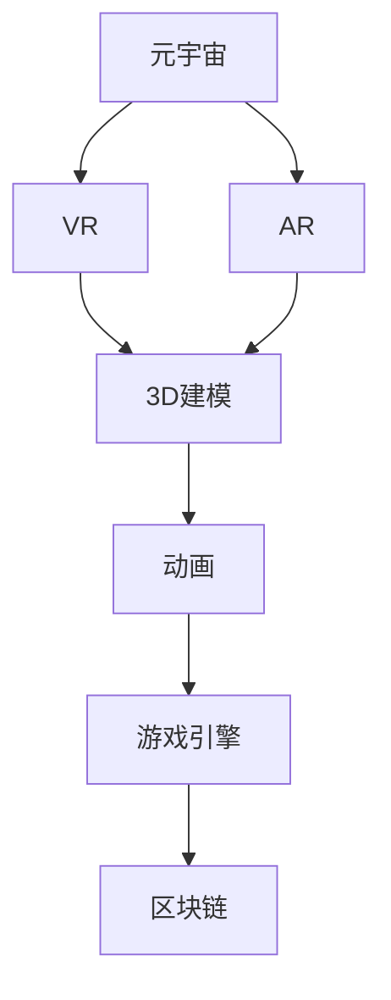

                 

### 背景介绍

#### 元宇宙的定义与发展

元宇宙（Metaverse）是一个融合虚拟现实、增强现实、区块链和社交网络等技术的虚拟世界。它不仅是一个独立的虚拟空间，更是一个与现实世界相融合的生态体系。元宇宙的目标是创造一个高度沉浸式、互动性强的虚拟环境，让用户可以在其中进行各种活动，如工作、学习、社交、娱乐等。

元宇宙的发展可以追溯到上世纪90年代的虚拟现实技术。然而，随着互联网、云计算、5G和区块链等技术的不断进步，元宇宙的概念逐渐成熟，并在近年来迎来了爆发式的发展。从最初的虚拟游戏世界，到如今涵盖多个领域的综合性虚拟空间，元宇宙正在逐步改变我们的生活方式。

#### 元宇宙的开发工具的重要性

在元宇宙的开发过程中，工具的选择和运用至关重要。元宇宙开发工具不仅包括虚拟现实（VR）和增强现实（AR）的开发平台，还包括3D建模、动画制作、游戏引擎、区块链开发框架等。这些工具为开发人员提供了丰富的功能，帮助他们更高效地创建和实现复杂的虚拟世界。

开发工具的重要性体现在以下几个方面：

1. **提高开发效率**：优秀的开发工具能够提供直观的界面和强大的功能，帮助开发者快速构建原型和完成项目，从而提高开发效率。

2. **降低开发门槛**：对于非专业人士而言，使用合适的开发工具可以降低入门难度，使得更多的人可以参与到元宇宙的建设中来。

3. **提升创意实现**：开发工具提供的各种功能和插件，可以激发开发者的创意，帮助他们将更多有趣和独特的想法转化为现实。

4. **促进技术交流**：使用同一套开发工具，有助于开发者之间的技术交流和协作，从而推动整个行业的进步。

### 当前元宇宙开发工具的现状

目前，市场上存在多种元宇宙开发工具，这些工具各有特色，适用于不同的开发需求。以下是一些主流的元宇宙开发工具及其特点：

- **Unity**：Unity 是一款广泛使用的游戏引擎，支持 2D 和 3D 游戏开发。它提供了丰富的 API 和插件，适用于开发复杂的虚拟世界。

- **Unreal Engine**：Unreal Engine 是一款高性能的游戏引擎，以其出色的图形渲染能力和高质量的视觉效果而闻名。它适用于开发高逼真度的虚拟世界。

- **CryEngine**：CryEngine 是一款开源游戏引擎，具有高效的图形渲染能力和丰富的功能。它适用于开发高性能的虚拟现实应用。

- **Blender**：Blender 是一款免费的 3D 建模和动画软件，适用于创建 3D 模型和动画。它提供了强大的建模工具和脚本支持，适合初学者和专业开发者。

- **Vuforia**：Vuforia 是一款 AR 开发平台，提供了丰富的 AR 功能和 API。它适用于开发增强现实应用和游戏。

- **BlockDesk**：BlockDesk 是一款区块链开发框架，适用于构建去中心化的虚拟世界。它提供了简单的区块链 API 和丰富的插件，帮助开发者快速实现区块链功能。

这些工具共同推动了元宇宙的发展，为开发者提供了多样化的选择，使得虚拟世界的创造变得更加简单和高效。

### 趋势分析

随着技术的不断发展，元宇宙开发工具也在不断进化。以下是一些值得关注的趋势：

1. **跨平台支持**：未来的元宇宙开发工具将更加注重跨平台支持，使得开发者可以在不同的设备上创建和运行虚拟世界。

2. **云原生架构**：云计算的普及将使得元宇宙开发工具更加依赖云原生架构，提供更强大的计算能力和更灵活的资源管理。

3. **区块链融合**：区块链技术的深入应用将使得元宇宙更加去中心化，提高数据的安全性和透明度。

4. **人工智能辅助**：人工智能技术的发展将使得元宇宙开发工具更加智能化，提供自动化的建模、渲染和优化等功能。

5. **AR/VR 硬件升级**：随着 AR/VR 硬件技术的进步，开发工具将更好地利用硬件资源，提供更高质量的虚拟体验。

### 文章摘要

本文介绍了元宇宙及其开发工具的重要性。元宇宙是一个融合虚拟现实、增强现实、区块链等技术的虚拟世界，正在逐步改变我们的生活方式。开发工具在元宇宙的建设中扮演着关键角色，它们不仅提高了开发效率，还降低了开发门槛，激发了创意实现。目前市场上存在多种元宇宙开发工具，如 Unity、Unreal Engine、CryEngine、Blender 等，每种工具都有其独特的特点和适用场景。未来，随着技术的不断发展，元宇宙开发工具将朝着跨平台、云原生、区块链融合、人工智能辅助等方向发展。

## 2. 核心概念与联系

### 元宇宙开发的基本概念

在深入探讨元宇宙开发工具之前，我们首先需要了解一些基本概念。这些概念是构建虚拟世界的基础，也是理解各类开发工具的关键。

#### 虚拟现实（VR）与增强现实（AR）

虚拟现实（VR）和增强现实（AR）是元宇宙开发中至关重要的技术。VR 是一种完全沉浸式的体验，通过头戴式显示器（HMD）或其他设备，用户可以进入一个完全由计算机生成的虚拟环境。在 VR 中，用户看到的、听到的和感受到的一切都是虚构的，与现实世界完全隔离。

增强现实（AR）则是将虚拟元素叠加到现实世界中。通过智能手机或 AR 眼镜等设备，用户可以在现实环境中看到数字信息。这些信息可以是文字、图像、三维模型等，它们与现实世界的物体交互，为用户提供了新的感知和互动方式。

#### 3D 建模与动画

3D 建模和动画是元宇宙开发的核心技术之一。3D 建模涉及到创建三维物体的过程，包括几何形状的构造、材质的指定、光照的处理等。通过 3D 建模，开发者可以创建各种虚拟场景、角色和道具。

动画则是对 3D 物体进行动态模拟的过程。通过动画，角色和物体可以表现出各种动作和表情，为虚拟世界带来生动和逼真的效果。

#### 游戏引擎

游戏引擎是元宇宙开发中不可或缺的工具。游戏引擎提供了丰富的 API 和功能，帮助开发者创建和管理虚拟世界。常见的游戏引擎如 Unity、Unreal Engine 等，它们不仅支持 3D 建模和动画，还提供了物理引擎、音频处理、网络通信等功能，使得开发者可以轻松地实现复杂的虚拟交互和场景渲染。

#### 区块链技术

区块链技术是元宇宙开发中的新兴技术。区块链提供了一个去中心化的数据库，使得数据的安全性和透明度得到了极大的提升。在元宇宙中，区块链可以用于身份认证、交易记录、虚拟资产的创建和管理等。通过区块链，开发者可以构建一个去中心化的虚拟世界，实现真正的自主和自治。

### 关键概念之间的联系

这些核心概念之间存在着紧密的联系，共同构成了元宇宙开发的基石。

- **VR 与 AR**：VR 和 AR 技术为元宇宙提供了沉浸式和增强式的交互体验，使得用户可以在虚拟世界中自由探索和互动。

- **3D 建模与动画**：3D 建模和动画技术为元宇宙提供了丰富的内容和表现形式，使得虚拟世界更加逼真和生动。

- **游戏引擎**：游戏引擎提供了开发虚拟世界的平台和工具，使得开发者可以高效地实现各种虚拟交互和场景渲染。

- **区块链技术**：区块链技术为元宇宙提供了去中心化的基础设施，保障了数据的安全性和透明度，促进了虚拟资产的流通和交易。

以下是一个简化的 Mermaid 流程图，展示了这些核心概念之间的联系：



在这个流程图中，A 表示元宇宙，它是整个系统的核心；B 和 C 分别表示 VR 和 AR，它们为元宇宙提供了交互体验；D 表示 3D 建模，E 表示动画，它们为元宇宙提供了内容和表现形式；F 表示游戏引擎，它提供了开发平台和工具；G 表示区块链，它提供了基础设施和保障。

通过这个流程图，我们可以清晰地看到元宇宙开发的各个核心概念及其相互之间的关系。这些概念共同作用，共同推动了元宇宙的创造和发展。

### 核心算法原理 & 具体操作步骤

在元宇宙的开发过程中，核心算法起着至关重要的作用。这些算法不仅决定了虚拟世界的逼真度和互动性，还直接影响着开发效率。以下将详细介绍元宇宙开发中的几个核心算法，并阐述其原理和具体操作步骤。

#### 1. 3D 渲染算法

3D 渲染算法是元宇宙开发中最为基础且重要的算法之一。它负责将三维模型在计算机屏幕上呈现出逼真的视觉效果。以下是 3D 渲染算法的基本原理和操作步骤：

**基本原理：**
- **几何处理**：首先，对三维模型进行几何处理，包括顶点处理、边处理和面处理等。
- **光线追踪**：模拟光线在虚拟世界中的传播过程，通过光线追踪算法计算物体表面的光照效果。
- **材质和纹理**：为物体表面指定材质和纹理，以模拟不同材质的光泽度和反射特性。
- **着色与渲染**：根据光照和材质信息，对物体表面进行着色和渲染，最终生成图像。

**具体操作步骤：**
1. **模型预处理**：对三维模型进行预处理，包括顶点排序、面片化等。
2. **光线追踪**：使用光线追踪算法计算场景中的光线传播路径和光照效果。
3. **材质设置**：为物体表面指定材质和纹理，包括颜色、光泽度、透明度等。
4. **着色与渲染**：根据光照和材质信息，对物体表面进行着色和渲染，生成最终图像。

#### 2. 物理引擎算法

物理引擎是元宇宙开发中负责模拟物体运动和碰撞的算法。它为虚拟世界提供了真实感和互动性。以下是物理引擎的基本原理和操作步骤：

**基本原理：**
- **运动学**：使用运动学算法计算物体的位置、速度和加速度。
- **碰撞检测**：检测物体之间的碰撞，计算碰撞响应。
- **力场模拟**：模拟引力、弹力等物理力场，对物体的运动产生影响。

**具体操作步骤：**
1. **初始化**：初始化物理引擎环境，设置重力、摩擦力等参数。
2. **运动学计算**：根据初始条件计算物体的位置、速度和加速度。
3. **碰撞检测**：检测物体之间的碰撞，并计算碰撞响应。
4. **力场模拟**：模拟各种物理力场，对物体的运动产生影响。

#### 3. 网络同步算法

网络同步算法是元宇宙开发中确保多用户同时在线互动的关键算法。它负责处理客户端之间的数据传输和状态同步。以下是网络同步算法的基本原理和操作步骤：

**基本原理：**
- **数据传输**：通过网络传输客户端之间的数据和状态。
- **状态同步**：确保不同客户端之间的状态保持一致，避免数据冲突。

**具体操作步骤：**
1. **数据编码**：将客户端数据编码成可传输的格式，如 JSON 或二进制格式。
2. **网络传输**：通过网络传输数据到其他客户端。
3. **数据解码**：解码接收到的数据，将其还原成可用的状态信息。
4. **状态同步**：同步不同客户端之间的状态，确保数据一致性。

#### 4. 脚本编程算法

脚本编程算法是元宇宙开发中用于实现复杂逻辑和交互功能的重要工具。它允许开发者通过编写脚本，控制虚拟世界的运行和行为。以下是脚本编程算法的基本原理和操作步骤：

**基本原理：**
- **事件驱动**：通过事件系统捕捉用户的交互行为，并触发相应的脚本执行。
- **逻辑控制**：使用编程语言实现各种逻辑控制和交互功能。

**具体操作步骤：**
1. **事件捕捉**：捕捉用户输入或其他事件。
2. **脚本编写**：编写脚本，定义事件处理逻辑和交互功能。
3. **脚本执行**：执行脚本，控制虚拟世界的运行和行为。

通过上述核心算法的介绍，我们可以看到元宇宙开发是一个复杂而多样化的过程。这些算法不仅涉及计算机图形学、物理学、网络通信等多个领域，还需要开发者具备扎实的编程和算法基础。理解这些算法的原理和操作步骤，将有助于开发者更好地掌握元宇宙开发的技能，创造更加丰富和逼真的虚拟世界。

### 数学模型和公式 & 详细讲解 & 举例说明

在元宇宙开发中，数学模型和公式扮演着至关重要的角色，特别是在物理引擎和3D渲染方面。以下是几个关键的数学模型和公式，以及它们的详细讲解和举例说明。

#### 1. 三角函数与3D建模

在3D建模中，三角函数（如正弦、余弦、正切函数）被广泛用于计算和渲染三维空间中的几何形状。以下是一个简单的例子：

**公式：**  
- 正弦函数：sin(θ) = 对边 / 斜边  
- 余弦函数：cos(θ) = 邻边 / 斜边  
- 正切函数：tan(θ) = 对边 / 邻边

**详细讲解：**  
三角函数用于计算三维空间中物体之间的角度和距离。例如，在三维空间中，给定一个直角三角形，我们可以使用正弦、余弦和正切函数来计算其他两个角度和边长。

**举例说明：**  
假设我们有一个直角三角形，其中一条边的长度是3单位，另一条边的长度是4单位。我们可以使用三角函数来计算第三个角度：

```latex
\sin(\theta) = \frac{3}{5} \Rightarrow \theta = \arcsin\left(\frac{3}{5}\right)
\cos(\theta) = \frac{4}{5} \Rightarrow \theta = \arccos\left(\frac{4}{5}\right)
\tan(\theta) = \frac{3}{4} \Rightarrow \theta = \arctan\left(\frac{3}{4}\right)
```

#### 2. 向量与3D变换

在3D图形学中，向量用于表示方向和大小，它们在物体变换和运动模拟中至关重要。以下是一个向量加法和点积的例子：

**公式：**  
- 向量加法：\( \vec{a} + \vec{b} = (\vec{a}_x + \vec{b}_x, \vec{a}_y + \vec{b}_y, \vec{a}_z + \vec{b}_z) \)  
- 点积：\( \vec{a} \cdot \vec{b} = \vec{a}_x \vec{b}_x + \vec{a}_y \vec{b}_y + \vec{a}_z \vec{b}_z \)

**详细讲解：**  
向量加法用于将两个向量合并为一个新向量，表示它们的方向和大小之和。点积则用于计算两个向量的投影长度乘积之和，它常用于判断两个向量之间的角度和方向关系。

**举例说明：**  
假设有两个向量 \( \vec{a} = (1, 0, 0) \) 和 \( \vec{b} = (0, 1, 0) \)，我们可以计算它们的和和点积：

```latex
\vec{a} + \vec{b} = (1 + 0, 0 + 1, 0 + 0) = (1, 1, 0)
\vec{a} \cdot \vec{b} = 1 \cdot 0 + 0 \cdot 1 + 0 \cdot 0 = 0
```

#### 3. 欧拉角与旋转矩阵

在3D渲染中，欧拉角和旋转矩阵用于表示物体的旋转。以下是一个旋转矩阵的例子：

**公式：**  
- 旋转矩阵：\( R(\theta_x, \theta_y, \theta_z) = 
\begin{bmatrix}
\cos(\theta_z) & -\sin(\theta_z) & 0 \\
\sin(\theta_z) & \cos(\theta_z) & 0 \\
0 & 0 & 1
\end{bmatrix}
\)

**详细讲解：**  
欧拉角表示物体在三维空间中的旋转，通常包括绕 X、Y 和 Z 轴的旋转角度。旋转矩阵则通过线性变换实现物体的旋转。每个旋转角度对应旋转矩阵中的一个角度参数，通过矩阵乘法实现旋转。

**举例说明：**  
假设我们要绕 Z 轴旋转一个角度 \( \theta_z = 30^\circ \)，我们可以使用旋转矩阵来计算新的向量：

```latex
R_z = \begin{bmatrix}
\cos(30^\circ) & -\sin(30^\circ) & 0 \\
\sin(30^\circ) & \cos(30^\circ) & 0 \\
0 & 0 & 1
\end{bmatrix}
\approx
\begin{bmatrix}
0.866 & -0.5 & 0 \\
0.5 & 0.866 & 0 \\
0 & 0 & 1
\end{bmatrix}
```

#### 4. 隐函数与碰撞检测

在物理引擎中，隐函数用于描述物体的形状和运动轨迹，并在碰撞检测中发挥作用。以下是一个隐函数的例子：

**公式：**  
- 隐函数：\( f(x, y, z) = 0 \)

**详细讲解：**  
隐函数用于表示物体在三维空间中的几何形状。在碰撞检测中，我们通过计算隐函数在两个物体之间的交点来判断它们是否发生碰撞。

**举例说明：**  
假设我们要检测两个球体是否发生碰撞，每个球体的半径为 r，球心坐标为 \( (x_1, y_1, z_1) \) 和 \( (x_2, y_2, z_2) \)。我们可以使用以下隐函数来判断碰撞：

```latex
f(x, y, z) = \sqrt{(x - x_1)^2 + (y - y_1)^2 + (z - z_1)^2} - r - \sqrt{(x - x_2)^2 + (y - y_2)^2 + (z - z_2)^2} - r
```

如果 \( f(x, y, z) = 0 \)，则两个球体发生碰撞。

通过这些数学模型和公式的讲解和举例，我们可以更好地理解它们在元宇宙开发中的应用。掌握这些数学工具，将有助于开发者构建更加复杂和逼真的虚拟世界。

### 项目实践：代码实例和详细解释说明

#### 1. 开发环境搭建

在开始元宇宙项目的实践之前，我们需要搭建一个合适的环境。以下是使用 Unity 游戏引擎搭建开发环境的具体步骤。

**步骤 1：安装 Unity 编辑器**
- 访问 Unity 官方网站（https://unity.com/）并注册账号。
- 下载并安装 Unity 编辑器，根据提示完成安装。

**步骤 2：创建新项目**
- 打开 Unity 编辑器，点击 "File" 菜单，选择 "New Project"。
- 在弹出的对话框中，选择项目的存储位置，并为项目命名。
- 点击 "Create Project" 完成新项目的创建。

**步骤 3：配置开发环境**
- 在 Unity 编辑器中，打开 "Edit" 菜单，选择 "Project Settings"。
- 配置项目设置，包括渲染、物理、音频等参数。

**步骤 4：安装必要插件**
- 在 Unity 编辑器中，打开 "Window" 菜单，选择 "Package Manager"。
- 在插件商店中搜索并安装所需的插件，如 Unity Analytics、Unity Ads 等。

#### 2. 源代码详细实现

以下是一个简单的 Unity 项目示例，用于创建一个基本的虚拟世界。该示例包括一个三维球体和一个二维平面，球体可以在平面上移动。

**步骤 1：创建球体和地面**
- 在 Unity 编辑器中，点击 "GameObject" 菜单，选择 "3D Object"，创建一个 "Sphere"。
- 右键点击球体，选择 "Rigidbody" 组件，以便在物理引擎中模拟重力。
- 再次右键点击球体，选择 "Mesh Renderer" 组件，以便在场景中渲染球体。
- 创建一个 "Plane" 作为地面，并添加 "Mesh Collider" 组件以便进行碰撞检测。

**步骤 2：编写脚本**
- 在 Unity 编辑器中，点击 "Create" 菜单，选择 "C# Script"。
- 将脚本命名为 "BallMovement"，双击打开脚本编辑器。
- 在脚本中编写代码，实现球体的移动功能。

**代码示例：**

```csharp
using UnityEngine;

public class BallMovement : MonoBehaviour
{
    public float speed = 5.0f;

    private Rigidbody rb;

    void Start()
    {
        rb = GetComponent<Rigidbody>();
    }

    void Update()
    {
        float moveX = Input.GetAxis("Horizontal");
        float moveZ = Input.GetAxis("Vertical");

        Vector3 movement = new Vector3(moveX, 0.0f, moveZ) * speed;

        rb.MovePosition(transform.position + movement * Time.deltaTime);
    }
}
```

**步骤 3：运行和测试**
- 在 Unity 编辑器中，点击 "Play" 按钮运行项目。
- 使用键盘上的方向键（↑↓←→）控制球体的移动。
- 如果一切正常，球体应该可以在平面上自由移动。

#### 3. 代码解读与分析

**代码解读：**

- **组件添加**：首先，我们在 Unity 编辑器中创建了一个球体和一个地面，并分别添加了 "Rigidbody"、"Mesh Renderer" 和 "Mesh Collider" 组件。
- **脚本编写**：接着，我们创建了一个名为 "BallMovement" 的 C# 脚本，用于控制球体的移动。
- **Start 方法**：在 Start 方法中，我们获取了球体的 "Rigidbody" 组件，以便在物理引擎中控制其运动。
- **Update 方法**：在 Update 方法中，我们使用 "Input.GetAxis" 方法获取键盘输入，计算移动向量，并通过 "Rigidbody.MovePosition" 方法更新球体的位置。

**代码分析：**

- **物理引擎的使用**：通过 "Rigidbody" 组件，我们可以利用 Unity 的物理引擎实现球体的运动和碰撞检测。
- **移动控制**：使用键盘输入，我们可以控制球体在平面上的移动。移动速度由 "speed" 变量控制，可以根据需要调整。
- **平滑移动**："Rigidbody.MovePosition" 方法会根据当前时间步长（Time.deltaTime）进行平滑移动，确保运动过程连贯。

#### 4. 运行结果展示

在 Unity 编辑器中运行项目后，我们可以看到以下结果：

- **球体移动**：球体可以根据键盘输入在平面上自由移动。
- **碰撞检测**：当球体与地面接触时，球体将弹起，模拟现实中的碰撞效果。

这些结果展示了我们通过代码实现的基本虚拟世界功能，为后续的扩展和功能添加奠定了基础。

### 实际应用场景

#### 1. 教育领域

元宇宙开发工具在教育领域具有广泛的应用前景。通过虚拟现实（VR）和增强现实（AR）技术，教师可以创建沉浸式的教学环境，让学生在虚拟世界中体验历史事件、科学实验和自然现象。例如，学生可以通过 VR 眼镜参观历史博物馆，或者在虚拟实验室中进行化学实验，这些体验不仅提高了学习兴趣，还加深了对知识的理解和记忆。

#### 2. 娱乐产业

娱乐产业是元宇宙开发工具的重要应用领域。通过游戏引擎和 3D 建模技术，开发者可以创建各种类型的虚拟游戏和互动体验，如虚拟角色扮演游戏（MMORPG）、模拟游戏和虚拟现实游戏。这些游戏不仅提供了丰富的娱乐内容，还通过社交功能和虚拟资产的交易，促进了用户之间的互动和社区建设。

#### 3. 虚拟会议和远程协作

随着远程办公和在线会议的普及，元宇宙开发工具在虚拟会议和远程协作中的应用日益增加。通过 VR 和 AR 技术，参会者可以进入一个三维虚拟会议室，实现面对面的交流和互动。虚拟会议工具不仅可以提供高质量的音频和视频传输，还可以通过虚拟桌面和共享文档等功能，提高协作效率。

#### 4. 医疗健康

元宇宙开发工具在医疗健康领域也有重要应用。通过虚拟现实技术，医生可以进行虚拟手术训练，提高手术技能和安全性。此外，虚拟现实还可以用于治疗焦虑症、恐惧症等心理疾病，通过模拟各种情境，帮助患者克服恐惧和焦虑。增强现实技术则可以用于医疗诊断，通过将虚拟信息叠加到患者的身体上，医生可以更直观地进行诊断和治疗。

#### 5. 虚拟旅游和房地产

虚拟旅游和房地产是元宇宙开发工具的另一个重要应用领域。通过虚拟现实技术，用户可以在线参观房地产项目、旅游景点和历史遗迹，获得身临其境的体验。这种虚拟旅游和房地产体验不仅提高了用户参与度，还可以降低旅游和看房的成本，为用户提供更加便捷的服务。

### 未来发展

随着技术的不断进步，元宇宙开发工具将在更多领域得到应用，推动虚拟世界的发展。以下是一些潜在的未来发展趋势：

#### 1. 跨平台支持

未来的元宇宙开发工具将更加注重跨平台支持，使得用户可以在不同的设备上（如手机、平板、电脑、VR 头盔等）无缝切换和使用。这将进一步提升元宇宙的普及性和便捷性。

#### 2. 云原生架构

云计算的普及将使得元宇宙开发工具逐渐采用云原生架构，提供更强大的计算能力和更灵活的资源管理。通过云平台，开发者可以轻松实现大规模虚拟世界的部署和管理。

#### 3. 区块链融合

区块链技术的深入应用将使得元宇宙更加去中心化，提高数据的安全性和透明度。通过区块链，虚拟资产和身份认证可以实现更高效和安全的交易和管理。

#### 4. 人工智能辅助

人工智能技术的发展将使得元宇宙开发工具更加智能化，提供自动化的建模、渲染和优化等功能。通过 AI 技术的辅助，开发者可以更加高效地创建和管理复杂的虚拟世界。

#### 5. 硬件升级

随着 AR/VR 硬件技术的进步，开发工具将更好地利用硬件资源，提供更高质量的虚拟体验。例如，更高分辨率、更低延迟的头戴式显示器，将为用户带来更加逼真的虚拟世界感受。

### 挑战与解决方案

尽管元宇宙开发工具具有广阔的应用前景，但在其发展过程中也面临一些挑战。

#### 1. 技术复杂性

元宇宙开发涉及多个领域的技术，如虚拟现实、增强现实、3D建模、物理引擎等。对于初学者和非专业人士来说，掌握这些技术具有一定的难度。为此，开发工具需要提供更直观的界面和更丰富的教程，降低入门门槛。

#### 2. 资源消耗

虚拟世界的创建和运行需要大量的计算资源和存储空间。对于小型团队或个人开发者来说，这可能是一个负担。未来，云平台的普及和发展将为开发者提供更灵活的资源管理方案，降低成本。

#### 3. 数据安全与隐私

在元宇宙中，用户的数据安全和隐私保护是一个重要问题。随着区块链技术的应用，如何在去中心化的环境中保障数据安全和隐私，是开发者需要解决的一个关键挑战。

### 7. 工具和资源推荐

为了帮助开发者更好地掌握元宇宙开发技能，以下推荐了一些优秀的工具和资源。

#### 7.1 学习资源推荐

- **书籍**：
  - 《Unity 2020 完全学习指南》
  - 《虚幻引擎 5 从入门到精通》
  - 《区块链技术指南》
  - 《虚拟现实与增强现实技术手册》

- **在线课程**：
  - Coursera 上的《虚拟现实与增强现实》
  - Udemy 上的《Unity 游戏开发入门与实战》
  - edX 上的《区块链开发基础》

- **博客和网站**：
  - Unity 官方博客（https://blogs.unity.com/）
  - Unreal Engine 官方论坛（https://forums.unrealengine.com/）
  - Medium 上的 VR/AR 相关博客

#### 7.2 开发工具框架推荐

- **游戏引擎**：
  - Unity（https://unity.com/）
  - Unreal Engine（https://www.unrealengine.com/）
  - CryEngine（https://www.cryengine.com/）

- **3D建模与动画**：
  - Blender（https://www.blender.org/）
  - Autodesk Maya（https://www.autodesk.com/products/maya/）
  - 3ds Max（https://www.autodesk.com/products/3ds-max/）

- **物理引擎**：
  - NVIDIA PhysX（https://www.nvidia.com/en-us/developers/physx/）
  - Havok（https://www.havok.com/）

- **区块链开发框架**：
  - Truffle（https://www.trufflesuite.com/）
  - Web3.js（https://web3js.readthedocs.io/）
  - Hardhat（https://www.npmjs.com/package/hardhat）

#### 7.3 相关论文著作推荐

- **论文**：
  - "Metaverse: A Space Beyond the Internet" by Jeremy Bailenson
  - "The Blockchain Metaverse: Enabling a New Era of Social Interaction and Business Models" by Alex Tapscott and Don Tapscott

- **著作**：
  - 《区块链革命》by Alex Tapscott 和 Don Tapscott
  - 《元宇宙：从虚拟世界到现实生活》by Kevin Kelly

这些工具和资源将帮助开发者深入了解元宇宙开发的各个方面，掌握相关技术和方法，为创建出色的虚拟世界奠定基础。

### 总结：未来发展趋势与挑战

元宇宙开发工具在过去的几年里取得了显著的进展，从虚拟现实（VR）到增强现实（AR），再到区块链技术的融合，元宇宙正逐步成为现实。然而，随着技术的不断进步，元宇宙开发工具也面临着新的发展趋势和挑战。

#### 发展趋势

1. **跨平台支持**：未来的元宇宙开发工具将更加注重跨平台支持，使得用户可以在不同的设备上（如手机、平板、电脑、VR 头盔等）无缝切换和使用。这种趋势将进一步提高元宇宙的普及性和便捷性。

2. **云原生架构**：云计算的普及将使得元宇宙开发工具逐渐采用云原生架构，提供更强大的计算能力和更灵活的资源管理。通过云平台，开发者可以轻松实现大规模虚拟世界的部署和管理。

3. **区块链融合**：区块链技术的深入应用将使得元宇宙更加去中心化，提高数据的安全性和透明度。通过区块链，虚拟资产和身份认证可以实现更高效和安全的交易和管理。

4. **人工智能辅助**：人工智能技术的发展将使得元宇宙开发工具更加智能化，提供自动化的建模、渲染和优化等功能。通过 AI 技术的辅助，开发者可以更加高效地创建和管理复杂的虚拟世界。

5. **硬件升级**：随着 AR/VR 硬件技术的进步，开发工具将更好地利用硬件资源，提供更高质量的虚拟体验。例如，更高分辨率、更低延迟的头戴式显示器，将为用户带来更加逼真的虚拟世界感受。

#### 挑战

1. **技术复杂性**：元宇宙开发涉及多个领域的技术，如虚拟现实、增强现实、3D建模、物理引擎等。对于初学者和非专业人士来说，掌握这些技术具有一定的难度。为此，开发工具需要提供更直观的界面和更丰富的教程，降低入门门槛。

2. **资源消耗**：虚拟世界的创建和运行需要大量的计算资源和存储空间。对于小型团队或个人开发者来说，这可能是一个负担。未来，云平台的普及和发展将为开发者提供更灵活的资源管理方案，降低成本。

3. **数据安全与隐私**：在元宇宙中，用户的数据安全和隐私保护是一个重要问题。随着区块链技术的应用，如何在去中心化的环境中保障数据安全和隐私，是开发者需要解决的一个关键挑战。

#### 结论

元宇宙开发工具正朝着更高效、更智能和更安全的方向发展。随着技术的不断进步，未来元宇宙将为用户带来更加丰富和逼真的虚拟体验。然而，要实现这一目标，开发工具需要不断创新和优化，以应对技术复杂性、资源消耗和数据安全等挑战。通过解决这些难题，元宇宙开发工具将为虚拟世界的创造和发展提供强有力的支持。

### 附录：常见问题与解答

#### 问题 1：元宇宙开发工具如何选择？

**解答：** 选择元宇宙开发工具时，应考虑以下几个因素：

- **项目需求**：明确项目目标和需求，选择适合的工具。例如，Unity 和 Unreal Engine 在游戏开发方面表现优异，而 Blender 和 Blender 擅长 3D 建模和动画。
- **开发经验**：考虑开发团队的技术背景和经验。对于初学者，推荐使用易于上手的工具，如 Blender 和 Unity。
- **硬件需求**：评估开发环境所需的硬件配置，确保工具能够在现有硬件上流畅运行。
- **学习资源**：选择有丰富学习资源和社区支持的工具，有助于开发者快速学习和解决问题。

#### 问题 2：如何在元宇宙中实现虚拟资产交易？

**解答：** 在元宇宙中实现虚拟资产交易，通常需要依赖区块链技术。以下是实现步骤：

- **选择区块链平台**：选择一个适合的区块链平台，如 Ethereum、EOS 或 Truffle Suite。
- **开发智能合约**：编写智能合约，定义虚拟资产的创建、转移和交易逻辑。
- **部署智能合约**：将智能合约部署到区块链上，确保其在区块链上可执行。
- **集成钱包和 DApp**：集成区块链钱包和去中心化应用（DApp），实现虚拟资产的交易和存储。

#### 问题 3：如何优化元宇宙中的网络同步算法？

**解答：** 优化元宇宙中的网络同步算法，可以从以下几个方面入手：

- **数据压缩**：采用有效的数据压缩算法，减少网络传输的数据量。
- **增量同步**：仅同步数据的变化部分，而不是整个数据集。
- **优化传输协议**：选择适合的传输协议，如 WebSocket 或 HTTP/2，提高数据传输速度。
- **分布式架构**：采用分布式架构，将同步任务分散到多个服务器，提高同步效率。

#### 问题 4：如何在元宇宙中实现高逼真的 3D 渲染效果？

**解答：** 要实现高逼真的 3D 渲染效果，可以从以下几个方面入手：

- **高质量的贴图和材质**：使用高质量的贴图和材质，模拟真实世界的光照和反射效果。
- **光线追踪**：采用光线追踪算法，模拟光线在虚拟世界中的传播，提高渲染效果的真实感。
- **纹理映射**：使用纹理映射技术，将细节纹理映射到三维物体表面，增强视觉效果。
- **阴影和反射**：优化阴影和反射的计算，提高渲染质量。

通过这些方法，可以显著提升元宇宙中的 3D 渲染效果，为用户提供更加逼真的虚拟体验。

### 扩展阅读 & 参考资料

为了深入了解元宇宙开发工具，以下推荐一些相关的扩展阅读和参考资料，涵盖书籍、论文、博客和网站等多个领域。

#### 书籍

1. **《Unity 2020 完全学习指南》**：详细介绍了 Unity 游戏引擎的基础知识和高级应用，适合初学者和有经验的开发者。
2. **《虚幻引擎 5 从入门到精通》**：讲解了虚幻引擎 5 的基本概念和使用方法，适合想要掌握高端游戏开发技术的读者。
3. **《区块链革命》**：由 Alex Tapscott 和 Don Tapscott 著，深入探讨了区块链技术的原理和应用，对于理解区块链与元宇宙的关系有重要参考价值。
4. **《元宇宙：从虚拟世界到现实生活》**：由 Kevin Kelly 著，探讨了元宇宙的概念和发展前景，提供了对元宇宙的全面视角。

#### 论文

1. **"Metaverse: A Space Beyond the Internet" by Jeremy Bailenson**：探讨了元宇宙的概念和潜在影响，是理解元宇宙发展的重要论文。
2. **"The Blockchain Metaverse: Enabling a New Era of Social Interaction and Business Models" by Alex Tapscott and Don Tapscott**：分析了区块链技术在元宇宙中的应用，对元宇宙的商业潜力有深入探讨。

#### 博客

1. **Unity 官方博客**：提供了 Unity 相关的最新资讯、教程和案例分析，是 Unity 开发者的必读资源（https://blogs.unity.com/）。
2. **Unreal Engine 官方论坛**：包含大量关于 Unreal Engine 的教程、问题和解决方案，是 Unreal Engine 开发者的学习平台（https://forums.unrealengine.com/）。
3. **Medium 上的 VR/AR 相关博客**：汇集了多个领域专家的见解和最新研究成果，是了解 VR/AR 技术动态的好去处。

#### 网站

1. **Unity 官方网站**：提供了 Unity 编辑器的下载、教程和文档，是 Unity 开发者的官方指南（https://unity.com/）。
2. **Unreal Engine 官方网站**：提供了 Unreal Engine 的下载、教程和社区支持，是 Unreal Engine 开发者的学习资源库（https://www.unrealengine.com/）。
3. **区块链开发框架官方网站**：如 Truffle（https://www.trufflesuite.com/）、Web3.js（https://web3js.readthedocs.io/）和 Hardhat（https://www.npmjs.com/package/hardhat），提供了区块链开发工具的详细文档和使用指南。

通过这些扩展阅读和参考资料，读者可以进一步深入了解元宇宙开发工具的理论和实践，为元宇宙项目的开发和实现提供有力支持。

