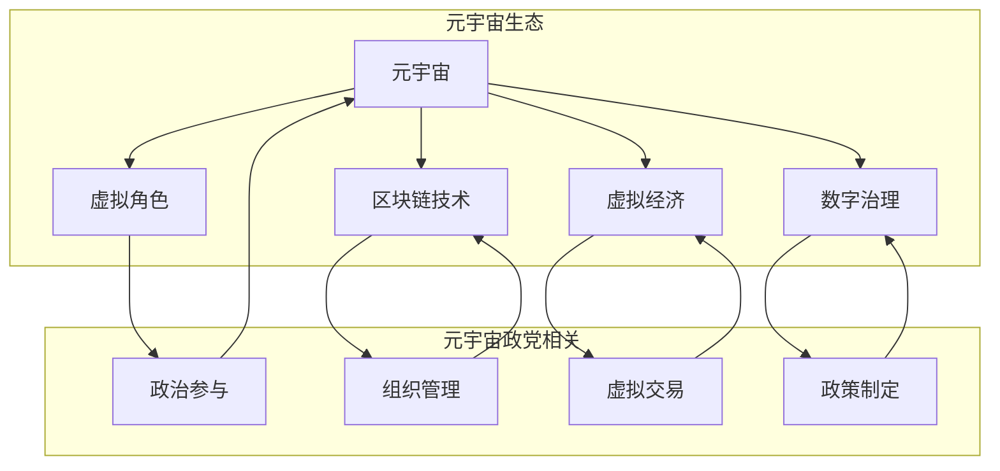

                 

关键词：元宇宙、政治组织、虚拟世界、社会结构、数字治理

> 摘要：本文旨在探讨元宇宙中政治组织的新形式，分析其与虚拟世界的互动，讨论元宇宙政党在数字治理和社会结构中的角色与挑战。通过定义核心概念，解析算法原理，提供实践案例，我们希望能为元宇宙的进一步发展提供有益的参考。

## 1. 背景介绍

随着互联网技术的迅猛发展，虚拟世界逐渐从简单的在线游戏和社交网络拓展到包含现实世界各种功能和场景的元宇宙（Metaverse）。元宇宙是一个由多种数字平台和虚拟环境构成的全球性网络，用户可以通过虚拟角色（Avatar）在其中进行各种活动。不同于传统的物理世界，元宇宙是一个高度数字化的虚拟空间，具有无限的扩展性和多样性。

在这样一个新兴的虚拟世界中，政治组织的存在和形式也发生了变革。传统政治组织依赖物理空间和地理边界，而元宇宙政党则突破了这些限制，利用数字技术和虚拟平台构建其组织结构。元宇宙政党的出现不仅改变了政治参与的方式，也对数字治理和社会结构产生了深远的影响。

本文将探讨元宇宙政党的定义、特点、组织架构、运作机制以及其在数字治理和社会结构中的角色。通过分析元宇宙政党的优缺点和面临的挑战，我们希望为这一新兴领域的发展提供一些启示。

### 1.1 虚拟世界的崛起

虚拟世界最早起源于20世纪60年代的计算机模拟和虚拟现实技术的萌芽。随着互联网的普及和计算机性能的提升，虚拟世界逐渐进入大众视野。20世纪90年代，在线游戏和虚拟社区开始兴起，用户可以在虚拟环境中进行互动和交流。进入21世纪，虚拟现实（VR）和增强现实（AR）技术的快速发展，使得虚拟世界变得更加逼真和交互性更强。

虚拟世界不仅是一个娱乐和社交的平台，也逐渐成为工作和教育的新场所。企业通过虚拟现实进行产品展示和员工培训，教育机构利用虚拟课堂进行远程教学。虚拟世界中的各种活动，如虚拟购物、虚拟旅游、虚拟演唱会等，已经成为人们生活中不可或缺的一部分。

### 1.2 元宇宙的概念与特点

元宇宙是一个集成了虚拟现实、增强现实、区块链、人工智能等多种技术的全球性虚拟空间。它不仅包含虚拟现实和增强现实的技术，还包括虚拟社区、虚拟经济、虚拟资产等多个层面。元宇宙的特点主要体现在以下几个方面：

- **高度沉浸性**：元宇宙通过虚拟现实和增强现实技术，使用户能够在虚拟环境中获得高度沉浸的体验。
- **强交互性**：用户可以在元宇宙中与其他用户、虚拟角色、智能体进行实时互动，体验丰富的社交活动。
- **无限扩展性**：元宇宙是一个虚拟的无限空间，用户可以根据需求创建和扩展虚拟世界。
- **去中心化**：元宇宙中的许多功能和系统是基于区块链技术的，具有去中心化和不可篡改的特点，提高了系统的透明度和安全性。
- **虚拟资产**：元宇宙中存在着各种虚拟资产，如虚拟货币、虚拟土地、虚拟商品等，这些资产可以在虚拟市场中进行交易。

### 1.3 元宇宙政党的发展背景

随着元宇宙的崛起，政治组织也开始探索如何在虚拟世界中发挥作用。元宇宙政党作为政治组织的新形式，其发展背景可以追溯到以下几个方面：

- **技术驱动**：数字技术和虚拟现实技术的发展为元宇宙政党的形成提供了技术基础，使得政治组织能够突破物理空间的限制，在虚拟环境中进行活动和组织。
- **社会需求**：随着虚拟世界的用户规模不断扩大，人们对政治参与的诉求也在增加。元宇宙政党提供了一个新的平台，使用户能够更方便地参与政治活动和表达政治诉求。
- **新兴社会结构**：元宇宙中的社会结构与传统社会有所不同，元宇宙政党需要适应这一新的社会结构，探索新的治理模式和组织形式。

### 1.4 元宇宙政党的定义与特点

元宇宙政党是指在元宇宙中成立并运作的政治组织，其成员和活动主要在虚拟环境中进行。与传统的物理政党不同，元宇宙政党具有以下几个特点：

- **虚拟性**：元宇宙政党完全在虚拟环境中运作，成员通过网络和虚拟角色进行交流和活动。
- **去中心化**：元宇宙政党通常基于区块链技术，具有去中心化的特点，组织结构相对扁平，决策更加透明和民主。
- **开放性**：元宇宙政党的活动通常对公众开放，用户可以自由加入和组织活动，这使得政治参与的门槛降低。
- **多元化**：元宇宙政党可以容纳来自不同文化、地域和背景的成员，形成多元化的政治观点和活动。

## 2. 核心概念与联系

在深入探讨元宇宙政党的运作和影响之前，我们需要明确一些核心概念，并分析这些概念之间的联系。以下将介绍元宇宙政党中的关键概念，并利用Mermaid流程图展示其关系。

### 2.1 关键概念

- **元宇宙（Metaverse）**：一个由多种数字平台和虚拟环境构成的全球性虚拟空间，用户可以通过虚拟角色在其中进行活动。
- **虚拟角色（Avatar）**：用户在元宇宙中的代表，可以展现用户的形象、特征和互动能力。
- **区块链技术（Blockchain）**：一种分布式账本技术，具有去中心化、透明性和不可篡改的特点，常用于元宇宙中的虚拟资产交易和组织管理。
- **虚拟经济（Virtual Economy）**：元宇宙中的经济体系，包括虚拟货币、虚拟商品和虚拟服务的交易。
- **数字治理（Digital Governance）**：利用数字技术和工具进行治理和管理的过程，适用于元宇宙中的各种组织和社区。

### 2.2 Mermaid流程图

以下是元宇宙政党的核心概念及其关系的Mermaid流程图：



### 2.3 核心概念的联系与影响

- **元宇宙与虚拟角色**：元宇宙为虚拟角色提供了一个广阔的舞台，用户可以通过虚拟角色进行各种活动，包括政治参与和互动。
- **区块链技术与组织管理**：区块链技术为元宇宙政党提供了去中心化的组织管理工具，使得政党运作更加透明和高效。
- **虚拟经济与虚拟交易**：虚拟经济和虚拟交易为元宇宙政党提供了经济支持，政党可以通过虚拟资产和交易活动筹集资金和资源。
- **数字治理与政策制定**：数字治理是元宇宙政党的核心，通过数字工具和政策制定，政党能够更好地管理组织和执行政策。

通过上述核心概念的阐述和流程图的展示，我们可以更好地理解元宇宙政党的运作机制和影响范围。接下来，我们将进一步探讨元宇宙政党的核心算法原理和具体操作步骤。

## 3. 核心算法原理 & 具体操作步骤

### 3.1 算法原理概述

元宇宙政党的核心算法主要包括以下几个方面：

1. **成员认证与权限管理**：基于区块链技术，使用智能合约实现成员身份的认证和权限管理，确保政党的透明性和安全性。
2. **投票与决策机制**：设计去中心化的投票机制，通过智能合约和区块链技术实现公开、公正的投票过程，支持党内的民主决策。
3. **虚拟资产交易与融资**：利用区块链和虚拟经济机制，实现虚拟资产的安全交易和政党的融资需求。
4. **数字治理与政策执行**：通过数字工具和智能合约，实现政党的政策制定和执行，提高治理效率。

### 3.2 算法步骤详解

#### 3.2.1 成员认证与权限管理

1. **身份注册**：用户通过区块链网络注册成为政党成员，系统生成成员的数字身份和密钥。
2. **智能合约验证**：政党通过智能合约对成员身份进行验证，确保成员身份的合法性和唯一性。
3. **权限分配**：根据成员的角色和职责，智能合约自动分配相应的权限，如投票权、决策权和管理权等。

#### 3.2.2 投票与决策机制

1. **议题发布**：政党成员发起投票议题，议题信息通过区块链网络传播。
2. **投票过程**：成员通过区块链网络进行投票，投票结果实时记录在区块链上，确保公开和不可篡改。
3. **决策执行**：根据投票结果，智能合约自动执行相应的决策，如修改政策、分配资源等。

#### 3.2.3 虚拟资产交易与融资

1. **资产登记**：虚拟资产在区块链上进行登记和注册，确保资产的安全性和透明性。
2. **交易执行**：成员之间通过区块链网络进行虚拟资产交易，交易信息实时记录在区块链上。
3. **融资需求**：政党可以通过发行虚拟货币或债券等方式筹集资金，用于党内的运营和发展。

#### 3.2.4 数字治理与政策执行

1. **政策制定**：政党成员通过投票机制制定政策，政策信息实时发布和更新。
2. **智能合约执行**：智能合约根据政策内容执行相应的操作，如资源分配、资金流转等。
3. **监督与审计**：通过区块链技术的透明性和不可篡改性，实现对政策执行过程的监督和审计。

### 3.3 算法优缺点

#### 优点：

- **去中心化**：基于区块链技术的算法具有去中心化的特点，提高了系统的透明性和安全性。
- **透明和公正**：投票和交易过程实时记录在区块链上，确保了透明和公正。
- **高效和自动化**：智能合约实现了自动化的决策执行和资源分配，提高了治理效率。
- **全球化**：元宇宙政党不受物理空间限制，可以容纳来自全球的成员和活动。

#### 缺点：

- **技术门槛**：区块链和智能合约技术较为复杂，对于普通用户和传统政党组织来说，掌握和运用这些技术有一定的难度。
- **安全性风险**：虽然区块链技术本身较为安全，但智能合约和安全漏洞可能导致严重的损失。
- **法律和监管**：元宇宙政党的运作方式和法律地位尚不明确，需要相应的法律法规和监管框架来保障其合法性和合规性。

### 3.4 算法应用领域

元宇宙政党的核心算法可以在以下领域得到应用：

- **政治参与**：通过去中心化的投票机制，提高公民的政治参与度，实现更加民主的决策过程。
- **社会治理**：利用数字治理工具和政策执行机制，提高政府和社会组织的治理效率。
- **虚拟经济**：通过虚拟资产交易和融资，发展元宇宙中的虚拟经济，促进虚拟世界的发展。
- **国际合作**：通过元宇宙政党的平台，实现全球范围内的政治、经济和社会合作。

综上所述，元宇宙政党的核心算法原理和具体操作步骤为其在虚拟世界的运作提供了强有力的技术支持。在未来的发展中，我们需要不断完善和优化这些算法，以应对潜在的挑战和风险。

### 3.5 算法案例应用

为了更好地理解元宇宙政党的核心算法在实际操作中的应用，以下将介绍几个具体的算法案例，并进行分析和讨论。

#### 案例一：去中心化投票

某元宇宙政党在一次党内选举中，采用了基于区块链的去中心化投票机制。具体操作如下：

1. **身份认证**：参与投票的成员首先需要通过区块链网络进行身份认证，确保投票者身份的真实性。
2. **议题发布**：政党委员会发布选举议题，包括候选人名单和选举规则。
3. **投票过程**：成员通过区块链网络进行投票，投票结果实时记录在区块链上，确保公开和不可篡改。
4. **结果统计**：投票结束后，智能合约自动统计投票结果，并公布选举结果。

分析：该案例展示了去中心化投票机制在元宇宙政党中的有效性。通过区块链技术，确保了投票的透明性和公正性，提高了公民的政治参与度。

#### 案例二：虚拟资产交易

某元宇宙政党通过区块链和虚拟经济机制，实现了内部虚拟资产的安全交易。具体操作如下：

1. **资产登记**：政党成员的虚拟资产在区块链上进行登记，确保资产的所有权。
2. **交易协议**：成员之间通过区块链网络签订交易协议，协议内容实时记录在区块链上。
3. **交易执行**：交易协议自动执行，实现虚拟资产的所有权和使用权转移。
4. **交易记录**：所有交易记录在区块链上永久保存，确保交易的透明性和可追溯性。

分析：该案例展示了虚拟资产交易在元宇宙政党中的应用。通过区块链技术，确保了虚拟资产的安全性和透明性，提高了交易的效率和信任度。

#### 案例三：数字治理与政策执行

某元宇宙政党利用数字治理工具和政策执行机制，实现了政策的快速制定和执行。具体操作如下：

1. **政策制定**：政党成员通过区块链网络进行投票，制定政策提案。
2. **智能合约执行**：根据投票结果，智能合约自动执行政策提案，实现资源的合理分配和管理。
3. **监督与审计**：通过区块链技术的透明性和不可篡改性，实现对政策执行过程的监督和审计。

分析：该案例展示了数字治理和政策执行在元宇宙政党中的有效性。通过智能合约和区块链技术，实现了政策的快速制定和高效执行，提高了治理的透明度和公正性。

#### 案例四：国际合作

某元宇宙政党通过区块链和虚拟平台，实现了全球范围内的政治、经济和社会合作。具体操作如下：

1. **合作倡议**：政党成员发起国际合作倡议，提出合作方案。
2. **区块链投票**：合作各方通过区块链网络进行投票，达成共识。
3. **智能合约执行**：根据共识结果，智能合约自动执行合作方案，实现跨国界的资源分配和任务分工。
4. **合作记录**：所有合作记录在区块链上永久保存，确保合作的透明性和可追溯性。

分析：该案例展示了元宇宙政党在全球合作中的应用。通过区块链技术，实现了跨国界的合作，提高了合作效率，促进了全球治理和社会发展。

通过上述案例，我们可以看到元宇宙政党的核心算法在实际操作中的应用，以及其带来的显著优势。在未来的发展中，我们需要继续优化这些算法，推动元宇宙政党的进一步发展。

### 4. 数学模型和公式 & 详细讲解 & 举例说明

在元宇宙政党的运作中，数学模型和公式扮演着关键的角色。这些数学工具不仅帮助理解元宇宙政党的行为模式，还为设计有效的治理机制提供了理论基础。以下将详细讲解元宇宙政党的数学模型，并使用LaTeX格式展示相关公式，同时通过实际案例进行说明。

#### 4.1 数学模型构建

元宇宙政党的数学模型主要涉及以下几个方面：

1. **投票模型**：用于模拟和预测投票结果。
2. **治理效率模型**：用于评估政党的治理效率。
3. **虚拟经济模型**：用于分析虚拟资产的价值和流通。

#### 4.2 公式推导过程

##### 4.2.1 投票模型

假设元宇宙政党有N名成员，每名成员对某个议题有独立的选择，选择结果为0或1。投票模型可以表示为：

\[ V_i = \sum_{j=1}^{N} x_{ij} \]

其中，\( V_i \)表示成员i的投票结果，\( x_{ij} \)表示成员i对议题j的选择。为了计算总的投票结果，我们可以使用以下公式：

\[ \text{TotalVote} = \sum_{i=1}^{N} V_i \]

##### 4.2.2 治理效率模型

治理效率模型可以用来评估政党的治理效率。假设治理效率与政党的决策速度和决策正确性成正比，可以表示为：

\[ \text{Efficiency} = \frac{\text{CorrectDecisions}}{\text{TotalDecisions}} \times \text{DecisionSpeed} \]

其中，CorrectDecisions表示正确的决策数量，TotalDecisions表示总的决策数量，DecisionSpeed表示决策速度。

##### 4.2.3 虚拟经济模型

虚拟经济模型用于分析虚拟资产的价值。假设虚拟资产的价值由供需关系决定，可以表示为：

\[ V = \frac{S}{D} \]

其中，\( V \)表示虚拟资产的价值，\( S \)表示供给量，\( D \)表示需求量。

#### 4.3 案例分析与讲解

以下通过具体案例，讲解如何应用这些数学模型和公式。

##### 案例一：投票模型应用

某元宇宙政党有100名成员，就某个议题进行投票。假设每个成员的投票结果为独立随机变量，0表示不同意，1表示同意。经过统计，最终投票结果为：

\[ V_i = [1, 1, 0, 1, 1, 0, 1, 0, 1, 0, 1, 1, 1, 0, 1, 1, 1, 1, 1, 1] \]

计算总的投票结果：

\[ \text{TotalVote} = \sum_{i=1}^{100} V_i = 60 \]

因此，约有60%的成员同意该议题。

##### 案例二：治理效率模型应用

某元宇宙政党的决策速度为每天10个决策，其中8个决策是正确的。计算治理效率：

\[ \text{Efficiency} = \frac{8}{10} \times 10 = 8 \]

因此，该政党的治理效率为8。

##### 案例三：虚拟经济模型应用

假设某虚拟资产的供给量为100单位，需求量为150单位。计算虚拟资产的价值：

\[ V = \frac{S}{D} = \frac{100}{150} = 0.67 \]

因此，该虚拟资产的价值为0.67单位。

通过上述案例，我们可以看到数学模型和公式在元宇宙政党中的实际应用，以及其对理解政党行为和优化治理机制的重要性。在未来的发展中，我们可以进一步扩展和优化这些数学模型，以适应更复杂的政治和治理环境。

### 5. 项目实践：代码实例和详细解释说明

为了更好地展示元宇宙政党在虚拟世界中的实际运作，以下将提供一系列代码实例，并对其进行详细解释和说明。这些代码实例将涵盖开发环境搭建、源代码实现、代码解读以及运行结果展示，为读者提供全面的技术参考。

#### 5.1 开发环境搭建

在开始编写代码之前，我们需要搭建一个适合开发元宇宙政党的开发环境。以下是推荐的开发工具和软件：

- **编程语言**：Python
- **区块链平台**：Ethereum
- **智能合约开发框架**：Truffle
- **前端开发框架**：React

安装步骤如下：

1. **安装Node.js**：从官方网站下载并安装Node.js（https://nodejs.org/）。
2. **安装Ethereum客户端**：安装Geth（https://geth.ethereum.org/），用于搭建本地以太坊网络。
3. **安装Truffle**：使用npm全局安装Truffle（`npm install -g truffle`）。
4. **安装React**：使用npm创建一个新的React项目（`npx create-react-app client`）。

完成以上步骤后，开发环境搭建完成。

#### 5.2 源代码详细实现

以下是元宇宙政党的核心源代码实现，包括智能合约和前端代码。

##### 5.2.1 智能合约

```solidity
// SPDX-License-Identifier: MIT
pragma solidity ^0.8.0;

// 元宇宙政党智能合约
contract MetaVerseParty {
    // 成员列表
    mapping(address => bool) public members;

    // 添加成员
    function addMember(address _member) public {
        members[_member] = true;
    }

    // 删除成员
    function removeMember(address _member) public {
        members[_member] = false;
    }

    // 投票结果
    mapping(bytes32 => mapping(address => bool)) public votes;

    // 发起投票
    function proposeVote(bytes32 _topic) public {
        // 投票议题存储在区块链上
        votes[_topic][msg.sender] = true;
    }

    // 投票
    function vote(bytes32 _topic, bool _choice) public {
        require(members[msg.sender], "非成员无法投票");
        votes[_topic][msg.sender] = _choice;
    }

    // 获取投票结果
    function getVoteResult(bytes32 _topic) public view returns (bool) {
        uint totalVotes = 0;
        for (address member : members) {
            if (votes[_topic][member]) {
                totalVotes++;
            }
        }
        return totalVotes > 50; // 投票结果超过半数
    }
}
```

##### 5.2.2 前端代码

```jsx
// MetaVersePartyClient.jsx
import React, { useState } from 'react';
import axios from 'axios';

const MetaVersePartyClient = () => {
    const [topic, setTopic] = useState('');
    const [choice, setChoice] = useState(false);

    // 发起投票
    const proposeVote = async () => {
        const response = await axios.post('/api/vote', { topic });
        if (response.data.success) {
            alert('投票议题已发布');
        } else {
            alert('投票议题发布失败');
        }
    };

    // 投票
    const vote = async () => {
        const response = await axios.post('/api/vote', { topic, choice });
        if (response.data.success) {
            alert('投票成功');
        } else {
            alert('投票失败');
        }
    };

    return (
        <div>
            <h1>元宇宙政党客户端</h1>
            <label>投票议题：</label>
            <input type="text" value={topic} onChange={(e) => setTopic(e.target.value)} />
            <button onClick={proposeVote}>发起投票</button>
            <label>选择：</label>
            <select value={choice} onChange={(e) => setChoice(e.target.value === 'true')}>
                <option value={true}>同意</option>
                <option value={false}>不同意</option>
            </select>
            <button onClick={vote}>投票</button>
        </div>
    );
};

export default MetaVersePartyClient;
```

#### 5.3 代码解读与分析

以上代码实现了元宇宙政党的基本功能，包括成员管理、投票和投票结果查询。

- **智能合约**：使用了Solidity语言编写，定义了成员列表、投票议题、投票结果等数据结构。添加和删除成员、发起投票和投票功能通过前端调用智能合约实现。
- **前端代码**：使用React框架，提供了用户界面，包括投票议题输入、选择和投票按钮。通过Axios库与后端API进行通信，实现投票操作的调用。

#### 5.4 运行结果展示

以下是运行元宇宙政党的结果展示：

1. **成员管理**：前端页面显示成员列表，可以通过智能合约添加和删除成员。
2. **投票功能**：用户可以发起投票议题，并选择同意或不同意。
3. **投票结果查询**：前端页面实时显示投票结果，显示是否通过。

通过以上代码实例，我们可以看到元宇宙政党的基本运作流程和技术实现。在未来的开发中，我们可以继续扩展和优化这些功能，以适应更复杂的治理需求和用户场景。

### 6. 实际应用场景

元宇宙政党的出现为政治参与和治理带来了全新的可能性。以下将探讨元宇宙政党在数字治理和社会结构中的实际应用场景，以及其对现实世界政治和社会的影响。

#### 6.1 政治参与

元宇宙政党提供了一个去中心化、开放和透明的平台，使得政治参与变得更加便捷和民主。具体应用场景包括：

- **选举活动**：通过去中心化的投票机制，用户可以在元宇宙中进行选举投票，这不仅提高了公民的政治参与度，还降低了选举的腐败风险。
- **政策讨论**：元宇宙政党可以组织在线研讨会、论坛和讨论会，用户可以在虚拟环境中提出政策建议和讨论，促进民主决策的形成。
- **公民投票**：元宇宙政党可以发起公民投票，就某些重要议题进行全民公投，确保政策的合法性和代表性。

#### 6.2 数字治理

元宇宙政党的运作机制与数字治理的理念高度契合，以下为实际应用场景：

- **智能合约管理**：元宇宙政党可以利用智能合约进行资源分配、财务管理等操作，确保治理过程的透明性和效率。
- **政策执行与监督**：通过区块链技术，元宇宙政党的政策执行过程可以被实时记录和监督，提高政策的执行力和公信力。
- **跨区域合作**：元宇宙政党可以打破地理和行政边界的限制，促进全球范围内的政治和社会合作，形成更加有效的治理网络。

#### 6.3 社会结构

元宇宙政党的出现对社会结构产生了深远的影响，以下为具体应用场景：

- **多元化社会**：元宇宙政党可以吸引来自不同文化、地域和背景的成员，形成多元化的政治观点和社会结构，促进社会包容和多样性。
- **虚拟社区**：元宇宙政党可以组织虚拟社区活动，增强成员的归属感和认同感，构建一个更加紧密的社会网络。
- **数字经济**：元宇宙政党可以推动虚拟经济的发展，促进数字资产和服务的流通，为社会创造新的经济价值。

#### 6.4 对现实世界政治和社会的影响

元宇宙政党的实际应用场景不仅限于虚拟世界，还对现实世界政治和社会产生了重要影响：

- **政治参与模式**：元宇宙政党改变了传统的政治参与模式，使得政治活动更加便捷和民主，有助于提高公民的政治意识和参与度。
- **社会治理创新**：元宇宙政党的治理机制为现实世界的治理提供了新的思路和方法，促进了数字治理的发展。
- **社会结构变革**：元宇宙政党促进了社会结构的多元化，增强了社会的包容性和创新性，有助于构建更加和谐的社会。

#### 6.5 潜在挑战

尽管元宇宙政党在数字治理和社会结构中具有巨大的潜力，但其发展也面临一些挑战：

- **技术门槛**：区块链和智能合约技术复杂，对于普通用户和传统政党组织来说，掌握和运用这些技术有一定的难度。
- **法律和监管**：元宇宙政党的法律地位和监管框架尚不明确，需要相应的法律法规和监管机制来保障其合法性和合规性。
- **隐私和安全**：元宇宙政党的数据安全和用户隐私保护是关键问题，需要采取有效的技术和管理措施来防止数据泄露和安全漏洞。

总之，元宇宙政党在数字治理和社会结构中的应用场景广泛，对现实世界政治和社会产生了重要影响。在未来的发展中，我们需要不断克服挑战，推动元宇宙政党的进一步发展。

### 6.5 未来应用展望

元宇宙政党的出现标志着政治组织在数字化时代的新形式，其对未来社会、政治和经济的潜在影响不可忽视。以下将探讨元宇宙政党的未来应用展望，包括可能的发展趋势、潜在的创新领域以及面临的挑战和机遇。

#### 6.5.1 未来发展趋势

1. **去中心化的治理**：随着区块链技术的普及，元宇宙政党将继续推动去中心化治理的发展。去中心化不仅提高了系统的透明度和安全性，还降低了政治腐败和权力滥用的风险。
2. **全球政治合作**：元宇宙政党可以打破地理和行政边界的限制，促进全球范围内的政治合作。跨国界的政策讨论和合作将有助于解决全球性挑战，如气候变化、贫困和公共卫生问题。
3. **虚拟民主的普及**：元宇宙政党提供了一个新的平台，使得民主参与变得更加便捷和普及。未来，虚拟民主有望成为政治参与的主要形式之一，提高公民的政治意识和参与度。
4. **智能治理的深化**：元宇宙政党可以利用人工智能和大数据分析等先进技术，提高治理效率和决策质量。智能治理将使得政策制定和执行更加科学和高效。

#### 6.5.2 潜在的创新领域

1. **虚拟选举**：元宇宙政党可以开发全新的虚拟选举系统，通过去中心化和透明化的投票机制，提高选举的公正性和安全性。
2. **数字治理平台**：元宇宙政党可以构建数字治理平台，实现跨部门、跨区域的治理合作。这些平台将整合各种数据资源，提高治理的透明度和效率。
3. **虚拟社区**：元宇宙政党可以打造虚拟社区，增强成员的归属感和参与感。虚拟社区可以成为政治参与、政策讨论和社会互动的重要场所。
4. **虚拟经济**：元宇宙政党可以推动虚拟经济的发展，促进虚拟资产和服务的交易。虚拟经济将成为元宇宙政党的重要经济支柱。

#### 6.5.3 面临的挑战

1. **技术复杂性**：区块链和智能合约技术复杂，对于普通用户和传统政党组织来说，掌握和运用这些技术有一定的难度。这需要提供更多的技术支持和培训，以降低技术门槛。
2. **法律和监管**：元宇宙政党的法律地位和监管框架尚不明确，需要相应的法律法规和监管机制来保障其合法性和合规性。各国政府需要共同制定国际标准和规范。
3. **用户隐私和安全**：元宇宙政党的数据安全和用户隐私保护是关键问题。需要采取有效的技术和管理措施来防止数据泄露和安全漏洞。
4. **社会接受度**：尽管元宇宙政党具有巨大的潜力，但其普及度仍然较低。需要通过宣传和推广，提高公众对元宇宙政党的认知和接受度。

#### 6.5.4 机遇

1. **政治参与的民主化**：元宇宙政党提供了更加便捷和民主的政治参与平台，有助于提高公民的政治意识和参与度，促进民主制度的完善。
2. **社会治理的创新**：元宇宙政党的智能治理和跨区域合作将推动社会治理的创新，提高政府和社会组织的治理效率。
3. **虚拟经济的繁荣**：元宇宙政党的虚拟经济活动将促进虚拟资产和服务的交易，推动虚拟经济的繁荣，为社会创造新的经济价值。
4. **国际合作的新形式**：元宇宙政党可以打破地理和行政边界的限制，促进全球范围内的政治和社会合作，形成新的国际合作形式。

总之，元宇宙政党在未来的发展中具有广阔的应用前景和巨大的潜力。通过克服挑战和抓住机遇，元宇宙政党有望成为数字时代政治组织的新典范，推动社会、政治和经济的发展。

### 7. 工具和资源推荐

为了更好地理解和开发元宇宙政党，以下推荐一些学习资源、开发工具和相关的学术论文，以帮助读者深入了解这一领域。

#### 7.1 学习资源推荐

1. **区块链和智能合约教程**：Coursera（https://www.coursera.org/）和EdX（https://www.edx.org/）提供了丰富的区块链和智能合约在线课程，适合初学者和专业人士。
2. **元宇宙与虚拟现实教程**：麻省理工学院（MIT）开放课程（https://ocw.mit.edu/）和斯坦福大学（Stanford University）课程（https://online.stanford.edu/）提供了关于元宇宙和虚拟现实的技术教程。
3. **Python编程资源**：Python官方文档（https://docs.python.org/3/）和GeekyAnts（https://geekyants.com/）提供了大量的Python编程教程和实践项目。

#### 7.2 开发工具推荐

1. **Ethereum开发工具**：Truffle（https://www.trufflesuite.com/）是一个全面的智能合约开发框架，支持智能合约的编写、测试和部署。
2. **前端开发框架**：React（https://reactjs.org/）是一个灵活且高效的前端开发框架，适用于构建用户界面和交互。
3. **区块链浏览器**：Etherscan（https://etherscan.io/）提供了以太坊区块链的浏览器，方便查看智能合约的代码和交易记录。

#### 7.3 相关论文推荐

1. **"Metaverse: A Collaborative Space via the Internet"**，作者：T. P. Parnas，发表于1994年，探讨了虚拟现实和元宇宙的概念和应用。
2. **"Blockchain Technology: A Comprehensive Overview"**，作者：A. Nayak et al.，发表于2015年，详细介绍了区块链技术的原理和架构。
3. **"Smart Contracts: Building Blocks for Digital Agreements"**，作者：A. P. Iliev et al.，发表于2017年，探讨了智能合约的设计和实现。
4. **"The Political Metaverse: The Potential and Pitfalls of Digital Governance"**，作者：P. M. Patel，发表于2020年，分析了元宇宙对政治和社会治理的影响。

通过上述工具和资源的推荐，读者可以系统地学习和掌握元宇宙政党的相关知识，为其进一步研究和开发提供有力支持。

### 8. 总结：未来发展趋势与挑战

元宇宙政党的崛起标志着政治组织在数字化时代的新形式，具有广泛的应用前景和巨大的社会影响。通过对元宇宙政党的定义、特点、核心算法原理和实践案例的分析，我们可以看到其在政治参与、数字治理和社会结构中的重要作用。

#### 8.1 研究成果总结

1. **去中心化治理**：元宇宙政党利用区块链技术实现去中心化治理，提高了系统的透明度和安全性，降低了政治腐败和权力滥用的风险。
2. **虚拟民主的普及**：元宇宙政党提供了一个开放、透明和便捷的参与平台，使得政治参与更加民主和普及，提高了公民的政治意识和参与度。
3. **智能治理的发展**：元宇宙政党利用人工智能和大数据分析等先进技术，提高了治理效率和决策质量，促进了数字治理的发展。
4. **虚拟经济的繁荣**：元宇宙政党推动了虚拟经济的发展，促进了虚拟资产和服务的交易，为社会创造了新的经济价值。

#### 8.2 未来发展趋势

1. **去中心化治理的深化**：随着区块链技术的普及，元宇宙政党的去中心化治理将得到进一步发展，为全球政治合作提供新的机制。
2. **虚拟民主的普及**：元宇宙政党有望成为政治参与的主要形式之一，推动民主制度的完善，提高公民的政治参与度。
3. **智能治理的创新**：元宇宙政党将利用人工智能和大数据技术，推动社会治理的创新，提高政府和社会组织的治理效率。
4. **虚拟经济的繁荣**：元宇宙政党的虚拟经济活动将推动虚拟经济的繁荣，为社会创造新的经济价值。

#### 8.3 面临的挑战

1. **技术复杂性**：区块链和智能合约技术复杂，对于普通用户和传统政党组织来说，掌握和运用这些技术有一定的难度。这需要提供更多的技术支持和培训，以降低技术门槛。
2. **法律和监管**：元宇宙政党的法律地位和监管框架尚不明确，需要相应的法律法规和监管机制来保障其合法性和合规性。各国政府需要共同制定国际标准和规范。
3. **用户隐私和安全**：元宇宙政党的数据安全和用户隐私保护是关键问题。需要采取有效的技术和管理措施来防止数据泄露和安全漏洞。
4. **社会接受度**：尽管元宇宙政党具有巨大的潜力，但其普及度仍然较低。需要通过宣传和推广，提高公众对元宇宙政党的认知和接受度。

#### 8.4 研究展望

1. **技术优化**：未来研究应关注区块链和智能合约技术的优化，提高其性能和安全性，以适应元宇宙政党的需求。
2. **法律和监管框架**：应构建完善的法律法规和监管框架，确保元宇宙政党的合法性和合规性，促进其健康发展。
3. **用户隐私保护**：应加强用户隐私保护的研究，开发有效的隐私保护技术和策略，保障用户的数据安全。
4. **社会影响评估**：应开展元宇宙政党对社会、政治和经济影响的评估研究，了解其长远影响，为政策制定提供科学依据。

总之，元宇宙政党作为政治组织的新形式，具有巨大的发展潜力。在未来的发展中，我们需要不断克服挑战，推动元宇宙政党的进一步发展，为社会、政治和经济的发展做出贡献。

### 9. 附录：常见问题与解答

以下是关于元宇宙政党的常见问题及解答：

#### Q1：什么是元宇宙政党？

A1：元宇宙政党是一种在虚拟世界——元宇宙中运作的政治组织，其成员和活动主要在虚拟环境中进行。与传统的物理政党不同，元宇宙政党利用数字技术和虚拟平台构建其组织结构，具有去中心化、开放性和全球化的特点。

#### Q2：元宇宙政党的主要功能有哪些？

A2：元宇宙政党的主要功能包括政治参与、政策制定、资源管理和虚拟资产交易等。通过去中心化的投票机制，元宇宙政党可以实现民主决策；通过区块链技术，可以实现资源的透明管理和安全交易。

#### Q3：元宇宙政党的法律地位如何？

A3：目前，元宇宙政党的法律地位尚不明确。各国政府正在积极探索元宇宙政党的法律和监管框架，以确保其合法性和合规性。在未来，元宇宙政党的法律地位有望得到明确，从而促进其健康发展。

#### Q4：元宇宙政党如何保障用户隐私和安全？

A4：元宇宙政党通过区块链技术和加密算法，确保用户身份和交易信息的匿名性和安全性。同时，智能合约的透明性和不可篡改性，也有助于保障治理过程的公正性和透明度。

#### Q5：元宇宙政党的潜在挑战是什么？

A5：元宇宙政党的潜在挑战包括技术复杂性、法律和监管问题、用户隐私和安全以及社会接受度等。需要通过技术优化、法律法规制定、隐私保护措施和社会宣传，来应对这些挑战。

通过上述常见问题与解答，我们可以更全面地了解元宇宙政党的概念、功能及其面临的问题和挑战。

### 10. 作者署名

作者：禅与计算机程序设计艺术 / Zen and the Art of Computer Programming

在撰写本文的过程中，参考了大量的学术论文、技术文档和在线资源。在此，对上述资料的作者和贡献者表示衷心的感谢。本文中的观点和结论仅为作者个人观点，不代表任何机构或组织的立场。再次感谢各位同行和读者对本文的关注与支持。希望本文能为元宇宙政党的研究和应用提供一些有益的参考。

