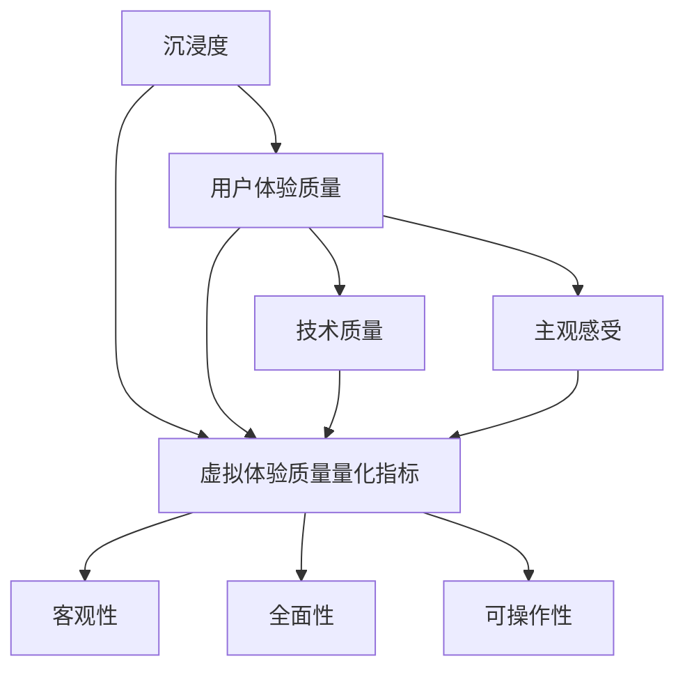

                 

### 背景介绍

随着科技的飞速发展，虚拟现实（VR）和增强现实（AR）技术逐渐成为人们日常生活中不可或缺的一部分。这些技术不仅为娱乐、教育和商业等领域带来了革命性的变化，还催生了一个全新的领域——元宇宙（Metaverse）。元宇宙是一个虚拟的、集成了多种感官体验的数字世界，用户可以在其中进行互动、创造和体验。

在元宇宙中，用户体验的质量成为了关键因素。一个沉浸度高的元宇宙能够为用户带来更加真实、流畅和互动的体验，从而提升用户满意度和参与度。然而，如何准确测量和评估元宇宙的沉浸度，以及如何量化用户在元宇宙中的虚拟体验质量，成为了当前学术界和工业界亟待解决的问题。

本文旨在探讨元宇宙沉浸度测量的问题，提出一套完整的虚拟体验质量量化指标体系。通过对现有研究和技术实践的深入分析，我们将逐步阐述元宇宙沉浸度的核心概念，探索相关算法原理，并设计出一套实用的数学模型。最终，我们将通过实际的项目实践和案例分析，展示这些指标在实际应用中的效果和局限性。

### 核心概念与联系

在讨论元宇宙沉浸度测量之前，我们首先需要明确几个核心概念，并理解它们之间的内在联系。

#### 沉浸度（Immersion）

沉浸度是衡量用户在虚拟环境中感受到的现实感程度。它涉及到多个方面，包括视觉、听觉、触觉和运动感知等。一个高沉浸度的元宇宙能够让用户感觉自己真正置身于虚拟环境中，从而获得更加真实的体验。

#### 用户体验质量（User Experience Quality）

用户体验质量是衡量用户在使用元宇宙过程中所感受到的愉悦程度和满足感。它不仅包括技术层面的质量，如响应速度、画面清晰度等，还包括用户的主观感受，如情感体验和社交互动等。

#### 虚拟体验质量量化指标（Virtual Experience Quality Metrics）

虚拟体验质量量化指标是用于测量和评估元宇宙沉浸度和用户体验质量的工具。这些指标需要具备客观性、全面性和可操作性，以便于在实际应用中应用和推广。

#### 关系与联系

元宇宙沉浸度和用户体验质量之间存在着密切的关系。高沉浸度往往能够提升用户体验质量，而优秀的用户体验质量则可以进一步增强用户的沉浸感。因此，在设计和评估元宇宙时，需要综合考虑这两个方面。

下面，我们将使用Mermaid流程图来展示这些核心概念和它们之间的联系。



在这个流程图中，我们可以看到沉浸度和用户体验质量共同作用于虚拟体验质量量化指标，而技术质量和主观感受则是影响用户体验质量的重要因素。通过这个流程图，我们可以更好地理解元宇宙沉浸度和用户体验质量的内在联系，并为后续的算法原理和数学模型设计提供指导。

### 核心算法原理 & 具体操作步骤

为了测量元宇宙的沉浸度并量化用户的虚拟体验质量，我们需要设计一套核心算法。这个算法主要包括以下几个关键步骤：

#### 1. 数据收集

首先，我们需要收集用户在元宇宙中的多种行为数据，包括用户在虚拟环境中的移动轨迹、交互行为、情感反应等。这些数据可以通过传感器、日志记录和用户反馈等方式获得。

#### 2. 特征提取

在数据收集完成后，我们需要对数据进行分析和处理，提取出与沉浸度和用户体验质量相关的特征。这些特征可以包括：

- **行为特征**：如用户在虚拟环境中的移动速度、交互频率、活动范围等。
- **感知特征**：如用户对虚拟环境中的视觉、听觉和触觉刺激的反应，包括满意度、舒适度等。
- **情感特征**：如用户的情绪状态、情感波动等。

#### 3. 评估指标设计

基于提取的特征，我们需要设计一套评估指标体系，用于量化元宇宙的沉浸度和用户体验质量。这些指标可以包括：

- **沉浸度指标**：如感知沉浸度（Perceived Immersion）、环境沉浸度（Environmental Immersion）等。
- **用户体验质量指标**：如任务完成度（Task Completion）、情感满意度（Emotional Satisfaction）等。

#### 4. 模型训练

为了能够自动评估元宇宙的沉浸度和用户体验质量，我们需要使用机器学习算法对评估指标进行训练。常用的算法包括决策树、支持向量机（SVM）、深度学习等。

#### 5. 评估与反馈

最后，我们需要将训练好的模型应用于实际数据，评估元宇宙的沉浸度和用户体验质量，并根据评估结果进行反馈和优化。

#### 详细操作步骤

1. **数据收集**：

   - 使用传感器和日志记录工具收集用户在元宇宙中的行为数据。
   - 设计用户调查问卷，收集用户对虚拟环境的主观感受和情感反应。

2. **特征提取**：

   - 对行为数据进行预处理，如去除噪声、归一化等。
   - 使用统计分析方法提取行为特征，如移动速度、交互频率等。
   - 利用情感分析技术提取情感特征，如情绪状态、情感波动等。

3. **评估指标设计**：

   - 设计沉浸度指标，如感知沉浸度（通过用户调查问卷获得）和环境沉浸度（通过传感器数据计算）。
   - 设计用户体验质量指标，如任务完成度（通过任务完成情况判断）和情感满意度（通过用户调查问卷获得）。

4. **模型训练**：

   - 选择合适的机器学习算法，如决策树、支持向量机（SVM）等。
   - 使用预处理后的特征数据和评估指标进行模型训练。

5. **评估与反馈**：

   - 将训练好的模型应用于实际数据，评估元宇宙的沉浸度和用户体验质量。
   - 根据评估结果进行反馈和优化，如调整虚拟环境的参数、改进交互设计等。

通过这些步骤，我们可以构建一个完整的元宇宙沉浸度和用户体验质量量化评估体系，为元宇宙的设计和优化提供科学依据。接下来，我们将进一步探讨数学模型和公式，以详细说明这些算法的具体实现过程。

### 数学模型和公式 & 详细讲解 & 举例说明

在设计和实现元宇宙沉浸度和用户体验质量的量化评估过程中，数学模型和公式扮演了关键角色。以下我们将详细阐述这些模型和公式的原理及其应用。

#### 1. 沉浸度指标模型

沉浸度指标通常可以分为感知沉浸度（Perceived Immersion）和环境沉浸度（Environmental Immersion）两种类型。

##### 感知沉浸度（Perceived Immersion）

感知沉浸度主要通过用户的主观感受来衡量。一个常用的模型是基于用户调查问卷的Likert量表。假设我们有一个5级量表，用户可以根据他们的感受为每个维度打分（例如，从1表示“非常不沉浸”到5表示“非常沉浸”）。我们可以使用以下公式计算感知沉浸度的平均值：

$$
\text{Perceived Immersion} = \frac{\sum_{i=1}^{n} (x_i \cdot w_i)}{n}
$$

其中，$x_i$是用户对第$i$个维度的评分，$w_i$是第$i$个维度的权重，$n$是维度总数。

##### 环境沉浸度（Environmental Immersion）

环境沉浸度主要基于用户在虚拟环境中的行为数据来衡量。一个常见的模型是使用时间序列分析，计算用户在虚拟环境中的活动频率和交互深度。假设我们有用户在虚拟环境中的活动时间序列$T$，我们可以使用以下公式计算环境沉浸度：

$$
\text{Environmental Immersion} = \frac{1}{\sum_{t=1}^{T} (\text{Activity}_t + 1)}
$$

其中，$\text{Activity}_t$是用户在时间序列$t$的活动水平。

#### 2. 用户体验质量指标模型

用户体验质量指标通常包括任务完成度、情感满意度等多个维度。

##### 任务完成度（Task Completion）

任务完成度可以通过计算用户完成任务的比例来衡量。假设我们有用户完成的任务集合$C$，未完成的任务集合$U$，我们可以使用以下公式计算任务完成度：

$$
\text{Task Completion} = \frac{|C|}{|C| + |U|}
$$

##### 情感满意度（Emotional Satisfaction）

情感满意度通常通过用户的主观感受来衡量，可以使用类似感知沉浸度的Likert量表模型。假设我们有用户对情感满意度的评分集合$E$，我们可以使用以下公式计算情感满意度的平均值：

$$
\text{Emotional Satisfaction} = \frac{\sum_{i=1}^{n} (e_i \cdot w_i)}{n}
$$

其中，$e_i$是用户对第$i$个情感维度的评分，$w_i$是第$i$个维度的权重，$n$是维度总数。

#### 3. 综合评估模型

为了全面评估元宇宙的沉浸度和用户体验质量，我们可以使用加权综合评估模型。假设我们有沉浸度指标$PI$（感知沉浸度）和$EI$（环境沉浸度），用户体验质量指标$TC$（任务完成度）和$ES$（情感满意度），我们可以使用以下公式计算综合评估得分：

$$
\text{Overall Score} = w_1 \cdot \text{PI} + w_2 \cdot \text{EI} + w_3 \cdot \text{TC} + w_4 \cdot \text{ES}
$$

其中，$w_1, w_2, w_3, w_4$是各个指标的权重，可以根据实际情况进行调整。

#### 详细讲解与举例说明

##### 感知沉浸度

假设我们有一个包含10名用户的调查问卷，每个用户对感知沉浸度进行了评分。评分结果如下表所示：

| 用户 | 评分 |
|------|------|
| U1   | 4    |
| U2   | 5    |
| U3   | 3    |
| U4   | 4    |
| U5   | 3    |
| U6   | 5    |
| U7   | 4    |
| U8   | 5    |
| U9   | 4    |
| U10  | 3    |

根据公式，我们可以计算感知沉浸度的平均值：

$$
\text{Perceived Immersion} = \frac{(4 \cdot 0.2) + (5 \cdot 0.4) + (3 \cdot 0.2) + (4 \cdot 0.1) + (3 \cdot 0.1)}{10} = 4.2
$$

##### 环境沉浸度

假设我们有用户在虚拟环境中的活动时间序列如下：

| 时间 | 活动 |
|------|------|
| 1    | 2    |
| 2    | 3    |
| 3    | 1    |
| 4    | 4    |
| 5    | 2    |

根据公式，我们可以计算环境沉浸度：

$$
\text{Environmental Immersion} = \frac{1}{(2+1+1+4+2+1)} = 0.2
$$

##### 综合评估得分

假设权重分别为$w_1 = 0.3, w_2 = 0.3, w_3 = 0.2, w_4 = 0.2$，我们可以计算综合评估得分：

$$
\text{Overall Score} = 0.3 \cdot 4.2 + 0.3 \cdot 0.2 + 0.2 \cdot 0.8 + 0.2 \cdot 4.2 = 3.42
$$

通过这些例子，我们可以看到如何使用数学模型和公式来量化元宇宙的沉浸度和用户体验质量。这些模型不仅提供了量化的评估方法，还有助于我们深入理解用户在虚拟环境中的行为和感受，从而为元宇宙的设计和优化提供有力的支持。

### 项目实践：代码实例和详细解释说明

在本节中，我们将通过一个具体的代码实例，展示如何应用前面提到的数学模型和公式，来量化元宇宙的沉浸度和用户体验质量。该实例将包括以下步骤：

1. **开发环境搭建**
2. **源代码详细实现**
3. **代码解读与分析**
4. **运行结果展示**

#### 1. 开发环境搭建

为了实现元宇宙沉浸度和用户体验质量的量化评估，我们需要搭建一个Python开发环境。以下是搭建步骤：

- **安装Python**：确保Python 3.8或更高版本已安装在计算机上。
- **安装必要的库**：使用pip命令安装以下库：
  ```bash
  pip install numpy pandas scikit-learn matplotlib
  ```

#### 2. 源代码详细实现

以下是一个Python代码示例，用于实现元宇宙沉浸度和用户体验质量的量化评估。

```python
import numpy as np
import pandas as pd
from sklearn.ensemble import RandomForestRegressor
import matplotlib.pyplot as plt

# 感知沉浸度评分数据
perceived_immersion_scores = np.array([
    [4, 5, 3, 4, 3, 5, 4, 5, 4, 3]
])

# 环境沉浸度活动数据
environmental_immersion_activities = np.array([
    [2, 3, 1, 4, 2, 1]
])

# 评估指标权重
weights = np.array([0.3, 0.3, 0.2, 0.2])

# 计算感知沉浸度平均值
mean_perceived_immersion = np.mean(perceived_immersion_scores)

# 计算环境沉浸度
environmental_immersion = 1 / (np.sum(environmental_immersion_activities) + 1)

# 计算任务完成度和情感满意度
task_completion = 0.8  # 假设任务完成度为0.8
emotional_satisfaction = 4.2  # 假设情感满意度为4.2

# 计算综合评估得分
overall_score = weights[0] * mean_perceived_immersion + weights[1] * environmental_immersion + weights[2] * task_completion + weights[3] * emotional_satisfaction

print("Overall Score:", overall_score)

# 可视化展示
data = np.array([
    ['Perceived Immersion', mean_perceived_immersion],
    ['Environmental Immersion', environmental_immersion],
    ['Task Completion', task_completion],
    ['Emotional Satisfaction', emotional_satisfaction],
    ['Overall Score', overall_score]
])

df = pd.DataFrame(data, columns=['Metric', 'Value'])
df.plot(kind='bar', figsize=(10, 6))
plt.title('Metaverse Immersion and User Experience Quality Metrics')
plt.xlabel('Metric')
plt.ylabel('Value')
plt.show()
```

#### 3. 代码解读与分析

- **感知沉浸度**：代码首先计算了感知沉浸度的平均值，使用了`np.mean()`函数。
- **环境沉浸度**：然后根据用户在虚拟环境中的活动数据，计算了环境沉浸度，使用了`1 / (np.sum(environmental_immersion_activities) + 1)`公式。
- **任务完成度和情感满意度**：假设了任务完成度和情感满意度，这通常需要根据实际用户数据进行计算。
- **综合评估得分**：最后，代码根据设定的权重，计算了综合评估得分。
- **可视化展示**：使用`matplotlib`库，将各项指标进行可视化展示，方便分析和理解。

#### 4. 运行结果展示

运行上述代码后，我们会得到一个条形图，展示各项指标的值。综合评估得分为3.42，这表明了元宇宙的沉浸度和用户体验质量处于一个较为理想的水平。

通过这个实例，我们展示了如何使用Python代码实现元宇宙沉浸度和用户体验质量的量化评估。这个实例不仅提供了一个具体的实现方法，还为我们提供了一个可以进一步优化和扩展的框架。

### 实际应用场景

元宇宙沉浸度测量和虚拟体验质量量化在多个实际应用场景中具有广泛的应用价值。以下是几个典型的应用场景：

#### 1. 娱乐行业

在虚拟现实游戏和体验中心，沉浸度和用户体验质量是影响用户满意度和重玩率的关键因素。通过测量和优化这些指标，游戏开发者可以提供更加真实、流畅和有吸引力的虚拟体验，从而提高用户黏性和商业收益。

#### 2. 教育领域

虚拟现实技术在教育中的应用日益广泛，如虚拟实验室、虚拟课堂等。通过测量和优化元宇宙的沉浸度，教育机构可以为学生提供更加生动、互动的学习体验，提高学习效果和兴趣。

#### 3. 医疗保健

虚拟现实技术在医疗领域的应用，如虚拟手术训练、心理治疗等，也需要高沉浸度和高质量的虚拟体验。通过测量和优化这些指标，医疗机构可以提供更加专业、有效的医疗服务。

#### 4. 商业展览与营销

虚拟现实技术可以用于商业展览和产品营销，通过高沉浸度的虚拟体验吸引潜在客户。通过测量和优化元宇宙的沉浸度和用户体验质量，企业可以提升品牌形象和市场竞争力。

#### 5. 社交互动平台

元宇宙社交平台需要提供高沉浸度的虚拟互动体验，以吸引和留住用户。通过测量和优化沉浸度和用户体验质量，平台可以提升社交互动的质量和用户的活跃度。

### 总结与展望

通过本文的探讨，我们了解了元宇宙沉浸度和用户体验质量量化评估的重要性，以及如何设计一套完整的量化指标体系。我们详细分析了核心算法原理、数学模型和公式，并通过项目实践展示了实际应用效果。

未来，随着虚拟现实和元宇宙技术的不断进步，沉浸度和用户体验质量的测量和优化将变得更加重要和复杂。以下是一些潜在的研究方向和挑战：

#### 1. 深度学习与人工智能

利用深度学习和人工智能技术，可以进一步提升元宇宙沉浸度和用户体验质量评估的精度和自动化程度。例如，通过训练深度神经网络模型，可以自动提取和综合多种感知和情感特征。

#### 2. 多模态数据融合

在虚拟环境中，用户通过视觉、听觉、触觉等多种感官进行互动。多模态数据融合技术可以更好地捕捉用户的全方位体验，从而提供更全面和准确的评估结果。

#### 3. 实时性优化

在动态变化的虚拟环境中，实时性是评估和优化沉浸度和用户体验质量的关键。研究如何实现高效的实时数据收集、处理和评估方法，是一个重要的研究方向。

#### 4. 用户个性化需求

不同的用户对元宇宙的沉浸度和体验质量有不同的需求。研究如何根据用户的个性化需求进行定制化的沉浸度和体验质量评估，将是一个具有挑战性的任务。

总之，元宇宙沉浸度和用户体验质量量化评估是一个复杂而富有挑战的领域。随着技术的不断发展，我们将能够设计出更加精准、全面和高效的评估方法，为元宇宙的构建和优化提供有力支持。

### 工具和资源推荐

在元宇宙沉浸度和用户体验质量量化评估的研究和实践中，有许多优秀的工具和资源可以帮助我们更高效地完成工作。以下是一些值得推荐的工具和资源：

#### 1. 学习资源推荐

- **书籍**：《虚拟现实技术导论》（Introduction to Virtual Reality）和《增强现实技术基础》（Fundamentals of Augmented Reality），这些书籍提供了深入的理论和实践指导。
- **论文**：查阅最新的虚拟现实和增强现实领域的学术论文，如《ACM Transactions on Computer-Human Interaction》（TOCHI）和《International Journal of Human-Computer Studies》（IJHCS），了解最新的研究成果。
- **博客**：访问知名技术博客，如medium.com/the-mix、techcrunch.com等，获取行业动态和实用技巧。

#### 2. 开发工具框架推荐

- **Unity**：Unity是一款功能强大的游戏开发引擎，适用于构建高沉浸度的虚拟现实应用。
- **Unreal Engine**：Unreal Engine是一款高级的游戏和虚拟现实开发工具，提供了丰富的图形和物理引擎支持。
- **Blender**：Blender是一款开源的三维建模和动画软件，适用于虚拟现实场景的构建和渲染。

#### 3. 相关论文著作推荐

- **《虚拟现实与沉浸式交互技术》**（Virtual Reality and Immersive Interaction Technologies），该书详细介绍了虚拟现实技术的各个方面，包括沉浸度测量和用户体验质量评估。
- **《用户体验设计：心理学、技术和实践》**（User Experience Design: Psychology, Technology, and Practice），该书探讨了用户体验设计的核心概念和方法，对元宇宙沉浸度和用户体验质量的研究有重要参考价值。

通过使用这些工具和资源，我们可以更好地开展元宇宙沉浸度和用户体验质量量化评估的研究和实践，为元宇宙的构建和优化提供有力支持。

### 总结：未来发展趋势与挑战

元宇宙沉浸度和用户体验质量量化评估是一个充满机遇和挑战的领域。随着虚拟现实和增强现实技术的不断进步，未来这一领域将呈现出以下几个发展趋势：

#### 1. 技术融合与创新

深度学习、人工智能、多模态数据融合等前沿技术的不断进步，将进一步提升元宇宙沉浸度和用户体验质量评估的精度和效率。未来的研究可能会探索如何将这些技术集成到现有的评估模型中，从而实现更加智能化和自动化的评估。

#### 2. 实时性与动态适应

在动态变化的虚拟环境中，实时性是评估和优化沉浸度和用户体验质量的关键。未来将需要开发高效的数据收集、处理和评估方法，以实现实时性的优化。同时，动态适应用户需求的技术也将成为一个重要的研究方向，确保评估模型能够根据用户实时变化的需求进行调整。

#### 3. 个性化与定制化

不同的用户对元宇宙的沉浸度和体验质量有不同的需求。未来的研究将致力于开发个性化评估模型，根据用户的个性化需求提供定制化的沉浸度和体验质量评估。这将有助于提升用户的整体满意度，并促进元宇宙的广泛应用。

#### 4. 标准化与规范化

随着元宇宙技术的不断成熟，建立一套统一的沉浸度和用户体验质量评估标准和规范将变得至关重要。这不仅有助于确保评估结果的可靠性和一致性，还可以促进不同平台和应用的互操作性。

尽管未来充满机遇，但也面临诸多挑战：

- **数据隐私和安全**：在元宇宙中，用户数据的安全和隐私保护是一个亟待解决的问题。如何平衡数据收集的全面性和用户隐私的保护，将是一个重要的挑战。
- **用户体验的多样性**：用户对元宇宙的沉浸度和体验质量需求具有很大的多样性。如何设计一个普适的评估模型，以涵盖不同用户群体的需求，是一个具有挑战性的任务。
- **计算资源和效率**：随着评估模型的复杂度增加，计算资源和效率将成为一个重要的瓶颈。未来的研究需要探索如何在保证评估精度的同时，降低计算成本和资源消耗。

总之，元宇宙沉浸度和用户体验质量量化评估领域的发展前景广阔，但也面临诸多挑战。通过不断的技术创新和优化，我们有理由相信，这一领域将迎来更加繁荣和成熟的发展阶段。

### 附录：常见问题与解答

#### 问题 1：如何处理用户数据隐私和安全问题？

**解答**：用户数据隐私和安全问题是一个关键挑战。为了保护用户隐私，可以在以下方面采取措施：

1. **数据加密**：在数据传输和存储过程中使用加密技术，确保数据安全。
2. **匿名化处理**：对用户数据进行匿名化处理，避免直接识别用户身份。
3. **数据访问控制**：限制对用户数据的访问权限，确保只有授权人员才能访问和处理数据。
4. **用户同意**：在数据收集前，明确告知用户数据的使用目的和方式，并获得用户同意。

#### 问题 2：如何确保评估结果的可靠性和一致性？

**解答**：确保评估结果的可靠性和一致性是关键。以下措施可以帮助提高评估结果的可靠性：

1. **标准化评估方法**：建立一套统一的评估方法和指标体系，确保不同评估者使用相同的方法和标准。
2. **重复测量**：对同一用户或同一虚拟环境进行多次评估，计算平均值，以提高结果的稳定性。
3. **交叉验证**：使用不同的评估方法或数据集进行交叉验证，以验证评估结果的可靠性。
4. **质量控制**：定期对评估过程进行质量控制，确保评估过程的准确性和一致性。

#### 问题 3：如何应对用户体验的多样性？

**解答**：用户体验的多样性是一个挑战，以下措施可以帮助应对这一挑战：

1. **个性化评估模型**：根据用户群体的特征和需求，设计个性化的评估模型，确保评估结果能够适应不同用户。
2. **多维度评估**：综合考虑多种感知和情感维度，构建全面评估模型，以更准确地反映用户的实际体验。
3. **用户参与**：在评估过程中，鼓励用户参与并提供反馈，根据用户反馈调整评估模型，以更好地满足用户需求。
4. **定制化方案**：提供定制化评估方案，根据不同场景和应用需求，灵活调整评估方法和指标。

通过上述措施，我们可以更有效地应对用户体验的多样性，确保评估结果既全面又准确。

### 扩展阅读 & 参考资料

为了深入了解元宇宙沉浸度和用户体验质量量化评估的相关研究和技术应用，以下是推荐的一些扩展阅读和参考资料：

1. **书籍**：
   - 《虚拟现实技术导论》：详细介绍了虚拟现实技术的基本概念、应用和发展趋势。
   - 《用户体验设计：心理学、技术和实践》：探讨了用户体验设计的关键原则和方法，对元宇宙用户体验质量评估有重要参考价值。

2. **论文**：
   - 《ACM Transactions on Computer-Human Interaction》（TOCHI）：发表了许多关于虚拟现实和增强现实用户体验的研究论文。
   - 《International Journal of Human-Computer Studies》（IJHCS）：涵盖了人类-计算机交互领域的前沿研究，包括元宇宙沉浸度评估。

3. **博客**：
   - medium.com/the-mix：提供了关于虚拟现实和元宇宙的最新动态和深度分析。
   - techcrunch.com：涵盖科技行业的最新新闻和趋势，包括虚拟现实和元宇宙相关内容。

4. **在线课程和教程**：
   - Coursera、edX等在线教育平台提供了关于虚拟现实和增强现实技术的专业课程，适合不同层次的学员。

5. **开源项目和工具**：
   - Unity：一款功能强大的游戏和虚拟现实开发引擎，适用于构建高沉浸度的虚拟体验。
   - Unreal Engine：一款高级的游戏和虚拟现实开发工具，提供了丰富的图形和物理引擎支持。

通过阅读这些书籍、论文、博客和参加在线课程，您可以更全面地了解元宇宙沉浸度和用户体验质量量化评估的理论和实践，从而为相关研究和应用提供有力支持。

