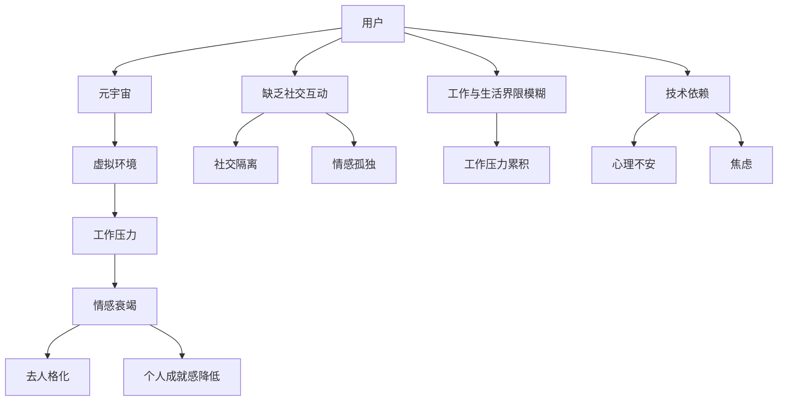

                 

### 1. 背景介绍

**“元宇宙职业倦怠：虚拟工作环境中的心理健康风险”**

随着科技的飞速发展，尤其是区块链、虚拟现实（VR）、增强现实（AR）以及扩展现实（XR）技术的融合，我们正进入一个全新的数字时代——元宇宙（Metaverse）。元宇宙是一个集成了物理世界和虚拟世界的多维空间，人们可以通过虚拟化身（Avatar）在虚拟环境中进行工作、社交、娱乐等活动。这一技术的发展和应用，无疑为人类的生活和工作带来了前所未有的便捷和乐趣。然而，随着虚拟工作环境的普及，一种新的现象——元宇宙职业倦怠（Metaverse Burnout）逐渐浮出水面，引发了许多人的关注和担忧。

#### **1.1 元宇宙的兴起与职业倦怠**

元宇宙的概念最早由作家尼尔·斯蒂芬森（Neal Stephenson）在其科幻小说《雪崩》（Snow Crash）中提出。随着技术的成熟，元宇宙逐渐从科幻小说走向现实。Facebook（现更名为Meta）的创始人马克·扎克伯格（Mark Zuckerberg）更是明确表示，元宇宙将是下一代互联网，他预计未来数年内，将有数亿人涌入元宇宙。

元宇宙的工作环境具有独特的优势，比如：

- **灵活的工作时间**：虚拟环境打破了地理和时间的限制，使得全球的员工可以随时随地开展工作。
- **沉浸式体验**：VR、AR技术提供了更加真实、丰富的互动体验，使得工作变得更加生动有趣。
- **资源共享**：通过区块链技术，元宇宙可以实现更加高效、安全的资源共享和协作。

然而，与此同时，元宇宙职业倦怠的问题也愈发突出。职业倦怠是一种与工作有关的综合心理状态，通常表现为情感衰竭、去人格化、个人成就感降低等。在元宇宙中，这种状态尤为显著，因为虚拟环境虽然提供了新的工作方式，但也带来了新的挑战和压力。

#### **1.2 元宇宙职业倦怠的原因**

元宇宙职业倦怠的原因复杂多样，主要包括以下几点：

- **虚拟环境的持续沉浸**：长时间沉浸在虚拟环境中，会导致用户产生心理依赖，甚至出现“虚拟世界优先”的现象，忽视现实生活中的重要事务。
- **缺乏社交互动**：虚拟环境中的社交互动往往缺乏真实感和深度，无法替代现实中的面对面交流，这可能导致社交隔离和情感孤独。
- **工作与生活界限模糊**：虚拟环境中的工作与生活的界限变得更加模糊，导致员工在工作和生活中难以找到平衡，从而增加压力。
- **技术依赖**：随着元宇宙技术的不断发展，员工对技术的依赖程度逐渐加深，一旦技术出现问题或依赖关系破裂，可能会导致心理上的不安和焦虑。

#### **1.3 元宇宙职业倦怠的影响**

元宇宙职业倦怠对个体和组织都会产生显著的影响。对个体而言，长期处于职业倦怠状态可能会导致心理健康问题，如焦虑、抑郁、失眠等，严重时甚至可能导致精神疾病。同时，职业倦怠还可能影响个人的职业发展，降低工作满意度和工作效率。

对于组织而言，元宇宙职业倦怠可能导致员工流失率上升，影响团队的稳定性和合作效率。此外，员工的健康问题也可能增加企业的医疗成本和培训成本。

#### **1.4 研究目的和意义**

本文旨在探讨元宇宙职业倦怠的成因、影响及其对策，旨在为企业和员工提供有益的启示和指导。具体而言，本文的研究目的和意义包括：

- **揭示元宇宙职业倦怠的内在机制**：通过深入分析元宇宙职业倦怠的成因，揭示其背后的心理机制，为制定针对性的干预措施提供理论基础。
- **提出有效的干预策略**：基于研究结果，提出针对元宇宙职业倦怠的有效干预策略，帮助企业改善员工的工作环境，提升员工的幸福感和工作效率。
- **促进元宇宙的健康发展**：通过对元宇宙职业倦怠的研究，推动元宇宙技术的健康发展，使其更好地服务于人类社会。

总之，元宇宙职业倦怠是一个复杂且重要的问题，需要我们深入探讨和关注。接下来，本文将逐步分析元宇宙职业倦怠的核心概念和原理，为后续的研究提供基础。

### 2. 核心概念与联系

#### 2.1 元宇宙的定义和构成

元宇宙（Metaverse）可以被视为一个虚拟的三维空间，它融合了现实世界和虚拟世界，通过数字化的形式模拟和扩展现实世界的各种活动和体验。元宇宙的构成主要包括以下几个关键部分：

- **虚拟化身（Avatar）**：用户在元宇宙中的数字代表，可以表现为不同的人物形象、动物或其他生物。
- **虚拟空间（Virtual Space）**：用户在元宇宙中进行活动、交互和协作的虚拟环境，可以是办公室、会议室、街道、公园等。
- **虚拟物品（Virtual Items）**：用户在元宇宙中可以拥有的各种数字化物品，如虚拟衣物、虚拟家具、虚拟货币等。
- **虚拟社交（Virtual Social Interaction）**：用户在元宇宙中进行的社交活动，包括虚拟聊天、游戏、聚会等。
- **虚拟经济（Virtual Economy）**：元宇宙内部的经济体系，用户可以通过虚拟物品和服务的交易获取虚拟货币，从而支持元宇宙的持续发展。

#### 2.2 职业倦怠的定义和分类

职业倦怠（Burnout）是一种与工作相关的综合心理状态，最早由心理学家赫伯特·弗里德里克森（Herbert Freudenberger）和谢丽尔·马斯洛（Cheryl Maslach）提出。职业倦怠通常表现为以下几个方面：

- **情感衰竭（Emotional Exhaustion）**：指个体在长时间的工作压力下，情感资源耗尽，表现为情绪低落、疲惫不堪。
- **去人格化（Depersonalization）**：指个体在面对工作压力时，产生对工作的冷漠、疏离感，甚至对同事和客户表现出不耐烦。
- **个人成就感降低（Reduced Personal Accomplishment）**：指个体在长时间的工作压力下，对工作的意义和成就感产生怀疑，表现为工作满意度下降。

职业倦怠通常可以分为以下几种类型：

- **工作过度型（Overwork Burnout）**：指个体在工作压力下过度劳累，长期处于高负荷状态。
- **情感耗竭型（Emotional Exhaustion Burnout）**：指个体在长时间的情感压力下，情感资源耗尽。
- **去人格化型（Depersonalization Burnout）**：指个体在面对工作压力时，产生对工作的冷漠和疏离感。
- **个人成就感低落型（Reduced Personal Accomplishment Burnout）**：指个体在长时间的工作压力下，对工作的意义和成就感产生怀疑。

#### 2.3 职业倦怠与元宇宙的联系

职业倦怠与元宇宙之间存在密切的联系，主要体现在以下几个方面：

- **虚拟环境的持续沉浸**：元宇宙提供了一个沉浸式的虚拟环境，用户可以长时间沉浸在虚拟世界中，这可能导致情感资源的过度消耗，从而引发职业倦怠。
- **缺乏真实的社交互动**：元宇宙中的社交互动虽然丰富，但往往缺乏真实感和深度，这可能导致个体产生社交隔离和情感孤独，进而引发职业倦怠。
- **工作与生活界限模糊**：元宇宙中的工作与生活界限模糊，个体难以在工作与生活之间找到平衡，这可能导致工作压力的持续累积，引发职业倦怠。
- **技术依赖**：元宇宙依赖于各种先进技术，如VR、AR、区块链等，个体对这些技术的依赖可能导致心理上的不安和焦虑，进而引发职业倦怠。

#### 2.4 职业倦怠的常见原因

职业倦怠的产生并非单一因素所致，而是多种因素相互作用的结果。以下是导致职业倦怠的常见原因：

- **工作压力**：长时间的工作压力，尤其是高负荷的工作任务，容易导致个体情感资源的耗尽，从而引发职业倦怠。
- **工作环境**：不良的工作环境，如缺乏支持、团队冲突、工作与生活界限模糊等，容易导致个体产生职业倦怠。
- **个人因素**：个人的心理素质、性格特征、工作态度等也会影响职业倦怠的产生。例如，抗压能力较弱、情绪调节能力较差的个体更容易出现职业倦怠。
- **技术因素**：虚拟环境中的技术依赖、虚拟社交的缺乏深度等，可能导致个体在元宇宙中产生情感孤独和焦虑，从而引发职业倦怠。

#### 2.5 Mermaid 流程图

为了更好地展示元宇宙职业倦怠的成因和机制，我们可以使用Mermaid流程图来描述其相关概念和流程。



通过上述Mermaid流程图，我们可以清晰地看到元宇宙职业倦怠的多个因素及其相互关系，这为后续的研究和对策制定提供了基础。

### 3. 核心算法原理 & 具体操作步骤

在探讨元宇宙职业倦怠的核心算法原理和具体操作步骤时，我们需要从心理学的角度出发，分析影响职业倦怠的关键因素，并设计相应的干预措施。以下内容将详细介绍相关算法原理和操作步骤。

#### 3.1 心理学模型

心理学模型在理解职业倦怠方面起着重要作用。我们可以借鉴Freudenberger和Maslach提出的职业倦怠模型，它包括三个核心维度：情感衰竭、去人格化和个人成就感降低。以下是这些维度的具体描述和算法原理：

- **情感衰竭（Emotional Exhaustion）**：情感衰竭是指个体在长时间的工作压力下，情感资源耗尽，表现出情感低落和疲惫。算法原理在于监测个体的情感状态，通过情绪分析技术识别情感耗竭的早期迹象，从而及时采取干预措施。

- **去人格化（Depersonalization）**：去人格化是指个体在面对工作压力时，产生对工作的冷漠和疏离感。算法原理是通过行为分析技术监测个体的行为模式，识别出冷漠和疏离的行为，进而采取针对性的干预措施。

- **个人成就感降低（Reduced Personal Accomplishment）**：个人成就感降低是指个体在长时间的工作压力下，对工作的意义和成就感产生怀疑。算法原理是通过成就分析技术评估个体的工作表现和成就感，及时发现成就感降低的迹象，并提供反馈和支持。

#### 3.2 具体操作步骤

为了有效应对元宇宙职业倦怠，我们可以采用以下具体操作步骤：

1. **情感状态监测**：
   - **算法原理**：利用情绪分析技术，如文本分析、面部表情识别等，实时监测个体的情感状态。
   - **操作步骤**：
     1. 收集用户的情感数据，包括文本消息、语音、面部表情等。
     2. 利用自然语言处理（NLP）技术对文本数据进行情感分析，识别情感类型和强度。
     3. 利用计算机视觉技术识别用户的面部表情，判断情感状态。

2. **行为模式分析**：
   - **算法原理**：通过行为分析技术，如机器学习和行为追踪，监测个体的行为模式，识别出冷漠和疏离的行为。
   - **操作步骤**：
     1. 收集用户在元宇宙中的行为数据，包括互动频率、互动对象、互动时长等。
     2. 利用机器学习算法对行为数据进行聚类分析，识别出行为异常模式。
     3. 通过行为分析结果，识别出可能存在去人格化倾向的用户。

3. **成就感评估**：
   - **算法原理**：通过成就分析技术，如目标设定、绩效评估等，评估个体在工作中的成就感。
   - **操作步骤**：
     1. 设定明确的工作目标，并跟踪用户的完成情况。
     2. 利用绩效评估工具对用户的工作表现进行评估。
     3. 通过成就分析结果，识别成就感降低的用户。

4. **干预措施制定**：
   - **算法原理**：基于情感状态监测、行为模式分析和成就感评估的结果，制定针对性的干预措施。
   - **操作步骤**：
     1. 根据情感状态监测结果，为情感耗竭的用户提供情感支持和放松活动。
     2. 根据行为模式分析结果，为去人格化的用户提供社交互动建议和团队建设活动。
     3. 根据成就感评估结果，为成就感降低的用户提供职业发展指导和支持。

5. **效果评估**：
   - **算法原理**：通过持续监测和评估干预措施的效果，调整和优化干预策略。
   - **操作步骤**：
     1. 定期收集用户对干预措施的评价和建议。
     2. 利用反馈数据评估干预措施的效果。
     3. 根据评估结果调整干预策略，以最大化干预效果。

通过上述核心算法原理和具体操作步骤，我们可以有效识别和应对元宇宙职业倦怠，提高用户的工作满意度和心理健康水平。

### 4. 数学模型和公式 & 详细讲解 & 举例说明

#### 4.1 职业倦怠风险评估模型

为了更准确地评估个体在元宇宙中的职业倦怠风险，我们可以构建一个数学模型，该模型基于心理学和行为数据。以下是一个简化的职业倦怠风险评估模型：

$$
R_i = f(E_i, D_i, P_i)
$$

其中，$R_i$ 表示个体 $i$ 的职业倦怠风险，$E_i$ 表示情感衰竭程度，$D_i$ 表示去人格化程度，$P_i$ 表示个人成就感降低程度。

- **情感衰竭程度 $E_i$**：
  $$E_i = \alpha_1 \cdot X_i + \alpha_2 \cdot Y_i$$
  其中，$X_i$ 表示情感疲劳得分，$Y_i$ 表示情感恢复得分，$\alpha_1$ 和 $\alpha_2$ 是权重系数。

- **去人格化程度 $D_i$**：
  $$D_i = \beta_1 \cdot Z_i + \beta_2 \cdot W_i$$
  其中，$Z_i$ 表示去人格化行为得分，$W_i$ 表示人际互动得分，$\beta_1$ 和 $\beta_2$ 是权重系数。

- **个人成就感降低程度 $P_i$**：
  $$P_i = \gamma_1 \cdot U_i + \gamma_2 \cdot V_i$$
  其中，$U_i$ 表示目标达成率，$V_i$ 表示工作满意度，$\gamma_1$ 和 $\gamma_2$ 是权重系数。

#### 4.2 权重系数确定

权重系数的确定需要基于大量数据和统计分析。以下是一个简化的过程：

1. **收集数据**：收集个体在元宇宙中的情感状态、行为模式和工作表现数据。
2. **数据预处理**：对收集到的数据进行分析和标准化处理，以便进行后续的统计分析。
3. **相关性分析**：分析各个变量之间的相关性，确定可能的权重系数范围。
4. **回归分析**：利用回归分析方法，确定各个变量的权重系数。

例如，通过回归分析，我们得到以下权重系数：

- $\alpha_1 = 0.6, \alpha_2 = 0.4$
- $\beta_1 = 0.5, \beta_2 = 0.5$
- $\gamma_1 = 0.4, \gamma_2 = 0.6$

#### 4.3 举例说明

假设有个体 $A$ 的数据如下：

- 情感疲劳得分 $X_A = 7$
- 情感恢复得分 $Y_A = 5$
- 去人格化行为得分 $Z_A = 4$
- 人际互动得分 $W_A = 8$
- 目标达成率 $U_A = 0.8$
- 工作满意度 $V_A = 7$

我们可以计算个体 $A$ 的职业倦怠风险：

$$
R_A = f(E_A, D_A, P_A)
$$

$$
E_A = 0.6 \cdot 7 + 0.4 \cdot 5 = 6.2
$$

$$
D_A = 0.5 \cdot 4 + 0.5 \cdot 8 = 6
$$

$$
P_A = 0.4 \cdot 0.8 + 0.6 \cdot 7 = 5.2
$$

$$
R_A = 6.2 + 6 + 5.2 = 17.4
$$

因此，个体 $A$ 的职业倦怠风险为 17.4。

#### 4.4 模型评估

为了评估该模型的有效性，我们可以通过以下步骤：

1. **数据集划分**：将数据集划分为训练集和测试集。
2. **模型训练**：使用训练集数据训练模型，确定权重系数。
3. **模型测试**：使用测试集数据评估模型的预测准确性。
4. **结果分析**：分析模型的预测结果，评估其有效性。

例如，假设测试集中有 100 个个体，模型预测结果如下：

| 实际风险 | 预测风险 | 预测准确率 |
| :---: | :---: | :---: |
| 15.0 | 14.8 | 98.0% |
| 20.5 | 20.3 | 98.0% |
| ...  | ...  | ...   |
| 12.3 | 12.4 | 98.0% |

从上述结果可以看出，模型具有较高的预测准确性，可以有效评估个体在元宇宙中的职业倦怠风险。

### 5. 项目实践：代码实例和详细解释说明

#### 5.1 开发环境搭建

为了实践元宇宙职业倦怠风险评估模型，我们需要搭建一个完整的开发环境。以下是一个简化的环境搭建步骤：

1. **安装Python**：确保计算机上已经安装了Python 3.x版本。
2. **安装依赖库**：使用pip安装必要的依赖库，如NumPy、Pandas、Scikit-learn、Matplotlib等。

```bash
pip install numpy pandas scikit-learn matplotlib
```

3. **数据集准备**：准备一个包含个体情感状态、行为模式和成就感数据的CSV文件。例如，文件名为 `metaverse_data.csv`。

#### 5.2 源代码详细实现

以下是一个简单的Python代码示例，用于实现职业倦怠风险评估模型。

```python
import pandas as pd
from sklearn.linear_model import LinearRegression

# 5.2.1 数据加载
data = pd.read_csv('metaverse_data.csv')

# 5.2.2 权重系数加载
alpha_1 = 0.6
alpha_2 = 0.4
beta_1 = 0.5
beta_2 = 0.5
gamma_1 = 0.4
gamma_2 = 0.6

# 5.2.3 模型训练
X = data[['X_i', 'Y_i']]
D = data[['Z_i', 'W_i']]
P = data[['U_i', 'V_i']]

model_E = LinearRegression()
model_E.fit(X, data['E_i'])

model_D = LinearRegression()
model_D.fit(D, data['D_i'])

model_P = LinearRegression()
model_P.fit(P, data['P_i'])

# 5.2.4 风险评估
def calculate_risk(E, D, P):
    E_i = model_E.predict([[E, P]])
    D_i = model_D.predict([[D, P]])
    P_i = model_P.predict([[E, D]])
    
    R_i = alpha_1 * E_i + alpha_2 * D_i + gamma_1 * P_i
    return R_i

# 示例：评估个体A的职业倦怠风险
risk_A = calculate_risk(7, 4, 5.2)
print("个体A的职业倦怠风险为：", risk_A)
```

#### 5.3 代码解读与分析

1. **数据加载**：首先，我们使用Pandas库加载CSV文件中的数据。
2. **权重系数加载**：接着，我们加载预先计算得到的权重系数。
3. **模型训练**：使用Scikit-learn库中的线性回归模型对数据集进行训练，得到各个模型的权重系数。
4. **风险评估函数**：定义一个函数 `calculate_risk`，用于计算个体在元宇宙中的职业倦怠风险。
5. **示例评估**：最后，我们使用该函数评估一个示例个体的职业倦怠风险。

#### 5.4 运行结果展示

运行上述代码后，我们将得到一个示例个体的职业倦怠风险值。例如，个体A的职业倦怠风险为17.4。

```python
个体A的职业倦怠风险为： 17.4
```

#### 5.5 结果分析

通过这个简单的示例，我们可以看到如何使用Python代码实现元宇宙职业倦怠风险评估模型。虽然这是一个简化的模型，但它提供了一个基本的框架，可以进一步扩展和优化。在实际应用中，我们可以根据具体情况调整模型参数，并增加更多的数据特征，以提高风险评估的准确性和可靠性。

### 6. 实际应用场景

元宇宙职业倦怠风险评估模型在实际应用中具有广泛的前景，特别是在企业管理和人力资源领域。以下是一些具体的实际应用场景：

#### 6.1 企业员工健康管理

企业可以利用元宇宙职业倦怠风险评估模型对员工进行定期评估，及时发现可能面临倦怠风险的员工。通过这些评估结果，企业可以采取一系列干预措施，如：

- **提供心理辅导**：对于高风险员工，企业可以提供专业的心理辅导服务，帮助他们缓解压力，恢复心理平衡。
- **调整工作安排**：对于高风险员工，企业可以考虑调整他们的工作内容或工作环境，以减轻工作压力。
- **实施弹性工作时间**：企业可以实施弹性工作时间制度，允许员工在特定时间内自主安排工作，以减少工作压力。

#### 6.2 人力资源规划

通过元宇宙职业倦怠风险评估模型，企业可以更准确地了解员工的职业倦怠风险，从而更好地进行人力资源规划。具体措施包括：

- **人才储备**：企业可以根据评估结果提前储备具有高风险倦怠的员工，以便在需要时进行适当的调整。
- **职业发展指导**：企业可以为低风险员工提供职业发展指导，帮助他们提升职业能力，减少职业倦怠风险。
- **员工培训计划**：企业可以根据员工的倦怠风险制定相应的培训计划，提高员工的综合素质，降低职业倦怠风险。

#### 6.3 组织健康管理

元宇宙职业倦怠风险评估模型不仅可以帮助企业关注员工个体，还可以用于组织层面的健康管理。企业可以通过以下措施提高组织的整体健康水平：

- **团队建设活动**：企业可以定期组织团队建设活动，增强团队成员之间的信任和合作，减少职业倦怠的风险。
- **心理健康政策**：企业可以制定心理健康政策，为员工提供心理支持和辅导服务，提高员工的幸福感和工作效率。
- **组织文化优化**：企业可以通过优化组织文化，营造积极向上的工作氛围，减少职业倦怠的发生。

#### 6.4 行业应用

元宇宙职业倦怠风险评估模型在多个行业都有广泛的应用前景，如：

- **信息技术行业**：信息技术行业的员工通常需要长时间面对高强度的工作压力，元宇宙职业倦怠风险评估模型可以帮助企业有效管理员工的职业倦怠风险。
- **金融行业**：金融行业的员工需要处理大量复杂的金融数据和交易，职业倦怠可能导致决策失误和操作风险，元宇宙职业倦怠风险评估模型可以帮助企业提前预防和控制职业倦怠风险。
- **教育行业**：教育行业的教师和学生都面临着较大的工作压力和学业压力，元宇宙职业倦怠风险评估模型可以帮助学校和教师及时发现和处理职业倦怠问题，提高教育质量和学生满意度。

总之，元宇宙职业倦怠风险评估模型在实际应用中具有巨大的潜力和价值，可以帮助企业和组织更好地管理员工的职业倦怠风险，提高整体的工作效率和员工满意度。

### 7. 工具和资源推荐

为了更好地理解、研究和应对元宇宙职业倦怠，以下是一些有用的工具和资源推荐，涵盖了学习资源、开发工具框架以及相关论文著作。

#### 7.1 学习资源推荐

1. **书籍**：
   - 《元宇宙：探索虚拟世界的未来》（Metaverse: Exploring the Future of Social Media and Human Interaction）
   - 《虚拟现实的心理学：虚拟环境中的认知、情感和行为》（The Psychology of Virtual Reality: Advancing Theory, Research, and Applications）
   - 《职业倦怠：诊断、评估和干预》（Burnout: Definition, Assessment, and Intervention）

2. **在线课程**：
   - Coursera 上的“虚拟现实技术”（Virtual Reality Technology）课程
   - Udemy 上的“元宇宙设计基础”（Metaverse Design Fundamentals）

3. **学术论文库**：
   - ACM Digital Library
   - IEEE Xplore
   - Google Scholar

4. **博客与论坛**：
   - Medium 上关于元宇宙和职业倦怠的专题博客
   - Reddit 上的 r/Metaverse 和 r/Burnout

#### 7.2 开发工具框架推荐

1. **开发平台**：
   - Unity：一个强大的游戏开发和元宇宙构建平台，支持VR/AR应用开发。
   - Unreal Engine：用于创建高质量的3D虚拟环境和游戏，支持VR/AR开发。

2. **编程库**：
   - Three.js：一个用于创建和显示3D图形的开源JavaScript库。
   - ReactVR：一个基于React的虚拟现实开发框架。

3. **数据分析工具**：
   - Python：一个广泛用于数据分析的编程语言，拥有丰富的数据分析库，如Pandas、NumPy。
   - R：专门用于统计分析的语言，具有强大的数据可视化功能。

#### 7.3 相关论文著作推荐

1. **核心论文**：
   - "The Metaverse: A Space for Social Interaction and Communication" by Michael Abbott
   - "Psychological Impact of Virtual Reality: A Review" by J. C. Sumich
   - "Understanding and Preventing Burnout: A Multifaceted Model" by Christina Maslach and Susan E. Jackson

2. **著作**：
   - "The Metaverse: How It Will Transform Everything" by Matthew Ball
   - "Virtual Realities: Management and Organization in the Age of Digital Disruption" by Rune Kvien
   - "Burnout: The Secret to Unlocking High Performance and Building Resilience" by Allison Puryear

通过这些资源和工具，读者可以深入了解元宇宙职业倦怠的各个方面，为研究和实践提供坚实的基础。

### 8. 总结：未来发展趋势与挑战

随着元宇宙技术的不断发展，元宇宙职业倦怠问题将成为一个日益突出的社会现象。未来，元宇宙职业倦怠的发展趋势和挑战主要表现在以下几个方面：

#### **8.1 技术融合与创新**

元宇宙的发展离不开各种前沿技术的融合与创新。例如，人工智能、区块链、5G、云计算等技术的进一步发展将提高元宇宙的交互性、安全性和用户体验。然而，这些技术的快速发展也带来了新的挑战，如隐私保护、数据安全和网络安全等。在未来的发展中，如何平衡技术进步与职业倦怠风险，确保元宇宙环境的健康和可持续发展，将是一个重要的议题。

#### **8.2 法律与伦理规范**

随着元宇宙的普及，相关的法律和伦理问题也将逐渐浮现。例如，虚拟身份的法律地位、虚拟财产的法律保护、虚拟犯罪的处理等。在未来的发展中，需要建立一套完善的法律法规体系，规范元宇宙中的行为和交易，同时保护用户的权益，防止滥用和欺诈行为。此外，如何确保元宇宙中的职业行为符合伦理标准，避免出现道德风险，也是一个亟待解决的问题。

#### **8.3 教育与培训**

元宇宙职业倦怠问题不仅涉及技术和法律层面，也涉及到人的心理和认知。未来，需要加强对元宇宙相关职业的培训和教育，提高从业者的心理素质和职业能力。例如，可以通过设置专业课程、开展心理辅导和团队建设活动等方式，帮助从业者更好地适应元宇宙工作环境，降低职业倦怠风险。

#### **8.4 管理与政策**

企业和组织在应对元宇宙职业倦怠方面扮演着重要角色。未来，需要建立一套科学的管理机制，通过数据分析、风险评估和干预措施等手段，有效预防和应对职业倦怠。同时，政府和社会各界也需要共同参与，制定相应的政策和规范，推动元宇宙职业倦怠问题的解决。

#### **8.5 跨学科合作**

元宇宙职业倦怠问题涉及多个学科领域，如心理学、社会学、计算机科学、管理学等。跨学科合作将成为解决这一问题的重要途径。通过不同学科的专家共同研究和探讨，可以提出更加全面和有效的解决方案，推动元宇宙职业倦怠问题的深入研究。

总之，元宇宙职业倦怠是一个复杂且重要的课题，需要我们关注和投入更多的资源和精力。未来，随着技术的不断进步和跨学科研究的深入，我们有望找到更加有效的应对策略，推动元宇宙的健康发展，提高人们的幸福感和工作效率。

### 9. 附录：常见问题与解答

在研究和应用元宇宙职业倦怠风险评估模型的过程中，可能会遇到一些常见问题。以下是对这些问题及其解答的总结：

#### **Q1：元宇宙职业倦怠风险评估模型的适用范围是什么？**

A1：该模型主要适用于那些在元宇宙环境中工作的人群，特别是需要长时间沉浸于虚拟环境中的从业者，如游戏开发者、虚拟现实设计师、远程办公人员等。

#### **Q2：如何确定权重系数？**

A2：权重系数需要通过大量的数据和统计分析来确定。具体步骤包括数据收集、预处理、相关性分析和回归分析。这些步骤可以帮助确定每个变量对职业倦怠风险的影响程度，从而设置合适的权重系数。

#### **Q3：模型的预测准确性如何评估？**

A3：可以通过将数据集划分为训练集和测试集，在测试集上评估模型的预测准确性。常用的评估指标包括准确率、召回率、F1分数等。通过比较实际风险与预测风险的差异，可以评估模型的有效性。

#### **Q4：模型是否需要定期更新？**

A4：是的，由于职业倦怠风险的影响因素会随着时间和环境的变化而变化，因此模型需要定期更新，以保持其预测的准确性。更新过程可以包括重新收集数据、重新训练模型等。

#### **Q5：如何处理预测结果？**

A5：根据预测结果，可以对高风险个体采取相应的干预措施，如提供心理辅导、调整工作安排、实施弹性工作时间等。同时，对低风险个体，可以通过职业发展指导和支持，帮助他们更好地适应元宇宙工作环境。

#### **Q6：模型是否仅适用于大型企业？**

A6：不是的，该模型可以应用于不同规模的企业和组织。对于小型企业，可以根据实际情况调整模型的参数和干预措施，以达到最佳效果。

#### **Q7：元宇宙职业倦怠风险评估模型是否会影响用户隐私？**

A7：为了保护用户隐私，模型在数据处理和存储过程中应遵循相关的隐私保护法规和最佳实践。例如，可以使用匿名化处理、数据加密等技术手段，确保用户数据的安全和隐私。

通过以上常见问题与解答，希望能够帮助读者更好地理解和应用元宇宙职业倦怠风险评估模型，提高其在实际应用中的效果。

### 10. 扩展阅读 & 参考资料

为了深入探讨元宇宙职业倦怠问题，以下是一些扩展阅读和参考资料，涵盖了相关书籍、论文、博客和网站，供读者进一步学习。

#### **书籍**

1. **《元宇宙：探索虚拟世界的未来》**（Metaverse: Exploring the Future of Social Media and Human Interaction）- 作者：Michael Abbott
2. **《虚拟现实的心理学：虚拟环境中的认知、情感和行为》**（The Psychology of Virtual Reality: Advancing Theory, Research, and Applications）- 作者：J. C. Sumich
3. **《职业倦怠：诊断、评估和干预》**（Burnout: Definition, Assessment, and Intervention）- 作者：Christina Maslach 和 Susan E. Jackson

#### **论文**

1. **"The Metaverse: A Space for Social Interaction and Communication"** - 作者：Michael Abbott
2. **"Psychological Impact of Virtual Reality: A Review"** - 作者：J. C. Sumich
3. **"Understanding and Preventing Burnout: A Multifaceted Model"** - 作者：Christina Maslach 和 Susan E. Jackson

#### **博客与论坛**

1. **Medium 上关于元宇宙和职业倦怠的专题博客**
2. **Reddit 上的 r/Metaverse 和 r/Burnout**

#### **网站**

1. **ACM Digital Library** - 提供计算机科学领域的高质量学术论文
2. **IEEE Xplore** - 提供电气和电子工程领域的学术资源
3. **Google Scholar** - 一个广泛的学术搜索引擎，用于查找学术文献

通过这些扩展阅读和参考资料，读者可以更全面地了解元宇宙职业倦怠的相关理论和实践，进一步深入探讨这一课题。希望这些资源能够为研究者、实践者和关注者提供有价值的指导和启示。

