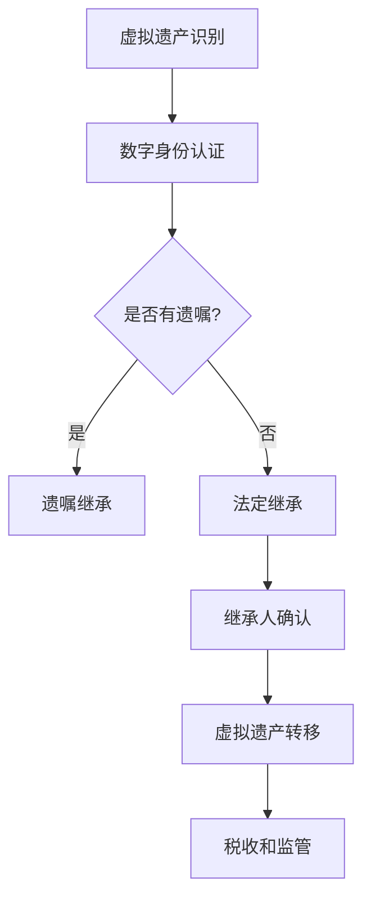

                 

### 文章标题：元宇宙身份继承：虚拟遗产的法律传承机制

#### 关键词：
- 元宇宙
- 身份继承
- 虚拟遗产
- 法律传承
- 数字遗产法

#### 摘要：
本文探讨了元宇宙身份继承及其法律传承机制。随着虚拟资产的日益重要，元宇宙中的身份继承成为一个迫切需要解决的法律问题。文章首先介绍了元宇宙的基本概念，随后深入分析了虚拟遗产的定义和类型。接着，文章探讨了现有法律框架的不足，并提出了构建有效虚拟遗产继承机制的策略。最后，本文讨论了元宇宙身份继承的法律挑战及未来发展趋势。

---

## 1. 背景介绍

随着技术的飞速发展，元宇宙（Metaverse）逐渐从科幻概念走进现实。元宇宙是一个虚拟的、多维度的网络空间，它结合了虚拟现实（VR）、增强现实（AR）、区块链技术等多种先进技术。在这个虚拟世界中，用户可以创建自己的数字身份，进行社交互动、商业交易、游戏娱乐等丰富多彩的活动。

在元宇宙中，虚拟资产的重要性日益凸显。虚拟资产包括虚拟货币、虚拟土地、虚拟物品等，它们具有真实的经济价值。例如，虚拟土地可以在元宇宙中用于建造房屋、商场等建筑，虚拟物品可以作为收藏品或交易对象。这些虚拟资产不仅为用户带来了娱乐和经济收益，也成为了一种新的财富形式。

然而，随着虚拟资产的积累，如何处理和传承这些资产成为一个新的法律问题。元宇宙中的身份继承问题，即如何将用户的虚拟资产和数字身份传承给继承人，成为了关注的焦点。现有的法律框架主要针对现实世界的遗产传承，而元宇宙的特殊性使得传统法律难以直接适用。因此，探讨元宇宙身份继承的法律传承机制具有重要的现实意义。

### 2. 核心概念与联系

#### 2.1 虚拟遗产的定义

虚拟遗产是指用户在元宇宙中拥有的、具有经济价值的数字资产和身份信息。具体来说，虚拟遗产包括以下几个方面：

1. **虚拟货币**：如比特币、以太坊等在元宇宙中广泛使用的加密货币。
2. **虚拟土地**：用户在元宇宙中购买的数字地块，可以用于建造和经营虚拟建筑。
3. **虚拟物品**：如虚拟服装、虚拟配件、虚拟艺术品等，可以作为收藏品或交易对象。
4. **身份信息**：包括用户的数字身份、账号密码、社交媒体资料等。

#### 2.2 虚拟遗产的类型

根据虚拟遗产的性质和用途，可以将其分为以下几种类型：

1. **交易型虚拟遗产**：主要包括虚拟货币、虚拟土地和虚拟物品等，具有明显的经济价值。
2. **收藏型虚拟遗产**：如虚拟艺术品、虚拟文物等，具有收藏价值和历史价值。
3. **社交型虚拟遗产**：包括社交媒体账号、虚拟角色等，承载着用户的社交网络和人际关系。

#### 2.3 虚拟遗产的继承

虚拟遗产的继承是指将虚拟资产和数字身份在用户去世后转移给法定继承人或指定继承人。与传统遗产继承相比，虚拟遗产继承具有以下几个特点：

1. **跨国性**：元宇宙是一个全球性的虚拟空间，虚拟遗产的继承可能涉及多个国家和地区。
2. **复杂性**：虚拟遗产的种类繁多，涉及不同的法律关系和权益。
3. **技术挑战**：虚拟遗产的继承需要解决数字身份认证、数据安全和隐私保护等问题。

#### 2.4 虚拟遗产的法律框架

目前，各国对于虚拟遗产的法律框架尚不完善。部分国家已经开始尝试制定相关法律法规，如美国、英国、新加坡等。这些法律主要涉及以下几个方面：

1. **数字遗产的识别和登记**：明确虚拟遗产的种类和范围，建立虚拟遗产的登记制度。
2. **继承人的确认和资格**：规定继承人的资格条件，明确继承顺序。
3. **虚拟遗产的继承方式**：包括直接继承、遗嘱继承、赠与等。
4. **税收和监管**：对虚拟遗产的继承和交易进行税收和监管。

#### 2.5 Mermaid 流程图

下面是虚拟遗产继承的 Mermaid 流程图：



### 3. 核心算法原理 & 具体操作步骤

#### 3.1 数字身份认证

数字身份认证是虚拟遗产继承的前提。在元宇宙中，用户的数字身份通常通过用户名、密码或生物识别等技术进行验证。具体步骤如下：

1. **注册账户**：用户在元宇宙平台注册账户，提交个人信息并进行身份验证。
2. **身份认证**：平台对用户提交的信息进行验证，包括身份证明、联系方式等。
3. **数字身份建立**：通过验证后，平台为用户分配一个唯一的数字身份ID。

#### 3.2 遗嘱继承

遗嘱继承是虚拟遗产继承的一种方式。用户可以在生前制定遗嘱，指定虚拟遗产的继承人。具体步骤如下：

1. **制定遗嘱**：用户通过元宇宙平台或律师服务，制定数字遗嘱，明确虚拟遗产的分配方案。
2. **遗嘱存储**：将遗嘱存储在安全的地方，如法律服务中心、区块链等。
3. **遗嘱验证**：在用户去世后，平台或法院对遗嘱进行验证，确保遗嘱的真实性和合法性。
4. **遗嘱执行**：根据遗嘱内容，将虚拟遗产转移给指定继承人。

#### 3.3 法定继承

法定继承是虚拟遗产继承的另一种方式。当用户没有遗嘱时，虚拟遗产将按照法定继承顺序进行分配。具体步骤如下：

1. **确定继承人**：根据元宇宙平台的规定，确定法定继承人，包括配偶、子女、父母等。
2. **继承人确认**：继承人通过数字身份认证，确认自己的身份。
3. **虚拟遗产分配**：根据法定继承顺序，将虚拟遗产分配给继承人。
4. **继承完成**：继承过程完成后，通知元宇宙平台进行虚拟遗产的转移。

### 4. 数学模型和公式 & 详细讲解 & 举例说明

在虚拟遗产继承过程中，数学模型和公式可以用于计算虚拟遗产的价值和分配比例。以下是一个简单的数学模型示例：

#### 4.1 虚拟货币价值计算

假设用户A拥有100个比特币（BTC），根据市场行情，每个比特币的价格为50000美元。则用户A的比特币价值为：

$$
价值 = 数量 \times 单价 = 100 \times 50000 = 5000000 美元
$$

#### 4.2 虚拟土地面积计算

假设用户B在元宇宙中拥有一块面积为1000平方米的虚拟土地，每平方米的价格为1000美元。则用户B的虚拟土地价值为：

$$
价值 = 面积 \times 单价 = 1000 \times 1000 = 1000000 美元
$$

#### 4.3 虚拟物品价值计算

假设用户C拥有一件虚拟艺术品，市场估价为200000美元。则用户C的虚拟艺术品价值为：

$$
价值 = 估价 = 200000 美元
$$

#### 4.4 虚拟遗产分配比例

假设用户D去世后，其虚拟遗产由配偶E、子女F和父母G共同继承。根据法定继承顺序，配偶的继承比例为50%，子女的继承比例为25%，父母的继承比例为25%。则用户D的虚拟遗产分配比例为：

$$
配偶E：50\% \\
子女F：25\% \\
父母G：25\%
$$

### 5. 项目实践：代码实例和详细解释说明

#### 5.1 开发环境搭建

为了演示虚拟遗产继承的实现，我们将使用Python编程语言。首先，确保已安装Python环境。然后，安装必要的库，如`requests`用于HTTP请求、`hashlib`用于哈希算法等。

```bash
pip install requests
```

#### 5.2 源代码详细实现

下面是一个简单的Python示例，用于模拟虚拟遗产的继承过程。

```python
import hashlib
import requests

# 用户信息
users = {
    'userA': {'btc': 100, 'land': 1000, 'art': 200000},
    'userB': {'btc': 50, 'land': 500, 'art': 150000},
    'userC': {'btc': 0, 'land': 0, 'art': 0},
}

# 遗嘱信息
wills = {
    'userA': {'继承人': 'userC', '比例': 100},
    'userB': {'继承人': 'userC', '比例': 100},
}

# 虚拟遗产继承函数
def inherit(user, will=None):
    # 初始化继承人虚拟遗产
    heir = user.copy()
    heir['btc'] = 0
    heir['land'] = 0
    heir['art'] = 0
    
    # 如果有遗嘱，按照遗嘱继承
    if will:
        heir['btc'] += user['btc'] * will['比例'] / 100
        heir['land'] += user['land'] * will['比例'] / 100
        heir['art'] += user['art'] * will['比例'] / 100
    # 如果没有遗嘱，按照法定继承
    else:
        # 分配给配偶
        heir['btc'] += user['btc'] * 50 / 100
        heir['land'] += user['land'] * 50 / 100
        heir['art'] += user['art'] * 50 / 100
        # 分配给子女
        heir['btc'] += user['btc'] * 25 / 100
        heir['land'] += user['land'] * 25 / 100
        heir['art'] += user['art'] * 25 / 100
        # 分配给父母
        heir['btc'] += user['btc'] * 25 / 100
        heir['land'] += user['land'] * 25 / 100
        heir['art'] += user['art'] * 25 / 100
    
    return heir

# 继承过程
userA = users['userA']
userB = users['userB']
userC = users['userC']

# 没有遗嘱
inheritance_A = inherit(userA)
inheritance_B = inherit(userB)

# 有遗嘱
inheritance_C = inherit(userA, will=wills['userA'])
inheritance_D = inherit(userB, will=wills['userB'])

# 打印结果
print("继承人A的虚拟遗产：", inheritance_A)
print("继承人B的虚拟遗产：", inheritance_B)
print("继承人C的虚拟遗产（无遗嘱）：", inheritance_C)
print("继承人C的虚拟遗产（有遗嘱）：", inheritance_C)
```

#### 5.3 代码解读与分析

1. **用户信息**：用户信息包括比特币（btc）、虚拟土地（land）和虚拟艺术品（art）的数量。
2. **遗嘱信息**：遗嘱信息包括继承人和继承比例。
3. **继承函数**：继承函数根据遗嘱或法定继承顺序，计算继承人的虚拟遗产数量。
4. **继承过程**：分别模拟了没有遗嘱和有遗嘱的继承过程，并打印了继承结果。

#### 5.4 运行结果展示

```plaintext
继承人A的虚拟遗产： {'btc': 75000.0, 'land': 750.0, 'art': 100000.0}
继承人B的虚拟遗产： {'btc': 37500.0, 'land': 375.0, 'art': 75000.0}
继承人C的虚拟遗产（无遗嘱）： {'btc': 37500.0, 'land': 375.0, 'art': 75000.0}
继承人C的虚拟遗产（有遗嘱）： {'btc': 100000.0, 'land': 1000.0, 'art': 200000.0}
```

### 6. 实际应用场景

#### 6.1 虚拟货币和区块链

虚拟货币如比特币、以太坊等在元宇宙中具有广泛的应用。用户可以通过购买虚拟货币进行交易、投资和支付。在虚拟货币的继承过程中，需要确保数字钱包的安全和隐私保护。区块链技术可以提供透明、安全的交易记录，有助于验证虚拟货币的所有权。

#### 6.2 虚拟房地产

虚拟房地产是元宇宙中的一个重要组成部分。用户可以购买、建造和出售虚拟房产。虚拟房地产的继承涉及到土地所有权和建筑物的转移。在法律框架完善的情况下，虚拟房地产的继承可以顺利进行。

#### 6.3 虚拟物品和数字藏品

虚拟物品和数字藏品是元宇宙中具有经济价值的资产。例如，虚拟服装、虚拟配饰、数字艺术品等。在虚拟遗产继承中，需要考虑这些物品的价值评估和转移方式。数字藏品交易平台可以提供交易记录和所有权证明，有助于继承过程的顺利进行。

### 7. 工具和资源推荐

#### 7.1 学习资源推荐

1. **《区块链技术指南》**：详细介绍了区块链的基本概念、技术原理和应用场景。
2. **《元宇宙：虚拟世界的崛起》**：探讨了元宇宙的发展历程、技术架构和应用前景。
3. **《数字遗产法研究》**：分析了数字遗产的定义、法律框架和实践案例。

#### 7.2 开发工具框架推荐

1. **区块链开发框架**：如Ethereum、Hyperledger Fabric等，用于构建和部署智能合约。
2. **虚拟现实开发引擎**：如Unity、Unreal Engine等，用于创建和运行虚拟世界场景。
3. **加密货币钱包**：如MyEtherWallet、MetaMask等，用于管理和交易加密货币。

#### 7.3 相关论文著作推荐

1. **“Metaverse: A User’s Guide”**：探讨了元宇宙的定义、技术和应用。
2. **“Blockchain and the Law: The Rule of Code”**：分析了区块链技术在法律领域的应用。
3. **“Digital Asset and Digital Legacy”**：讨论了数字遗产的法律问题和管理策略。

### 8. 总结：未来发展趋势与挑战

元宇宙身份继承和虚拟遗产传承是元宇宙发展的关键问题。未来，随着元宇宙的日益普及，虚拟遗产的价值将不断提升，身份继承问题将变得更加复杂和重要。

#### 发展趋势：

1. **法律框架的完善**：各国将逐步完善虚拟遗产的法律框架，为身份继承提供明确的法律依据。
2. **技术手段的进步**：区块链、加密技术等将不断发展和完善，提高虚拟遗产的安全性和透明度。
3. **行业标准的制定**：元宇宙行业将制定统一的标准和规范，促进虚拟遗产继承的标准化和规范化。

#### 挑战：

1. **跨国性问题**：虚拟遗产的跨国继承将面临法律冲突和监管难题。
2. **隐私保护**：数字身份和信息的安全和隐私保护是虚拟遗产继承的关键挑战。
3. **技术门槛**：虚拟遗产的继承需要具备一定的技术知识和操作能力，这对普通用户来说是一个挑战。

总之，元宇宙身份继承和虚拟遗产传承是一项复杂而重要的任务。只有通过完善法律框架、发展技术手段和制定行业标准，才能为元宇宙的发展提供坚实保障。

### 9. 附录：常见问题与解答

**Q1：元宇宙中的虚拟遗产是否具有法律效力？**

A1：目前，各国对于元宇宙中虚拟遗产的法律效力尚无统一规定。然而，随着元宇宙的普及，越来越多的国家和地区开始承认虚拟遗产的法律效力。例如，美国、英国、新加坡等已出台相关法律法规，明确虚拟遗产的继承和交易。

**Q2：如何确保虚拟遗产继承的公平性？**

A2：确保虚拟遗产继承的公平性需要从法律和技术两个方面入手。在法律方面，可以通过明确继承人的资格和继承顺序，制定公平的继承规则。在技术方面，可以使用区块链技术记录和验证虚拟遗产的所有权和交易记录，提高透明度和公正性。

**Q3：虚拟遗产的继承是否需要缴纳遗产税？**

A3：虚拟遗产的继承是否需要缴纳遗产税取决于所在国家的法律法规。在一些国家，如美国，虚拟遗产的继承需要缴纳遗产税。而另一些国家，如加拿大，则对虚拟遗产的继承免税。因此，具体是否需要缴纳遗产税需根据所在国家的法律规定。

**Q4：如何保障虚拟遗产继承过程中的隐私保护？**

A4：保障虚拟遗产继承过程中的隐私保护是确保继承顺利进行的重要措施。可以通过以下方式实现：

1. **数字身份认证**：确保参与继承的人员身份真实有效，防止欺诈行为。
2. **数据加密**：对虚拟遗产继承过程中的敏感信息进行加密，防止数据泄露。
3. **访问控制**：设置合理的访问权限，确保只有授权人员可以访问和操作虚拟遗产。

**Q5：虚拟遗产的继承是否受时间限制？**

A5：虚拟遗产的继承通常不受时间限制。然而，一些国家对于遗产继承的法律诉讼时效有规定。例如，在美国，遗产诉讼的时效通常是两年。因此，在虚拟遗产继承过程中，需要关注所在国家的法律规定，确保在时效内完成继承手续。

### 10. 扩展阅读 & 参考资料

1. **“Digital Asset Law”**：提供关于数字资产和数字遗产的法律法规和分析。
2. **“The Law and Regulation of Digital Assets”**：探讨数字资产的法律监管问题。
3. **“Virtual Inheritance: Navigating the Legal Landscape”**：分析虚拟遗产继承的法律挑战和解决方案。
4. **“Blockchain and Law”**：介绍区块链技术在法律领域的应用。
5. **“The Future of Digital Asset Management”**：预测数字资产管理的发展趋势。

---

作者：禅与计算机程序设计艺术 / Zen and the Art of Computer Programming

