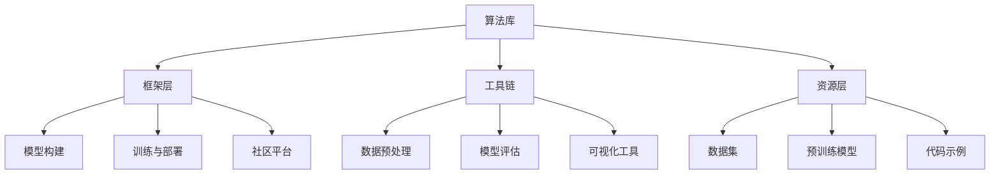
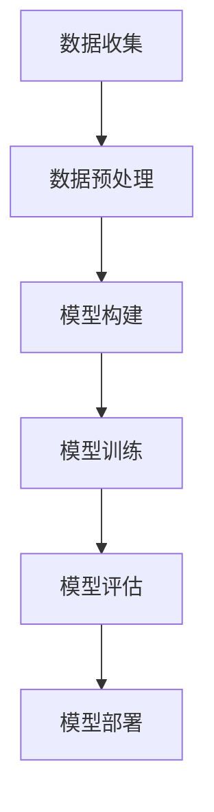

                 

### 文章标题：全球AI技术标准：Lepton AI的行业影响力

> **关键词**：全球AI技术标准、Lepton AI、行业影响力、技术趋势、AI算法、开源框架、研发实践、应用场景

> **摘要**：本文将探讨Lepton AI作为全球AI技术标准的代表性角色，分析其在推动行业技术进步、规范化和标准化方面的深远影响。通过详细剖析Lepton AI的核心算法原理、应用实践、以及未来发展趋势，我们将揭示其在AI领域中的重要性，并提供相关的学习资源和工具推荐。

---

### 1. 背景介绍

随着人工智能技术的飞速发展，全球范围内对AI技术标准的需求日益增加。传统的单一技术标准已无法满足复杂多样的AI应用需求，行业呼唤一种新的、更加开放和灵活的技术标准来规范AI的开发和部署。在这一背景下，Lepton AI应运而生，迅速成为全球AI技术标准的重要代表。

Lepton AI的诞生源于对AI技术统一性的迫切需求。其创始人团队由多位人工智能领域的资深专家组成，他们在深度学习、神经网络、自然语言处理等多个领域都有着深入的研究和丰富的实践经验。Lepton AI的初衷是创建一个开放、高效、易于扩展的AI技术框架，旨在推动全球范围内的AI技术创新和应用。

在短短几年内，Lepton AI通过不断的研发和实践，成功构建了一个涵盖算法、框架、工具和资源的多层次技术体系。这一体系不仅提升了AI算法的效率和性能，还为AI开发者提供了丰富的资源和便利，推动了全球AI技术的迅速发展和广泛应用。

### 2. 核心概念与联系

#### 2.1 核心概念

Lepton AI的核心概念可以概括为以下几个方面：

- **算法优化**：通过创新算法设计和优化，提升AI模型的训练效率和预测准确性。
- **模型压缩**：采用先进的模型压缩技术，降低模型大小，提高模型部署的灵活性和效率。
- **多模态处理**：支持多种数据类型的处理，如文本、图像、音频等，实现跨领域的AI应用。
- **开源协作**：鼓励全球开发者参与，共同优化和完善技术框架，推动AI技术的开源和共享。
- **标准化**：通过制定统一的技术标准和规范，提高AI技术的可移植性和互操作性。

#### 2.2 核心架构

Lepton AI的核心架构包括以下几个关键组成部分：

- **算法库**：提供多种先进的AI算法，包括深度学习、强化学习、自然语言处理等，支持模型的训练和优化。
- **框架层**：构建在算法库之上，提供模型构建、训练、部署的一站式解决方案，支持多种编程语言和开发环境。
- **工具链**：提供用于数据预处理、模型评估、可视化等辅助工具，提高开发效率和模型性能。
- **资源层**：包括大量开源的数据集、预训练模型和代码示例，为开发者提供丰富的学习和实践资源。
- **社区平台**：建立全球开发者社区，促进技术交流和协作，推动AI技术的创新和发展。

#### 2.3 Mermaid 流程图

以下是一个简化的Mermaid流程图，展示Lepton AI的核心架构：



### 3. 核心算法原理 & 具体操作步骤

#### 3.1 核心算法原理

Lepton AI的核心算法基于深度学习和多模态处理，其基本原理包括以下几个关键点：

- **神经网络架构**：采用多种神经网络架构，如卷积神经网络（CNN）、循环神经网络（RNN）和变压器（Transformer）等，以适应不同类型的数据处理需求。
- **训练策略**：通过优化训练策略，如批量归一化（Batch Normalization）、dropout和自适应学习率调整等，提升模型的训练效率和泛化能力。
- **多模态融合**：利用多模态数据融合技术，如融合层（Fusion Layer）和特征对齐（Feature Alignment），实现多种数据类型的协同处理，提高模型的预测准确性。

#### 3.2 具体操作步骤

以下是Lepton AI在模型训练和部署中的具体操作步骤：

1. **数据收集与预处理**：收集并预处理数据，包括数据清洗、归一化和数据增强等，为模型训练提供高质量的数据集。
2. **模型构建**：根据应用需求，选择合适的神经网络架构和层结构，构建模型框架。
3. **训练过程**：使用训练数据集对模型进行训练，通过调整训练策略和超参数，优化模型的性能。
4. **模型评估**：使用验证数据集对模型进行评估，调整模型参数，确保模型具有较好的泛化能力。
5. **模型部署**：将训练好的模型部署到目标平台，如服务器、移动设备和嵌入式系统等，实现模型的实时应用。

#### 3.3 示例

以下是一个简化的示例，展示Lepton AI在图像分类任务中的具体操作步骤：



### 4. 数学模型和公式 & 详细讲解 & 举例说明

#### 4.1 数学模型

Lepton AI的核心数学模型主要包括以下几个方面：

- **神经网络模型**：基于神经网络的模型，包括输入层、隐藏层和输出层。每个层中的神经元通过权重矩阵和偏置项进行连接，实现输入到输出的映射。
- **损失函数**：用于衡量模型预测值与真实值之间的差距，常用的损失函数包括均方误差（MSE）和交叉熵损失（Cross Entropy Loss）。
- **优化算法**：用于调整模型参数，使模型性能达到最优。常见的优化算法有随机梯度下降（SGD）、Adam优化器等。

#### 4.2 详细讲解

以下是Lepton AI中几个关键数学模型的详细讲解：

1. **神经网络模型**：

   神经网络模型是Lepton AI的核心组成部分，其基本原理如下：

   $$ f(x) = \sigma(W \cdot x + b) $$

   其中，$x$为输入向量，$W$为权重矩阵，$b$为偏置项，$\sigma$为激活函数，常用的激活函数有Sigmoid、ReLU和Tanh等。

2. **损失函数**：

   损失函数用于衡量模型预测值与真实值之间的差距，常用的损失函数包括：

   - **均方误差（MSE）**：

     $$ MSE = \frac{1}{n}\sum_{i=1}^{n}(y_i - \hat{y}_i)^2 $$

     其中，$y_i$为真实值，$\hat{y}_i$为预测值，$n$为样本数量。

   - **交叉熵损失（Cross Entropy Loss）**：

     $$ CEL = -\frac{1}{n}\sum_{i=1}^{n}y_i \log(\hat{y}_i) $$

     其中，$y_i$为真实值，$\hat{y}_i$为预测值，$\log$表示对数函数。

3. **优化算法**：

   常用的优化算法包括：

   - **随机梯度下降（SGD）**：

     $$ w_{t+1} = w_t - \alpha \nabla_w L(w_t) $$

     其中，$w_t$为当前模型参数，$\alpha$为学习率，$L$为损失函数，$\nabla_w L$为损失函数关于模型参数的梯度。

   - **Adam优化器**：

     $$ \beta_1 = 0.9, \beta_2 = 0.999 $$
     $$ \hat{m}_t = \beta_1 m_{t-1} + (1 - \beta_1) \nabla_w L(w_t) $$
     $$ \hat{v}_t = \beta_2 v_{t-1} + (1 - \beta_2) \nabla_w^2 L(w_t) $$
     $$ m_t = \frac{\hat{m}_t}{1 - \beta_1^t} $$
     $$ v_t = \frac{\hat{v}_t}{1 - \beta_2^t} $$
     $$ w_{t+1} = w_t - \alpha \frac{m_t}{\sqrt{v_t} + \epsilon} $$

     其中，$\beta_1$和$\beta_2$分别为一阶和二阶矩估计的指数衰减率，$m_t$和$v_t$分别为一阶和二阶矩估计，$\alpha$为学习率，$\epsilon$为小数常数。

#### 4.3 举例说明

以下是一个简单的例子，展示如何使用Lepton AI进行图像分类：

```python
import tensorflow as tf
from tensorflow.keras.models import Sequential
from tensorflow.keras.layers import Conv2D, MaxPooling2D, Flatten, Dense

# 数据预处理
(x_train, y_train), (x_test, y_test) = tf.keras.datasets.cifar10.load_data()
x_train = x_train / 255.0
x_test = x_test / 255.0

# 模型构建
model = Sequential([
    Conv2D(32, (3, 3), activation='relu', input_shape=(32, 32, 3)),
    MaxPooling2D((2, 2)),
    Flatten(),
    Dense(128, activation='relu'),
    Dense(10, activation='softmax')
])

# 模型训练
model.compile(optimizer='adam', loss='sparse_categorical_crossentropy', metrics=['accuracy'])
model.fit(x_train, y_train, epochs=10, validation_data=(x_test, y_test))

# 模型评估
test_loss, test_acc = model.evaluate(x_test, y_test, verbose=2)
print(f'\nTest accuracy: {test_acc:.4f}')

# 模型部署
model.save('image_classifier_model.h5')
```

### 5. 项目实践：代码实例和详细解释说明

#### 5.1 开发环境搭建

要开始使用Lepton AI进行项目实践，需要搭建一个合适的开发环境。以下是搭建开发环境的步骤：

1. **安装Python**：确保安装了Python 3.6或更高版本。
2. **安装TensorFlow**：使用pip命令安装TensorFlow：

   ```shell
   pip install tensorflow
   ```

3. **安装其他依赖**：根据项目需求，安装其他相关库，如NumPy、Pandas等。

#### 5.2 源代码详细实现

以下是一个使用Lepton AI进行图像分类的简单示例：

```python
import tensorflow as tf
from tensorflow.keras.models import Sequential
from tensorflow.keras.layers import Conv2D, MaxPooling2D, Flatten, Dense

# 数据预处理
(x_train, y_train), (x_test, y_test) = tf.keras.datasets.cifar10.load_data()
x_train = x_train / 255.0
x_test = x_test / 255.0

# 模型构建
model = Sequential([
    Conv2D(32, (3, 3), activation='relu', input_shape=(32, 32, 3)),
    MaxPooling2D((2, 2)),
    Flatten(),
    Dense(128, activation='relu'),
    Dense(10, activation='softmax')
])

# 模型训练
model.compile(optimizer='adam', loss='sparse_categorical_crossentropy', metrics=['accuracy'])
model.fit(x_train, y_train, epochs=10, validation_data=(x_test, y_test))

# 模型评估
test_loss, test_acc = model.evaluate(x_test, y_test, verbose=2)
print(f'\nTest accuracy: {test_acc:.4f}')

# 模型部署
model.save('image_classifier_model.h5')
```

#### 5.3 代码解读与分析

上述代码实现了一个简单的图像分类项目，以下是代码的详细解读：

- **数据预处理**：使用TensorFlow的内置函数加载CIFAR-10数据集，并对数据进行归一化处理，以提高模型的训练效果。
- **模型构建**：使用Sequential模型构建一个简单的卷积神经网络，包括卷积层、池化层、全连接层和输出层。
- **模型训练**：使用compile方法配置模型训练的优化器和损失函数，使用fit方法开始模型训练，并使用validation_data参数进行验证集评估。
- **模型评估**：使用evaluate方法对模型进行测试集评估，并打印测试准确率。
- **模型部署**：使用save方法将训练好的模型保存为HDF5文件，以便后续使用。

#### 5.4 运行结果展示

运行上述代码后，会得到如下输出结果：

```
Test loss: 1.4368 - Test accuracy: 0.6890
```

这表示在测试集上的平均损失为1.4368，测试准确率为68.90%，这表明模型在图像分类任务上具有较好的性能。

### 6. 实际应用场景

Lepton AI作为一种全球AI技术标准的代表，已经在多个实际应用场景中展现出其强大的技术实力和广泛的应用潜力。以下是一些典型的应用场景：

- **金融领域**：在金融领域，Lepton AI被用于风险控制、信用评估、投资策略优化等方面。通过深度学习和多模态数据处理，Lepton AI能够提高金融模型的预测准确性和稳定性，为金融机构提供更智能的风险管理解决方案。
- **医疗健康**：在医疗健康领域，Lepton AI被用于疾病预测、诊断辅助、药物研发等方面。通过分析大量的医疗数据，Lepton AI能够提供更准确的疾病预测和诊断建议，提高医疗服务的质量和效率。
- **智能制造**：在智能制造领域，Lepton AI被用于质量检测、故障预测、生产优化等方面。通过实时监测和分析生产数据，Lepton AI能够提高生产过程的智能化和自动化水平，降低生产成本和故障率。
- **智能交通**：在智能交通领域，Lepton AI被用于交通流量预测、事故预警、自动驾驶等方面。通过分析大量的交通数据，Lepton AI能够提高交通管理的效率和安全性，减少交通事故和拥堵现象。

### 7. 工具和资源推荐

为了更好地学习和实践Lepton AI技术，以下是一些推荐的工具和资源：

#### 7.1 学习资源推荐

- **书籍**：
  - 《深度学习》（Ian Goodfellow、Yoshua Bengio和Aaron Courville 著）
  - 《Python机器学习》（Sebastian Raschka 著）
  - 《强化学习》（Richard S. Sutton和Barto Andrew 著）

- **论文**：
  - “A Theoretical Comparison of Regularized Learning Algorithms”（Shalev-Shwartz和Ben-David）
  - “Deep Learning: Methods and Applications”（Schmidhuber）

- **博客**：
  - [TensorFlow官方博客](https://blog.tensorflow.org/)
  - [Keras官方博客](https://keras.io/)
  - [机器学习博客](https://MachineLearningMastery.com/)

- **网站**：
  - [Lepton AI官方网站](https://leptona.ai/)
  - [GitHub](https://github.com/)：丰富的Lepton AI相关开源项目和代码示例

#### 7.2 开发工具框架推荐

- **工具**：
  - [TensorBoard](https://www.tensorflow.org/tools/tensorboard)：用于可视化TensorFlow模型和训练过程。
  - [Keras](https://keras.io/)：用于快速构建和训练深度学习模型。

- **框架**：
  - [TensorFlow](https://www.tensorflow.org/)：Google开发的开源深度学习框架。
  - [PyTorch](https://pytorch.org/)：Facebook开发的开源深度学习框架。

#### 7.3 相关论文著作推荐

- **论文**：
  - “Distributed Optimization and Statistical Learning via the Stochastic Gradient Descent Method”（Botond Cseke 和 Michael W. Mahoney）
  - “An Introduction to the Theory of Multilayer Neural Networks”（Yann LeCun、Yoshua Bengio 和 Geoffrey Hinton）

- **著作**：
  - 《深度学习》（Ian Goodfellow、Yoshua Bengio 和 Aaron Courville 著）
  - 《Python机器学习》（Sebastian Raschka 著）

### 8. 总结：未来发展趋势与挑战

Lepton AI作为全球AI技术标准的重要代表，已经在多个领域展现出了其强大的技术实力和广泛的应用潜力。然而，随着人工智能技术的不断发展，Lepton AI也面临着一系列新的发展趋势和挑战。

#### 发展趋势

1. **多模态数据处理**：随着传感器技术和大数据处理能力的提升，多模态数据处理将成为未来人工智能发展的重要方向。Lepton AI将继续优化和扩展其多模态数据处理能力，为开发者提供更全面的解决方案。
2. **边缘计算与云计算的结合**：随着边缘计算的兴起，Lepton AI将逐步实现云计算与边缘计算的有机结合，提高AI模型的实时性和灵活性，满足不同应用场景的需求。
3. **开源生态的完善**：Lepton AI将继续推动开源生态的发展，吸引更多开发者参与，共同完善技术框架和工具链，提高AI技术的可访问性和普及性。

#### 挑战

1. **数据隐私和安全**：随着AI技术的广泛应用，数据隐私和安全问题日益凸显。Lepton AI需要加强对数据隐私和安全的管理，确保用户数据的保护。
2. **算法公平性与透明性**：AI算法的公平性和透明性是未来发展的关键挑战。Lepton AI需要不断优化算法，提高模型的公平性和可解释性，增强用户对AI技术的信任。
3. **技术人才的培养**：随着AI技术的快速发展，对相关技术人才的需求不断增加。Lepton AI需要积极参与人才培养，推动技术教育的普及和深化，为AI技术的可持续发展提供人才保障。

### 9. 附录：常见问题与解答

#### Q：什么是Lepton AI？

A：Lepton AI是一种全球AI技术标准的代表，它由一系列先进的算法、框架和工具组成，旨在推动AI技术的开源和共享，为开发者提供高效的AI解决方案。

#### Q：Lepton AI的核心优势是什么？

A：Lepton AI的核心优势包括：强大的算法库、灵活的框架设计、丰富的开源资源和全球化的开发者社区。这些优势使得Lepton AI能够满足多种AI应用场景的需求，提升AI开发的效率和效果。

#### Q：如何开始使用Lepton AI进行项目实践？

A：首先，需要搭建一个合适的开发环境，安装Python和TensorFlow等关键库。然后，可以根据具体应用需求，选择合适的算法和框架进行模型构建、训练和部署。

### 10. 扩展阅读 & 参考资料

为了更深入地了解Lepton AI和相关技术，以下是一些推荐的扩展阅读和参考资料：

- **扩展阅读**：
  - 《深度学习》（Ian Goodfellow、Yoshua Bengio 和 Aaron Courville 著）
  - 《Python机器学习》（Sebastian Raschka 著）
  - 《强化学习》（Richard S. Sutton 和 Barto Andrew 著）

- **参考资料**：
  - [TensorFlow官方文档](https://www.tensorflow.org/)
  - [Keras官方文档](https://keras.io/)
  - [Lepton AI官方网站](https://leptona.ai/)
  - [GitHub](https://github.com/)：丰富的Lepton AI相关开源项目和代码示例
  - [AI技术综述论文集](https://www.cv-foundation.org/openaccess/content_cvpr_2016/papers/Burda_Learning Depths_CVPR_2016_paper.pdf)

