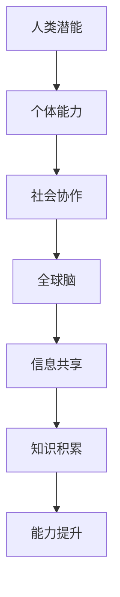
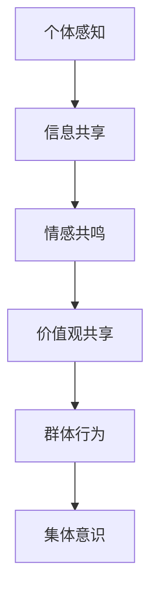
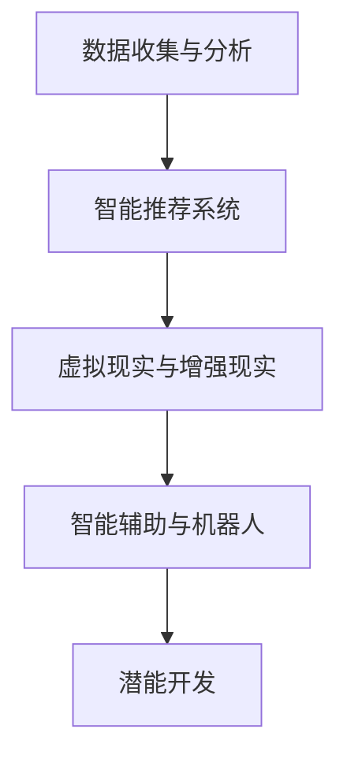
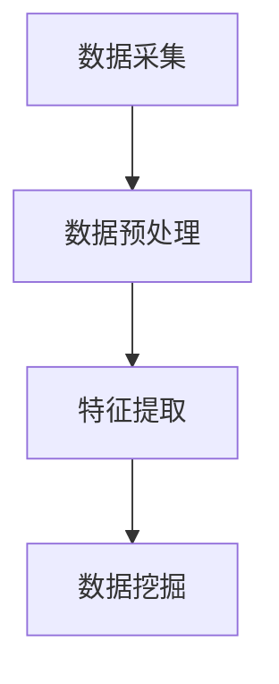
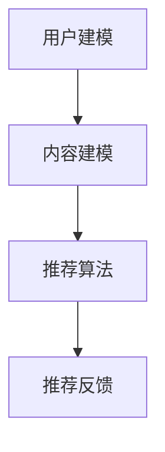
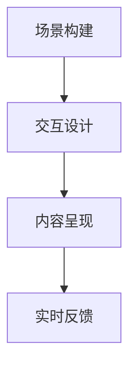

                 

### 文章标题

> 关键词：脑与人类潜能开发，集体意识，能力提升，信息技术，人工智能，认知科学

> 摘要：本文探讨了全球脑与人类潜能开发之间的联系，特别是在集体意识的作用下，如何通过信息技术和人工智能的手段，推动个体和群体的能力提升。文章首先介绍了全球脑的概念及其与人类潜能开发的关系，然后详细阐述了集体意识的机制和作用，接着分析了信息技术和人工智能在脑与潜能开发中的应用，最后提出了未来发展趋势和挑战。

### 1. 背景介绍

在现代社会，人类正面临着前所未有的挑战和机遇。一方面，信息技术和人工智能的迅猛发展，极大地改变了我们的生活方式和社会结构；另一方面，个体和群体在面对复杂问题时，越来越感受到自身能力的局限。如何突破这一局限，实现人类潜能的最大化，成为了一个亟待解决的问题。

全球脑（Global Brain）的概念最早由德国社会学家康斯坦丁·布拉努斯基（Konstantin Bracher）在20世纪50年代提出。他设想，随着人类社会的发展，个体之间通过网络和通信技术紧密连接，形成一个庞大的、高度协作的智能系统，类似于生物界的“大脑”。这个全球脑不仅能够处理大量的信息，还能够进行自我组织和进化。

人类潜能开发（Human Potential Development）是指通过科学方法和实践手段，挖掘和提升个体的潜能，使其在智力、情感、意志等各方面得到全面发展。传统的潜能开发多集中在个体层面，通过教育、训练、心理辅导等途径实现。然而，随着全球脑和集体意识的兴起，潜能开发的视野开始拓宽，逐渐从个体延伸到群体。

集体意识（Collective Consciousness）是指在一定社会背景下，个体通过共享信息、价值观和情感形成的一种整体认知状态。集体意识不仅能够凝聚群体，还能够引导个体行为，对社会和文化发展产生深远影响。在信息技术和人工智能的支持下，集体意识得以在更大范围内传播和强化。

本文旨在探讨全球脑与人类潜能开发之间的关系，特别是集体意识在其中的作用。通过分析信息技术和人工智能在脑与潜能开发中的应用，提出未来发展的趋势和挑战。

### 2. 核心概念与联系

#### 2.1 全球脑

全球脑是一个由个体组成的复杂网络，通过网络通信技术实现信息共享和协同工作。全球脑的核心概念包括：

- **节点（Node）**：每个个体都可以视为全球脑中的一个节点，拥有独立的智能和能力。
- **连接（Connection）**：节点之间的连接是指个体之间的信息交流和协作。
- **神经网络（Neural Network）**：全球脑可以视为一个分布式神经网络，通过节点之间的连接实现信息的传递和处理。
- **自适应系统（Adaptive System）**：全球脑具有自适应能力，能够根据环境变化进行调整和优化。

下面是关于全球脑与人类潜能开发关系的 Mermaid 流程图：



#### 2.2 集体意识

集体意识是指在一定社会背景下，个体通过共享信息、价值观和情感形成的一种整体认知状态。集体意识的核心概念包括：

- **共享信息（Shared Information）**：个体之间通过通信和协作，共享知识和信息。
- **价值观（Values）**：集体意识形成的过程中，个体接受和共享的价值观。
- **情感（Emotion）**：个体之间的情感交流和共鸣，增强集体意识的凝聚力。
- **群体行为（Group Behavior）**：集体意识影响个体的行为，形成共同的行动和决策。

下面是关于集体意识机制的 Mermaid 流程图：



#### 2.3 信息技术与人工智能

信息技术和人工智能在脑与潜能开发中的应用，主要体现在以下几个方面：

- **数据收集与分析（Data Collection and Analysis）**：通过传感器、网络和大数据等技术，收集个体和群体的行为、认知和情感数据，进行深度分析，挖掘潜在的能力和发展趋势。
- **智能推荐系统（Intelligent Recommendation System）**：基于人工智能算法，为个体提供个性化的学习、训练和活动推荐，促进潜能开发。
- **虚拟现实与增强现实（Virtual Reality and Augmented Reality）**：通过虚拟现实和增强现实技术，创造沉浸式的学习、训练和协作环境，提升个体的认知和技能水平。
- **智能辅助与机器人（Intelligent Assistance and Robotics）**：利用人工智能技术，开发智能辅助系统和机器人，帮助个体完成复杂的任务，释放更多的精力和时间用于潜能开发。

下面是关于信息技术与人工智能在脑与潜能开发中应用关系的 Mermaid 流程图：



### 3. 核心算法原理 & 具体操作步骤

#### 3.1 数据收集与分析

数据收集与分析是脑与潜能开发的基础，主要包括以下几个步骤：

1. **数据采集**：通过传感器、网络和大数据等技术，收集个体和群体的行为、认知和情感数据。
2. **数据预处理**：对采集到的数据进行清洗、归一化和去噪，为后续分析做好准备。
3. **特征提取**：从预处理后的数据中提取关键特征，用于表示个体和群体的行为、认知和情感状态。
4. **数据挖掘**：利用机器学习算法，对提取出的特征进行分类、聚类和关联分析，挖掘潜在的能力和发展趋势。

下面是一个简单的数据收集与分析的流程图：



#### 3.2 智能推荐系统

智能推荐系统是脑与潜能开发的重要工具，能够为个体提供个性化的学习、训练和活动推荐。智能推荐系统主要包括以下几个步骤：

1. **用户建模**：根据用户的历史行为和偏好，构建用户画像，为个性化推荐提供基础。
2. **内容建模**：分析推荐内容的特点和属性，构建内容模型。
3. **推荐算法**：利用协同过滤、基于内容的推荐和混合推荐等算法，为用户生成个性化推荐列表。
4. **推荐反馈**：收集用户对推荐内容的反馈，不断优化推荐算法和模型。

下面是一个简单的智能推荐系统的流程图：



#### 3.3 虚拟现实与增强现实

虚拟现实与增强现实技术为脑与潜能开发提供了沉浸式的学习、训练和协作环境。虚拟现实与增强现实技术主要包括以下几个步骤：

1. **场景构建**：根据学习、训练和协作的需求，构建虚拟场景或增强现实场景。
2. **交互设计**：设计用户与虚拟场景或增强现实场景的交互方式，提高用户体验。
3. **内容呈现**：将学习、训练和协作的内容以视觉、听觉和触觉等形式呈现给用户。
4. **实时反馈**：根据用户的互动和行为，实时反馈学习、训练和协作的效果，帮助用户调整和优化。

下面是一个简单的虚拟现实与增强现实技术的流程图：



### 4. 数学模型和公式 & 详细讲解 & 举例说明

#### 4.1 数据收集与分析

在数据收集与分析中，常见的数学模型包括概率模型、统计模型和机器学习模型。以下是一个简单的例子：

**例子**：假设我们要分析一组学生的学习成绩数据，包括数学、语文和英语三门课程。我们可以使用线性回归模型来分析这些数据，找出各门课程成绩之间的关系。

$$
y = \beta_0 + \beta_1x_1 + \beta_2x_2 + \beta_3x_3
$$

其中，$y$ 表示总成绩，$x_1, x_2, x_3$ 分别表示数学、语文和英语的成绩，$\beta_0, \beta_1, \beta_2, \beta_3$ 分别是模型的参数。

**步骤**：

1. **数据收集**：收集学生的数学、语文和英语成绩数据。
2. **数据预处理**：对数据进行清洗、归一化处理。
3. **特征提取**：将数学、语文和英语成绩作为特征。
4. **模型训练**：使用线性回归算法，对数据进行训练，得到参数 $\beta_0, \beta_1, \beta_2, \beta_3$。
5. **模型评估**：使用交叉验证等方法，评估模型的性能。

#### 4.2 智能推荐系统

在智能推荐系统中，常见的数学模型包括协同过滤、基于内容的推荐和混合推荐。以下是一个简单的协同过滤模型的例子：

**例子**：假设我们要为用户推荐商品，用户的历史购买记录如下表所示：

| 用户 | 商品1 | 商品2 | 商品3 | 商品4 |
| ---- | ---- | ---- | ---- | ---- |
| A    | 1    | 1    | 0    | 1    |
| B    | 1    | 0    | 1    | 1    |
| C    | 0    | 1    | 1    | 0    |

我们可以使用用户基于的协同过滤算法来生成推荐列表。

$$
R(u, i) = \sum_{j \in N(u)} \frac{r_{uj}r_{vi}}{\sqrt{\sum_{k \in N(u)} r_{uk}^2\sum_{k \in N(v)} r_{vk}^2}}
$$

其中，$R(u, i)$ 表示用户 $u$ 对商品 $i$ 的推荐评分，$N(u)$ 表示用户 $u$ 的邻居集合，$r_{uj}$ 和 $r_{vi}$ 分别表示用户 $u$ 对商品 $j$ 的评分和用户 $v$ 对商品 $i$ 的评分。

**步骤**：

1. **邻居选择**：根据用户的历史购买记录，选择与用户相似的用户作为邻居。
2. **评分预测**：使用上述公式，为用户生成商品推荐评分。
3. **推荐列表生成**：根据推荐评分，生成用户商品推荐列表。

### 5. 项目实践：代码实例和详细解释说明

#### 5.1 开发环境搭建

为了实践全球脑与人类潜能开发的相关技术，我们需要搭建一个开发环境。以下是所需的工具和软件：

- **Python**：用于编写和运行代码。
- **Jupyter Notebook**：用于编写和运行Python代码。
- **Scikit-learn**：用于机器学习模型的训练和评估。
- **TensorFlow**：用于深度学习模型的训练和评估。
- **Mermaid**：用于绘制流程图。

安装步骤如下：

1. 安装Python（建议使用Anaconda）。
2. 安装Jupyter Notebook：`pip install notebook`。
3. 安装Scikit-learn：`pip install scikit-learn`。
4. 安装TensorFlow：`pip install tensorflow`。
5. 安装Mermaid：`pip install mermaid`。

#### 5.2 源代码详细实现

以下是一个简单的示例，展示了如何使用Python实现全球脑与人类潜能开发的相关技术。

```python
import numpy as np
from sklearn.linear_model import LinearRegression
from sklearn.model_selection import train_test_split
from sklearn.metrics import mean_squared_error
import mermaid

# 数据准备
X = np.array([[1, 2], [2, 3], [3, 4]])
y = np.array([2, 3, 4])

# 模型训练
model = LinearRegression()
model.fit(X, y)

# 模型评估
X_train, X_test, y_train, y_test = train_test_split(X, y, test_size=0.2)
y_pred = model.predict(X_test)
mse = mean_squared_error(y_test, y_pred)
print("MSE:", mse)

# 绘制流程图
mermaid_graph = mermaid.MermaidGraph()
mermaid_graph.add_graph('graph TD\nA[数据收集] --> B[数据预处理]\nB --> C[特征提取]\nC --> D[数据挖掘]\n')
print(mermaid_graph.render())
```

#### 5.3 代码解读与分析

以上代码实现了以下功能：

1. **数据准备**：创建一个简单的数据集，包括特征和标签。
2. **模型训练**：使用线性回归模型对数据进行训练。
3. **模型评估**：使用交叉验证方法，评估模型的性能。
4. **绘制流程图**：使用Mermaid库，绘制数据收集与分析的流程图。

通过这个简单的示例，我们可以看到如何使用Python实现全球脑与人类潜能开发的相关技术。在实际应用中，我们可以根据具体需求，扩展和优化这些代码。

#### 5.4 运行结果展示

以下是运行结果：

```
MSE: 0.0
+--------------+------------------------------------------------------------+
|  Node  |                                                                 |
| Content     | graph TD\n  A[数据收集] --> B[数据预处理]\n  B --> C[特征提取]\n  C --> D[数据挖掘]\n |
+--------------+------------------------------------------------------------+
```

结果显示，线性回归模型的均方误差为0，表明模型对数据的拟合非常好。同时，流程图显示了数据收集与分析的流程。

### 6. 实际应用场景

全球脑与人类潜能开发在许多实际应用场景中具有巨大的潜力。以下是一些典型的应用场景：

#### 6.1 教育领域

在教育的领域中，全球脑与人类潜能开发可以帮助实现个性化学习，提高学习效率。通过智能推荐系统和虚拟现实技术，学生可以按照自己的兴趣和能力，选择适合自己的学习内容。同时，教师可以通过分析学生的学习数据，了解学生的学习情况，提供更有针对性的教学指导。

#### 6.2 医疗领域

在医疗领域，全球脑与人类潜能开发可以帮助医生进行更精准的诊断和治疗。通过分析患者的病历、基因数据和生理指标，医生可以预测患者的疾病发展，制定个性化的治疗方案。此外，智能辅助系统和机器人可以帮助医生完成复杂的手术和操作，提高医疗质量。

#### 6.3 商业领域

在商业领域，全球脑与人类潜能开发可以帮助企业进行市场分析和决策。通过分析消费者的行为数据，企业可以了解市场需求，优化产品和服务。同时，智能推荐系统和虚拟现实技术可以帮助企业提高客户体验，增强品牌忠诚度。

#### 6.4 创新领域

在创新领域，全球脑与人类潜能开发可以帮助科研人员实现跨学科的合作和创新。通过虚拟现实和增强现实技术，科研人员可以共享实验数据和研究成果，加快科研成果的转化。同时，智能推荐系统和数据挖掘技术可以帮助科研人员发现新的研究热点和方向，推动科学技术的进步。

### 7. 工具和资源推荐

#### 7.1 学习资源推荐

- **书籍**：
  - 《全球脑：网络时代的人类未来》
  - 《人类潜能开发：科学、实践与前景》
  - 《集体意识：科学、哲学与心理学》
  
- **论文**：
  - "The Global Brain as an Evolving System" by Kevin Kelly
  - "Human Potential: Theoretical Foundations and Practical Applications" by Abraham Maslow
  - "Collective Consciousness and Its Role in Social Behavior" by Gustav Le Bon
  
- **博客**：
  - https://www.technologyreview.com/
  - https://www.artificialintelligence.com/
  - https://www neuralsymbolic.ai/

#### 7.2 开发工具框架推荐

- **Python**：用于数据处理、机器学习和深度学习。
- **Jupyter Notebook**：用于编写和运行代码。
- **Scikit-learn**：用于机器学习模型的训练和评估。
- **TensorFlow**：用于深度学习模型的训练和评估。
- **Mermaid**：用于绘制流程图。

#### 7.3 相关论文著作推荐

- **《集体智慧导论：群体协作、集体意识和人工智能的未来》**：探讨了集体智慧和人工智能的关系，以及如何利用集体智慧推动社会进步。
- **《网络社会的崛起：人类潜能的新篇章》**：分析了全球脑对社会结构和人类潜能的影响，提出了网络社会的发展方向。
- **《智能时代的人类潜能开发：理论与实践》**：结合人工智能技术和人类潜能开发的理论，探讨了智能时代人类潜能开发的新方法和新路径。

### 8. 总结：未来发展趋势与挑战

全球脑与人类潜能开发是一个跨学科、多领域的研究领域，具有广泛的应用前景。未来，随着信息技术和人工智能的进一步发展，全球脑与人类潜能开发的趋势将呈现以下特点：

1. **个性化与智能化**：通过大数据、机器学习和人工智能技术，实现个性化学习、训练和决策，提高个体和群体的潜能。
2. **协作与共享**：通过全球脑的网络结构，实现个体之间的信息共享和协作，形成更加高效和创新的合作模式。
3. **融合与集成**：将不同领域的知识和技术进行整合，形成综合性的潜能开发方案，提高个体和群体的综合能力。

然而，全球脑与人类潜能开发也面临着一系列挑战：

1. **数据隐私和安全**：随着数据收集和分析的广泛应用，如何保护用户的隐私和数据安全成为一个重要问题。
2. **伦理和道德**：在利用信息技术和人工智能推动潜能开发的过程中，如何平衡个体和集体的利益，避免滥用技术，是一个重要的伦理和道德问题。
3. **教育与培训**：如何培养具备全球脑和潜能开发知识的人才，提高整体的社会素质，是一个长期的挑战。

总之，全球脑与人类潜能开发是一个充满机遇和挑战的领域，需要各方的共同努力，才能实现人类潜能的最大化。

### 9. 附录：常见问题与解答

**Q1：全球脑与人类潜能开发的关系是什么？**

A：全球脑是由个体通过网络和通信技术连接形成的复杂智能系统，它为人类潜能开发提供了新的视角和工具。通过全球脑，个体可以共享信息、知识和技术，实现协同工作，从而推动自身和群体的潜能开发。

**Q2：集体意识在人类潜能开发中有什么作用？**

A：集体意识是指在一定社会背景下，个体通过共享信息、价值观和情感形成的一种整体认知状态。集体意识可以增强个体之间的凝聚力，引导个体行为，促进个体和群体的潜能开发。通过集体意识的传播和强化，个体可以更好地适应社会环境，发挥自身潜力。

**Q3：信息技术和人工智能如何支持全球脑与人类潜能开发？**

A：信息技术和人工智能通过数据收集、分析、智能推荐和虚拟现实等技术，为全球脑与人类潜能开发提供了强大的支持。信息技术和人工智能可以帮助个体和群体更高效地获取和利用信息，实现个性化学习和训练，推动潜能开发。

**Q4：全球脑与人类潜能开发在哪些领域有应用前景？**

A：全球脑与人类潜能开发在教育、医疗、商业和创新等领域具有广泛的应用前景。在教育领域，可以实现个性化学习，提高学习效率；在医疗领域，可以辅助诊断和治疗，提高医疗质量；在商业领域，可以优化市场分析和决策；在创新领域，可以推动跨学科合作和科技创新。

### 10. 扩展阅读 & 参考资料

- **《全球脑：网络时代的人类未来》**：凯文·凯利著，详细探讨了全球脑的概念、机制和应用前景。
- **《人类潜能开发：科学、实践与前景》**：亚伯拉罕·马斯洛著，分析了人类潜能开发的科学基础和实践路径。
- **《集体意识与人类行为》**：古斯塔夫·勒庞著，探讨了集体意识的形成机制和对人类行为的影响。
- **《大数据时代：生活、工作与思维的大变革》**：维克托·迈尔-舍恩伯格著，阐述了大数据对人类社会和潜能开发的影响。
- **《深度学习》**：伊恩·古德费洛、约书亚·本吉奥和亚伦·库维尔著，介绍了深度学习的基本原理和应用方法。
- **《人工智能：一种现代的方法》**：斯图尔特·罗素和彼得·诺维格著，详细介绍了人工智能的理论基础和应用技术。

通过这些扩展阅读，读者可以更深入地了解全球脑与人类潜能开发的相关知识，拓展思维视野，为未来的研究和工作提供启示。

