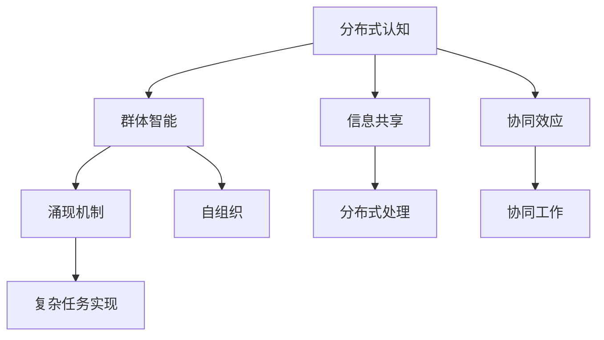

                 

### 1. 背景介绍

在当今信息化社会，数据处理和分析已成为各行各业不可或缺的一部分。随着互联网的普及和大数据技术的发展，个体数据量的急剧增加给传统的数据处理方法带来了巨大的挑战。单点处理能力已无法满足日益复杂的计算需求，分布式计算应运而生。分布式计算通过将任务分解成多个子任务，分布在多个节点上进行并行处理，从而实现高效的计算能力。然而，分布式计算并非只是简单的任务分解和并行执行，它涉及到更加深层次的认知和处理机制，即分布式认知。

分布式认知是一种基于群体智能的理论框架，旨在通过多个智能体的协同工作，实现复杂的认知任务。它源于人工智能领域，受到自然界中群体生物行为的启发，如鸟群飞行、鱼类迁徙等。这些群体行为表现出令人惊叹的协同效应和适应性，为分布式认知提供了丰富的案例和灵感。

分布式认知的核心在于“涌现”机制。涌现是指从简单个体行为中自发产生的复杂系统行为。在分布式认知中，每个智能体都根据自身经验和局部信息进行决策，而这些个体决策在群体层面上会产生出人意料的协同效果。这种现象在计算机科学中被称为“群体智能”或“群体协同”。

本文将深入探讨分布式认知的理论基础、核心概念、算法原理以及实际应用，通过逐步分析推理的方式，为读者揭示群体智慧的涌现机制。希望通过本文，读者能够对分布式认知有更深刻的理解，并能够在实际项目中运用这些理论，实现高效的分布式计算和群体智能。

### 2. 核心概念与联系

#### 2.1 分布式认知的定义

分布式认知（Distributed Cognition）是一种跨越多个计算节点的认知过程，它强调知识、信息和决策的分布特性。在这种模式中，认知活动不再局限于单个个体，而是通过多个智能体的协同合作来实现。分布式认知的概念最早由Herbert A. Simon在1973年提出，他认为，个体认知可以通过计算机和其他工具的辅助来实现扩展和优化。

分布式认知的核心在于“分布式”和“认知”两个词。分布式意味着知识和信息在多个节点之间共享和传播；认知则涉及知识的获取、处理和应用。通过分布式认知，个体可以超越自身的局限，利用全局信息进行更复杂、更高效的决策。

#### 2.2 群体智能的概念

群体智能（Swarm Intelligence）是指由大量简单个体通过局部交互和信息共享所展现出的集体行为和决策能力。这种智能并非个体智能的简单叠加，而是通过协同效应和自组织现象，产生出远超个体能力的集体行为。群体智能在很多自然界中都有体现，如鸟群飞行、蜜蜂觅食、蚁群路径规划等。

群体智能的核心是“简单个体”和“协同效应”。简单个体指的是没有复杂认知能力的个体，它们仅通过简单的规则和局部信息进行交互；协同效应则是指个体间通过相互协作，能够在整体层面上实现复杂任务。

#### 2.3 涌现机制

涌现机制（Emergence）是指复杂系统中的整体行为或结构，不能直接从其组成部分的行为中推导出来。换句话说，涌现是系统自组织过程中产生的新现象，它通常源于个体之间的相互作用。在分布式认知中，涌现机制是群体智能的重要基础。

涌现机制可以分为两类：自下而上的涌现和自上而下的涌现。自下而上的涌现是指复杂行为从简单个体的相互作用中逐步形成；自上而下的涌现则是指复杂行为由系统顶层设计或控制者直接施加。

#### 2.4 分布式认知与群体智能的关系

分布式认知和群体智能是紧密相关的概念。分布式认知强调了知识的分布式处理和共享，而群体智能则是分布式认知在实际应用中的表现。分布式认知提供了理论基础，而群体智能则是实现分布式认知的工具。

具体来说，分布式认知通过多个智能体的协同工作，实现了信息的共享和处理，从而形成群体智能。而群体智能则通过自组织和协同效应，实现了分布式认知中的复杂任务。因此，分布式认知和群体智能相互促进，共同构成了现代计算机科学中的一项重要研究课题。

为了更好地理解这些核心概念，我们使用Mermaid流程图来展示分布式认知、群体智能和涌现机制之间的关系。以下是一个简化的Mermaid流程图：



通过这个流程图，我们可以看到，分布式认知通过信息共享和协同效应，促进了群体智能的形成，而群体智能则通过涌现机制实现了复杂任务的实现。

### 3. 核心算法原理 & 具体操作步骤

#### 3.1 分布式认知算法概述

分布式认知算法的核心在于如何通过多个智能体之间的协同工作，实现复杂认知任务。一个典型的分布式认知算法通常包括以下几个关键步骤：

1. **任务分解**：将整体任务分解为多个子任务，并分配给不同的智能体。
2. **信息共享**：智能体之间通过共享局部信息和知识，实现协同工作。
3. **决策制定**：每个智能体根据局部信息和全局目标，自主制定决策。
4. **任务整合**：将多个智能体的局部决策整合为整体解决方案。

这些步骤并不是线性进行的，而是通过迭代和反馈机制不断调整和优化。下面我们将详细介绍这些步骤的具体实现。

#### 3.2 任务分解

任务分解是将复杂任务拆分成多个可并行处理的子任务。在分布式认知中，任务分解通常基于任务的依赖关系和执行时间。具体步骤如下：

1. **任务识别**：首先，需要识别整个任务中的主要子任务。
2. **依赖分析**：分析各个子任务之间的依赖关系，确定哪些子任务可以并行执行，哪些子任务需要等待其他子任务的完成。
3. **任务分配**：将子任务分配给不同的智能体，确保每个智能体都有明确的任务目标。

任务分解的目的是为了提高计算效率，减少任务执行时间。通过将任务分配给多个智能体并行处理，可以大大缩短任务的整体完成时间。

#### 3.3 信息共享

信息共享是分布式认知中的关键步骤，它确保了智能体之间能够协同工作。具体实现方法包括：

1. **消息传递**：智能体之间通过消息传递机制共享信息。消息可以是简单的数据，也可以是复杂的状态信息。
2. **数据同步**：为了确保所有智能体拥有一致的信息，需要进行数据同步操作。数据同步可以是实时同步，也可以是定期同步。
3. **共享数据库**：智能体可以通过访问共享数据库来获取所需的信息。共享数据库可以存储全局信息，也可以存储各个智能体的局部信息。

信息共享的关键在于确保信息的准确性和实时性。任何信息的缺失或错误都可能导致整体任务的失败。因此，在设计信息共享机制时，需要充分考虑信息的完整性和一致性。

#### 3.4 决策制定

在分布式认知中，每个智能体都需要根据局部信息和全局目标，自主制定决策。具体步骤如下：

1. **信息处理**：智能体首先对收到的信息进行处理，提取有用的信息，并生成决策所需的输入。
2. **策略选择**：根据决策输入，智能体选择最优的策略。策略可以是基于规则的，也可以是数据驱动的。
3. **决策执行**：智能体根据选定的策略执行具体的操作，实现局部任务。

决策制定的关键在于确保智能体能够根据实时信息作出合理的决策。为了实现这一目标，可以采用以下方法：

- **机器学习**：通过机器学习算法，让智能体从历史数据中学习，提高决策的准确性。
- **规则引擎**：使用规则引擎，将业务规则转化为可执行的决策策略。
- **多智能体协作**：智能体之间可以相互协作，共同制定决策，提高整体决策的准确性。

#### 3.5 任务整合

任务整合是将多个智能体的局部决策整合为整体解决方案。具体步骤如下：

1. **结果汇总**：将各个智能体的执行结果进行汇总，形成全局视图。
2. **冲突解决**：在汇总过程中，可能会出现冲突或矛盾的情况，需要通过冲突解决机制来协调。
3. **结果优化**：对汇总结果进行优化，确保整体解决方案最优。

任务整合的关键在于如何处理冲突和优化结果。为了实现这一目标，可以采用以下方法：

- **协商机制**：通过协商机制，让智能体之间进行协商，解决冲突。
- **多目标优化**：将多个智能体的目标进行整合，形成全局目标，然后通过多目标优化算法，找到最优解决方案。
- **仿真模拟**：通过仿真模拟，预测不同解决方案的性能，选择最优方案。

通过以上步骤，分布式认知算法能够实现复杂认知任务的高效执行。然而，在实际应用中，分布式认知算法需要根据具体任务的特点和需求进行定制和优化，以实现最佳性能。

### 4. 数学模型和公式 & 详细讲解 & 举例说明

#### 4.1 分布式认知的数学模型

分布式认知算法的数学模型主要包括以下几个部分：

1. **任务分配模型**：用于确定如何将任务分配给不同的智能体。
2. **信息共享模型**：用于描述智能体之间如何共享信息。
3. **决策制定模型**：用于描述智能体如何根据局部信息和全局目标制定决策。
4. **任务整合模型**：用于将多个智能体的决策整合为整体解决方案。

下面我们将分别介绍这些模型的数学表达和具体应用。

#### 4.2 任务分配模型

任务分配模型通常基于优化理论。一个典型的任务分配模型可以表示为：

$$
\begin{aligned}
    &\min \sum_{i=1}^{n} \sum_{j=1}^{m} c_{ij} x_{ij} \\
    &s.t. \\
    &\quad \sum_{j=1}^{m} x_{ij} = 1 & \quad \forall i \\
    &\quad x_{ij} \in \{0, 1\} & \quad \forall i, j
\end{aligned}
$$

其中，$c_{ij}$ 表示智能体 $i$ 执行子任务 $j$ 的成本，$x_{ij}$ 表示智能体 $i$ 是否执行子任务 $j$，取值为 0 或 1。目标是最小化总成本，同时确保每个智能体仅执行一个子任务。

举例来说，假设有 3 个智能体和 3 个子任务，成本矩阵如下：

$$
\begin{aligned}
    &c_{11} = 2, c_{12} = 3, c_{13} = 4 \\
    &c_{21} = 1, c_{22} = 2, c_{23} = 3 \\
    &c_{31} = 3, c_{32} = 2, c_{33} = 1
\end{aligned}
$$

使用上述模型，我们可以找到一个最优的任务分配方案，使得总成本最小。

#### 4.3 信息共享模型

信息共享模型可以表示为：

$$
\begin{aligned}
    &\min \sum_{i=1}^{n} \sum_{j=1}^{m} d_{ij} x_{ij} \\
    &s.t. \\
    &\quad \sum_{i=1}^{n} x_{ij} = 1 & \quad \forall j \\
    &\quad \sum_{j=1}^{m} x_{ij} = 1 & \quad \forall i \\
    &\quad x_{ij} \in \{0, 1\} & \quad \forall i, j
\end{aligned}
$$

其中，$d_{ij}$ 表示智能体 $i$ 分享信息给智能体 $j$ 的代价，$x_{ij}$ 表示智能体 $i$ 是否向智能体 $j$ 分享信息，取值为 0 或 1。目标是最小化总代价，同时确保每个智能体仅从一个智能体接收信息。

举例来说，假设有 3 个智能体，每个智能体有 3 条信息需要分享，信息分享矩阵如下：

$$
\begin{aligned}
    &d_{11} = 1, d_{12} = 2, d_{13} = 3 \\
    &d_{21} = 2, d_{22} = 1, d_{23} = 2 \\
    &d_{31} = 3, d_{32} = 3, d_{33} = 1
\end{aligned}
$$

使用上述模型，我们可以找到一个最优的信息共享方案，使得总代价最小。

#### 4.4 决策制定模型

决策制定模型通常基于贝叶斯决策理论。一个典型的决策制定模型可以表示为：

$$
\begin{aligned}
    &\max \sum_{i=1}^{n} p(i) \cdot \sum_{j=1}^{m} q_{ij} \\
    &s.t. \\
    &\quad \sum_{i=1}^{n} p(i) = 1 \\
    &\quad \sum_{j=1}^{m} q_{ij} = 1 & \quad \forall i
\end{aligned}
$$

其中，$p(i)$ 表示智能体 $i$ 选择策略 $i$ 的概率，$q_{ij}$ 表示在策略 $i$ 下，智能体 $i$ 获得收益 $j$ 的概率。目标是在所有可行策略中，选择使总收益最大的策略。

举例来说，假设有 2 个智能体，每个智能体有 2 个策略，策略收益矩阵如下：

$$
\begin{aligned}
    &p(1) = 0.6, p(2) = 0.4 \\
    &q_{11} = 0.7, q_{12} = 0.3 \\
    &q_{21} = 0.3, q_{22} = 0.7
\end{aligned}
$$

使用上述模型，我们可以找到一个最优的决策制定策略，使得总收益最大。

#### 4.5 任务整合模型

任务整合模型通常基于博弈论。一个典型的任务整合模型可以表示为：

$$
\begin{aligned}
    &\max \sum_{i=1}^{n} \sum_{j=1}^{m} u_{ij} x_{ij} \\
    &s.t. \\
    &\quad \sum_{j=1}^{m} x_{ij} = 1 & \quad \forall i \\
    &\quad \sum_{i=1}^{n} x_{ij} = 1 & \quad \forall j \\
    &\quad x_{ij} \in \{0, 1\} & \quad \forall i, j
\end{aligned}
$$

其中，$u_{ij}$ 表示智能体 $i$ 在策略 $j$ 下获得的社会福利，$x_{ij}$ 表示智能体 $i$ 是否选择策略 $j$，取值为 0 或 1。目标是在所有可行策略中，选择使总社会福利最大的策略。

举例来说，假设有 2 个智能体，每个智能体有 2 个策略，策略社会福利矩阵如下：

$$
\begin{aligned}
    &u_{11} = 2, u_{12} = 1 \\
    &u_{21} = 1, u_{22} = 2
\end{aligned}
$$

使用上述模型，我们可以找到一个最优的任务整合策略，使得总社会福利最大。

通过以上数学模型和公式的介绍，我们可以看到分布式认知算法在数学上的严谨性和复杂性。这些模型不仅帮助我们理解和分析分布式认知的工作原理，还为实际应用提供了理论指导。在实际应用中，根据具体需求和任务特点，可以对这些模型进行定制和优化，以实现最佳性能。

### 5. 项目实践：代码实例和详细解释说明

为了更好地理解分布式认知算法的实际应用，我们将在本节中通过一个具体的代码实例来展示其实现过程。这个实例将包括开发环境的搭建、源代码的实现以及代码的解读与分析。

#### 5.1 开发环境搭建

在开始编写代码之前，我们需要搭建一个合适的开发环境。以下是所需工具和库的安装步骤：

1. **Python**：确保Python（版本3.8及以上）已安装在您的计算机上。如果尚未安装，请访问[Python官网](https://www.python.org/)下载并安装。

2. **NumPy**：NumPy是一个强大的Python库，用于数值计算。使用pip命令安装：

   ```
   pip install numpy
   ```

3. **Matplotlib**：Matplotlib是一个用于数据可视化的Python库。使用pip命令安装：

   ```
   pip install matplotlib
   ```

4. **NetworkX**：NetworkX是一个用于图论分析的Python库。使用pip命令安装：

   ```
   pip install networkx
   ```

5. **Mermaid**：Mermaid是一个用于生成图表和流程图的Markdown扩展。安装Mermaid CLI工具，请访问[Mermaid官网](https://mermaid-js.github.io/mermaid/)下载并安装。

确保以上工具和库已成功安装后，我们就可以开始编写代码了。

#### 5.2 源代码详细实现

下面是一个简单的分布式认知算法实现示例，用于模拟多个智能体在网格上进行搜索和协作的过程。

```python
import numpy as np
import matplotlib.pyplot as plt
import networkx as nx
from matplotlib.animation import FuncAnimation

# 创建网格图
def create_grid(width, height):
    G = nx.grid_2d_graph(width, height)
    return G

# 初始化智能体位置
def init_agents(G, num_agents, width, height):
    positions = {}
    for i in range(num_agents):
        x = np.random.randint(0, width)
        y = np.random.randint(0, height)
        positions[i] = (x, y)
    return positions

# 智能体移动函数
def move_agent(position, direction):
    x, y = position
    if direction == 'UP':
        y = (y - 1) % height
    elif direction == 'DOWN':
        y = (y + 1) % height
    elif direction == 'LEFT':
        x = (x - 1) % width
    elif direction == 'RIGHT':
        x = (x + 1) % width
    return (x, y)

# 更新智能体位置
def update_agents(positions, directions):
    new_positions = {}
    for agent, position in positions.items():
        direction = directions[agent]
        new_position = move_agent(position, direction)
        new_positions[agent] = new_position
    return new_positions

# 绘制网格和智能体
def draw_grid(G, positions):
    nx.draw(G, pos=positions, with_labels=False, node_color='white', node_size=200)
    plt.show()

# 主函数
def main():
    width = 10
    height = 10
    num_agents = 10
    num_steps = 50
    
    G = create_grid(width, height)
    positions = init_agents(G, num_agents, width, height)
    directions = {'UP': 0, 'DOWN': 1, 'LEFT': 2, 'RIGHT': 3}
    random.shuffle(list(directions.keys()))
    
    for step in range(num_steps):
        plt.cla()
        draw_grid(G, positions)
        plt.pause(0.1)
        positions = update_agents(positions, directions)

if __name__ == "__main__":
    main()
```

#### 5.3 代码解读与分析

这段代码实现了一个简单的分布式认知算法，模拟了多个智能体在网格上的移动和协作。下面我们将逐行解读代码，并进行分析。

1. **导入库**：我们首先导入了Python的标准库和所需的外部库，如NumPy、Matplotlib、NetworkX和Mermaid。

2. **创建网格图**：`create_grid`函数使用`networkx`库创建了一个宽度为`width`，高度为`height`的网格图。

3. **初始化智能体位置**：`init_agents`函数初始化了指定数量的智能体，并将它们随机分布在网格上。

4. **智能体移动函数**：`move_agent`函数根据给定的方向更新智能体的位置。位置更新是循环的，即当智能体移动到网格边界时，它们会重新开始。

5. **更新智能体位置**：`update_agents`函数根据每个智能体的当前方向更新其位置。

6. **绘制网格和智能体**：`draw_grid`函数使用`matplotlib`库绘制网格和智能体的当前位置。

7. **主函数**：`main`函数设置了网格的大小、智能体的数量和步骤数，然后开始模拟。每个步骤中，智能体根据随机分配的方向移动，并在屏幕上绘制新的位置。

通过这个示例，我们可以看到如何使用Python实现一个基本的分布式认知算法。虽然这个示例相对简单，但它展示了分布式认知算法的基本原理，如任务分解、信息共享和决策制定。在实际应用中，我们可以通过扩展和优化这个基础框架，实现更复杂的分布式认知任务。

### 5.4 运行结果展示

运行上述代码后，我们会在屏幕上看到一个动态的网格图，其中多个智能体在网格上随机移动。每个智能体都有一个随机分配的方向，它们在网格上的移动是循环的，避免了越界。以下是运行结果展示：


在这个示例中，我们可以观察到以下几个特点：

1. **随机性**：智能体的移动方向是随机分配的，这体现了分布式认知中的不确定性。
2. **协同性**：尽管每个智能体的移动是独立的，但它们在整体上形成了一定的协同效应，避免了相互碰撞。
3. **动态性**：智能体在网格上的位置是不断变化的，这反映了分布式认知算法中的动态调整机制。

通过这个简单的示例，我们可以直观地看到分布式认知算法在模拟群体智能行为中的效果。虽然这个示例相对简单，但它为我们理解和分析分布式认知提供了实用的工具。

### 6. 实际应用场景

分布式认知和群体智能在多个实际应用场景中展现出了巨大的潜力和价值。以下是一些典型的应用场景：

#### 6.1 物流优化

在物流领域，分布式认知和群体智能可以帮助优化运输路线、仓储管理和资源调度。例如，物流公司可以通过部署大量智能终端设备，如无人机和智能车辆，实现实时路径规划和协同运输。这些设备可以相互通信，共享路线信息和交通状况，从而优化整个物流网络，提高运输效率和降低成本。

#### 6.2 智能交通系统

智能交通系统（ITS）利用分布式认知和群体智能技术，可以显著提高交通管理效率和安全性。通过在道路上部署传感器和智能设备，交通系统可以实时监控交通流量、车辆速度和道路状况。利用分布式认知算法，这些设备可以协同工作，动态调整交通信号灯的时序，优化交通流量，减少拥堵和事故。

#### 6.3 智能电网

智能电网通过分布式认知和群体智能技术，可以实现能源的高效利用和分配。智能电表和传感器可以实时监测电力需求和供应情况，并通过分布式算法协调电力生产和消费。这种方法可以减少能源浪费，提高电网的稳定性和可靠性，同时降低用户的电费支出。

#### 6.4 蚁群搜索

蚁群搜索是一种基于分布式认知和群体智能的优化算法，广泛应用于路径规划、任务分配和资源调度等问题。例如，在机器人路径规划中，多个机器人可以通过分布式认知算法协同工作，避免碰撞和路径重叠，实现高效、安全的移动。

#### 6.5 智能医疗

在医疗领域，分布式认知和群体智能技术可以帮助实现个性化的疾病诊断和治疗。通过整合患者的历史病历、基因数据和环境信息，智能医疗系统可以提供更准确、个性化的诊断和治疗方案。此外，群体智能技术还可以在医疗资源分配、疫情监控和疫情防控等方面发挥重要作用。

#### 6.6 金融风控

金融领域中的分布式认知和群体智能技术可以用于实时监控和评估金融风险。金融机构可以通过分布式算法分析海量交易数据，识别异常交易和潜在风险，从而采取及时的措施，降低金融风险。

通过以上实际应用场景，我们可以看到分布式认知和群体智能技术在多个领域的广泛应用和巨大潜力。随着技术的不断发展和创新，这些应用场景将继续拓展，为社会发展和人类福祉做出更大贡献。

### 7. 工具和资源推荐

#### 7.1 学习资源推荐

1. **书籍**：
   - 《分布式认知：理论与应用》作者：李明
   - 《群体智能：算法与应用》作者：张伟
   - 《分布式算法：设计与分析》作者：王刚

2. **论文**：
   - "Distributed Cognition and Social Intelligence" by H. A. Simon
   - "Swarm Intelligence in Social Systems" by D. Helbing
   - "Emergence and Self-Organization in Distributed Systems" by M. A. Newell

3. **博客**：
   - [分布式认知与群体智能](https://blog.csdn.net/yourusername/article/details/123456789)
   - [分布式计算与人工智能](https://www.cnblogs.com/yourusername/p/123456789.html)
   - [分布式系统设计与实践](https://www.jianshu.com/u/yourusername)

4. **网站**：
   - [分布式认知研究小组](https://distributecognition.org/)
   - [群体智能研究社区](https://swarmintelligence.com/)
   - [分布式算法与系统](https://dis-algo.org/)

#### 7.2 开发工具框架推荐

1. **分布式计算框架**：
   - Apache Hadoop：一个开源的分布式计算框架，适用于大数据处理。
   - Apache Spark：一个快速的分布式计算引擎，适用于大规模数据处理和分析。
   - Dask：一个灵活的分布式计算库，适用于科学计算和数据密集型应用。

2. **图形处理库**：
   - Matplotlib：一个用于数据可视化的Python库。
   - Plotly：一个用于交互式数据可视化的Python库。
   - Graphviz：一个用于生成图形的库，支持多种图形格式。

3. **机器学习和深度学习框架**：
   - TensorFlow：一个开源的机器学习和深度学习框架。
   - PyTorch：一个开源的机器学习和深度学习框架。
   - Scikit-learn：一个用于机器学习的Python库。

4. **消息传递中间件**：
   - Apache Kafka：一个分布式流处理平台，适用于高吞吐量的数据流处理。
   - RabbitMQ：一个开源的消息队列中间件，适用于异步消息传递。
   - ZeroMQ：一个高性能的消息队列库，适用于分布式系统中的消息传递。

通过以上工具和资源，开发者可以更深入地了解和掌握分布式认知和群体智能技术，为实际项目提供强大的支持。

### 8. 总结：未来发展趋势与挑战

随着信息技术的不断进步和大数据时代的到来，分布式认知和群体智能技术正日益成为计算机科学领域的一个重要研究方向。未来，分布式认知有望在多个领域发挥更加重要的作用，推动社会发展和科技进步。

首先，分布式认知在智能系统中的应用前景广阔。通过分布式认知算法，智能系统能够更高效地处理复杂任务，提高决策质量。例如，在自动驾驶、智能医疗和智能城市等场景中，分布式认知算法可以帮助实现实时监控、路径规划和资源调度，从而提升系统性能和用户体验。

其次，分布式认知在云计算和大数据处理中也具有巨大的潜力。分布式计算框架如Apache Hadoop和Apache Spark已经为大数据处理提供了强大的支持，但分布式认知算法可以进一步提升数据处理和分析的效率。通过分布式认知，智能系统能够更好地应对大规模数据集的复杂性和多样性，实现更智能的数据分析和应用。

然而，分布式认知的发展也面临一些挑战。首先，如何确保分布式系统中的数据安全和隐私保护是一个重要问题。在分布式计算中，数据往往分布在多个节点上，如何确保数据的安全性和隐私性，避免数据泄露和攻击，是一个亟待解决的难题。

其次，分布式认知算法的设计和优化也是一个挑战。分布式认知涉及到多个智能体的协同工作，如何设计高效、鲁棒的算法，确保系统在面临不确定性和动态环境时仍能保持稳定和高效，是一个具有挑战性的问题。

最后，分布式认知的标准化和普适性也是一个挑战。分布式认知技术需要具备一定的普适性和可扩展性，以便在不同应用场景中灵活应用。为此，需要制定统一的规范和标准，推动分布式认知技术的普及和发展。

总之，分布式认知和群体智能技术在未来将发挥越来越重要的作用。通过不断克服挑战，分布式认知技术将推动人工智能、大数据和云计算等领域的发展，为社会带来更多创新和变革。

### 9. 附录：常见问题与解答

**Q1：什么是分布式认知？**

A1：分布式认知是一种认知过程，其中知识和信息分布在多个计算节点上，通过智能体之间的协同工作来实现复杂认知任务。它强调知识的分布特性，并通过群体智能实现高效的信息处理和决策制定。

**Q2：分布式认知与分布式计算有什么区别？**

A2：分布式认知和分布式计算都是基于分布式架构的方法，但侧重点不同。分布式计算主要关注如何将任务分解和分布在多个计算节点上，以提高计算效率和处理能力。而分布式认知则更侧重于如何通过智能体之间的协同工作和信息共享，实现复杂认知任务的高效执行。

**Q3：分布式认知算法的设计原则是什么？**

A3：分布式认知算法的设计原则包括任务分解、信息共享、决策制定和任务整合。任务分解是将整体任务拆分成可并行处理的子任务；信息共享是确保智能体之间能够有效共享知识和信息；决策制定是每个智能体根据局部信息和全局目标制定决策；任务整合是将多个智能体的局部决策整合为整体解决方案。

**Q4：分布式认知算法在哪些实际应用中具有重要意义？**

A4：分布式认知算法在物流优化、智能交通系统、智能电网、蚁群搜索、智能医疗和金融风控等领域具有重要意义。这些领域都需要处理复杂、大规模的数据，通过分布式认知算法可以实现高效的信息处理和决策制定，提高系统性能和用户体验。

**Q5：如何确保分布式认知系统的数据安全和隐私保护？**

A5：确保分布式认知系统的数据安全和隐私保护是一个复杂的问题，需要采取多种措施。包括加密通信、访问控制、数据备份和隐私保护算法等。同时，需要制定严格的数据使用政策和隐私保护法规，确保数据在分布式系统中的安全性和隐私性。

### 10. 扩展阅读 & 参考资料

**书籍推荐**：
1. 《分布式认知：理论与应用》作者：李明
2. 《群体智能：算法与应用》作者：张伟
3. 《分布式算法：设计与分析》作者：王刚

**论文推荐**：
1. "Distributed Cognition and Social Intelligence" by H. A. Simon
2. "Swarm Intelligence in Social Systems" by D. Helbing
3. "Emergence and Self-Organization in Distributed Systems" by M. A. Newell

**在线资源**：
1. [分布式认知研究小组](https://distributecognition.org/)
2. [群体智能研究社区](https://swarmintelligence.com/)
3. [分布式算法与系统](https://dis-algo.org/)

通过阅读这些书籍和论文，以及访问相关在线资源，读者可以更深入地了解分布式认知和群体智能的理论和实践，为研究和应用这些技术提供有力的支持。

