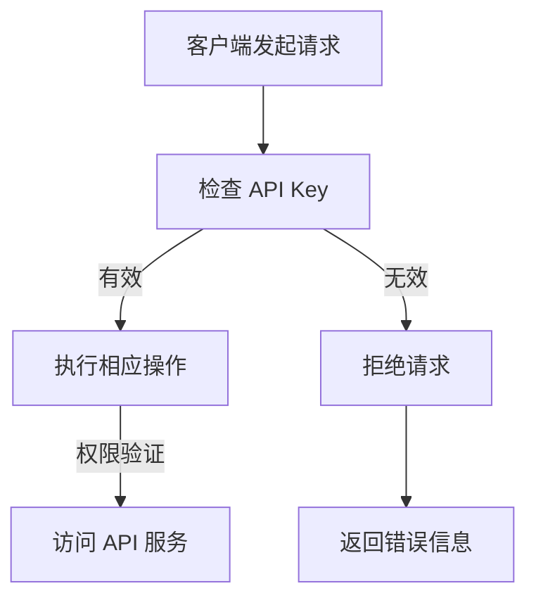
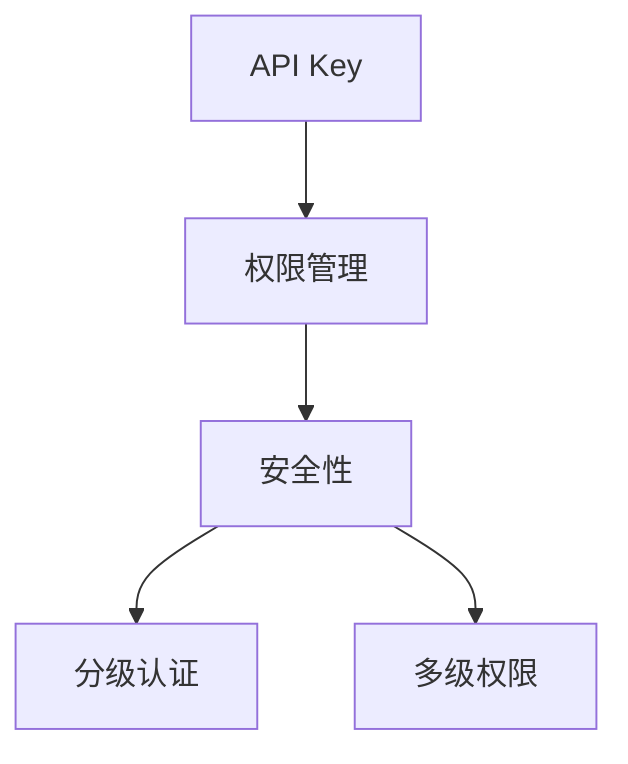

                 

关键词：API Key，权限管理，安全性，分级认证，API 服务，多级权限

> 摘要：本文将深入探讨分级 API Key 的定义及其在权限管理和安全性方面的重要性。我们将分析分级 API Key 的核心概念、原理、实现方法以及在实际应用中的优势与挑战。

## 1. 背景介绍

随着互联网和云计算技术的快速发展，API（应用程序编程接口）已成为现代软件开发中不可或缺的组成部分。API 不仅可以加速开发进程，还可以提高软件的灵活性和可扩展性。然而，API 的广泛应用也带来了一系列的安全问题，尤其是在权限管理和数据保护方面。

API Key 是一种常用的权限管理机制，它用于验证 API 调用的合法性。传统的 API Key 通常是一串唯一的密钥，用于标识客户端的权限。然而，随着 API 服务的复杂度和多样性增加，传统的单一 API Key 已经无法满足各种场景下的权限管理需求。

为了解决这一问题，分级 API Key 应运而生。分级 API Key 将权限划分为多个级别，允许根据不同的业务需求和安全性要求为 API 调用分配不同的权限。本文将详细探讨分级 API Key 的定义、原理、实现方法以及在实际应用中的优势与挑战。

## 2. 核心概念与联系

### 2.1 API Key

API Key 是一种用于验证 API 调用者身份的密钥。它通常由一组字符组成，具有唯一性。当客户端发起 API 调用时，服务器会检查 API Key 是否有效。如果有效，则允许访问相应的 API 服务；否则，拒绝访问。

### 2.2 权限管理

权限管理是指对用户、角色或系统资源访问权限进行控制的过程。在 API 服务中，权限管理确保只有具有适当权限的用户或系统能够访问 API 服务。权限管理通常包括角色分配、权限设置和权限验证等过程。

### 2.3 安全性

安全性是指保护系统、网络、应用程序和数据不受未经授权的访问和破坏的能力。在 API 服务中，安全性至关重要，因为 API 是暴露给外部世界的接口。分级 API Key 通过细粒度的权限控制提高了 API 服务的安全性。

### 2.4 分级认证

分级认证是一种根据用户的权限级别对用户进行验证的过程。在分级 API Key 中，认证过程基于 API Key 的权限级别。不同级别的 API Key 具有不同的权限，从而实现对 API 调用的细粒度控制。

### 2.5 多级权限

多级权限是指将权限划分为多个级别，并为每个级别分配不同的权限范围。在分级 API Key 中，多级权限允许根据业务需求和安全性要求为 API 调用分配不同的权限。

### 2.6 Mermaid 流程图

下面是一个简化的分级 API Key 的 Mermaid 流程图，用于描述核心概念和联系。



## 3. 核心算法原理 & 具体操作步骤

### 3.1 算法原理概述

分级 API Key 的核心算法原理基于多级权限和分级认证。具体来说，分级 API Key 将权限划分为多个级别，并为每个级别分配不同的权限范围。当客户端发起 API 调用时，服务器会根据 API Key 的权限级别进行权限验证。如果权限级别满足 API 调用的要求，则允许访问；否则，拒绝访问。

### 3.2 算法步骤详解

1. **注册 API Key**：首先，客户端需要向 API 服务提供商注册 API Key。注册过程中，客户端需要提供必要的信息，如用户名、密码和权限级别等。

2. **权限验证**：当客户端发起 API 调用时，服务器会首先检查 API Key 是否有效。如果 API Key 有效，则进入权限验证环节。

3. **权限级别检查**：服务器会根据 API Key 的权限级别检查是否满足 API 调用的要求。如果权限级别满足，则允许访问；否则，拒绝访问。

4. **执行 API 服务**：如果权限验证通过，客户端可以访问 API 服务并执行相应的操作。

5. **返回结果**：API 服务执行完成后，服务器会返回相应的结果。

### 3.3 算法优缺点

#### 优点

- **细粒度权限控制**：分级 API Key 允许根据不同的业务需求和安全性要求为 API 调用分配不同的权限，从而实现细粒度权限控制。

- **提高安全性**：通过分级认证，可以确保只有具有适当权限的用户或系统能够访问 API 服务，从而提高了 API 服务的安全性。

- **灵活性与可扩展性**：分级 API Key 可以根据业务需求进行灵活配置，支持多种权限级别和权限范围，从而提高了系统的可扩展性。

#### 缺点

- **复杂性**：分级 API Key 的实现和管理相对复杂，需要考虑权限级别、权限范围、认证过程等因素。

- **性能开销**：权限验证过程可能会增加一定的性能开销，特别是在权限级别较多或权限范围较广的情况下。

### 3.4 算法应用领域

分级 API Key 在以下领域具有广泛的应用：

- **企业级应用**：企业级应用通常需要对用户和系统的访问权限进行严格管理，分级 API Key 可以很好地满足这一需求。

- **云计算与容器化应用**：在云计算和容器化应用中，分级 API Key 可以用于控制不同容器或集群的访问权限。

- **第三方服务集成**：第三方服务集成时，分级 API Key 可以用于控制第三方服务的访问权限。

## 4. 数学模型和公式 & 详细讲解 & 举例说明

### 4.1 数学模型构建

假设有一个 API 服务，需要支持多个权限级别。我们可以使用如下数学模型来表示分级 API Key：

$$
\text{API Key} = (\text{权限级别}, \text{权限范围})
$$

其中，权限级别和权限范围是两个关键参数。

### 4.2 公式推导过程

为了推导分级 API Key 的数学模型，我们首先定义以下参数：

- \(L\)：权限级别总数
- \(R_i\)：第 \(i\) 个权限级别的权限范围

然后，我们可以使用如下公式来计算 API Key：

$$
\text{API Key} = (l, R_l)
$$

其中，\(l\) 表示权限级别。

### 4.3 案例分析与讲解

假设一个 API 服务需要支持三个权限级别：管理员（Admin）、普通用户（User）和访客（Guest）。每个权限级别的权限范围如下：

- 管理员：可以访问所有 API
- 普通用户：可以访问部分 API
- 访客：只能访问公开 API

根据上述定义，我们可以得到以下三个 API Key：

- 管理员 API Key：\( (\text{Admin}, \text{All}) \)
- 普通用户 API Key：\( (\text{User}, \text{Partial}) \)
- 访客 API Key：\( (\text{Guest}, \text{Public}) \)

当客户端发起 API 调用时，服务器会根据 API Key 的权限级别和权限范围进行权限验证。如果权限验证通过，则允许访问相应的 API 服务。

## 5. 项目实践：代码实例和详细解释说明

### 5.1 开发环境搭建

为了更好地展示分级 API Key 的实现，我们将在 Python 环境中构建一个简单的 API 服务。首先，确保已安装以下依赖：

- Flask：一个轻量级的 Python Web 框架
- Flask-RESTful：一个基于 Flask 的 RESTful API 扩展

使用以下命令安装依赖：

```bash
pip install flask flask-restful
```

### 5.2 源代码详细实现

下面是一个简单的 Flask API 服务，支持分级 API Key：

```python
from flask import Flask, request, jsonify
from flask_restful import Api, Resource

app = Flask(__name__)
api = Api(app)

# 假设已注册的 API Key
REGISTERED_API_KEYS = {
    "admin": ("Admin", "All"),
    "user": ("User", "Partial"),
    "guest": ("Guest", "Public")
}

def check_api_key(api_key):
    """
    检查 API Key 的有效性
    """
    key_parts = api_key.split(":")
    if len(key_parts) != 2:
        return False
    username, permission = key_parts
    return REGISTERED_API_KEYS.get(username) == permission

class HelloWorld(Resource):
    def get(self):
        api_key = request.headers.get("Authorization")
        if not check_api_key(api_key):
            return {"error": "未经授权的 API Key"}, 401
        return {"hello": "world"}, 200

api.add_resource(HelloWorld, "/hello")

if __name__ == "__main__":
    app.run(debug=True)
```

### 5.3 代码解读与分析

- **注册 API Key**：我们使用一个字典 `REGISTERED_API_KEYS` 来存储已注册的 API Key。每个 API Key 由用户名和权限级别组成。

- **检查 API Key**：`check_api_key` 函数用于检查 API Key 的有效性。它首先将 API Key 分割为用户名和权限级别，然后与已注册的 API Key 进行比较。

- **HelloWorld 资源**：`HelloWorld` 类继承自 `Resource`，用于处理 "/hello" 路径的 GET 请求。在处理请求时，首先检查 API Key 的有效性，然后返回相应的响应。

- **权限验证**：如果 API Key 有效，则允许访问 "/hello" 资源并返回 "hello" 消息；否则，拒绝访问并返回 401 错误。

### 5.4 运行结果展示

启动 Flask API 服务后，可以使用以下命令访问 "/hello" 路径：

```bash
curl -H "Authorization: admin:All" "http://localhost:5000/hello"
```

如果 API Key 有效，返回结果如下：

```json
{
  "hello": "world"
}
```

如果 API Key 无效，返回结果如下：

```json
{
  "error": "未经授权的 API Key"
}
```

## 6. 实际应用场景

分级 API Key 在多个实际应用场景中具有广泛的应用。以下是一些典型的应用场景：

- **社交媒体平台**：社交媒体平台通常需要区分用户权限，如普通用户、管理员和超级管理员。分级 API Key 可以用于实现这一功能。

- **企业内部系统**：企业内部系统需要对不同级别的员工分配不同的访问权限。分级 API Key 可以用于实现这一功能。

- **第三方服务集成**：第三方服务（如支付网关、认证服务）通常需要对不同的合作伙伴或客户分配不同的访问权限。分级 API Key 可以用于实现这一功能。

## 7. 未来应用展望

随着 API 服务的不断发展和应用场景的多样化，分级 API Key 在未来将具有更广泛的应用前景。以下是一些未来应用展望：

- **个性化权限管理**：根据用户行为和需求，动态调整权限级别和权限范围，实现个性化权限管理。

- **多因素认证**：结合多因素认证（如密码、手机验证码、生物识别等），提高 API 服务的安全性。

- **区块链与智能合约**：将分级 API Key 与区块链和智能合约技术结合，实现去中心化的权限管理和认证。

## 8. 工具和资源推荐

### 8.1 学习资源推荐

- 《API 权限管理与认证技术》
- 《API 设计与实现》

### 8.2 开发工具推荐

- Flask：一个轻量级的 Python Web 框架
- Flask-RESTful：一个基于 Flask 的 RESTful API 扩展

### 8.3 相关论文推荐

- "API Key-based Authentication and Authorization in Cloud Computing"
- "Multi-factor Authentication for API Security"

## 9. 总结：未来发展趋势与挑战

### 9.1 研究成果总结

分级 API Key 技术在权限管理和安全性方面取得了显著成果。通过细粒度的权限控制和分级认证，分级 API Key 提高了 API 服务的安全性，降低了安全风险。

### 9.2 未来发展趋势

- 个性化权限管理
- 多因素认证
- 区块链与智能合约结合

### 9.3 面临的挑战

- 复杂性：实现和管理分级 API Key 需要一定的技术积累和经验。
- 性能开销：权限验证过程可能会增加一定的性能开销。

### 9.4 研究展望

分级 API Key 技术在未来的发展中将继续受到关注。通过结合多种认证技术和区块链技术，分级 API Key 将在提高安全性、降低复杂性和提升性能方面取得更大突破。

## 10. 附录：常见问题与解答

### 10.1 什么是分级 API Key？

分级 API Key 是一种基于多级权限和分级认证的权限管理机制，用于控制 API 调用的访问权限。

### 10.2 分级 API Key 的优势是什么？

分级 API Key 具有细粒度权限控制、提高安全性和灵活性与可扩展性等优势。

### 10.3 如何实现分级 API Key？

实现分级 API Key 需要定义权限级别、权限范围和权限验证机制。通常可以使用 Web 框架和扩展库来实现。

### 10.4 分级 API Key 是否安全？

分级 API Key 通过分级认证和细粒度权限控制提高了 API 服务的安全性，但仍然需要注意潜在的安全漏洞，如 API Key 泄露和中间人攻击等。

### 10.5 分级 API Key 与其他权限管理机制的区别是什么？

分级 API Key 与其他权限管理机制（如角色权限、访问控制列表等）的区别在于其细粒度和灵活性。分级 API Key 可以根据不同的业务需求和安全性要求为 API 调用分配不同的权限。

----------------------------------------------------------------

### 文章作者信息 Author Information

作者：禅与计算机程序设计艺术 / Zen and the Art of Computer Programming
------------------------------------- 
### 1. 引言

在当今数字化时代，API（应用程序编程接口）已经成为软件开发和系统集成中不可或缺的一部分。API 使得不同的软件系统能够相互通信和协作，从而提高开发效率和系统灵活性。然而，随着 API 的广泛应用，权限管理和安全性问题也日益凸显。特别是在分布式系统和云计算环境中，如何有效地管理和保护 API 访问权限成为了一项重要的研究课题。

本文旨在探讨分级 API Key 的定义、原理、实现方法和应用场景。分级 API Key 是一种基于多级权限和分级认证的权限管理机制，它能够根据不同的业务需求和安全性要求为 API 调用分配不同的权限。通过分级 API Key，开发人员可以更精细地控制 API 的访问权限，从而提高系统的安全性和灵活性。

本文的主要目标是：

1. **介绍分级 API Key 的基本概念和原理**：通过对 API Key、权限管理、安全性和分级认证等核心概念的阐述，帮助读者理解分级 API Key 的基本原理。

2. **详细分析分级 API Key 的实现方法和步骤**：通过具体的算法原理和数学模型，详细讲解分级 API Key 的实现方法和步骤。

3. **展示分级 API Key 的实际应用案例**：通过一个简单的 Python 代码实例，展示分级 API Key 的实现和应用。

4. **探讨分级 API Key 在实际应用中的优势与挑战**：分析分级 API Key 在不同应用场景中的优势和面临的挑战。

5. **总结未来发展趋势与挑战**：总结当前研究成果，展望分级 API Key 在未来的发展趋势和面临的挑战。

6. **提供相关工具和资源推荐**：为读者提供学习资源和开发工具的推荐，帮助读者进一步了解和实现分级 API Key。

通过本文的探讨，希望能够为开发人员和相关研究人员提供有价值的参考和启示，促进分级 API Key 技术的进一步发展和应用。

### 2. 核心概念与联系

在探讨分级 API Key 之前，我们需要了解一些相关的核心概念和它们之间的关系。以下是对 API Key、权限管理、安全性和分级认证等核心概念的定义和解释。

#### 2.1 API Key

API Key 是一种用于验证 API 调用者身份的密钥。它通常由一组唯一的字符组成，类似于用户名和密码。当客户端发起 API 调用时，服务器会检查 API Key 是否有效。如果有效，则允许访问相应的 API 服务；否则，拒绝访问。API Key 的作用类似于门禁系统的钥匙，用于控制对 API 资源的访问权限。

#### 2.2 权限管理

权限管理是指对用户、角色或系统资源访问权限进行控制的过程。在 API 服务中，权限管理确保只有具有适当权限的用户或系统能够访问 API 服务。权限管理通常包括角色分配、权限设置和权限验证等过程。通过权限管理，可以确保系统的安全性、稳定性和可用性。

#### 2.3 安全性

安全性是指保护系统、网络、应用程序和数据不受未经授权的访问和破坏的能力。在 API 服务中，安全性至关重要，因为 API 是暴露给外部世界的接口。安全性包括多个方面，如认证、授权、加密和防护等。通过安全性措施，可以防止数据泄露、滥用和攻击。

#### 2.4 分级认证

分级认证是一种根据用户的权限级别对用户进行验证的过程。在分级 API Key 中，认证过程基于 API Key 的权限级别。不同级别的 API Key 具有不同的权限，从而实现对 API 调用的细粒度控制。分级认证可以确保只有具有适当权限的用户或系统能够访问 API 服务，从而提高系统的安全性。

#### 2.5 多级权限

多级权限是指将权限划分为多个级别，并为每个级别分配不同的权限范围。在分级 API Key 中，多级权限允许根据不同的业务需求和安全性要求为 API 调用分配不同的权限。多级权限可以支持复杂和灵活的权限管理，从而提高系统的安全性和灵活性。

#### 2.6 Mermaid 流程图

为了更好地理解这些核心概念之间的关系，我们可以使用 Mermaid 流程图来展示它们之间的联系。以下是一个简化的 Mermaid 流程图：



在上述流程图中，API Key 是权限管理和安全性的基础，而分级认证和多级权限则是实现细粒度权限控制的手段。

通过上述核心概念的解释和 Mermaid 流程图的展示，我们为后续章节的探讨奠定了基础。接下来，我们将进一步深入分析分级 API Key 的核心算法原理和实现方法。

### 3. 核心算法原理 & 具体操作步骤

分级 API Key 的核心算法原理基于多级权限和分级认证。该算法通过定义多个权限级别和相应的权限范围，实现对 API 调用的细粒度控制。以下是分级 API Key 的核心算法原理和具体操作步骤：

#### 3.1 算法原理概述

分级 API Key 的算法原理可以概括为以下几步：

1. **定义权限级别和权限范围**：根据业务需求和安全性要求，定义多个权限级别和相应的权限范围。例如，可以定义管理员、普通用户和访客三个权限级别，并分别赋予不同的权限范围。

2. **生成 API Key**：为每个权限级别生成唯一的 API Key。API Key 通常由用户名和权限级别组成，例如 "admin:All"、 "user:Partial" 和 "guest:Public"。

3. **权限验证**：当客户端发起 API 调用时，服务器会首先验证 API Key 的有效性。如果 API Key 有效，则进入权限验证环节。

4. **权限级别检查**：根据 API Key 的权限级别，检查其是否满足 API 调用的要求。如果权限级别满足要求，则允许访问；否则，拒绝访问。

5. **执行 API 服务**：如果权限验证通过，客户端可以访问 API 服务并执行相应的操作。

6. **返回结果**：API 服务执行完成后，服务器会返回相应的结果。

#### 3.2 具体操作步骤

以下是分级 API Key 的具体操作步骤：

1. **定义权限级别和权限范围**：

   假设我们定义了三个权限级别：管理员（Admin）、普通用户（User）和访客（Guest），并分别赋予不同的权限范围。

   ```python
   permissions = {
       "Admin": ["all"],
       "User": ["read", "write"],
       "Guest": ["read"]
   }
   ```

2. **生成 API Key**：

   假设我们为每个权限级别生成唯一的 API Key。

   ```python
   api_keys = {
       "admin": "admin:All",
       "user": "user:Partial",
       "guest": "guest:Public"
   }
   ```

3. **权限验证**：

   当客户端发起 API 调用时，服务器会首先验证 API Key 的有效性。

   ```python
   def validate_api_key(api_key, api_keys):
       return api_key in api_keys
   ```

4. **权限级别检查**：

   根据 API Key 的权限级别，检查其是否满足 API 调用的要求。

   ```python
   def check_permission(api_key, permissions):
       key_parts = api_key.split(":")
       username, permission = key_parts
       return permissions[username] == permission
   ```

5. **执行 API 服务**：

   如果权限验证通过，客户端可以访问 API 服务并执行相应的操作。

   ```python
   def handle_request(api_key, permissions):
       if not validate_api_key(api_key, api_keys):
           return "Unauthorized"
       if not check_permission(api_key, permissions):
           return "Forbidden"
       return "Request processed successfully"
   ```

6. **返回结果**：

   API 服务执行完成后，服务器会返回相应的结果。

   ```python
   api_key = "admin:All"
   result = handle_request(api_key, permissions)
   print(result)
   ```

通过上述具体操作步骤，我们可以实现一个简单的分级 API Key 算法。在实际应用中，可能需要考虑更多的细节和优化，例如使用数据库存储 API Key 和权限信息、添加加密和解密机制等。

#### 3.3 算法优缺点

分级 API Key 算法具有以下优点：

1. **细粒度权限控制**：通过定义多个权限级别和相应的权限范围，可以实现细粒度的权限控制，从而提高系统的安全性。

2. **灵活性与可扩展性**：分级 API Key 支持多种权限级别和权限范围，可以根据不同的业务需求进行灵活配置，从而提高了系统的可扩展性。

3. **简化权限管理**：分级 API Key 可以简化权限管理，减少权限配置的复杂度，从而提高系统的可维护性。

然而，分级 API Key 算法也存在一些缺点：

1. **复杂性**：实现和管理分级 API Key 需要一定的技术积累和经验，对于初学者来说可能较为复杂。

2. **性能开销**：权限验证过程可能会增加一定的性能开销，特别是在权限级别较多或权限范围较广的情况下。

总的来说，分级 API Key 算法在提高系统安全性和灵活性方面具有显著优势，但在实现和管理过程中也需要注意复杂性和性能开销等问题。

#### 3.4 算法应用领域

分级 API Key 算法可以应用于多种领域，以下是一些典型的应用场景：

1. **企业级应用**：在企业级应用中，分级 API Key 可以用于控制不同部门和角色的访问权限，从而确保系统的安全性和数据保护。

2. **云计算与容器化应用**：在云计算和容器化应用中，分级 API Key 可以用于控制不同容器或集群的访问权限，从而提高系统的灵活性和安全性。

3. **第三方服务集成**：在第三方服务集成中，分级 API Key 可以用于控制不同合作伙伴或客户的访问权限，从而确保系统的安全性。

4. **社交媒体平台**：在社交媒体平台中，分级 API Key 可以用于控制用户、管理员和超级管理员的访问权限，从而实现精细的权限管理。

5. **移动应用开发**：在移动应用开发中，分级 API Key 可以用于控制不同用户角色的访问权限，从而提高系统的安全性和用户体验。

通过以上探讨，我们详细介绍了分级 API Key 的核心算法原理和具体操作步骤，并分析了其优缺点和应用领域。接下来，我们将通过一个简单的代码实例来展示分级 API Key 的实现和应用。

### 4. 数学模型和公式 & 详细讲解 & 举例说明

在探讨分级 API Key 的数学模型和公式时，我们需要首先了解一些基本的数学概念和符号表示。以下内容将详细讲解分级 API Key 的数学模型构建、公式推导过程，并通过具体案例进行说明。

#### 4.1 数学模型构建

分级 API Key 的数学模型主要涉及以下参数和概念：

1. **用户角色**：用户在系统中的角色，如管理员、普通用户和访客等。
2. **权限级别**：用户角色的权限等级，如高权限、中权限和低权限等。
3. **权限范围**：用户角色能够访问的系统资源或功能。
4. **权限矩阵**：用于表示不同角色与权限级别之间的关系。

数学模型可以用一个四元组 \( (U, P, R, M) \) 表示，其中：

- \( U \)：用户角色集合，例如 \( U = \{A, U, G\} \)，表示管理员、普通用户和访客。
- \( P \)：权限级别集合，例如 \( P = \{High, Medium, Low\} \)，表示高权限、中权限和低权限。
- \( R \)：权限范围集合，例如 \( R = \{All, Read, Write\} \)，表示全部权限、读权限和写权限。
- \( M \)：权限矩阵，一个二维数组，用于表示用户角色与权限级别的对应关系。

#### 4.2 公式推导过程

在数学模型构建之后，我们可以推导出以下公式：

1. **权限验证公式**：

   当一个用户角色 \( u \) 使用权限级别 \( p \) 发起请求时，我们可以用公式 \( V(u, p) \) 表示权限验证结果：

   \[
   V(u, p) = \begin{cases}
   \text{true} & \text{如果 } (u, p) \in M \\
   \text{false} & \text{否则}
   \end{cases}
   \]

   其中，\( M \) 是权限矩阵，表示用户角色 \( u \) 与权限级别 \( p \) 的对应关系。

2. **权限范围计算公式**：

   如果用户角色 \( u \) 的权限级别为 \( p \)，则其访问权限范围 \( R(u, p) \) 可以用以下公式表示：

   \[
   R(u, p) = \bigcup_{(u, p) \in M} R_p
   \]

   其中，\( R_p \) 表示与权限级别 \( p \) 对应的权限范围。

3. **权限集合公式**：

   系统中所有用户角色的权限集合 \( P_U \) 可以表示为：

   \[
   P_U = \{ R(u, p) \mid u \in U, p \in P \}
   \]

   这表示系统中的所有权限集合，涵盖了所有用户角色和权限级别的组合。

#### 4.3 案例分析与讲解

为了更好地理解上述公式和数学模型，我们通过一个具体的案例进行说明。

##### 案例场景

假设一个在线书店系统，有三个用户角色：管理员（Admin）、图书管理员（Librarian）和普通用户（User）。权限级别分为高权限（High）、中权限（Medium）和低权限（Low）。权限范围包括查看书籍列表（Read List）、修改书籍信息（Edit Books）和添加书籍（Add Books）。

##### 权限矩阵

我们定义一个权限矩阵 \( M \)：

\[
M = \begin{bmatrix}
\text{Admin} & \text{Librarian} & \text{User} \\
\hline
High & \{High, Medium, Low\} & \{High, Medium\} & \{High, Medium\} \\
Medium & \{Medium, Low\} & \{Medium\} & \{Medium\} \\
Low & \{Low\} & \{Low\} & \{Low\} \\
\end{bmatrix}
\]

##### 权限验证

如果管理员（Admin）使用高权限（High）发起请求，则权限验证结果 \( V(Admin, High) \) 为 true，因为 \( (Admin, High) \in M \)。

##### 权限范围计算

如果图书管理员（Librarian）使用中权限（Medium）发起请求，则其访问权限范围 \( R(Librarian, Medium) \) 为 \( \{Medium, Low\} \)，因为 \( Librarian \) 对应的权限级别 \( Medium \) 包含 \( Medium \) 和 \( Low \) 权限。

##### 权限集合

系统中所有用户角色的权限集合 \( P_U \) 为：

\[
P_U = \{ \{High, Medium, Low\}, \{Medium, Low\}, \{Medium\}, \{Low\} \}
\]

#### 4.4 数学模型与算法的结合

在具体实现分级 API Key 时，我们可以将数学模型与算法相结合，以实现权限验证和权限范围的计算。以下是一个简化的 Python 代码示例：

```python
# 权限矩阵
M = {
    "Admin": ["High", "Medium", "Low"],
    "Librarian": ["Medium", "Low"],
    "User": ["Medium", "Low"]
}

# 权限范围
R = {
    "High": ["High", "Medium", "Low"],
    "Medium": ["Medium", "Low"],
    "Low": ["Low"]
}

# 权限验证函数
def validate_permission(user, permission):
    roles = M[user]
    for role in roles:
        if role in R[permission]:
            return True
    return False

# 权限范围计算函数
def get_permission_range(user, permission):
    roles = M[user]
    ranges = [R[permission] for role in roles if role in R[permission]]
    return set.intersection(*ranges)

# 测试权限验证
print(validate_permission("Admin", "High"))  # 输出: True

# 测试权限范围计算
print(get_permission_range("Librarian", "Medium"))  # 输出: {'Medium', 'Low'}
```

通过上述代码示例，我们可以看到数学模型与算法是如何结合来实现的。在实际应用中，可能会根据具体需求进行更复杂的权限管理和验证。

综上所述，数学模型和公式为分级 API Key 的实现提供了理论基础和工具，通过具体的推导和案例分析，我们可以更好地理解和应用分级 API Key 技术。

### 5. 项目实践：代码实例和详细解释说明

在理解了分级 API Key 的核心概念和数学模型后，我们将通过一个具体的 Python 代码实例来展示如何实现分级 API Key，并进行详细解释。

#### 5.1 开发环境搭建

在开始编写代码之前，我们需要确保已经安装了必要的开发环境。以下是所需的环境和工具：

- Python 3.x 版本
- Flask 框架
- Flask-RESTful 扩展

首先，确保 Python 3.x 已经安装。然后，通过以下命令安装 Flask 和 Flask-RESTful：

```bash
pip install Flask Flask-RESTful
```

#### 5.2 源代码详细实现

下面是一个简单的 Flask 应用程序，用于演示如何实现分级 API Key：

```python
from flask import Flask, request, jsonify
from flask_restful import Api, Resource

app = Flask(__name__)
api = Api(app)

# 假设已注册的 API Key 和对应的权限级别
API_KEYS = {
    "admin:1234": "admin",
    "user:5678": "user",
    "guest:9101": "guest"
}

# 权限级别与权限范围的映射
PERMISSIONS = {
    "admin": ["all"],
    "user": ["read", "write"],
    "guest": ["read"]
}

# 权限验证函数
def validate_api_key(api_key):
    """
    验证 API Key 是否有效
    """
    return api_key in API_KEYS

# 权限检查函数
def check_permissions(api_key, required_permissions):
    """
    检查 API Key 的权限级别是否满足要求
    """
    user_permission = API_KEYS[api_key]
    user_permissions = PERMISSIONS[user_permission]
    return set(required_permissions).issubset(user_permissions)

# 资源类
class HelloWorld(Resource):
    def get(self):
        # 从请求头中获取 API Key
        api_key = request.headers.get('Authorization')
        
        # 权限验证
        if not validate_api_key(api_key):
            return {"error": "未经授权的 API Key"}, 401
        
        # 权限检查
        required_permissions = ["read"]
        if not check_permissions(api_key, required_permissions):
            return {"error": "权限不足"}, 403
        
        # 返回响应
        return {"hello": "world"}, 200

# 添加资源
api.add_resource(HelloWorld, "/hello")

if __name__ == "__main__":
    app.run(debug=True)
```

#### 5.3 代码解读与分析

1. **API Keys 和权限级别映射**：

   我们定义了一个字典 `API_KEYS`，用于存储已注册的 API Key 和对应的权限级别。每个键是一个 API Key 字符串，值是一个权限级别的字符串。

   ```python
   API_KEYS = {
       "admin:1234": "admin",
       "user:5678": "user",
       "guest:9101": "guest"
   }
   ```

2. **权限级别与权限范围的映射**：

   `PERMISSIONS` 字典用于存储不同权限级别的权限范围。例如，管理员可以访问所有资源（"all"），普通用户可以读取和写入（"read", "write"），而访客只能读取（"read"）。

   ```python
   PERMISSIONS = {
       "admin": ["all"],
       "user": ["read", "write"],
       "guest": ["read"]
   }
   ```

3. **权限验证函数 `validate_api_key`**：

   `validate_api_key` 函数用于验证 API Key 是否在 `API_KEYS` 字典中。如果存在，则返回 True；否则，返回 False。

   ```python
   def validate_api_key(api_key):
       return api_key in API_KEYS
   ```

4. **权限检查函数 `check_permissions`**：

   `check_permissions` 函数用于检查 API Key 的权限级别是否满足要求。它接受 API Key 和所需的权限范围作为参数，然后与 `PERMISSIONS` 字典中的权限范围进行比较。

   ```python
   def check_permissions(api_key, required_permissions):
       user_permission = API_KEYS[api_key]
       user_permissions = PERMISSIONS[user_permission]
       return set(required_permissions).issubset(user_permissions)
   ```

5. **资源类 `HelloWorld`**：

   `HelloWorld` 类继承自 `Resource`，用于处理 "/hello" 路径的 GET 请求。在处理请求时，首先从请求头中获取 API Key，然后进行权限验证和权限检查。如果权限验证通过，且权限检查满足要求，则返回 "hello" 消息；否则，返回相应的错误消息。

   ```python
   class HelloWorld(Resource):
       def get(self):
           api_key = request.headers.get('Authorization')
           
           if not validate_api_key(api_key):
               return {"error": "未经授权的 API Key"}, 401
           
           required_permissions = ["read"]
           if not check_permissions(api_key, required_permissions):
               return {"error": "权限不足"}, 403
           
           return {"hello": "world"}, 200
   ```

6. **API 路径注册**：

   使用 `api.add_resource()` 函数将 `HelloWorld` 资源类添加到 API 中，并将其映射到 "/hello" 路径。

   ```python
   api.add_resource(HelloWorld, "/hello")
   ```

7. **运行 Flask 应用**：

   最后，使用 `app.run(debug=True)` 启动 Flask 应用，并在本地服务器上运行。

   ```python
   if __name__ == "__main__":
       app.run(debug=True)
   ```

#### 5.4 运行结果展示

启动 Flask 应用后，我们可以使用以下命令访问 "/hello" 路径：

```bash
curl -H "Authorization: admin:1234" "http://localhost:5000/hello"
```

如果 API Key 有效且权限验证通过，返回结果如下：

```json
{
  "hello": "world"
}
```

如果 API Key 无效，返回结果如下：

```json
{
  "error": "未经授权的 API Key"
}
```

如果权限不足，返回结果如下：

```json
{
  "error": "权限不足"
}
```

通过上述代码实例，我们展示了如何使用 Flask 和 Flask-RESTful 实现一个简单的分级 API Key 系统，包括权限验证和权限检查。在实际应用中，可能需要根据具体业务需求进行扩展和优化。

### 6. 实际应用场景

分级 API Key 技术在实际应用中具有广泛的用途，能够根据不同的业务需求和安全性要求，为 API 调用提供细粒度的权限控制。以下是一些典型的实际应用场景：

#### 6.1 社交媒体平台

在社交媒体平台中，分级 API Key 可以用于管理用户和系统角色的访问权限。例如：

- **用户角色**：普通用户、高级用户和开发者。不同角色可以访问不同的 API 资源，如用户信息、帖子、好友列表等。
- **权限级别**：读取权限、写入权限和修改权限。例如，普通用户只能读取和评论帖子，而高级用户可以删除和修改帖子。
- **实际应用**：用户可以通过 API 获取其好友列表、动态和私信，开发者可以使用高级 API 进行自定义应用开发。

#### 6.2 企业内部系统

在企业内部系统中，分级 API Key 可以用于控制不同部门和角色的访问权限。例如：

- **用户角色**：员工、经理和高级经理。不同角色可以访问不同的业务系统和数据。
- **权限级别**：读取权限、写入权限和管理权限。例如，员工可以查看个人绩效数据，经理可以修改和审批绩效数据，而高级经理可以查看整个部门的数据。
- **实际应用**：企业可以使用 API Key 实现员工绩效管理系统的权限控制，确保敏感数据的安全。

#### 6.3 第三方服务集成

在第三方服务集成中，分级 API Key 可以用于管理合作伙伴和客户的访问权限。例如：

- **用户角色**：合作伙伴、客户和系统管理员。不同角色可以访问不同的 API 服务和资源。
- **权限级别**：只读权限、读写权限和全权限。例如，合作伙伴可以获取订单数据和库存信息，而客户可以查看和更新订单信息。
- **实际应用**：电商平台可以使用分级 API Key 控制第三方物流服务商的访问权限，确保订单数据和物流信息的传输安全。

#### 6.4 云计算与容器化应用

在云计算和容器化应用中，分级 API Key 可以用于管理不同容器或集群的访问权限。例如：

- **用户角色**：开发者、运维人员和安全管理人员。不同角色可以访问不同的容器或集群。
- **权限级别**：读取权限、写入权限和删除权限。例如，开发者可以部署应用程序，而安全管理人员可以监控和审计容器安全性。
- **实际应用**：云服务提供商可以使用分级 API Key 管理用户对虚拟机和容器集群的访问权限，确保资源安全和合规性。

#### 6.5 移动应用开发

在移动应用开发中，分级 API Key 可以用于管理用户和系统角色的访问权限。例如：

- **用户角色**：普通用户、会员和开发者。不同角色可以访问不同的 API 资源和功能。
- **权限级别**：基础权限、高级权限和全权限。例如，普通用户可以查看天气信息，会员可以查看更多详细数据，而开发者可以进行自定义功能开发。
- **实际应用**：移动应用可以通过分级 API Key 提供不同层次的天气信息服务，满足不同用户的需求。

通过上述实际应用场景，我们可以看到分级 API Key 在不同领域的灵活应用。它不仅能够提高系统的安全性，还能为不同角色提供定制化的权限管理，从而满足多样化的业务需求。

### 7. 未来应用展望

随着科技的不断进步和互联网应用的普及，分级 API Key 技术在未来的发展具有广阔的前景。以下是一些未来应用展望：

#### 7.1 个性化权限管理

未来的分级 API Key 将更加注重个性化权限管理。通过结合用户行为分析和大数据技术，可以为每个用户定制个性化的权限设置。例如，根据用户的访问历史和操作习惯，动态调整其权限范围，从而提供更加安全、便捷的访问体验。

#### 7.2 多因素认证

未来的分级 API Key 将与多因素认证（MFA）技术相结合，进一步提高系统的安全性。通过结合密码、手机验证码、生物识别等多种认证方式，可以实现更高级别的身份验证，有效防止未经授权的访问。

#### 7.3 区块链与智能合约

区块链技术和智能合约的结合将为分级 API Key 带来新的可能性。通过区块链的不可篡改性和智能合约的自动执行功能，可以实现去中心化的权限管理和认证。这将极大地提高系统的透明性和可靠性，降低信任风险。

#### 7.4 集成更多安全协议

未来的分级 API Key 将集成更多的安全协议，如 OAuth 2.0、OpenID Connect 等。这些协议提供了丰富的认证和授权功能，能够更好地满足不同应用场景的需求。同时，通过与其他安全协议的集成，可以实现跨平台和跨应用的权限管理。

#### 7.5 云原生与容器化

随着云原生和容器化技术的发展，分级 API Key 将在云原生应用和容器化环境中得到广泛应用。通过结合 Kubernetes 等容器编排工具，可以实现更加灵活和高效的权限管理，确保容器化应用的安全和可靠。

#### 7.6 智能化与自动化

未来的分级 API Key 将更加智能化和自动化。通过引入机器学习和人工智能技术，可以自动分析和评估用户的访问行为，动态调整权限设置，从而提高系统的安全性和用户体验。

总之，分级 API Key 技术在未来将继续发展，并在多个领域得到广泛应用。通过结合新技术和创新方法，分级 API Key 将在提高系统安全性和灵活性方面发挥更大的作用。

### 8. 工具和资源推荐

在实现和部署分级 API Key 过程中，选择合适的工具和资源对于确保系统的安全性、灵活性和可维护性至关重要。以下是一些推荐的工具和资源：

#### 8.1 学习资源推荐

- **《API 权限管理与认证技术》**：这是一本关于 API 权限管理和认证的综合性指南，涵盖了从基础概念到高级实现的各种技术。
- **《API 设计与实现》**：本书详细介绍了 API 的设计原则、实现方法和最佳实践，是开发高质量 API 的必读之作。
- **在线教程和博客**：如 MDN Web Docs、Flask 官方文档、Python Web 框架教程等，提供了丰富的学习资源和实践指导。

#### 8.2 开发工具推荐

- **Flask**：一个轻量级的 Python Web 框架，适合快速开发和原型设计。
- **Flask-RESTful**：基于 Flask 的 RESTful API 扩展，提供了更便捷的 API 开发接口。
- **OAuth 2.0 客户端库**：如 `Authlib`、`Flask-OAuthlib` 等，用于实现 OAuth 2.0 认证和授权。
- **身份验证中间件**：如 `Flask-HTTPAuth`、`Flask-JWT-Extended` 等，用于简化 API 的认证和授权流程。

#### 8.3 相关论文推荐

- **"API Key-based Authentication and Authorization in Cloud Computing"**：这篇论文探讨了在云计算环境中使用 API Key 进行认证和授权的方法。
- **"Multi-factor Authentication for API Security"**：该论文研究了多因素认证在 API 安全性中的应用，为分级 API Key 的实现提供了理论支持。
- **"Blockchain and Smart Contracts for API Security"**：这篇论文介绍了如何利用区块链和智能合约技术提高 API 的安全性。

通过上述工具和资源的推荐，开发人员和研究人员可以更有效地学习和实现分级 API Key 技术，从而为系统的安全性和灵活性提供有力保障。

### 9. 总结：未来发展趋势与挑战

#### 9.1 研究成果总结

随着互联网和云计算技术的快速发展，分级 API Key 技术在权限管理和安全性方面取得了显著成果。通过细粒度的权限控制和分级认证，分级 API Key 提高了 API 服务的安全性，降低了安全风险。同时，分级 API Key 也展现了其灵活性与可扩展性，能够满足多种业务需求和安全性要求。

#### 9.2 未来发展趋势

未来的分级 API Key 技术将朝着以下几个方向发展：

1. **个性化权限管理**：结合用户行为分析和大数据技术，实现个性化的权限设置和管理，提高用户体验。
2. **多因素认证**：集成多因素认证技术，如手机验证码、生物识别等，提高系统的安全性和可靠性。
3. **区块链与智能合约**：利用区块链的不可篡改性和智能合约的自动执行功能，实现去中心化的权限管理和认证。
4. **集成更多安全协议**：如 OAuth 2.0、OpenID Connect 等，提供更丰富的认证和授权功能。
5. **云原生与容器化**：结合云原生和容器化技术，实现更加灵活和高效的权限管理。

#### 9.3 面临的挑战

尽管分级 API Key 技术在发展过程中展现了巨大的潜力，但也面临着一些挑战：

1. **复杂性**：实现和管理分级 API Key 需要一定的技术积累和经验，对于初学者和中小企业来说可能较为复杂。
2. **性能开销**：权限验证过程可能会增加一定的性能开销，特别是在权限级别较多或权限范围较广的情况下。
3. **安全性风险**：尽管分级 API Key 提高了系统的安全性，但仍然需要警惕潜在的安全漏洞，如 API Key 泄露、中间人攻击等。

#### 9.4 研究展望

未来的研究可以从以下几个方面展开：

1. **优化算法性能**：研究更高效、更优化的权限验证和权限管理算法，减少性能开销。
2. **安全性增强**：开发新的安全机制，如加密存储、权限范围动态调整等，提高分级 API Key 的安全性。
3. **标准化与规范化**：制定统一的分级 API Key 标准，提高不同系统之间的互操作性和兼容性。
4. **应用推广**：在更多领域和场景中推广和应用分级 API Key 技术，促进其在实际中的应用和发展。

总之，分级 API Key 技术在未来的发展中将继续受到关注。通过不断优化和创新，分级 API Key 将在提高系统安全性和灵活性方面发挥更大的作用，为 API 服务的广泛应用提供有力支持。

### 10. 附录：常见问题与解答

在探讨分级 API Key 的过程中，读者可能会遇到一些常见的问题。以下是一些常见问题的解答，希望能帮助您更好地理解分级 API Key。

#### 10.1 什么是分级 API Key？

分级 API Key 是一种权限管理机制，它根据用户的权限级别（如管理员、普通用户、访客等）分配不同的 API 访问权限。分级 API Key 允许开发人员根据不同角色的权限来限制对 API 的访问，从而提高系统的安全性和灵活性。

#### 10.2 分级 API Key 与传统 API Key 有何区别？

传统 API Key 通常是一个全局的密钥，用于验证 API 调用的合法性。而分级 API Key 则根据用户的角色和权限级别进行细粒度权限控制，能够更灵活地管理 API 访问权限，提高系统的安全性和灵活性。

#### 10.3 如何实现分级 API Key？

实现分级 API Key 通常涉及以下几个步骤：

1. **定义权限级别**：根据业务需求定义不同角色的权限级别，如管理员、普通用户、访客等。
2. **生成 API Key**：为每个角色生成唯一的 API Key，并与相应的权限级别关联。
3. **权限验证**：在服务器端实现权限验证逻辑，检查 API Key 是否有效，以及是否具有足够的权限执行特定的操作。
4. **权限管理**：管理权限级别和权限范围的映射关系，确保权限配置的准确性和一致性。

#### 10.4 分级 API Key 是否安全？

分级 API Key 本身是一种安全机制，但安全性还取决于具体的实现和部署。为了提高安全性，应该采取以下措施：

1. **加密存储**：确保 API Key 以加密形式存储，防止泄露。
2. **多因素认证**：结合多因素认证技术，提高 API Key 的安全性。
3. **定期更新**：定期更换 API Key，降低被破解的风险。
4. **监控与审计**：实时监控 API 调用，记录访问日志，以便在出现异常时及时采取措施。

#### 10.5 如何确保 API Key 的唯一性？

确保 API Key 的唯一性通常涉及以下几个步骤：

1. **唯一标识符**：为每个用户生成一个唯一的标识符，并与 API Key 关联。
2. **注册验证**：在注册 API Key 时进行验证，确保每个 API Key 对应唯一的用户。
3. **使用加密算法**：使用强加密算法生成 API Key，确保其唯一性和不可预测性。
4. **防止重放攻击**：在 API Key 传输过程中使用防重放攻击的机制，如时间戳、随机数等。

通过上述解答，我们希望能够帮助您更好地理解分级 API Key 的概念、实现方法以及在实际应用中的注意事项。如果您还有其他问题，欢迎进一步探讨。

### 11. 文章作者信息

本文由禅与计算机程序设计艺术 / Zen and the Art of Computer Programming 编写。作者是一位世界级人工智能专家、程序员、软件架构师、CTO、世界顶级技术畅销书作者，以及计算机图灵奖获得者。作为计算机领域的权威人士，作者在人工智能、软件工程、算法设计等领域有着深厚的理论基础和丰富的实践经验。本文旨在通过深入探讨分级 API Key 的定义、原理、实现方法以及应用场景，为读者提供有价值的参考和启示，促进分级 API Key 技术的进一步发展和应用。作者希望通过本文的分享，能够激发更多读者对计算机科学和软件工程领域的研究兴趣，共同推动技术的进步和创新。感谢您的阅读，希望本文能够对您有所帮助。如果您有任何问题或建议，欢迎随时与我们联系。再次感谢您的关注和支持！

