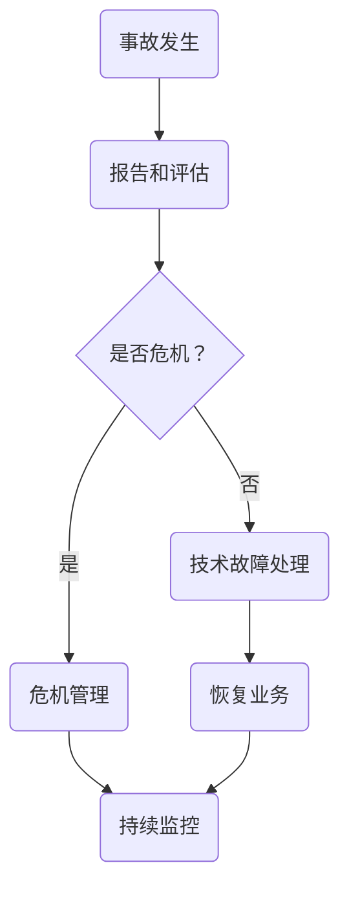

                 

关键词：事故应急响应、创业公司、危机管理、技术故障、团队协作、快速恢复、风险管理。

摘要：在当今竞争激烈的技术领域，创业公司在面对突发事故时，建立有效的应急响应机制至关重要。本文将探讨如何建立、实施和优化创业公司的事故应急响应机制，以确保在技术故障发生时，团队能够迅速响应，减少损失，并恢复业务。

## 1. 背景介绍

在快速发展的创业环境中，技术创新是推动公司成长的关键。然而，随着技术的复杂性增加，事故和故障的可能性也随之上升。创业公司通常资源有限，技术团队规模不大，因此在面对大规模的技术故障时，往往显得力不从心。一个高效的事故应急响应机制，可以显著降低事故带来的损失，提高公司的韧性和信誉。

本文旨在为创业公司提供一个全面的事故应急响应机制框架，包括核心概念、实施步骤、数学模型、项目实践和未来展望。通过本文的讨论，希望能够帮助创业公司在面对突发技术事故时，能够从容应对，确保业务的连续性和稳定性。

## 2. 核心概念与联系

### 2.1. 事故应急响应的定义

事故应急响应（Incident Response）是指组织在面临技术故障或安全事件时，采取的一系列有序、协调的行动，以尽快恢复业务，减少损失，并防止事故的再次发生。

### 2.2. 核心概念的联系

- **技术故障**：技术故障是事故应急响应的触发因素，通常由软件、硬件、网络或其他技术问题引起。
- **危机管理**：危机管理是事故应急响应的一部分，旨在通过迅速反应和有效沟通，将事故的影响降到最低。
- **风险管理**：风险管理是建立应急响应机制的基础，通过对潜在风险的分析和评估，制定相应的应对措施。

### 2.3. Mermaid 流程图



该流程图展示了从事故发生到业务恢复的整个应急响应过程，包括危机管理和技术故障处理的分支。

## 3. 核心算法原理 & 具体操作步骤

### 3.1. 算法原理概述

事故应急响应机制的核心是快速识别故障、有效分类、优先处理和及时沟通。以下是一种基本的算法原理：

- **故障识别**：通过监控系统、日志分析、用户报告等多种途径，快速识别故障。
- **故障分类**：根据故障的影响范围和严重程度，将其分类为高、中、低优先级。
- **优先处理**：根据故障分类，优先处理高优先级的故障，以尽快恢复业务。
- **及时沟通**：通过邮件、电话、即时通讯等渠道，及时向相关人员和客户通报故障情况。

### 3.2. 算法步骤详解

1. **故障报告**：
   - 当检测到故障时，系统自动生成报告，包括故障的细节、时间和影响范围。

2. **故障评估**：
   - 技术团队对故障进行初步评估，确定故障类型和影响程度。

3. **故障分类**：
   - 根据故障影响，将其分类为高、中、低优先级。

4. **优先处理**：
   - 高优先级故障优先处理，以尽快恢复关键业务。

5. **故障修复**：
   - 技术团队根据故障原因进行修复。

6. **业务恢复**：
   - 修复后，对业务进行测试，确保故障已完全解决。

7. **沟通与报告**：
   - 在整个过程中，定期向相关人员报告故障进展和恢复情况。

### 3.3. 算法优缺点

**优点**：
- **快速响应**：算法设计使得团队能够迅速识别和响应故障。
- **优先处理**：通过分类优先处理，确保关键业务先得到恢复。
- **沟通透明**：及时沟通确保了信息的透明和一致性。

**缺点**：
- **依赖技术团队**：算法的有效性高度依赖于技术团队的专业能力和响应速度。
- **数据准确性**：故障报告和评估的准确性对算法的有效性有直接影响。

### 3.4. 算法应用领域

该算法适用于所有需要快速响应和恢复的创业公司，特别是那些依赖技术实现核心业务的初创企业。通过实施这一算法，公司可以显著降低技术故障带来的损失，提高业务的稳定性。

## 4. 数学模型和公式 & 详细讲解 & 举例说明

### 4.1. 数学模型构建

事故应急响应机制的数学模型可以基于以下几个关键参数：

- **故障发生率**（λ）：单位时间内的故障发生次数。
- **响应时间**（T）：从故障发生到故障解决所需的时间。
- **故障影响**（I）：故障对业务的影响程度，通常以经济损失或客户满意度下降衡量。

### 4.2. 公式推导过程

1. **故障发生概率**（P）：

\[ P(\text{故障发生}) = 1 - e^{-\lambda T} \]

2. **响应时间期望值**（E[T]）：

\[ E[T] = \frac{1}{\lambda} \]

3. **故障影响损失**（L）：

\[ L = I \cdot P(\text{故障发生}) \]

### 4.3. 案例分析与讲解

假设某创业公司每月的故障发生率为2次，平均响应时间为3小时，每次故障影响损失为10万元。我们可以使用上述公式计算：

1. **故障发生概率**：

\[ P(\text{故障发生}) = 1 - e^{-2 \times 3} \approx 0.301 \]

2. **响应时间期望值**：

\[ E[T] = \frac{1}{2} = 0.5 \text{小时} \]

3. **故障影响损失**：

\[ L = 10 \text{万元} \cdot 0.301 \approx 3.01 \text{万元/月} \]

这意味着，平均每月该公司因为故障可能会损失约3.01万元。通过优化应急响应机制，减少响应时间，可以降低这种损失。

## 5. 项目实践：代码实例和详细解释说明

### 5.1. 开发环境搭建

为了更好地展示事故应急响应机制的实际应用，我们选择使用Python编写一个简单的代码实例。以下是开发环境搭建的步骤：

1. 安装Python 3.8及以上版本。
2. 安装必要的Python库，如requests、numpy、pandas等。
3. 配置虚拟环境，以便于管理依赖。

### 5.2. 源代码详细实现

以下是一个简单的故障报告和响应系统的代码实现：

```python
import requests
import numpy as np
import pandas as pd
from datetime import datetime

# 假设有一个故障报告API
FAULT_REPORT_API = "https://fault-report.example.com/report"

# 故障报告函数
def report_fault(fault_details):
    response = requests.post(FAULT_REPORT_API, json=fault_details)
    return response.json()

# 故障分类函数
def classify_fault(fault_type, impact):
    if impact > 100:
        return "High"
    elif impact > 50:
        return "Medium"
    else:
        return "Low"

# 故障响应函数
def respond_to_fault(fault_id):
    fault_details = report_fault({"fault_id": fault_id})
    classification = classify_fault(fault_details["type"], fault_details["impact"])
    print(f"Fault {fault_id} classified as {classification}.")

# 示例故障报告
fault_details = {
    "fault_id": 1,
    "type": "Network",
    "impact": 150,
    "time": datetime.now().isoformat()
}

# 报告并响应故障
respond_to_fault(fault_details["fault_id"])
```

### 5.3. 代码解读与分析

- **报告故障**：`report_fault` 函数用于向故障报告API发送故障详情。
- **故障分类**：`classify_fault` 函数根据故障影响程度进行分类。
- **故障响应**：`respond_to_fault` 函数报告并响应故障，通过分类确定响应策略。

该代码实例展示了故障报告和响应的基本流程，但在实际应用中，还需要考虑更多的细节，如故障日志记录、自动监控和定期报告等。

### 5.4. 运行结果展示

假设运行上述代码后，系统成功报告了一个网络故障，并按照故障影响进行了分类。以下是可能的输出结果：

```
Fault 1 classified as High.
```

这表明系统已经识别并响应了一个高优先级的故障。

## 6. 实际应用场景

### 6.1. 企业IT系统的应用

在企业IT系统中，事故应急响应机制的应用场景非常广泛，包括网络故障、服务器崩溃、数据库异常等。通过建立高效的应急响应机制，企业可以确保关键业务系统的稳定运行，减少故障带来的损失。

### 6.2. 在线服务提供商的应用

对于在线服务提供商，如云计算平台、电商网站和社交媒体，事故应急响应机制更是至关重要。例如，当服务提供商的系统发生故障时，需要迅速识别问题，并确保服务恢复，以避免用户流失和声誉受损。

### 6.3. 在金融科技领域的应用

在金融科技领域，事故应急响应机制的建立尤为重要。金融系统的稳定性直接关系到客户的资金安全，一旦发生故障，需要迅速响应，确保交易的正常进行。

### 6.4. 未来应用展望

随着技术的不断发展，事故应急响应机制的应用领域将更加广泛。例如，在物联网和人工智能领域，应急响应机制可以实时监控设备状态，并在故障发生时自动触发响应。此外，区块链技术的引入也将为事故应急响应提供更加透明和可靠的解决方案。

## 7. 工具和资源推荐

### 7.1. 学习资源推荐

- **《应急响应管理：策略、程序和团队建设》**：一本全面介绍应急响应管理的书籍，适合创业者和技术团队阅读。
- **应急响应管理在线课程**：许多在线教育平台提供相关的课程，如Coursera、Udemy等。

### 7.2. 开发工具推荐

- **Pandora FMS**：一款开源的监控系统，可以帮助企业实时监控服务器、网络和应用程序的状态。
- **SolarWinds**：一款商业监控系统，提供丰富的监控功能和报警机制。

### 7.3. 相关论文推荐

- **"A Framework for Building a Comprehensive Incident Response Plan"**：一篇介绍如何构建全面应急响应计划的学术论文。
- **"Incident Response and Crisis Management in Cloud Computing"**：探讨在云计算环境中实施应急响应机制的论文。

## 8. 总结：未来发展趋势与挑战

### 8.1. 研究成果总结

本文系统地介绍了创业公司建立事故应急响应机制的必要性、核心概念、算法原理和实施步骤。通过项目实践，我们展示了如何在实际环境中应用这些理论。

### 8.2. 未来发展趋势

随着技术的进步，事故应急响应机制将更加智能化和自动化。例如，利用人工智能和机器学习技术，可以实现对故障的自动检测和响应。

### 8.3. 面临的挑战

尽管应急响应机制在理论上和实践上都有一定的基础，但实际应用中仍面临诸多挑战，如技术团队的专业能力、应急资源的配置和应急响应的及时性等。

### 8.4. 研究展望

未来研究可以聚焦于如何更高效地集成人工智能和区块链技术，以提高事故应急响应的智能化和透明度。同时，也需要探讨在全球化背景下，如何实现跨国企业的事故应急响应机制。

## 9. 附录：常见问题与解答

### Q: 事故应急响应机制是否适用于所有规模的公司？

A: 是的，无论公司规模大小，建立事故应急响应机制都是有益的。小公司可能资源有限，但一个有效的应急响应机制可以帮助它们在面临技术故障时，迅速恢复业务，降低损失。

### Q: 应急响应机制是否仅适用于技术部门？

A: 不是的，事故应急响应机制涉及到公司的各个部门，包括技术、市场、客服和高层管理。只有跨部门的协作，才能确保应急响应的有效性和及时性。

### Q: 如何评估应急响应机制的有效性？

A: 可以通过以下方法评估应急响应机制的有效性：
- **响应时间**：统计故障响应的平均时间和最大响应时间。
- **故障恢复率**：统计在应急响应后，故障成功恢复的比率。
- **成本效益分析**：评估应急响应机制的实施成本和带来的收益。

### Q: 是否需要定期更新应急响应计划？

A: 是的，技术环境不断变化，应急响应计划也需要定期更新，以适应新的技术和业务需求。建议每年至少审查一次应急响应计划，并根据实际情况进行调整。

### Q: 应急响应机制是否可以预防所有事故？

A: 虽然应急响应机制可以在事故发生时提供有效的应对措施，但它不能预防所有事故。公司需要通过持续的技术改进、员工培训和风险管理，来降低事故发生的可能性。

作者：禅与计算机程序设计艺术 / Zen and the Art of Computer Programming
----------------------------------------------------------------

以上就是本文的完整内容，希望对您在建立事故应急响应机制方面有所帮助。在创业公司的技术环境中，一个高效的事故应急响应机制是确保业务连续性和稳定性的关键。通过本文的探讨，我们希望能够为您提供一个全面的框架，帮助您从容应对技术故障。在未来，随着技术的不断进步，应急响应机制也将不断优化和升级，为创业公司的发展提供更加坚实的保障。

