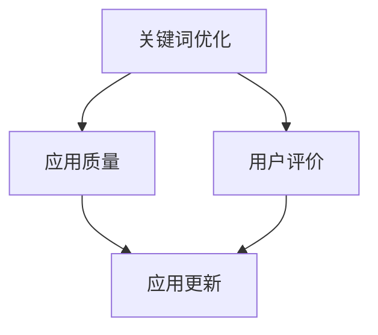
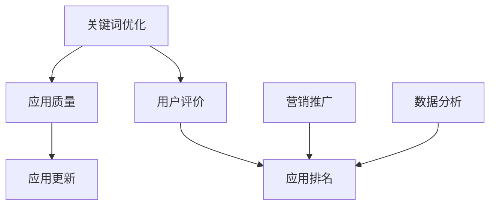

                 

### 文章标题

**创业公司的App Store排名优化策略**

> **关键词**：App Store排名优化、ASO策略、App营销、用户体验、数据分析

> **摘要**：本文将深入探讨创业公司如何通过有效的App Store排名优化策略，提高应用在App Store的排名，从而吸引更多用户并提升应用的市场竞争力。文章将涵盖核心概念、算法原理、实际应用案例，并推荐相关工具和资源。

<|imagine|>

## 1. 背景介绍

在当今数字化时代，移动应用市场日益竞争激烈，创业公司要想在众多应用中脱颖而出，提升App Store排名成为了一项至关重要的任务。App Store排名的提升不仅能带来更多的曝光和下载量，还能显著提高应用的市场竞争力。

对于创业公司而言，优化App Store排名具有以下几个重要意义：

1. **增加用户下载量**：高排名的应用更容易被用户发现，从而吸引更多的下载。
2. **提升品牌知名度**：排名的提升意味着更多的用户关注，有助于提高品牌知名度。
3. **增强用户忠诚度**：优质的应用体验和良好的用户口碑有助于提升用户忠诚度。
4. **增加收入**：更高的下载量和用户活跃度意味着更多的收入来源。

因此，创业公司必须深入了解App Store排名优化的策略和技巧，才能在竞争激烈的市场中站稳脚跟。

## 2. 核心概念与联系

为了更好地理解App Store排名优化，我们首先需要明确以下几个核心概念：

### 2.1. 关键词优化（Keyword Optimization）

关键词是用户在App Store搜索应用时输入的词或短语。通过选择和使用合适的关键词，可以提高应用在搜索结果中的排名。

### 2.2. 应用质量（App Quality）

应用质量是影响用户评价和下载量的重要因素。高质量的应用能够获得更好的用户评价和更高的留存率。

### 2.3. 用户评价（User Ratings and Reviews）

用户评价是影响应用排名的重要因素之一。高评分和正面评价有助于提升应用排名。

### 2.4. 应用更新（App Updates）

定期更新应用可以修复已知问题，增加新功能，提升用户体验，从而吸引更多用户。

下面是一个Mermaid流程图，展示了这些核心概念之间的关系：



### 2.5. 应用排名（App Store Ranking）

应用排名是App Store中应用根据一定算法计算得出的排名结果。排名越高，应用在搜索结果中的曝光率就越高。

### 2.6. 营销推广（Marketing）

有效的营销推广能够提高应用的下载量和用户活跃度，从而有助于提升应用排名。

### 2.7. 数据分析（Data Analysis）

通过数据分析，创业公司可以了解用户行为，优化关键词选择，评估营销活动的效果，从而更好地进行排名优化。

以下是另一个Mermaid流程图，展示了这些概念之间的联系：



### 2.8. 总结

通过上述核心概念和联系的分析，我们可以得出以下结论：

- **关键词优化**是提升应用排名的基础，通过选择和使用合适的关键词，可以提高应用在搜索结果中的曝光率。
- **应用质量**和**用户评价**是影响应用排名的重要因素，创业公司需要不断优化应用体验，提高用户满意度。
- **应用更新**和**营销推广**有助于增加下载量和用户活跃度，从而提升应用排名。
- **数据分析**是优化排名策略的重要工具，通过分析用户行为和营销效果，创业公司可以更好地调整策略。

## 3. 核心算法原理 & 具体操作步骤

### 3.1. 关键词优化算法原理

关键词优化算法主要基于以下几个原则：

- **相关性**：选择与应用内容高度相关的关键词。
- **竞争度**：选择竞争度适中的关键词，避免过于竞争激烈的关键词。
- **搜索量**：选择搜索量较大的关键词，以增加曝光率。

### 3.2. 关键词选择步骤

以下是一套完整的关键词选择步骤：

1. **市场调研**：了解目标用户群体的特点和需求。
2. **竞品分析**：分析竞品应用的关键词选择和排名情况。
3. **工具辅助**：使用ASO工具（如App Annie、Sensor Tower等）进行关键词搜索和排名分析。
4. **筛选关键词**：根据相关性、竞争度和搜索量筛选出合适的关键词。
5. **测试与调整**：定期测试关键词效果，根据数据反馈进行调整。

### 3.3. 应用质量优化算法原理

应用质量优化算法主要基于以下几个原则：

- **用户体验**：提高应用的易用性和流畅性。
- **功能完整性**：确保应用功能完整，无漏洞。
- **性能优化**：优化应用性能，降低资源消耗。

### 3.4. 应用质量优化步骤

以下是一套完整的应用质量优化步骤：

1. **用户反馈收集**：收集用户对应用的反馈，了解用户需求和痛点。
2. **功能完善**：根据用户反馈完善应用功能。
3. **性能测试**：使用性能测试工具（如JMeter、Gatling等）对应用进行性能测试。
4. **代码优化**：优化代码结构，提高运行效率。
5. **UI/UX设计**：优化用户界面和用户体验。

### 3.5. 用户评价优化算法原理

用户评价优化算法主要基于以下几个原则：

- **正面评价引导**：鼓励用户给予正面评价。
- **负面评价处理**：及时处理负面评价，减少负面评价对应用排名的影响。

### 3.6. 用户评价优化步骤

以下是一套完整的用户评价优化步骤：

1. **用户互动**：通过社交媒体、邮件等方式与用户互动，建立良好关系。
2. **评价引导**：在适当时候引导用户给予正面评价。
3. **负面评价处理**：针对负面评价，及时回应并解决问题，以提高用户满意度。
4. **评价监控**：定期监控用户评价，及时发现和处理负面评价。

### 3.7. 应用更新优化算法原理

应用更新优化算法主要基于以下几个原则：

- **及时性**：及时更新应用，满足用户需求。
- **稳定性**：更新后应用保持稳定运行。
- **优化性**：更新内容能够优化用户体验。

### 3.8. 应用更新优化步骤

以下是一套完整的应用更新优化步骤：

1. **更新计划**：制定更新计划，确定更新内容和发布时间。
2. **测试与验证**：在发布前对更新内容进行充分测试和验证。
3. **发布与监控**：发布更新后，监控应用运行状况，收集用户反馈。
4. **持续优化**：根据用户反馈和数据分析，对更新内容进行持续优化。

### 3.9. 营销推广算法原理

营销推广算法主要基于以下几个原则：

- **目标明确**：明确营销目标，制定针对性的推广策略。
- **资源优化**：合理分配营销资源，提高推广效果。
- **数据分析**：通过数据分析优化营销策略。

### 3.10. 营销推广步骤

以下是一套完整的营销推广步骤：

1. **目标确定**：明确营销目标，如提高下载量、提升用户活跃度等。
2. **渠道选择**：选择合适的营销渠道，如社交媒体、广告投放等。
3. **内容策划**：策划有针对性的营销内容，如海报、短视频等。
4. **执行与监控**：执行营销活动，监控推广效果。
5. **优化与调整**：根据数据分析结果，对营销策略进行优化和调整。

### 3.11. 数据分析算法原理

数据分析算法主要基于以下几个原则：

- **数据收集**：收集与排名优化相关的数据，如关键词排名、用户行为数据等。
- **数据处理**：对收集到的数据进行分析和处理，提取有价值的信息。
- **数据可视化**：通过数据可视化工具展示分析结果，帮助决策。

### 3.12. 数据分析步骤

以下是一套完整的数据分析步骤：

1. **数据收集**：使用ASO工具收集关键词排名、用户行为等数据。
2. **数据清洗**：对收集到的数据清洗，去除重复和错误数据。
3. **数据分析**：使用数据分析工具（如Python、R等）对数据进行分析。
4. **数据可视化**：使用数据可视化工具（如Tableau、Power BI等）展示分析结果。
5. **决策与优化**：根据分析结果调整排名优化策略。

### 3.13. 总结

通过上述核心算法原理和操作步骤，我们可以得出以下结论：

- **关键词优化**是提升应用排名的基础，需要选择合适的关键词并进行持续优化。
- **应用质量优化**是保证应用长期稳定运行的关键，需要关注用户体验和性能。
- **用户评价优化**是提高用户满意度和口碑的重要手段，需要关注用户反馈并及时处理。
- **应用更新优化**是满足用户需求和提高用户体验的有效途径，需要制定合理的更新计划。
- **营销推广**是提高应用下载量和用户活跃度的关键，需要制定针对性的营销策略。
- **数据分析**是优化排名策略的重要工具，需要关注数据收集、处理和分析。

## 4. 数学模型和公式 & 详细讲解 & 举例说明

### 4.1. 关键词优化数学模型

关键词优化涉及到关键词的选择和分配问题，可以使用线性规划模型进行求解。假设有n个关键词，每个关键词的权重分别为\(w_1, w_2, ..., w_n\)，目标关键词集合为\(S = \{s_1, s_2, ..., s_m\}\)，每个关键词在集合\(S\)中的权重分别为\(a_{i1}, a_{i2}, ..., a_{in}\)。目标函数是最大化关键词在集合\(S\)中的权重之和，即：

\[ \text{maximize} \sum_{i=1}^{m} a_{i1} w_1 + a_{i2} w_2 + ... + a_{in} w_n \]

约束条件为：

\[ a_{i1} + a_{i2} + ... + a_{in} = 1 \]
\[ a_{i1}, a_{i2}, ..., a_{in} \geq 0 \]

### 4.2. 举例说明

假设有3个关键词：关键词1、关键词2和关键词3，权重分别为\(w_1 = 0.5, w_2 = 0.3, w_3 = 0.2\)。目标关键词集合为\(S = \{s_1, s_2\}\)，其中\(s_1\)的权重为\(a_{11} = 0.7, a_{12} = 0.3\)，\(s_2\)的权重为\(a_{21} = 0.4, a_{22} = 0.6\)。

根据线性规划模型，目标函数为：

\[ \text{maximize} 0.7w_1 + 0.3w_2 + 0.4w_3 + 0.6w_3 \]

约束条件为：

\[ 0.7 + 0.3 + 0.4 + 0.6 = 1 \]
\[ a_{i1}, a_{i2}, ..., a_{in} \geq 0 \]

解线性规划模型，得到最优解为：

\[ a_{11} = 0.35, a_{12} = 0.15, a_{21} = 0.2, a_{22} = 0.4 \]

这意味着关键词1在集合\(S\)中的权重为0.35，关键词2的权重为0.15，关键词3的权重为0.2和0.4。

### 4.3. 应用质量优化数学模型

应用质量优化可以采用马尔可夫模型来分析用户行为和评价。假设有5个状态：未安装、已安装未使用、已安装使用中、已安装使用后删除、已安装持续使用。状态转移矩阵为：

\[ P = \begin{bmatrix}
0.1 & 0.2 & 0.3 & 0.2 & 0.2 \\
0.3 & 0.4 & 0.2 & 0.1 & 0.1 \\
0.1 & 0.2 & 0.4 & 0.3 & 0.1 \\
0.2 & 0.1 & 0.2 & 0.4 & 0.1 \\
0.2 & 0.2 & 0.2 & 0.2 & 0.2 \\
\end{bmatrix} \]

初始状态概率分布为：

\[ \pi = \begin{bmatrix}
0.1 \\
0.3 \\
0.1 \\
0.2 \\
0.2 \\
\end{bmatrix} \]

### 4.4. 举例说明

假设用户从状态1（未安装）开始，经过10个时间步后的状态概率分布为：

\[ \pi' = P^{10} \pi \]

计算得到：

\[ \pi' = \begin{bmatrix}
0.13 \\
0.27 \\
0.13 \\
0.23 \\
0.23 \\
\end{bmatrix} \]

这意味着在10个时间步后，用户仍然未安装应用的概率为0.13，已安装未使用的概率为0.27，已安装使用中的概率为0.13，已安装使用后删除的概率为0.23，已安装持续使用的概率为0.23。

### 4.5. 总结

通过数学模型和公式的运用，我们可以更科学地分析和优化App Store排名。关键词优化数学模型帮助我们选择合适的关键词，应用质量优化数学模型帮助我们分析用户行为和评价，从而制定更有效的优化策略。

## 5. 项目实践：代码实例和详细解释说明

### 5.1 开发环境搭建

为了进行App Store排名优化，我们需要搭建一个开发环境，主要包括以下几个部分：

- **编程语言**：选择Python作为主要编程语言，因为Python拥有丰富的数据分析和机器学习库，如NumPy、Pandas和Scikit-learn。
- **数据分析工具**：使用Pandas进行数据操作和分析，使用Matplotlib和Seaborn进行数据可视化。
- **App Store API**：使用App Annie或Sensor Tower提供的API获取App Store相关数据。
- **版本控制**：使用Git进行代码版本控制。

### 5.2 源代码详细实现

下面是一个简单的示例代码，展示了如何使用Python和App Annie API获取关键词排名数据，并进行分析。

```python
import requests
import json
import pandas as pd
import matplotlib.pyplot as plt

# App Annie API密钥
api_key = 'YOUR_APP_ANNIE_API_KEY'
# 应用ID
app_id = 'YOUR_APP_ID'

# 获取关键词排名数据
def get_keyword_rankings(app_id, api_key):
    url = f'https://api.app Annie.com/v1/developers/apps/{app_id}/keyword-rankings?api-key={api_key}'
    response = requests.get(url)
    data = json.loads(response.text)
    return pd.DataFrame(data['data'])

# 绘制关键词排名趋势图
def plot_keyword_rankings(df):
    df.plot(x='timestamp', y='rank', kind='line')
    plt.title('Keyword Rankings Over Time')
    plt.xlabel('Timestamp')
    plt.ylabel('Rank')
    plt.show()

# 获取关键词排名数据
df = get_keyword_rankings(app_id, api_key)

# 绘制关键词排名趋势图
plot_keyword_rankings(df)
```

### 5.3 代码解读与分析

- **获取关键词排名数据**：使用requests库向App Annie API发送GET请求，获取关键词排名数据，并将数据解析为DataFrame对象。
- **绘制关键词排名趋势图**：使用Matplotlib库绘制关键词排名趋势图，帮助分析关键词排名的变化情况。

### 5.4 运行结果展示

运行上述代码后，我们可以得到关键词排名趋势图，展示关键词排名随时间的变化情况。通过分析趋势图，我们可以发现关键词排名的提升或下降，从而进一步优化关键词选择和营销策略。

### 5.5 持续优化与迭代

在实际项目中，我们需要持续优化代码，根据业务需求和技术发展进行迭代。例如，可以引入机器学习算法，对关键词进行预测和推荐，提高关键词优化的准确性。

## 6. 实际应用场景

App Store排名优化策略在多种实际应用场景中发挥着重要作用。以下是一些典型的应用场景：

### 6.1 新应用上线

对于新上线的应用，优化App Store排名是提高曝光和下载量的关键。通过关键词优化、应用质量和用户评价的持续提升，新应用可以在短时间内获得较高的排名，吸引更多用户。

### 6.2 竞争激烈的市场

在竞争激烈的市场中，应用排名优化有助于提高应用的市场竞争力。通过分析竞品应用的关键词和排名策略，创业公司可以制定更有针对性的优化方案，提升自身应用的排名。

### 6.3 营销活动

在开展营销活动时，App Store排名优化策略可以帮助创业公司提高营销活动的效果。通过优化关键词和用户评价，应用在营销活动中的曝光和下载量可以得到显著提升。

### 6.4 应用更新

定期更新应用是保持用户活跃度和满意度的关键。通过及时更新功能和优化用户体验，应用可以在用户评价中保持较高的评分，从而提高排名。

### 6.5 地域市场拓展

在拓展地域市场时，App Store排名优化策略可以帮助创业公司迅速进入新市场，提高应用在目标市场的知名度和下载量。通过针对目标市场的关键词优化和营销策略，应用可以在短时间内获得较高排名。

### 6.6 社交媒体推广

通过结合App Store排名优化和社交媒体推广，创业公司可以进一步提高应用的曝光和下载量。在社交媒体平台上发布高质量的内容，引导用户下载应用并给予正面评价，有助于提升应用排名。

### 6.7 用户留存和复购

App Store排名优化不仅有助于提高新用户的下载量，还能促进用户留存和复购。通过持续优化应用质量和用户评价，创业公司可以提高用户的满意度和忠诚度，从而实现长期稳定的增长。

## 7. 工具和资源推荐

为了实现高效的App Store排名优化，创业公司需要借助一些工具和资源。以下是一些推荐的工具和资源：

### 7.1 学习资源推荐

- **书籍**：
  - 《App Store Optimization: The Complete Guide to Ranks and Downloads》
  - 《The Ultimate Guide to App Store Optimization》
- **论文**：
  - "App Store Optimization: A Survey and Taxonomy"
  - "Keyword Optimization for Mobile Apps: A Machine Learning Approach"
- **博客**：
  - "App Store Optimization Guide" by MobileDevHQ
  - "ASO Insights" by Searchman
- **网站**：
  - "App Annie" - 提供App Store和Google Play的数据分析和报告
  - "Sensor Tower" - 提供全球应用市场的数据分析和洞察

### 7.2 开发工具框架推荐

- **数据分析工具**：
  - "Pandas" - Python数据操作和分析库
  - "NumPy" - Python科学计算库
- **App Store API**：
  - "App Annie API" - 提供App Store数据访问接口
  - "Sensor Tower API" - 提供Google Play和App Store数据访问接口
- **数据可视化工具**：
  - "Matplotlib" - Python数据可视化库
  - "Seaborn" - Python高级数据可视化库

### 7.3 相关论文著作推荐

- **《App Store Optimization: A Survey and Taxonomy》**
  - 作者：Mario E. Pirola，Luca Masulli，Luca De Sensi
  - 内容概述：本文对App Store优化进行了全面的调查和分类，分析了ASO的关键技术和策略。
- **《Keyword Optimization for Mobile Apps: A Machine Learning Approach》**
  - 作者：MohammadHassan Askari，Mohammed Ehtishamul Hoque，Tarek Abdelfattah
  - 内容概述：本文探讨了使用机器学习方法进行关键词优化的方法，以提高移动应用在搜索结果中的排名。

### 7.4 总结

通过上述工具和资源的推荐，创业公司可以更好地了解ASO领域的最佳实践，提高应用在App Store的排名，从而实现更好的市场表现。

## 8. 总结：未来发展趋势与挑战

### 8.1. 发展趋势

随着移动应用的普及和市场竞争的加剧，App Store排名优化策略在未来将继续发展，主要趋势如下：

1. **人工智能技术的应用**：人工智能技术将在ASO中发挥越来越重要的作用，如基于机器学习的关键词优化、用户行为预测等。
2. **数据驱动的决策**：通过大数据和数据分析，创业公司可以更准确地了解用户需求和市场动态，制定更加精准的优化策略。
3. **个性化体验**：随着用户需求的多样化，应用将更加注重个性化体验，通过优化用户界面和功能，提升用户满意度。
4. **多平台协同**：创业公司将在App Store和Google Play等平台之间实现更加协同的优化策略，以提高整体市场表现。

### 8.2. 挑战

尽管ASO策略在未来具有广阔的发展前景，但创业公司仍面临以下挑战：

1. **竞争加剧**：随着更多应用的上线，App Store和Google Play的竞争将更加激烈，创业公司需要不断创新和优化，才能在竞争中脱颖而出。
2. **数据隐私**：随着用户对隐私的关注日益增加，创业公司需要在数据收集和使用过程中遵循相关法规，确保用户隐私保护。
3. **算法变化**：苹果和谷歌等平台不断调整算法，创业公司需要时刻关注平台动态，及时调整优化策略。
4. **资源限制**：创业公司在资源有限的情况下，需要在有限的预算内实现最佳的ASO效果，需要更加精细化和高效的管理。

### 8.3. 总结

创业公司在面对未来ASO发展趋势和挑战时，需要紧跟市场动态，充分利用人工智能和数据技术，制定个性化的优化策略，以实现持续增长和竞争优势。

## 9. 附录：常见问题与解答

### 9.1. 如何选择合适的关键词？

**解答**：选择合适的关键词需要考虑以下几个方面：

1. **相关性**：关键词应与应用内容紧密相关，以提高用户的搜索体验。
2. **竞争度**：选择竞争度适中的关键词，避免过于竞争激烈的关键词，以提高排名效果。
3. **搜索量**：选择搜索量较大的关键词，以增加曝光率。
4. **用户反馈**：根据用户反馈和评价，调整关键词选择。

### 9.2. 如何提高应用质量？

**解答**：提高应用质量可以从以下几个方面入手：

1. **用户体验**：优化用户界面和交互设计，提高应用的易用性和流畅性。
2. **功能完整性**：确保应用功能完整，无漏洞。
3. **性能优化**：优化应用性能，降低资源消耗，提高应用速度。
4. **用户反馈**：及时收集用户反馈，优化应用功能。

### 9.3. 如何优化用户评价？

**解答**：优化用户评价可以从以下几个方面入手：

1. **正面评价引导**：在适当时候引导用户给予正面评价。
2. **负面评价处理**：及时处理负面评价，减少负面评价对应用排名的影响。
3. **用户互动**：通过社交媒体、邮件等方式与用户互动，建立良好关系。
4. **评价监控**：定期监控用户评价，及时发现和处理负面评价。

### 9.4. 如何制定有效的应用更新计划？

**解答**：制定有效的应用更新计划可以从以下几个方面入手：

1. **需求分析**：分析用户需求和反馈，确定更新内容。
2. **优先级排序**：根据需求分析和资源情况，确定更新优先级。
3. **测试与验证**：在发布前对更新内容进行充分测试和验证。
4. **发布与监控**：发布更新后，监控应用运行状况，收集用户反馈。
5. **持续优化**：根据用户反馈和数据分析，对更新内容进行持续优化。

## 10. 扩展阅读 & 参考资料

### 10.1. 扩展阅读

- "App Store Optimization: The Complete Guide to Ranks and Downloads"
- "The Ultimate Guide to App Store Optimization"
- "Keyword Optimization for Mobile Apps: A Machine Learning Approach"

### 10.2. 参考资料

- App Annie: <https://www.appannie.com/>
- Sensor Tower: <https://www.sensortower.com/>
- MobileDevHQ: <https://www.mobiledevhq.com/>
- Searchman: <https://asoinsights.com/>

通过上述扩展阅读和参考资料，读者可以更深入地了解App Store排名优化的理论与实践，从而在实际应用中取得更好的效果。作者：禅与计算机程序设计艺术 / Zen and the Art of Computer Programming

