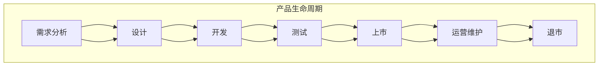

                 

### 1. 背景介绍

在当今快速发展的商业环境中，产品的生命周期管理（Product Lifecycle Management，简称PLM）成为企业成功的关键因素之一。创业公司，作为创新和技术驱动的先锋，其产品的成功与否往往直接影响到公司的成长和长期发展。因此，有效的产品生命周期管理策略对于创业公司至关重要。

#### 1.1 定义与重要性

产品生命周期管理是指从产品概念阶段到退市阶段的整个生命周期内，对产品的规划、开发、测试、上市、运营和维护等各个环节进行系统化管理的一系列活动和过程。它不仅涉及产品技术层面，还包括市场、财务、人力资源等多个方面的综合管理。

对于创业公司来说，产品生命周期管理的重要性体现在以下几个方面：

1. **资源优化**：有效的PLM可以帮助创业公司合理配置有限的人力、财务和技术资源，确保产品开发、测试和上市等环节的顺利进行。
2. **市场竞争力**：通过对产品生命周期的全程监控和管理，创业公司能够快速响应市场变化，增强产品竞争力。
3. **风险控制**：产品生命周期管理的各个环节都有潜在风险，通过系统化的管理，可以降低风险，提高产品成功率。
4. **客户满意度**：良好的产品生命周期管理能够确保产品质量和性能，提高客户满意度，进而增强品牌忠诚度。

#### 1.2 创业公司面临的主要挑战

创业公司在产品生命周期管理中面临诸多挑战：

1. **资源限制**：初创企业通常在人力、资金和技术等方面有限，需要高效利用资源。
2. **市场不确定性**：市场环境变化迅速，创业公司需要快速适应市场变化，确保产品符合市场需求。
3. **技术迭代**：技术快速发展，创业公司需要紧跟技术潮流，不断更新产品技术。
4. **竞争压力**：新兴市场通常竞争激烈，创业公司需要通过产品生命周期管理提高产品竞争力。
5. **法律和合规要求**：产品需要遵守相关法律法规，特别是在国际化运营时。

#### 1.3 为什么需要有效的产品生命周期管理策略

有效的产品生命周期管理策略对于创业公司具有以下几个关键作用：

1. **提升产品质量**：通过系统化的开发、测试和上市流程，确保产品质量。
2. **缩短产品上市时间**：优化各个环节，减少不必要的延迟，加快产品上市速度。
3. **降低成本**：通过资源优化和风险控制，降低产品开发成本。
4. **增强客户满意度**：确保产品满足市场需求，提高客户满意度。
5. **提高品牌价值**：成功的产品能够提升公司品牌知名度和市场地位。

本文将深入探讨创业公司的产品生命周期管理策略，通过理论分析和实际案例分析，提供系统化的方法和实践指导。

### 2. 核心概念与联系

#### 2.1 产品生命周期模型

产品生命周期模型是产品生命周期管理的理论基础，它描述了产品从引入期到成熟期、衰退期和退市期等各个阶段的发展过程。以下是典型的产品生命周期模型：

1. **引入期（Introduction）**：产品刚刚进入市场，需要大量的市场推广和用户教育。此阶段的特点是销售额和利润较低，但市场潜力巨大。
2. **成长期（Growth）**：产品开始受到市场欢迎，销售额迅速增长。此阶段需要加强市场拓展和品牌建设。
3. **成熟期（Maturity）**：产品市场已经饱和，销售额增长放缓，但利润较高。此阶段需要通过产品创新和服务提升保持竞争力。
4. **衰退期（Decline）**：产品销量和市场份额开始下降，需要评估是否继续维护或更新换代。
5. **退市期（Exit）**：产品达到其使用寿命，选择退市或进行更新换代。

产品生命周期模型不仅适用于单一产品，还可以扩展到产品组合和企业整体战略规划。

#### 2.2 产品生命周期管理的关键环节

产品生命周期管理涉及多个关键环节，每个环节都需要精心设计和执行：

1. **需求分析（Requirement Analysis）**：明确产品需求，确保产品符合市场需求。
2. **设计（Design）**：根据需求分析进行产品设计，确保产品的技术实现方案。
3. **开发（Development）**：实际开发产品，包括软件编写、硬件设计等。
4. **测试（Testing）**：对产品进行全面测试，确保产品符合质量标准。
5. **上市（Launch）**：产品上市前的准备和推广活动。
6. **运营和维护（Operation and Maintenance）**：产品上市后的运营和维护，包括用户支持、故障修复等。
7. **退市（Exit）**：评估产品是否继续维护或更新换代，进行退市操作。

#### 2.3 核心概念与架构的关系

为了更好地理解产品生命周期管理，我们可以使用Mermaid流程图来描述其核心概念和架构：

在这个流程图中，每个节点都代表了产品生命周期中的一个关键环节，节点之间的箭头表示环节的执行顺序。通过这个流程图，我们可以清晰地看到产品从需求分析到退市的整个生命周期。

通过上述核心概念和架构的介绍，我们为后续深入探讨产品生命周期管理策略奠定了基础。

### 3. 核心算法原理 & 具体操作步骤

#### 3.1 产品生命周期管理策略的基本算法

产品生命周期管理策略的核心在于如何有效规划和控制产品的各个生命周期阶段，以最大化企业价值。为此，我们可以采用以下基本算法：

1. **需求分析算法**：基于市场调研和用户反馈，确定产品的核心功能和市场需求。
2. **设计优化算法**：通过迭代设计和风险评估，确保产品设计的可行性和高效性。
3. **开发调度算法**：优化开发资源的分配和项目进度，确保按时交付高质量的产品。
4. **测试优化算法**：通过自动化测试和持续集成，提高测试效率和产品可靠性。
5. **上市推广算法**：结合市场分析和营销策略，制定有效的产品上市计划。
6. **运营维护优化算法**：通过监控和分析，持续优化产品性能和用户体验。

#### 3.2 需求分析算法的具体操作步骤

1. **市场调研**：收集行业趋势、竞争对手分析、用户需求等信息。
    - **数据收集**：使用问卷调查、访谈、数据分析等方法收集信息。
    - **数据分析**：整理和分析数据，识别用户痛点和市场机会。

2. **需求确认**：确定产品的核心功能和需求。
    - **需求文档**：编写需求文档，详细描述产品的功能和性能要求。
    - **需求评审**：组织团队评审需求文档，确保需求完整和可行。

3. **优先级排序**：根据市场需求和资源限制，对需求进行优先级排序。
    - **Kano模型**：使用Kano模型识别基本需求、期望需求和惊喜需求。
    - **优先级矩阵**：构建优先级矩阵，评估需求的优先级。

#### 3.3 设计优化算法的具体操作步骤

1. **初步设计**：根据需求文档，进行产品初步设计。
    - **功能设计**：设计产品的功能模块和接口。
    - **架构设计**：确定产品的系统架构和技术选型。

2. **风险评估**：评估设计方案的潜在风险。
    - **风险识别**：识别可能的技术风险、市场风险和运营风险。
    - **风险分析**：分析风险的严重程度和可能性。

3. **迭代设计**：通过迭代和反馈，优化设计方案。
    - **设计评审**：组织设计评审，收集反馈和改进意见。
    - **迭代优化**：根据评审结果，对设计方案进行优化。

#### 3.4 开发调度算法的具体操作步骤

1. **任务分解**：将项目任务分解为可管理的子任务。
    - **工作分解结构**：使用工作分解结构（WBS）将项目任务分解为具体的可执行任务。

2. **资源分配**：优化资源分配，确保按时交付。
    - **资源规划**：根据任务需求，规划人力资源、技术和资金资源。
    - **资源调度**：使用调度算法，优化资源的利用效率。

3. **进度监控**：监控项目进度，确保按时交付。
    - **进度报告**：定期生成进度报告，评估项目状态。
    - **问题解决**：及时识别和解决项目中的问题。

#### 3.5 测试优化算法的具体操作步骤

1. **测试计划**：制定测试计划，确保测试覆盖全面。
    - **测试策略**：确定测试方法、测试用例和测试环境。
    - **测试资源**：规划测试所需的人力、技术和设备资源。

2. **自动化测试**：使用自动化测试工具，提高测试效率。
    - **测试脚本**：编写自动化测试脚本，覆盖主要功能模块。
    - **测试执行**：定期执行自动化测试，确保产品质量。

3. **持续集成**：通过持续集成，确保代码质量和交付速度。
    - **CI工具**：选择合适的持续集成工具，如Jenkins、GitLab CI等。
    - **CI流程**：建立CI流程，确保每次代码提交后自动执行测试。

#### 3.6 上市推广算法的具体操作步骤

1. **市场分析**：分析市场环境和竞争对手，制定营销策略。
    - **SWOT分析**：进行SWOT分析，识别产品的优势和劣势。
    - **目标市场**：确定目标市场和目标用户。

2. **推广策略**：制定具体的推广策略，包括广告、促销、公关等。
    - **广告**：选择合适的广告渠道，如社交媒体、搜索引擎等。
    - **促销**：设计促销活动，提高产品知名度和销量。

3. **用户反馈**：收集用户反馈，优化产品和服务。
    - **用户调研**：进行用户调研，收集用户反馈。
    - **反馈机制**：建立反馈机制，快速响应用户需求。

#### 3.7 运营维护优化算法的具体操作步骤

1. **监控与维护**：实时监控产品运行状态，确保稳定性和可靠性。
    - **监控系统**：建立监控系统，实时监控产品运行状态。
    - **故障修复**：及时修复产品故障，确保用户体验。

2. **性能优化**：定期对产品进行性能优化，提高用户体验。
    - **性能测试**：进行性能测试，识别性能瓶颈。
    - **优化方案**：根据测试结果，制定优化方案。

3. **用户支持**：提供用户支持，解决用户问题。
    - **客户服务**：建立客户服务团队，提供在线和电话支持。
    - **知识库**：建立知识库，提供常见问题和解决方案。

通过上述核心算法和具体操作步骤，创业公司可以系统地管理产品生命周期，提高产品成功率和市场竞争力。

### 4. 数学模型和公式 & 详细讲解 & 举例说明

#### 4.1 需求分析中的数学模型

在产品生命周期管理的需求分析阶段，常用的数学模型包括需求量预测模型和需求优先级排序模型。

1. **需求量预测模型**：需求量预测模型用于预测产品的需求量，以便于规划生产资源和库存管理。常用的需求量预测模型有线性回归模型、时间序列模型等。

   **线性回归模型**：线性回归模型假设需求量与时间之间存在线性关系，其公式如下：
   $$Y_t = \beta_0 + \beta_1 t + \epsilon_t$$
   其中，$Y_t$表示第$t$期的需求量，$\beta_0$为截距，$\beta_1$为斜率，$t$为时间，$\epsilon_t$为随机误差。

   **时间序列模型**：时间序列模型用于分析需求量随时间的变化趋势。常用的时间序列模型包括ARIMA模型、季节性时间序列模型等。

   **ARIMA模型**：ARIMA模型通过自回归（AR）、差分（I）和移动平均（MA）的组合来建模时间序列。其公式如下：
   $$Y_t = c + \phi_1 Y_{t-1} + \phi_2 Y_{t-2} + \ldots + \phi_p Y_{t-p} + \theta_1 \epsilon_{t-1} + \theta_2 \epsilon_{t-2} + \ldots + \theta_q \epsilon_{t-q} + \epsilon_t$$
   其中，$Y_t$表示第$t$期的需求量，$c$为常数项，$\phi_1, \phi_2, \ldots, \phi_p$为自回归系数，$\theta_1, \theta_2, \ldots, \theta_q$为移动平均系数，$\epsilon_t$为随机误差。

   **举例说明**：假设我们有一个时间序列数据集，包含过去一年的需求量数据。我们可以使用ARIMA模型对其进行建模和预测。

   - **步骤1**：数据预处理，包括数据清洗、填充缺失值等。
   - **步骤2**：绘制时间序列图，观察数据趋势。
   - **步骤3**：选择适当的ARIMA模型参数，通过AIC/BIC准则进行模型选择。
   - **步骤4**：建立ARIMA模型，进行参数估计和模型检验。
   - **步骤5**：使用模型进行需求量预测。

2. **需求优先级排序模型**：需求优先级排序模型用于确定不同需求的优先级，以便于资源优化和任务调度。常用的需求优先级排序模型有Kano模型和MoSCoW模型。

   **Kano模型**：Kano模型将需求分为五类：基本需求、期望需求、魅力需求、无差异需求和反向需求。其优先级排序规则如下：
   - **基本需求**：必须满足的需求，优先级最高。
   - **期望需求**：用户期望得到的需求，优先级较高。
   - **魅力需求**：提升用户体验的需求，优先级中等。
   - **无差异需求**：对用户影响不大的需求，优先级较低。
   - **反向需求**：用户不希望得到的需求，优先级最低。

   **MoSCoW模型**：MoSCoW模型将需求分为四类：必须完成（Must have）、应该完成（Should have）、可以完成（Could have）和不会完成（Won't have）。其优先级排序规则如下：
   - **必须完成**：项目成功不可或缺的需求，优先级最高。
   - **应该完成**：项目成功的重要需求，优先级较高。
   - **可以完成**：项目成功次要的需求，优先级中等。
   - **不会完成**：当前阶段无法实现的需求，优先级最低。

   **举例说明**：假设我们有一个产品需求列表，包含以下需求：
   - 基本需求：用户注册、用户登录、数据存储。
   - 期望需求：用户搜索功能、数据导出功能。
   - 魅力需求：个性化推荐、用户反馈系统。
   - 无差异需求：用户帮助文档、关于我们页面。
   - 反向需求：强制广告、不必要的数据收集。

   我们可以使用Kano模型和MoSCoW模型对其进行优先级排序：
   - **Kano模型**：
     - 基本需求：用户注册、用户登录、数据存储（优先级最高）。
     - 期望需求：用户搜索功能、数据导出功能（优先级较高）。
     - 魅力需求：个性化推荐、用户反馈系统（优先级中等）。
     - 无差异需求：用户帮助文档、关于我们页面（优先级较低）。
     - 反向需求：强制广告、不必要的数据收集（优先级最低）。
   
   - **MoSCoW模型**：
     - 必须完成：用户注册、用户登录、数据存储（优先级最高）。
     - 应该完成：用户搜索功能、数据导出功能（优先级较高）。
     - 可以完成：个性化推荐、用户反馈系统（优先级中等）。
     - 不会完成：用户帮助文档、关于我们页面（优先级较低）。
     - 无需完成：强制广告、不必要的数据收集（优先级最低）。

通过上述数学模型和公式，创业公司可以更好地进行需求分析和优先级排序，从而优化产品规划和开发过程。

### 5. 项目实践：代码实例和详细解释说明

在本节中，我们将通过一个实际的创业公司项目，详细展示如何使用前述的产品生命周期管理策略。我们将从项目背景、需求分析、设计、开发、测试、上市推广、运营维护等各个环节，一步步进行详细讲解。

#### 5.1 项目背景

假设我们是一家创业公司，开发一款名为“SmartHome”的智能家居控制系统。该系统旨在通过互联网连接家庭设备，实现远程控制和自动化操作，提高用户的生活品质和便利性。

#### 5.2 需求分析

1. **市场调研**：

   我们首先进行了市场调研，分析了当前智能家居市场的发展趋势、竞争对手的产品特点以及用户需求。通过问卷调查和用户访谈，我们收集了以下信息：

   - 用户希望实现的基本功能：远程控制家庭设备、设备之间的自动联动、实时监控家庭安全。
   - 用户期望的附加功能：设备能耗监测、个性化定制、智能推荐。

2. **需求确认**：

   根据市场调研结果，我们确定了“SmartHome”系统的核心功能：

   - 用户注册和登录。
   - 远程控制家庭设备（如灯光、空调、门锁等）。
   - 设备联动（如离家模式、睡眠模式等）。
   - 实时监控家庭安全（如摄像头监控、烟雾报警等）。
   - 能耗监测和智能推荐。

3. **优先级排序**：

   我们使用MoSCoW模型对需求进行优先级排序：

   - **必须完成**：用户注册和登录、远程控制家庭设备、设备联动。
   - **应该完成**：实时监控家庭安全、能耗监测。
   - **可以完成**：个性化定制、智能推荐。
   - **不会完成**：无。

#### 5.3 设计

1. **初步设计**：

   根据需求分析，我们设计了“SmartHome”系统的功能模块：

   - 用户管理模块：处理用户注册、登录、权限管理等。
   - 设备管理模块：管理家庭设备信息，实现远程控制。
   - 联动管理模块：实现设备之间的联动功能。
   - 安全监控模块：处理摄像头监控、烟雾报警等功能。
   - 数据分析模块：分析用户行为和设备使用数据，提供智能推荐。

2. **架构设计**：

   我们选择了微服务架构，将系统拆分为多个独立的服务，以提高系统的可维护性和扩展性。各个服务之间的交互采用RESTful API。

   - 用户管理服务：负责处理用户相关功能。
   - 设备管理服务：负责处理设备相关功能。
   - 联动管理服务：负责处理设备联动功能。
   - 安全监控服务：负责处理安全监控功能。
   - 数据分析服务：负责处理数据分析功能。

3. **风险评估**：

   我们评估了设计方案的潜在风险，包括技术风险（如系统稳定性、安全性）、市场风险（如用户接受度、市场竞争）和运营风险（如售后服务、设备兼容性）。

   - **技术风险**：通过使用成熟的技术框架和工具，降低技术风险。
   - **市场风险**：通过市场调研和用户反馈，了解市场需求，减少市场风险。
   - **运营风险**：建立完善的售后服务体系，提高用户满意度。

#### 5.4 开发

1. **任务分解**：

   我们将项目任务分解为多个子任务，并分配给相应的开发团队：

   - 用户管理模块：用户注册、登录、权限管理。
   - 设备管理模块：设备信息管理、远程控制、设备联动。
   - 联动管理模块：联动规则管理、触发器管理。
   - 安全监控模块：摄像头监控、烟雾报警、实时通知。
   - 数据分析模块：数据分析算法、用户行为分析、智能推荐。

2. **开发进度监控**：

   我们使用JIRA等项目管理工具，实时监控开发进度，确保项目按时交付。同时，定期进行代码审查，提高代码质量。

3. **持续集成**：

   我们使用Jenkins等持续集成工具，确保每次代码提交后自动执行测试，快速发现和修复问题。

#### 5.5 测试

1. **测试计划**：

   我们制定了详细的测试计划，包括功能测试、性能测试、安全测试等。使用Selenium等自动化测试工具，提高测试效率。

2. **自动化测试**：

   我们编写了大量的自动化测试脚本，覆盖主要功能模块，确保产品质量。同时，使用JUnit等测试框架，提高测试覆盖率。

3. **性能测试**：

   我们使用JMeter等性能测试工具，模拟高并发场景，测试系统的性能和稳定性。根据测试结果，进行性能优化。

#### 5.6 上市推广

1. **市场分析**：

   我们进行了市场分析，确定了目标市场和目标用户。通过社交媒体、搜索引擎广告等渠道，进行产品推广。

2. **推广策略**：

   我们制定了以下推广策略：

   - 社交媒体宣传：发布产品介绍、用户评价等，提高产品知名度。
   - 活动推广：举办线上活动，如优惠券、抽奖等，吸引潜在用户。
   - 媒体报道：邀请知名媒体进行报道，提高品牌影响力。

3. **用户反馈**：

   我们建立了用户反馈机制，收集用户意见和需求，不断优化产品和服务。

#### 5.7 运营维护

1. **监控与维护**：

   我们建立了监控系统，实时监控系统的运行状态，确保系统的稳定性和可靠性。定期进行系统升级和维护，修复漏洞和问题。

2. **用户支持**：

   我们建立了客户服务团队，提供在线和电话支持，解决用户的问题。同时，建立知识库，提供常见问题和解决方案。

3. **性能优化**：

   我们定期进行性能测试，识别系统的性能瓶颈，进行优化。根据用户反馈，不断改进产品功能和服务。

通过上述项目实践，我们展示了如何将产品生命周期管理策略应用于实际创业项目，从而提高产品的成功率和市场竞争力。

### 6. 实际应用场景

#### 6.1 创业公司的产品生命周期管理策略应用场景

在创业公司的实际运营中，产品生命周期管理策略的应用场景多种多样，下面列举几个典型的应用场景：

1. **初创阶段的产品立项**：

   在创业公司初创阶段，产品生命周期管理策略首先体现在产品立项上。通过对市场需求的深入分析和用户痛点的挖掘，创业公司可以确定产品的核心功能和技术方向。此时，需求分析算法和设计优化算法尤为重要。例如，通过市场调研和用户访谈，识别用户对智能家居系统的期望需求，如远程控制、设备联动和能耗监测等。然后，使用Kano模型和MoSCoW模型进行需求优先级排序，确保资源优化和任务调度的科学性。

2. **产品的迭代开发**：

   在产品开发过程中，创业公司需要不断迭代和优化产品功能。此时，开发调度算法和测试优化算法发挥关键作用。例如，在开发智能家居系统的过程中，我们使用JIRA等项目管理工具分解任务，确保每个功能模块按时交付。同时，通过自动化测试和持续集成，提高测试效率和代码质量。在迭代过程中，我们还根据用户反馈不断优化产品功能，确保产品符合用户需求。

3. **产品的市场推广**：

   在产品上市后，市场推广是关键的一环。此时，上市推广算法和用户反馈机制尤为重要。例如，通过市场分析确定目标市场和目标用户，制定具体的推广策略，如社交媒体宣传、活动推广和媒体报道等。同时，建立用户反馈机制，收集用户意见和需求，不断优化产品和服务，提高用户满意度和市场竞争力。

4. **产品的运营维护**：

   在产品上市后，运营和维护工作同样重要。此时，运营维护优化算法和性能优化算法发挥关键作用。例如，通过监控系统实时监控产品运行状态，确保系统的稳定性和可靠性。同时，定期进行性能测试，识别系统的性能瓶颈，进行优化。根据用户反馈，不断改进产品功能和服务，提高用户体验。

#### 6.2 创业公司面临的挑战与应对策略

尽管产品生命周期管理策略在创业公司中具有重要作用，但在实际应用中，创业公司仍面临诸多挑战：

1. **资源限制**：

   创业公司通常在人力、资金和技术等方面有限，需要高效利用资源。为此，创业公司可以采用以下策略：

   - **需求优先级排序**：通过MoSCoW模型等需求优先级排序方法，确保将资源优先投入到关键功能模块。
   - **敏捷开发**：采用敏捷开发方法，快速迭代和优化产品功能，降低开发风险。

2. **市场不确定性**：

   市场环境变化迅速，创业公司需要快速适应市场变化。为此，创业公司可以采用以下策略：

   - **持续市场调研**：定期进行市场调研，了解市场趋势和用户需求。
   - **灵活调整战略**：根据市场变化，灵活调整产品功能和市场推广策略。

3. **技术迭代**：

   技术快速发展，创业公司需要紧跟技术潮流。为此，创业公司可以采用以下策略：

   - **技术选型**：选择成熟稳定的技术框架和工具，降低技术风险。
   - **技术培训**：定期组织技术培训，提高团队的技术水平。

4. **竞争压力**：

   新兴市场通常竞争激烈，创业公司需要提高产品竞争力。为此，创业公司可以采用以下策略：

   - **产品差异化**：通过产品创新和差异化策略，提高产品竞争力。
   - **用户反馈机制**：建立用户反馈机制，快速响应用户需求，提高用户满意度。

通过上述策略，创业公司可以更好地应对产品生命周期管理中的挑战，提高产品成功率和市场竞争力。

### 7. 工具和资源推荐

在创业公司的产品生命周期管理中，选择合适的工具和资源对于成功实施产品生命周期管理策略至关重要。以下是我们推荐的几类工具和资源：

#### 7.1 学习资源推荐

1. **书籍**：

   - 《产品经理手册》：一本全面介绍产品管理流程和技巧的书籍，适合初学者和有经验的产品经理。
   - 《敏捷软件开发》：介绍了敏捷开发的方法和理念，适合创业公司在开发过程中的灵活应用。

2. **论文**：

   - 《需求工程实践》：一篇关于需求工程方法和技术的研究论文，提供了丰富的需求分析和管理经验。
   - 《敏捷项目管理》：一篇关于敏捷项目管理方法的研究论文，探讨了敏捷开发在项目中的应用和实践。

3. **博客**：

   - 产品经理社区（PM Community）：一个汇集了大量产品经理经验和知识的博客平台，适合产品经理学习和交流。
   - 创业公司产品管理（Product Management for Startups）：一个专注于创业公司产品管理的博客，分享了创业公司在产品管理方面的实践经验。

4. **网站**：

   - 产品管理协会（Product Management Association）：一个全球性的产品管理组织，提供了丰富的产品管理资源和培训课程。
   - 产品黑客（ProductHunt）：一个展示和发现新产品和创新项目的平台，适合了解最新的市场趋势和产品动态。

#### 7.2 开发工具框架推荐

1. **项目管理工具**：

   - JIRA：一款功能强大的项目管理工具，适合团队协作和任务跟踪。
   - Trello：一款简洁易用的看板式项目管理工具，适合敏捷开发和任务分解。

2. **版本控制工具**：

   - Git：一款分布式版本控制系统，适合团队协作和代码管理。
   - GitHub：一款基于Git的代码托管平台，提供了丰富的协作工具和社区资源。

3. **持续集成工具**：

   - Jenkins：一款开源的持续集成工具，支持多种构建环境和插件，适合复杂项目的持续集成和自动化测试。
   - GitLab CI：一款内置的持续集成工具，与GitLab集成，提供了一套完整的持续集成解决方案。

4. **测试工具**：

   - Selenium：一款开源的自动化测试工具，支持多种浏览器和操作系统，适合Web应用的自动化测试。
   - Appium：一款开源的移动应用自动化测试工具，支持iOS和Android平台，适合移动应用的自动化测试。

#### 7.3 相关论文著作推荐

1. **《产品经理的核心技能》**：一篇关于产品经理核心技能的研究论文，详细介绍了产品经理在需求分析、产品设计、市场推广等方面的方法和技巧。

2. **《敏捷产品开发》**：一本关于敏捷产品开发方法的著作，系统介绍了敏捷开发的原理和实践，适合创业公司在产品开发过程中应用。

3. **《产品创新与设计》**：一本关于产品创新和设计的著作，探讨了产品创新的方法和设计原则，提供了丰富的产品设计和创新案例。

通过上述工具和资源的推荐，创业公司可以更好地实施产品生命周期管理策略，提高产品成功率和市场竞争力。

### 8. 总结：未来发展趋势与挑战

随着技术的不断进步和市场竞争的日益激烈，创业公司的产品生命周期管理策略将面临新的发展趋势和挑战。

#### 8.1 未来发展趋势

1. **数字化转型**：随着数字化转型浪潮的推进，创业公司需要更加注重数据驱动的产品生命周期管理。通过大数据分析、人工智能等技术，实现精准的需求预测和个性化推荐，提高产品创新和竞争力。

2. **敏捷开发**：敏捷开发方法在创业公司中越来越普及，未来的产品生命周期管理将更加注重快速迭代和持续优化。通过敏捷开发，创业公司可以更好地适应市场需求的变化，提高产品交付速度和用户满意度。

3. **跨领域融合**：创业公司将在多个领域实现跨领域融合，如物联网、云计算、人工智能等。这种跨领域融合将带来更多的创新机会，但也需要创业公司具备更广泛的技术视野和管理能力。

4. **用户体验至上**：未来，用户体验将成为产品生命周期管理的核心。创业公司需要关注用户需求，持续优化产品功能和用户体验，提高用户满意度和忠诚度。

#### 8.2 未来挑战

1. **资源限制**：尽管创业公司不断寻求外部融资，但资源限制仍然是一个长期存在的问题。如何在有限的资源下实现高效的资源配置和风险控制，是创业公司面临的重要挑战。

2. **市场不确定性**：市场环境变化迅速，创业公司需要快速适应市场变化。如何在瞬息万变的市场中捕捉机会，实现产品快速迭代和市场推广，是创业公司面临的挑战。

3. **技术更新迭代**：技术更新迭代速度不断加快，创业公司需要紧跟技术潮流，不断更新产品技术。如何选择合适的技术方向，保持技术的领先性和竞争力，是创业公司面临的挑战。

4. **人才竞争**：创业公司面临激烈的人才竞争。如何吸引、培养和留住优秀人才，构建高效团队，是创业公司面临的重要挑战。

#### 8.3 应对策略

1. **加强数据驱动的产品管理**：通过大数据分析、人工智能等技术，实现数据驱动的产品管理，提高产品决策的准确性和效率。

2. **灵活运用敏捷开发方法**：灵活运用敏捷开发方法，实现快速迭代和持续优化，提高产品交付速度和市场响应能力。

3. **建立跨领域协同机制**：加强跨领域协同，整合多种技术资源和优势，实现技术创新和业务拓展。

4. **注重用户体验**：注重用户体验，通过用户反馈和数据分析，持续优化产品功能和用户体验。

5. **构建人才生态系统**：构建人才生态系统，提供良好的工作环境和职业发展机会，吸引和留住优秀人才。

通过上述策略，创业公司可以更好地应对未来发展趋势和挑战，实现可持续发展。

### 9. 附录：常见问题与解答

在创业公司的产品生命周期管理中，可能会遇到以下常见问题，以下是一些建议和解答：

#### 9.1 问题1：如何平衡市场需求和资源限制？

**解答**：首先，通过需求优先级排序，确保将资源优先投入到关键功能模块。其次，灵活运用敏捷开发方法，实现快速迭代和持续优化，提高资源利用率。此外，建立有效的沟通机制，确保团队成员对需求和市场变化的清晰理解。

#### 9.2 问题2：如何应对市场不确定性？

**解答**：首先，加强市场调研和用户反馈机制，及时了解市场动态和用户需求。其次，灵活调整产品功能和市场推广策略，快速适应市场变化。此外，建立应急响应机制，确保在市场波动时能够快速做出反应。

#### 9.3 问题3：如何确保产品质量？

**解答**：首先，建立严格的质量管理体系，包括需求分析、设计评审、测试等环节。其次，通过自动化测试和持续集成，提高测试效率和产品质量。此外，定期进行性能测试和用户反馈，及时发现和修复问题。

#### 9.4 问题4：如何提高用户满意度？

**解答**：首先，注重用户体验，通过用户调研和反馈，持续优化产品功能和界面设计。其次，提供优质的售后服务，解决用户问题和需求。此外，建立用户社区，增强用户参与感和忠诚度。

#### 9.5 问题5：如何管理技术迭代？

**解答**：首先，紧跟技术发展趋势，定期评估技术选型。其次，建立技术储备和知识库，提高团队的技术水平和应对能力。此外，加强技术培训，确保团队成员具备最新技术知识。

通过上述解答，创业公司可以更好地应对产品生命周期管理中的常见问题，提高产品成功率和市场竞争力。

### 10. 扩展阅读 & 参考资料

为了更深入地了解创业公司的产品生命周期管理策略，以下是一些建议的扩展阅读和参考资料：

1. **书籍**：

   - 《产品经理实战手册》：详细介绍了产品经理在产品生命周期管理中的实际操作和经验，适合初学者和有经验的产品经理。

   - 《敏捷产品开发实践指南》：系统介绍了敏捷产品开发的方法和实践，适合创业公司在产品生命周期管理中的应用。

2. **论文**：

   - 《基于大数据的产品需求预测研究》：探讨了大数据技术在产品需求预测中的应用，为创业公司提供了有效的需求分析工具。

   - 《敏捷开发与传统项目管理方法在创业公司中的比较研究》：分析了敏捷开发和传统项目管理方法在创业公司中的应用效果，为创业公司提供了选择参考。

3. **博客和网站**：

   - 《产品经理社区》（PM Community）：一个汇集了大量产品经理经验和知识的博客平台，提供了丰富的产品管理资源和案例。

   - 《创业公司产品管理》（Product Management for Startups）：一个专注于创业公司产品管理的博客，分享了创业公司在产品管理方面的实践经验。

4. **在线课程和培训**：

   - Coursera上的《产品管理专业课程》：提供了全面的产品管理知识和技能，适合创业公司的产品经理和团队成员。

   - Pluralsight的《敏捷开发课程》：系统介绍了敏捷开发的方法和工具，适合创业公司在产品生命周期管理中的应用。

通过上述扩展阅读和参考资料，创业公司可以进一步学习产品生命周期管理的最佳实践，提升产品管理和开发能力。作者：禅与计算机程序设计艺术 / Zen and the Art of Computer Programming。

