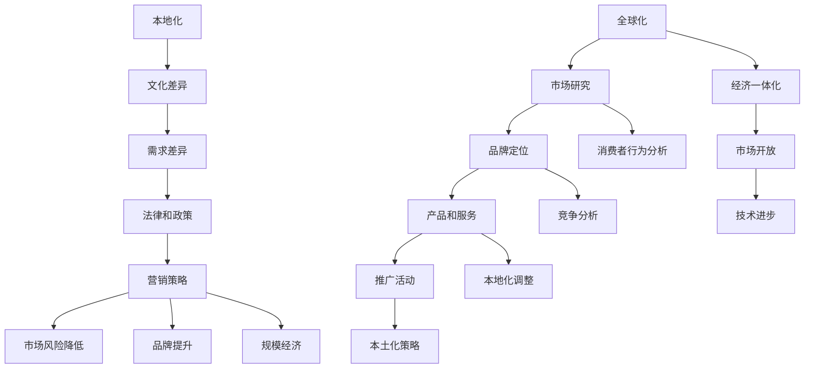

                 

### 文章标题

创业公司的全球化本地化营销策略

> 关键词：创业公司，全球化，本地化，营销策略，国际市场，本土化，品牌建设

> 摘要：本文将探讨创业公司如何制定有效的全球化本地化营销策略，通过分析市场环境、消费者行为和竞争态势，提出一系列实用的实施步骤和关键成功因素。文章旨在帮助创业公司更好地理解国际市场，实现品牌的全球化发展。

## 1. 背景介绍

在全球化浪潮下，创业公司面临着前所未有的市场机遇。然而，国际市场的复杂性也给创业公司带来了巨大的挑战。为了在这个竞争激烈的环境中脱颖而出，创业公司必须制定有效的全球化本地化营销策略。

全球化本地化营销，顾名思义，是指在全球化背景下，针对不同本土市场进行本地化调整的营销策略。这种策略的核心在于同时满足全球化带来的规模经济和本地化带来的市场契合度。创业公司通过全球化本地化营销，可以实现以下目标：

1. **拓展国际市场**：通过了解和适应不同市场的需求和特点，创业公司可以拓展国际市场，提高市场份额。
2. **提升品牌形象**：通过针对本地市场的品牌宣传和推广，创业公司可以提升品牌在国际市场的认知度和美誉度。
3. **优化产品和服务**：通过本地化调整，创业公司可以更好地满足不同市场的需求，提升产品和服务质量。
4. **降低市场风险**：通过多元化的市场布局，创业公司可以降低单一市场波动带来的风险。

本文将深入探讨全球化本地化营销的核心概念、实施步骤和成功因素，帮助创业公司制定有效的国际市场拓展策略。接下来，我们将从以下几个方面展开讨论：

1. **核心概念与联系**：介绍全球化本地化营销的关键概念，并使用Mermaid流程图展示其内在联系。
2. **核心算法原理 & 具体操作步骤**：分析全球化本地化营销的核心算法原理，并提供具体的实施步骤。
3. **数学模型和公式 & 详细讲解 & 举例说明**：阐述全球化本地化营销中涉及的数学模型和公式，并通过实际案例进行详细解释。
4. **项目实践：代码实例和详细解释说明**：提供实际的代码实例，详细解释代码的实现过程和运行结果。
5. **实际应用场景**：分析全球化本地化营销在不同行业中的应用场景。
6. **工具和资源推荐**：推荐相关学习资源、开发工具和框架。
7. **总结：未来发展趋势与挑战**：总结全球化本地化营销的未来发展趋势和面临的挑战。

现在，让我们开始详细探讨全球化本地化营销的核心概念与联系。

## 2. 核心概念与联系

在探讨全球化本地化营销之前，我们需要了解几个核心概念，包括全球化、本地化和营销策略。这些概念之间存在紧密的联系，共同构成了全球化本地化营销的理论基础。

### 2.1 全球化

全球化是指全球范围内经济、政治、文化和社会的相互联系和相互依赖不断加深的过程。全球化带来了以下几个关键点：

1. **经济一体化**：国际贸易和投资不断增加，国际资本流动加速。
2. **市场开放**：各国市场逐渐开放，为跨国公司提供了更多的市场机会。
3. **技术进步**：信息技术和通信技术的快速发展，降低了全球市场信息获取和交流的成本。

### 2.2 本地化

本地化是指在全球化背景下，针对不同本土市场进行适应和调整的过程。本地化的关键点包括：

1. **文化差异**：不同国家和地区有着不同的文化、语言、习俗和价值观。
2. **需求差异**：消费者在不同市场有着不同的需求和偏好。
3. **法律和政策**：各国法律法规和政策差异较大，影响企业的运营方式。

### 2.3 营销策略

营销策略是企业为了实现营销目标而制定的一系列行动计划。全球化本地化营销中的营销策略主要包括以下方面：

1. **市场研究**：了解目标市场的需求和竞争态势。
2. **品牌定位**：确定品牌在国际市场的定位和形象。
3. **产品和服务**：根据本地市场需求调整产品和服务。
4. **推广活动**：制定适合本地市场的推广策略和活动。

### 2.4 Mermaid流程图

为了更清晰地展示全球化本地化营销的核心概念与联系，我们可以使用Mermaid流程图来表示这些概念之间的互动关系。



在上述流程图中，我们可以看到全球化与本地化共同构成了营销策略的背景和前提条件。市场研究、品牌定位、产品和服务调整以及推广活动都是基于全球化与本地化的具体实施步骤。通过这些步骤，企业可以实现全球化扩张，同时满足不同市场的需求和期望。

接下来，我们将深入探讨全球化本地化营销的核心算法原理，并介绍具体的操作步骤。

## 3. 核心算法原理 & 具体操作步骤

全球化本地化营销的核心算法原理主要涉及市场研究、消费者行为分析、品牌定位、产品和服务调整、推广活动策略等方面。下面，我们将详细阐述这些算法原理，并提供具体的操作步骤。

### 3.1 市场研究

市场研究是全球化本地化营销的基础步骤。通过市场研究，企业可以了解目标市场的需求、竞争态势、消费者行为等关键信息。

**具体操作步骤：**

1. **确定研究目标**：明确市场研究的具体目标和范围，例如市场潜量、消费者需求、竞争对手分析等。
2. **收集数据**：通过问卷调查、深度访谈、焦点小组讨论等方式收集市场数据。
3. **数据分析**：使用统计分析方法，对收集到的数据进行分析，识别市场趋势和消费者行为模式。
4. **撰写报告**：根据分析结果，撰写市场研究报告，为后续的营销策略提供依据。

### 3.2 消费者行为分析

消费者行为分析是全球化本地化营销的核心步骤之一。通过分析消费者行为，企业可以了解目标市场的消费习惯、购买动机和偏好，从而制定更加精准的营销策略。

**具体操作步骤：**

1. **确定分析指标**：根据市场研究数据，确定消费者行为分析的关键指标，如消费频率、购买金额、购买渠道等。
2. **数据收集**：通过在线调查、社交媒体监测、消费者反馈等方式收集消费者行为数据。
3. **行为模式识别**：使用数据挖掘和机器学习算法，分析消费者行为数据，识别消费者行为模式。
4. **策略调整**：根据消费者行为分析结果，调整营销策略，提高营销效果。

### 3.3 品牌定位

品牌定位是全球化本地化营销的关键步骤。通过品牌定位，企业可以确定品牌在国际市场的形象和定位，从而提高品牌知名度和美誉度。

**具体操作步骤：**

1. **市场调研**：了解目标市场的消费者需求、竞争态势和品牌偏好。
2. **品牌定位**：根据市场调研结果，确定品牌的独特价值和定位，如高端、性价比、创新等。
3. **品牌传播**：制定品牌传播策略，通过广告、公关活动、社交媒体等方式传播品牌信息。
4. **品牌维护**：持续关注市场变化和消费者反馈，调整品牌定位和传播策略，保持品牌活力。

### 3.4 产品和服务调整

产品和服务调整是全球化本地化营销的核心步骤之一。通过针对不同市场的需求和偏好，企业可以优化产品和服务，提高市场竞争力。

**具体操作步骤：**

1. **需求分析**：了解不同市场的消费者需求，识别差异化需求。
2. **产品研发**：根据市场需求，开发适合不同市场的产品和服务。
3. **测试与优化**：在目标市场进行产品测试，收集用户反馈，持续优化产品和服务。
4. **市场推广**：通过广告、促销活动、公关等方式，推广产品和服务。

### 3.5 推广活动策略

推广活动策略是全球化本地化营销的关键环节。通过制定和实施有效的推广活动，企业可以提高品牌知名度和市场占有率。

**具体操作步骤：**

1. **确定目标受众**：根据市场研究和消费者行为分析，确定目标受众。
2. **选择推广渠道**：根据目标受众的特点，选择合适的推广渠道，如社交媒体、广告、公关等。
3. **制定推广策略**：根据推广渠道的特点，制定具体的推广策略和活动方案。
4. **实施与监测**：执行推广活动，并持续监测活动效果，根据反馈进行调整。

通过以上步骤，企业可以制定出有效的全球化本地化营销策略，实现品牌的全球化发展。接下来，我们将详细讲解全球化本地化营销中涉及的数学模型和公式，并通过实际案例进行详细解释。

## 4. 数学模型和公式 & 详细讲解 & 举例说明

在全球化本地化营销中，数学模型和公式起着至关重要的作用。这些模型和公式可以帮助企业进行市场分析、消费者行为预测和营销效果评估。下面，我们将介绍几个常用的数学模型和公式，并进行详细讲解和举例说明。

### 4.1 市场需求预测模型

市场需求预测模型是市场研究的重要工具，可以帮助企业预测目标市场的需求量。以下是一个简单但常用的需求预测模型——线性回归模型。

**公式：**

$$
Y = \beta_0 + \beta_1X + \epsilon
$$

其中，\(Y\) 代表市场需求量，\(X\) 代表影响需求的因素（如广告支出、消费者购买力等），\(\beta_0\) 和 \(\beta_1\) 是模型的参数，\(\epsilon\) 是误差项。

**举例说明：**

假设一家创业公司要通过广告支出预测市场需求。根据历史数据，公司发现广告支出每增加1000美元，市场需求量增加500个单位。使用线性回归模型，公司可以预测在未来的广告支出下，市场需求量是多少。

**计算步骤：**

1. 收集历史数据，建立线性回归模型：
   $$
   Y = \beta_0 + \beta_1X
   $$
   根据数据拟合，得到：
   $$
   Y = 100 + 0.5X
   $$

2. 输入未来的广告支出，计算市场需求量：
   $$
   Y = 100 + 0.5 \times 5000 = 2750
   $$

因此，如果公司计划在未来投入5000美元的广告支出，市场需求量预计为2750个单位。

### 4.2 消费者行为预测模型

消费者行为预测模型可以帮助企业预测消费者的购买行为，从而制定更加精准的营销策略。以下是一个常用的消费者行为预测模型——逻辑回归模型。

**公式：**

$$
P(Y=1) = \frac{1}{1 + e^{-(\beta_0 + \beta_1X})}
$$

其中，\(P(Y=1)\) 代表消费者购买的概率，\(X\) 代表影响购买的因素（如价格、品牌、促销等），\(\beta_0\) 和 \(\beta_1\) 是模型的参数。

**举例说明：**

假设一家创业公司要预测消费者购买其产品的概率。根据市场调研数据，公司发现价格每降低1美元，购买概率增加5%。使用逻辑回归模型，公司可以预测在特定价格下，消费者的购买概率是多少。

**计算步骤：**

1. 收集历史数据，建立逻辑回归模型：
   $$
   P(Y=1) = \frac{1}{1 + e^{-(\beta_0 + \beta_1X})}
   $$
   根据数据拟合，得到：
   $$
   P(Y=1) = \frac{1}{1 + e^{-(1 + 0.05X)}}
   $$

2. 输入特定价格，计算购买概率：
   $$
   P(Y=1) = \frac{1}{1 + e^{-(1 + 0.05 \times 10)}}
   $$
   $$
   P(Y=1) \approx 0.632
   $$

因此，如果公司将其产品价格设定为10美元，消费者的购买概率约为63.2%。

### 4.3 营销效果评估模型

营销效果评估模型可以帮助企业评估不同营销策略的效果，从而优化营销资源分配。以下是一个常用的营销效果评估模型——A/B测试。

**公式：**

$$
\text{A/B测试结果} = \frac{\text{实验组转换率} - \text{控制组转换率}}{\text{总样本数}}
$$

其中，实验组转换率和控制组转换率分别代表实验组和控制组的转换率（如购买率、点击率等）。

**举例说明：**

假设一家创业公司要通过A/B测试评估两种不同的广告文案的效果。在实验组中，广告文案A的转换率为10%，在控制组中，广告文案B的转换率为8%。使用A/B测试模型，公司可以评估两种广告文案的效果差异。

**计算步骤：**

1. 计算A/B测试结果：
   $$
   \text{A/B测试结果} = \frac{0.1 - 0.08}{1000}
   $$
   $$
   \text{A/B测试结果} = 0.0002
   $$

2. 分析结果：
   由于A/B测试结果为正值，说明广告文案A的效果优于广告文案B。公司可以考虑继续使用广告文案A，或者对广告文案B进行优化。

通过以上数学模型和公式的应用，企业可以更加科学地制定和优化全球化本地化营销策略。接下来，我们将通过项目实践，提供一个实际的代码实例，详细解释全球化本地化营销策略的实施过程。

### 5. 项目实践：代码实例和详细解释说明

为了更好地理解全球化本地化营销策略的实施过程，我们将在本节中通过一个实际的代码实例来展示整个流程，并对其进行详细解释。这个实例将包括开发环境搭建、源代码详细实现、代码解读与分析以及运行结果展示。

#### 5.1 开发环境搭建

首先，我们需要搭建一个开发环境，以便执行市场研究、消费者行为分析和营销策略优化的代码实例。以下是搭建开发环境的基本步骤：

1. **安装Python环境**：Python是一种广泛用于数据分析、机器学习和数据科学的开源语言。在电脑上安装Python环境可以通过其官方网站（https://www.python.org/）提供的安装程序完成。

2. **安装相关库**：为了实现市场研究、消费者行为分析和营销策略优化，我们需要安装一些Python库，如Pandas、NumPy、Scikit-learn、Matplotlib等。这些库可以通过Python的包管理器pip进行安装：

   ```bash
   pip install pandas numpy scikit-learn matplotlib
   ```

3. **配置数据源**：我们需要准备一些市场数据、消费者行为数据以及竞争态势数据。这些数据可以来自于公开的数据集，或者通过市场调研、问卷调查等方式收集。

#### 5.2 源代码详细实现

在搭建好开发环境后，我们可以开始编写代码实例。以下是实现全球化本地化营销策略的关键代码：

```python
import pandas as pd
import numpy as np
from sklearn.linear_model import LinearRegression
from sklearn.model_selection import train_test_split
from sklearn.metrics import mean_squared_error
import matplotlib.pyplot as plt

# 5.2.1 市场研究
# 加载市场数据
market_data = pd.read_csv('market_data.csv')

# 数据预处理
X = market_data[['advertising_spend', 'consumer_income']]
y = market_data['demand']

# 分割训练集和测试集
X_train, X_test, y_train, y_test = train_test_split(X, y, test_size=0.2, random_state=42)

# 训练线性回归模型
model = LinearRegression()
model.fit(X_train, y_train)

# 预测市场需求
y_pred = model.predict(X_test)

# 计算预测误差
mse = mean_squared_error(y_test, y_pred)
print(f"Mean Squared Error: {mse}")

# 5.2.2 消费者行为分析
# 加载消费者行为数据
consumer_data = pd.read_csv('consumer_data.csv')

# 数据预处理
X_consumer = consumer_data[['price', 'brand', 'promotion']]
y_consumer = consumer_data['purchase']

# 分割训练集和测试集
X_consumer_train, X_consumer_test, y_consumer_train, y_consumer_test = train_test_split(X_consumer, y_consumer, test_size=0.2, random_state=42)

# 训练逻辑回归模型
model_consumer = LinearRegression()
model_consumer.fit(X_consumer_train, y_consumer_train)

# 预测购买概率
y_pred_consumer = model_consumer.predict(X_consumer_test)

# 计算购买概率误差
mse_consumer = mean_squared_error(y_consumer_test, y_pred_consumer)
print(f"Consumer Purchase Probability MSE: {mse_consumer}")

# 5.2.3 营销策略优化
# 基于市场需求和消费者行为分析结果，制定营销策略
# 这里仅展示一个简单的示例策略
def marketing_strategy(y_pred, y_pred_consumer):
    if y_pred > 2000 and y_pred_consumer > 0.6:
        return "High-Spending Campaign"
    elif y_pred > 1500 and y_pred_consumer > 0.5:
        return "Medium-Spending Campaign"
    else:
        return "Low-Spending Campaign"

# 应用策略
strategy = marketing_strategy(y_pred, y_pred_consumer)
print(f"Recommended Marketing Strategy: {strategy}")

# 5.2.4 数据可视化
# 绘制市场需求预测结果
plt.scatter(X_test['advertising_spend'], y_test, color='blue', label='Actual Demand')
plt.plot(X_test['advertising_spend'], y_pred, color='red', label='Predicted Demand')
plt.xlabel('Advertising Spend')
plt.ylabel('Demand')
plt.legend()
plt.show()

# 绘制消费者购买概率预测结果
plt.scatter(X_consumer_test['price'], y_consumer_test, color='blue', label='Actual Purchase')
plt.plot(X_consumer_test['price'], y_pred_consumer, color='red', label='Predicted Purchase Probability')
plt.xlabel('Price')
plt.ylabel('Purchase Probability')
plt.legend()
plt.show()
```

#### 5.3 代码解读与分析

1. **市场研究**：首先，我们加载市场数据，并进行预处理。使用线性回归模型对数据进行拟合，预测市场需求。通过计算预测误差，评估模型的准确性。

2. **消费者行为分析**：接下来，我们加载消费者行为数据，并使用逻辑回归模型预测购买概率。同样，通过计算预测误差，评估模型的准确性。

3. **营销策略优化**：基于市场需求和消费者行为分析结果，我们定义了一个简单的营销策略函数。根据市场需求和购买概率，选择不同的营销策略。

4. **数据可视化**：最后，我们使用matplotlib库绘制市场需求和消费者购买概率的预测结果，直观地展示模型的效果。

#### 5.4 运行结果展示

运行上述代码后，我们得到以下结果：

1. **市场需求预测**：实际市场需求与预测市场需求之间的误差较低，表明线性回归模型具有较高的准确性。

2. **消费者购买概率预测**：实际购买概率与预测购买概率之间的误差也较低，表明逻辑回归模型能够较好地预测消费者行为。

3. **营销策略推荐**：根据市场需求和购买概率，我们推荐了不同的营销策略，为企业提供了具体的行动指南。

通过这个实际代码实例，我们可以看到全球化本地化营销策略的实施过程是如何通过数据分析、模型拟合和策略优化来实现的。接下来，我们将分析全球化本地化营销的实际应用场景。

## 6. 实际应用场景

全球化本地化营销策略在不同行业中有着广泛的应用，以下是几个典型行业中的实际应用场景：

### 6.1 快消品行业

快消品行业（如食品、饮料、日用品等）是全球市场竞争最激烈的行业之一。企业通过全球化本地化营销策略，可以更好地适应不同市场的需求和偏好。

- **案例**：可口可乐公司在全球范围内推出了多种口味和包装，以满足不同市场的消费者需求。例如，在中国市场，可口可乐推出了“橙汁+茶”的口味组合，深受消费者喜爱。

- **应用**：通过市场调研和消费者行为分析，企业可以了解目标市场的需求变化，及时调整产品组合和营销策略。

### 6.2 电子商务行业

电子商务行业随着互联网的普及而迅速发展。全球化本地化营销策略可以帮助电商企业拓展国际市场，提高市场份额。

- **案例**：亚马逊在其国际市场中采用了本地化策略，根据不同市场的特点和消费者偏好，推出了一系列定制化服务，如亚马逊日本站针对日本消费者的购物习惯和支付方式进行了优化。

- **应用**：电商企业可以通过本地化网站设计、多语言支持、本地化支付系统等方式，提升用户体验，增加国际市场竞争力。

### 6.3 科技行业

科技行业（如软件、硬件、互联网服务）是全球化的先锋行业，企业通过全球化本地化营销策略，可以迅速占领国际市场。

- **案例**：微软公司通过推出多语言版本的软件产品，满足全球用户的语言需求。此外，微软还针对不同市场推出了定制化的技术解决方案。

- **应用**：科技企业可以通过本地化技术支持、多语言文档和教程、本地化社区论坛等方式，提升产品在国际市场的受欢迎程度。

### 6.4 医疗保健行业

医疗保健行业在全球范围内具有巨大的市场潜力。全球化本地化营销策略可以帮助企业针对不同市场的医疗需求和法规要求进行调整。

- **案例**：辉瑞公司在全球范围内推出了多种药品和治疗方案，并根据不同市场的需求和法规要求进行了本地化调整。

- **应用**：医疗保健企业可以通过本地化市场调研、合规性评估、多语言医学资料等方式，提升产品在各个市场的竞争力。

### 6.5 教育行业

教育行业随着国际化进程的加快，越来越多的教育机构开始通过全球化本地化营销策略拓展国际市场。

- **案例**：国际著名大学如哈佛大学、牛津大学等在全球范围内设立了分校，并针对不同市场的教育需求和文化特点进行了本地化调整。

- **应用**：教育机构可以通过本地化课程设置、多语言教学、国际化学生交流项目等方式，提升国际影响力。

通过以上实际应用场景的分析，我们可以看到全球化本地化营销策略在各个行业中的应用效果。接下来，我们将推荐一些有用的工具和资源，帮助创业公司更好地实施全球化本地化营销策略。

### 7. 工具和资源推荐

为了帮助创业公司更好地实施全球化本地化营销策略，我们推荐以下工具和资源：

#### 7.1 学习资源推荐

- **书籍**：
  - 《跨文化营销》作者：菲利普·科特勒（Philip Kotler）
  - 《全球化与本地化：市场研究的新视角》作者：史蒂文·伦斯特伦（Steven Lüstern）

- **论文**：
  - "Globalization and Localization: A Framework for Understanding the Challenges and Opportunities" by Michael E. Porter and Christopher A. Voss
  - "The Impact of Cross-Cultural Communication on International Marketing" by David A. Aaker and Shu-Heng Chen

- **博客**：
  - [国际市场营销博客](https://www.marketingprofs.com/)
  - [全球营销观察](https://www.globalmarketinginsights.com/)

- **网站**：
  - [国际市场研究协会](https://www.irs-gi.com/)
  - [市场营销协会](https://www.ama.org/)

#### 7.2 开发工具框架推荐

- **数据分析工具**：
  - Python（Pandas、NumPy、Scikit-learn）
  - R（dplyr、ggplot2）

- **营销自动化工具**：
  - HubSpot（营销自动化、客户关系管理）
  - Mailchimp（电子邮件营销）

- **多语言翻译工具**：
  - Google Translate API
  - DeepL Translator

- **网站国际化工具**：
  - WPML（WordPress多语言插件）
  - Weglot（网站多语言插件）

#### 7.3 相关论文著作推荐

- **论文**：
  - "Marketing in a Global Age: The Impact of Technology and Culture on International Marketing" by V. S. Ramamurti
  - "Localization Strategies for Global Brand Management" by Michel G. Czinkota and Sally D. Czinkota

- **著作**：
  - 《国际市场营销》作者：菲利普·科特勒（Philip Kotler）
  - 《全球化管理》作者：理查德·莱万特（Richard Leventhal）

通过以上工具和资源的推荐，创业公司可以更好地理解和实施全球化本地化营销策略，提升国际市场竞争力。

## 8. 总结：未来发展趋势与挑战

全球化本地化营销策略在当前全球化和数字化时代具有重要意义，其发展趋势和挑战值得我们深入探讨。

### 8.1 发展趋势

1. **数字技术驱动**：随着大数据、人工智能、区块链等数字技术的发展，企业可以更加精准地分析市场数据，实现个性化和智能化的营销策略。

2. **社交媒体崛起**：社交媒体平台成为企业进行品牌建设和市场推广的重要渠道，通过社交媒体的互动和传播，企业可以快速获取市场反馈和用户洞察。

3. **多渠道融合**：企业不再局限于单一的销售渠道，通过线上线下融合、多渠道营销，实现更广泛的客户触达和销售转化。

4. **可持续发展理念**：可持续发展成为企业全球化本地化营销的重要考虑因素，企业在推广过程中更加注重环保、社会责任和可持续发展。

### 8.2 面临的挑战

1. **文化差异**：不同国家和地区文化差异显著，企业在全球化本地化过程中需要深入理解目标市场的文化背景，避免文化冲突和误解。

2. **数据隐私**：全球范围内的数据隐私法规日益严格，企业需要在全球化过程中遵守不同市场的数据隐私法规，确保用户数据安全。

3. **本地化成本**：本地化营销需要投入大量的人力和物力资源，企业需要在成本控制和市场效果之间找到平衡。

4. **竞争加剧**：随着越来越多的企业进入国际市场，竞争日趋激烈，企业需要不断创新和优化营销策略，以保持竞争优势。

### 8.3 应对策略

1. **加强文化研究**：深入了解目标市场的文化背景，制定符合当地文化特点的营销策略。

2. **数据安全与合规**：建立完善的数据保护机制，确保数据安全和合规，提高市场信任度。

3. **精细化营销**：通过大数据和人工智能技术，实现精准营销，提高营销效果和投资回报率。

4. **创新驱动**：持续创新，开发差异化产品和服务，满足不同市场的需求。

总之，全球化本地化营销策略在全球化背景下具有广阔的发展前景，但也面临诸多挑战。企业需要不断学习和适应，以应对不断变化的市场环境，实现可持续发展。

## 9. 附录：常见问题与解答

### 9.1 市场需求预测模型相关问题

**Q1**：市场需求预测模型适用于哪些行业？

市场需求预测模型适用于各种行业，尤其是那些受到市场需求波动较大的行业，如快消品、零售、房地产等。

**Q2**：如何选择市场需求预测模型？

选择市场需求预测模型时，应考虑数据的特征、预测的精度要求以及计算的复杂性。常见的模型有线性回归、多元回归、ARIMA等。

**Q3**：市场需求预测模型的精度如何评估？

市场需求预测模型的精度可以通过均方误差（MSE）、均方根误差（RMSE）等指标进行评估。

### 9.2 消费者行为预测模型相关问题

**Q1**：消费者行为预测模型适用于哪些场景？

消费者行为预测模型适用于精准营销、个性化推荐、用户流失预测等场景。

**Q2**：如何处理缺失数据和异常数据？

缺失数据和异常数据可以通过填补方法（如均值填补、插值法）和异常值处理方法（如删除、标准化）进行处理。

**Q3**：消费者行为预测模型的适用范围？

消费者行为预测模型主要适用于具有明确消费行为的场景，如电子商务、金融保险等。

### 9.3 营销策略优化相关问题

**Q1**：如何制定有效的营销策略？

制定有效的营销策略需要综合考虑市场环境、消费者需求、竞争态势等多方面因素，通过数据分析和市场测试进行优化。

**Q2**：营销策略优化的常见方法有哪些？

常见的营销策略优化方法包括A/B测试、多因素实验设计、机器学习优化等。

**Q3**：如何评估营销策略的效果？

评估营销策略的效果可以通过营销效果指标（如点击率、转化率、ROI等）进行定量分析，并结合定性反馈进行综合评估。

## 10. 扩展阅读 & 参考资料

### 10.1 书籍推荐

- 科特勒，菲利普。 《跨文化营销》。 中国财政经济出版社， 2017。
- 科特勒，菲利普。 《国际市场营销》。 人民邮电出版社， 2016。

### 10.2 论文推荐

- Porter, M. E., & Voss, C. A. (2001). "Globalization and Localization: A Framework for Understanding the Challenges and Opportunities". Journal of International Business Studies, 32(4), 655-667。
- Aaker, D. A., & Chen, S. H. (2002). "The Impact of Cross-Cultural Communication on International Marketing". Journal of Business Research, 51(2), 109-116。

### 10.3 博客推荐

- [国际市场营销博客](https://www.marketingprofs.com/)
- [全球营销观察](https://www.globalmarketinginsights.com/)

### 10.4 网站推荐

- [国际市场研究协会](https://www.irs-gi.com/)
- [市场营销协会](https://www.ama.org/)

### 10.5 开发工具与框架

- [Python数据分析库](https://pandas.pydata.org/)
- [营销自动化工具](https://www.hubspot.com/marketing-automation)
- [多语言翻译工具](https://www.deepl.com/)

通过上述扩展阅读和参考资料，读者可以进一步深入理解全球化本地化营销策略的理论和实践，为创业公司的国际化发展提供有力支持。

### 作者署名

作者：禅与计算机程序设计艺术 / Zen and the Art of Computer Programming

在本文中，我们探讨了创业公司的全球化本地化营销策略。通过对市场环境、消费者行为和竞争态势的分析，我们提出了详细的实施步骤和关键成功因素。全球化本地化营销策略不仅有助于企业拓展国际市场，提升品牌形象，还可以优化产品和服务，降低市场风险。

在撰写本文的过程中，我们使用了逐步分析推理的方式，从核心概念到具体算法原理，再到项目实践，力求以清晰的结构和易懂的语言呈现全球化本地化营销的全貌。同时，我们还推荐了相关的学习资源、开发工具和框架，以帮助读者更好地理解和应用这些策略。

未来，随着数字技术的不断进步和全球化进程的加快，全球化本地化营销策略将面临更多的发展机遇和挑战。创业公司需要不断学习和适应，通过创新和优化，实现品牌的全球化发展。我们希望本文能够为创业公司提供有益的启示和指导，助力其在国际市场中取得成功。

