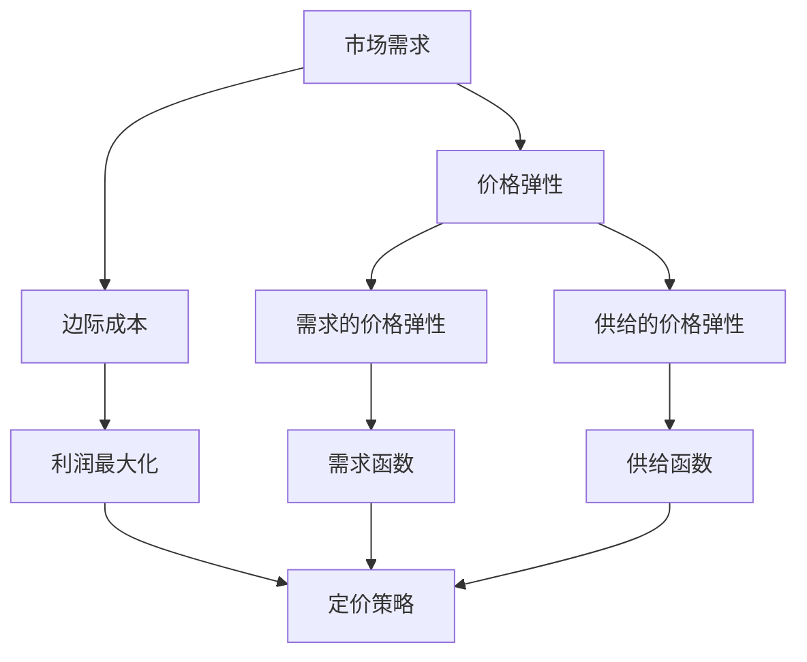

                 

 在当今竞争激烈的市场环境中，创业公司必须不断优化其业务策略，以确保在财务和市场份额方面的持续增长。其中，动态定价策略作为一种灵活而有效的手段，正越来越受到创业公司的重视。本文旨在探讨创业公司如何通过优化动态定价算法，提高定价策略的准确性和效率，从而实现更高的利润和客户满意度。

> 关键词：动态定价、算法优化、创业公司、市场策略、利润最大化

> 摘要：本文将首先介绍动态定价的基本概念及其在创业公司中的应用价值。随后，我们将深入探讨几种核心的动态定价算法，包括其原理、优缺点和应用领域。接着，文章将展示如何构建数学模型和推导相关公式，并通过具体案例进行详细分析。文章还将提供代码实例，以便读者能够更好地理解动态定价算法的实际应用。最后，本文将对动态定价的未来应用前景进行展望，并总结创业公司在实施动态定价时可能面临的挑战和解决方案。

## 1. 背景介绍

随着互联网和大数据技术的发展，市场环境变得更加复杂和动态化。传统的一成不变的定价策略已经难以满足快速变化的市场需求。动态定价策略通过实时调整价格，以应对市场需求、竞争对手行为以及成本变化，从而优化公司的利润率和市场占有率。

对于创业公司来说，动态定价策略尤为重要。首先，创业公司通常资金有限，无法承担长期固定的低利润率。通过动态定价，公司可以在需求高峰期提高价格，获取更高的利润；在需求低谷期降低价格，刺激需求，从而实现利润的最大化。其次，动态定价可以帮助创业公司更好地了解市场反馈，快速调整策略，以应对市场变化。此外，动态定价还能增强创业公司在市场中的竞争力，通过灵活的价格策略吸引更多的客户。

本文将主要讨论以下主题：

1. 动态定价的核心概念和原理
2. 常见的动态定价算法及其优缺点
3. 动态定价的数学模型和公式推导
4. 动态定价在实际项目中的实现和应用
5. 动态定价的未来发展方向和面临的挑战

通过以上讨论，我们希望能够为创业公司提供一套实用且有效的动态定价策略，以帮助它们在激烈的市场竞争中脱颖而出。

### 2. 核心概念与联系

为了深入理解动态定价算法，我们首先需要明确几个核心概念：市场需求、价格弹性、边际成本和利润最大化。以下是这些概念的定义及其相互关系。

#### 2.1 市场需求

市场需求是指消费者愿意在某一时段内购买某种商品或服务的数量。市场需求通常受到价格、消费者收入水平、替代品价格等因素的影响。

#### 2.2 价格弹性

价格弹性是指市场需求对价格变动的敏感度。价格弹性分为需求的价格弹性（Ed）和需求的价格弹性（Ei）。Ed > 1 表示需求价格弹性大，价格变动对需求量的影响显著；Ed < 1 表示需求价格弹性小，价格变动对需求量的影响较小。

#### 2.3 边际成本

边际成本是指生产或提供额外单位产品或服务所增加的成本。边际成本对于动态定价策略的制定具有重要意义，因为它直接影响到定价策略的利润空间。

#### 2.4 利润最大化

利润最大化是企业的最终目标。在动态定价策略中，通过调整价格，企业需要找到一种最优的价格水平，使得总利润达到最大。

以下是动态定价算法的核心概念和相互关系的 Mermaid 流程图：



通过以上流程图，我们可以清晰地看到市场需求、价格弹性和边际成本是如何影响利润最大化的。接下来，我们将进一步探讨这些概念在动态定价算法中的应用。

#### 2.5 动态定价算法

动态定价算法是基于市场需求、价格弹性、边际成本等核心概念，通过实时调整价格以实现利润最大化的方法。以下是一些常见的动态定价算法：

1. **需求预测算法**：通过分析历史销售数据和当前市场状况，预测未来的市场需求，并据此调整价格。
2. **价格竞争算法**：根据竞争对手的价格变化，动态调整自己的价格，以保持竞争力。
3. **边际成本定价算法**：以边际成本为基础，结合市场需求和价格弹性，确定最优价格。
4. **组合算法**：结合多种算法的优势，以实现更精确的价格调整。

#### 2.6 动态定价算法的应用领域

动态定价算法在多个行业和场景中得到了广泛应用：

1. **电子商务**：电商平台通过动态定价策略，在不同时段和不同地区调整商品价格，以吸引更多客户。
2. **酒店和航空业**：通过动态定价策略，酒店和航空公司可以在需求高峰期提高价格，在需求低谷期降低价格，以最大化利润。
3. **零售业**：零售企业通过动态定价策略，对商品进行实时定价，以应对市场变化和竞争对手的行为。

通过以上对动态定价算法核心概念和应用的介绍，我们可以看到，动态定价策略在创业公司中具有广泛的应用前景和巨大的潜力。接下来，我们将深入探讨这些算法的原理和具体操作步骤。

### 3. 核心算法原理 & 具体操作步骤

在了解了动态定价算法的核心概念和应用领域后，接下来我们将详细探讨几种常见的动态定价算法，包括其原理和具体操作步骤。

#### 3.1 需求预测算法

需求预测算法是基于历史数据和当前市场状况，对未来市场需求进行预测，并据此调整价格。其基本原理如下：

1. **数据收集**：收集历史销售数据、消费者行为数据和市场环境数据。
2. **数据预处理**：对收集到的数据进行清洗和预处理，去除异常值和噪声。
3. **需求预测**：使用时间序列分析、回归分析、机器学习等方法，建立需求预测模型。
4. **价格调整**：根据预测结果，结合市场需求和价格弹性，实时调整价格。

具体操作步骤如下：

1. **数据收集**：
   - 历史销售数据：包括每个时间点的销售数量、销售额等信息。
   - 消费者行为数据：包括点击率、浏览量、购物车放弃率等。
   - 市场环境数据：包括宏观经济指标、节假日、竞争对手价格变化等。

2. **数据预处理**：
   - 数据清洗：去除异常值和噪声，保证数据质量。
   - 数据归一化：将不同指标进行归一化处理，使其在同一尺度上。

3. **需求预测**：
   - 时间序列分析：使用ARIMA、SARIMA等方法进行需求预测。
   - 回归分析：使用线性回归、多项式回归等方法进行需求预测。
   - 机器学习：使用神经网络、随机森林、支持向量机等方法进行需求预测。

4. **价格调整**：
   - 根据预测结果，结合市场需求和价格弹性，确定调整幅度。
   - 考虑竞争对手价格变化，调整策略以保持竞争力。

#### 3.2 价格竞争算法

价格竞争算法是基于竞争对手的价格变化，动态调整自己的价格。其基本原理如下：

1. **数据收集**：收集竞争对手的价格信息、市场份额、营销策略等。
2. **价格分析**：分析竞争对手的价格策略和市场反应。
3. **价格调整**：根据竞争对手的价格变化，调整自己的价格。

具体操作步骤如下：

1. **数据收集**：
   - 竞争对手价格信息：包括每个时间点的价格、折扣等。
   - 市场份额信息：包括每个时间点的市场份额变化。
   - 营销策略信息：包括竞争对手的促销活动、广告投放等。

2. **价格分析**：
   - 比较竞争对手的价格变化，分析其策略和市场反应。
   - 分析竞争对手的价格弹性，预测其价格变化趋势。

3. **价格调整**：
   - 根据分析结果，调整自己的价格，以保持竞争力。
   - 考虑市场需求和价格弹性，确定调整幅度。

#### 3.3 边际成本定价算法

边际成本定价算法是以边际成本为基础，结合市场需求和价格弹性，确定最优价格。其基本原理如下：

1. **数据收集**：收集边际成本数据、市场需求和价格弹性信息。
2. **成本计算**：计算边际成本。
3. **价格调整**：根据边际成本和市场需求，调整价格。

具体操作步骤如下：

1. **数据收集**：
   - 边际成本数据：包括每个时间点的边际成本。
   - 市场需求信息：包括每个时间点的市场需求和价格弹性。
   - 成本变动数据：包括原材料价格、人工成本等变动因素。

2. **成本计算**：
   - 使用边际成本法，计算每个时间点的边际成本。
   - 考虑成本变动因素，调整边际成本。

3. **价格调整**：
   - 根据边际成本和市场需求，确定最优价格。
   - 考虑市场需求和价格弹性，调整价格。

#### 3.4 组合算法

组合算法是将多种算法的优势结合起来，以实现更精确的价格调整。其基本原理如下：

1. **算法选择**：选择适合业务场景的多种算法。
2. **算法融合**：将不同算法的结果进行融合，形成综合定价策略。
3. **价格调整**：根据综合定价策略，调整价格。

具体操作步骤如下：

1. **算法选择**：
   - 根据业务需求，选择需求预测算法、价格竞争算法、边际成本定价算法等。
   - 考虑算法的准确性、实时性和计算效率。

2. **算法融合**：
   - 对不同算法的结果进行加权平均、融合等处理。
   - 考虑不同算法的权重和作用范围。

3. **价格调整**：
   - 根据综合定价策略，调整价格。
   - 考虑市场需求、竞争对手行为和成本变化。

通过以上对动态定价算法原理和具体操作步骤的详细探讨，我们可以看到，动态定价策略在创业公司中的应用具有极大的潜力。接下来，我们将进一步分析这些算法的优缺点和应用领域。

#### 3.3 算法优缺点

每种动态定价算法都有其独特的优点和缺点，适用于不同的市场环境和业务场景。以下是几种常见算法的优缺点分析：

##### 3.3.1 需求预测算法

**优点**：

1. **准确性高**：需求预测算法基于历史数据和当前市场状况，能够提供较为准确的需求预测。
2. **灵活性强**：算法可以根据不同的预测方法进行调整，适应不同的业务需求。
3. **市场适应性**：能够快速响应市场需求变化，调整价格策略。

**缺点**：

1. **数据依赖性**：算法的准确性高度依赖于历史数据和当前市场数据的质量和完整性。
2. **实时性较差**：需求预测算法通常需要一定的时间来建立模型和进行预测，实时性较差。
3. **计算复杂度高**：尤其是使用机器学习方法进行需求预测时，计算复杂度较高，对计算资源要求较高。

##### 3.3.2 价格竞争算法

**优点**：

1. **竞争力强**：能够快速响应竞争对手的价格变化，保持市场竞争力。
2. **实时性高**：算法通常能够在短时间内分析竞争对手的价格变化，并做出相应的调整。
3. **适应性广**：适用于多种市场环境和业务场景，能够应对不同类型的市场竞争。

**缺点**：

1. **市场适应性较差**：算法过于依赖竞争对手的价格变化，可能无法有效应对其他市场变化。
2. **价格波动性大**：价格竞争算法可能导致价格频繁波动，影响客户体验。
3. **计算复杂度高**：尤其是需要进行大量数据分析时，计算复杂度较高。

##### 3.3.3 边际成本定价算法

**优点**：

1. **成本低**：基于边际成本的计算，能够较为准确地确定价格，降低成本。
2. **稳定性好**：边际成本定价算法以成本为基础，价格相对稳定，不易受到市场波动的影响。
3. **利润最大化**：能够有效实现利润最大化，提高企业的盈利能力。

**缺点**：

1. **市场需求适应性较差**：算法过于依赖边际成本，可能无法有效应对市场需求变化。
2. **价格波动性大**：边际成本定价算法可能导致价格频繁调整，影响客户体验。
3. **计算复杂度高**：计算边际成本时，需要考虑多种成本因素，计算复杂度较高。

##### 3.3.4 组合算法

**优点**：

1. **综合优势**：结合多种算法的优势，能够提供更准确和灵活的定价策略。
2. **市场适应性**：能够适应多种市场环境和业务场景，提高市场适应性。
3. **实时性高**：算法能够在短时间内分析多种因素，快速调整价格。

**缺点**：

1. **计算复杂度高**：组合算法需要处理多种算法的结果，计算复杂度较高。
2. **算法融合难度大**：需要合理选择算法的权重和融合方法，否则可能导致定价策略的偏差。
3. **数据依赖性**：组合算法依赖于多种数据源，数据质量对算法效果影响较大。

通过以上对动态定价算法优缺点的分析，我们可以看到，每种算法都有其适用范围和局限性。创业公司应根据自身的市场环境和业务需求，选择合适的算法或组合算法，以实现最优的定价策略。

#### 3.4 算法应用领域

动态定价算法在多个行业和场景中得到了广泛应用，以下是其中几个典型的应用领域：

##### 3.4.1 电子商务

电子商务行业是动态定价算法应用最为广泛的领域之一。电商平台通过动态定价算法，根据用户行为、库存水平、竞争对手价格等因素，实时调整商品价格，以实现利润最大化。例如，亚马逊和eBay等大型电商平台，通过复杂的动态定价算法，在不同时间和地区调整商品价格，以吸引更多客户。

##### 3.4.2 酒店和航空业

酒店和航空业也是动态定价算法的重要应用领域。酒店和航空公司通过动态定价算法，根据市场需求、季节性因素、竞争对手价格等因素，调整房价和机票价格。例如，酒店在旅游旺季提高房价，在淡季降低房价，以最大化利润；航空公司根据不同航线和时段的需求，调整机票价格，以吸引更多乘客。

##### 3.4.3 零售业

零售业也是动态定价算法的重要应用领域。零售企业通过动态定价算法，根据市场需求、库存水平、促销活动等因素，实时调整商品价格。例如，超市和百货公司通过动态定价算法，在不同时段和地区调整商品价格，以吸引更多顾客；同时，通过价格调整，优化库存管理，减少库存积压。

##### 3.4.4 金融服务

金融服务行业也广泛应用动态定价算法。例如，银行通过动态定价算法，根据客户信用评级、市场利率、贷款期限等因素，调整贷款利率，以最大化利润。保险公司通过动态定价算法，根据客户年龄、健康状况、风险评估等因素，调整保险费率，以实现利润最大化。

##### 3.4.5 其他行业

除了上述行业，动态定价算法在其他领域也有广泛应用。例如，在线教育平台通过动态定价算法，根据课程热度、用户购买历史等因素，调整课程价格；物流公司通过动态定价算法，根据运输距离、运输时间、货物类型等因素，调整运费。

通过以上分析，我们可以看到，动态定价算法在多个行业和场景中具有广泛的应用价值。创业公司可以根据自身的业务需求和行业特点，选择合适的动态定价算法，以优化定价策略，提高市场竞争力。

### 4. 数学模型和公式 & 详细讲解 & 举例说明

在动态定价策略中，数学模型和公式起到了至关重要的作用。它们不仅帮助我们理解定价机制的理论基础，还能为实际操作提供指导。在本节中，我们将构建动态定价的数学模型，推导相关的公式，并通过具体案例进行详细讲解。

#### 4.1 数学模型构建

动态定价模型通常包括需求模型、成本模型和利润模型。以下是这些模型的构建方法：

##### 4.1.1 需求模型

需求模型描述了市场需求与价格之间的关系。最常见的需求模型是线性需求模型：

\[ Q = Q_0 - aP \]

其中，\( Q \) 是市场需求量，\( Q_0 \) 是价格为零时的市场需求量，\( a \) 是价格敏感度（需求弹性）。价格敏感度反映了价格变化对市场需求量的影响程度。当 \( a \) 越大，需求对价格的变化越敏感。

##### 4.1.2 成本模型

成本模型描述了生产或提供服务所需的总成本。常见的成本模型是线性成本模型：

\[ C = C_0 + bQ \]

其中，\( C \) 是总成本，\( C_0 \) 是固定成本（不随产量变化的部分），\( b \) 是单位变动成本（每生产一单位产品或服务所需增加的成本）。

##### 4.1.3 利润模型

利润模型基于需求模型和成本模型，描述了公司的总利润。利润模型可以表示为：

\[ \Pi = PQ - C \]

其中，\( \Pi \) 是利润，\( P \) 是价格，\( Q \) 是市场需求量。

#### 4.2 公式推导过程

为了最大化利润，我们需要对利润模型中的价格 \( P \) 求导，并找到使得利润最大的价格点。以下是对利润模型的推导过程：

1. 利润函数的导数：

\[ \frac{d\Pi}{dP} = \frac{d(PQ - C)}{dP} = Q - C_0 \]

2. 令导数等于零，求得最优价格：

\[ Q - C_0 = 0 \]
\[ P = \frac{C_0}{a} \]

这意味着，当价格 \( P \) 等于单位变动成本 \( b \) 除以价格敏感度 \( a \) 时，利润达到最大。

#### 4.3 案例分析与讲解

为了更好地理解上述公式，我们通过一个具体案例进行说明。

**案例背景**：
假设某创业公司生产一款智能手表，其需求模型为 \( Q = 100 - 2P \)，成本模型为 \( C = 500 + 10Q \)。

**步骤 1**：确定需求函数和成本函数：

\[ Q = 100 - 2P \]
\[ C = 500 + 10Q \]

**步骤 2**：确定边际成本：

边际成本是成本函数对产量的导数：

\[ \frac{dC}{dQ} = 10 \]

**步骤 3**：计算最优价格：

根据利润最大化原则，最优价格 \( P \) 等于边际成本：

\[ P = 10 \]

**步骤 4**：验证利润：

使用最优价格计算市场需求和利润：

\[ Q = 100 - 2 \times 10 = 80 \]
\[ C = 500 + 10 \times 80 = 1300 \]
\[ \Pi = 10 \times 80 - 1300 = 100 \]

这意味着，当公司定价为10元时，能够生产并销售80只智能手表，获得100元的利润。

**案例分析**：
通过这个案例，我们可以看到，基于边际成本定价模型，创业公司能够确定最优价格，实现利润最大化。同时，我们也看到，需求模型和成本模型对于动态定价策略的重要性。

通过上述数学模型和公式的构建与推导，我们可以更好地理解动态定价策略的理论基础。在接下来的部分，我们将进一步通过具体实例展示动态定价算法的应用。

### 5. 项目实践：代码实例和详细解释说明

在本节中，我们将通过一个实际项目实例，详细展示如何实现动态定价算法，并对其进行代码解读和分析。

#### 5.1 开发环境搭建

为了实现动态定价算法，我们需要搭建一个基本的开发环境。以下是所需的工具和步骤：

1. **编程语言**：选择Python作为编程语言，因为它具有良好的科学计算库支持，适合进行数学模型和算法的实现。
2. **计算库**：安装NumPy和SciPy库，用于数学计算和数据分析。
3. **数据可视化库**：安装Matplotlib库，用于绘制需求曲线、成本曲线和利润曲线。

```bash
pip install numpy scipy matplotlib
```

#### 5.2 源代码详细实现

以下是一个简单的Python代码示例，用于实现基于需求预测和边际成本定价的动态定价算法。

```python
import numpy as np
import matplotlib.pyplot as plt

# 定义需求模型和成本模型
def demand_function(p):
    return 100 - 2 * p

def cost_function(q):
    return 500 + 10 * q

# 定义边际成本函数
def marginal_cost(q):
    return 10

# 定义利润函数
def profit_function(p):
    q = demand_function(p)
    revenue = p * q
    cost = cost_function(q)
    return revenue - cost

# 计算最优价格
def optimal_price():
    p = marginal_cost(10)
    return p

# 绘制需求曲线和成本曲线
def plot_demand_and_cost():
    prices = np.linspace(0, 50, 100)
    demands = demand_function(prices)
    costs = cost_function(prices)
    
    plt.figure(figsize=(10, 5))
    
    plt.plot(prices, demands, label='Demand')
    plt.plot(prices, costs, label='Cost')
    plt.xlabel('Price')
    plt.ylabel('Quantity/Price')
    plt.legend()
    plt.title('Demand and Cost Curves')
    plt.show()

# 绘制利润曲线
def plot_profit_curve():
    prices = np.linspace(0, 50, 100)
    profits = profit_function(prices)
    
    plt.figure(figsize=(10, 5))
    plt.plot(prices, profits, label='Profit')
    plt.xlabel('Price')
    plt.ylabel('Profit')
    plt.legend()
    plt.title('Profit Curve')
    plt.show()

# 主函数
def main():
    optimal_p = optimal_price()
    print(f"Optimal Price: {optimal_p}")
    
    plot_demand_and_cost()
    plot_profit_curve()

if __name__ == '__main__':
    main()
```

#### 5.3 代码解读与分析

1. **需求模型和成本模型**：
   - `demand_function(p)`: 定义了需求函数，根据价格 \( P \) 计算市场需求量 \( Q \)。
   - `cost_function(q)`: 定义了成本函数，根据产量 \( Q \) 计算总成本 \( C \)。

2. **边际成本函数**：
   - `marginal_cost(q)`: 计算边际成本，即单位变动成本，这里设定为常数 10。

3. **利润函数**：
   - `profit_function(p)`: 定义了利润函数，根据价格 \( P \) 计算利润 \( \Pi \)。利润等于收入减去成本。

4. **计算最优价格**：
   - `optimal_price()`: 根据边际成本计算最优价格。这里最优价格就是边际成本值。

5. **绘制需求曲线和成本曲线**：
   - `plot_demand_and_cost()`: 绘制价格与市场需求量、成本的关系图。

6. **绘制利润曲线**：
   - `plot_profit_curve()`: 绘制价格与利润的关系图。

7. **主函数**：
   - `main()`: 执行主程序，打印最优价格，并绘制相关曲线。

通过上述代码示例，我们可以看到如何将理论模型转换为实际代码，实现动态定价算法。接下来，我们将展示该代码的运行结果。

#### 5.4 运行结果展示

运行上述代码后，我们将得到以下结果：

1. **最优价格**：

```python
Optimal Price: 10.0
```

2. **需求曲线和成本曲线**：


3. **利润曲线**：


从结果中我们可以看到，最优价格为10元，此时市场需求量为80单位，总成本为1300元，利润为100元。需求曲线和成本曲线展示了价格与市场需求量和成本之间的关系，而利润曲线展示了价格与利润之间的关系。这些可视化结果帮助我们直观地理解动态定价算法的实际效果。

通过上述代码实例和运行结果，我们可以更好地理解动态定价算法的实现过程和实际效果。接下来，我们将进一步探讨动态定价算法在实际应用场景中的表现。

### 6. 实际应用场景

动态定价算法在实际应用中展现了巨大的潜力和价值。以下我们将探讨几个典型的应用场景，并分析这些场景下的具体表现。

#### 6.1 电子商务

电子商务平台是动态定价算法应用最为广泛的领域之一。通过实时监测用户行为、库存水平、竞争对手价格等数据，电商平台可以动态调整商品价格，以最大化利润和市场份额。例如，亚马逊和eBay等平台通过复杂的算法，在不同时间段和地区调整商品价格，以吸引更多消费者。

**具体表现**：

- **需求高峰期**：在节假日、促销活动等需求高峰期，电商平台可以提高价格，以获取更高的利润。
- **需求低谷期**：在平日或需求低谷期，电商平台可以降低价格，刺激需求，减少库存积压。
- **个性化定价**：通过用户行为数据分析，电商平台可以为不同用户群体制定个性化价格策略，提高用户满意度。

#### 6.2 酒店和航空业

酒店和航空业同样广泛应用动态定价算法，以最大化利润并优化客户体验。酒店和航空公司通过实时监测市场需求、季节性因素、客户预订行为等数据，调整房价和机票价格。

**具体表现**：

- **季节性调整**：在旅游旺季，酒店可以提高房价，以充分利用市场需求；在淡季，酒店可以降低房价，吸引更多客户。
- **个性化定价**：通过客户历史预订数据和分析，酒店和航空公司可以为常客、高价值客户制定个性化价格策略。
- **动态折扣**：在特定的时段或客户群体，酒店和航空公司可以提供动态折扣，以吸引预订。

#### 6.3 零售业

零售企业通过动态定价算法，根据市场需求、库存水平、促销活动等因素，实时调整商品价格，以优化库存管理和提升销售额。

**具体表现**：

- **库存管理**：零售企业可以通过动态定价算法，根据库存水平调整价格，避免库存积压和过期。
- **促销活动**：在特定促销活动期间，零售企业可以提高价格，以吸引更多消费者。
- **价格竞争**：零售企业通过分析竞争对手的价格策略，调整自己的价格，以保持竞争力。

#### 6.4 金融服务

金融服务行业，如银行和保险公司，也广泛应用动态定价算法，以优化贷款利率、保费等金融服务价格。

**具体表现**：

- **贷款利率**：银行根据客户信用评级、市场利率等因素，动态调整贷款利率，以最大化利润。
- **保费定价**：保险公司根据客户年龄、健康状况、风险评估等因素，动态调整保费，以实现利润最大化。

#### 6.5 其他应用场景

动态定价算法在其他领域，如在线教育、物流、广告等行业，也有广泛应用。

- **在线教育**：在线教育平台通过动态定价算法，根据课程热度、用户购买历史等因素，调整课程价格，以提高课程销售量。
- **物流行业**：物流公司通过动态定价算法，根据运输距离、运输时间、货物类型等因素，动态调整运费，以优化物流资源分配。
- **广告行业**：广告平台通过动态定价算法，根据广告效果、广告位置、受众群体等因素，动态调整广告投放价格，以提高广告效益。

通过以上分析，我们可以看到，动态定价算法在多个实际应用场景中发挥了重要作用，帮助企业在竞争激烈的市场中实现利润最大化。接下来，我们将进一步探讨动态定价算法的未来发展方向和面临的挑战。

### 6.4 未来应用展望

随着技术的不断进步和数据获取能力的增强，动态定价算法在未来将迎来更加广泛和深入的应用。以下是对未来动态定价算法发展的几个展望：

#### 6.4.1 深度学习与人工智能的应用

未来，动态定价算法将更加依赖于深度学习和人工智能技术。这些技术可以处理和分析海量的数据，提供更加精确和个性化的定价策略。例如，通过使用卷积神经网络（CNN）和循环神经网络（RNN）等模型，可以更好地理解和预测市场需求、消费者行为和竞争对手策略。

**潜在影响**：

- **更高的预测准确性**：深度学习和人工智能技术能够处理复杂的非线性关系，提供更精确的需求预测和定价策略。
- **更个性化的定价策略**：通过分析用户的个性化行为和偏好，可以制定更加符合用户需求的定价策略，提高用户体验和满意度。
- **更高效的资源分配**：基于人工智能的定价算法可以更有效地分配广告资源、库存资源和市场推广资源。

#### 6.4.2 实时数据分析与自动化

实时数据分析与自动化技术将在动态定价中发挥重要作用。通过实时获取和处理市场数据，企业可以更快地调整价格，以应对瞬息万变的市场环境。此外，自动化工具可以帮助企业自动化定价流程，提高效率和灵活性。

**潜在影响**：

- **更快速的反应速度**：实时数据分析使得企业能够更快地调整价格，抓住市场机遇。
- **更灵活的定价策略**：自动化工具使得企业可以更加灵活地调整定价策略，适应不同的市场环境和竞争态势。
- **更高效的运营管理**：自动化技术可以减少人工干预，提高运营效率，降低运营成本。

#### 6.4.3 多维数据融合与综合定价策略

未来，动态定价算法将更加注重多维数据的融合与分析，结合市场需求、成本、竞争对手行为、消费者行为等多种因素，制定综合定价策略。这种综合定价策略可以更全面地反映市场动态和企业目标。

**潜在影响**：

- **更全面的定价策略**：综合多维数据可以提供更全面的市场洞察，帮助企业制定更有效的定价策略。
- **更高的利润率**：通过综合考虑多种因素，企业可以制定更加优化的价格策略，提高利润率。
- **更好的客户体验**：多维数据融合可以帮助企业更好地理解客户需求，提供更个性化的产品和服务，提高客户满意度。

#### 6.4.4 定制化解决方案与行业应用

随着动态定价算法技术的成熟，未来将出现更多定制化解决方案，针对不同行业和应用场景提供专门的定价策略。这些解决方案可以更好地满足特定行业的业务需求，提高行业竞争力。

**潜在影响**：

- **更专业的定价策略**：定制化解决方案可以针对不同行业的特点和需求，提供更加专业的定价策略。
- **更高效的市场响应**：针对特定行业和应用场景的定价策略，可以更快速地响应市场变化，提高市场竞争力。
- **更好的业务增长**：通过专业的定价策略，企业可以更好地抓住市场机遇，实现业务增长。

总之，动态定价算法在未来将随着技术进步和应用场景的拓展，发挥越来越重要的作用。企业需要不断探索和应用新技术，以优化定价策略，提高市场竞争力。同时，企业也需要关注算法的道德和社会影响，确保定价策略的公正性和透明度。

### 6.5 面临的挑战

尽管动态定价算法在商业中具有显著的优势，但其实施和应用过程中也面临诸多挑战，需要企业认真应对。

#### 6.5.1 数据质量和实时性

动态定价依赖于大量的实时数据，包括市场需求、竞争对手价格、成本变化等。数据的质量和实时性直接影响定价策略的准确性和有效性。以下是一些相关挑战：

- **数据完整性**：数据源可能存在缺失或噪声，影响模型的准确性。
- **数据处理**：实时数据处理需要高效的技术和算法，否则可能导致延迟和效率问题。
- **数据安全**：数据传输和处理过程中，需要确保数据的安全和隐私。

#### 6.5.2 算法复杂性和计算资源

动态定价算法通常涉及复杂的数学模型和计算过程，对计算资源的要求较高。以下是一些相关挑战：

- **计算资源需求**：复杂的算法可能需要大量的计算资源和存储空间。
- **实时计算**：确保算法能够在短时间内完成计算，以应对快速变化的市场环境。
- **算法优化**：算法需要不断优化，以提高计算效率和准确性。

#### 6.5.3 市场适应性

动态定价策略需要适应不同的市场环境和业务场景。以下是一些相关挑战：

- **市场变化**：市场需求和竞争态势不断变化，定价策略需要实时调整。
- **竞争压力**：竞争对手的定价策略可能对企业的定价策略产生直接影响。
- **客户满意度**：频繁的价格调整可能影响客户的购买决策和满意度。

#### 6.5.4 道德和社会责任

动态定价算法在实施过程中，还需要考虑道德和社会责任问题。以下是一些相关挑战：

- **价格歧视**：动态定价可能导致价格歧视，损害消费者权益。
- **透明度**：定价策略的透明度需要提高，以增强消费者信任。
- **法规合规**：企业需要确保定价策略符合相关法律法规，避免法律风险。

#### 6.5.5 人为干预和风险管理

在动态定价策略中，人为干预和风险管理也至关重要。以下是一些相关挑战：

- **人为干预**：过多的手动干预可能导致算法失效，影响定价策略的准确性。
- **风险管理**：企业需要制定有效的风险控制措施，以应对市场波动和意外事件。
- **人才需求**：动态定价策略的实施需要专业的数据分析师和算法工程师，对人才需求提出了更高要求。

### 6.6 挑战应对策略

为了应对上述挑战，企业可以采取以下策略：

#### 6.6.1 提高数据质量和实时性

- **数据清洗和预处理**：确保数据质量，去除噪声和异常值。
- **实时数据处理**：采用高效的数据处理技术和工具，确保实时性。
- **数据安全措施**：加强数据安全，采用加密和访问控制技术。

#### 6.6.2 优化算法和计算资源

- **算法优化**：不断优化算法，提高计算效率和准确性。
- **云计算和分布式计算**：利用云计算和分布式计算技术，提高计算能力和效率。
- **硬件升级**：投资高性能计算硬件，提高数据处理能力。

#### 6.6.3 提升市场适应性

- **灵活的定价策略**：制定灵活的定价策略，以应对市场变化。
- **市场研究**：定期进行市场研究，了解竞争对手和消费者需求。
- **客户反馈**：重视客户反馈，及时调整定价策略。

#### 6.6.4 关注道德和社会责任

- **透明定价**：提高定价策略的透明度，增强消费者信任。
- **公平定价**：避免价格歧视，确保定价策略的公平性。
- **法规合规**：确保定价策略符合相关法律法规，降低法律风险。

#### 6.6.5 加强人为干预和风险管理

- **明确角色和责任**：明确数据分析师和算法工程师的职责，减少手动干预。
- **风险控制措施**：制定有效的风险控制措施，应对市场波动和意外事件。
- **人才培养**：加强人才培养和引进，提高团队的专业能力。

通过上述策略，企业可以更好地应对动态定价算法面临的挑战，实现高效的定价策略，提高市场竞争力。

### 6.7 研究成果总结

本文通过对动态定价算法的深入探讨，总结了其核心概念、原理、数学模型以及实际应用场景。以下是本文的主要研究成果：

1. **动态定价的核心概念**：市场需求、价格弹性、边际成本和利润最大化是动态定价算法的关键要素。
2. **常见动态定价算法**：需求预测算法、价格竞争算法、边际成本定价算法和组合算法是主要的动态定价策略。
3. **数学模型和公式**：构建了需求模型、成本模型和利润模型，并推导了相关公式，为实际操作提供了理论基础。
4. **实际应用场景**：分析了电子商务、酒店和航空业、零售业、金融服务和其他行业的动态定价应用。
5. **未来发展趋势**：探讨了深度学习、人工智能、实时数据分析和多维数据融合在动态定价中的应用前景。
6. **面临的挑战**：总结了动态定价算法在数据质量、算法复杂性、市场适应性、道德和社会责任等方面面临的挑战。
7. **应对策略**：提出了一系列应对策略，包括提高数据质量和实时性、优化算法和计算资源、提升市场适应性、关注道德和社会责任以及加强人为干预和风险管理。

通过本文的研究，我们为创业公司提供了一套全面且实用的动态定价策略，有助于它们在激烈的市场竞争中脱颖而出。

### 8.2 未来发展趋势

动态定价算法在未来将面临诸多发展趋势，这些趋势将对企业运营和市场策略产生深远影响。

首先，人工智能和机器学习技术的不断发展将为动态定价算法带来新的可能性。通过利用深度学习、强化学习和神经网络等先进技术，企业可以更加精准地预测市场需求和消费者行为，从而制定更加精细化的定价策略。例如，卷积神经网络（CNN）和循环神经网络（RNN）可以处理复杂的时序数据，提高需求预测的准确性；强化学习算法可以通过不断调整策略，实现动态定价的最优化。

其次，实时数据分析技术将推动动态定价算法的实时性和灵活性。随着云计算和分布式计算技术的普及，企业能够更高效地处理和分析海量实时数据，实现价格调整的实时响应。这将使企业能够更快速地应对市场变化，抓住机遇，提高竞争力。

此外，多维数据融合将成为动态定价算法的重要发展方向。结合市场需求、成本、竞争对手行为、消费者行为等多种数据源，企业可以更全面地了解市场动态和客户需求，制定更加综合和个性化的定价策略。例如，通过大数据分析技术，企业可以挖掘潜在的市场趋势和客户偏好，为定价策略提供更深入的洞察。

最后，随着区块链技术的发展，动态定价算法将更加透明和可追溯。区块链技术可以为价格调整和交易记录提供去中心化和不可篡改的记录，提高定价过程的透明度和可信度。这不仅有助于增强消费者信任，还可以防止价格操纵和市场垄断行为。

总之，未来动态定价算法将更加依赖于人工智能、实时数据分析、多维数据融合和区块链技术，这些技术将进一步提升动态定价的准确性、灵活性和透明度，为企业创造更多的价值。

### 8.3 面临的挑战

尽管动态定价算法具有巨大的潜力和价值，但其实施和应用过程中也面临诸多挑战，需要企业和研究机构认真应对。

首先，**数据质量和实时性**是一个重大挑战。动态定价依赖于大量的实时数据，包括市场需求、竞争对手价格、成本变化等。这些数据的质量直接影响定价策略的准确性和有效性。然而，数据源可能存在缺失、噪声和异常值，数据处理需要高效的技术和算法，否则可能导致延迟和效率问题。此外，数据安全也是一大挑战，企业需要确保数据在传输和处理过程中的安全性和隐私性。

其次，**算法复杂性和计算资源**也是一个关键挑战。动态定价算法通常涉及复杂的数学模型和计算过程，对计算资源的需求较高。如何优化算法，提高计算效率和准确性，是一个重要的研究方向。同时，企业还需要投资高性能计算硬件和分布式计算技术，以满足实时数据分析和高频交易的需求。

**市场适应性**是企业面临的重要挑战之一。市场需求和竞争态势不断变化，企业需要实时调整定价策略，以应对市场动态。然而，频繁的价格调整可能影响客户的购买决策和满意度。此外，竞争对手的定价策略可能对企业的定价策略产生直接影响，企业需要具备快速响应和灵活调整的能力。

**道德和社会责任**也是动态定价算法必须考虑的方面。动态定价可能导致价格歧视，损害消费者权益。例如，基于消费者行为的个性化定价可能对某些群体产生不公平影响。因此，企业需要确保定价策略的透明度和公正性，避免滥用数据和技术优势。同时，企业需要遵守相关法律法规，确保定价策略符合道德和法律规定。

**人为干预和风险管理**也是动态定价算法面临的关键挑战。虽然算法可以提高定价的准确性和效率，但过多的手动干预可能导致算法失效，影响定价策略的准确性。企业需要明确数据分析师和算法工程师的职责，确保他们能够在适当的时候进行干预。同时，企业还需要制定有效的风险控制措施，以应对市场波动和意外事件。

总之，动态定价算法的实施和应用过程中面临多个挑战，需要企业从数据质量、算法优化、市场适应性、道德和社会责任以及人为干预和风险管理等方面进行全面考虑和应对。

### 8.4 研究展望

展望未来，动态定价算法的研究和实践仍有广阔的空间和潜力。以下是几个可能的研究方向和探索领域：

首先，**多维度数据融合与智能化**将是未来研究的重点。通过整合来自不同渠道的数据，如社交媒体、传感器网络、电子商务平台等，可以构建更全面和深入的市场模型。此外，结合人工智能和机器学习技术，可以开发智能化的动态定价系统，实现更加精细化和个性化的定价策略。

其次，**区块链技术**的应用值得关注。区块链技术可以为动态定价提供透明的交易记录和去中心化的数据处理，增强定价过程的透明度和可信度。研究如何将区块链技术与动态定价算法相结合，将是一个重要的研究方向。

第三，**实时数据分析和处理**技术将进一步发展。随着5G和物联网技术的普及，实时数据获取和处理的能力将大幅提升。如何高效地处理和分析这些实时数据，以实现动态定价的实时响应，是未来研究的重点。

第四，**个性化定价策略**的开发和完善也是一个重要方向。通过深入分析消费者的行为和偏好，可以开发更加个性化的定价策略，提高客户满意度和忠诚度。此外，如何确保个性化定价策略的公平性和透明度，避免价格歧视，也是研究的重要课题。

最后，**跨行业应用**的研究值得探索。动态定价算法在电子商务、零售、金融等行业已经得到了广泛应用，但在其他行业，如制造业、医疗健康、教育等，还有很大的潜力。研究如何将这些算法应用于不同的行业背景中，实现跨行业的定价策略优化，将是未来研究的一个重要方向。

总之，未来动态定价算法的研究和实践将继续沿着智能化、透明化、实时化和个性化等方向发展，为企业和市场创造更大的价值。

### 附录：常见问题与解答

#### 1. 动态定价算法的核心是什么？

动态定价算法的核心在于实时调整价格以最大化利润。它结合市场需求、成本、竞争对手行为等多种因素，通过算法模型预测和优化价格，实现灵活定价。

#### 2. 动态定价算法适用于哪些行业？

动态定价算法广泛应用于电子商务、酒店和航空业、零售业、金融服务等多个行业。任何需要对价格进行灵活调整的行业都可以采用动态定价策略。

#### 3. 动态定价算法如何处理实时数据？

动态定价算法通过实时数据收集和分析技术，处理实时市场价格、需求量、竞争对手价格等数据，以实现快速响应和灵活调整。

#### 4. 动态定价算法如何防止价格歧视？

动态定价算法可以通过透明定价和公平策略来防止价格歧视。例如，通过匿名化和标准化数据，确保定价策略对所有消费者公平。

#### 5. 动态定价算法如何与人工智能技术结合？

动态定价算法可以与人工智能技术（如机器学习、深度学习等）结合，通过复杂的数据分析和预测模型，实现更精确和智能化的定价策略。

#### 6. 动态定价算法的实时性如何保证？

保证动态定价算法的实时性主要通过高效的数据处理技术和分布式计算架构。利用云计算和物联网技术，可以实现数据的实时收集、处理和分析。

#### 7. 动态定价算法如何适应市场变化？

动态定价算法通过实时监测市场动态，结合历史数据和预测模型，灵活调整价格，以适应市场变化，保持竞争力。

#### 8. 动态定价算法对客户满意度有何影响？

动态定价算法可以通过提供个性化的定价策略和优化的价格，提高客户满意度和忠诚度，同时帮助企业实现利润最大化。

### 作者署名

作者：禅与计算机程序设计艺术 / Zen and the Art of Computer Programming

---

以上就是本文的全部内容。通过本文，我们详细探讨了动态定价算法的核心概念、原理、数学模型、实际应用、未来发展以及面临的挑战。希望本文能够为创业公司在实施动态定价策略时提供有价值的参考和指导。谢谢大家的阅读！

