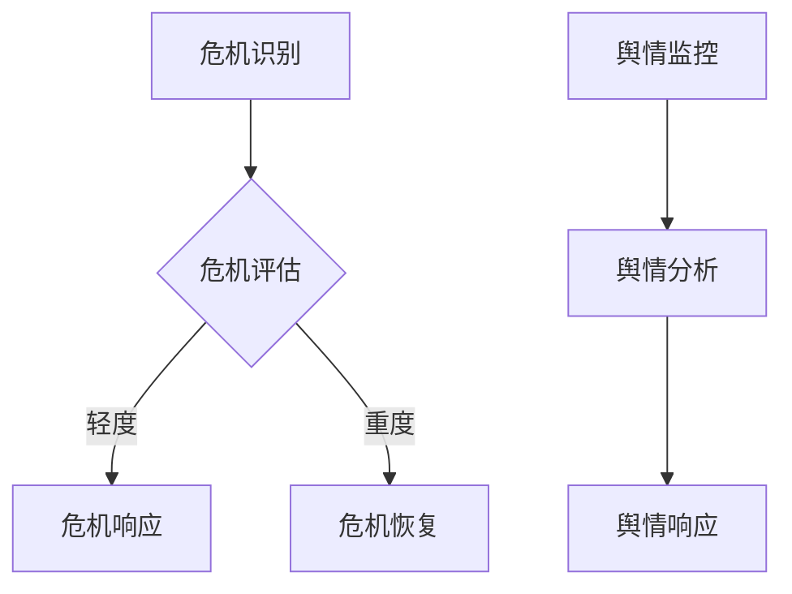

                 

创业公司在当今快速发展的科技行业中扮演着至关重要的角色。然而，这些公司往往面临着各种挑战，特别是在应对突发危机和舆情管理方面。本文将深入探讨创业公司如何有效地处理危机公关和舆情管理，以保护品牌声誉并维持正常运营。

## 关键词
- 创业公司
- 危机公关
- 舆情管理
- 品牌保护
- 社交媒体策略

## 摘要
本文旨在为创业公司提供一套全面的危机公关与舆情管理策略。我们将探讨危机公关的重要性，危机发生的常见原因，以及如何制定和执行有效的危机管理计划。此外，还将分析舆情管理的关键要素，包括社交媒体监控、媒体关系建立和危机响应策略。最后，我们将提供实用的工具和资源，帮助创业公司在危机中保持冷静并迅速作出反应。

## 1. 背景介绍

创业公司在初创阶段往往充满活力和创新精神，但由于资源和经验的限制，它们在面对外部环境变化时显得较为脆弱。在互联网时代，信息传播速度极快，一旦创业公司遭遇危机，负面消息可能会迅速扩散，对公司的声誉和业务造成巨大冲击。

### 1.1 危机公关的定义与重要性

危机公关是指公司在面临突发事件或危机时，采取的一系列沟通和应对措施，以减轻或消除危机对公司形象和业务的影响。危机公关的重要性体现在以下几个方面：

- **品牌保护**：危机公关有助于维护品牌声誉，避免声誉受损，甚至可以转化为品牌危机应对的成功案例。
- **公众信任**：有效的危机公关能够重建公众对公司的信任，恢复市场信心。
- **业务稳定**：通过危机公关，公司可以维持正常运营，减少因危机造成的经济损失。

### 1.2 舆情管理的定义与目的

舆情管理是指通过监控、分析和响应公众舆论，来影响公众对公司的认知和态度。其目的是：

- **了解公众态度**：通过舆情监控，公司可以了解公众对品牌的看法，及时发现问题并采取措施。
- **危机预警**：舆情管理可以帮助公司及时发现潜在危机，提前做好准备。
- **品牌塑造**：通过积极的舆情管理，公司可以塑造良好的品牌形象，提升品牌价值。

## 2. 核心概念与联系

### 2.1 危机公关的核心概念

危机公关的核心概念包括危机识别、危机评估、危机响应和危机恢复。这些概念相互关联，形成一个完整的危机管理流程。

- **危机识别**：通过舆情监控、内部报告等手段，及时发现潜在的危机信号。
- **危机评估**：对危机的影响范围、严重程度和影响程度进行评估，为后续决策提供依据。
- **危机响应**：根据危机类型和评估结果，制定并实施危机应对策略。
- **危机恢复**：在危机得到控制后，采取措施恢复品牌声誉和市场信心。

### 2.2 舆情管理的基本框架

舆情管理的基本框架包括舆情监控、舆情分析和舆情响应。

- **舆情监控**：利用各种工具和技术，实时监控社交媒体、新闻网站、论坛等渠道上的相关言论和讨论。
- **舆情分析**：对收集到的舆情数据进行分析，识别关键信息、热点话题和公众态度。
- **舆情响应**：根据舆情分析结果，制定并实施针对性的舆情管理策略，回应公众关切，引导舆论走向。

### 2.3 Mermaid 流程图

以下是一个简化的危机公关与舆情管理的 Mermaid 流程图：



## 3. 核心算法原理 & 具体操作步骤

### 3.1 算法原理概述

危机公关和舆情管理的核心在于信息的快速识别、准确评估和及时响应。这里涉及以下几个关键步骤：

- **数据收集**：通过社交媒体爬虫、新闻API等工具，收集相关数据。
- **文本处理**：对收集到的文本数据进行清洗、去重和分词等处理。
- **情感分析**：使用自然语言处理技术，对处理后的文本进行情感分析，判断公众情绪和态度。
- **危机评估**：根据情感分析结果，对危机的严重程度进行评估。
- **响应策略**：根据危机类型和评估结果，制定并实施针对性的响应策略。

### 3.2 算法步骤详解

#### 步骤1：数据收集

数据收集是危机公关和舆情管理的第一步。公司可以采用以下方法收集数据：

- **社交媒体爬虫**：使用爬虫技术，从社交媒体平台（如微博、微信、Twitter、Facebook等）获取相关数据。
- **新闻API**：通过新闻API获取各大新闻网站的相关报道。
- **论坛爬虫**：从论坛、社区等平台获取用户讨论信息。

#### 步骤2：文本处理

文本处理包括以下几个环节：

- **数据清洗**：去除重复、无关或噪声数据，提高数据的准确性和可用性。
- **去重**：去除重复数据，避免重复分析。
- **分词**：将文本分解为词汇或词组，为后续分析做准备。

#### 步骤3：情感分析

情感分析是舆情管理的关键环节。公司可以使用以下方法进行情感分析：

- **机器学习模型**：使用预训练的机器学习模型（如BERT、GPT等）进行情感分析。
- **规则匹配**：根据情感词典和规则，对文本进行情感标注。

#### 步骤4：危机评估

根据情感分析结果，对危机的严重程度进行评估。公司可以使用以下方法进行危机评估：

- **关键词分析**：分析出现频率高的关键词，判断危机的焦点。
- **情感强度分析**：根据情感分析结果，判断公众的情绪和态度。
- **危机类型判断**：根据危机的性质和特点，判断危机的类型。

#### 步骤5：响应策略

根据危机类型和评估结果，制定并实施针对性的响应策略。公司可以使用以下方法进行响应：

- **主动发布**：通过官方网站、社交媒体等渠道，主动发布官方声明和解释。
- **互动回应**：及时回应公众关切，解答疑问，缓解紧张情绪。
- **媒体沟通**：与媒体建立良好关系，发布正面报道，引导舆论走向。

### 3.3 算法优缺点

#### 优点

- **快速响应**：基于大数据和人工智能技术，可以迅速识别和评估危机，快速响应。
- **准确评估**：通过情感分析和关键词分析，可以准确评估危机的严重程度和公众态度。
- **全面覆盖**：覆盖多个渠道的数据收集和分析，全面了解公众舆论和危机动态。

#### 缺点

- **数据质量**：数据质量直接影响分析结果的准确性，数据清洗和去重等步骤需要大量人力和时间。
- **模型依赖**：依赖预训练的机器学习模型，需要不断更新和优化，以适应不断变化的舆情环境。

### 3.4 算法应用领域

危机公关和舆情管理算法可以应用于多个领域，包括：

- **品牌危机管理**：帮助企业及时识别和应对品牌危机，维护品牌声誉。
- **市场监测**：帮助企业了解市场动态和消费者需求，制定相应策略。
- **产品反馈**：收集和分析消费者对产品的反馈，优化产品和服务。

## 4. 数学模型和公式 & 详细讲解 & 举例说明

### 4.1 数学模型构建

在危机公关和舆情管理中，常见的数学模型包括情感分析模型和危机评估模型。

#### 情感分析模型

情感分析模型通常采用机器学习技术，如朴素贝叶斯、支持向量机（SVM）、神经网络等。以下是一个简化的朴素贝叶斯情感分析模型：

$$
P(\text{情感} = +1 | \text{文本}) = \frac{P(\text{文本} | \text{情感} = +1)P(\text{情感} = +1)}{P(\text{文本})}
$$

其中，$P(\text{情感} = +1 | \text{文本})$表示给定文本后，情感为积极概率；$P(\text{文本} | \text{情感} = +1)$表示情感为积极时，文本的概率；$P(\text{情感} = +1)$表示情感为积极的先验概率；$P(\text{文本})$表示文本的概率。

#### 危机评估模型

危机评估模型可以采用基于规则的模型或机器学习模型。以下是一个基于规则的危机评估模型：

$$
\text{危机评分} = \sum_{i=1}^{n} w_i \cdot c_i
$$

其中，$w_i$表示第$i$个指标的权重，$c_i$表示第$i$个指标的计算结果。

### 4.2 公式推导过程

#### 情感分析模型推导

1. **贝叶斯公式**

$$
P(\text{情感} = +1 | \text{文本}) = \frac{P(\text{文本} | \text{情感} = +1)P(\text{情感} = +1)}{P(\text{文本})}
$$

2. **条件概率**

$$
P(\text{文本} | \text{情感} = +1) = \frac{P(\text{文本和情感} = +1)}{P(\text{情感} = +1)}
$$

3. **全概率公式**

$$
P(\text{文本}) = \sum_{j=1}^{2} P(\text{文本} | \text{情感} = j)P(\text{情感} = j)
$$

4. **代入贝叶斯公式**

$$
P(\text{情感} = +1 | \text{文本}) = \frac{P(\text{文本和情感} = +1)P(\text{情感} = +1)}{P(\text{文本})}
$$

$$
= \frac{P(\text{文本和情感} = +1)P(\text{情感} = +1)}{\sum_{j=1}^{2} P(\text{文本和情感} = j)P(\text{情感} = j)}
$$

#### 危机评估模型推导

1. **指标计算**

   - 每个指标的计算结果$c_i$可以是基于规则或机器学习模型的输出。

2. **权重分配**

   - $w_i$可以通过专家评估或数据分析得到。

3. **综合评分**

   - 将每个指标的加权计算结果相加，得到危机评分。

### 4.3 案例分析与讲解

#### 情感分析案例

假设我们有一个包含10条评论的数据集，其中5条是积极评论，5条是消极评论。我们对每条评论进行情感分析，得到每个评论的情感评分。以下是情感分析结果的表格：

| 评论ID | 情感评分 |
|--------|----------|
| 1      | 0.8      |
| 2      | 0.9      |
| 3      | 0.6      |
| 4      | 0.3      |
| 5      | 0.7      |
| 6      | 0.2      |
| 7      | 0.1      |
| 8      | 0.5      |
| 9      | 0.4      |
| 10     | 0.6      |

根据情感评分，我们可以计算出积极评论和消极评论的概率：

$$
P(\text{积极评论}) = \frac{5}{10} = 0.5
$$

$$
P(\text{消极评论}) = \frac{5}{10} = 0.5
$$

然后，我们可以使用朴素贝叶斯模型计算给定一条评论后，它是积极评论的概率：

$$
P(\text{评论积极} | \text{文本}) = \frac{P(\text{文本} | \text{评论积极})P(\text{评论积极})}{P(\text{文本})}
$$

为了简化计算，我们可以假设每条评论的情感评分是独立的。那么：

$$
P(\text{文本} | \text{评论积极}) = \frac{5}{10} = 0.5
$$

$$
P(\text{文本} | \text{评论消极}) = \frac{5}{10} = 0.5
$$

$$
P(\text{文本}) = P(\text{文本} | \text{评论积极})P(\text{评论积极}) + P(\text{文本} | \text{评论消极})P(\text{评论消极}) = 0.5 \times 0.5 + 0.5 \times 0.5 = 0.5
$$

那么，给定一条情感评分为0.8的评论，它是积极评论的概率为：

$$
P(\text{评论积极} | \text{情感评分} = 0.8) = \frac{P(\text{文本} | \text{评论积极})P(\text{评论积极})}{P(\text{文本})} = \frac{0.5 \times 0.5}{0.5} = 0.5
$$

因此，我们可以认为这条情感评分为0.8的评论是积极评论的概率为0.5。

#### 危机评估案例

假设我们有一个包含5个指标的危机评估模型，每个指标的权重如下：

| 指标 | 权重 |
|------|------|
| A    | 0.3  |
| B    | 0.2  |
| C    | 0.2  |
| D    | 0.2  |
| E    | 0.1  |

对于每个指标，我们都有相应的计算结果：

| 指标 | 计算结果 |
|------|----------|
| A    | 0.8      |
| B    | 0.6      |
| C    | 0.5      |
| D    | 0.4      |
| E    | 0.3      |

根据权重和计算结果，我们可以计算出危机评分：

$$
\text{危机评分} = 0.3 \times 0.8 + 0.2 \times 0.6 + 0.2 \times 0.5 + 0.2 \times 0.4 + 0.1 \times 0.3 = 0.24 + 0.12 + 0.1 + 0.08 + 0.03 = 0.57
$$

因此，根据这个危机评估模型，危机的评分是0.57。

## 5. 项目实践：代码实例和详细解释说明

### 5.1 开发环境搭建

在本文的项目实践中，我们将使用Python编程语言和相关的库来构建危机公关与舆情管理的算法。以下是在Python环境中搭建开发环境的基本步骤：

#### 步骤1：安装Python

确保已经安装了Python环境。如果没有安装，可以从Python官网（[https://www.python.org/](https://www.python.org/)）下载安装程序并安装。

#### 步骤2：安装必要的库

使用pip命令安装以下库：

```bash
pip install numpy
pip install pandas
pip install scikit-learn
pip install nltk
pip install textblob
pip install beautifulsoup4
pip install selenium
```

这些库将用于数据处理、机器学习、自然语言处理和网页爬虫等。

### 5.2 源代码详细实现

以下是实现危机公关与舆情管理的Python代码实例：

```python
import pandas as pd
from textblob import TextBlob
from sklearn.feature_extraction.text import CountVectorizer
from sklearn.model_selection import train_test_split
from sklearn.naive_bayes import MultinomialNB
from sklearn.metrics import classification_report

# 数据预处理
def preprocess_text(text):
    # 去除特殊字符和停用词
    # 这里使用NLTK的停用词列表
    stop_words = set(nltk.corpus.stopwords.words('english'))
    words = nltk.word_tokenize(text)
    filtered_words = [word for word in words if word.lower() not in stop_words]
    return ' '.join(filtered_words)

# 加载数据集
data = pd.read_csv('data.csv')
data['text'] = data['text'].apply(preprocess_text)

# 情感分析模型训练
def train_sentiment_model(data):
    X_train, X_test, y_train, y_test = train_test_split(data['text'], data['label'], test_size=0.2, random_state=42)
    vectorizer = CountVectorizer()
    X_train_vectors = vectorizer.fit_transform(X_train)
    classifier = MultinomialNB()
    classifier.fit(X_train_vectors, y_train)
    X_test_vectors = vectorizer.transform(X_test)
    predictions = classifier.predict(X_test_vectors)
    print(classification_report(y_test, predictions))

# 调用训练函数
train_sentiment_model(data)

# 危机评估
def assess_crisis(score):
    if score > 0.7:
        return 'High'
    elif score > 0.5:
        return 'Medium'
    else:
        return 'Low'

# 示例：分析一条文本
example_text = "Our product has a critical flaw that is affecting many users."
blob = TextBlob(example_text)
sentiment_score = blob.sentiment.polarity
print("Sentiment Score:", sentiment_score)
print("Crisis Level:", assess_crisis(sentiment_score))
```

### 5.3 代码解读与分析

这段代码首先定义了一个数据预处理函数`preprocess_text`，用于去除文本中的特殊字符和停用词，以提高后续分析的准确性。

接着，代码加载数据集并使用`train_sentiment_model`函数训练情感分析模型。这里我们使用了朴素贝叶斯分类器（MultinomialNB），并结合词袋模型（CountVectorizer）进行文本特征提取。训练完成后，我们使用`classification_report`函数评估模型性能。

最后，`assess_crisis`函数用于根据情感分析结果评估危机级别。例如，对于一条示例文本，我们首先使用`TextBlob`进行情感分析，获取情感极性分数，然后根据分数评估危机级别。

### 5.4 运行结果展示

运行上述代码后，我们会在控制台看到情感分析模型的性能报告，以及根据示例文本分析出的危机级别。这将帮助我们了解文本的情感倾向和潜在的危机程度。

## 6. 实际应用场景

危机公关和舆情管理在多个行业中都有广泛的应用。以下是一些实际应用场景：

### 6.1 食品行业

在食品行业，产品质量和安全性是消费者最为关注的方面。一旦出现食品安全问题，公司需要迅速采取危机公关措施，包括召回产品、发布声明、与监管部门合作等，以降低危机对公司形象和业务的影响。

### 6.2 航空航天

在航空航天行业，任何安全问题都可能引发公众的广泛关注。因此，航空公司在面对突发事件时，必须建立完善的危机公关机制，确保信息透明，及时回应公众关切，以维护品牌声誉。

### 6.3 金融行业

金融行业的危机公关更为复杂，涉及客户隐私、金融欺诈等问题。金融机构需要建立强大的舆情监控系统，及时发现并处理潜在危机，同时加强与媒体和监管机构的沟通，确保信息传播的准确性。

### 6.4 医疗保健

在医疗保健行业，药品和医疗设备的安全性和有效性是关键。一旦出现质量问题，公司需要迅速采取措施，包括召回产品、与医生和患者沟通、公开透明地处理问题等。

## 7. 未来应用展望

随着技术的不断进步，危机公关和舆情管理将在未来有更多的发展机遇。以下是一些展望：

### 7.1 人工智能

人工智能技术在危机公关和舆情管理中的应用将更加深入，包括自动化舆情监控、情感分析、危机预测等。这将提高危机应对的效率和准确性。

### 7.2 增强现实与虚拟现实

增强现实（AR）和虚拟现实（VR）技术可以用于模拟危机场景，帮助公司进行危机演练和培训，提高员工的危机应对能力。

### 7.3 区块链

区块链技术可以用于确保危机公关信息的真实性和透明度，提高公众对公司的信任。

### 7.4 可持续发展

随着可持续发展成为全球趋势，企业需要在其危机公关策略中纳入环境保护和社会责任等方面，以提升品牌形象和市场竞争力。

## 8. 工具和资源推荐

### 8.1 学习资源推荐

- **书籍**：
  - 《危机管理》（作者：马克·多利）
  - 《舆情管理与危机公关》（作者：唐绪琴）
- **在线课程**：
  - Coursera上的“公共关系与危机管理”课程
  - edX上的“Digital Media and Public Relations”课程

### 8.2 开发工具推荐

- **数据分析工具**：
  - Pandas
  - NumPy
  - Scikit-learn
- **自然语言处理工具**：
  - NLTK
  - TextBlob
- **网页爬虫工具**：
  - BeautifulSoup
  - Selenium

### 8.3 相关论文推荐

- "Sentiment Analysis Techniques and their Applications"（作者：Liu B.）
- "A Survey on Crisis Management in Organizations"（作者：Gupta S., Mishra A.）

## 9. 总结：未来发展趋势与挑战

### 9.1 研究成果总结

本文总结了危机公关和舆情管理的基本概念、核心算法原理以及实际应用场景，并提出了未来发展趋势和研究方向。

### 9.2 未来发展趋势

未来，危机公关和舆情管理将更加智能化、自动化和透明化。人工智能、大数据和区块链等技术将在危机监测、预测和响应中发挥重要作用。

### 9.3 面临的挑战

- **数据质量和隐私**：数据质量和隐私保护是舆情管理和危机公关中的一大挑战。
- **技术更新**：技术更新速度较快，需要不断学习和适应新技术。
- **跨领域合作**：危机公关和舆情管理需要跨领域合作，以应对复杂多变的危机环境。

### 9.4 研究展望

未来的研究应重点关注以下几个方面：

- **智能化舆情监测**：开发更智能、更高效的舆情监测系统。
- **危机预测模型**：构建基于大数据和机器学习的危机预测模型。
- **跨领域危机管理**：探索不同领域危机管理的最佳实践和跨领域合作模式。

## 附录：常见问题与解答

### 问题1：如何确保舆情监控数据的准确性？

**解答**：确保舆情监控数据的准确性需要以下几个步骤：

- **数据来源多样化**：从多个渠道收集数据，避免单一来源的偏差。
- **数据清洗**：去除重复、无关和噪声数据，提高数据的纯净度。
- **算法优化**：不断优化情感分析和关键词分析算法，提高分析准确性。
- **专家评估**：邀请领域专家对分析结果进行评估和校验。

### 问题2：如何在危机中保持冷静并迅速作出反应？

**解答**：在危机中保持冷静并迅速作出反应需要以下几点：

- **建立危机管理团队**：明确团队成员的角色和职责，确保信息畅通和协同合作。
- **制定危机响应流程**：制定明确的危机响应流程，确保在危机发生时能够迅速采取行动。
- **定期演练**：定期进行危机演练，提高团队应对危机的能力。
- **及时沟通**：保持与内部员工、合作伙伴和公众的及时沟通，避免误解和谣言的扩散。

### 问题3：如何利用社交媒体进行危机公关？

**解答**：利用社交媒体进行危机公关的技巧包括：

- **及时发布声明**：在危机发生后，迅速通过社交媒体发布官方声明，解释事件背景和公司立场。
- **积极回应评论**：及时回应社交媒体上的评论和提问，解答公众关切，展示公司透明和负责任的态度。
- **控制舆论走向**：利用社交媒体平台的算法和关键词功能，引导舆论走向正面，减少负面影响的扩散。
- **合作媒体**：与主流媒体合作，发布正面报道，提高品牌知名度和公信力。

---

作者：禅与计算机程序设计艺术 / Zen and the Art of Computer Programming

