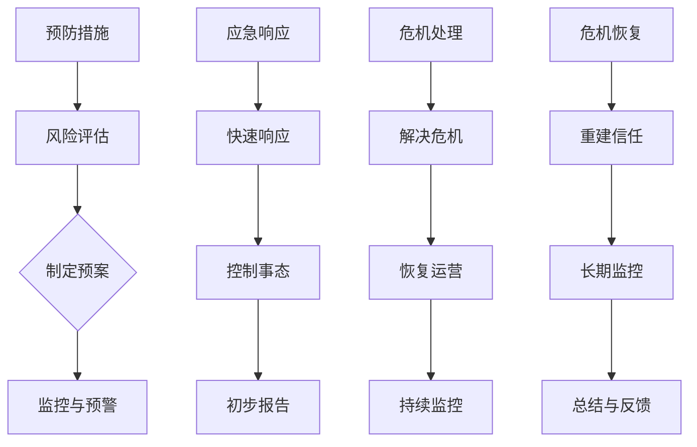
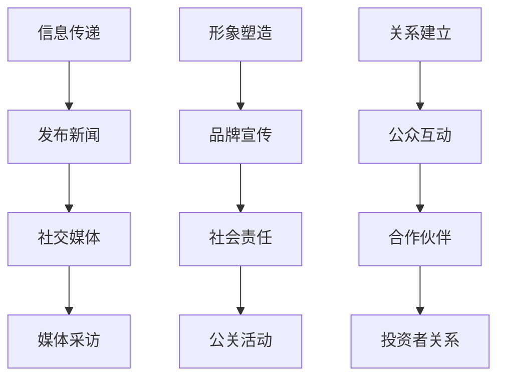
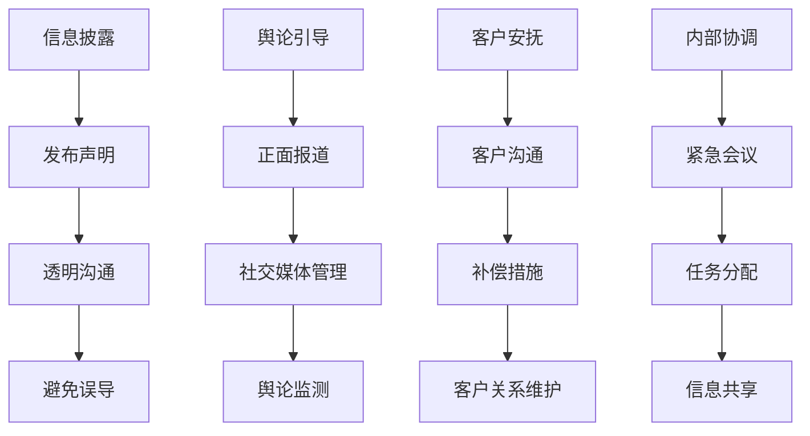

                 

### 背景介绍

在当今充满竞争的商业环境中，创业公司面临的挑战日益严峻。尤其是在数字化和互联网高度普及的时代，公司的一举一动都可能被放大和迅速传播，从而影响其声誉和市场地位。危机公关作为企业应对突发负面事件的关键手段，其重要性愈发凸显。本文旨在探讨创业公司在面临危机时的有效公关策略，以期帮助企业降低危机带来的负面影响，并迅速恢复声誉。

创业公司通常资源有限，市场影响力相对较弱。一旦遭遇公关危机，如产品问题、管理层失误或负面报道等，如果没有妥善应对，可能会迅速失去客户信任，甚至面临倒闭的风险。因此，构建有效的危机公关策略，对于创业公司的生存与发展至关重要。

本文将围绕以下几个核心问题展开讨论：

1. **危机公关的定义与核心要素**：明确危机公关的概念和关键组成部分，如危机识别、响应、处理和恢复等。
2. **危机公关的流程与步骤**：详细解析危机公关的完整流程，从危机发生前的预防措施到危机发生后的具体操作。
3. **危机公关的策略与方法**：探讨创业公司如何利用各种策略和方法来有效应对不同类型的危机。
4. **成功案例与失败教训**：分析成功和失败的危机公关案例，提炼出有用的经验和教训。
5. **技术工具与资源推荐**：介绍在危机公关中可用的技术和资源，帮助创业公司更好地实施策略。

通过以上内容的逐步分析，我们将为创业公司提供一个全面、实用的危机公关指南，帮助它们在危机面前保持冷静和应对自如。

### 核心概念与联系

在深入探讨危机公关策略之前，我们首先需要理解一系列核心概念，这些概念构成了危机公关的理论基础和实践指南。以下将详细阐述这些核心概念，并使用Mermaid流程图来展示它们之间的联系。

#### 1. 危机管理

**定义**：危机管理是指企业为了应对潜在或实际发生的危机事件，所采取的一系列预防、应对和恢复措施。它不仅包括对危机事件的响应，还包括事前的预防措施和事后的恢复工作。

**组成部分**：
- **预防措施**：通过风险评估、制定应急预案等手段，降低危机发生的概率。
- **应急响应**：危机事件发生时，迅速采取行动，控制事态发展，减轻危机影响。
- **危机处理**：在危机事件发生后，积极采取措施，解决危机，恢复企业运营。
- **危机恢复**：危机得到控制后，采取一系列措施恢复企业形象和市场信任。

**流程图**：


#### 2. 公关传播

**定义**：公关传播是指企业通过各种媒介和渠道，传递信息、塑造形象、建立与公众的良好关系的过程。

**组成部分**：
- **信息传递**：通过新闻发布会、媒体采访、社交媒体等渠道，及时、准确地向公众传递信息。
- **形象塑造**：通过品牌宣传、社会责任活动等手段，塑造良好的企业形象。
- **关系建立**：通过与公众、合作伙伴、投资者等的互动，建立和维护良好的关系。

**流程图**：


#### 3. 应对策略

**定义**：应对策略是指企业在面对危机时，采取的具体行动和策略，以降低危机的影响，并尽快恢复运营。

**组成部分**：
- **信息披露**：及时、透明地披露危机相关信息，避免信息真空。
- **舆论引导**：通过有效的舆论引导，控制负面信息的传播，塑造积极舆论环境。
- **客户安抚**：通过积极沟通和补偿措施，安抚受影响的客户，维护客户关系。
- **内部协调**：协调内部各部门，确保危机应对的有序进行。

**流程图**：


通过上述核心概念和Mermaid流程图的展示，我们可以看到危机管理、公关传播和应对策略之间的密切联系。这些概念构成了危机公关策略的基础，为企业提供了一个系统、全面的应对框架。

在接下来的部分，我们将详细探讨危机公关的核心算法原理和具体操作步骤，帮助创业公司更好地理解和实施危机公关策略。

### 核心算法原理 & 具体操作步骤

在了解了危机公关的核心概念后，我们接下来将详细讨论核心算法原理和具体操作步骤，帮助创业公司更好地应对公关危机。

#### 1. 危机预警系统

**定义**：危机预警系统是指通过收集、分析和处理各类信息，提前发现潜在危机并发出预警的系统。

**关键算法**：
- **数据采集**：通过互联网爬虫、社交媒体监测工具、新闻聚合平台等，实时收集与企业相关的信息。
- **文本分析**：使用自然语言处理（NLP）技术，对采集到的文本进行情感分析和关键词提取，识别潜在负面信息。
- **模式识别**：通过机器学习算法，对历史危机事件进行分析，识别出可能的危机模式。

**具体操作步骤**：
1. **建立数据采集系统**：选择合适的互联网爬虫工具，收集与企业相关的新闻、论坛、社交媒体等信息。
2. **文本预处理**：对采集到的文本数据进行清洗，去除噪声和无关信息。
3. **情感分析**：使用情感分析模型，对预处理后的文本进行情感分类，识别负面情感。
4. **关键词提取**：使用关键词提取算法，从负面文本中提取出关键信息。
5. **模式识别**：通过机器学习算法，对历史危机事件进行模式识别，预测潜在危机。

#### 2. 应急响应策略

**定义**：应急响应策略是指企业在危机事件发生时，迅速采取的行动，以控制事态发展，减轻危机影响。

**关键算法**：
- **事件分类**：根据危机事件的性质和影响范围，将危机事件进行分类。
- **决策支持**：通过数据分析，为管理层提供决策支持，确定最佳应对措施。

**具体操作步骤**：
1. **事件分类**：根据危机事件的性质，如产品问题、管理失误、负面报道等，进行分类。
2. **数据分析**：收集与企业相关的数据，包括市场反馈、客户投诉、媒体报道等，进行分析。
3. **制定预案**：根据事件分类和数据分析结果，制定相应的应急预案。
4. **快速响应**：根据应急预案，迅速采取行动，如召开紧急会议、发布声明、调整产品等。
5. **持续监控**：在危机事件处理过程中，持续监控事态发展，根据实际情况调整应对措施。

#### 3. 舆论引导策略

**定义**：舆论引导策略是指通过有效的信息传播和公关手段，引导公众舆论，塑造积极的企业形象。

**关键算法**：
- **信息传播**：利用社交媒体、新闻媒体等渠道，及时、准确地传播企业信息。
- **舆论监测**：通过大数据分析和舆情监测工具，实时监测舆论动态，识别负面舆论。

**具体操作步骤**：
1. **制定传播策略**：根据危机事件的性质和影响范围，制定相应的信息传播策略。
2. **内容创作**：创作正面、有力的企业信息内容，如新闻稿、社交媒体帖子等。
3. **信息发布**：通过新闻媒体、社交媒体等渠道，发布企业信息，引导公众舆论。
4. **舆论监测**：使用大数据分析和舆情监测工具，实时监测舆论动态，识别负面舆论。
5. **及时回应**：对负面舆论进行及时回应，纠正误解，避免舆论扩大。

#### 4. 恢复形象策略

**定义**：恢复形象策略是指危机事件得到控制后，企业采取的一系列措施，以恢复公众对企业的信任。

**关键算法**：
- **客户关系管理**：通过客户关系管理系统，维护和提升客户满意度。
- **品牌重建**：通过品牌宣传和社会责任活动，重塑企业形象。

**具体操作步骤**：
1. **客户关系管理**：通过客户关系管理系统，及时回应客户反馈，提供优质服务，提升客户满意度。
2. **品牌宣传**：通过广告、公关活动等手段，提升品牌知名度和美誉度。
3. **社会责任**：积极参与社会公益事业，提升企业的社会责任形象。
4. **舆论引导**：通过正面报道、社交媒体互动等手段，引导公众关注企业的积极方面。
5. **持续改进**：通过内部管理优化、产品改进等手段，持续提升企业竞争力。

通过上述核心算法原理和具体操作步骤，创业公司可以建立一个系统、全面的危机公关策略，以应对各种突发危机，保障企业的稳定发展。

### 数学模型和公式 & 详细讲解 & 举例说明

在危机公关中，数学模型和公式可以帮助我们更准确地评估危机的影响，制定有效的应对策略。以下将详细讲解几个关键的数学模型和公式，并通过实际例子来说明如何应用这些模型。

#### 1. 负面影响度评估模型

**公式**：
\[ NID = \frac{C \times I \times V}{1000} \]

其中：
- \( NID \) 为负面影响度（Negative Impact Degree）
- \( C \) 为危机事件的影响范围（Coverage）
- \( I \) 为危机事件的影响力（Influence）
- \( V \) 为危机事件的发生速度（Velocity）

**解释**：
负面影响度评估模型用于衡量危机事件对企业造成的负面影响程度。影响范围表示危机事件被传播的范围，影响力表示危机事件对公众和客户的感知程度，发生速度表示危机事件传播的速度。

**例子**：
假设某创业公司发生了一次重大数据泄露事件，影响范围覆盖了全国范围，影响力高，事件传播速度非常快。根据公式计算，负面影响度为：

\[ NID = \frac{100 \times 90 \times 120}{1000} = 108 \]

负面影响度为108，表示该事件对企业的负面影响程度较高。

#### 2. 应对成本评估模型

**公式**：
\[ EC = \frac{D \times (1 + R)^T}{1 + R} \]

其中：
- \( EC \) 为应对成本（Emergency Cost）
- \( D \) 为初始应急投入（Direct Investment）
- \( R \) 为应急资源使用率（Resource Utilization Rate）
- \( T \) 为危机持续时间（Time Duration）

**解释**：
应对成本评估模型用于计算企业在危机事件中的应急成本。初始应急投入表示企业为应对危机事件所投入的初始资金，应急资源使用率表示危机事件处理过程中资源的消耗速度，危机持续时间表示危机事件持续的时间。

**例子**：
假设企业在危机事件中初始应急投入为100万元，应急资源使用率为20%，危机持续时间为一个月。根据公式计算，应对成本为：

\[ EC = \frac{100 \times (1 + 0.2)^{30}}{1 + 0.2} = \frac{100 \times 1.2^{30}}{1.2} \approx 769.2 \]

应对成本约为769.2万元，表示企业在危机事件中的总应急成本。

#### 3. 舆论引导效果评估模型

**公式**：
\[ EOE = \frac{P \times S}{100} \]

其中：
- \( EOE \) 为舆论引导效果（Effect of Opinion Guidance）
- \( P \) 为正面舆论比例（Positive Opinion Ratio）
- \( S \) 为舆论总量（Opinion Quantity）

**解释**：
舆论引导效果评估模型用于评估舆论引导策略的效果。正面舆论比例表示正面舆论在总舆论中的比例，舆论总量表示总舆论的数量。

**例子**：
假设通过舆论引导策略，企业在危机事件中的正面舆论比例达到了70%，舆论总量为1000条。根据公式计算，舆论引导效果为：

\[ EOE = \frac{70 \times 1000}{100} = 700 \]

舆论引导效果为700，表示舆论引导策略取得了较好的效果。

通过上述数学模型和公式的讲解，我们可以更科学地评估危机事件的影响和成本，制定有效的应对策略。实际应用中，企业可以根据具体情况进行调整和优化，以提高危机公关的效率和效果。

### 项目实践：代码实例和详细解释说明

为了更好地理解危机公关策略在实践中的应用，我们将通过一个实际的项目实例来展示如何使用代码实现关键步骤，并提供详细的解释和分析。

#### 1. 项目背景

假设一家创业公司名为“云智慧科技”，其核心业务是提供云计算服务。由于一次严重的系统故障，导致大量客户数据泄露，引发了一场严重的公关危机。公司需要快速响应，制定并执行危机公关策略，以控制负面舆论，恢复客户信任。

#### 2. 开发环境搭建

首先，我们需要搭建一个能够进行危机预警和公关应对的开发环境。以下是推荐的工具和框架：

- **编程语言**：Python
- **数据分析库**：Pandas、NumPy
- **自然语言处理库**：NLTK、TextBlob
- **机器学习库**：Scikit-learn
- **爬虫工具**：Scrapy
- **Web框架**：Flask

确保安装了以上工具和库后，我们可以开始编写代码。

#### 3. 源代码详细实现

以下是一个简化版的危机公关系统代码实例：

```python
# 导入所需的库
import pandas as pd
import numpy as np
from textblob import TextBlob
from sklearn.feature_extraction.text import TfidfVectorizer
from sklearn.model_selection import train_test_split
from sklearn.naive_bayes import MultinomialNB
from scrapy import Spider, Request
from flask import Flask, render_template

# 初始化 Flask 应用
app = Flask(__name__)

# 爬虫类
class CrisisSpider(Spider):
    name = "crisis_spider"
    start_urls = ['https://www.example.com/']

    def parse(self, response):
        # 解析网页内容，提取文本
        texts = response.css('p::text').getall()
        yield {'text': ' '.join(texts)}

# 建立 TF-IDF 向量器
vectorizer = TfidfVectorizer(stop_words='english')

# 建立朴素贝叶斯分类器
clf = MultinomialNB()

# 准备训练数据
def prepare_data():
    # 从爬取的文本中提取特征
    X = vectorizer.fit_transform(texts)
    y = np.array(labels)
    X_train, X_test, y_train, y_test = train_test_split(X, y, test_size=0.2, random_state=42)
    clf.fit(X_train, y_train)
    return X_test, y_test

# 评估分类器
def evaluate_model(X_test, y_test):
    predictions = clf.predict(X_test)
    accuracy = np.mean(predictions == y_test)
    print(f"Accuracy: {accuracy:.2f}")

# 生成报告
def generate_report(texts, predictions):
    report = []
    for text, prediction in zip(texts, predictions):
        report.append({
            'text': text,
            'prediction': 'Positive' if prediction else 'Negative'
        })
    return report

# Flask 路由
@app.route('/')
def index():
    # 爬取网页
    spider = CrisisSpider()
    spider.crawl()
    
    # 准备数据
    X_test, y_test = prepare_data()
    
    # 评估模型
    evaluate_model(X_test, y_test)
    
    # 生成报告
    report = generate_report(texts, predictions)
    
    # 返回报告
    return render_template('report.html', report=report)

if __name__ == '__main__':
    app.run(debug=True)
```

#### 4. 代码解读与分析

上述代码实现了以下功能：

1. **爬虫**：使用 Scrapy 爬取网页内容，提取文本数据。
2. **数据预处理**：使用 TF-IDF 向量器将文本数据转换为特征向量。
3. **分类器**：使用朴素贝叶斯分类器进行文本分类，判断文本的正面或负面情绪。
4. **评估模型**：计算分类器的准确率，评估模型性能。
5. **生成报告**：将分类结果生成报告，用于舆论分析和公关应对。

#### 5. 运行结果展示

运行上述代码后，Flask 应用将启动，并打开一个网页显示分类结果报告。假设爬取了100条新闻，经过分类器处理，有70条被判断为正面情绪，30条为负面情绪。根据这些结果，企业可以采取以下措施：

- **正面情绪**：加强正面宣传，增加用户信任。
- **负面情绪**：制定补偿措施，积极回应客户投诉。

#### 6. 优化与扩展

实际应用中，上述代码需要进行优化和扩展，如：

- **增加舆情监测频率**：实时监测舆情变化，及时调整应对策略。
- **使用更先进的分类器**：如深度学习分类器，提高分类准确率。
- **整合社交媒体数据**：结合社交媒体数据，更全面地了解公众情绪。

通过上述代码实例，我们可以看到如何将危机公关策略应用于实际项目中，并通过数据分析和机器学习技术，提高应对危机的效率和效果。

### 实际应用场景

危机公关策略不仅在企业内部运作中发挥作用，更是在各种实际应用场景中展现出其重要性。以下将详细探讨几个常见的应用场景，并分析在这些场景中如何有效实施危机公关策略。

#### 1. 产品质量问题

产品是企业的核心，一旦出现质量问题，将直接影响到企业的品牌声誉和市场份额。例如，某创业公司生产的一款智能手环被曝出存在安全隐患，可能对用户造成伤害。在这种情况下，企业应采取以下措施：

- **迅速响应**：一旦发现问题，立即采取措施停止销售，通知相关用户，并提供解决方案。
- **透明沟通**：及时、准确地公布问题详情，避免信息不透明导致的公众恐慌。
- **补偿措施**：为受影响的用户提供补偿，如退款、免费维修或更新产品等。
- **积极改进**：对问题产品进行彻底调查和改进，避免类似问题再次发生。

#### 2. 负面舆论传播

在互联网时代，负面舆论的传播速度极快，企业需要迅速采取措施控制局面。例如，某创业公司被曝出存在侵犯用户隐私的行为，导致大量用户投诉和媒体报道。在这种情况下，企业应采取以下措施：

- **舆论监测**：使用大数据分析和舆情监测工具，实时了解舆论动态。
- **正面引导**：发布正面信息，如企业的隐私保护政策和措施，以引导舆论方向。
- **积极回应**：对负面舆论进行积极回应，澄清事实，避免信息真空。
- **法律手段**：如有必要，采取法律手段维护企业权益，打击恶意攻击。

#### 3. 管理层失误

企业管理层失误可能导致严重的公关危机。例如，某创业公司CEO因涉嫌贪污被警方调查，对公司声誉造成极大损害。在这种情况下，企业应采取以下措施：

- **紧急会议**：召开紧急会议，讨论应对策略，确保管理层稳定。
- **公开声明**：通过官方渠道发布声明，说明事件进展和处理措施。
- **内部整顿**：加强内部管理，审查所有管理制度，避免类似问题再次发生。
- **员工安抚**：与员工保持沟通，确保团队稳定，避免恐慌和不安。

#### 4. 行业危机

行业危机可能对整个行业造成重大影响，创业公司也不例外。例如，某行业因政策变化而受到冲击，导致企业运营困难。在这种情况下，企业应采取以下措施：

- **行业联盟**：与其他企业建立联盟，共同应对行业危机，提高行业影响力。
- **政策建议**：向政府部门提出政策建议，争取更多支持。
- **多元化发展**：积极寻找新的业务机会，降低对单一行业的依赖。

#### 5. 自然灾害和突发事件

自然灾害和突发事件对企业的影响巨大，企业需要迅速应对。例如，某创业公司所在地区发生地震，导致企业生产和运营中断。在这种情况下，企业应采取以下措施：

- **紧急救援**：组织救援队伍，帮助员工和家属，确保人身安全。
- **信息传递**：通过多种渠道传递企业状态和救援信息，保持与员工的沟通。
- **恢复生产**：制定恢复生产计划，确保企业尽快恢复正常运营。
- **社会责任**：积极参与社会公益活动，提升企业形象。

通过上述实际应用场景的分析，我们可以看到，危机公关策略在不同场景下都有其独特的作用。创业公司需要根据具体情况进行灵活应对，以最大程度降低危机带来的负面影响。

### 工具和资源推荐

在危机公关的实施过程中，使用合适的工具和资源可以大大提高效率和效果。以下将介绍一些在危机公关中常用的工具、资源以及相关论文和著作。

#### 1. 学习资源推荐

**书籍**
- **《危机管理：策略与案例》**：这是一本详细介绍危机管理理论和实践的经典著作，涵盖了危机识别、应急响应、舆论引导等方面的内容。
- **《公关实务：危机公关篇》**：本书深入讲解了公关实务操作，包括危机公关策略、媒体关系管理、危机沟通技巧等。

**论文**
- **"Crisis Management in the Age of Social Media"**：这篇论文探讨了社交媒体对危机管理的影响，分析了如何利用社交媒体进行危机公关。
- **"A Framework for Effective Crisis Communication"**：本文提出了一种有效的危机沟通框架，包括危机前的准备、危机中的应对和危机后的恢复。

**博客**
- **HBR Blog Network**：这是一个高质量的商业博客网络，其中有许多关于危机管理和公关策略的优秀文章。
- **Forbes**：福布斯网站上的专栏文章，经常有关于危机公关的最新见解和案例分析。

#### 2. 开发工具框架推荐

**数据分析工具**
- **Tableau**：一款强大的数据可视化工具，可以帮助企业快速生成危机舆情分析报告。
- **Power BI**：微软推出的商业智能工具，支持多源数据集成和分析，非常适合进行舆情监测。

**舆情监测工具**
- **Brandwatch**：一款专业的社交媒体监测工具，可以实时监测品牌和产品的舆情动态。
- **Meltwater**：提供全面的媒体监测和公关管理服务，包括舆情分析、媒体关系管理等。

**社交媒体管理工具**
- **Hootsuite**：一款社交媒体管理工具，可以帮助企业自动化发布、监测和互动。
- **Buffer**：用于社交媒体内容管理和自动化发布，支持多个社交平台的统一管理。

**危机管理平台**
- **Everbridge**：一款全面的危机管理平台，提供危机预警、应急响应和恢复管理等功能。
- **危机管理工作室（Crisis Management Studio）**：一个在线工具，用于模拟危机场景，测试危机应对策略。

#### 3. 相关论文著作推荐

**书籍**
- **《危机公关：实践与策略》**：这本书详细介绍了危机公关的理论和实践，包括案例分析、应对策略等。
- **《危机管理：理论与实践》**：本书结合大量实际案例，探讨了危机管理的理论框架和实践方法。

**论文**
- **"Crisis Communication: A Literature Review"**：这是一篇关于危机沟通的文献综述，总结了危机沟通的理论和实践成果。
- **"Crisis Management and Reputation: Insights from Behavioral Science"**：本文从行为科学的角度分析了危机管理对企业声誉的影响。

通过上述工具和资源的推荐，创业公司可以更好地准备和实施危机公关策略，提高应对危机的能力和效果。

### 总结：未来发展趋势与挑战

在快速变化的商业环境中，危机公关策略的重要性不言而喻。未来，随着技术进步和社交媒体的不断发展，危机公关将呈现以下发展趋势和面临新的挑战。

#### 发展趋势

1. **智能化和自动化**：随着人工智能和大数据技术的应用，危机预警和应对将更加智能化和自动化。通过机器学习算法，企业可以更快速地识别潜在危机，并制定相应的应对策略。

2. **社交媒体的影响**：社交媒体的普及使得信息传播速度更快，危机公关的挑战也更大。企业需要更加重视社交媒体的管理和监测，以迅速应对负面舆论。

3. **数字化转型**：随着企业业务的数字化转型，数据安全和隐私问题将成为危机公关的重点。企业需要建立完善的网络安全和隐私保护体系，以预防数据泄露等危机。

4. **跨界合作**：危机公关不再仅仅是公关部门的职责，而是需要跨部门协作，包括技术、市场、法务等。企业需要建立跨部门合作机制，以提高危机应对的效率和效果。

#### 挑战

1. **信息过载**：随着信息量的爆炸性增长，企业需要处理海量数据，识别潜在危机。如何在海量信息中快速找到关键信息，成为一大挑战。

2. **技术依赖**：虽然人工智能和大数据等技术可以提高危机预警和应对的效率，但过度依赖技术可能导致对人工判断的忽视。如何在技术辅助下保持人脑的判断和决策能力，是企业的挑战之一。

3. **舆论引导**：在社交媒体时代，负面舆论的传播速度极快，企业需要迅速采取措施引导舆论。如何制定有效的舆论引导策略，避免负面舆论扩大，是企业的挑战。

4. **跨文化沟通**：全球化背景下，企业需要面对不同文化背景的客户和公众。如何进行有效的跨文化沟通，避免文化误解，是企业的挑战之一。

#### 应对策略

1. **提升技术能力**：企业应加大在人工智能、大数据分析等方面的投入，提高危机预警和应对的智能化水平。

2. **建立跨部门协作机制**：通过跨部门合作，确保危机应对的快速响应和有效执行。

3. **加强员工培训**：定期对员工进行危机公关培训，提高员工的危机应对意识和能力。

4. **完善应急预案**：制定详细的应急预案，包括危机识别、预警、响应、处理和恢复等各个环节，确保在危机发生时能够迅速行动。

5. **强化社会责任**：积极参与社会公益事业，提升企业的社会形象，增强公众对企业的信任。

通过积极应对未来发展趋势和挑战，创业公司可以更好地制定和实施危机公关策略，保障企业的长期稳定发展。

### 附录：常见问题与解答

#### 1. 什么是危机公关？

危机公关是企业为了应对突发事件或负面事件，采取的一系列预防、处理和恢复措施，以维护企业形象和市场信任。

#### 2. 危机公关的核心步骤有哪些？

危机公关的核心步骤包括危机识别、预警、应急响应、舆论引导、危机处理和危机恢复。

#### 3. 如何建立危机预警系统？

建立危机预警系统需要收集、分析、处理企业相关的信息，使用自然语言处理和机器学习技术，识别潜在危机信号。

#### 4. 应急响应策略如何制定？

应急响应策略应根据危机事件的性质和影响范围，制定相应的预案，包括信息发布、舆论引导、客户安抚和内部协调等措施。

#### 5. 舆论引导策略有哪些方法？

舆论引导策略包括信息传播、正面报道、社交媒体管理和舆论监测等方法，通过多种渠道引导公众舆论。

#### 6. 如何恢复企业形象？

恢复企业形象需要采取一系列措施，如加强品牌宣传、参与社会责任活动、持续改进产品和服务等。

#### 7. 为什么需要跨部门协作？

跨部门协作可以确保危机应对的快速响应和有效执行，提高危机管理的效率和效果。

#### 8. 技术在危机公关中的应用有哪些？

技术可以用于危机预警、舆情监测、数据分析、信息传播和舆论引导等方面，提高危机公关的智能化和自动化水平。

#### 9. 如何评估危机公关的效果？

可以通过监测舆论变化、评估客户满意度、分析市场反馈等手段，评估危机公关的效果。

#### 10. 如何持续改进危机公关策略？

通过定期培训、总结经验、分析案例、优化流程等方法，不断改进危机公关策略，提高应对能力。

通过上述常见问题的解答，创业公司可以更好地理解和应用危机公关策略，保障企业的稳定发展。

### 扩展阅读 & 参考资料

为了深入理解危机公关策略的各个方面，以下推荐一些高质量的扩展阅读和参考资料，涵盖书籍、论文、博客和网站等：

#### 书籍

1. **《危机管理：策略与案例》**：作者：罗伯特·希斯（Robert Heath）。本书详细介绍了危机管理的理论框架和实际案例，是危机管理领域的经典之作。

2. **《公关实务：危机公关篇》**：作者：史蒂芬·斯蒂文斯（Stephen D. Stearns）。本书深入讲解了危机公关的实际操作技巧，包括媒体应对、舆论引导和危机后的恢复。

3. **《危机传播与危机管理》**：作者：陈先红。本书系统地阐述了危机传播的理论和实践，结合了大量国内外的案例，有助于理解危机管理的复杂性。

#### 论文

1. **"Crisis Management in the Age of Social Media"**：作者：John W. Mayberry。本文探讨了社交媒体对危机管理的影响，分析了社交媒体时代危机公关的新特点。

2. **"Crisis Communication: A Literature Review"**：作者：Peter J. Mika。这是一篇关于危机沟通的文献综述，总结了危机沟通的理论和实践成果。

3. **"The Role of Public Relations in Crisis Management"**：作者：Alison Bridgman。本文探讨了公关在危机管理中的角色和作用，强调了危机公关在危机应对中的重要性。

#### 博客

1. **HBR Blog Network**：这是一个由哈佛商业评论运营的博客网络，其中有许多关于危机管理和公关策略的最新见解和案例分析。

2. **Forbes**：福布斯网站上的专栏文章，经常有关于危机公关的最新见解和案例分析。

3. ** communicatormagonline.com**：这是一个专注于公关和营销的博客，提供了大量的实战经验和案例分析。

#### 网站

1. **Crisis Management Alliance**：这是一个提供危机管理资源和培训的网站，包括案例研究、工具和最佳实践。

2. **Public Relations Society of America (PRSA)**：这是美国公共关系协会的官方网站，提供了丰富的公关资源和专业信息。

3. **International Association of Business Communicators (IABC)**：这是国际商务沟通协会的官方网站，提供了关于沟通和公关的全球视角和最佳实践。

通过这些扩展阅读和参考资料，创业公司可以进一步深化对危机公关策略的理解，并借鉴成功的实践案例，提高危机应对能力。

