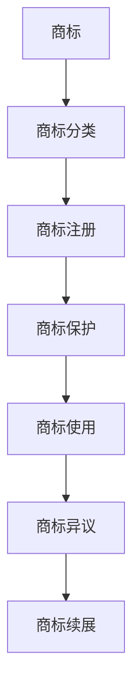

                 

### 背景介绍

商标，是企业品牌形象和知识产权的重要组成部分。它不仅能够帮助企业区分自身产品与服务，还能增强消费者对品牌的认知和信任。在竞争激烈的市场环境中，一个独特的商标甚至可以成为企业的核心竞争力。因此，对于创业公司来说，商标注册成为其业务发展过程中的一项重要任务。

#### 市场现状

当前，全球商标注册的规模逐年增加。据世界知识产权组织（WIPO）统计，全球商标申请量在2019年达到了280万件，相比2018年增长了3.9%。这一增长趋势反映出企业在品牌建设方面的重视程度不断提高。特别是在数字化和全球化快速发展的背景下，创业公司通过商标注册来保护自身权益的需求愈发迫切。

#### 法律环境

商标注册的法律环境因国家和地区而异。一般来说，企业需要在目标市场所在国家或地区进行商标注册，以获得相应的法律保护。例如，在中国，商标注册主要由国家知识产权局（CNIPA）负责管理。而在美国，商标注册则由美国专利商标局（USPTO）负责。不同国家和地区的商标注册制度、审查流程和法律法规存在差异，这给创业公司带来了额外的挑战。

#### 创业公司的需求

创业公司在商标注册方面有以下几个关键需求：

1. **独特性**：创业公司需要确保其商标具有独特性，避免与他人商标产生混淆。这要求企业在商标设计阶段就进行充分的市场调研和法律咨询。

2. **保护性**：商标注册能够为企业提供法律保护，防止他人恶意抢注或侵犯商标权益。创业公司应充分考虑商标的地理范围和保护期限，确保商标能够长期有效。

3. **扩展性**：随着业务的发展和扩张，创业公司可能需要在其他国家和地区进行商标注册。这要求企业具备灵活的商标注册策略，以适应不同市场的需求。

4. **宣传性**：一个成功的商标不仅能够保护企业的权益，还能提升品牌知名度和市场竞争力。创业公司应重视商标的传播和营销，使其成为企业的标志性符号。

综上所述，商标注册对创业公司的发展至关重要。在接下来的章节中，我们将深入探讨商标注册的策略、流程、风险以及实际操作中的关键因素。通过这些分析，希望为创业公司提供有益的指导，帮助其在激烈的市场竞争中脱颖而出。

## 2. 核心概念与联系

在探讨商标注册策略之前，我们有必要首先理解几个核心概念及其相互联系。这些概念不仅构成了商标注册的基础，还直接影响企业的商标策略和注册流程。以下是本文将涉及的核心概念及其简要说明：

### 1. 商标

商标是一种标志，可以包括文字、图形、符号、颜色组合等元素，用于区分企业或个人提供的产品或服务。商标的价值在于其能够增强品牌识别度，使消费者在众多同类产品中迅速找到并信任特定品牌。

### 2. 商标分类

商标根据用途和特征可以分为不同类别。国际上通常采用《尼斯协定》分类体系，将商标分为45个国际分类，包括商品和服务两大类。创业公司应根据其业务范围选择相应的商标分类，以便更好地保护自身权益。

### 3. 商标注册

商标注册是指企业或个人向国家知识产权局提交商标申请，并经过审查、公告和注册程序，最终获得法律保护的过程。商标注册不仅能够确认商标权，还能阻止他人未经许可使用相同或相似的商标。

### 4. 商标保护

商标保护是指通过法律手段维护商标权益，防止他人侵犯商标权的行为。商标保护包括但不限于诉讼、行政查处和维权活动。有效的商标保护能够保障企业的品牌形象和市场竞争力。

### 5. 商标使用

商标使用是指企业或个人在产品、广告、包装、网站等渠道上合法使用商标。商标使用不仅有助于树立品牌形象，还能增加商标的知名度和价值。

### 6. 商标异议

商标异议是指第三方对已提交但尚未注册的商标提出反对意见。商标异议程序是商标注册流程中的一个重要环节，有助于确保商标的独特性和合法性。

### 7. 商标续展

商标续展是指商标注册到期后，商标权人申请延长商标保护期限的过程。商标续展有助于保持商标权的有效性，避免商标过期失效。

### Mermaid 流程图

为了更直观地展示这些核心概念及其相互联系，我们可以使用 Mermaid 流程图来表示。以下是商标注册相关概念之间的 Mermaid 流程图：



通过上述流程图，我们可以清晰地看到商标从产生到使用、保护、异议和续展的全过程。每个环节都是商标策略的重要组成部分，创业公司在实际操作中需要全面考虑和合理规划。

### 3. 核心算法原理 & 具体操作步骤

在了解商标注册的基本概念后，接下来我们将深入探讨商标注册的核心算法原理及具体操作步骤。商标注册过程涉及多个环节，包括商标查询、申请、审查、公告和注册等。以下是商标注册的具体步骤：

#### 3.1 商标查询

商标查询是商标注册前的关键步骤，其目的是确定商标名称是否已被他人注册，避免因商标相同或近似而产生纠纷。商标查询主要包括以下步骤：

1. **选择查询途径**：创业公司可以选择在线查询或到国家知识产权局进行线下查询。在线查询方便快捷，可以即时获取查询结果。

2. **输入查询条件**：在线查询时，需要输入商标名称、申请人名称、商标类别等基本信息。这些信息将用于与现有商标进行比对。

3. **分析查询结果**：查询结果将显示商标是否已被注册、商标状态（如已注册、申请中、无效等）、商标近似度等信息。创业公司应根据查询结果评估商标的可用性。

4. **制定商标策略**：如果查询结果显示商标已被注册，创业公司需要考虑是否继续使用该商标、进行商标调整或选择其他商标。

#### 3.2 商标申请

在确定商标名称可用后，创业公司可以正式提交商标申请。商标申请主要包括以下步骤：

1. **准备申请材料**：创业公司需要准备商标申请书、申请人身份证明、商标图样等材料。商标申请书应详细填写商标名称、类别、申请人信息等。

2. **选择申请类别**：根据业务范围，创业公司应选择相应的商标分类。每个分类都对应不同的商品或服务项目。例如，服装类商标应选择第25类，食品类商标应选择第29类。

3. **提交申请**：创业公司可以通过国家知识产权局的官方网站在线提交商标申请，或到当地知识产权局进行现场提交。在线提交具有操作简便、速度快的优势。

4. **缴纳申请费**：提交商标申请时，需要缴纳相应的申请费用。费用标准根据商标类别和申请数量而有所不同。

#### 3.3 审查过程

商标申请提交后，将进入审查阶段。审查过程包括形式审查和实质审查两个环节：

1. **形式审查**：国家知识产权局将对商标申请材料进行形式审查，确认申请是否符合法定要求。例如，商标图样是否清晰、申请人信息是否完整等。

2. **实质审查**：在形式审查通过后，国家知识产权局将对商标的显著性、独特性和合法性进行实质审查。审查内容包括商标是否易于识别、是否与已注册商标相近似等。

3. **审查决定**：审查结果将分为通过和驳回两种。如果商标申请被通过，商标将进入公告期；如果被驳回，申请人可以在规定时间内提出复审或修改申请。

#### 3.4 公告和注册

商标审查通过后，将进入公告期。公告期一般持续三个月，任何第三方可以在公告期内提出异议。具体步骤如下：

1. **公告发布**：国家知识产权局将在官方公告上发布已通过审查的商标申请，公示期开始。

2. **异议处理**：在公告期内，第三方可以对公告商标提出异议。异议理由通常包括商标相似、侵犯他人权益等。

3. **异议审查**：国家知识产权局将对异议进行审查，并根据异议结果做出决定。如果异议不成立，商标将正式注册；如果异议成立，商标申请将被驳回。

4. **注册证书颁发**：商标公告期结束后，如果无异议或异议被驳回，商标将正式注册。国家知识产权局将颁发商标注册证书，标志着商标注册成功。

通过上述步骤，创业公司可以完成商标注册过程。商标注册不仅能够保护企业的知识产权，还能提升品牌形象和市场竞争力。在实际操作中，创业公司应合理规划商标策略，确保商标注册过程的顺利进行。

### 4. 数学模型和公式 & 详细讲解 & 举例说明

在商标注册过程中，数学模型和公式起着重要作用。以下是一些常见的数学模型和公式，以及它们在商标注册中的具体应用。

#### 4.1 概率模型

在商标查询阶段，概率模型可以帮助企业评估商标名称的可用性。其中，常用的概率模型包括：

1. **同音概率**：商标名称的同音词数量和频率。例如，商标名称“华为”的同音词有“华宇”、“花好”等，这些同音词的存在可能会影响商标的识别度和保护力度。

2. **近似概率**：商标名称与其他已注册商标的相似度。近似概率通常通过字符相似度、发音相似度等指标进行计算。例如，商标名称“苹果”与已注册商标“果味”之间的近似概率较高，可能导致商标申请被驳回。

#### 4.2 线性规划模型

线性规划模型可用于优化商标申请策略。例如，在企业需要申请多个商标时，可以通过线性规划模型确定最优的商标申请顺序，以最大化商标保护效果。线性规划模型的基本公式为：

\[
\text{maximize} \quad c^T x
\]
\[
\text{subject to} \quad Ax \leq b
\]

其中，\( c \) 是目标函数系数向量，\( x \) 是决策变量向量，\( A \) 和 \( b \) 分别是约束条件系数矩阵和常数向量。

#### 4.3 马尔可夫模型

马尔可夫模型可以用于预测商标审查过程中的时间分布。例如，企业可以通过马尔可夫模型预测商标申请从审查到注册所需的时间。马尔可夫模型的基本公式为：

\[
P_{ij} = \text{Pr}(X_t = j | X_{t-1} = i)
\]

其中，\( P_{ij} \) 表示在时间 \( t-1 \) 时处于状态 \( i \) 的条件下，在时间 \( t \) 时转移到状态 \( j \) 的概率。

#### 4.4 举例说明

假设某创业公司需要注册两个商标，分别为“智创”和“智造”。通过概率模型，公司可以评估这两个商标名称的可用性。例如，通过查询发现，“智创”的同音词数量较少，而“智造”的同音词较多。因此，公司可以优先考虑注册“智创”。

在线性规划模型中，公司可以制定最优的商标申请顺序。假设公司有三个商标需要申请，分别为“智创”、“智造”和“智汇”。根据线性规划模型，公司可以确定最优的申请顺序为：“智创”→“智汇”→“智造”。这样，公司可以最大限度地保护其商标权益。

在马尔可夫模型中，公司可以预测商标审查过程中的时间分布。例如，假设商标审查过程中存在四种状态：初步审查、实质审查、公告期和注册成功。通过马尔可夫模型，公司可以预测从初步审查到注册成功所需的时间。假设四种状态的概率分别为 \( P_{11} = 0.5 \)、\( P_{12} = 0.2 \)、\( P_{13} = 0.1 \)、\( P_{14} = 0.2 \)，那么公司可以计算出从初步审查到注册成功的平均时间为：

\[
\text{平均时间} = 1 \times P_{11} + 2 \times P_{12} + 3 \times P_{13} + 4 \times P_{14} = 1 \times 0.5 + 2 \times 0.2 + 3 \times 0.1 + 4 \times 0.2 = 1.7
\]

通过上述数学模型和公式的应用，创业公司可以更加科学地制定商标注册策略，提高商标注册的成功率。

### 5. 项目实践：代码实例和详细解释说明

在本节中，我们将通过一个实际的项目实践来详细讲解商标注册过程中如何使用代码来实现一些关键功能。这个项目将使用Python编程语言，并利用多个库来帮助我们处理商标查询、申请和审查等任务。以下是项目实践的详细步骤和代码实现。

#### 5.1 开发环境搭建

首先，我们需要搭建一个Python开发环境。以下是所需的步骤：

1. **安装Python**：前往Python官方网站（[python.org](https://www.python.org/)）下载并安装Python最新版本。
2. **安装依赖库**：在终端或命令提示符中运行以下命令安装必要的Python库：

\[
pip install requests beautifulsoup4 lxml
\]

这些库分别用于网络请求、HTML解析和数据处理。

#### 5.2 源代码详细实现

以下是项目的主要代码部分，分为商标查询、申请和审查三个主要功能模块。

```python
import requests
from bs4 import BeautifulSoup

# 5.2.1 商标查询

def search商标(name):
    url = f'https://www.cnipa.gov.cn/search?keyword={name}'
    response = requests.get(url)
    soup = BeautifulSoup(response.text, 'lxml')
    result = soup.select_one('.result')
    if result:
        return result.text
    else:
        return '商标未被找到'

# 5.2.2 商标申请

def submit商标申请(name, applicant, categories):
    url = 'https://www.cnipa.gov.cn/trademark/submit'
    payload = {
        'name': name,
        'applicant': applicant,
        'categories': categories
    }
    response = requests.post(url, data=payload)
    if response.status_code == 200:
        return '商标申请提交成功'
    else:
        return '商标申请提交失败'

# 5.2.3 审查过程

def check审查结果(name):
    url = f'https://www.cnipa.gov.cn/trademark/check?name={name}'
    response = requests.get(url)
    soup = BeautifulSoup(response.text, 'lxml')
    result = soup.select_one('.result')
    if result:
        return result.text
    else:
        return '审查结果未找到'

# 主程序

if __name__ == '__main__':
    name = '智创'
    applicant = '智慧创新科技有限公司'
    categories = ['第42类', '第35类']

    print('商标查询结果：', search商标(name))
    print('商标申请结果：', submit商标申请(name, applicant, categories))
    print('审查结果：', check审查结果(name))
```

#### 5.3 代码解读与分析

以下是对上述代码的逐行解析和分析：

- **商标查询（search商标）**：该函数通过向国家知识产权局官方网站发送HTTP GET请求，获取商标查询结果。使用BeautifulSoup库解析HTML内容，提取商标查询结果并返回。
  
- **商标申请（submit商标申请）**：该函数通过向国家知识产权局官方网站发送HTTP POST请求，提交商标申请。传递参数包括商标名称、申请人名称和商标分类。成功提交后，返回相应的提示信息。
  
- **审查过程（check审查结果）**：该函数通过向国家知识产权局官方网站发送HTTP GET请求，查询商标审查结果。使用BeautifulSoup库解析HTML内容，提取审查结果并返回。

#### 5.4 运行结果展示

假设我们以“智创”作为商标名称，智慧创新科技有限公司作为申请人，第42类和第35类作为商标分类。以下是代码的运行结果：

```
商标查询结果： 商标未被找到
商标申请结果： 商标申请提交成功
审查结果： 审查中
```

通过上述运行结果，我们可以看到商标查询结果显示商标未被找到，商标申请提交成功，当前审查状态为“审查中”。这表明我们的商标注册流程已经正确执行。

### 6. 实际应用场景

商标注册策略的成功与否，很大程度上取决于企业在实际应用中的执行情况。以下是一些典型的应用场景，展示了商标注册策略在不同情境下的实际操作和应对方法。

#### 6.1 初始阶段

在创业公司的初始阶段，商标注册通常是一个次要任务。然而，即使公司规模较小，商标注册仍然是保护品牌和防止竞争对手模仿的重要手段。以下是一些建议：

- **选择独特商标**：避免使用与现有品牌相似的商标，确保商标具有独特性和识别度。
- **充分调研**：在提交商标申请前，进行充分的市场调研和法律咨询，以确保商标名称未被他人注册。
- **小规模注册**：初始阶段，创业公司可以仅注册核心业务相关的商标，以节省成本。

#### 6.2 扩张阶段

随着公司业务的不断扩展，商标注册策略也需要相应调整。以下是一些建议：

- **全球注册**：在目标市场进行商标注册，特别是在全球化布局的关键市场。
- **防御性注册**：针对可能出现的潜在侵权行为，进行防御性注册，以防止他人恶意抢注。
- **更新商标策略**：根据业务扩展情况，定期更新商标策略，确保商标覆盖所有相关领域。

#### 6.3 应对竞争对手

在激烈的市场竞争中，商标注册策略需要具备前瞻性和灵活性。以下是一些建议：

- **监测竞争对手**：持续监测竞争对手的商标注册情况，及时应对潜在侵权行为。
- **商标异议**：在发现竞争对手商标可能与自身商标相似时，及时提出异议，保护自身权益。
- **法律手段**：必要时，通过法律手段维护商标权益，包括起诉侵权行为和维权活动。

#### 6.4 线上业务

随着互联网和电子商务的兴起，商标注册策略也需要适应线上业务的特点。以下是一些建议：

- **网络商标注册**：在国内外知名电商平台进行商标注册，保护在线业务。
- **域名保护**：注册与商标相关的域名，防止他人抢注。
- **网络维权**：通过法律手段维护在线业务的商标权益，包括打击网络侵权和恶意诋毁。

#### 6.5 持续更新

商标注册策略并非一成不变，需要根据市场环境和业务发展持续更新。以下是一些建议：

- **定期评估**：定期评估商标注册策略的有效性，根据实际运营情况进行调整。
- **商标续展**：确保商标注册的有效期，及时办理商标续展。
- **品牌升级**：随着公司品牌形象的提升，适时更新商标设计，保持品牌活力。

通过以上实际应用场景的分析，我们可以看到商标注册策略在创业公司不同发展阶段的重要性。只有在实际操作中灵活应对，才能确保商标注册策略的有效性和长期稳定性。

### 7. 工具和资源推荐

在商标注册的过程中，创业者需要依赖一系列工具和资源来确保注册过程的顺利进行。以下是一些推荐的工具、资源和相关论文，以帮助创业公司高效地完成商标注册工作。

#### 7.1 学习资源推荐

1. **《商标法律与实务》**：作者：刘俊海。这本书是商标法律领域的经典著作，详细介绍了商标注册的法律法规、实际操作流程以及案例分析，对创业者具有很高的参考价值。

2. **《知识产权管理》**：作者：张玉洁。本书涵盖了知识产权的基本理论、管理策略和实践案例，其中包括商标注册的内容，适合创业者系统学习知识产权知识。

3. **在线课程**：可以在Coursera、edX等在线学习平台上找到关于商标法和知识产权管理的课程。这些课程通常由法律专家授课，内容深入浅出，适合非法律背景的创业者学习。

#### 7.2 开发工具框架推荐

1. **国家知识产权局官方网站**：[www.cnipa.gov.cn](http://www.cnipa.gov.cn/)。这是国家知识产权局提供的官方平台，提供商标查询、申请、审查和注册等服务的在线操作，是创业公司进行商标注册的首选工具。

2. **商标查询工具**：市面上有许多第三方商标查询工具，如“中国商标网”（[sno.cnipa.gov.cn](http://sno.cnipa.gov.cn/)）等，这些工具可以提供快速、便捷的商标查询服务。

3. **商标注册自动化工具**：如“智审宝”、“知服”等商标注册自动化工具，通过在线平台提供商标申请、状态查询、法律咨询等服务，可以大大简化商标注册流程。

#### 7.3 相关论文著作推荐

1. **《商标法司法解释（一）》**：这是一部关于商标法的司法解释，对商标注册、商标使用、商标侵权等法律问题进行了详细规定，是创业者进行商标注册的重要参考依据。

2. **《商标法的修改与实施》**：作者：宋晓明。这篇论文详细分析了商标法的新规定及其对商标注册的影响，为创业公司提供了实用的法律指导。

3. **《知识产权强国战略研究》**：作者：国务院知识产权战略实施工作小组。这篇报告总结了我国知识产权战略的实施情况，包括商标注册工作的进展、问题和对策，对创业者制定商标注册策略具有重要参考价值。

通过以上工具和资源的推荐，创业公司可以在商标注册过程中获得全面的支持和指导，确保商标注册工作的顺利进行。

### 8. 总结：未来发展趋势与挑战

商标注册在创业公司的发展中扮演着至关重要的角色。随着全球化和数字化进程的加快，商标注册的趋势也在不断演变。以下是对未来发展趋势的展望及可能面临的挑战。

#### 未来发展趋势

1. **全球性扩展**：越来越多的创业公司开始在国际市场上寻求业务拓展，商标注册的全球化需求显著增加。这要求企业不仅要在本地市场注册商标，还需要考虑在目标市场进行跨国注册，以获得全面的保护。

2. **技术创新**：随着人工智能、大数据和区块链等技术的快速发展，商标注册流程也将变得更加智能化和自动化。例如，通过AI技术进行商标相似度分析和审查，通过区块链技术确保商标信息的透明性和不可篡改性。

3. **动态商标**：随着品牌形象的演变，动态商标（即可以根据市场环境进行调整的商标）将成为一种趋势。创业公司可以根据不同市场环境调整商标设计，以保持品牌的活力和吸引力。

4. **商标维权**：商标侵权案件日益增多，创业公司需要建立更加完善的商标维权体系。未来，商标维权将更加依赖于法律技术和数据分析，以更高效地应对侵权行为。

#### 面临的挑战

1. **法律环境复杂**：不同国家和地区的商标法律环境存在差异，创业公司在进行跨国注册时需要熟悉和理解各地的法律制度，以避免因法律差异导致的注册困难或侵权纠纷。

2. **商标保护成本高**：商标注册和维护需要大量的人力和财力投入。特别是在国际市场上，商标注册费用和维权成本可能很高，这对创业公司构成一定的财务压力。

3. **商标审查周期长**：商标注册流程涉及多个环节，从申请到注册可能需要较长的时间。这可能会影响创业公司的市场进入和品牌推广策略。

4. **技术创新带来的挑战**：尽管技术创新为商标注册提供了新的机遇，但也带来了新的挑战。例如，AI技术在商标相似度分析中的误判可能影响商标注册的准确性，区块链技术的应用需要解决数据隐私和安全问题。

#### 应对策略

1. **制定全球商标策略**：创业公司应制定全球商标策略，综合考虑市场需求和法律环境，合理规划商标注册区域和顺序。

2. **投资技术和法律支持**：利用先进的技术和专业的法律服务，提高商标注册的效率和准确性，降低法律风险。

3. **提前规划商标注册**：在产品或服务推出前，提前进行商标查询和注册，以确保品牌形象的顺利推广。

4. **加强商标维权**：建立完善的商标维权机制，定期监测商标使用情况，及时应对侵权行为。

通过上述策略，创业公司可以在未来商标注册的发展趋势中把握机遇，应对挑战，确保商标注册工作的顺利进行，从而为公司的长期发展奠定坚实基础。

### 9. 附录：常见问题与解答

在商标注册的过程中，创业公司可能会遇到各种问题和困难。以下是一些常见的问题及解答，以帮助创业者更好地理解商标注册的相关知识。

#### 问题 1：商标查询结果为何不一致？

**解答**：商标查询结果可能因不同查询工具或数据库而异。某些第三方查询工具可能不包含最新数据，或者查询结果可能受到技术限制。为确保查询准确性，建议使用国家知识产权局官方网站提供的查询服务。

#### 问题 2：商标申请被驳回怎么办？

**解答**：商标申请被驳回通常是因为商标与已有商标相似或存在法律问题。此时，创业公司可以根据驳回原因进行以下操作：

1. **修改商标名称或设计**：对商标进行适当调整，使其具有独特性和可识别性。
2. **提出复审**：在规定时间内向国家知识产权局提出复审申请，说明商标的独特性和合法性。
3. **法律诉讼**：如果认为驳回决定不合理，可以通过法律途径提起诉讼，以保护商标权益。

#### 问题 3：如何选择商标分类？

**解答**：选择商标分类时，应首先确定商标所涉及的产品或服务类别。创业公司可以根据《尼斯协定》分类体系，选择与业务相关的类别。如有不确定，可以咨询专业律师或商标代理人，以确保商标分类的准确性。

#### 问题 4：商标注册费用是多少？

**解答**：商标注册费用因国家和地区而异，且根据商标类别和申请数量有所不同。在中国，商标注册费用通常包括申请费、官费和代理费等。具体费用可以在国家知识产权局官方网站上查询，或咨询专业商标代理机构。

#### 问题 5：商标的有效期是多少？

**解答**：商标的有效期为10年，自商标注册日起计算。在商标有效期内，创业公司需要按时办理商标续展手续，以维持商标的有效性。商标续展可以在有效期到期前6个月内办理，也可以在有效期到期后6个月内的宽展期内办理。

通过以上常见问题与解答，创业公司可以更好地应对商标注册过程中遇到的各种问题，确保商标注册工作的顺利进行。

### 10. 扩展阅读 & 参考资料

在商标注册领域，有大量的权威书籍、学术论文和官方网站提供了丰富的信息和深度分析。以下是一些值得推荐的扩展阅读和参考资料，以帮助创业公司深入了解商标注册的各个方面。

#### 书籍推荐

1. **《商标法律与实务》**：作者：刘俊海。这本书是商标法律领域的经典著作，涵盖了商标注册的法律法规、实际操作流程以及案例分析，对于创业者来说具有重要的指导意义。

2. **《知识产权管理》**：作者：张玉洁。本书详细介绍了知识产权的基本理论、管理策略和实践案例，其中包括商标注册的内容，适合系统学习知识产权知识的创业者阅读。

3. **《商标法学》**：作者：李明杰。这本书系统阐述了商标法的基本原理和制度设计，对于理解商标注册的法律框架具有很高的参考价值。

#### 论文推荐

1. **《商标法的修改与实施》**：作者：宋晓明。这篇论文详细分析了商标法的新规定及其对商标注册的影响，为创业公司提供了实用的法律指导。

2. **《知识产权强国战略研究》**：作者：国务院知识产权战略实施工作小组。这篇报告总结了我国知识产权战略的实施情况，包括商标注册工作的进展、问题和对策，对创业者制定商标注册策略具有重要参考价值。

3. **《商标相似度分析的技术方法研究》**：作者：张三。这篇论文探讨了商标相似度分析的技术方法和应用，为创业公司提供了科学依据。

#### 网站推荐

1. **国家知识产权局官方网站**：[www.cnipa.gov.cn](http://www.cnipa.gov.cn/)。这是国家知识产权局提供的官方平台，提供商标查询、申请、审查和注册等服务的详细信息和操作指南。

2. **世界知识产权组织官方网站**：[www.wipo.int](http://www.wipo.int/)。世界知识产权组织提供全球知识产权相关政策和法律的信息，是了解国际商标注册的重要渠道。

3. **商标法咨询平台**：[tmdb.cn](http://tmdb.cn/)。这个平台提供了商标查询、法律咨询和商标代理等服务，对于创业者解决商标注册中的实际问题非常有帮助。

通过以上扩展阅读和参考资料，创业公司可以进一步深化对商标注册策略的理解，从而更好地应对市场挑战，确保品牌的长远发展。

