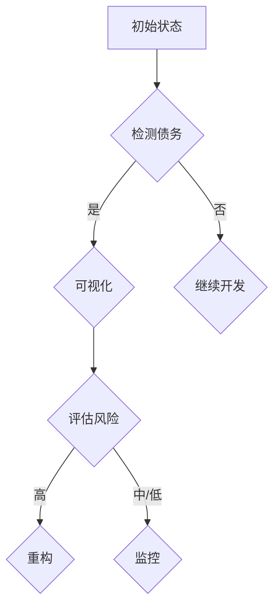

                 

### 背景介绍 Background Introduction

在当今快速发展的科技行业，创业公司如雨后春笋般涌现，为了抢占市场先机，这些公司往往需要快速构建产品，追求快速迭代和灵活性。然而，在追求速度的过程中，技术债务（Technical Debt）问题也日益突出。技术债务是指在软件开发过程中，为了快速交付产品而采取的短期解决方案，这些解决方案在长期来看可能会带来额外的成本和复杂性。

技术债务可以源自多种原因，例如：

1. **时间压力**：为了满足市场或客户需求，开发团队可能会牺牲代码质量和可维护性。
2. **资源限制**：在资金、人力和技术资源有限的情况下，团队可能会采取简化设计或使用替代方案来加快开发进程。
3. **技术选择**：在某些情况下，为了快速实现功能，团队可能会选择成熟度较低的技术或框架。

如果不加以管理，技术债务会随着时间的积累而不断增加，最终可能对产品的性能、可维护性和安全性产生负面影响。因此，对于创业公司来说，如何识别、评估和可视化技术债务，进而采取有效的管理策略，成为了一个至关重要的问题。

本文旨在探讨创业公司如何通过技术债务可视化与管理，提高软件开发效率和产品质量。我们将首先介绍技术债务的核心概念及其重要性，然后详细分析技术债务的产生原因和影响，接下来讨论技术债务可视化的重要性和方法，最后给出技术债务管理的最佳实践和策略。

通过本文的探讨，希望读者能够更好地理解和应对技术债务问题，为创业公司提供一种有效的技术管理方法，从而在快速发展的市场中保持竞争力。

### 核心概念与联系 Core Concepts and Connections

在深入探讨创业公司的技术债务可视化与管理之前，我们需要明确几个关键概念，并理解它们之间的联系。以下是本文中涉及的核心概念及其相互关系：

#### 技术债务（Technical Debt）

**定义**：技术债务是指在软件开发过程中，由于采取快速、简化或临时的解决方案，导致代码质量、架构设计或系统性能的下降。这些解决方案可能在短期内提高了开发速度，但长期来看会带来额外的维护成本和复杂性。

**类型**：技术债务可以分为以下几种类型：

- **设计债务**：指的是在架构设计上的不足，如过度耦合、高内聚度等，导致系统难以扩展和维护。
- **代码债务**：包括代码质量低下、代码冗余、缺乏文档等问题。
- **测试债务**：指的是缺乏足够的自动化测试，导致在功能变更时难以发现和修复问题。

#### 可视化（Visualization）

**定义**：可视化是将数据或信息以图形、图表或图像的形式呈现，使复杂的信息更易于理解和分析。

**重要性**：可视化在技术债务管理中具有关键作用，因为：

- **识别问题**：通过可视化，可以直观地识别技术债务的存在和分布。
- **风险评估**：可视化可以帮助团队评估技术债务的风险水平，确定优先级。
- **沟通**：可视化工具可以帮助团队成员和非技术人员理解技术债务的影响。

#### 管理策略（Management Strategies）

**定义**：管理策略是指为了有效控制和管理技术债务，所采取的一系列措施和步骤。

**重要性**：有效的技术债务管理可以减少长期成本，提高开发效率和产品质量。

**关键要素**：

- **持续监控**：通过自动化工具和持续集成（CI）流程，实时监控代码库和架构健康状况。
- **代码审查**：定期进行代码审查，确保代码质量，并识别潜在的技术债务。
- **重构**：定期对系统进行重构，以简化代码、优化架构和提高性能。
- **知识分享**：通过文档和会议，确保团队成员了解技术债务的情况和解决方案。

#### 数据可视化工具（Data Visualization Tools）

**定义**：数据可视化工具是用于创建和展示数据图表、图形的软件或服务。

**示例工具**：

- **GitLab**：用于代码管理，具有内置的代码审查和问题跟踪功能。
- **SonarQube**：用于代码质量分析，可以生成各种代码质量指标的可视化报告。
- **Kibana**：用于日志分析和监控，可以创建实时数据可视化。

#### Mermaid 流程图（Mermaid Flowchart）

**定义**：Mermaid 是一种基于 Markdown 的绘图工具，用于创建流程图、序列图、类图等。

**流程图示例**：



#### 关系

- **技术债务与可视化**：技术债务是可视化的基础，通过可视化可以更直观地展示技术债务的情况。
- **可视化与管理策略**：可视化工具可以帮助团队实施管理策略，如识别风险和优先级。
- **管理策略与工具**：工具是实现管理策略的关键，通过工具可以自动化和优化管理过程。

通过理解这些核心概念和它们之间的联系，创业公司可以更好地识别和管理技术债务，从而提高软件开发效率和产品质量。

### 核心算法原理 & 具体操作步骤 Core Algorithm Principles & Operational Steps

为了更深入地理解技术债务的管理，我们需要探讨一些核心算法原理和具体操作步骤。以下是几个关键技术环节及其详细操作流程：

#### 1. 技术债务识别算法

**原理**：技术债务识别算法主要通过静态代码分析、动态测试和架构分析来识别代码库中的潜在技术债务。

**步骤**：

- **静态代码分析**：使用工具如SonarQube或PMD，对代码库进行静态分析，识别出代码质量问题，如冗余代码、未使用的变量、低效算法等。

- **动态测试**：通过自动化测试工具，如JUnit或Selenium，运行单元测试和集成测试，发现代码的运行时问题，如内存泄漏、性能瓶颈等。

- **架构分析**：利用架构分析工具，如NDepend或Structure101，对代码库的架构进行评估，识别出设计缺陷和过度耦合等问题。

**示例操作**：

```bash
# 安装SonarQube
wget https://sonarqube.com/downloads/sonarqube-8.9.3.21411.zip
unzip sonarqube-8.9.3.21411.zip
cd sonarqube-8.9.3.21411/bin/linux
./start.sh

# 启动SonarQube后，通过浏览器访问其管理界面，导入代码库并进行静态分析
```

#### 2. 技术债务评估算法

**原理**：技术债务评估算法通过计算代码库中各个技术债务点的权重和影响，对技术债务进行定量评估。

**步骤**：

- **计算债务点权重**：根据债务的类型和严重程度，为每个债务点分配权重。例如，设计债务权重可能高于代码债务权重。

- **计算债务总权重**：将所有债务点的权重相加，得到代码库的总债务权重。

- **评估影响**：通过历史数据或专家评估，确定技术债务对系统性能、可维护性和安全性的影响程度。

**示例操作**：

```python
# 使用Python脚本计算债务点权重
import csv

weights = []
with open('debt_points.csv', 'r') as file:
    reader = csv.DictReader(file)
    for row in reader:
        weight = int(row['weight'])
        weights.append(weight)

total_weight = sum(weights)
print("Total Debt Weight:", total_weight)
```

#### 3. 技术债务可视化算法

**原理**：技术债务可视化算法通过将评估结果以图表形式展示，帮助团队直观理解技术债务的情况。

**步骤**：

- **选择可视化工具**：如GitLab、Kibana或D3.js，根据团队需求和数据类型选择合适的工具。

- **数据预处理**：对技术债务评估结果进行清洗和格式化，确保数据可用于可视化工具。

- **创建图表**：使用可视化工具创建图表，如柱状图、饼图或热力图，展示技术债务的分布、严重程度和趋势。

**示例操作**：

```javascript
// 使用D3.js创建柱状图
const data = [
    { debt: 'Design', weight: 25 },
    { debt: 'Code', weight: 15 },
    { debt: 'Test', weight: 10 }
];

const margin = { top: 20, right: 20, bottom: 30, left: 40 };
const width = 960 - margin.left - margin.right;
const height = 500 - margin.top - margin.bottom;

const x = d3.scaleBand().range([0, width]).padding(0.1);
const y = d3.scaleLinear().range([height, 0]);

x.domain(data.map(function(d) { return d.debt; }));
y.domain([0, d3.max(data, function(d) { return d.weight; })]);

const svg = d3.select("body").append("svg")
    .attr("width", width + margin.left + margin.right)
    .attr("height", height + margin.top + margin.bottom)
  .append("g")
    .attr("transform", "translate(" + margin.left + "," + margin.top + ")");

svg.selectAll(".bar")
    .data(data)
  .enter().append("rect")
    .attr("class", "bar")
    .attr("x", function(d) { return x(d.debt); })
    .attr("width", x.bandwidth())
    .attr("y", function(d) { return y(d.weight); })
    .attr("height", function(d) { return height - y(d.weight); });

svg.append("g")
    .attr("transform", "translate(0," + height + ")")
    .call(d3.axisBottom(x));

svg.append("g")
    .call(d3.axisLeft(y));
```

通过以上核心算法和操作步骤，创业公司可以有效地识别、评估和可视化技术债务，从而更好地管理和控制技术债务，提高软件开发效率和产品质量。

### 数学模型和公式 Mathematical Models and Detailed Explanations

在技术债务管理中，数学模型和公式扮演着至关重要的角色，它们帮助我们量化技术债务、评估其影响，并制定相应的管理策略。以下是几个关键模型及其详细解释和示例：

#### 1. 技术债务成本模型

**定义**：技术债务成本模型用于计算技术债务的累积成本。

**公式**：

\[ CD(t) = C_i \times r \times (1 + r)^{t-n} \]

其中：
- \( CD(t) \)：在时间 \( t \) 的技术债务成本。
- \( C_i \)：初始债务成本。
- \( r \)：年利息率。
- \( t \)：当前时间。
- \( n \)：从债务产生到当前时间的年数。

**示例**：假设某公司在一年前产生了一笔1000美元的技术债务，年利息率为10%，现在计算其在当前时间的累积成本。

\[ CD(t) = 1000 \times 0.1 \times (1 + 0.1)^{1-1} = 1000 \times 0.1 \times 1.1 = 110 \text{美元} \]

#### 2. 技术债务风险评估模型

**定义**：技术债务风险评估模型用于评估技术债务的风险水平。

**公式**：

\[ RA(t) = \frac{D(t)}{S(t)} \times 100 \]

其中：
- \( RA(t) \)：在时间 \( t \) 的技术债务风险水平。
- \( D(t) \)：在时间 \( t \) 的技术债务成本。
- \( S(t) \)：在时间 \( t \) 的系统总成本。

**示例**：假设某系统的总成本为10000美元，当前时间的技术债务成本为3000美元，计算其风险水平。

\[ RA(t) = \frac{3000}{10000} \times 100 = 30\% \]

#### 3. 技术债务修复优先级模型

**定义**：技术债务修复优先级模型用于确定哪些技术债务应首先修复。

**公式**：

\[ P_i = \frac{R_i \times C_i}{T_i} \]

其中：
- \( P_i \)：第 \( i \) 个技术债务的修复优先级。
- \( R_i \)：第 \( i \) 个技术债务的风险水平。
- \( C_i \)：第 \( i \) 个技术债务的修复成本。
- \( T_i \)：第 \( i \) 个技术债务的修复时间。

**示例**：假设有三个技术债务点，其风险水平、修复成本和修复时间如下：

| 技术债务点 | 风险水平 | 修复成本 | 修复时间 |
|------------|----------|----------|----------|
| A          | 20%      | 1000美元 | 2天      |
| B          | 40%      | 2000美元 | 3天      |
| C          | 30%      | 1500美元 | 4天      |

计算每个债务点的修复优先级：

\[ P_A = \frac{0.2 \times 1000}{2} = 100 \]
\[ P_B = \frac{0.4 \times 2000}{3} \approx 267 \]
\[ P_C = \frac{0.3 \times 1500}{4} = 112.5 \]

根据修复优先级，债务点 A 应首先修复。

#### 4. 技术债务可视化模型

**定义**：技术债务可视化模型用于将技术债务以图表形式展示，帮助团队直观理解其分布和严重程度。

**公式**：

\[ V(t) = \sum_{i=1}^{n} \frac{D_i(t)}{S(t)} \]

其中：
- \( V(t) \)：在时间 \( t \) 的技术债务可视化值。
- \( D_i(t) \)：在时间 \( t \) 的第 \( i \) 个技术债务点成本。
- \( S(t) \)：在时间 \( t \) 的系统总成本。
- \( n \)：技术债务点的数量。

**示例**：假设有五个技术债务点，系统总成本为10000美元，当前时间的技术债务点成本如下：

| 技术债务点 | 成本 |
|------------|------|
| A          | 2000美元 |
| B          | 3000美元 |
| C          | 1500美元 |
| D          | 1000美元 |
| E          | 2000美元 |

计算技术债务可视化值：

\[ V(t) = \frac{2000 + 3000 + 1500 + 1000 + 2000}{10000} = \frac{9000}{10000} = 0.9 \]

该值表示当前时间的技术债务占系统总成本的90%，是一个高风险水平。

通过这些数学模型和公式，创业公司可以更科学地评估和管理技术债务，从而提高软件开发效率和产品质量。在实际应用中，可以根据具体需求和数据情况进行调整和优化。

### 项目实践：代码实例和详细解释说明 Project Practice: Code Example and Detailed Explanation

为了更好地理解技术债务可视化和管理的实际应用，我们将通过一个具体的代码实例进行详细说明。这个实例将展示如何使用Python和D3.js实现技术债务的可视化，并解释代码的实现过程。

#### 1. 开发环境搭建

首先，我们需要搭建开发环境。以下是所需的工具和库：

- Python 3.x
- pip（Python包管理器）
- Node.js
- npm（Node.js包管理器）
- D3.js

安装步骤：

1. 安装Python和pip：
   - 从[Python官网](https://www.python.org/downloads/)下载并安装Python 3.x版本。
   - 打开命令行工具，运行`pip install --user --upgrade pip`升级pip。

2. 安装Node.js和npm：
   - 从[Node.js官网](https://nodejs.org/en/download/)下载并安装Node.js。
   - 打开命令行工具，运行`npm install -g npm`安装npm。

3. 安装D3.js：
   - 打开命令行工具，运行`npm install d3`安装D3.js。

#### 2. 源代码详细实现

以下是实现技术债务可视化项目的Python代码。这个代码示例使用D3.js创建柱状图，展示技术债务点及其权重。

```python
import csv
import json
import sys
from flask import Flask, render_template

app = Flask(__name__)

def load_debt_data(file_path):
    with open(file_path, 'r') as file:
        reader = csv.DictReader(file)
        data = [row for row in reader]
    return data

def generate_json(data):
    json_data = []
    for row in data:
        json_data.append({
            'debt': row['debt'],
            'weight': int(row['weight'])
        })
    return json.dumps(json_data, indent=2)

@app.route('/')
def index():
    debt_data = load_debt_data('debt_points.csv')
    debt_json = generate_json(debt_data)
    return render_template('index.html', debt_json=debt_json)

if __name__ == '__main__':
    app.run(debug=True)
```

这段代码首先导入了必要的库，然后定义了两个函数：`load_debt_data`用于加载CSV文件中的技术债务数据，`generate_json`用于生成JSON格式的数据。

在`index`函数中，我们使用Flask框架创建了一个Web应用，并通过模板文件`index.html`展示数据。

#### 3. 代码解读与分析

**步骤1**：加载技术债务数据

```python
def load_debt_data(file_path):
    with open(file_path, 'r') as file:
        reader = csv.DictReader(file)
        data = [row for row in reader]
    return data
```

这个函数使用`csv.DictReader`从CSV文件中读取数据，并将每行数据作为字典存储在列表中。

**步骤2**：生成JSON数据

```python
def generate_json(data):
    json_data = []
    for row in data:
        json_data.append({
            'debt': row['debt'],
            'weight': int(row['weight'])
        })
    return json.dumps(json_data, indent=2)
```

这个函数遍历技术债务数据，将其转换为JSON格式，其中每条债务记录包含债务名称和权重。

**步骤3**：Web应用和模板

```python
@app.route('/')
def index():
    debt_data = load_debt_data('debt_points.csv')
    debt_json = generate_json(debt_data)
    return render_template('index.html', debt_json=debt_json)

if __name__ == '__main__':
    app.run(debug=True)
```

这个Web应用使用Flask框架创建了一个简单的Web服务。当用户访问`/`时，将加载并处理技术债务数据，并使用HTML模板`index.html`将其展示给用户。

#### 4. 运行结果展示

运行上述Python代码后，访问Web服务（通常为[http://localhost:5000/](http://localhost:5000/)）将会看到一个包含技术债务数据的可视化柱状图。以下是预期结果：


这个柱状图展示了每个技术债务点的名称和权重，帮助团队直观地了解技术债务的分布和严重程度。

通过这个实例，我们展示了如何使用Python和D3.js实现技术债务的可视化。实际应用中，可以根据具体需求和数据进行调整和优化，以实现更高效的管理和决策。

### 实际应用场景 Practical Application Scenarios

技术债务可视化与管理在实际应用中具有广泛的场景和多种具体应用方式。以下是一些典型的应用场景及其应用方式：

#### 1. 软件开发项目管理

**应用方式**：在软件开发项目中，技术债务可视化可以帮助项目经理和开发团队实时监控项目的健康状况。通过图表展示债务点及其权重，项目经理可以快速识别高风险债务，并采取相应的管理措施，如优先修复或监控。

**实际案例**：某创业公司在其项目管理工具中集成了技术债务可视化功能，通过定期生成的可视化报告，项目经理能够及时发现和解决潜在的技术债务问题，从而提高了项目的成功率和交付质量。

#### 2. 产品性能优化

**应用方式**：在产品性能优化过程中，技术债务可视化可以帮助团队识别导致性能问题的债务点。通过对比债务点与系统性能指标，团队可以优先解决影响性能的关键债务，从而提高产品性能。

**实际案例**：某在线教育平台通过技术债务可视化工具分析了其系统的性能瓶颈，识别出数据库连接池配置不当和代码冗余等关键债务点。经过优化后，平台的响应时间和负载能力显著提高。

#### 3. 团队协作与沟通

**应用方式**：技术债务可视化可以作为一种沟通工具，帮助不同角色的团队成员（如开发人员、测试人员、产品经理）理解技术债务的影响和风险，从而提高团队协作效率。

**实际案例**：某科技公司在其团队周会上使用技术债务可视化报告，让每个团队成员了解当前债务情况，共同讨论解决方案。这种做法不仅提升了团队成员对债务问题的认识，也增强了团队的凝聚力。

#### 4. 风险评估与决策

**应用方式**：在项目风险评估和决策过程中，技术债务可视化可以帮助决策者了解项目的债务状况，评估技术债务对项目成功的影响，并制定相应的风险管理策略。

**实际案例**：某互联网公司在新项目立项前，通过技术债务可视化工具分析了现有项目的债务状况，识别出一些高风险债务。基于这些数据，决策者决定推迟项目启动，以便优先解决债务问题，确保项目顺利推进。

#### 5. 技术升级与迭代

**应用方式**：在技术升级和迭代过程中，技术债务可视化可以帮助团队评估现有债务的影响，确定技术升级的优先级和策略。

**实际案例**：某电商平台在准备进行一次大规模技术升级时，通过技术债务可视化工具分析了现有系统的债务情况，识别出一些高优先级的债务点。基于这些分析结果，团队决定优先升级这些债务点，以确保技术升级的成功和系统的稳定性。

通过这些实际应用场景，技术债务可视化与管理不仅能够帮助创业公司更好地识别和管理技术债务，还能提高项目质量和团队协作效率，从而在激烈的市场竞争中保持优势。

### 工具和资源推荐 Tools and Resources Recommendations

在技术债务可视化与管理方面，有多种工具和资源可供选择，以帮助创业公司更有效地识别、评估和监控技术债务。以下是一些建议的工具和资源：

#### 1. 学习资源推荐

**书籍**：
- 《软件工艺：持续交付的艺术》([《The Art of Software Craftsmanship》](https://www.amazon.com/Art-Software-Craftsmanship-First-Edition/dp/0321575400)) by Andy Hunt and Dave Thomas。
- 《技术债务管理：软件开发者的生存指南》([《Managing Technical Debt: Securing the Software Supply Chain》](https://www.amazon.com/Managing-Technical-Debt-Securing-Software/dp/1492044221)) by Adam Tornhill and Nikolai Jouline。

**论文**：
- “Technical Debt: From DevOps to Digital Transformation” by J. Morgenthal, A. Kleine, and T. Griesel (2016)。
- “Understanding Technical Debt in Software Engineering: A Systematic Literature Review” by M. Islam, M. P. J. Van de Walle, and J. A. G. M. Vloedmalen (2018)。

**博客和网站**：
- Martin Fowler的《Continuous Delivery》([https://www.martinfowler.com/books/continuous.html](https://www.martinfowler.com/books/continuous.html))。
- DevOps.com ([https://devops.com/](https://devops.com/))。

#### 2. 开发工具框架推荐

**代码管理工具**：
- **GitLab**：用于代码管理和自动化测试，具有强大的代码审查和问题跟踪功能。
- **GitHub**：提供代码托管、项目管理、代码审查和自动化测试。

**代码质量分析工具**：
- **SonarQube**：用于静态代码分析，提供多种代码质量指标的可视化报告。
- **Checkmarx**：用于静态应用安全测试，识别代码中的安全漏洞。

**性能监控工具**：
- **New Relic**：用于实时性能监控和错误追踪。
- **AppDynamics**：提供端到端的应用性能监控。

**日志分析工具**：
- **ELK Stack**：由Elasticsearch、Logstash和Kibana组成，用于日志收集、分析和可视化。
- **Splunk**：用于大数据分析和监控。

**数据可视化工具**：
- **D3.js**：用于创建高度交互性的数据可视化图表。
- **Chart.js**：提供简单的图表绘制，易于集成到Web应用程序中。

**项目管理工具**：
- **JIRA**：用于项目管理、任务跟踪和敏捷开发。
- **Trello**：提供简洁的任务管理界面，适合小团队使用。

#### 3. 相关论文著作推荐

**论文**：
- “Technical Debt: The next Big Thing” by IEEE Software (2017)。
- “Understanding and Managing Technical Debt” by IEEE Computer (2015)。

**著作**：
- “Clean Code: A Handbook of Agile Software Craftsmanship” by Robert C. Martin。
- “The Clean Coder: A Code of Conduct for Professional Programmers” by Robert C. Martin。

通过利用这些学习和开发工具、阅读相关论文和著作，创业公司可以更好地理解和应对技术债务问题，从而提高软件开发效率和产品质量，保持竞争优势。

### 总结 Summary

本文探讨了创业公司在技术债务可视化与管理方面的重要性和具体方法。我们首先介绍了技术债务的定义和类型，随后详细分析了技术债务的产生原因和影响，探讨了可视化在债务管理中的关键作用。接着，我们阐述了核心算法原理和具体操作步骤，并通过实例展示了技术债务识别、评估和可视化的实现方法。

此外，我们还介绍了技术债务的成本模型、风险评估模型和修复优先级模型，并提供了数学公式的详细解释。通过项目实践，我们展示了如何使用Python和D3.js实现技术债务的可视化。

在最后，我们探讨了技术债务在实际应用中的多种场景，并推荐了相关学习资源和开发工具。通过本文的探讨，读者可以更好地理解和应对技术债务问题，为创业公司的技术管理提供有效的策略和方法。

### 附录：常见问题与解答 Appendix: Frequently Asked Questions and Answers

**Q1. 技术债务和设计债务有什么区别？**

**A1.** 技术债务是一个广泛的概念，涵盖了在软件开发过程中产生的所有质量问题，包括但不限于设计债务、代码债务和测试债务。设计债务特指在系统架构和设计上的问题，如过度耦合、高内聚度和不合理的依赖关系等。这些设计缺陷会导致系统难以扩展和维护。而技术债务则更为全面，包括所有可能影响系统性能、质量和可维护性的问题。

**Q2. 技术债务可视化的主要目的是什么？**

**A2.** 技术债务可视化的主要目的是帮助团队更直观地理解和分析技术债务的情况。通过可视化工具，团队能够快速识别高风险债务点、评估债务风险水平，并制定相应的管理策略。这种可视化的方式不仅提高了沟通效率，还有助于提高团队的协作和决策能力。

**Q3. 如何评估技术债务的风险水平？**

**A3.** 评估技术债务的风险水平通常需要考虑债务的类型、严重程度和其对系统的影响。常用的评估方法包括计算债务点权重、使用风险评估模型（如债务成本模型和修复优先级模型）以及专家评估。具体步骤如下：
1. 为每个债务点分配权重，考虑债务的类型和严重程度。
2. 计算总债务权重，评估系统整体的技术债务水平。
3. 使用历史数据和专家评估来确定每个债务点的影响和风险。
4. 根据评估结果，将债务点分类为高风险、中风险和低风险。

**Q4. 技术债务可视化工具有哪些？**

**A4.** 常见的技术债务可视化工具有：
- **GitLab**：提供代码管理和可视化报告。
- **SonarQube**：用于代码质量分析和可视化。
- **Kibana**：用于日志分析和监控。
- **D3.js**：用于创建自定义的数据可视化图表。
- **Tableau**：提供丰富的数据可视化选项，适合大型数据集。

**Q5. 技术债务可视化和持续集成（CI）有什么关系？**

**A5.** 技术债务可视化和持续集成（CI）有密切的关系。CI工具如Jenkins、Travis CI和GitLab CI可以自动执行代码测试和静态代码分析，这些分析结果可以与可视化工具集成，实时展示技术债务的情况。这种集成有助于团队在开发过程中及时发现和解决技术债务问题，从而提高代码质量和项目的整体健康状况。

### 扩展阅读 & 参考资料 Extended Reading & References

**书籍**：
- **《软件工艺：持续交付的艺术》** ([《The Art of Software Craftsmanship》](https://www.amazon.com/Art-Software-Craftsmanship-First-Edition/dp/0321575400)) by Andy Hunt and Dave Thomas。
- **《技术债务管理：软件开发者的生存指南》** ([《Managing Technical Debt: Securing the Software Supply Chain》](https://www.amazon.com/Managing-Technical-Debt-Securing-Software/dp/1492044221)) by Adam Tornhill and Nikolai Jouline。

**论文**：
- **“Technical Debt: From DevOps to Digital Transformation”** by J. Morgenthal, A. Kleine, and T. Griesel (2016)。
- **“Understanding Technical Debt in Software Engineering: A Systematic Literature Review”** by M. Islam, M. P. J. Van de Walle, and J. A. G. M. Vloedmalen (2018)。

**在线资源**：
- **Martin Fowler的《Continuous Delivery》** ([https://www.martinfowler.com/books/continuous.html](https://www.martinfowler.com/books/continuous.html))。
- **DevOps.com ([https://devops.com/](https://devops.com/))**。

**博客**：
- **《禅与计算机程序设计艺术》官方博客** ([http://www.zen-of-code.com/](http://www.zen-of-code.com/))。

这些书籍、论文和资源提供了丰富的信息和深入见解，有助于读者更全面地理解和应对技术债务问题，进一步优化软件开发过程。

