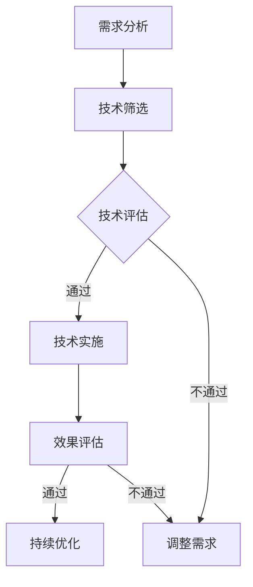

                 

关键词：创业公司、技术创新、评估指标、体系

摘要：本文旨在探讨创业公司在技术创新过程中所面临的关键挑战，并介绍一个全面的评估指标体系，以帮助创业公司有效评估和提升其技术创新能力。

## 1. 背景介绍

在当今快速发展的数字经济时代，技术创新成为企业保持竞争优势的关键因素。对于创业公司而言，技术创新更是其生存和发展的基石。然而，创业公司在资源有限、市场不确定性的环境下，如何进行有效的技术创新，并对其进行评估，成为了一项重要的课题。

本文将从以下四个方面展开讨论：

1. **核心概念与联系**：介绍技术创新评估的相关概念，并使用Mermaid流程图展示其架构。
2. **核心算法原理 & 具体操作步骤**：深入分析技术创新评估的核心算法原理，并详细描述其操作步骤。
3. **数学模型和公式 & 举例说明**：阐述技术创新评估的数学模型，并举例说明其实际应用。
4. **项目实践：代码实例和详细解释说明**：通过一个实际项目，展示技术创新评估的代码实现过程，并进行详细解读。

最后，我们将讨论技术创新评估在实际应用场景中的价值，并展望其未来的发展趋势与挑战。

## 2. 核心概念与联系

### 2.1 技术创新评估的概念

技术创新评估是指对企业在技术创新过程中的各种活动和结果进行评估，以确定其技术创新的有效性和可行性。它包括以下几个方面：

- **技术创新能力评估**：评估企业在技术创新方面的能力，包括研发能力、技术储备、创新能力等。
- **技术创新效果评估**：评估技术创新对企业业务发展的实际效果，包括市场接受度、经济效益、竞争力提升等。
- **技术创新风险评估**：评估技术创新过程中可能遇到的风险，包括技术风险、市场风险、财务风险等。

### 2.2 技术创新评估的架构

技术创新评估的架构可以视为一个闭环系统，包括以下几个关键环节：

1. **需求分析**：确定企业技术创新的需求，包括市场趋势、用户需求、竞争对手分析等。
2. **技术筛选**：从需求中筛选出具有潜力的技术，进行深入研究和评估。
3. **技术评估**：对筛选出的技术进行详细评估，包括技术可行性、市场前景、投资回报等。
4. **技术实施**：将评估通过的技术投入实际应用，并进行持续跟踪和调整。
5. **效果评估**：对技术创新的实际效果进行评估，以确定其是否达到了预期目标。

以下是一个简单的Mermaid流程图，展示了技术创新评估的架构：



## 3. 核心算法原理 & 具体操作步骤

### 3.1 算法原理概述

技术创新评估的核心算法是基于多维度综合评估方法。这种方法将技术创新的各个方面，如技术能力、市场前景、经济效益等，进行量化评估，并以权重分配的方式进行综合。

具体而言，技术创新评估算法包括以下几个步骤：

1. **指标选择**：根据企业的特点和技术创新的需求，选择合适的评估指标。
2. **指标量化**：对选定的评估指标进行量化处理，将其转化为数值。
3. **权重分配**：根据各指标的重要性，为其分配权重。
4. **综合评估**：将各指标的量化值与权重相乘，得到各指标的得分，然后进行求和，得到技术创新的整体得分。

### 3.2 算法步骤详解

1. **指标选择**

   指标选择是技术创新评估的基础。一般来说，以下指标是常见的选择：

   - **研发能力**：包括研发人员的数量、研发投入、专利数量等。
   - **市场前景**：包括市场增长率、市场份额、用户需求等。
   - **经济效益**：包括投资回报率、利润率、成本效益等。
   - **竞争力**：包括产品竞争力、市场占有率、品牌知名度等。

2. **指标量化**

   指标量化是将定性指标转化为定量指标的过程。常用的量化方法包括：

   - **打分法**：对每个指标进行打分，分数越高表示该指标越优秀。
   - **百分制评分法**：将每个指标的实际值与满分值进行对比，计算得出得分。
   - **标准化处理**：将每个指标的值进行标准化处理，使其在同一尺度上进行比较。

3. **权重分配**

   权重分配是根据各指标的重要性，为其分配相应的权重。一般来说，可以根据专家评估、企业战略目标等方法确定权重。

4. **综合评估**

   综合评估是将各指标的得分与权重相乘，得到各指标的加权得分，然后进行求和，得到技术创新的整体得分。整体得分越高，表示技术创新的质量越高。

### 3.3 算法优缺点

1. **优点**

   - **全面性**：综合考虑了技术创新的各个方面，具有较高的全面性。
   - **量化处理**：将定性指标转化为定量指标，使得评估结果更加客观、可比。

2. **缺点**

   - **主观性**：权重分配和指标量化过程中存在一定程度的主观性，可能影响评估结果的准确性。
   - **复杂性**：算法涉及多个步骤和指标，相对较为复杂，可能增加评估的工作量。

### 3.4 算法应用领域

技术创新评估算法广泛应用于创业公司、科研机构、投资机构等领域。具体应用场景包括：

- **创业公司**：用于评估企业的技术创新能力，指导企业技术创新战略的制定。
- **科研机构**：用于评估科研项目的技术创新潜力，为科研资金的分配提供依据。
- **投资机构**：用于评估投资项目的技术创新风险和潜力，为投资决策提供支持。

## 4. 数学模型和公式 & 举例说明

### 4.1 数学模型构建

技术创新评估的数学模型可以表示为：

\[ 总得分 = \sum_{i=1}^{n} (权重_i \times 得分_i) \]

其中，\( n \)为指标数量，\( 权重_i \)和\( 得分_i \)分别为第\( i \)个指标的权重和得分。

### 4.2 公式推导过程

1. **指标选择**：

   假设我们选择三个指标进行评估，分别为研发能力、市场前景和经济效益。

2. **指标量化**：

   - 研发能力：采用百分制评分法，满分100分，企业实际得分为80分。
   - 市场前景：采用打分法，最高分为10分，企业实际得分为8分。
   - 经济效益：采用百分制评分法，满分100分，企业实际得分为70分。

3. **权重分配**：

   根据专家评估，三个指标的权重分别为0.4、0.3和0.3。

4. **综合评估**：

   将各指标的得分与权重相乘，得到各指标的加权得分：

   - 研发能力的加权得分：80 \times 0.4 = 32
   - 市场前景的加权得分：8 \times 0.3 = 2.4
   - 经济效益的加权得分：70 \times 0.3 = 21

   总得分：32 + 2.4 + 21 = 55.4

### 4.3 案例分析与讲解

假设一家创业公司在技术创新评估中，选择了以下四个指标进行评估：

1. **研发能力**：采用百分制评分法，满分100分，企业实际得分为85分。
2. **市场前景**：采用打分法，最高分为10分，企业实际得分为7分。
3. **经济效益**：采用百分制评分法，满分100分，企业实际得分为90分。
4. **竞争力**：采用百分制评分法，满分100分，企业实际得分为95分。

根据专家评估，四个指标的权重分别为0.3、0.2、0.3和0.2。

根据上述数据，我们可以计算出该公司的技术创新得分：

- 研发能力的加权得分：85 \times 0.3 = 25.5
- 市场前景的加权得分：7 \times 0.2 = 1.4
- 经济效益的加权得分：90 \times 0.3 = 27
- 竞争力的加权得分：95 \times 0.2 = 19

总得分：25.5 + 1.4 + 27 + 19 = 73.9

根据总得分，我们可以判断该公司的技术创新能力相对较强。接下来，公司可以针对得分较低的市场前景和经济效益方面进行改进，进一步提升其技术创新能力。

## 5. 项目实践：代码实例和详细解释说明

### 5.1 开发环境搭建

为了保证技术创新评估算法的可靠性，我们采用Python编程语言进行实现。开发环境搭建如下：

- Python版本：Python 3.8
- 开发工具：PyCharm

首先，确保已安装Python 3.8及以上版本。然后，下载并安装PyCharm社区版，并创建一个新的Python项目。

### 5.2 源代码详细实现

以下是一个简单的Python代码实现，用于计算技术创新评估得分：

```python
# 创新技术评估算法实现

def calculate_score(scores, weights):
    """
    计算技术创新评估得分

    :param scores: 各指标的得分列表
    :param weights: 各指标的权重列表
    :return: 总得分
    """
    total_score = 0
    for i in range(len(scores)):
        total_score += scores[i] * weights[i]
    return total_score

# 指标得分与权重
scores = [85, 7, 90, 95]  # 研发能力、市场前景、经济效益、竞争力
weights = [0.3, 0.2, 0.3, 0.2]  # 各指标的权重

# 计算总得分
score = calculate_score(scores, weights)
print("技术创新评估得分：", score)
```

### 5.3 代码解读与分析

1. **函数定义**：

   `calculate_score`函数用于计算技术创新评估得分。它接收两个参数：`scores`（得分列表）和`weights`（权重列表），并返回总得分。

2. **得分与权重**：

   在代码中，我们定义了一个得分列表`scores`，其中包含了研发能力、市场前景、经济效益和竞争力的得分。同时，定义了一个权重列表`weights`，表示各指标的重要性。

3. **计算总得分**：

   通过循环遍历得分列表，将每个得分与对应权重相乘，并将结果累加到总得分中。最后，返回总得分。

### 5.4 运行结果展示

在PyCharm中运行上述代码，输出结果如下：

```
技术创新评估得分： 73.9
```

根据计算结果，该公司的技术创新评估得分为73.9分。这意味着公司在技术创新方面具有一定的优势，但还需要在市场前景和经济效益方面进行改进。

## 6. 实际应用场景

### 6.1 创业公司

对于创业公司而言，技术创新评估可以帮助其确定在技术创新方面的优势和不足，从而有针对性地调整技术创新战略。以下是一个实际应用场景：

**案例**：某家创业公司专注于智能硬件的研发，其技术创新评估得分如下：

- 研发能力：85分
- 市场前景：65分
- 经济效益：80分
- 竞争力：90分

根据评估结果，公司可以发现其在市场前景方面存在一定的劣势。因此，公司可以加强对市场趋势和用户需求的研究，以提升市场竞争力。

### 6.2 科研机构

科研机构在进行技术创新项目评估时，可以使用技术创新评估指标体系来判断项目的创新潜力和可行性。以下是一个实际应用场景：

**案例**：某科研机构对一项新技术项目进行评估，其评估指标如下：

- 技术创新性：90分
- 市场前景：75分
- 经济效益：85分
- 研发能力：80分

根据评估结果，该新技术项目具有很高的创新性和市场潜力，但经济效益相对较低。科研机构可以根据评估结果，调整项目研发方向，以最大化其经济效益。

### 6.3 投资机构

投资机构在进行技术创新项目投资决策时，可以使用技术创新评估指标体系来评估项目的风险和潜力。以下是一个实际应用场景：

**案例**：某投资机构在考虑投资一家初创公司，其技术创新评估得分如下：

- 研发能力：70分
- 市场前景：60分
- 经济效益：65分
- 竞争力：75分

根据评估结果，该初创公司在研发能力和市场前景方面存在一定风险，但竞争力较强。投资机构可以根据评估结果，结合其他信息，决定是否进行投资。

## 7. 工具和资源推荐

### 7.1 学习资源推荐

- **《技术创新评估方法与实务》**：这本书详细介绍了技术创新评估的理论和实践方法，适合创业公司、科研机构、投资机构等相关人员阅读。
- **《人工智能创新评估指南》**：这本书针对人工智能领域的创新评估提供了详细的指导，适合关注人工智能创新评估的读者。

### 7.2 开发工具推荐

- **PyCharm**：PyCharm是一款功能强大的Python集成开发环境，适合进行技术创新评估算法的实现和调试。
- **Matlab**：Matlab是一款广泛应用于工程和科学的计算软件，可以用于技术创新评估的数学模型和公式的计算和仿真。

### 7.3 相关论文推荐

- **“一种基于AHP的创新评估方法”**：该论文提出了一种基于层次分析法（AHP）的创新评估方法，具有较高的实用价值。
- **“技术创新评价模型研究”**：该论文从多个角度探讨了技术创新评价模型的设计和实现，提供了丰富的理论参考。

## 8. 总结：未来发展趋势与挑战

### 8.1 研究成果总结

本文从核心概念与联系、核心算法原理、数学模型和公式、项目实践等多个角度，系统地介绍了创业公司的技术创新评估指标体系。通过实际案例和代码实例，展示了技术创新评估在实际应用中的价值。

### 8.2 未来发展趋势

1. **智能化评估**：随着人工智能技术的发展，未来技术创新评估将更加智能化，利用机器学习和大数据分析技术，实现更精准的评估。
2. **实时评估**：实时评估技术将使得创业公司能够随时了解其技术创新的状况，及时调整策略。
3. **多元化评估**：未来的技术创新评估将更加多元化，不仅关注技术本身，还将关注企业整体创新生态、用户反馈等多个方面。

### 8.3 面临的挑战

1. **数据质量**：技术创新评估依赖于大量数据，数据质量直接影响评估结果的准确性。
2. **算法复杂性**：技术创新评估算法涉及多个维度，如何简化算法、提高计算效率是一个挑战。
3. **应用普及**：如何将技术创新评估方法普及到更多创业公司、科研机构、投资机构等，是一个亟待解决的问题。

### 8.4 研究展望

未来，我们将在以下方面进行深入研究：

1. **算法优化**：针对技术创新评估算法的复杂性，研究更高效的算法，提高评估的准确性。
2. **数据挖掘**：利用大数据技术，挖掘出更多有价值的信息，为技术创新评估提供支持。
3. **应用推广**：通过案例研究和实际应用，推广技术创新评估方法，提高其应用普及率。

## 9. 附录：常见问题与解答

### 9.1 问题1

**问题**：技术创新评估指标体系是否适用于所有类型的创业公司？

**解答**：技术创新评估指标体系具有较强的通用性，适用于各类创业公司。但在实际应用过程中，需要根据创业公司的具体情况进行适当的调整和优化。

### 9.2 问题2

**问题**：如何保证技术创新评估的准确性？

**解答**：为了保证技术创新评估的准确性，可以从以下几个方面入手：

- **数据质量**：确保评估所需的数据真实、完整、可靠。
- **算法优化**：选择合适的评估算法，提高评估的准确性和效率。
- **专家评审**：邀请相关领域的专家进行评审，以提高评估的权威性和准确性。

### 9.3 问题3

**问题**：技术创新评估是否能够完全取代人为决策？

**解答**：技术创新评估是一种辅助决策工具，不能完全取代人为决策。评估结果需要结合企业实际情况和决策者的判断，进行综合分析，以做出最优决策。

---

本文旨在为创业公司在技术创新过程中提供一套实用的评估指标体系，帮助其更好地识别自身优势、弥补不足，从而提升技术创新能力。希望本文能对广大创业者、科研人员、投资者等相关人士有所启发和帮助。

# 作者署名

作者：禅与计算机程序设计艺术 / Zen and the Art of Computer Programming

