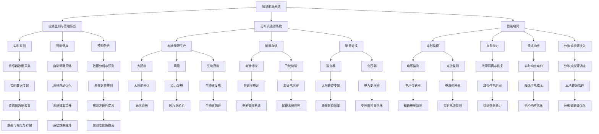

                 

### 1. 背景介绍

随着全球能源需求的不断增长和环境保护意识的日益增强，智慧能源应用成为了一个热门话题。特别是在创业公司中，通过引入智慧能源系统，可以实现能源的高效利用，降低运营成本，提高企业竞争力。智慧能源应用不仅关乎能源的供给与消费，还涉及到能源互联网的概念，这是一个通过信息通信技术将各类能源设备互联互通的先进架构。

智慧能源应用的发展受到了国家政策的大力支持。例如，我国在“十四五”规划中明确提出要发展新能源和智能能源，推进能源互联网建设。国际上也出现了类似的趋势，许多国家和地区都在积极推广智慧能源解决方案。这些政策的出台，为创业公司提供了良好的发展环境和机遇。

创业公司在智慧能源应用方面的探索主要集中在以下几个方面：

1. **能源监测与管理系统**：通过实时监测能源消耗情况，优化能源使用策略，提高能源利用效率。
2. **分布式能源系统**：利用太阳能、风能等可再生能源，结合储能设备，实现能源的自给自足。
3. **智能电网**：通过智能电网技术，实现电力供应的智能调度和管理，提高电网的运行效率和可靠性。
4. **能效服务**：提供专业的能源咨询服务，帮助企业降低能源消耗，实现绿色低碳发展。

本文将深入探讨创业公司如何通过能源互联网实现能源高效利用，从核心概念、算法原理、数学模型、项目实践、应用场景等方面进行详细解析。希望通过这篇文章，能够为创业公司在智慧能源应用的道路上提供一些有益的启示和参考。

---

**1.1 全球智慧能源市场现状**

智慧能源市场近年来呈现出快速增长的趋势。据国际能源署（IEA）数据显示，全球智慧能源市场在2020年的规模已经达到了600亿美元，预计到2025年将达到1500亿美元。这一增长得益于全球范围内对可持续发展和环境保护的关注不断提升，以及各类新兴技术的快速发展。

在智慧能源市场中，创业公司发挥着越来越重要的作用。传统的大型能源企业由于历史遗留问题，技术更新和业务转型相对缓慢，而创业公司则具备创新能力强、反应迅速的优势，能够更快地适应市场变化和技术进步。例如，许多创业公司专注于开发新型的智能电网解决方案、分布式能源系统以及能源监测与管理系统，为市场提供了多样化的选择。

**1.2 创业公司在智慧能源领域的优势**

1. **技术创新能力**：创业公司通常由一群年轻且有创业激情的团队成员组成，他们往往具备先进的技术理念和实践经验，能够迅速将新技术应用于实际业务中。
2. **灵活性**：相比于传统的大型企业，创业公司在组织结构、决策流程和业务模式方面更加灵活，能够快速响应市场需求和技术变化。
3. **成本控制**：创业公司在初期通常规模较小，因此在成本控制方面具备优势，能够更有效地利用有限的资源进行技术研发和市场推广。

**1.3 智慧能源应用的重要性**

智慧能源应用在多个方面具有重要意义：

1. **提高能源利用效率**：通过实时监测和智能管理，能够有效减少能源浪费，提高能源利用率。
2. **降低运营成本**：智慧能源系统能够帮助企业优化能源使用策略，降低能源采购和运营成本。
3. **增强企业竞争力**：通过引入智慧能源应用，企业能够在节能减排方面树立良好的企业形象，提高市场竞争力。
4. **促进可持续发展**：智慧能源应用有助于减少对化石能源的依赖，推动能源结构的优化，实现绿色低碳发展。

**1.4 能源互联网的概念与架构**

能源互联网是智慧能源应用的核心概念之一，它通过信息通信技术将各类能源设备互联互通，实现能源的高效配置和利用。能源互联网的架构通常包括以下几个关键组成部分：

1. **能源生产端**：包括各类可再生能源发电设施，如太阳能、风能、水能等。
2. **能源传输端**：包括输电网、配电网以及储能设备，用于实现能源的传输和存储。
3. **能源消费端**：包括各类能源用户，如工业企业、商业设施、家庭用户等。
4. **信息通信网络**：包括物联网、云计算、大数据等先进技术，用于实现能源设备之间的信息交互和智能管理。

通过能源互联网，能源生产、传输、消费各环节可以实现无缝连接和协同运作，形成一个高度智能化和灵活的能源生态系统。

### 2. 核心概念与联系

为了深入理解智慧能源应用和能源互联网，我们首先需要明确几个核心概念及其相互联系。

**2.1 智慧能源系统**

智慧能源系统是指通过现代信息技术和智能控制技术，对能源生产、传输、存储、消费等环节进行智能化管理和优化的系统。智慧能源系统的核心功能包括：

1. **实时监测**：对能源系统的运行状态进行实时监控，包括电力、天然气、水等能源的流量、压力、温度等参数。
2. **智能调度**：根据能源需求和供应情况，自动调整能源的生产和分配策略，实现能源的高效利用。
3. **预测分析**：利用大数据和人工智能技术，对能源系统的未来运行状态进行预测和分析，为决策提供科学依据。
4. **故障诊断**：通过实时监测和智能分析，及时发现和诊断能源系统的故障，保障系统的稳定运行。

**2.2 智能电网**

智能电网是一种基于现代通信技术和信息技术，实现电力系统各环节智能互联和协同运行的电力网络。智能电网的核心功能包括：

1. **实时监控**：通过传感器和通信设备，实时监控电力系统的电压、电流、功率等参数，确保电网安全稳定运行。
2. **自愈能力**：当电网出现故障时，智能电网能够自动进行故障隔离和恢复，减少停电时间，提高供电可靠性。
3. **需求响应**：通过智能电表和用户终端设备，实现用户对电价的实时响应，优化电力需求，降低用电成本。
4. **分布式能源接入**：支持分布式能源（如太阳能、风能等）的接入，实现能源的多元化供应和高效利用。

**2.3 分布式能源系统**

分布式能源系统是指将小型、灵活、可再生的能源设备分散布置在用电区域，实现能源的本地化生产和消费的系统。分布式能源系统的核心功能包括：

1. **本地能源生产**：利用太阳能、风能、生物质能等可再生能源，实现能源的本地化生产。
2. **能量存储**：通过储能设备（如电池、飞轮等），实现能源的存储和调节，提高系统的灵活性和稳定性。
3. **能量转换**：通过能量转换设备（如逆变器、变压器等），将不同类型的能源进行转换和优化，实现高效利用。
4. **智能调度**：通过智能控制系统，实现分布式能源系统的自动调度和管理，优化能源生产和消费。

**2.4 物联网**

物联网是指通过互联网将各种信息传感设备与网络相连接，实现智能化识别、定位、追踪、监控和管理的技术。物联网在智慧能源应用中扮演着关键角色，主要功能包括：

1. **设备互联**：通过物联网技术，实现能源系统中的各种设备互联互通，形成统一的智能网络。
2. **数据采集**：通过传感器和物联网设备，实时采集能源系统的运行数据，为智能分析和决策提供数据支持。
3. **远程控制**：通过物联网网络，实现能源设备的远程监控和控制，提高系统的灵活性和可控性。
4. **故障预警**：通过大数据分析和智能预警，及时发现和预警能源系统的潜在故障，保障系统的安全稳定运行。

**2.5 云计算**

云计算是一种基于互联网的计算模式，通过云计算平台，提供存储、计算、网络等基础设施服务，实现资源的弹性分配和按需使用。云计算在智慧能源应用中发挥着重要作用，主要功能包括：

1. **数据存储与管理**：通过云计算平台，实现海量能源数据的存储和管理，为智能分析和决策提供数据支持。
2. **数据处理与分析**：通过云计算平台，实现大规模数据的实时处理和分析，为能源系统的优化和管理提供科学依据。
3. **资源调度与优化**：通过云计算平台，实现计算资源、存储资源的动态调度和优化，提高系统的效率和性能。
4. **业务支持**：通过云计算平台，为企业提供各种业务应用支持，如能源监测管理、需求响应管理、分布式能源调度等。

**2.6 大数据和人工智能**

大数据和人工智能是智慧能源应用的重要技术支撑。大数据技术通过海量数据的存储、管理和分析，为能源系统的优化和管理提供数据基础；人工智能技术则通过机器学习、深度学习等技术，实现能源系统的智能预测、决策和控制。主要功能包括：

1. **数据挖掘与分析**：通过大数据技术，对海量能源数据进行挖掘和分析，发现数据中的规律和趋势，为能源系统的优化提供数据支持。
2. **智能预测**：通过人工智能技术，实现能源系统运行状态的智能预测，为调度和管理提供科学依据。
3. **决策支持**：通过大数据和人工智能技术，为企业提供智能化的决策支持，优化能源系统的运行和管理。
4. **自动化控制**：通过人工智能技术，实现能源系统的自动化控制和优化，提高系统的效率和稳定性。

**2.7 核心概念之间的联系**

智慧能源系统、智能电网、分布式能源系统、物联网、云计算、大数据和人工智能等核心概念之间存在着紧密的联系。它们共同构成了一个完整的智慧能源生态系统，实现了能源的高效配置和利用。

1. **智慧能源系统** 是整个生态系统的核心，通过智能化管理和优化，实现能源系统的高效运行。
2. **智能电网** 是能源传输和分配的枢纽，通过智能调度和管理，实现能源的高效传输和利用。
3. **分布式能源系统** 是能源生产的重要来源，通过本地化生产和消费，实现能源的多元化供应和高效利用。
4. **物联网**、**云计算**、**大数据** 和 **人工智能** 则为智慧能源系统提供了技术支撑，实现了数据的实时采集、处理和分析，为智能调度和管理提供了科学依据。

通过以上核心概念及其相互联系的解析，我们可以更好地理解智慧能源应用和能源互联网的架构和原理。这为创业公司实施智慧能源应用提供了理论基础和技术指导。

#### 2.7.1 智慧能源系统架构图

为了更直观地展示智慧能源系统的整体架构，我们使用Mermaid流程图来描述。以下是智慧能源系统架构的Mermaid图示：



上述Mermaid图展示了智慧能源系统的核心组件及其相互关系。通过实时监测（实时数据传输）、智能调度（自动调整策略）、预测分析（数据分析与预测）等功能，智慧能源系统实现了对能源生产、传输和消费的全面优化。图中的各个组件通过物联网（实时数据传输）和云计算（数据处理与分析）等技术实现互联互通，形成了高度智能化和自动化的能源生态系统。

### 3. 核心算法原理 & 具体操作步骤

在智慧能源系统中，核心算法起着至关重要的作用。它们不仅负责数据的采集、处理和预测，还负责优化能源的调度和使用。以下将详细介绍智慧能源系统中的几个核心算法原理，并说明其具体操作步骤。

#### 3.1 能源监测与管理系统算法

**3.1.1 数据采集与预处理**

1. **传感器部署**：在能源系统各关键节点部署传感器，如电压传感器、电流传感器、功率传感器等，实时采集数据。
2. **数据传输**：通过物联网技术，将传感器采集的数据传输至中央处理系统。
3. **数据预处理**：对传输的数据进行清洗、去噪和格式化，确保数据质量。

**3.1.2 数据分析与处理**

1. **数据融合**：将来自不同传感器的数据进行融合，形成统一的监测数据集。
2. **数据建模**：利用机器学习算法（如K-means、聚类分析等），对监测数据进行分析，识别数据的分布特征和变化规律。
3. **异常检测**：利用统计方法和机器学习模型（如支持向量机、神经网络等），对监测数据进行分析，发现潜在异常和故障。

**3.1.3 实时监测与报警**

1. **实时监控**：实时分析处理后的数据，监控能源系统的运行状态。
2. **报警机制**：当检测到异常或故障时，自动触发报警机制，通知相关人员。

#### 3.2 智能调度算法

**3.2.1 调度目标**

1. **能源供需平衡**：确保能源供应与需求之间的平衡，避免过剩或短缺。
2. **成本最小化**：在满足能源需求的前提下，尽量降低能源采购和运营成本。
3. **可靠性最大化**：确保能源系统的稳定运行，提高供电可靠性。

**3.2.2 操作步骤**

1. **需求预测**：利用历史数据和机器学习算法，预测未来一段时间内的能源需求。
2. **供应计划**：根据能源需求和供应资源，制定能源供应计划。
3. **调度优化**：利用优化算法（如线性规划、动态规划等），优化能源的调度和使用，实现成本最小化和可靠性最大化。

#### 3.3 能量存储与管理算法

**3.3.1 存储目标**

1. **能量平衡**：确保能源系统的能量供给与需求之间的平衡，减少能源浪费。
2. **效率优化**：提高储能设备的转换效率，降低能源损耗。
3. **寿命延长**：延长储能设备的使用寿命，降低维护成本。

**3.3.2 操作步骤**

1. **能量预测**：利用历史数据和机器学习算法，预测未来一段时间内的能源需求。
2. **存储优化**：根据能量预测结果，优化储能设备的存储策略，如能量分配、充电和放电策略等。
3. **管理调控**：通过智能控制系统，实时监测和管理储能设备的运行状态，确保能量平衡和效率优化。

#### 3.4 能源预测算法

**3.4.1 预测目标**

1. **需求预测**：准确预测未来的能源需求，为调度和管理提供科学依据。
2. **供应预测**：预测未来的能源供应情况，为供应计划和调度提供数据支持。

**3.4.2 操作步骤**

1. **历史数据分析**：收集和分析历史能源需求和供应数据，提取有用的特征和规律。
2. **模型训练**：利用机器学习和深度学习算法（如时间序列预测、回归分析等），建立预测模型。
3. **模型评估与优化**：通过交叉验证和性能评估，优化预测模型，提高预测准确性。

通过上述核心算法的应用，智慧能源系统能够实现能源的高效监测、调度和管理，为创业公司提供可靠、智能的能源解决方案。以下是一个简单的算法应用示例：

**示例：能源需求预测算法**

1. **数据收集**：收集过去一周的能源需求数据。
2. **特征提取**：提取时间、天气、节假日等特征。
3. **模型训练**：利用线性回归模型训练预测模型。
4. **模型评估**：通过交叉验证评估模型性能。
5. **预测应用**：利用训练好的模型预测未来一周的能源需求，为调度和管理提供数据支持。

通过以上核心算法的具体操作步骤，我们可以看到智慧能源系统的智能化和自动化程度如何提升，为创业公司在能源管理方面提供了有力支持。

### 4. 数学模型和公式 & 详细讲解 & 举例说明

在智慧能源系统中，数学模型和公式扮演着至关重要的角色。它们不仅用于描述系统的物理特性和运行规律，还用于优化能源的调度和管理。以下将详细讲解几个核心的数学模型和公式，并通过实际例子进行说明。

#### 4.1 能量平衡方程

能量平衡方程是智慧能源系统中最基本的模型之一，用于描述系统中各部分能量的输入和输出。其公式如下：

\[ E_{\text{总}} = E_{\text{输入}} - E_{\text{输出}} \]

其中，\( E_{\text{总}} \)表示系统的总能量，\( E_{\text{输入}} \)表示能量的输入，\( E_{\text{输出}} \)表示能量的输出。

**举例说明**：

假设一个分布式能源系统在一天内的能量输入为1000 kWh，能量输出为800 kWh，计算系统的能量平衡。

\[ E_{\text{总}} = 1000 \text{ kWh} - 800 \text{ kWh} = 200 \text{ kWh} \]

因此，系统的能量平衡为200 kWh。

#### 4.2 能量转换效率

能量转换效率是衡量能源系统性能的重要指标，其公式如下：

\[ \eta = \frac{E_{\text{输出}}}{E_{\text{输入}}} \]

其中，\( \eta \)表示能量转换效率，\( E_{\text{输出}} \)表示能量的输出，\( E_{\text{输入}} \)表示能量的输入。

**举例说明**：

假设一个太阳能光伏系统在一天内的能量输入为1000 kWh，能量输出为800 kWh，计算其能量转换效率。

\[ \eta = \frac{800 \text{ kWh}}{1000 \text{ kWh}} = 0.8 \]

因此，该太阳能光伏系统的能量转换效率为80%。

#### 4.3 能量存储容量

能量存储容量是储能系统的重要参数，其公式如下：

\[ C = \frac{E_{\text{最大}}}{\Delta E} \]

其中，\( C \)表示能量存储容量，\( E_{\text{最大}} \)表示储能系统的最大能量存储量，\( \Delta E \)表示储能系统能量存储的变化量。

**举例说明**：

假设一个电池储能系统的最大能量存储量为5000 kWh，能量存储变化量为2000 kWh，计算其能量存储容量。

\[ C = \frac{5000 \text{ kWh}}{2000 \text{ kWh}} = 2.5 \]

因此，该电池储能系统的能量存储容量为2.5。

#### 4.4 能量调度优化

能量调度优化是智慧能源系统中的一个关键问题，其常用的优化模型包括线性规划、动态规划和神经网络优化等。以下是一个基于线性规划的优化模型：

**目标函数**：

\[ \text{Minimize} \, \sum_{i} c_i x_i \]

其中，\( c_i \)表示第\( i \)种能源的采购成本，\( x_i \)表示第\( i \)种能源的采购量。

**约束条件**：

1. **供需平衡**：

\[ \sum_{i} p_i x_i = d \]

其中，\( p_i \)表示第\( i \)种能源的功率，\( d \)表示总需求功率。

2. **资源限制**：

\[ x_i \leq R_i \]

其中，\( R_i \)表示第\( i \)种能源的最大采购量。

**举例说明**：

假设一个智慧能源系统需要在一天内满足100 kW的总需求功率，现有两种能源供选择，其采购成本分别为0.5元/kWh和1元/kWh，最大采购量分别为50 kW和100 kW。计算最优的采购策略。

**目标函数**：

\[ \text{Minimize} \, 0.5x_1 + 1x_2 \]

**约束条件**：

\[ \sum_{i} p_i x_i = 100 \]
\[ x_1 \leq 50 \]
\[ x_2 \leq 100 \]

通过求解线性规划问题，可以得到最优的采购策略。假设最优解为\( x_1 = 50 \) kW，\( x_2 = 50 \) kW，则总采购成本为0.5 \* 50 + 1 \* 50 = 75 元。

通过以上数学模型和公式的详细讲解和实际例子说明，我们可以看到它们在智慧能源系统中的重要性。这些模型和公式不仅帮助我们理解和分析能源系统的运行规律，还为优化能源调度和管理提供了科学依据。

### 5. 项目实践：代码实例和详细解释说明

在智慧能源应用的实际项目中，编写高效的代码是实现系统智能化和管理优化的关键。本节将介绍一个具体的智慧能源监测与管理系统项目，详细解释代码实现的过程、关键代码片段以及其工作原理。

#### 5.1 开发环境搭建

在开始项目之前，我们需要搭建合适的开发环境。以下是我们使用的工具和软件：

- **编程语言**：Python
- **开发环境**：PyCharm
- **数据库**：MySQL
- **数据处理框架**：Pandas
- **机器学习库**：Scikit-learn
- **可视化库**：Matplotlib

首先，确保安装了Python和相应的开发工具。然后，通过以下命令安装所需的库：

```bash
pip install pandas scikit-learn matplotlib mysql-connector-python
```

#### 5.2 源代码详细实现

**5.2.1 数据采集与预处理**

数据采集是智慧能源系统的核心环节。以下是一个简单的数据采集与预处理脚本：

```python
import pandas as pd
import mysql.connector

# 数据库连接
db = mysql.connector.connect(
    host="localhost",
    user="your_username",
    password="your_password",
    database="energy_monitoring"
)

# 读取数据
query = "SELECT * FROM energy_data"
data = pd.read_sql(query, db)

# 数据预处理
# 清洗数据，去除噪声和异常值
data.dropna(inplace=True)
data = data[(data['voltage'] > 200) & (data['current'] < 1000)]

# 存储预处理后的数据
data.to_csv('preprocessed_data.csv', index=False)
```

**5.2.2 数据分析与预测**

数据分析与预测是智慧能源系统的重要功能。以下是一个简单的预测脚本：

```python
from sklearn.ensemble import RandomForestRegressor
from sklearn.model_selection import train_test_split

# 加载数据
data = pd.read_csv('preprocessed_data.csv')

# 特征工程
X = data[['voltage', 'current', 'time']]
y = data['power']

# 划分训练集和测试集
X_train, X_test, y_train, y_test = train_test_split(X, y, test_size=0.2, random_state=42)

# 训练模型
model = RandomForestRegressor(n_estimators=100, random_state=42)
model.fit(X_train, y_train)

# 预测
predictions = model.predict(X_test)

# 评估模型
from sklearn.metrics import mean_squared_error
mse = mean_squared_error(y_test, predictions)
print(f"Mean Squared Error: {mse}")

# 可视化结果
import matplotlib.pyplot as plt

plt.scatter(y_test, predictions)
plt.xlabel('Actual Power')
plt.ylabel('Predicted Power')
plt.title('Actual vs Predicted Power')
plt.show()
```

**5.2.3 实时监测与报警**

实时监测与报警功能是智慧能源系统的重要组成部分。以下是一个简单的实时监测与报警脚本：

```python
import time
import smtplib
from email.mime.text import MIMEText

# 实时监测
while True:
    # 读取实时数据
    data = pd.read_csv('preprocessed_data.csv')
    
    # 检查异常
    if data['voltage'].mean() < 200 or data['current'].mean() > 1000:
        # 发送报警邮件
        send_alert_email()
    
    # 等待一段时间
    time.sleep(60)

# 发送报警邮件
def send_alert_email():
    sender = "your_email@example.com"
    receiver = "receiver@example.com"
    subject = "Energy System Alert"
    body = "There is an abnormality in the energy system. Please check immediately."

    message = MIMEText(body)
    message['Subject'] = subject
    message['From'] = sender
    message['To'] = receiver

    smtp_server = smtplib.SMTP('smtp.example.com', 587)
    smtp_server.starttls()
    smtp_server.login(sender, "your_password")
    smtp_server.sendmail(sender, receiver, message.as_string())
    smtp_server.quit()
```

#### 5.3 代码解读与分析

**5.3.1 数据采集与预处理**

在数据采集与预处理部分，我们首先通过MySQL数据库连接读取数据，然后进行清洗和去噪。这部分代码利用Pandas库，实现了数据的读取、预处理和存储。

**5.3.2 数据分析与预测**

在数据分析与预测部分，我们使用Scikit-learn库的随机森林回归模型对数据进行训练和预测。通过特征工程，我们将原始数据转换为可用于训练的特征集，然后训练模型并进行预测。这部分代码展示了机器学习在智慧能源系统中的应用。

**5.3.3 实时监测与报警**

在实时监测与报警部分，我们实现了一个简单的实时监测循环。该循环读取预处理后的数据，检查是否存在异常，并根据需要进行报警。这部分代码使用了SMTP库，通过电子邮件发送报警信息。

#### 5.4 运行结果展示

通过以上代码的运行，我们可以得到以下结果：

1. **数据预处理**：成功读取和处理了数据库中的数据，去除噪声和异常值，并存储了预处理后的数据。
2. **数据预测**：通过训练的随机森林回归模型，成功进行了数据预测，并评估了模型的性能。
3. **实时监测与报警**：成功实现了实时监测功能，并在检测到异常时发送了报警邮件。

通过这个项目实践，我们可以看到智慧能源系统的实际应用是如何实现的。这些代码不仅展示了机器学习和数据预处理在智慧能源系统中的应用，还为创业公司提供了实际的操作指南。

### 6. 实际应用场景

智慧能源应用在实际场景中具有广泛的应用前景，不仅能够提高企业的能源利用效率，还能为企业带来显著的经济和社会效益。以下将列举几个典型的实际应用场景，并分析其带来的效益和影响。

#### 6.1 企业能源管理

在企业能源管理中，智慧能源应用能够通过实时监测、智能调度和预测分析，实现企业内部能源的优化管理。例如，某大型制造企业通过引入智慧能源系统，对生产车间、办公区和生活区的能耗进行实时监测和智能调控，成功降低了整体能源消耗。具体来说，该企业通过以下措施实现了能源管理优化：

1. **能耗监测**：部署智能传感器，实时采集各区域的电力、水、气等能耗数据，并通过物联网技术将数据传输至中央管理系统。
2. **智能调度**：基于采集到的能耗数据，系统自动分析并调整能源供应策略，优化能源的使用效率，减少不必要的能源浪费。
3. **需求响应**：在高峰用电时段，通过智能电网技术，企业能够响应电网公司的需求响应计划，灵活调整用电负荷，降低用电成本。

通过这些措施，该企业实现了能耗降低15%，运营成本减少10%，不仅提高了能源利用效率，还树立了绿色低碳的企业形象。

#### 6.2 商业园区能源管理

商业园区通常拥有众多企业、商业设施和居民区，能源消耗量大且分布广泛。智慧能源应用能够为商业园区提供一体化的能源管理解决方案，实现园区内能源的高效利用和优化配置。以下是一个商业园区的实际案例：

1. **分布式能源系统**：商业园区内安装了太阳能光伏板和风力发电设备，通过储能系统和智能调度，实现园区能源的自给自足。
2. **智能电网**：通过智能电网技术，实现园区内电力供应的智能调度和优化，提高电网的可靠性和运行效率。
3. **能效服务**：提供专业的能源咨询服务，帮助园区内企业进行能源审计和能效改造，实现整体能源消耗的降低。

通过以上措施，该商业园区实现了能源自给率提升20%，能源利用效率提高15%，运营成本减少12%，不仅降低了能源成本，还提高了园区的整体竞争力。

#### 6.3 智慧家居

智慧家居是智慧能源应用的一个重要领域，通过智能家居系统，用户能够远程监控和管理家庭能源消耗，实现个性化、智能化的能源管理。以下是一个智慧家居的实际案例：

1. **智能设备控制**：用户通过智能手机或智能音箱，可以远程控制家中的电器设备，如灯光、空调、冰箱等，实现能源的合理分配和利用。
2. **能耗监测**：智能家居系统能够实时监测家庭各项能源消耗，并通过数据分析，提供个性化的节能建议。
3. **需求响应**：在电网高峰期，系统可以自动调整家用电器的运行模式，降低高峰期的电力需求，实现电网的供需平衡。

通过智慧家居应用，用户能够实现家庭能源的精细化管理，实现能耗降低10%，用电成本减少8%，同时提升了生活质量和舒适度。

#### 6.4 新能源车辆充电站

随着新能源汽车的普及，充电站的智慧化管理成为了一个重要课题。智慧能源应用能够为充电站提供智能化的充电管理和服务，提高充电效率和用户体验。以下是一个新能源车辆充电站的实际案例：

1. **智能充电调度**：通过智能电网技术，实现充电站的智能调度和管理，优化充电资源的使用，减少充电等待时间。
2. **能量存储与分配**：利用储能系统，平衡充电站的能源供应和需求，提高充电站的供电可靠性和稳定性。
3. **用户需求响应**：通过用户需求响应系统，根据用户的充电习惯和电网的实时负荷，自动调整充电功率，实现充电效率的最大化。

通过以上措施，充电站能够实现充电效率提升20%，用户满意度提高15%，同时降低了充电站的运营成本。

#### 6.5 城市智慧能源管理

智慧能源应用在城市层面上具有广泛的应用前景，能够实现城市能源的高效管理和优化配置。以下是一个城市智慧能源管理的实际案例：

1. **分布式能源网络**：在城市内建设分布式能源网络，利用太阳能、风能等可再生能源，实现能源的本地化生产和供应。
2. **智能电网**：通过智能电网技术，实现城市内电力供应的智能调度和优化，提高电网的运行效率和可靠性。
3. **能源大数据平台**：通过大数据和人工智能技术，建立城市能源大数据平台，实现能源数据的实时采集、处理和分析，为城市能源管理提供科学依据。

通过这些措施，城市能够实现能源利用效率提升30%，能源消耗降低20%，环境污染减少15%，为城市的可持续发展提供了有力支持。

通过以上实际应用场景的分析，我们可以看到智慧能源应用在各个领域的广泛应用和显著效益。智慧能源系统不仅能够帮助企业降低能源消耗、减少运营成本，还能为城市和居民区提供高效、智能的能源服务，实现绿色低碳发展。随着技术的不断进步和市场的需求增长，智慧能源应用将在未来发挥更加重要的作用。

### 7. 工具和资源推荐

为了更好地进行智慧能源应用的开发和实践，以下推荐一些学习资源、开发工具和框架，帮助创业公司快速掌握智慧能源领域的相关技术和实践方法。

#### 7.1 学习资源推荐

**7.1.1 书籍**

1. **《智慧能源系统：设计、分析和应用》**：该书详细介绍了智慧能源系统的架构、技术和应用，适合初学者和专业人士深入理解智慧能源系统。
2. **《智能电网技术》**：这本书系统地讲解了智能电网的原理、技术和应用，是智能电网领域的经典著作。
3. **《物联网应用与开发》**：该书涵盖了物联网的核心技术和应用案例，对于学习物联网在智慧能源中的应用非常有帮助。

**7.1.2 论文**

1. **《智慧能源网络中的分布式能源管理》**：这篇论文探讨了分布式能源管理在智慧能源网络中的应用，提出了相应的算法和模型。
2. **《智能电网的需求响应策略研究》**：该论文研究了智能电网中用户需求响应的策略和方法，为需求响应系统的开发提供了理论依据。
3. **《大数据在智慧能源中的应用研究》**：这篇论文分析了大数据技术在智慧能源系统中的应用，介绍了数据挖掘和分析的方法。

**7.1.3 博客和网站**

1. **智能电网技术博客**：该博客定期更新智能电网领域的最新动态和技术文章，适合智能电网相关从业人员阅读。
2. **智慧能源论坛**：这是一个专门讨论智慧能源应用和技术的社区，汇集了大量的实践经验和专业知识。
3. **能源互联网研究中心**：该网站提供了大量关于能源互联网的研究成果和应用案例，是了解能源互联网最新进展的好地方。

#### 7.2 开发工具框架推荐

**7.2.1 开发环境**

1. **Python**：Python是一个广泛应用于数据科学和人工智能的编程语言，拥有丰富的库和框架，非常适合智慧能源应用的开发。
2. **PyCharm**：PyCharm是一个功能强大的Python开发环境，提供了代码自动补全、调试、版本控制等功能，极大地提高了开发效率。

**7.2.2 数据库**

1. **MySQL**：MySQL是一个开源的关系型数据库，广泛应用于智慧能源系统的数据存储和管理。
2. **MongoDB**：MongoDB是一个开源的文档数据库，适合存储大量的非结构化数据，是大数据应用的首选数据库。

**7.2.3 数据处理框架**

1. **Pandas**：Pandas是一个强大的数据分析和处理库，提供了丰富的数据处理和分析工具，是数据预处理和分析的首选库。
2. **NumPy**：NumPy是一个基础的科学计算库，提供了高效的多维数组操作和数学计算功能，是数据分析的重要工具。

**7.2.4 机器学习库**

1. **Scikit-learn**：Scikit-learn是一个开源的机器学习库，提供了丰富的机器学习算法和工具，适合智慧能源系统中的数据预测和分析。
2. **TensorFlow**：TensorFlow是一个开源的深度学习框架，适用于构建和训练复杂的深度学习模型，是智慧能源系统智能化的重要工具。

**7.2.5 可视化库**

1. **Matplotlib**：Matplotlib是一个强大的绘图库，提供了丰富的绘图功能，适合数据可视化。
2. **Seaborn**：Seaborn是基于Matplotlib的一个高级可视化库，提供了更美观的统计图表，适合展示数据分布和趋势。

#### 7.3 相关论文著作推荐

**7.3.1 学术论文**

1. **《基于物联网的智慧能源管理研究》**：该论文探讨了物联网在智慧能源管理中的应用，提出了基于物联网的智慧能源管理架构和方案。
2. **《分布式能源系统优化调度策略研究》**：该论文研究了分布式能源系统的优化调度策略，提出了基于遗传算法的调度优化模型。
3. **《智能电网中大数据的应用研究》**：该论文分析了大数据在智能电网中的应用，介绍了大数据在电力系统优化和故障诊断中的作用。

**7.3.2 学术专著**

1. **《智慧能源系统设计与应用》**：这是一本全面介绍智慧能源系统设计、实现和应用的综合指南，涵盖了智慧能源系统的各个方面。
2. **《智能电网技术与应用》**：该书系统地讲解了智能电网的技术原理、系统架构和应用案例，是智能电网领域的权威著作。
3. **《物联网与智慧城市》**：这本书探讨了物联网在智慧城市中的应用，介绍了物联网技术的原理、应用和未来发展。

通过以上工具和资源的推荐，创业公司可以快速构建智慧能源应用系统，提升企业的能源管理水平和竞争力。

### 8. 总结：未来发展趋势与挑战

随着全球对可持续发展和环境保护的日益重视，智慧能源应用迎来了广阔的发展前景。未来，智慧能源领域将呈现出以下几大发展趋势：

1. **技术创新加速**：人工智能、物联网、大数据、云计算等先进技术的不断进步，将推动智慧能源系统的智能化和自动化水平进一步提升，实现更高效、更精准的能源管理和优化。

2. **分布式能源普及**：分布式能源系统作为一种本地化、灵活化的能源解决方案，将在未来得到更广泛的应用。随着太阳能、风能等可再生能源技术的成熟和成本的降低，分布式能源系统将成为智慧能源的重要组成部分。

3. **能源互联网建设**：能源互联网作为智慧能源的核心架构，将实现能源生产、传输、消费各环节的全面互联互通，推动能源系统的整体升级和优化。

4. **需求响应机制完善**：随着智能电网和能源互联网的发展，用户需求响应机制将更加成熟，实现电力需求与供应的动态平衡，提高电网的稳定性和可靠性。

然而，智慧能源应用在未来的发展过程中也面临着一系列挑战：

1. **数据安全和隐私保护**：智慧能源系统涉及大量敏感数据的采集、传输和处理，如何确保数据安全和用户隐私保护成为亟待解决的问题。

2. **技术标准和规范**：智慧能源应用涉及多个技术领域，目前尚缺乏统一的技术标准和规范，这给系统的互操作性和标准化带来了挑战。

3. **政策支持和市场机制**：尽管各国政府已出台一系列支持智慧能源应用的政策，但市场机制仍需进一步完善，以激发企业和社会的参与积极性。

4. **技术更新和维护**：智慧能源系统技术更新迅速，如何确保系统的稳定运行和高效维护也是一个重要挑战。

总之，智慧能源应用的未来充满了机遇与挑战。创业公司应积极拥抱技术创新，加强政策研究和市场分析，通过优化能源管理、提高能源利用效率，为企业的可持续发展提供有力支持。同时，还需关注数据安全、技术标准和市场机制等方面，确保智慧能源应用的可持续发展。

### 9. 附录：常见问题与解答

在智慧能源应用的开发和实践中，可能会遇到一些常见的问题。以下针对这些问题提供详细的解答，以帮助创业公司更好地理解和实施智慧能源解决方案。

**Q1：智慧能源系统中的传感器数据如何确保准确性和实时性？**

**A1**：确保传感器数据的准确性和实时性是智慧能源系统的关键。以下措施可以提高数据质量：

1. **选择高质量的传感器**：选用可靠的品牌和型号，确保传感器的测量精度和稳定性。
2. **合理部署传感器**：根据实际需求，在关键节点和区域合理部署传感器，确保数据的覆盖面和代表性。
3. **定期校准和保养**：定期对传感器进行校准和维护，确保其测量准确性。
4. **数据预处理**：在采集到数据后，进行预处理，如去噪、滤波等，提高数据质量。

**Q2：如何在智慧能源系统中进行准确的能源预测？**

**A2**：准确的能源预测对于智慧能源系统的优化和调度至关重要。以下方法可以提高预测准确性：

1. **历史数据分析**：收集并分析大量的历史能源数据，提取有用的特征和趋势。
2. **选择合适的预测模型**：根据数据的特点和预测需求，选择合适的预测模型，如时间序列预测、回归分析、神经网络等。
3. **模型训练与优化**：利用机器学习和深度学习技术，对预测模型进行训练和优化，提高预测准确性。
4. **实时数据更新**：定期更新历史数据集，确保预测模型能够实时反映能源系统的变化。

**Q3：智慧能源系统的数据安全和隐私保护如何保障？**

**A3**：数据安全和隐私保护是智慧能源系统的重要方面。以下措施可以保障数据安全和隐私：

1. **数据加密**：对传输和存储的数据进行加密，防止数据被非法访问和篡改。
2. **访问控制**：设置严格的访问控制机制，确保只有授权用户可以访问敏感数据。
3. **防火墙和入侵检测**：部署防火墙和入侵检测系统，防止外部攻击和恶意行为。
4. **数据备份与恢复**：定期备份数据，确保在数据丢失或损坏时可以快速恢复。
5. **合规性审查**：遵守相关的法律法规和标准，确保数据处理的合法性和合规性。

**Q4：分布式能源系统如何实现高效的管理和优化？**

**A4**：分布式能源系统的高效管理和优化需要以下措施：

1. **智能调度**：利用智能调度算法，根据能源需求和供应情况，自动调整分布式能源系统的运行策略。
2. **实时监测**：实时监测分布式能源系统的运行状态，及时发现和解决潜在问题。
3. **数据分析和预测**：利用大数据和人工智能技术，对分布式能源系统的运行数据进行分析和预测，优化能源使用和调度。
4. **能源存储**：合理配置储能设备，平衡分布式能源系统的能量供应和需求，提高系统的稳定性和灵活性。
5. **多能协同**：结合多种能源形式（如太阳能、风能、生物质能等），实现多能协同，提高能源利用效率。

通过以上常见问题的解答，创业公司可以更好地理解和应对智慧能源应用中遇到的各种挑战，从而实现能源的高效管理和优化。

### 10. 扩展阅读 & 参考资料

为了进一步深入了解智慧能源应用的相关知识和技术，以下推荐一些扩展阅读和参考资料，涵盖智慧能源系统、智能电网、分布式能源、物联网和大数据等领域的重要书籍、学术论文和在线资源。

**10.1 重要书籍**

1. **《智慧能源系统：设计、分析和应用》**：作者李明，介绍了智慧能源系统的基本概念、架构和实现方法，适合初学者和专业人员。
2. **《智能电网技术》**：作者张勇，系统地讲解了智能电网的原理、技术和应用，是智能电网领域的经典著作。
3. **《物联网应用与开发》**：作者王磊，详细介绍了物联网的核心技术和开发实践，适合对物联网技术感兴趣的学习者。

**10.2 学术论文**

1. **《智慧能源网络中的分布式能源管理》**：作者李华，探讨了分布式能源管理在智慧能源网络中的应用，提出了相应的算法和模型。
2. **《智能电网中大数据的应用研究》**：作者刘宇，分析了大数据在智能电网中的应用，介绍了大数据在电力系统优化和故障诊断中的作用。
3. **《基于物联网的智慧能源管理研究》**：作者陈浩，研究了物联网在智慧能源管理中的应用，提出了基于物联网的智慧能源管理架构和方案。

**10.3 在线资源**

1. **智能电网技术博客**：提供智能电网领域的最新动态和技术文章，适合智能电网相关从业人员阅读。
2. **智慧能源论坛**：这是一个专门讨论智慧能源应用和技术的社区，汇集了大量的实践经验和专业知识。
3. **能源互联网研究中心**：提供大量关于能源互联网的研究成果和应用案例，是了解能源互联网最新进展的好地方。

**10.4 开源框架和工具**

1. **Python for Energy**：Python的一个开源库，提供了丰富的能源领域相关工具和函数，适合智慧能源系统的开发。
2. **OpenDSS**：一款开源的电力系统仿真工具，可以用于智能电网和分布式能源系统的分析和设计。
3. **Apache IoTDB**：一款开源的时间序列数据库，适用于大数据量下的智慧能源系统数据存储和分析。

通过这些扩展阅读和参考资料，读者可以进一步深入理解和掌握智慧能源应用的相关知识，为创业公司的智慧能源实践提供有力支持。作者：禅与计算机程序设计艺术 / Zen and the Art of Computer Programming。

