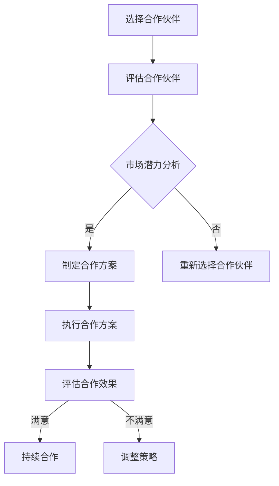

                 

### 文章标题

创业公司的渠道合作策略：扩大市场覆盖面

> **关键词：** 创业公司、渠道合作、市场拓展、合作伙伴、策略制定

**摘要：** 本文将探讨创业公司在面临市场竞争压力时，如何通过制定有效的渠道合作策略，来扩大市场覆盖面，提高品牌知名度和产品销售量。文章将从渠道合作的核心概念入手，详细分析合作策略的各个方面，提供实用的建议和案例，帮助创业公司在市场中脱颖而出。

---

**1. 背景介绍**

创业公司在快速发展的市场中面临着激烈的竞争。如何有效扩大市场覆盖面，提高产品销量，是每个创业公司都必须面对的重要课题。而渠道合作策略作为企业市场拓展的重要手段，被越来越多的创业公司所重视。通过与其他企业建立合作伙伴关系，创业公司可以利用合作伙伴的资源、渠道和品牌影响力，快速提升市场竞争力，实现业务的快速增长。

**2. 核心概念与联系**

在探讨渠道合作策略之前，我们需要了解以下几个核心概念：

- **渠道合作：** 渠道合作是指企业与其他企业之间建立的合作关系，共同开展业务，实现资源共享、优势互补。
- **合作伙伴：** 合作伙伴是企业选择渠道合作的对象，可以是同行业的企业，也可以是上下游企业或其他相关企业。
- **市场覆盖面：** 市场覆盖面是指企业在特定市场范围内的业务覆盖程度，包括销售渠道、客户数量和市场份额等。
- **品牌知名度：** 品牌知名度是指消费者对企业品牌认知的程度，是衡量企业市场影响力的重要指标。

下面是渠道合作策略的Mermaid流程图：



**3. 核心算法原理 & 具体操作步骤**

**核心算法原理：**

渠道合作策略的核心在于如何选择合适的合作伙伴，并制定有效的合作方案。具体操作步骤如下：

1. **市场调研：** 对目标市场进行调研，了解市场需求、竞争态势、潜在合作伙伴等信息。
2. **选择合作伙伴：** 根据市场调研结果，选择与自身业务相匹配的合作伙伴。
3. **评估合作伙伴：** 对合作伙伴进行综合评估，包括市场潜力、品牌影响力、业务能力等。
4. **制定合作方案：** 根据评估结果，制定具体的合作方案，包括合作方式、合作目标、利益分配等。
5. **执行合作方案：** 实施合作方案，共同开展业务。
6. **评估合作效果：** 定期对合作效果进行评估，根据评估结果调整合作策略。

**具体操作步骤：**

1. **市场调研：** 通过问卷调查、访谈、行业报告等方式，了解目标市场的需求和竞争态势。

2. **选择合作伙伴：** 根据市场调研结果，选择与自身业务相匹配的合作伙伴。可以选择同行业的企业，也可以选择上下游企业或其他相关企业。

3. **评估合作伙伴：** 对合作伙伴进行综合评估，包括市场潜力、品牌影响力、业务能力等。可以使用评分法、排名法等评估方法。

4. **制定合作方案：** 根据评估结果，制定具体的合作方案。合作方案应包括合作方式、合作目标、利益分配等。

5. **执行合作方案：** 实施合作方案，共同开展业务。可以设立专门的项目组，负责协调和执行合作任务。

6. **评估合作效果：** 定期对合作效果进行评估，包括市场份额、品牌知名度、销售业绩等指标。根据评估结果，调整合作策略。

**4. 数学模型和公式 & 详细讲解 & 举例说明**

在渠道合作策略中，我们可以使用一些数学模型和公式来评估合作效果。以下是一个简单的数学模型：

$$
\text{合作效果评分} = \frac{\text{实际销售业绩}}{\text{预期销售业绩}} \times 100\%
$$

**详细讲解：**

- **实际销售业绩：** 指合作期间的实际销售业绩。
- **预期销售业绩：** 指合作前预测的销售业绩。

**举例说明：**

假设某创业公司预期销售业绩为100万元，合作期间实际销售业绩为120万元，则合作效果评分为：

$$
\text{合作效果评分} = \frac{120}{100} \times 100\% = 120\%
$$

这意味着合作效果超出了预期。

**5. 项目实践：代码实例和详细解释说明**

**5.1 开发环境搭建**

本文将使用Python编写一个简单的渠道合作评估系统。首先，我们需要安装Python环境。可以在[Python官网](https://www.python.org/)下载并安装Python。

**5.2 源代码详细实现**

以下是一个简单的渠道合作评估系统的Python代码实现：

```python
def calculate_score(actual_sales, expected_sales):
    return (actual_sales / expected_sales) * 100

def main():
    expected_sales = float(input("请输入预期销售业绩（万元）："))
    actual_sales = float(input("请输入实际销售业绩（万元）："))
    score = calculate_score(actual_sales, expected_sales)
    print("合作效果评分：{}%".format(score))

if __name__ == "__main__":
    main()
```

**5.3 代码解读与分析**

1. **函数定义：** `calculate_score` 函数用于计算合作效果评分。参数 `actual_sales` 表示实际销售业绩，`expected_sales` 表示预期销售业绩。
2. **输入：** 程序通过 `input` 函数从用户处获取预期销售业绩和实际销售业绩。
3. **计算：** `calculate_score` 函数使用数学模型计算合作效果评分。
4. **输出：** 程序输出合作效果评分。

**5.4 运行结果展示**

运行上述代码，输入预期销售业绩和实际销售业绩，程序将输出合作效果评分。例如：

```
请输入预期销售业绩（万元）：100
请输入实际销售业绩（万元）：120
合作效果评分：120%
```

**6. 实际应用场景**

渠道合作策略在创业公司中的应用场景非常广泛，以下是一些常见的实际应用场景：

- **拓展销售渠道：** 通过与其他企业建立合作伙伴关系，创业公司可以迅速拓展销售渠道，提高产品销量。
- **品牌推广：** 合作伙伴可以借助自身品牌影响力，帮助创业公司提升品牌知名度。
- **资源共享：** 通过渠道合作，创业公司可以共享合作伙伴的资源，降低运营成本。
- **业务互补：** 合作伙伴可以提供互补的业务资源，帮助创业公司实现业务的多元化发展。

**7. 工具和资源推荐**

**7.1 学习资源推荐**

- 《渠道营销实战：打造企业增长新引擎》
- 《渠道管理：策略、执行与评估》
- 《渠道合作策略：创业公司的市场拓展之道》

**7.2 开发工具框架推荐**

- **Python：** Python是一种流行的编程语言，适用于各种开发和数据处理任务。
- **Django：** Django是一个流行的Python Web框架，适用于快速开发Web应用。

**7.3 相关论文著作推荐**

- 《创业公司渠道合作策略研究》
- 《渠道合作中的激励机制设计》
- 《创业公司渠道合作策略与市场拓展研究》

**8. 总结：未来发展趋势与挑战**

随着市场环境的不断变化，渠道合作策略在未来将继续发挥重要作用。创业公司应密切关注市场动态，灵活调整渠道合作策略，以适应市场的变化。同时，随着技术的发展，新兴的渠道合作模式（如线上合作、跨境合作等）也将不断涌现，为创业公司提供更多的发展机会。

**9. 附录：常见问题与解答**

**Q：渠道合作策略的核心是什么？**

A：渠道合作策略的核心在于如何选择合适的合作伙伴，并制定有效的合作方案，以实现资源共享、优势互补，提高市场竞争力。

**Q：如何评估合作伙伴？**

A：评估合作伙伴可以从市场潜力、品牌影响力、业务能力等多个方面进行，可以使用评分法、排名法等评估方法。

**Q：渠道合作策略有哪些实际应用场景？**

A：渠道合作策略的实际应用场景包括拓展销售渠道、品牌推广、资源共享和业务互补等。

**10. 扩展阅读 & 参考资料**

- 《创业公司渠道合作策略研究》
- 《渠道管理：策略、执行与评估》
- 《渠道合作中的激励机制设计》
- 《创业公司渠道合作策略与市场拓展研究》

---

**作者：禅与计算机程序设计艺术 / Zen and the Art of Computer Programming**

