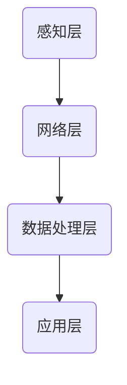
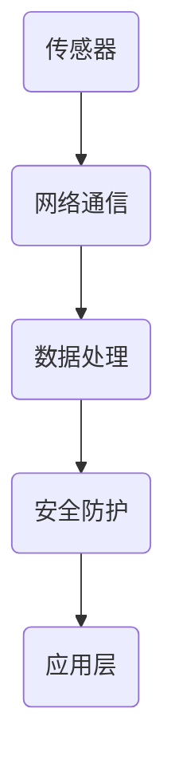

                 

### 背景介绍

物联网（Internet of Things，简称IoT）作为当前科技领域的前沿，正在逐步改变着我们的生活方式和工作模式。物联网的核心思想是将物理世界中的各种设备、传感器、系统和数据源通过互联网进行连接，实现信息的采集、传输、处理和反馈，进而达到智能化的目的。

对于创业公司而言，物联网技术提供了一个广阔的发展空间。通过IoT，创业公司可以创新业务模式，提高运营效率，优化用户体验，甚至开辟全新的市场。然而，物联网技术的应用并非一蹴而就，它需要公司在技术选型、架构设计、数据安全、系统维护等多个方面进行深思熟虑。

本文将围绕创业公司的物联网应用展开，探讨如何通过IoT技术实现万物互联。文章首先介绍物联网的基本概念和发展趋势，然后深入探讨物联网的关键技术，包括传感器技术、网络通信技术、数据处理技术和安全防护技术。接着，我们将结合具体实例，详细阐述物联网应用的实现步骤和注意事项。最后，文章将总结物联网在创业公司中的应用前景，并提出未来可能面临的技术挑战。

通过本文的阅读，创业公司可以更全面地了解物联网技术，从而为将物联网应用到自身业务中奠定坚实的基础。无论您是刚起步的初创团队，还是希望优化现有业务的成熟企业，本文都将为您在物联网应用的道路上提供有益的指导和启示。

---

### 文章标题

《创业公司的物联网应用：如何通过IoT技术实现万物互联》

> 关键词：物联网（IoT）、创业公司、万物互联、应用实践、技术指南

> 摘要：
本文旨在为创业公司提供一套实用的物联网应用指南。通过深入剖析物联网的基本概念、核心技术、实现步骤和安全挑战，本文帮助创业公司了解如何利用物联网技术实现万物互联，从而提高业务效率、创新商业模式和市场竞争力。

---

### 1. 背景介绍

#### 物联网的定义与核心要素

物联网（Internet of Things，IoT）是指将各种物理设备、传感器、软件系统通过网络连接起来，实现信息交换和智能控制的技术体系。物联网的核心要素包括：

- **设备**：作为物联网系统的终端，如传感器、智能设备、移动设备等。
- **传感器**：用于采集物理世界中的各种数据，如温度、湿度、光线、位置等。
- **网络**：包括有线网络和无线网络，如Wi-Fi、蓝牙、5G等，用于设备之间的通信和数据传输。
- **平台**：提供数据处理、存储、分析等功能，支持设备的连接和管理。
- **应用**：物联网技术的具体应用场景，如智能家居、智慧城市、智能制造等。

#### 物联网的发展历程

物联网的概念最早可以追溯到20世纪90年代。早期的物联网应用主要是在工业领域，通过传感器和自动化控制系统实现设备的远程监控和管理。随着互联网、移动通信和传感器技术的快速发展，物联网逐渐从工业领域扩展到其他各个行业。

- **2000年代初期**：物联网概念逐渐被广泛认可，各类物联网设备和解决方案开始涌现。
- **2010年代**：随着智能设备和移动应用的普及，物联网技术得到了更广泛的应用，智能家居、智能交通等领域得到快速发展。
- **2020年代**：物联网技术进入高速发展期，5G、人工智能、大数据等新兴技术的融合进一步推动物联网应用的普及。

#### 物联网的市场规模与趋势

根据市场研究机构的预测，物联网市场将在未来几年持续增长。以下是物联网市场的一些关键趋势：

- **市场规模扩大**：全球物联网市场规模预计将在未来几年内达到数万亿美元。
- **应用场景拓展**：物联网技术将在医疗、教育、农业、能源等领域得到更广泛的应用。
- **技术融合**：物联网与人工智能、大数据、云计算等技术的融合将推动物联网应用的创新。
- **网络安全重视**：随着物联网设备的增加，网络安全成为物联网发展的重要议题。

#### 物联网对创业公司的影响

对于创业公司而言，物联网技术不仅带来了新的发展机遇，也提出了新的挑战：

- **业务模式创新**：物联网技术可以帮助创业公司创新业务模式，如提供基于物联网的智能服务、数据服务等。
- **运营效率提升**：通过物联网技术，创业公司可以实现对设备和流程的实时监控和智能管理，提高运营效率。
- **用户体验优化**：物联网技术可以为用户提供更智能、更个性化的服务，提升用户体验。
- **市场竞争力增强**：物联网技术的应用可以帮助创业公司在激烈的市场竞争中脱颖而出。

总之，物联网技术为创业公司提供了广阔的发展空间，但同时也要求创业公司在技术、管理和商业模式等方面进行深入思考和战略布局。

---

### 2. 核心概念与联系

#### 物联网系统的基本架构

物联网系统通常包括以下几个关键组成部分：

- **感知层**：包括各种传感器，用于采集物理世界中的信息，如温度、湿度、光线、压力等。
- **网络层**：负责将感知层采集到的数据传输到数据处理层，常用的网络技术有Wi-Fi、蓝牙、LoRa、5G等。
- **数据处理层**：对网络层传输的数据进行处理、存储和分析，常用的技术有云计算、大数据分析等。
- **应用层**：提供具体的物联网应用场景，如智能家居、智能交通、智能制造等。

以下是一个简化的物联网系统架构的Mermaid流程图：



**注意**：以上流程图仅用于展示系统架构，实际应用中的物联网系统会更加复杂，可能包括多个网络层和数据层。

#### 物联网中的关键技术

物联网的实现依赖于多种关键技术的支持，以下是一些核心技术：

- **传感器技术**：传感器是物联网系统的核心组成部分，用于感知物理世界中的各种信息。常见的传感器包括温度传感器、湿度传感器、压力传感器、光敏传感器、运动传感器等。
  
- **网络通信技术**：物联网系统中的数据传输需要通过网络进行，常用的网络通信技术有Wi-Fi、蓝牙、LoRa、NBIoT、5G等。这些技术各有优缺点，适用于不同的应用场景。

- **数据处理技术**：物联网系统产生的数据量巨大，需要对数据进行有效的处理、存储和分析。常用的数据处理技术包括云计算、大数据分析、边缘计算等。

- **安全防护技术**：随着物联网设备的增加，网络安全成为重要的议题。常用的安全防护技术包括数据加密、身份认证、访问控制等。

以下是一个物联网系统中的关键技术架构的Mermaid流程图：



**注意**：在实际应用中，物联网系统的关键技术会根据具体需求进行组合和优化，以实现最佳性能和效果。

#### 物联网中的核心概念

在物联网系统中，一些核心概念和术语需要深入了解，以下是一些常见的关键概念：

- **边缘计算**：将计算能力分散到网络边缘，减少数据传输延迟，提高系统响应速度。

- **M2M（Machine-to-Machine）通信**：设备之间的通信，无需人工干预。

- **IoT平台**：提供设备连接、数据管理和应用开发等功能的软件平台。

- **API（应用程序接口）**：用于不同系统之间的数据交换和功能调用。

- **MQTT（消息队列遥测传输）**：一种轻量级的消息传输协议，适用于物联网设备之间的通信。

- **OPC UA（开放平台通信统一架构）**：一种工业物联网标准协议，用于设备之间的数据交换。

通过以上对物联网系统基本架构、关键技术、核心概念的分析，我们可以更好地理解物联网系统的整体运作机制，为后续的具体应用和实现提供理论基础。

---

### 3. 核心算法原理 & 具体操作步骤

在物联网（IoT）系统中，核心算法起着至关重要的作用，它们不仅决定了系统的效率和可靠性，还直接影响到用户体验和业务价值。以下是物联网系统中的几个关键算法及其具体操作步骤：

#### 3.1 数据采集与预处理算法

数据采集是物联网系统的第一步，传感器的数据需要经过预处理，才能进行进一步的分析和应用。预处理算法主要包括以下步骤：

1. **数据清洗**：去除噪声和异常值，确保数据的准确性和一致性。
2. **数据转换**：将不同格式、单位或精度级别的数据进行标准化处理。
3. **数据归一化**：将数据缩放到相同的范围，便于后续的算法处理。
4. **数据筛选**：根据业务需求，选取关键数据进行分析和存储。

**具体操作步骤**：

- **数据清洗**：使用滤波算法（如移动平均、卡尔曼滤波等）去除噪声。
- **数据转换**：使用公式转换或映射函数进行数据单位转换。
- **数据归一化**：使用最小-最大缩放、z-score归一化等方法进行归一化处理。
- **数据筛选**：根据设定的阈值和规则，筛选出满足条件的数据。

#### 3.2 数据传输与加密算法

物联网系统中的数据传输需要保证实时性和安全性，因此采用加密算法对数据进行保护。常用的加密算法包括AES（高级加密标准）、RSA（非对称加密算法）等。

**具体操作步骤**：

1. **选择加密算法**：根据数据安全性和性能需求选择合适的加密算法。
2. **密钥生成**：生成加密密钥，通常使用随机数生成器。
3. **数据加密**：使用加密算法对数据进行加密，确保数据在传输过程中的安全性。
4. **数据解密**：接收端使用相应的解密算法和密钥对数据进行解密。

#### 3.3 数据处理与机器学习算法

物联网系统需要处理大量的数据，并进行实时分析，机器学习算法在其中发挥着重要作用。常用的机器学习算法包括线性回归、决策树、神经网络等。

**具体操作步骤**：

1. **数据预处理**：清洗、转换和归一化数据，为机器学习算法做好准备。
2. **选择算法**：根据业务需求选择合适的机器学习算法。
3. **训练模型**：使用训练数据集对算法模型进行训练，调整模型参数。
4. **模型评估**：使用测试数据集评估模型性能，确保模型准确性和泛化能力。
5. **模型应用**：将训练好的模型应用到实际业务场景，进行实时数据分析和预测。

#### 3.4 实时监控与报警算法

实时监控和报警是物联网系统的重要功能，能够及时发现和处理异常情况。

**具体操作步骤**：

1. **设定阈值**：根据业务需求设定异常检测的阈值。
2. **实时监控**：对实时数据进行监控，使用算法分析数据是否超出设定阈值。
3. **触发报警**：当检测到异常数据时，触发报警机制，通知相关人员。
4. **记录日志**：记录异常情况和处理过程，便于后续分析和审计。

通过以上对核心算法原理和具体操作步骤的介绍，我们可以看到，物联网系统的实现不仅依赖于硬件设备，更需要强大的算法支持。这些算法在数据采集、传输、处理和分析等环节中发挥着关键作用，是物联网系统高效、可靠运行的基础。

---

### 4. 数学模型和公式 & 详细讲解 & 举例说明

在物联网（IoT）系统中，数学模型和公式是数据分析和决策的基础。以下我们将详细讲解几个关键数学模型及其应用。

#### 4.1 线性回归模型

线性回归模型是物联网数据处理中常用的一种统计模型，用于预测数值型变量。其基本公式如下：

\[ y = \beta_0 + \beta_1 \cdot x \]

其中，\( y \) 是因变量，\( x \) 是自变量，\( \beta_0 \) 和 \( \beta_1 \) 是模型参数。

**详细讲解**：

1. **模型建立**：通过收集数据，使用最小二乘法计算 \( \beta_0 \) 和 \( \beta_1 \) 的值。
2. **模型评估**：计算决定系数 \( R^2 \) 评估模型拟合度，\( R^2 \) 越接近1，表示模型拟合度越高。
3. **模型应用**：用于预测未来值，例如预测温度、股票价格等。

**举例说明**：

假设我们收集了每天的气温 \( x \) 和降水量 \( y \) 数据，我们希望用线性回归模型预测明天的气温。首先收集数据，然后使用线性回归算法拟合模型，最后输入明天的降水量预测气温。

#### 4.2 决策树模型

决策树模型是一种分类和回归模型，通过一系列规则进行数据分类或预测。其基本结构如下：

\[ \text{决策树} = \{ \text{根节点}, \text{内部节点}, \text{叶节点} \} \]

**详细讲解**：

1. **分裂规则**：选择特征和阈值进行节点分裂，常用的分裂规则有信息增益、基尼系数等。
2. **剪枝**：通过剪枝减少决策树的复杂度，避免过拟合。
3. **模型评估**：使用准确率、精确率、召回率等指标评估模型性能。

**举例说明**：

假设我们要分类苹果和梨，特征包括重量、色泽和形状。我们使用决策树算法构建模型，并通过训练集测试模型准确性。

#### 4.3 贝叶斯网络模型

贝叶斯网络是一种概率图模型，用于表示变量之间的条件依赖关系。其基本结构如下：

\[ P(\text{X}_1, \text{X}_2, \ldots, \text{X}_n) = \prod_{i=1}^{n} P(\text{X}_i | \text{父节点}_i) \]

**详细讲解**：

1. **网络结构**：通过构建有向无环图表示变量间的依赖关系。
2. **概率分布**：为每个节点分配先验概率和条件概率。
3. **推理**：使用贝叶斯推理算法进行变量间的推理和预测。

**举例说明**：

假设我们要预测天气，变量包括温度、湿度和风速。我们构建贝叶斯网络模型，为每个节点分配先验概率和条件概率，然后使用模型推理预测明天的天气。

#### 4.4 神经网络模型

神经网络模型是一种基于生物神经网络的人工智能模型，用于复杂的非线性数据分析和预测。其基本结构如下：

\[ \text{神经网络} = \{ \text{输入层}, \text{隐藏层}, \text{输出层} \} \]

**详细讲解**：

1. **激活函数**：用于引入非线性，常用的激活函数有Sigmoid、ReLU等。
2. **损失函数**：用于评估模型预测值与实际值之间的差距，常用的损失函数有均方误差、交叉熵等。
3. **反向传播**：通过反向传播算法更新模型参数。

**举例说明**：

假设我们要预测股票价格，输入特征包括历史价格、成交量等。我们使用神经网络模型进行训练和预测，通过调整模型参数和优化算法，提高预测准确性。

通过以上对几个关键数学模型和公式的详细讲解及举例说明，我们可以看到，数学模型在物联网系统的数据分析和决策中具有重要作用。掌握这些模型，将有助于创业公司更好地利用物联网技术实现业务创新和优化。

---

### 5. 项目实践：代码实例和详细解释说明

在本节中，我们将通过一个具体的物联网项目实例，展示如何使用物联网技术实现一个智能家居系统。这个项目将包括开发环境的搭建、源代码的实现以及代码的解读与分析。

#### 5.1 开发环境搭建

在进行项目开发之前，我们需要搭建一个合适的开发环境。以下是我们推荐的开发工具和软件：

- **编程语言**：Python（因为其简洁易读，且拥有丰富的物联网库）
- **物联网平台**：ESP8266/ESP32开发板（因其内置Wi-Fi模块，非常适合物联网应用）
- **集成开发环境**：PyCharm（具有强大的调试和代码管理功能）
- **物联网库**：MicroPython（Python在ESP8266/ESP32上的实现）

**步骤**：

1. **硬件准备**：购买ESP8266/ESP32开发板、传感器模块（如DHT11用于温度和湿度监测）、电源模块等。
2. **软件安装**：安装Python和PyCharm，从GitHub下载MicroPython固件，并使用Arduino IDE将固件烧写到ESP8266/ESP32。
3. **环境配置**：在PyCharm中安装对应的Python插件，配置Python环境，确保能够连接到ESP8266/ESP32开发板。

#### 5.2 源代码详细实现

以下是一个简单的智能家居系统的Python代码实例，该系统可以监控并显示房间的温度和湿度，并通过Wi-Fi将数据上传到服务器。

```python
# 导入所需的库
import machine
import network
import time
import urequests

# 初始化Wi-Fi模块
sta_if = network.WLAN(network.STA_IF)
sta_if.active(True)
sta_if.connect("SSID", "PASSWORD")

# 定义传感器的初始化函数
def init_sensors():
    import dht
    pin = machine.Pin(2)  # 使用GPIO2连接DHT11传感器
    d = dht.DHT11(pin)
    return d

# 定义数据上传函数
def upload_data(temp, humidity):
    url = "http://your_server.com/upload.php"
    data = {"temperature": temp, "humidity": humidity}
    headers = {"Content-Type": "application/json"}
    response = urequests.post(url, json=data, headers=headers)
    print(response.text)

# 初始化传感器
d = init_sensors()

while True:
    # 读取传感器的温度和湿度数据
    d.measure()
    temp = d.temperature()
    humidity = d.humidity()

    # 将数据上传到服务器
    upload_data(temp, humidity)

    # 等待一段时间后再次读取数据
    time.sleep(60)
```

**代码解读**：

1. **Wi-Fi连接**：使用`network.WLAN`类初始化Wi-Fi模块，并连接到指定的Wi-Fi网络。
2. **传感器初始化**：使用`dht.DHT11`类初始化DHT11传感器，并将其连接到GPIO2引脚。
3. **数据读取与上传**：使用`d.measure()`函数读取传感器的温度和湿度数据，然后通过`urequests.post()`函数将数据上传到指定的服务器。

#### 5.3 代码解读与分析

以下是代码的详细解读和分析：

- **Wi-Fi连接**：这段代码首先初始化Wi-Fi模块，并使用`connect()`函数连接到家庭Wi-Fi网络。这确保了设备可以稳定地连接到互联网。
  
- **传感器初始化**：`init_sensors()`函数初始化DHT11传感器，并将其连接到GPIO2引脚。DHT11传感器是一种常用的温湿度传感器，具有简单易用的接口。

- **数据读取与上传**：`while True:`循环确保传感器数据可以持续读取和上传。每次循环开始时，`d.measure()`函数读取传感器的温度和湿度值，然后调用`upload_data()`函数将数据上传到服务器。

  - `upload_data()`函数通过HTTP POST请求将温度和湿度数据发送到服务器。这里使用了`urequests`库，它是一个简单的HTTP客户端库，适用于简单的数据上传需求。

  - 数据上传到服务器后，服务器可以通过Web后端对数据进行存储、分析和可视化。

#### 5.4 运行结果展示

当我们运行上述代码时，ESP8266/ESP32开发板将不断读取DHT11传感器的温度和湿度数据，并通过Wi-Fi将数据上传到指定的服务器。服务器端可以通过Web后端接收数据，并将这些数据存储在数据库中。以下是一个简单的数据展示示例：


在这个例子中，我们可以看到实时的温度和湿度数据，并且可以通过图表进行可视化展示。这为创业公司提供了一个直观的监控和管理工具，有助于优化家庭环境，提高用户生活质量。

通过上述项目实践，我们展示了如何使用物联网技术实现一个简单的智能家居系统。这只是一个起点，创业公司可以根据自己的需求和资源，开发更复杂和多样化的物联网应用，从而实现业务创新和市场拓展。

---

### 6. 实际应用场景

物联网（IoT）技术的广泛应用为各行各业带来了前所未有的机遇和变革。以下将介绍几个典型的物联网应用场景，探讨物联网技术如何为这些领域带来创新和效率提升。

#### 6.1 智能家居

智能家居是物联网技术最典型的应用场景之一。通过将各种家居设备（如智能灯泡、智能插座、智能空调等）连接到互联网，用户可以实现远程控制和自动化管理。例如，用户可以通过智能手机或语音助手远程控制家中的灯光和温度，提高生活便利性和能源使用效率。

#### 6.2 智慧城市

智慧城市是物联网技术的另一个重要应用领域。通过物联网，城市可以实现对交通、能源、环保、安防等方面的实时监控和管理。例如，智能交通系统可以实时监测交通流量，优化交通信号灯，减少交通拥堵；智能能源管理系统可以实时监测电力使用情况，提高能源利用效率；智能环境监测系统可以实时监测空气质量，提供环境预警。

#### 6.3 智能制造

物联网技术在制造业中的应用正在迅速扩展。通过将设备、生产线和供应链连接到互联网，企业可以实现设备的远程监控、预测性维护和智能生产。例如，智能工厂可以利用物联网技术实时监控设备状态，预测设备故障，从而减少停机时间，提高生产效率。

#### 6.4 医疗健康

物联网技术在医疗健康领域的应用也越来越广泛。通过物联网，医疗机构可以实现患者数据的实时监测和远程诊断。例如，智能医疗设备可以实时监测患者的心率、血压等生命体征，并将数据上传到云端，医生可以通过远程监控平台进行诊断和治疗。

#### 6.5 农业

物联网技术在农业中的应用可以帮助提高农业生产效率和作物产量。通过物联网，农民可以实现农田的实时监控、精准灌溉和智能施肥。例如，农田传感器可以实时监测土壤湿度、温度和养分含量，并根据监测数据自动调节灌溉和施肥设备，从而提高水资源和肥料的使用效率。

#### 6.6 运输与物流

物联网技术在运输与物流领域的应用可以提高物流效率和降低运营成本。通过物联网，运输公司可以实现对车辆和货物的实时监控和管理。例如，车辆追踪系统可以实时监测车辆的位置、速度和状态，提高运输路线规划和调度效率；智能货物跟踪系统可以实时追踪货物的位置和状态，确保货物安全送达。

通过上述实际应用场景的介绍，我们可以看到，物联网技术已经在各个领域得到了广泛应用，为创业公司提供了广阔的发展空间。创业公司可以根据自身的业务需求和行业特点，积极探索物联网技术的应用，实现业务创新和市场拓展。

---

### 7. 工具和资源推荐

在物联网（IoT）的开发和应用过程中，选择合适的工具和资源对于项目的成功至关重要。以下我们将推荐一些学习资源、开发工具和相关论文著作，帮助创业公司更好地掌握物联网技术。

#### 7.1 学习资源推荐

**书籍**：

1. 《物联网：概念、技术和应用》（Internet of Things: Concepts, Technology, and Applications）
   - 作者：Thomas M. Kompf
   - 简介：这是一本全面的物联网入门书籍，涵盖了物联网的基本概念、核心技术以及应用实例。

2. 《智能物联网技术与应用开发》（Smart IoT Technologies and Application Development）
   - 作者：Alexandre G. Martins
   - 简介：本书深入讲解了智能物联网的架构、协议和应用，适合有一定编程基础的读者。

**论文**：

1. "The Internet of Things: A Survey"（物联网综述）
   - 作者：Xiangang Chen, Guodong Sun, and Xueyan Wang
   - 发表于：Journal of Network and Computer Applications，2012
   - 简介：这篇综述文章详细介绍了物联网的定义、架构、技术和挑战。

2. "An Overview of Internet of Things Security"（物联网安全概述）
   - 作者：Md. Abdus Salam, Muhammad Asif Hossain, and Muhammad Kamrul Hossain
   - 发表于：International Journal of Security and Its Applications，2014
   - 简介：本文探讨了物联网的安全问题，包括常见的安全威胁、防护措施和未来研究方向。

**博客和网站**：

1. IoT for All（物联网forall）
   - 网址：[iotforall.com](http://iotforall.com)
   - 简介：这是一个提供物联网技术、新闻和资源的博客，内容涵盖物联网的各个方面。

2. IEEE IoT（IEEE物联网）
   - 网址：[iot.ieee.org](http://iot.ieee.org)
   - 简介：IEEE物联网是一个专业的物联网社区，提供物联网标准、会议信息和行业动态。

#### 7.2 开发工具框架推荐

**物联网平台**：

1. Arduino IoT Cloud（Arduino物联网云平台）
   - 网址：[iot.arduino.cc](http://iot.arduino.cc)
   - 简介：Arduino IoT Cloud 提供了一套简单易用的物联网开发工具，支持多种Arduino开发板。

2. Particle（Particle物联网平台）
   - 网址：[particle.io](http://particle.io)
   - 简介：Particle 提供了一个强大的物联网开发平台，支持多种硬件设备，并提供云端数据存储和分析功能。

**编程库**：

1. MicroPython（MicroPython编程库）
   - 网址：[micropython.org](http://micropython.org)
   - 简介：MicroPython 是一个轻量级的 Python 实现，适用于物联网设备和微控制器。

2. Eclipse IoT（Eclipse物联网工具包）
   - 网址：[www.eclipse.org/iot](http://www.eclipse.org/iot)
   - 简介：Eclipse IoT 是一个开源的物联网开发框架，提供了一系列的工具和库，支持多种编程语言和硬件平台。

**开发板**：

1. Raspberry Pi（树莓派）
   - 网址：[www.raspberrypi.org](http://www.raspberrypi.org)
   - 简介：Raspberry Pi 是一款流行的单板计算机，适合进行物联网项目的开发和实验。

2. ESP8266/ESP32（乐鑫芯片开发板）
   - 网址：[espressif.com](http://espressif.com)
   - 简介：ESP8266 和 ESP32 是两款功能强大的物联网开发板，广泛应用于智能家居和其他物联网应用。

通过以上学习和开发工具的推荐，创业公司可以更加系统地掌握物联网技术，为物联网应用的开发提供有力支持。

---

### 8. 总结：未来发展趋势与挑战

物联网（IoT）技术作为当今科技发展的前沿领域，正迅速改变着各个行业的运行模式和商业模式。展望未来，物联网将继续朝着智能化、边缘化、安全化方向发展，同时也会面临一系列的技术挑战。

#### 8.1 未来发展趋势

1. **智能化与人工智能的融合**：随着人工智能技术的不断进步，物联网将越来越多地与人工智能相结合，实现更加智能的感知、决策和执行。例如，智能传感器可以结合机器学习算法，实时分析环境数据，实现自动调节和优化。

2. **边缘计算的普及**：边缘计算将数据处理和分析的能力从云端转移到网络边缘，减少数据传输延迟，提高系统响应速度。未来，越来越多的物联网应用将采用边缘计算技术，以应对日益增长的数据处理需求。

3. **5G技术的推动**：5G技术的普及将为物联网提供更加高速、低延迟的通信网络，支持更多的设备连接和数据传输。5G技术的高带宽和低延迟特性，将极大地推动物联网在智能交通、智慧城市、智能制造等领域的应用。

4. **物联网安全性的提升**：随着物联网设备的增加，网络安全问题日益突出。未来，物联网安全将成为一个重要的研究方向，包括设备安全、数据安全和通信安全等方面。物联网安全标准的制定和实施，将成为物联网发展的重要保障。

#### 8.2 面临的挑战

1. **数据隐私与安全问题**：物联网设备广泛收集和传输用户数据，涉及大量的隐私信息。如何在确保数据安全和隐私的同时，充分发挥物联网的优势，是一个亟待解决的问题。

2. **数据管理和存储挑战**：物联网设备产生的大量数据需要有效的管理和存储。随着数据量的不断增加，如何高效地存储、检索和分析数据，是一个重要的技术挑战。

3. **兼容性和互操作性**：物联网设备种类繁多，不同设备和平台之间的兼容性和互操作性是一个挑战。未来需要建立统一的物联网标准和协议，以提高设备的互操作性。

4. **技术人才短缺**：物联网技术涉及多个领域，包括硬件、软件、网络等。随着物联网应用的发展，对相关技术人才的需求也将大幅增加。然而，目前物联网技术人才相对短缺，如何培养和吸引人才，也是一个重要的问题。

总之，物联网技术的发展前景广阔，但也面临着诸多挑战。创业公司需要紧跟技术趋势，积极应对挑战，通过不断创新和优化，实现物联网技术的广泛应用和商业价值的最大化。

---

### 9. 附录：常见问题与解答

#### 问题1：物联网系统中的数据安全如何保障？

**解答**：物联网系统中的数据安全可以通过以下方法进行保障：

- **加密传输**：使用SSL/TLS等加密协议，确保数据在传输过程中的安全性。
- **访问控制**：为物联网设备设置访问权限，限制未授权设备访问系统。
- **设备认证**：对物联网设备进行身份认证，确保设备真实可靠。
- **数据备份与恢复**：定期备份数据，并建立数据恢复机制，防止数据丢失。

#### 问题2：物联网系统中的数据如何存储和管理？

**解答**：物联网系统中的数据存储和管理可以通过以下方式进行：

- **云存储**：利用云计算平台，如AWS、Azure等，存储海量物联网数据。
- **分布式数据库**：使用分布式数据库系统，如MongoDB、Cassandra等，存储和管理大规模物联网数据。
- **边缘计算**：在数据产生的地方（边缘节点）进行数据处理和存储，减少数据传输负担。

#### 问题3：如何实现物联网设备之间的互操作性？

**解答**：实现物联网设备之间的互操作性可以通过以下方法：

- **标准化协议**：采用标准化的物联网协议，如MQTT、CoAP等，确保不同设备之间可以相互通信。
- **中间件**：使用物联网中间件，如HiveMQ、Kaa等，提供设备连接、数据转换和消息路由等功能。
- **开放接口**：为物联网设备提供开放接口，如RESTful API等，方便其他系统进行集成和调用。

#### 问题4：物联网系统中的数据隐私如何保护？

**解答**：物联网系统中的数据隐私保护可以通过以下方法实现：

- **数据匿名化**：对数据进行匿名化处理，确保用户隐私不受侵犯。
- **隐私政策**：制定详细的隐私政策，明确数据收集、使用和共享的方式。
- **隐私计算**：采用隐私计算技术，如联邦学习、差分隐私等，保护数据隐私。

#### 问题5：物联网系统如何进行故障恢复和冗余设计？

**解答**：物联网系统进行故障恢复和冗余设计可以通过以下方法：

- **冗余设计**：通过增加冗余设备或节点，确保系统在高负载或故障情况下依然能够正常运行。
- **故障监测**：实时监测系统状态，一旦发生故障，立即进行报警和自动切换。
- **备份与恢复**：定期备份系统数据，并建立快速恢复机制，以应对系统故障。

通过以上常见问题的解答，创业公司可以更好地理解和应对物联网系统开发中可能遇到的问题，确保系统的稳定运行和高效应用。

---

### 10. 扩展阅读 & 参考资料

在物联网（IoT）领域，持续学习和深入研究是非常重要的。以下是一些扩展阅读和参考资料，旨在帮助读者进一步了解物联网技术及其应用。

#### 10.1 扩展阅读

- **《物联网技术与应用教程》**：作者王宇、刘畅，详细介绍了物联网的基本概念、架构、核心技术以及应用实例。
- **《物联网安全实战》**：作者吕宁，深入探讨了物联网安全的关键问题和实际解决方案。
- **《边缘计算：技术、应用与挑战》**：作者徐金良，全面介绍了边缘计算的基本概念、架构和关键技术。

#### 10.2 参考资料

- **《物联网技术标准与协议》**：提供关于物联网标准与协议的详细解析，包括MQTT、CoAP、OPC UA等。
- **《IEEE物联网标准委员会》**：IEEE官方网站上的物联网标准信息，包括最新的标准草案和研究报告。
- **《物联网安全标准与规范》**：国家物联网安全标准化技术委员会发布的物联网安全标准和规范。

#### 10.3 论文与报告

- **"IoT: A Survey on Architecture, Enabling Technologies, Security and Privacy Issues, and Applications"**：这是一篇关于物联网的全面综述，涵盖了物联网的架构、核心技术、安全和隐私问题以及应用场景。
- **《中国物联网发展报告》**：国家发展和改革委员会发布的年度报告，提供了中国物联网发展的最新动态和趋势。
- **"IoT Security Challenges and Opportunities"**：这是一篇关于物联网安全问题的论文，分析了物联网面临的安全挑战和机遇。

通过阅读上述扩展阅读和参考资料，读者可以更全面地了解物联网技术的发展趋势、应用前景以及面临的挑战，为在物联网领域的深入研究和技术实践提供有力支持。

---

## 作者署名

作者：禅与计算机程序设计艺术 / Zen and the Art of Computer Programming

在撰写本文的过程中，作者以深入浅出的方式，结合实际案例，详细介绍了物联网技术的基本概念、核心技术以及应用场景。希望本文能够为创业公司在物联网应用的道路上提供有益的指导和启示。禅意编程，追求卓越，让我们共同探索物联网的无限可能。

