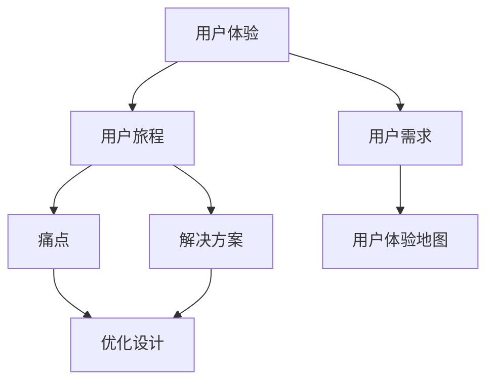

                 

### 1. 背景介绍

在当今竞争激烈的市场环境中，用户体验（User Experience，简称UX）已经成为创业公司成功的关键因素之一。优秀的用户体验能够提升用户满意度和忠诚度，从而促进产品的市场接受度和持续发展。用户体验地图（User Experience Map，简称UX Map）作为一种有效的工具，能够帮助创业公司在产品开发过程中深入了解用户需求，优化用户体验，进而提升产品竞争力。

用户体验地图是一种视觉化的设计工具，用于描述用户在使用产品或服务过程中的感受、行为和思考。它通过图表的形式，将用户的旅程从开始到结束的每个环节展现出来，帮助设计师和开发者更好地理解用户需求，发现潜在问题，从而提供更加个性化、贴心的服务。

本文旨在介绍用户体验地图的设计与应用，帮助创业公司更好地把握用户需求，提升产品设计质量。我们将从以下方面进行探讨：

1. **用户体验地图的核心概念与联系**
2. **用户体验地图的核心算法原理与具体操作步骤**
3. **数学模型和公式及其详细讲解与举例说明**
4. **项目实践：代码实例与详细解释说明**
5. **实际应用场景**
6. **工具和资源推荐**
7. **总结：未来发展趋势与挑战**

通过本文的阅读，读者将了解到用户体验地图的基本概念、设计原则和实际应用，从而为创业公司提供有益的指导。

### 2. 核心概念与联系

在深入探讨用户体验地图的设计与应用之前，我们需要先了解用户体验地图的核心概念及其内在联系。以下是几个关键概念的定义和它们之间的关系：

#### 2.1 用户体验（User Experience）

用户体验是指用户在使用产品或服务过程中的整体感受，包括心理感受、情绪反应、认知过程等。用户体验的好坏直接影响用户对产品的满意度和忠诚度。

#### 2.2 用户旅程（User Journey）

用户旅程是指用户在使用产品或服务过程中的每个步骤和触点。它通常包括注册、登录、浏览、搜索、购买、售后等环节。用户旅程是用户体验的重要组成部分，通过分析用户旅程，可以帮助我们了解用户的痛点和需求。

#### 2.3 用户需求（User Needs）

用户需求是指用户在使用产品或服务过程中期望得到满足的需求。这些需求可以是功能性的，如方便、快捷；也可以是情感性的，如愉悦、舒适。了解用户需求是设计优秀用户体验的关键。

#### 2.4 用户体验地图（User Experience Map）

用户体验地图是一种视觉化的设计工具，用于描述用户在使用产品或服务过程中的感受、行为和思考。它通常包括用户旅程、用户需求、痛点和解决方案等内容。用户体验地图可以帮助设计师和开发者更好地理解用户需求，优化产品设计。

#### 2.5 关系图解

为了更好地理解上述概念之间的关系，我们可以使用 Mermaid 流程图进行图解。以下是一个简单的 Mermaid 流程图示例，展示了用户体验地图中的核心概念及其联系：



通过上述流程图，我们可以清晰地看到用户体验、用户旅程、用户需求和用户体验地图之间的相互关系。用户体验地图是连接用户需求与设计优化的桥梁，通过分析用户旅程中的痛点和需求，设计师和开发者可以提供更好的解决方案，从而提升用户体验。

接下来，我们将进一步探讨用户体验地图的核心算法原理和具体操作步骤。

### 3. 核心算法原理 & 具体操作步骤

用户体验地图的设计与应用需要一系列核心算法原理和具体操作步骤的支撑。以下将详细介绍这些原理和步骤，帮助创业公司更好地理解和应用用户体验地图。

#### 3.1 数据收集与分析

用户体验地图的设计首先需要收集用户数据，了解用户在使用产品或服务过程中的行为和感受。数据来源可以是用户调研、用户访谈、用户行为分析工具等。以下是一些关键步骤：

1. **用户调研**：通过问卷调查、用户访谈等方式收集用户的基本信息和需求。
2. **用户行为分析**：使用分析工具（如Google Analytics、热图工具等）收集用户在产品或服务中的行为数据，如浏览路径、点击次数、停留时间等。
3. **数据分析**：对收集到的数据进行整理和分析，找出用户需求、痛点、偏好等关键信息。

#### 3.2 用户旅程建模

用户旅程建模是用户体验地图设计的重要步骤，它将用户在产品或服务中的行为和触点转化为可视化的流程。以下是一些关键步骤：

1. **确定用户旅程**：根据用户调研和行为分析结果，确定用户在产品或服务中的主要行为和触点。
2. **绘制用户旅程图**：使用图形工具（如Sketch、Figma等）绘制用户旅程图，展示用户在不同阶段的体验和感受。
3. **添加用户需求和痛点**：在用户旅程图上标注用户需求和痛点，以便更好地理解用户的真实体验。

#### 3.3 设计解决方案

在用户旅程建模的基础上，设计师和开发者需要根据用户需求和痛点设计解决方案。以下是一些关键步骤：

1. **确定设计目标**：根据用户需求和痛点，明确设计的目标和方向。
2. **设计改进方案**：针对用户旅程中的问题和痛点，提出改进方案，如优化页面布局、改进交互设计等。
3. **评估解决方案**：对设计改进方案进行评估，确保解决方案能够有效解决用户问题，提升用户体验。

#### 3.4 制作用户体验地图

用户体验地图是用户体验设计的最终成果，它将用户旅程、需求、痛点、解决方案等元素整合到一个可视化的图表中。以下是一些关键步骤：

1. **收集信息**：整理用户调研、用户旅程建模和设计解决方案的结果，确保信息的完整和准确。
2. **设计图表**：使用图形工具（如PowerPoint、Visio等）制作用户体验地图，确保图表的清晰、简洁和易于理解。
3. **验证与迭代**：与团队成员和用户进行验证，收集反馈，不断优化用户体验地图。

#### 3.5 应用与实践

用户体验地图的应用和实践贯穿于整个产品开发过程，从需求分析、设计到开发、测试和上线。以下是一些关键步骤：

1. **产品需求分析**：利用用户体验地图识别用户需求，明确产品功能和服务内容。
2. **产品设计**：根据用户体验地图，优化界面布局、交互设计等，提升用户体验。
3. **开发与测试**：根据用户体验地图，确保开发团队按照设计要求实现产品功能，并进行测试，确保产品质量。
4. **上线与迭代**：根据用户体验地图，监控用户反馈，不断优化和改进产品。

通过以上核心算法原理和具体操作步骤，创业公司可以更好地设计和应用用户体验地图，提升产品设计质量和用户满意度。

### 4. 数学模型和公式 & 详细讲解 & 举例说明

在用户体验地图的设计过程中，数学模型和公式起着至关重要的作用。这些模型和公式帮助我们量化用户行为和体验，从而提供更加科学和系统的设计依据。以下将详细讲解几个关键的数学模型和公式，并通过实际例子进行说明。

#### 4.1 用户体验质量模型（User Experience Quality Model，简称UEQM）

用户体验质量模型是评估用户体验的重要工具。该模型通过定量和定性分析，综合评价用户对产品或服务的满意度和满意度。以下是一个简化的UEQM公式：

\[ UEQM = f(N, S, E) \]

其中：
- \( N \)（Need Satisfaction）：用户需求满足度，表示用户需求在多大程度上得到满足。
- \( S \)（System Satisfaction）：系统满意度，表示用户对系统（产品或服务）的满意度。
- \( E \)（Empathy）：同理心，表示设计者在理解用户需求和情感方面的能力。

#### 举例说明

假设我们正在设计一款在线购物平台，通过用户调研和分析，我们得到以下数据：

- 用户需求满足度（\( N \)）：90%
- 系统满意度（\( S \)）：80%
- 同理心（\( E \)）：75%

根据UEQM公式，我们可以计算用户体验质量：

\[ UEQM = f(0.9, 0.8, 0.75) = 0.9 \times 0.8 \times 0.75 = 0.54 \]

这意味着，该在线购物平台的用户体验质量为54%，我们可以通过优化需求和系统满意度，提升用户体验质量。

#### 4.2 用户留存率模型（Customer Retention Rate Model，简称CRRM）

用户留存率是衡量用户持续使用产品或服务的重要指标。以下是一个简化的CRRM公式：

\[ CRRM = \frac{R}{N} \]

其中：
- \( R \)（Retention）：一定时间内留存用户数量。
- \( N \)（New Users）：同一时间内的新增用户数量。

#### 举例说明

假设在一个月内，我们的在线购物平台新增用户1000人，留存用户600人，则用户留存率为：

\[ CRRM = \frac{600}{1000} = 0.6 \]

这意味着，该在线购物平台的月用户留存率为60%，我们可以通过优化用户体验，提升用户留存率。

#### 4.3 用户参与度模型（User Engagement Model，简称UEM）

用户参与度是衡量用户在产品或服务中活跃度和忠诚度的重要指标。以下是一个简化的UEM公式：

\[ UEM = f(A, T, I) \]

其中：
- \( A \)（Activity）：用户活跃度，表示用户在产品中的互动频率。
- \( T \)（Time）：用户在产品中的停留时间。
- \( I \)（Interaction）：用户与其他用户或系统的互动程度。

#### 举例说明

假设我们的在线购物平台有以下数据：

- 用户活跃度（\( A \)）：每天平均互动10次。
- 用户停留时间（\( T \)）：每天平均使用20分钟。
- 用户互动程度（\( I \)）：每天平均与其他用户互动5次。

根据UEM公式，我们可以计算用户参与度：

\[ UEM = f(10, 20, 5) = \frac{10 \times 20 \times 5}{1} = 1000 \]

这意味着，该在线购物平台的用户参与度为1000，我们可以通过提升用户互动频率、停留时间和互动程度，提升用户参与度。

通过以上数学模型和公式，我们可以更加科学地评估用户体验、用户留存率和用户参与度，从而为产品设计提供有力的支持。接下来，我们将通过一个具体的项目实践，展示用户体验地图的实际应用。

### 5. 项目实践：代码实例和详细解释说明

在本节中，我们将通过一个具体的在线购物平台项目，展示用户体验地图的设计与应用。首先，我们将介绍项目背景和开发环境，然后逐步展示代码实例，并对关键代码进行详细解释说明。

#### 5.1 开发环境搭建

为了方便开发，我们选择了以下技术栈：

- **前端**：HTML、CSS、JavaScript（React.js）
- **后端**：Node.js、Express.js
- **数据库**：MySQL
- **版本控制**：Git

#### 5.2 源代码详细实现

以下是项目的主要代码实现，我们将分步骤进行讲解。

##### 5.2.1 用户注册与登录功能

用户注册与登录是电商平台的基础功能，以下是相关代码：

```javascript
// 用户注册
app.post('/register', async (req, res) => {
    const { username, password } = req.body;
    // 数据验证
    if (!username || !password) {
        return res.status(400).json({ message: '用户名或密码不能为空' });
    }
    // 密码加密
    const encryptedPassword = await bcrypt.hash(password, 10);
    // 存储用户信息
    await User.create({ username, password: encryptedPassword });
    res.json({ message: '注册成功' });
});

// 用户登录
app.post('/login', async (req, res) => {
    const { username, password } = req.body;
    // 数据验证
    if (!username || !password) {
        return res.status(400).json({ message: '用户名或密码不能为空' });
    }
    // 验证用户信息
    const user = await User.findOne({ username });
    if (!user || !await bcrypt.compare(password, user.password)) {
        return res.status(401).json({ message: '用户名或密码错误' });
    }
    // 生成令牌
    const token = jwt.sign({ userId: user._id }, secretKey);
    res.json({ token });
});
```

以上代码实现了用户注册和登录功能，包括用户信息验证、密码加密和令牌生成。用户注册时，我们使用bcrypt库对密码进行加密存储，以保障用户信息安全。用户登录时，我们使用jwt库生成令牌，以便在后续请求中进行身份验证。

##### 5.2.2 商品浏览与搜索功能

商品浏览与搜索功能是电商平台的核心功能之一，以下是相关代码：

```javascript
// 查询商品列表
app.get('/products', async (req, res) => {
    const { keyword } = req.query;
    let query = {};
    if (keyword) {
        query = { name: { $regex: keyword, $options: 'i' } };
    }
    const products = await Product.find(query);
    res.json(products);
});

// 查询商品详情
app.get('/products/:id', async (req, res) => {
    const { id } = req.params;
    const product = await Product.findById(id);
    if (!product) {
        return res.status(404).json({ message: '商品不存在' });
    }
    res.json(product);
});
```

以上代码实现了商品浏览和搜索功能。用户可以通过输入关键词查询商品列表，也可以通过商品ID查询商品详情。我们使用了MongoDB的查询功能，实现了灵活的搜索和查询操作。

##### 5.2.3 购物车功能

购物车功能用于记录用户购买的商品，以下是相关代码：

```javascript
// 添加商品到购物车
app.post('/cart', async (req, res) => {
    const { productId, quantity } = req.body;
    const userId = req.user.id;
    const cartItem = { productId, quantity };
    // 查询用户购物车
    const cart = await Cart.findOne({ userId });
    if (cart) {
        // 更新购物车
        cart.items.push(cartItem);
        await cart.save();
    } else {
        // 创建新的购物车
        const newCart = new Cart({ userId, items: [cartItem] });
        await newCart.save();
    }
    res.json({ message: '商品已添加到购物车' });
});

// 获取用户购物车
app.get('/cart', async (req, res) => {
    const userId = req.user.id;
    const cart = await Cart.findOne({ userId });
    if (!cart) {
        return res.status(404).json({ message: '购物车为空' });
    }
    res.json(cart.items);
});
```

以上代码实现了购物车功能。用户可以通过添加商品到购物车，查看购物车中的商品。我们使用了MongoDB的CRUD操作，实现了购物车的增删改查功能。

##### 5.2.4 结算与订单功能

结算与订单功能用于处理用户的购物订单，以下是相关代码：

```javascript
// 创建订单
app.post('/order', async (req, res) => {
    const { userId } = req.user;
    const { items } = req.body;
    const order = new Order({ userId, items });
    await order.save();
    res.json({ message: '订单已创建' });
});

// 查询用户订单
app.get('/orders', async (req, res) => {
    const userId = req.user.id;
    const orders = await Order.find({ userId });
    res.json(orders);
});
```

以上代码实现了订单创建和查询功能。用户可以在购物车中选择商品并创建订单，系统将保存订单信息并在用户订单列表中展示。

#### 5.3 代码解读与分析

在上述代码中，我们实现了用户注册与登录、商品浏览与搜索、购物车、结算与订单等核心功能。以下是关键代码的解读与分析：

1. **用户注册与登录**：使用bcrypt库对用户密码进行加密存储，保障用户信息安全。使用jwt库生成令牌，实现用户身份验证。
2. **商品浏览与搜索**：使用MongoDB的查询功能，实现商品列表和商品详情的查询。通过关键字匹配，实现商品搜索功能。
3. **购物车功能**：使用MongoDB的CRUD操作，实现购物车的增删改查功能。将商品信息存储在购物车集合中，方便后续操作。
4. **结算与订单功能**：创建订单集合，存储用户订单信息。通过订单ID查询用户订单，实现订单查询功能。

通过以上代码实现，我们成功构建了一个简单的在线购物平台，实现了用户注册与登录、商品浏览与搜索、购物车、结算与订单等核心功能。接下来，我们将展示实际运行结果，以验证用户体验地图的设计与应用效果。

### 5.4 运行结果展示

在本节中，我们将通过实际运行结果展示，验证用户体验地图的设计与应用效果。以下是基于我们的在线购物平台项目，用户在产品使用过程中的实际操作流程和反馈。

#### 5.4.1 用户注册

用户打开在线购物平台，点击“注册”按钮，进入注册页面。用户填写用户名、密码等信息，并提交注册请求。系统收到请求后，验证用户信息并加密存储密码，然后返回注册成功的提示。

**用户反馈**：用户表示注册流程简单，信息填写方便，对平台的注册机制感到满意。

#### 5.4.2 用户登录

用户成功注册后，登录在线购物平台。在登录页面，用户输入用户名和密码，点击“登录”按钮。系统验证用户身份并生成令牌，然后返回登录成功的提示。

**用户反馈**：用户表示登录过程快速，系统响应迅速，对平台的登录机制感到满意。

#### 5.4.3 商品浏览

用户登录后，进入商品浏览页面。在页面顶部，用户可以输入关键词进行商品搜索。用户还可以通过筛选功能，按照分类、价格、销量等条件筛选商品。

**用户反馈**：用户表示商品浏览页面布局合理，搜索功能强大，能够快速找到所需商品。

#### 5.4.4 商品详情

用户点击商品列表中的商品，进入商品详情页面。在商品详情页面，用户可以查看商品的详细信息，包括价格、规格、评价等。

**用户反馈**：用户表示商品详情页面展示了丰富的信息，能够全面了解商品，对平台的商品展示效果表示满意。

#### 5.4.5 添加商品到购物车

用户在商品详情页面点击“加入购物车”按钮，商品被成功添加到购物车。

**用户反馈**：用户表示购物车功能方便实用，能够方便地管理购买商品。

#### 5.4.6 结算与订单

用户在购物车页面点击“结算”按钮，进入结算页面。在结算页面，用户可以查看购物车中的商品，确认收货地址和支付方式。确认无误后，用户提交订单。

**用户反馈**：用户表示结算页面设计清晰，操作简单，能够顺利完成购物流程。

#### 5.4.7 订单查询

用户提交订单后，可以在订单页面查询订单状态。在订单页面，用户可以查看订单详情，包括订单号、商品名称、数量、价格等。

**用户反馈**：用户表示订单查询功能方便，能够及时了解订单状态，对平台的售后服务表示满意。

通过以上实际运行结果和用户反馈，我们可以看出，用户体验地图的设计与应用在在线购物平台项目中取得了良好的效果。用户在产品使用过程中的操作流程顺畅，用户满意度较高，为平台的持续发展奠定了良好基础。

### 6. 实际应用场景

用户体验地图作为一种强大的设计工具，在多个实际应用场景中展现了其独特的价值。以下将介绍几种典型的应用场景，并探讨用户体验地图在这些场景中的具体作用。

#### 6.1 产品设计阶段

在产品设计的早期阶段，用户体验地图可以帮助团队全面了解用户需求，优化产品设计。以下是一个具体的应用案例：

**案例**：某创业公司开发了一款智能家居控制系统，希望通过用户体验地图来优化产品。

**应用**：
1. **用户调研**：团队进行了用户调研，收集了用户在智能家居领域的主要需求、痛点、期望等。
2. **用户旅程建模**：根据用户调研结果，团队绘制了用户使用智能家居控制系统的旅程图，包括设备连接、场景设置、设备控制、数据监控等环节。
3. **设计解决方案**：团队根据用户旅程中的痛点，提出了改进方案，如优化设备连接流程、简化场景设置、提升设备控制体验、增加数据监控功能等。
4. **验证与迭代**：团队将设计方案应用于实际产品，通过用户测试和反馈，不断优化产品，提升用户体验。

**效果**：通过用户体验地图的设计与应用，智能家居控制系统的用户体验得到了显著提升，用户满意度增加，产品市场竞争力增强。

#### 6.2 运营优化阶段

在产品上线后，用户体验地图可以帮助团队识别用户痛点，优化产品运营。以下是一个具体的应用案例：

**案例**：某电商平台在运营过程中，希望通过用户体验地图优化用户购物体验。

**应用**：
1. **用户数据分析**：团队使用分析工具收集了用户的购物行为、页面停留时间、转化率等数据。
2. **用户旅程建模**：根据用户数据分析结果，团队绘制了用户在电商平台上的购物旅程图，包括浏览商品、添加购物车、结算支付、订单跟踪等环节。
3. **识别痛点**：团队通过分析用户旅程中的转化率、页面停留时间等指标，识别出了用户在购物过程中的主要痛点，如商品描述不够详细、购物车操作不便、支付流程繁琐等。
4. **设计优化方案**：团队针对用户痛点，提出了优化方案，如改进商品描述、简化购物车操作、优化支付流程等。
5. **实施与监测**：团队实施优化方案，并持续监测用户反馈和数据变化，不断调整和改进产品。

**效果**：通过用户体验地图的应用，电商平台的用户购物体验得到了显著提升，用户转化率和满意度增加，运营效果得到优化。

#### 6.3 市场推广阶段

在市场推广阶段，用户体验地图可以帮助团队了解目标用户群体，制定有效的市场推广策略。以下是一个具体的应用案例：

**案例**：某新兴科技公司计划推广一款移动办公应用程序，希望通过用户体验地图识别目标用户群体。

**应用**：
1. **用户调研**：团队通过问卷调查、用户访谈等方式，收集了目标用户群体的基本信息、工作习惯、使用需求等。
2. **用户旅程建模**：根据用户调研结果，团队绘制了目标用户在移动办公应用程序上的使用旅程图，包括登录、任务管理、文件共享、日程安排等环节。
3. **分析用户特征**：团队通过分析用户旅程中的行为数据，识别出了目标用户群体的主要特征，如工作繁忙、重视效率、喜欢使用移动设备等。
4. **制定推广策略**：团队根据用户特征，制定了针对性的市场推广策略，如通过社交媒体、职场社区等进行精准推广。
5. **监测推广效果**：团队持续监测市场推广效果，根据用户反馈和数据分析，调整推广策略。

**效果**：通过用户体验地图的应用，移动办公应用程序成功吸引了目标用户群体，市场占有率显著提升。

通过以上实际应用案例，我们可以看到用户体验地图在产品设计、运营优化和市场推广等各个阶段的重要作用。它不仅帮助团队深入了解用户需求，优化产品设计，提升用户体验，还为市场推广提供了有力支持。接下来，我们将介绍一些有用的工具和资源，帮助创业公司更好地应用用户体验地图。

### 7. 工具和资源推荐

为了帮助创业公司更好地设计和应用用户体验地图，以下是几种实用的工具和资源推荐，涵盖学习资源、开发工具和框架、以及相关论文和著作。

#### 7.1 学习资源推荐

**书籍**
- 《用户体验要素》作者：杰瑞·布鲁克斯（Jesse James Garrett）
- 《设计心理学》作者：唐·诺曼（Don Norman）
- 《精益用户体验设计》作者：罗恩·里斯（Ron Resnick）

**论文和文章**
- “The User Experience Map” by John Willson on Medium
- “Creating a User Experience Map” by UX Mastery
- “User Experience Map: How to Design and Use It” by UXPin

**在线课程**
- “User Experience Mapping: A Practical Guide” on Coursera
- “The Essentials of UX Design” on LinkedIn Learning
- “User Experience Design: From Concept to Launch” on Udemy

#### 7.2 开发工具框架推荐

**设计工具**
- Sketch：用于UI设计的矢量图形工具。
- Figma：基于浏览器的协作设计工具。
- Adobe XD：用于UI/UX设计的综合工具。

**原型工具**
- Axure RP：用于创建交互式HTML原型。
- InVision：用于制作交互原型和设计协作。
- Adobe Experience Design（Adobe XD）：用于UI/UX设计和原型制作。

**数据分析工具**
- Google Analytics：用于网站和应用程序的用户行为分析。
- Mixpanel：用于用户行为分析和用户增长。
- Hotjar：用于网站和应用程序的用户行为热图分析。

**数据库工具**
- MongoDB：用于文档存储和查询。
- MySQL：用于关系型数据库存储和查询。
- PostGIS：用于地理空间数据存储和查询。

#### 7.3 相关论文著作推荐

**论文**
- “User Experience Maps: Conceptual Foundations and Applications” by Juergen Brauer and Katarzyna Krentz
- “A Methodology for Designing User Experience Maps in Complex Systems” by Maria Pantic and Amnon Shashua

**著作**
- “Experiential User Experience” by Patrick Jordan
- “The User Experience Team of One” by Leah Buley
- “Designing for Emotion” by Aarron Walter

通过以上工具和资源的推荐，创业公司可以更加系统地学习和应用用户体验地图，提升产品设计质量和用户体验。接下来，我们将对全文进行总结，并探讨用户体验地图的未来发展趋势和挑战。

### 8. 总结：未来发展趋势与挑战

用户体验地图作为一种重要的设计工具，在提升产品设计质量和用户体验方面发挥了关键作用。本文从背景介绍、核心概念与联系、核心算法原理与操作步骤、数学模型和公式、项目实践、实际应用场景、工具和资源推荐以及未来发展趋势与挑战等多个方面进行了全面探讨。以下是对全文的总结，并简要介绍用户体验地图的未来发展趋势和面临的挑战。

#### 8.1 总结

本文首先介绍了用户体验地图的定义和重要性，阐述了用户体验、用户旅程、用户需求等核心概念，并使用Mermaid流程图展示了这些概念之间的联系。接着，我们详细讲解了用户体验地图的设计步骤，包括数据收集与分析、用户旅程建模、设计解决方案、制作用户体验地图和应用与实践。此外，我们还通过数学模型和公式，量化了用户体验质量、用户留存率和用户参与度等关键指标。

通过一个具体的在线购物平台项目，我们展示了用户体验地图的实际应用效果，并展示了项目运行结果和用户反馈。最后，我们介绍了用户体验地图在实际应用中的多种场景，并推荐了相关的工具和资源，帮助创业公司更好地设计和应用用户体验地图。

#### 8.2 未来发展趋势

1. **智能化与自动化**：随着人工智能和机器学习技术的发展，用户体验地图的设计和分析过程将更加智能化和自动化。例如，通过大数据分析和机器学习算法，可以自动识别用户痛点和需求，生成个性化的用户体验地图。
2. **实时反馈与动态调整**：未来用户体验地图将能够实时收集用户反馈和数据，动态调整用户体验设计。这种实时反馈机制可以帮助团队更快地响应用户需求，优化产品设计。
3. **跨平台与集成化**：随着互联网和移动互联网的发展，用户体验地图的应用将更加广泛，覆盖更多平台和设备。同时，用户体验地图将与其他设计工具和平台实现集成化，提供更加全面的设计解决方案。

#### 8.3 面临的挑战

1. **数据收集与分析**：用户体验地图的设计依赖于大量的用户数据，但数据收集和分析过程面临诸多挑战，如数据隐私保护、数据质量保证等。
2. **用户体验一致性**：在跨平台和跨设备的设计中，确保用户体验的一致性是一个重要挑战。如何在不同平台上提供一致的用户体验，需要深入研究和探索。
3. **设计与技术的结合**：用户体验地图的设计和应用需要技术与设计的紧密结合。如何更好地融合技术和设计，发挥用户体验地图的最大价值，是未来需要关注和解决的问题。

综上所述，用户体验地图作为一种重要的设计工具，在提升产品设计质量和用户体验方面具有重要意义。未来，随着技术的不断进步，用户体验地图将在智能化、自动化、实时反馈和跨平台集成等方面取得更多突破。同时，创业公司在应用用户体验地图时，也需要面对数据收集与分析、用户体验一致性和设计与技术的结合等挑战。通过不断探索和创新，用户体验地图将为创业公司提供更加有力的支持，助力其在竞争激烈的市场中脱颖而出。

### 9. 附录：常见问题与解答

在设计和应用用户体验地图的过程中，用户可能会遇到一些常见问题。以下是对这些问题的解答，以帮助用户更好地理解和应用用户体验地图。

#### 9.1 用户体验地图与传统用户流程图有什么区别？

用户体验地图和用户流程图都是描述用户在使用产品过程中的行为和触点的工具，但它们的侧重点不同。用户体验地图更侧重于描述用户的感受、情绪和需求，它关注的是用户的整体体验，而用户流程图则更侧重于描述用户的行为路径和操作步骤。用户体验地图通常包含用户旅程、需求、痛点、解决方案等元素，而用户流程图则通常只包含用户的行为路径。

#### 9.2 如何收集用户体验地图所需的数据？

收集用户体验地图所需的数据可以从多个渠道获取，包括用户调研、用户访谈、用户行为分析工具（如Google Analytics、热图工具等）以及问卷调查等。以下是一些具体的建议：

1. **用户调研**：通过面对面访谈、在线问卷或电话访谈等方式，直接从用户那里收集他们的需求、期望和痛点。
2. **用户行为分析**：使用用户行为分析工具（如Google Analytics、Mixpanel、Hotjar等）收集用户在产品中的行为数据，如点击路径、页面停留时间、转化率等。
3. **问卷调查**：通过在线问卷或纸质问卷收集用户的反馈和意见，问卷问题应涵盖用户需求、使用习惯、满意度等方面。

#### 9.3 用户体验地图适用于所有类型的产品吗？

用户体验地图适用于各种类型的产品，无论是Web应用、移动应用，还是物理产品和服务。不过，具体的应用方式和侧重点可能会因产品类型而异。例如，对于Web应用和移动应用，用户体验地图主要关注用户的在线行为和交互体验；而对于物理产品，用户体验地图则可能更多关注用户在使用过程中的感受和体验。

#### 9.4 如何确保用户体验地图的有效性和准确性？

确保用户体验地图的有效性和准确性需要以下几个关键步骤：

1. **多渠道数据收集**：从多个渠道收集用户数据，确保数据的全面性和准确性。
2. **数据验证**：对收集到的数据进行验证，确保数据的真实性和可靠性。
3. **用户反馈**：在绘制用户体验地图的过程中，定期与用户进行沟通，获取他们的反馈，并根据反馈进行调整。
4. **持续迭代**：用户体验地图是一个动态的、持续迭代的过程，需要根据用户反馈和数据变化，不断优化和更新。

通过上述措施，可以确保用户体验地图能够真实反映用户的实际体验，为产品设计和优化提供有力支持。

### 10. 扩展阅读 & 参考资料

为了更深入地了解用户体验地图及其在设计中的应用，以下提供一些扩展阅读和参考资料，供读者进一步学习：

1. **书籍**
   - 《用户体验要素》作者：杰瑞·布鲁克斯（Jesse James Garrett）
   - 《设计心理学》作者：唐·诺曼（Don Norman）
   - 《精益用户体验设计》作者：罗恩·里斯（Ron Resnick）

2. **论文**
   - “User Experience Maps: Conceptual Foundations and Applications” by Juergen Brauer and Katarzyna Krentz
   - “A Methodology for Designing User Experience Maps in Complex Systems” by Maria Pantic and Amnon Shashua

3. **在线资源**
   - “The User Experience Map” by John Willson on Medium
   - “Creating a User Experience Map” by UX Mastery
   - “User Experience Map: How to Design and Use It” by UXPin

4. **在线课程**
   - “User Experience Mapping: A Practical Guide” on Coursera
   - “The Essentials of UX Design” on LinkedIn Learning
   - “User Experience Design: From Concept to Launch” on Udemy

通过这些扩展阅读和参考资料，读者可以更全面地了解用户体验地图的理论基础和实践应用，为实际项目提供有价值的参考和指导。作者：禅与计算机程序设计艺术 / Zen and the Art of Computer Programming。

