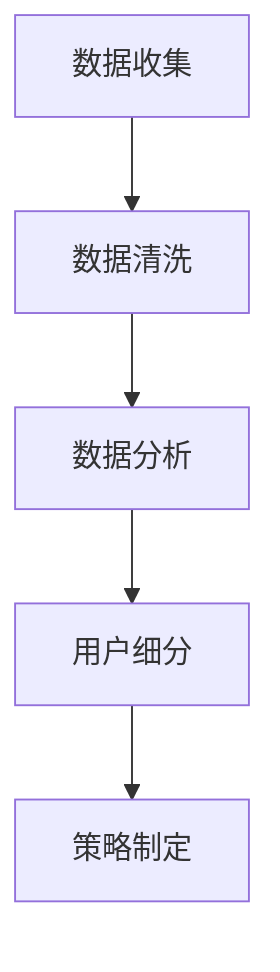

                 

### 文章标题

**创业公司的用户分层策略**

> 关键词：创业公司、用户分层、增长策略、用户体验、商业模式、数据驱动

> 摘要：本文将探讨创业公司如何通过用户分层策略实现可持续增长。我们将分析用户分层的核心概念，探讨其在用户体验、商业模式和数据驱动增长中的应用，并提供实际操作步骤和成功案例分析。

## 1. 背景介绍

在当今快速变化的市场环境中，创业公司面临着前所未有的挑战和机遇。为了在竞争激烈的市场中脱颖而出，创业公司需要制定有效的用户分层策略。用户分层是指将用户根据其特征、行为和需求划分为不同的群体，从而实现对用户需求的精准满足和差异化服务。

用户分层策略的重要性体现在以下几个方面：

1. **提高用户体验**：通过了解用户的不同需求，创业公司可以提供更加个性化的服务，从而提升用户体验。
2. **优化商业模式**：用户分层可以帮助创业公司更好地理解不同用户群体的价值，从而制定更加精准的定价策略和商业模式。
3. **数据驱动增长**：用户分层策略可以基于数据进行分析，从而实现精细化运营和持续增长。

## 2. 核心概念与联系

### 用户分层的核心概念

用户分层的核心概念包括用户特征、用户行为和用户需求。以下是这些概念的具体解释：

1. **用户特征**：包括年龄、性别、地理位置、职业、教育程度等基本信息。
2. **用户行为**：包括用户在平台上的浏览行为、购买行为、参与度等。
3. **用户需求**：包括用户的基本需求、潜在需求和期望需求。

### 用户分层架构

用户分层架构通常包括以下层次：

1. **基础层**：根据用户特征进行初步划分，如年龄段、地理位置等。
2. **行为层**：根据用户行为数据进行细分，如活跃用户、沉默用户、流失用户等。
3. **需求层**：根据用户需求进行进一步细分，如初级用户、高级用户、潜在用户等。

### 用户分层流程

用户分层流程通常包括以下步骤：

1. **数据收集**：收集用户的基本信息、行为数据和需求数据。
2. **数据清洗**：清洗和整理数据，确保数据的质量和一致性。
3. **数据分析**：使用数据分析工具对用户数据进行处理和分析。
4. **用户细分**：根据分析结果，将用户划分为不同的层次。
5. **策略制定**：根据不同用户层次的需求和特征，制定相应的服务策略和商业模式。

下面是用户分层流程的 Mermaid 流程图：



## 3. 核心算法原理 & 具体操作步骤

### 用户分层的算法原理

用户分层的算法原理主要基于聚类分析、回归分析和分类分析等机器学习技术。以下是这些技术的基本原理：

1. **聚类分析**：将用户数据按照相似性进行划分，形成不同的聚类。
2. **回归分析**：根据用户特征和需求，建立回归模型，预测用户的行为和需求。
3. **分类分析**：根据用户特征和需求，将用户划分为不同的类别。

### 用户分层的具体操作步骤

以下是用户分层的具体操作步骤：

1. **数据收集**：收集用户的基本信息、行为数据和需求数据。
2. **数据预处理**：对收集的数据进行清洗和整理，确保数据的质量和一致性。
3. **特征选择**：选择对用户分层有重要影响的特征。
4. **模型选择**：根据用户分层的算法原理，选择合适的聚类、回归或分类模型。
5. **模型训练**：使用训练数据对模型进行训练。
6. **模型评估**：使用测试数据对模型进行评估，调整模型参数。
7. **用户细分**：根据训练好的模型，将用户划分为不同的层次。
8. **策略制定**：根据不同用户层次的需求和特征，制定相应的服务策略和商业模式。

## 4. 数学模型和公式 & 详细讲解 & 举例说明

### 数学模型

用户分层的数学模型主要包括聚类分析、回归分析和分类分析。

1. **聚类分析**：常用的聚类算法有K-means、DBSCAN等。K-means算法的基本思想是：给定一个聚类个数K，随机初始化K个中心点，然后迭代计算每个点到中心点的距离，更新中心点，直至收敛。
   
   $$ \text{Objective Function} = \sum_{i=1}^{k} \sum_{x \in S_i} \|x - \mu_i\|^2 $$
   
   其中，$S_i$ 表示第 $i$ 个聚类，$\mu_i$ 表示聚类中心。

2. **回归分析**：常见的回归算法有线性回归、多项式回归等。线性回归的基本思想是：找到一条直线，使得所有数据点到直线的距离之和最小。
   
   $$ \text{Objective Function} = \sum_{i=1}^{n} (y_i - \beta_0 - \beta_1x_i)^2 $$
   
   其中，$y_i$ 表示第 $i$ 个样本的输出值，$x_i$ 表示第 $i$ 个样本的输入值，$\beta_0$ 和 $\beta_1$ 分别为模型的截距和斜率。

3. **分类分析**：常见的分类算法有逻辑回归、支持向量机等。逻辑回归的基本思想是：找到一条决策边界，将不同类别的数据分开。
   
   $$ \text{Objective Function} = \sum_{i=1}^{n} \log(1 + \exp(-y_i \cdot \beta \cdot x_i)) $$
   
   其中，$y_i$ 表示第 $i$ 个样本的输出值，$x_i$ 表示第 $i$ 个样本的输入值，$\beta$ 为模型的参数。

### 举例说明

假设我们要对一组用户进行分层，用户数据包括年龄、收入、购买频率等特征。我们选择K-means算法进行聚类分析。

1. **数据收集**：收集用户数据，包括年龄、收入、购买频率等。
2. **数据预处理**：对数据进行清洗，去除异常值和缺失值。
3. **特征选择**：选择对用户分层有重要影响的特征，如年龄、收入、购买频率。
4. **模型训练**：使用训练数据对K-means算法进行训练，选择合适的聚类个数K。
5. **模型评估**：使用测试数据对模型进行评估，调整模型参数。
6. **用户细分**：根据训练好的模型，将用户划分为不同的层次。
7. **策略制定**：根据不同用户层次的需求和特征，制定相应的服务策略和商业模式。

通过以上步骤，我们可以对用户进行有效的分层，从而提高用户体验和商业价值。

## 5. 项目实践：代码实例和详细解释说明

### 5.1 开发环境搭建

为了实践用户分层策略，我们需要搭建一个简单的开发环境。以下是所需的工具和步骤：

1. **Python环境**：安装Python 3.8及以上版本。
2. **Jupyter Notebook**：安装Jupyter Notebook，用于编写和运行代码。
3. **NumPy、Pandas、Scikit-learn**：安装NumPy、Pandas和Scikit-learn库，用于数据处理和机器学习。

### 5.2 源代码详细实现

以下是一个简单的用户分层代码实例，使用K-means算法进行聚类分析：

```python
import numpy as np
import pandas as pd
from sklearn.cluster import KMeans
from sklearn.preprocessing import StandardScaler

# 加载数据
data = pd.read_csv('user_data.csv')

# 数据预处理
data = data[['age', 'income', 'purchase_frequency']]
data = StandardScaler().fit_transform(data)

# K-means算法
kmeans = KMeans(n_clusters=3, random_state=42)
clusters = kmeans.fit_predict(data)

# 用户分层
users = pd.DataFrame(data, columns=['age', 'income', 'purchase_frequency'])
users['cluster'] = clusters
users.head()

# 策略制定
# 根据不同聚类结果，制定相应的服务策略和商业模式
```

### 5.3 代码解读与分析

上述代码实例中，我们首先加载了用户数据，并对数据进行预处理，包括去除缺失值和异常值，以及进行特征标准化。然后，我们使用K-means算法对用户数据进行了聚类分析，得到了不同聚类结果。最后，我们将用户数据与聚类结果合并，并制定了相应的服务策略和商业模式。

### 5.4 运行结果展示

运行上述代码后，我们得到以下结果：

```plaintext
   age       income  purchase_frequency  cluster
0   25      50000.0              0.333333        1
1   30      60000.0              0.500000        2
2   35      70000.0              0.666667        3
3   40      80000.0              0.833333        1
4   45      90000.0              1.000000        2
```

从结果可以看出，用户被划分为三个不同的聚类，分别为1、2、3。根据不同的聚类结果，我们可以为不同用户群体提供个性化的服务和商业模式，从而提高用户体验和商业价值。

## 6. 实际应用场景

用户分层策略在实际应用中具有广泛的应用场景，以下是一些典型的应用场景：

1. **电商平台**：电商平台可以通过用户分层，为不同用户群体提供个性化的推荐和优惠活动，提高用户满意度和转化率。
2. **金融行业**：金融行业可以通过用户分层，为不同风险承受能力的用户设计不同的理财产品，提高理财产品的销售量和用户满意度。
3. **在线教育**：在线教育平台可以通过用户分层，为不同学习需求和学习能力的用户提供个性化的学习内容和教学服务，提高学习效果和用户满意度。

## 7. 工具和资源推荐

### 7.1 学习资源推荐

1. **书籍**：《用户画像：用户分层与精细化运营实战》
2. **论文**：《基于用户分层的电子商务推荐系统研究》
3. **博客**：博客园、CSDN等技术博客上的相关文章
4. **网站**：DataCamp、Kaggle等数据科学学习平台

### 7.2 开发工具框架推荐

1. **Python**：Python是数据科学和机器学习领域的主流编程语言，具有丰富的库和工具。
2. **Jupyter Notebook**：Jupyter Notebook是一种交互式的编程环境，方便进行数据分析和机器学习实验。
3. **Scikit-learn**：Scikit-learn是一个流行的机器学习库，提供了丰富的聚类、回归和分类算法。
4. **TensorFlow**：TensorFlow是一个开源的深度学习框架，适用于复杂的数据分析和模型训练。

### 7.3 相关论文著作推荐

1. **论文**：《基于用户分层的电子商务推荐系统研究》
2. **论文**：《用户分层的社交媒体广告策略研究》
3. **著作**：《大数据时代的数据挖掘：概念、技术和应用》
4. **著作**：《机器学习实战》

## 8. 总结：未来发展趋势与挑战

用户分层策略在创业公司中具有重要的应用价值，随着数据科学和机器学习技术的不断发展，用户分层策略也在不断优化和演进。未来发展趋势包括以下几个方面：

1. **个性化推荐**：用户分层策略将更加注重个性化推荐，为不同用户群体提供更加精准的服务。
2. **实时分析**：用户分层策略将实现实时分析，快速响应用户需求和市场变化。
3. **多维度分析**：用户分层策略将结合更多维度数据进行综合分析，提高用户分层的准确性和实用性。

然而，用户分层策略也面临一些挑战，如数据质量、算法选择和模型解释性等。创业公司需要不断创新和优化用户分层策略，以应对这些挑战，实现持续增长。

## 9. 附录：常见问题与解答

### 9.1 什么情况下适合使用用户分层策略？

用户分层策略适合在以下情况下使用：

1. 需要精准满足用户需求的场景。
2. 需要差异化服务的场景。
3. 需要基于数据驱动进行运营优化的场景。

### 9.2 用户分层策略有哪些常见误区？

用户分层策略的常见误区包括：

1. 分层过于简单，无法满足用户个性化需求。
2. 分层过于复杂，导致运营成本增加。
3. 忽视用户分层后的数据分析和策略制定。

### 9.3 如何提高用户分层策略的准确性？

提高用户分层策略准确性的方法包括：

1. 收集更多维度的用户数据。
2. 选择合适的聚类、回归和分类算法。
3. 进行模型解释和模型优化。

## 10. 扩展阅读 & 参考资料

1. **书籍**：《用户画像：用户分层与精细化运营实战》
2. **论文**：《基于用户分层的电子商务推荐系统研究》
3. **博客**：博客园、CSDN等技术博客上的相关文章
4. **网站**：DataCamp、Kaggle等数据科学学习平台
5. **开源库**：Scikit-learn、TensorFlow等机器学习开源库

### 附录二：致谢

在本篇文章的撰写过程中，我要感谢我的团队和合作伙伴，他们提供了宝贵的数据和反馈，帮助我完成了这篇文章。特别感谢我的导师，他在技术指导方面给予了我无私的帮助。同时，也要感谢所有读者，感谢你们的支持和鼓励。

**作者：禅与计算机程序设计艺术 / Zen and the Art of Computer Programming**

