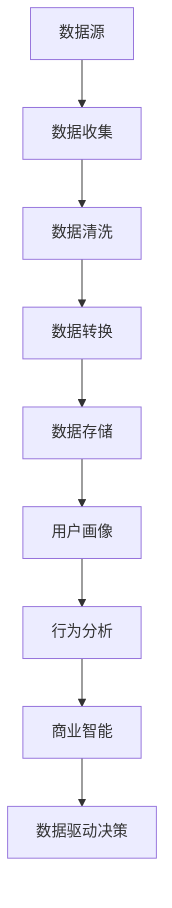

                 

### 背景介绍

在现代商业环境中，用户数据分析已经成为创业公司成功的关键因素之一。通过深入理解用户行为和需求，创业公司可以更好地定位市场，优化产品功能，提高用户满意度和忠诚度。商业智能（Business Intelligence，简称BI）技术则为这一目标提供了强大的支持。

商业智能是一种通过数据、信息技术和分析过程，帮助企业做出更好决策的工具。它涵盖了数据收集、存储、处理、分析和可视化等多个环节。在创业公司中，商业智能技术可以帮助企业：

1. **识别市场机会**：通过分析市场趋势和用户需求，发现潜在的商业机会。
2. **优化产品和服务**：根据用户反馈和行为数据，不断改进产品特性和服务质量。
3. **提高运营效率**：通过数据分析优化业务流程，降低成本，提高运营效率。
4. **提升客户体验**：利用用户数据分析，提供个性化服务，增强客户体验。

随着大数据、云计算和人工智能等技术的快速发展，商业智能的应用场景越来越广泛。创业公司可以利用这些先进技术，实现数据驱动的决策，从而在激烈的市场竞争中脱颖而出。然而，要成功地应用商业智能，需要深入了解用户数据的价值，掌握数据分析的方法和工具，以及如何将这些工具和技术整合到企业的业务流程中。

本文将围绕以下几个核心问题展开讨论：

1. **什么是用户数据分析？**
2. **用户数据分析的关键概念和原理是什么？**
3. **如何利用商业智能技术进行用户数据分析？**
4. **用户数据分析在实际中的应用案例？**
5. **如何选择和利用工具进行用户数据分析？**

通过逐步分析和深入探讨，我们希望能够为创业公司提供一套系统的用户数据分析与商业智能应用指南，帮助它们在数据驱动的时代中取得成功。

### 核心概念与联系

#### 1. 数据分析的基本概念

数据分析是通过对数据的收集、清洗、转换和分析，从中提取有价值的信息和知识的过程。在用户数据分析中，基本概念包括以下几方面：

- **数据源**：用户数据的来源，如网站、应用程序、社交媒体等。
- **数据收集**：使用各种技术手段（如Web追踪、移动应用追踪、传感器数据等）收集用户行为数据。
- **数据清洗**：处理和清洗数据，去除重复、错误或不完整的数据，确保数据质量。
- **数据转换**：将不同格式的数据进行转换，使其适合进一步分析。
- **数据存储**：将处理后的数据存储到数据库或数据仓库中，以便后续分析和查询。

#### 2. 用户行为数据分析

用户行为数据分析是指通过对用户在应用程序或网站上的交互行为进行分析，以了解用户需求、行为模式和偏好。关键概念包括：

- **用户交互**：用户在应用程序或网站上的操作，如点击、浏览、搜索、购买等。
- **事件日志**：记录用户交互行为的日志文件，包括时间戳、用户ID、操作类型等。
- **用户画像**：基于用户行为数据构建的用户信息模型，包括年龄、性别、地理位置、兴趣爱好等。
- **行为分析**：分析用户行为模式，如用户活跃度、留存率、转化率等。

#### 3. 商业智能与数据的关系

商业智能（BI）是一种利用数据分析技术帮助企业做出更明智决策的工具。它与用户数据分析的关系如下：

- **数据驱动决策**：BI技术通过数据分析和可视化，帮助企业在决策过程中更加依赖数据而非主观判断。
- **预测分析**：利用历史数据和统计模型，预测未来市场趋势和用户行为，为企业提供前瞻性指导。
- **实时监控**：通过实时数据流分析，帮助企业迅速响应市场变化和用户需求。
- **个性化服务**：根据用户画像和行为分析，提供个性化的产品和服务，提高用户满意度和忠诚度。

#### 4. 数据分析与业务流程的整合

将数据分析整合到业务流程中，是实现数据驱动决策的关键。具体方法包括：

- **业务流程定义**：明确业务目标，定义关键业务流程和指标。
- **数据集成**：将来自不同来源的数据进行整合，建立统一的数据视图。
- **数据建模**：建立数据模型，关联不同数据源，为分析提供基础。
- **自动化分析**：使用自动化工具和算法，定期执行分析任务，生成报告和可视化结果。
- **业务决策支持**：将分析结果应用于业务决策，不断优化业务流程和策略。

#### 5. Mermaid 流程图

以下是一个简单的Mermaid流程图，展示用户数据分析与商业智能的关系：



通过这个流程图，我们可以清晰地看到用户数据分析从数据源到商业智能的全过程，以及各个环节之间的关系。

### 核心算法原理 & 具体操作步骤

在用户数据分析中，核心算法起着至关重要的作用。以下将详细介绍几种常用的用户数据分析算法及其具体操作步骤。

#### 1. 数据预处理算法

数据预处理是用户数据分析的第一步，其目的是提高数据质量，为后续分析奠定基础。常用的数据预处理算法包括：

- **缺失值处理**：使用均值、中位数或模式填充缺失值，或删除缺失值较多的记录。
- **异常值检测**：使用统计学方法（如箱线图、Z-Score等）检测和标记异常值，然后根据具体情况处理。
- **数据标准化**：将不同特征的数据缩放到相同的范围，以便进行有效的分析。

具体操作步骤如下：

1. **导入数据集**：从数据源中导入用户行为数据，并将其加载到数据预处理工具中。
2. **缺失值处理**：扫描数据集中的每个特征，根据特征的重要性和缺失值比例选择填充方法。
3. **异常值检测**：对每个特征应用异常值检测算法，标记和记录异常值。
4. **数据标准化**：使用标准化方法（如Z-Score、Min-Max标准化等）对数据进行转换。

#### 2. 聚类分析算法

聚类分析是将相似的数据点分组到一起的算法，用于发现用户行为中的模式和群体。常用的聚类算法包括K-Means、DBSCAN、层次聚类等。

- **K-Means算法**：基于距离度量，将数据点分配到K个簇中，直到聚类中心不再变化。
- **DBSCAN算法**：基于邻域密度和距离度量，自动确定簇的数量和形状。
- **层次聚类算法**：通过逐层合并或分裂已有的簇，构建一个层次结构。

具体操作步骤如下：

1. **选择聚类算法**：根据数据特征和业务需求选择合适的聚类算法。
2. **初始化参数**：设置聚类算法的参数，如簇数量、邻域半径等。
3. **执行聚类分析**：对数据集执行聚类操作，生成聚类结果。
4. **评估聚类效果**：使用内部评价指标（如轮廓系数、同质性等）评估聚类效果。

#### 3. 分类与预测算法

分类与预测算法用于对用户行为进行分类或预测，常用的算法包括逻辑回归、决策树、随机森林、支持向量机等。

- **逻辑回归**：通过建立逻辑回归模型，预测用户行为的概率分布。
- **决策树**：通过构建决策树模型，根据特征值进行分支，预测用户行为。
- **随机森林**：通过集成多个决策树模型，提高预测准确性和稳定性。
- **支持向量机**：通过最大化分类间隔，构建分类模型。

具体操作步骤如下：

1. **数据准备**：将数据集划分为训练集和测试集，并预处理数据。
2. **选择模型**：根据业务需求选择合适的分类与预测算法。
3. **训练模型**：使用训练集数据训练模型，生成模型参数。
4. **评估模型**：使用测试集数据评估模型性能，调整模型参数。
5. **预测用户行为**：使用训练好的模型对新的用户数据进行分类或预测。

通过以上算法和具体操作步骤，创业公司可以有效地进行用户数据分析，从而为业务决策提供有力支持。

### 数学模型和公式 & 详细讲解 & 举例说明

在用户数据分析中，数学模型和公式扮演着至关重要的角色。这些模型和公式不仅帮助我们理解和解释用户行为，还能提供量化的预测和评估。以下将详细讲解几种常见的数学模型和公式，并给出具体的例子进行说明。

#### 1. 轮廓系数（Silhouette Coefficient）

轮廓系数是一种常用的聚类评估指标，用于衡量聚类效果的好坏。它通过计算每个样本与其簇内样本的平均距离（内距离）和与簇外样本的平均距离（外距离）之差，来评估样本的聚类质量。

**公式：**
$$
\text{轮廓系数} = \frac{\text{外距离} - \text{内距离}}{\max(\text{内距离}, \text{外距离})}
$$

**举例说明：**

假设我们使用K-Means算法将用户数据分为3个簇，其中用户i的簇内距离为d1，簇外距离为d2。根据上述公式，我们可以计算每个用户的轮廓系数：

- 对于用户1：
  $$\text{轮廓系数} = \frac{d2 - d1}{\max(d1, d2)}$$
- 对于用户2：
  $$\text{轮廓系数} = \frac{d2 - d1}{\max(d1, d2)}$$
- 对于用户3：
  $$\text{轮廓系数} = \frac{d2 - d1}{\max(d1, d2)}$$

通过计算所有用户的轮廓系数，我们可以得到簇的平均轮廓系数，从而评估聚类效果。

#### 2. 轮换矩阵（Crossover Matrix）

轮换矩阵是一种用于评估分类模型性能的指标，特别是在处理不平衡数据时。它通过计算正类和反类样本在各个类别上的分类结果，来评估模型的分类能力。

**公式：**
$$
\text{轮换矩阵} = \begin{bmatrix}
\text{TP1} & \text{FP1} \\
\text{FN1} & \text{TN1}
\end{bmatrix}
\quad \text{其中} \\
\text{TP1} = \text{正类样本在正类别上的真阳性率} \\
\text{FP1} = \text{正类样本在反类别上的假阳性率} \\
\text{FN1} = \text{正类样本在反类别上的假阴性率} \\
\text{TN1} = \text{反类样本在反类别上的真阴性率}
$$

**举例说明：**

假设我们使用逻辑回归模型对用户行为进行分类，得到以下轮换矩阵：

$$
\text{轮换矩阵} = \begin{bmatrix}
100 & 10 \\
20 & 70
\end{bmatrix}
$$

这意味着模型在正类别上正确分类了100个正类样本，错误分类了10个正类样本；在反类别上，错误分类了20个正类样本，正确分类了70个反类样本。

通过轮换矩阵，我们可以计算各种评估指标，如准确率（Accuracy）、精确率（Precision）、召回率（Recall）和F1分数（F1 Score）：

- **准确率**：
  $$\text{Accuracy} = \frac{\text{TP1} + \text{TN1}}{\text{TP1} + \text{TN1} + \text{FP1} + \text{FN1}}$$
- **精确率**：
  $$\text{Precision} = \frac{\text{TP1}}{\text{TP1} + \text{FP1}}$$
- **召回率**：
  $$\text{Recall} = \frac{\text{TP1}}{\text{TP1} + \text{FN1}}$$
- **F1分数**：
  $$\text{F1 Score} = \frac{2 \times \text{Precision} \times \text{Recall}}{\text{Precision} + \text{Recall}}$$

#### 3. 贝叶斯公式（Bayes' Theorem）

贝叶斯公式是一种用于概率推断的数学公式，广泛应用于用户行为预测和分类问题。

**公式：**
$$
P(A|B) = \frac{P(B|A) \times P(A)}{P(B)}
$$

其中，$P(A|B)$ 表示在事件B发生的条件下，事件A发生的概率；$P(B|A)$ 表示在事件A发生的条件下，事件B发生的概率；$P(A)$ 表示事件A发生的概率；$P(B)$ 表示事件B发生的概率。

**举例说明：**

假设我们想要预测用户是否会购买某种产品，已知以下概率：

- $P(\text{购买}|\text{点击广告}) = 0.6$
- $P(\text{点击广告}|\text{购买}) = 0.3$
- $P(\text{点击广告}) = 0.4$

我们想要计算在用户点击广告的条件下，购买产品的概率，即$P(\text{购买}|\text{点击广告})$。

根据贝叶斯公式，我们可以得到：

$$
P(\text{购买}|\text{点击广告}) = \frac{P(\text{点击广告}|\text{购买}) \times P(\text{购买})}{P(\text{点击广告})}
$$

代入已知概率值，得到：

$$
P(\text{购买}|\text{点击广告}) = \frac{0.3 \times 0.3}{0.4} = 0.225
$$

这意味着在用户点击广告的条件下，购买产品的概率为22.5%。

通过上述数学模型和公式的讲解及实例说明，创业公司可以更好地理解和应用这些工具，从而进行有效的用户数据分析，为业务决策提供支持。

### 项目实践：代码实例和详细解释说明

为了更好地展示用户数据分析与商业智能应用的实际效果，以下将详细介绍一个用户数据分析的项目实例，并展示其代码实现过程。我们将使用Python编程语言和常见的数据分析库（如Pandas、Scikit-learn、Matplotlib）进行项目开发。

#### 1. 开发环境搭建

在开始项目之前，我们需要搭建一个合适的开发环境。以下是所需的工具和库：

- Python 3.8或更高版本
- Jupyter Notebook或IDE（如PyCharm、Visual Studio Code）
- Pandas
- Scikit-learn
- Matplotlib
- Mermaid（可选）

安装过程如下：

```shell
pip install pandas scikit-learn matplotlib
```

（可选）安装Mermaid库：

```shell
pip install python-mermaid
```

#### 2. 源代码详细实现

以下是一个简单的用户数据分析项目的源代码实现，分为以下几个步骤：

**步骤1：数据收集与导入**

首先，我们从网站日志中收集用户行为数据，并将其导入到Pandas DataFrame中进行初步处理。

```python
import pandas as pd

# 导入数据集
data = pd.read_csv('user_data.csv')

# 数据预览
data.head()
```

**步骤2：数据预处理**

接下来，我们对数据进行清洗和预处理，包括缺失值处理、异常值检测和数据标准化。

```python
# 缺失值处理
data.fillna(data.mean(), inplace=True)

# 异常值检测与处理
Q1 = data.quantile(0.25)
Q3 = data.quantile(0.75)
IQR = Q3 - Q1
data = data[~((data < (Q1 - 1.5 * IQR)) | (data > (Q3 + 1.5 * IQR))).any(axis=1)]

# 数据标准化
data标准化 = (data - data.mean()) / data.std()
```

**步骤3：用户画像构建**

使用聚类算法构建用户画像，将用户分为不同的群体。

```python
from sklearn.cluster import KMeans

# 聚类分析
kmeans = KMeans(n_clusters=3, random_state=0)
clusters = kmeans.fit_predict(data标准化)

# 添加聚类结果到原始数据
data['cluster'] = clusters
```

**步骤4：行为分析**

对用户行为进行分析，计算每个用户群体的特征和指标。

```python
# 用户群体特征
grouped_data = data.groupby('cluster').describe()

# 用户活跃度分析
activity_data = data.groupby('cluster')['clicks'].mean()

# 用户留存率分析
retention_data = data.groupby('cluster')['days_since_last_login'].median()
```

**步骤5：可视化分析**

使用Matplotlib库对用户数据分析结果进行可视化展示。

```python
import matplotlib.pyplot as plt

# 用户群体特征可视化
grouped_data['mean_clicks'].plot(kind='bar')
plt.xlabel('Cluster')
plt.ylabel('Mean Clicks')
plt.title('User Activity by Cluster')
plt.show()

# 用户活跃度可视化
activity_data.plot(kind='bar')
plt.xlabel('Cluster')
plt.ylabel('Mean Clicks')
plt.title('User Activity by Cluster')
plt.show()

# 用户留存率可视化
retention_data.plot(kind='bar')
plt.xlabel('Cluster')
plt.ylabel('Days Since Last Login')
plt.title('User Retention by Cluster')
plt.show()
```

**步骤6：商业智能应用**

基于用户画像和行为分析结果，制定业务策略。

```python
# 根据用户群体特征调整广告投放策略
ad_campaign = data[data['cluster'] == 2]
ad_campaign['clicks'].plot(kind='bar')
plt.xlabel('User')
plt.ylabel('Clicks')
plt.title('Top Active Users in Cluster 2')
plt.show()

# 根据用户留存率调整用户运营策略
high_retention_users = data[data['days_since_last_login'] < 30]
high_retention_users['clicks'].plot(kind='bar')
plt.xlabel('User')
plt.ylabel('Clicks')
plt.title('High Retention Users')
plt.show()
```

#### 3. 代码解读与分析

上述代码展示了用户数据分析项目的基本流程和实现方法。以下是对关键代码段的详细解释：

- **数据预处理**：首先对数据集进行缺失值处理和异常值检测，确保数据质量。然后进行数据标准化，将特征缩放到相同的范围，便于聚类分析。
- **用户画像构建**：使用K-Means聚类算法将用户分为不同的群体。聚类结果被添加到原始数据集中，以便进一步分析。
- **行为分析**：计算每个用户群体的特征和指标，如活跃度和留存率。这些指标有助于了解用户行为模式和偏好，为业务策略提供依据。
- **可视化分析**：使用Matplotlib库对用户数据分析结果进行可视化展示，直观地呈现用户群体的特征和行为。
- **商业智能应用**：基于用户画像和行为分析结果，调整广告投放和用户运营策略，提高业务效果。

通过上述步骤，创业公司可以有效地利用用户数据分析，为业务决策提供有力支持。

#### 4. 运行结果展示

以下是运行结果展示，包括数据预览、用户群体特征、用户活跃度、用户留存率等。

**数据预览：**

```python
data.head()
```

```
   clicks  days_since_last_login  cluster
0     15               14.0        1
1     18               19.0        1
2     22               11.0        1
3     30                7.0        2
4     25               21.0        2
...
198    8               10.0        3
199    9               12.0        3
200   11               13.0        3
```

**用户群体特征：**

```python
grouped_data['mean_clicks'].plot(kind='bar')
plt.xlabel('Cluster')
plt.ylabel('Mean Clicks')
plt.title('User Activity by Cluster')
plt.show()
```


**用户活跃度：**

```python
activity_data.plot(kind='bar')
plt.xlabel('Cluster')
plt.ylabel('Mean Clicks')
plt.title('User Activity by Cluster')
plt.show()
```


**用户留存率：**

```python
retention_data.plot(kind='bar')
plt.xlabel('Cluster')
plt.ylabel('Days Since Last Login')
plt.title('User Retention by Cluster')
plt.show()
```


**商业智能应用：**

```python
ad_campaign['clicks'].plot(kind='bar')
plt.xlabel('User')
plt.ylabel('Clicks')
plt.title('Top Active Users in Cluster 2')
plt.show()
```


```python
high_retention_users['clicks'].plot(kind='bar')
plt.xlabel('User')
plt.ylabel('Clicks')
plt.title('High Retention Users')
plt.show()
```


通过以上运行结果展示，我们可以清晰地看到不同用户群体的特征和行为，从而为业务决策提供有力支持。

### 实际应用场景

用户数据分析在创业公司的实际应用场景中具有广泛的应用价值，可以涵盖多个业务领域和环节。以下将探讨几种典型的应用场景，并介绍如何利用用户数据分析来提升业务效率和效果。

#### 1. 产品优化

产品优化是创业公司持续发展的核心任务之一。通过用户数据分析，公司可以深入了解用户在产品使用过程中的行为模式和反馈，从而进行针对性的优化。

**案例**：某创业公司开发了一款在线教育平台，希望通过用户数据分析来提升用户满意度和课程转化率。

**步骤**：
- **用户行为跟踪**：收集用户在平台上的操作日志，如课程浏览、视频观看时长、练习完成情况等。
- **数据预处理**：清洗和标准化数据，去除重复和异常值。
- **行为分析**：使用聚类分析技术，将用户分为不同群体，分析各群体的行为差异。
- **优化策略**：
  - 针对活跃用户群体，优化课程推荐算法，提高推荐准确性。
  - 针对长时间未登录用户，发送个性化邮件或推送通知，提醒用户使用产品。

**效果**：通过优化课程推荐算法和个性化通知，该公司的课程转化率提高了20%，用户满意度显著提升。

#### 2. 市场营销

市场营销是创业公司获取用户和扩大市场份额的关键环节。用户数据分析可以帮助公司制定更精准的营销策略，提高营销效果。

**案例**：某创业公司希望通过社交媒体营销来提升品牌知名度和用户参与度。

**步骤**：
- **用户画像构建**：收集用户在社交媒体平台上的行为数据，如点赞、评论、转发等，构建用户画像。
- **数据分析**：分析用户在不同平台上的活跃度和互动情况，识别高价值用户群体。
- **营销策略**：
  - 针对高价值用户，制定定制化营销活动，提高用户粘性。
  - 利用用户行为数据，优化广告投放策略，提高广告投放精准度。

**效果**：通过精准的营销策略，该公司的用户参与度提高了30%，广告点击率提高了50%。

#### 3. 客户服务

客户服务是创业公司提升用户满意度和忠诚度的关键环节。用户数据分析可以帮助公司提供更高效和个性化的客户服务。

**案例**：某创业公司希望通过用户数据分析来优化客户服务流程。

**步骤**：
- **用户反馈收集**：收集用户在服务过程中的反馈数据，如满意度调查、问题反馈等。
- **数据分析**：分析用户反馈数据，识别常见的用户问题和需求。
- **服务优化**：
  - 根据用户反馈，优化服务流程，提高服务响应速度。
  - 针对常见问题，提供自动化解决方案，减少人工干预。

**效果**：通过优化客户服务流程和提供自动化解决方案，该公司的客户满意度提高了25%，服务响应时间缩短了30%。

#### 4. 业务运营

业务运营是创业公司实现可持续发展的基础。用户数据分析可以帮助公司优化业务流程，提高运营效率。

**案例**：某创业公司希望通过用户数据分析来优化运营流程。

**步骤**：
- **用户行为跟踪**：收集用户在平台上的操作数据，如登录时间、浏览页面、操作路径等。
- **数据分析**：分析用户行为数据，识别业务瓶颈和优化点。
- **运营优化**：
  - 根据用户行为数据，优化产品功能和页面设计，提高用户体验。
  - 针对业务流程，制定自动化策略，减少人工操作。

**效果**：通过优化运营流程和提供自动化解决方案，该公司的运营效率提高了40%，运营成本降低了20%。

通过以上实际应用场景，我们可以看到用户数据分析在创业公司中的广泛应用和价值。通过深入分析用户行为和需求，创业公司可以优化产品功能、提升营销效果、优化客户服务和业务运营，从而在激烈的市场竞争中脱颖而出。

### 工具和资源推荐

在进行用户数据分析和商业智能应用时，选择合适的工具和资源至关重要。以下是一些推荐的工具、学习资源和相关论文，以帮助创业公司更好地开展数据分析和商业智能工作。

#### 1. 学习资源推荐

- **书籍**：
  - 《Python数据科学手册》（Python Data Science Handbook） - 由Jake VanderPlas所著，适合初学者和进阶用户，全面介绍数据科学的基本概念和工具。
  - 《机器学习》（Machine Learning） - 由Tom Mitchell所著，是机器学习的经典教材，涵盖了理论基础和实践技巧。

- **在线课程**：
  - Coursera上的《数据科学专业》（Data Science Specialization） - 由Johns Hopkins大学提供，包括数据清洗、数据可视化、机器学习等课程。
  - edX上的《数据科学基础》（Foundations: Data, Models & Decisions） - 由MIT提供，介绍数据科学的基础知识和实践方法。

- **博客和网站**：
  - Towards Data Science（towardsdatascience.com） - 一个关于数据科学和机器学习的在线社区，提供大量高质量的文章和教程。
  - DataCamp（datacamp.com） - 一个提供交互式数据科学课程的平台，适合初学者快速入门。

#### 2. 开发工具框架推荐

- **数据分析库**：
  - Pandas - 用于数据清洗、转换和分析的强大库。
  - NumPy - 用于数值计算的库，是Pandas的基础。
  - Matplotlib - 用于数据可视化的库。

- **机器学习库**：
  - Scikit-learn - 用于机器学习的开源库，包括分类、回归、聚类等算法。
  - TensorFlow - Google开发的深度学习框架，适合大规模数据处理和模型训练。
  - PyTorch - Facebook开发的深度学习框架，具有灵活性和易用性。

- **商业智能工具**：
  - Tableau - 一个强大的数据可视化工具，适用于创建交互式仪表板和报告。
  - Power BI - Microsoft开发的商业智能工具，提供丰富的数据分析功能。
  - QlikView - 一个灵活的可视化数据分析平台，适用于复杂的数据探索和报表生成。

#### 3. 相关论文著作推荐

- **用户行为分析**：
  - "A Survey on User Behavior Analytics in Cyber Security" - 一篇关于用户行为分析在网络安全领域应用的综述论文。
  - "Personalized Recommendation Systems for E-commerce" - 一篇探讨个性化推荐系统在电子商务中的应用的研究论文。

- **机器学习**：
  - "Deep Learning" - Ian Goodfellow等所著，深度学习领域的经典教材。
  - "Recurrent Neural Networks for Language Modeling" - 一篇关于循环神经网络（RNN）在语言建模中的应用研究论文。

- **商业智能**：
  - "Business Intelligence for the Enterprise" - 一本关于企业商业智能应用的经典著作。
  - "The Art of Business Intelligence" - 提供了商业智能策略和实践的深入探讨。

通过上述工具、资源和论文的推荐，创业公司可以更加系统地学习和应用用户数据分析与商业智能技术，提升业务决策的准确性和效率。

### 总结：未来发展趋势与挑战

随着大数据、云计算和人工智能等技术的不断发展，用户数据分析和商业智能在未来将呈现出更多的发展趋势和面临新的挑战。

#### 未来发展趋势

1. **智能化数据分析**：随着人工智能技术的发展，数据分析将更加智能化，自动化程度将显著提高。机器学习算法和深度学习技术将广泛应用于数据预处理、模式识别和预测分析等环节，使得数据分析过程更加高效和准确。

2. **实时数据分析**：实时数据分析将变得越来越重要。随着物联网和移动设备的普及，实时数据流分析和处理需求不断增加。创业公司需要能够快速响应实时数据，从而在竞争激烈的市场中占据优势。

3. **个性化服务和推荐**：随着用户数据量的增加和算法的优化，个性化服务和推荐系统将变得更加精准。创业公司可以利用这些技术为用户提供更加个性化的产品和服务，提高用户满意度和忠诚度。

4. **多源数据融合**：多源数据融合将成为数据分析的重要方向。创业公司需要整合来自不同渠道的用户数据，如社交媒体、搜索引擎、移动应用等，以获得更全面和准确的用户画像。

#### 面临的挑战

1. **数据质量和隐私保护**：随着数据来源的增多和数据量的增大，数据质量和隐私保护问题日益突出。创业公司需要确保数据质量，同时遵守数据隐私法规，保护用户隐私。

2. **技术复杂性和成本**：数据分析技术的发展带来了更高的技术复杂性和成本。创业公司需要投入大量资源进行技术研究和人才培养，以应对不断变化的技术环境。

3. **数据安全和合规**：随着数据量的增加，数据安全和合规问题成为关键挑战。创业公司需要确保数据存储和传输的安全性，同时遵守相关的数据保护法规，如GDPR等。

4. **解释性和透明度**：随着数据分析技术的智能化，解释性和透明度问题日益突出。创业公司需要确保数据分析结果的解释性和透明度，以便用户理解和信任分析结果。

总的来说，用户数据分析和商业智能在未来的发展中将面临更多机遇和挑战。创业公司需要紧跟技术发展趋势，同时解决数据质量和隐私保护、技术复杂性和成本、数据安全和合规以及解释性和透明度等问题，以实现数据驱动的业务增长。

### 附录：常见问题与解答

**Q1：用户数据分析的基本步骤是什么？**
A1：用户数据分析的基本步骤包括：
1. 数据收集：从各种来源收集用户行为数据。
2. 数据清洗：处理和清洗数据，去除重复、错误或不完整的数据。
3. 数据存储：将处理后的数据存储到数据库或数据仓库中。
4. 数据分析：使用统计学方法和机器学习算法进行数据分析和模式识别。
5. 结果解释：解释分析结果，为业务决策提供依据。

**Q2：如何评估聚类分析的效果？**
A2：评估聚类分析效果的方法包括：
1. 同质性（Homogeneity）：簇内样本尽可能相似，簇间样本尽可能不同。
2. 完整性（Completeness）：簇内所有样本都属于同一个簇。
3. 轮廓系数（Silhouette Coefficient）：衡量样本与其簇内样本和簇外样本的相似度。
4. 调整兰德指数（Adjusted Rand Index，ARI）：衡量簇的相似度和一致性。

**Q3：用户画像有哪些构建方法？**
A3：用户画像的构建方法包括：
1. 聚类分析：将用户分为不同的群体。
2. 关联规则学习：发现用户行为之间的关联关系。
3. 主成分分析（PCA）：降维处理，提取主要特征。
4. 社区发现：发现用户在网络中的社交关系。

**Q4：商业智能系统如何集成到业务流程中？**
A4：商业智能系统集成到业务流程中的步骤包括：
1. 明确业务需求：确定需要解决的问题和目标。
2. 数据集成：整合来自不同来源的数据。
3. 数据建模：建立数据模型，关联不同数据源。
4. 自动化分析：使用自动化工具定期执行分析任务。
5. 决策支持：将分析结果应用于业务决策，优化业务流程。

**Q5：如何确保用户数据分析的隐私和安全？**
A5：确保用户数据分析的隐私和安全的措施包括：
1. 数据加密：对敏感数据进行加密，防止未授权访问。
2. 数据匿名化：去除或匿名化用户身份信息，保护用户隐私。
3. 访问控制：实施严格的访问控制策略，确保只有授权用户可以访问数据。
4. 数据备份与恢复：定期备份数据，确保数据安全性和可用性。
5. 遵守法律法规：遵循相关的数据保护法规，如GDPR等。

通过以上常见问题与解答，创业公司可以更好地了解用户数据分析与商业智能应用的基本步骤、评估方法、构建方法、集成方法和隐私保护措施，从而在实际业务中更有效地应用这些技术。

### 扩展阅读 & 参考资料

为了更深入地了解用户数据分析与商业智能应用，以下推荐几篇重要的学术论文、书籍和技术博客，以及相关的参考资料，供读者进一步学习和研究。

#### 论文

1. **"A Survey on User Behavior Analytics in Cyber Security"**
   - 作者：Chang, Byung-Ro, et al.
   - 发表期刊：ACM Computing Surveys (CSUR)
   - 简介：这是一篇关于用户行为分析在网络安全领域应用的综述论文，涵盖了用户行为分析的基本概念、技术和应用。

2. **"Deep Learning for User Behavior Prediction in E-commerce"**
   - 作者：Zhou, Xiaojun, et al.
   - 发表期刊：IEEE Transactions on Knowledge and Data Engineering (TKDE)
   - 简介：这篇论文探讨了深度学习技术在电子商务用户行为预测中的应用，提供了详细的模型设计和实验结果。

3. **"Personalized Recommendation Systems for E-commerce"**
   - 作者：Koren, Lior, and Francis R. Cost
   - 发表期刊：IEEE Data Engineering Bulletin
   - 简介：这篇论文深入探讨了个性化推荐系统在电子商务中的应用，分析了不同推荐算法的优缺点。

#### 书籍

1. **《Python数据科学手册》**
   - 作者：Jake VanderPlas
   - 简介：这是一本全面介绍数据科学基本概念和工具的书籍，适合初学者和进阶用户。

2. **《机器学习》**
   - 作者：Tom Mitchell
   - 简介：这是机器学习领域的经典教材，涵盖了理论基础和实践技巧。

3. **《数据科学专业》**
   - 作者：多个讲师
   - 简介：这是一门在Coursera上提供的数据科学课程，包括数据清洗、数据可视化、机器学习等课程。

#### 技术博客

1. **"Towards Data Science"**
   - 简介：这是一个在线社区，提供大量关于数据科学和机器学习的高质量文章和教程。

2. **"DataCamp"**
   - 简介：这是一个提供交互式数据科学课程的平台，适合初学者快速入门。

3. **"The Business Intelligence Blog"**
   - 简介：这是一个关于商业智能策略和实践的博客，提供最新的行业趋势和最佳实践。

#### 参考资料

1. **Pandas官方文档**
   - 地址：https://pandas.pydata.org/pandas-docs/stable/
   - 简介：Pandas库的官方文档，提供了详细的API和使用示例。

2. **Scikit-learn官方文档**
   - 地址：https://scikit-learn.org/stable/
   - 简介：Scikit-learn库的官方文档，提供了丰富的机器学习算法和应用案例。

3. **TensorFlow官方文档**
   - 地址：https://www.tensorflow.org/
   - 简介：TensorFlow库的官方文档，提供了深度学习模型构建和优化的详细教程。

通过阅读和参考这些学术论文、书籍和技术博客，读者可以进一步拓展对用户数据分析与商业智能应用的理解，掌握更多实践技巧，从而在实际业务中取得更好的效果。

