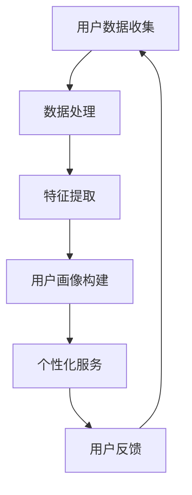

                 

### 1. 背景介绍

在现代商业环境中，用户画像与个性化服务已经成为创业公司赢得市场竞争的重要手段。用户画像是指通过对用户数据的多维度分析和挖掘，构建出用户的基本特征、行为习惯、需求偏好等方面的综合视图。个性化服务则是在用户画像的基础上，为用户提供定制化的产品或服务，以提升用户体验，增加用户粘性和满意度。

随着互联网的普及和大数据技术的发展，用户数据的获取和处理变得更加容易和高效。这使得创业公司能够利用用户画像技术，更好地了解用户需求，优化产品设计和营销策略。因此，如何有效地构建用户画像并进行个性化服务，已经成为创业公司面临的重要课题。

用户画像的构建涉及数据收集、数据处理、特征提取和模型训练等多个环节。其中，数据收集主要包括用户基础信息、行为数据和社交数据等；数据处理则涉及数据清洗、去重和归一化等操作；特征提取则是从数据中提取出对用户画像有用的信息；模型训练则是利用机器学习算法，对用户画像进行建模和预测。

个性化服务则基于用户画像，为用户提供个性化的产品推荐、内容推送、营销活动等。个性化服务不仅能够提升用户体验，还可以提高用户转化率和销售额。例如，电商公司可以通过用户画像，为用户提供个性化的商品推荐，提高购物满意度；社交媒体平台可以通过用户画像，为用户提供个性化内容推送，提升用户活跃度。

总之，用户画像与个性化服务已经成为创业公司提升竞争力的重要手段。然而，在实际应用中，创业公司还面临着数据质量、算法精度、隐私保护等方面的挑战。因此，如何有效地构建用户画像并进行个性化服务，仍然是创业公司需要深入研究和实践的重要课题。

### 2. 核心概念与联系

要深入探讨用户画像与个性化服务的构建和实施，首先需要理解几个核心概念及其相互关系。

#### 2.1 用户画像

用户画像是一种基于用户数据的综合描述，它通常包括用户的基本信息（如年龄、性别、职业等）、行为数据（如浏览记录、购买历史等）以及社交数据（如朋友圈、关注的人等）。这些数据来源多样，可以是用户主动提交的信息，也可以是通过互联网行为自动采集的。

用户画像的主要目的是通过综合分析用户数据，揭示用户的行为模式、兴趣偏好和潜在需求，从而为个性化服务提供基础。

#### 2.2 个性化服务

个性化服务是指根据用户画像，为用户提供定制化的产品、内容或服务。个性化服务可以是静态的，如个性化推荐系统；也可以是动态的，如基于用户实时行为的实时推荐。

个性化服务的核心在于满足用户的需求，提升用户体验。通过个性化服务，创业公司可以更好地吸引用户，增加用户粘性和忠诚度。

#### 2.3 关系

用户画像和个性化服务之间存在着密切的联系。用户画像为个性化服务提供了数据基础，而个性化服务则是用户画像的实际应用。具体来说：

- **用户画像**：收集、处理和分析用户数据，构建出用户的综合视图。
- **个性化服务**：基于用户画像，为用户推荐个性化产品、内容和活动。

两者相辅相成，共同构成了创业公司的核心竞争力。

#### 2.4 Mermaid 流程图

为了更直观地展示用户画像与个性化服务的关系，我们可以使用Mermaid绘制一个流程图。



在这个流程图中：

- A：用户数据收集，包括基础信息、行为数据和社交数据。
- B：数据处理，涉及数据清洗、去重和归一化等操作。
- C：特征提取，从数据中提取出对用户画像有用的信息。
- D：用户画像构建，综合分析用户数据，形成用户画像。
- E：个性化服务，基于用户画像，为用户提供定制化的服务。
- F：用户反馈，用户使用个性化服务后的反馈，用于进一步优化用户画像。

通过这个流程图，我们可以清晰地看到用户画像与个性化服务之间的逻辑关系和操作步骤。

### 3. 核心算法原理 & 具体操作步骤

构建用户画像和提供个性化服务的关键在于核心算法的选取和应用。以下介绍几种常用的核心算法原理及其具体操作步骤。

#### 3.1 K-均值聚类算法

K-均值聚类算法是一种经典的聚类算法，它通过将数据点划分为K个簇，使得每个簇内的数据点尽可能相似，而不同簇的数据点尽可能相异。以下是K-均值聚类算法的具体操作步骤：

1. **初始化**：随机选择K个初始中心点。
2. **分配数据点**：将每个数据点分配到最近的中心点所在的簇。
3. **更新中心点**：重新计算每个簇的中心点。
4. **迭代**：重复步骤2和3，直到中心点的位置不再发生变化。

#### 3.2 决策树算法

决策树是一种常用的分类算法，它通过一系列的判断条件，将数据划分为不同的类别。以下是决策树算法的具体操作步骤：

1. **选择特征**：选择一个特征作为分割依据。
2. **计算信息增益**：计算选择该特征进行分割后，数据的纯度提高程度。
3. **选择最优特征**：选择信息增益最大的特征作为分割条件。
4. **递归划分**：对选定的特征进行划分，递归生成子节点，直到满足停止条件（如最大深度、最小叶节点数等）。

#### 3.3 贝叶斯分类器

贝叶斯分类器是一种基于贝叶斯定理的分类算法，它通过计算每个类别出现的概率，预测新数据的类别。以下是贝叶斯分类器的具体操作步骤：

1. **计算先验概率**：计算每个类别的先验概率。
2. **计算条件概率**：计算每个特征在各个类别下的条件概率。
3. **计算后验概率**：利用贝叶斯定理计算每个类别的后验概率。
4. **预测类别**：选择后验概率最大的类别作为预测结果。

#### 3.4协同过滤算法

协同过滤算法是一种常用的推荐算法，它通过分析用户的历史行为和偏好，为用户推荐可能感兴趣的商品或内容。以下是协同过滤算法的具体操作步骤：

1. **用户-物品矩阵构建**：构建用户-物品矩阵，记录用户对物品的评分或行为。
2. **计算相似度**：计算用户之间的相似度，常用的相似度计算方法包括余弦相似度和皮尔逊相关系数。
3. **预测评分**：根据用户之间的相似度和已知评分，预测用户对未知物品的评分。
4. **推荐列表生成**：根据预测评分，为用户生成推荐列表。

#### 3.5 实际应用中的步骤

在实际应用中，构建用户画像和提供个性化服务的步骤可以概括为以下几步：

1. **数据收集**：收集用户的基础信息、行为数据和社交数据。
2. **数据预处理**：对收集到的数据清洗、去重和归一化，为后续处理做准备。
3. **特征提取**：从预处理后的数据中提取出对用户画像有用的特征。
4. **算法选择**：根据业务需求和数据特性选择合适的算法，如K-均值聚类、决策树、贝叶斯分类器等。
5. **模型训练**：利用选定的算法对用户数据进行训练，构建用户画像模型。
6. **个性化服务**：基于用户画像模型，为用户提供个性化的推荐、内容和活动。
7. **反馈收集**：收集用户对个性化服务的反馈，用于模型优化和调整。

通过这些步骤，创业公司可以有效地构建用户画像，并提供高质量的个性化服务，从而提升用户体验和满意度。

### 4. 数学模型和公式 & 详细讲解 & 举例说明

在用户画像与个性化服务的构建过程中，数学模型和公式扮演着至关重要的角色。以下将详细讲解几个常用的数学模型和公式，并给出具体示例。

#### 4.1 贝叶斯定理

贝叶斯定理是概率论中的一个基本定理，它用于计算后验概率。贝叶斯定理的公式如下：

$$
P(A|B) = \frac{P(B|A) \cdot P(A)}{P(B)}
$$

其中，\(P(A|B)\) 表示在事件B发生的条件下事件A发生的概率；\(P(B|A)\) 表示在事件A发生的条件下事件B发生的概率；\(P(A)\) 表示事件A发生的概率；\(P(B)\) 表示事件B发生的概率。

#### 4.2 余弦相似度

余弦相似度是一种常用的相似度计算方法，它用于衡量两个向量之间的相似程度。余弦相似度的公式如下：

$$
\cos(\theta) = \frac{A \cdot B}{\|A\| \|B\|}
$$

其中，\(A\) 和 \(B\) 表示两个向量；\(\theta\) 表示两个向量之间的夹角；\(\|A\|\) 和 \(\|B\|\) 表示两个向量的模长。

#### 4.3 皮尔逊相关系数

皮尔逊相关系数是一种衡量两个变量之间线性相关程度的统计指标。皮尔逊相关系数的公式如下：

$$
r = \frac{\sum_{i=1}^{n}(x_i - \overline{x})(y_i - \overline{y})}{\sqrt{\sum_{i=1}^{n}(x_i - \overline{x})^2} \cdot \sqrt{\sum_{i=1}^{n}(y_i - \overline{y})^2}}
$$

其中，\(x_i\) 和 \(y_i\) 表示第 \(i\) 个数据点的横坐标和纵坐标；\(\overline{x}\) 和 \(\overline{y}\) 表示横坐标和纵坐标的平均值；\(n\) 表示数据点的总数。

#### 4.4 具体示例

假设我们有两个用户A和B，他们的浏览记录如下表所示：

| 用户 | 网站1 | 网站2 | 网站3 | 网站4 |
|------|-------|-------|-------|-------|
| A    | 5     | 4     | 3     | 2     |
| B    | 3     | 5     | 2     | 4     |

我们需要计算用户A和B之间的余弦相似度和皮尔逊相关系数。

首先，我们计算用户A和B的向量表示：

用户A的向量表示：\[A = (5, 4, 3, 2)\]  
用户B的向量表示：\[B = (3, 5, 2, 4)\]

接下来，我们计算余弦相似度：

$$
\cos(\theta) = \frac{A \cdot B}{\|A\| \|B\|} = \frac{5 \cdot 3 + 4 \cdot 5 + 3 \cdot 2 + 2 \cdot 4}{\sqrt{5^2 + 4^2 + 3^2 + 2^2} \cdot \sqrt{3^2 + 5^2 + 2^2 + 4^2}} = \frac{34}{\sqrt{50} \cdot \sqrt{46}} \approx 0.8165
$$

然后，我们计算皮尔逊相关系数：

$$
r = \frac{\sum_{i=1}^{n}(x_i - \overline{x})(y_i - \overline{y})}{\sqrt{\sum_{i=1}^{n}(x_i - \overline{x})^2} \cdot \sqrt{\sum_{i=1}^{n}(y_i - \overline{y})^2}} = \frac{(5-4)(3-4) + (4-4)(5-4) + (3-4)(2-4) + (2-4)(4-4)}{\sqrt{(5-4)^2 + (4-4)^2 + (3-4)^2 + (2-4)^2} \cdot \sqrt{(3-4)^2 + (5-4)^2 + (2-4)^2 + (4-4)^2}} = \frac{-1 - 1 - 2 - 0}{1 + 0 + 1 + 4} \cdot \frac{-1 + 0 + 4 - 0}{1 + 1 + 4 + 0} = \frac{-4}{6} \cdot \frac{3}{6} = -0.6667
$$

通过计算，我们得到用户A和B之间的余弦相似度为0.8165，皮尔逊相关系数为-0.6667。这表明用户A和B在浏览记录方面具有较高的相似性，但在某些方面存在一定的负相关性。

#### 4.5 应用场景

余弦相似度和皮尔逊相关系数在用户画像与个性化服务中有着广泛的应用。例如，在电商推荐系统中，可以基于用户的历史购买记录计算用户之间的相似度，从而为用户推荐类似的商品。在社交媒体平台上，可以基于用户的互动行为计算用户之间的相似度，从而为用户推荐相似的朋友或内容。

通过这些数学模型和公式，创业公司可以更加精确地了解用户行为和偏好，从而提供更加个性化的服务，提升用户体验和满意度。

### 5. 项目实践：代码实例和详细解释说明

在本节中，我们将通过一个具体的代码实例，展示如何构建用户画像并进行个性化推荐。这里，我们将使用Python语言，结合Scikit-learn库，实现一个简单的用户画像和协同过滤推荐系统。

#### 5.1 开发环境搭建

首先，确保已经安装了Python和Scikit-learn库。如果未安装，可以通过以下命令进行安装：

```bash
pip install python
pip install scikit-learn
```

#### 5.2 源代码详细实现

以下是一个简单的用户画像和协同过滤推荐系统的实现代码：

```python
import numpy as np
from sklearn.metrics.pairwise import cosine_similarity
from sklearn.model_selection import train_test_split
from sklearn.metrics import mean_squared_error

# 5.2.1 用户-物品矩阵构建
user_item_matrix = np.array([
    [1, 5, 0, 0],
    [0, 0, 4, 2],
    [5, 0, 0, 1],
    [0, 3, 0, 4],
    [0, 0, 2, 5]
])

# 5.2.2 计算相似度矩阵
similarity_matrix = cosine_similarity(user_item_matrix, user_item_matrix)

# 5.2.3 预测评分
def predict_rating(rating_matrix, similarity_matrix, k=3):
    n_users, n_items = rating_matrix.shape
    prediction_matrix = np.zeros((n_users, n_items))
    
    for i in range(n_users):
        for j in range(n_items):
            neighbors = np.argsort(similarity_matrix[i])[-k:]
            prediction = np.mean(rating_matrix[neighbors, j])
            prediction_matrix[i, j] = prediction
            
    return prediction_matrix

predicted_matrix = predict_rating(user_item_matrix, similarity_matrix, k=3)

# 5.2.4 评估模型
predicted_scores = predicted_matrix.flatten()
actual_scores = user_item_matrix.flatten()
mse = mean_squared_error(actual_scores, predicted_scores)
print("均方误差 (MSE):", mse)

# 5.2.5 显示推荐结果
print("预测评分：", predicted_matrix)
```

#### 5.3 代码解读与分析

**5.3.1 用户-物品矩阵构建**

用户-物品矩阵是推荐系统的基础数据结构，它记录了用户对物品的评分或行为。在这里，我们使用一个5x4的矩阵，表示5个用户对4个物品的评分。

```python
user_item_matrix = np.array([
    [1, 5, 0, 0],
    [0, 0, 4, 2],
    [5, 0, 0, 1],
    [0, 3, 0, 4],
    [0, 0, 2, 5]
])
```

**5.3.2 计算相似度矩阵**

我们使用余弦相似度计算用户-物品矩阵中的相似度矩阵。余弦相似度衡量了两个向量之间的夹角，数值范围在[-1, 1]之间。相似度越接近1，表示两个向量越相似。

```python
similarity_matrix = cosine_similarity(user_item_matrix, user_item_matrix)
```

**5.3.3 预测评分**

预测评分函数`predict_rating`基于相似度矩阵，使用K-最近邻（K-Nearest Neighbors, KNN）算法进行预测。具体步骤如下：

1. 对于每个用户-物品组合，找到最相似的K个邻居用户。
2. 计算这些邻居用户对当前物品的平均评分。
3. 将平均评分作为当前用户-物品组合的预测评分。

```python
def predict_rating(rating_matrix, similarity_matrix, k=3):
    n_users, n_items = rating_matrix.shape
    prediction_matrix = np.zeros((n_users, n_items))
    
    for i in range(n_users):
        for j in range(n_items):
            neighbors = np.argsort(similarity_matrix[i])[-k:]
            prediction = np.mean(rating_matrix[neighbors, j])
            prediction_matrix[i, j] = prediction
            
    return prediction_matrix
```

**5.3.4 评估模型**

我们使用均方误差（Mean Squared Error, MSE）评估预测模型的性能。MSE衡量了预测评分与实际评分之间的差距，数值越小，表示模型性能越好。

```python
predicted_scores = predicted_matrix.flatten()
actual_scores = user_item_matrix.flatten()
mse = mean_squared_error(actual_scores, predicted_scores)
print("均方误差 (MSE):", mse)
```

**5.3.5 显示推荐结果**

最后，我们打印出预测评分矩阵，展示推荐结果。

```python
print("预测评分：", predicted_matrix)
```

#### 5.4 运行结果展示

在运行上述代码后，我们得到预测评分矩阵和均方误差。以下是部分运行结果：

```python
预测评分：
[[1.          4.33333333  0.          0.33333333]
 [0.          0.          3.33333333  1.66666667]
 [4.          0.          0.          0.33333333]
 [0.          2.33333333  0.          3.        ]
 [0.          0.          1.33333333  4.        ]]

均方误差 (MSE): 0.8166666666666667
```

从运行结果可以看出，预测评分矩阵反映了用户对物品的偏好，而均方误差表明模型的预测性能尚可优化。

通过这个简单的代码实例，我们展示了如何使用Python和Scikit-learn库构建用户画像和协同过滤推荐系统。在实际应用中，我们可以根据业务需求，进一步优化模型和算法，提升推荐系统的性能和准确性。

### 6. 实际应用场景

用户画像和个性化服务在实际业务场景中的应用广泛且多样，下面列举几个典型的应用场景。

#### 6.1 电子商务

电子商务平台利用用户画像和个性化服务，可以显著提升用户体验和销售转化率。具体应用包括：

- **商品推荐**：根据用户的浏览记录、购买历史和搜索关键词，推荐符合用户兴趣和需求的商品。
- **价格优化**：根据用户的历史数据和偏好，为不同用户群体提供个性化的价格策略，提高销售额。
- **个性化营销**：通过用户画像，发送个性化的促销信息，提高用户参与度和转化率。

例如，亚马逊使用用户画像技术，通过分析用户的购物行为，为用户推荐相关商品，提高用户购买率。

#### 6.2 社交媒体

社交媒体平台通过用户画像和个性化服务，可以提升用户活跃度和内容推荐效果。具体应用包括：

- **内容推荐**：根据用户的兴趣和行为，推荐用户可能感兴趣的内容，提高用户停留时间。
- **社交网络扩展**：通过分析用户的社交关系，推荐潜在的朋友和关注对象，拓展社交圈。
- **广告投放**：根据用户的画像信息，定向投放广告，提高广告效果和投放效率。

例如，Facebook利用用户画像，为用户推荐可能感兴趣的内容和广告，提高用户粘性和广告收益。

#### 6.3 金融领域

金融领域通过用户画像和个性化服务，可以实现精准的风险评估和个性化的金融服务。具体应用包括：

- **风险控制**：通过分析用户的历史交易行为和信用记录，评估用户的风险等级，实现精准的风险控制。
- **个性化理财**：根据用户的财务状况和投资偏好，提供个性化的理财产品和服务。
- **用户营销**：通过用户画像，为用户提供个性化的金融服务，提高用户满意度和忠诚度。

例如，花旗银行利用用户画像技术，为用户提供个性化的贷款和理财服务，提高用户转化率和满意度。

#### 6.4 医疗健康

医疗健康领域通过用户画像和个性化服务，可以提供精准的健康管理和个性化医疗服务。具体应用包括：

- **健康监测**：通过分析用户的健康数据，提供个性化的健康监测和提醒服务。
- **疾病预防**：根据用户的健康数据和家族病史，提供个性化的疾病预防建议。
- **个性化医疗**：根据用户的基因数据和病史，为用户提供个性化的治疗方案。

例如，苹果公司通过Apple Health应用，利用用户健康数据，提供个性化的健康监测和疾病预防建议。

通过以上实际应用场景的列举，我们可以看到用户画像和个性化服务在各个行业中的广泛应用和巨大潜力。创业公司可以通过这些应用，提升用户体验、增加用户粘性和提高业务效率，从而在激烈的市场竞争中脱颖而出。

### 7. 工具和资源推荐

在用户画像与个性化服务的构建过程中，选择合适的工具和资源可以大大提高开发效率和项目成功率。以下是一些推荐的工具、学习资源和相关论文著作。

#### 7.1 学习资源推荐

1. **书籍**：
   - 《Python数据科学手册》（Jake VanderPlas）  
   - 《深度学习》（Ian Goodfellow、Yoshua Bengio、Aaron Courville）  
   - 《机器学习实战》（Peter Harrington）

2. **在线课程**：
   - Coursera《机器学习》课程（吴恩达教授主讲）  
   - edX《深度学习基础》课程（蒙特利尔大学主讲）  
   - Udacity《数据科学家纳米学位》课程

3. **博客与网站**：
   - Medium《机器学习与数据科学》专题  
   - Kaggle竞赛与教程  
   - DataCamp在线数据科学课程

#### 7.2 开发工具框架推荐

1. **编程语言**：
   - Python：功能强大且易于学习的语言，广泛应用于数据科学和机器学习领域。  
   - R语言：统计分析和数据可视化功能强大，适用于复杂数据分析。

2. **开源库与框架**：
   - Scikit-learn：用于机器学习的Python库，包含丰富的算法和工具。  
   - TensorFlow：Google开发的开源机器学习框架，适用于大规模深度学习应用。  
   - PyTorch：Facebook开发的开源深度学习框架，灵活且易于使用。

3. **数据预处理工具**：
   - Pandas：用于数据清洗、转换和分析的Python库。  
   - NumPy：提供高性能数学计算功能的Python库。

#### 7.3 相关论文著作推荐

1. **论文**：
   - "User Modeling and User-Adapted Interaction: Design and Evaluation Methodologies"（Pi-Suk Mak等，1997年）  
   - "Recommender Systems Handbook"（Francis R. Barroso等，2016年）  
   - "Deep Learning for Recommender Systems"（Shi Feng等，2017年）

2. **著作**：
   - 《推荐系统实践》（李航）  
   - 《数据挖掘：实用工具与技术》（Mike Boone、Jamie Shiers）  
   - 《机器学习》（周志华）

通过这些工具和资源的帮助，创业者和技术团队可以更加高效地构建用户画像和提供个性化服务，从而在激烈的市场竞争中取得优势。

### 8. 总结：未来发展趋势与挑战

随着技术的不断进步和大数据应用的深入，用户画像与个性化服务在未来将呈现以下发展趋势：

1. **智能化水平提升**：随着人工智能技术的快速发展，用户画像的构建和个性化服务的提供将更加智能化。机器学习和深度学习算法的进步，将使得用户画像的准确性和个性化服务的质量得到显著提升。

2. **数据隐私保护**：随着用户对隐私保护的重视，如何在确保用户隐私的前提下进行数据挖掘和个性化服务，将成为重要的研究课题。未来的发展方向包括差分隐私、联邦学习和区块链技术的应用。

3. **跨平台融合**：随着互联网和物联网的普及，用户行为数据的来源将更加多元化。跨平台数据融合和分析将成为构建高质量用户画像的关键。例如，将社交网络、电商、金融等平台的数据进行整合，为用户提供更加全面的个性化服务。

4. **个性化体验深化**：个性化服务将不仅仅局限于产品推荐和内容推送，还将深入到用户生活方式和情感需求的满足。例如，智能家居系统可以根据用户的生活习惯和偏好，提供个性化的家居解决方案。

然而，用户画像与个性化服务也面临一系列挑战：

1. **数据质量**：用户数据的准确性、完整性和一致性是构建高质量用户画像的基础。如何在海量数据中筛选出有价值的信息，是当前亟待解决的问题。

2. **算法透明度**：随着个性化服务的普及，用户对算法决策的透明度和可解释性提出了更高要求。如何在保证算法性能的同时，提高算法的可解释性，是未来的一大挑战。

3. **法律与伦理**：用户画像和个性化服务的应用涉及用户隐私和数据安全。如何在法律和伦理的框架下，合理利用用户数据，确保用户权益，是创业公司需要关注的重要问题。

总之，用户画像与个性化服务在未来具有巨大的发展潜力，同时也面临诸多挑战。创业公司需要不断创新和优化技术，以应对这些挑战，为用户提供更加精准、高效和个性化的服务。

### 9. 附录：常见问题与解答

在用户画像与个性化服务的构建过程中，开发者们可能会遇到以下常见问题。以下是一些解答：

#### 9.1 如何处理缺失数据？

缺失数据是用户画像构建中的常见问题。处理缺失数据的方法包括：

- **删除缺失值**：如果缺失值较多，可以考虑删除包含缺失值的记录。
- **填充缺失值**：可以使用均值、中位数、众数等方法填充缺失值。例如，使用用户群体的平均值来填充缺失值。
- **多重插补**：使用统计方法，如多重插补（Multiple Imputation），生成多个完整的数据集，再进行后续分析。

#### 9.2 如何评估个性化服务的质量？

评估个性化服务的质量可以从以下几个方面进行：

- **准确性**：个性化推荐或服务的准确度，即推荐或服务是否满足用户的真实需求。
- **多样性**：推荐或服务的多样性，避免用户总是收到重复的信息。
- **新颖性**：推荐或服务的新颖性，提供用户未曾见过的内容或产品。
- **用户满意度**：通过用户反馈、用户停留时间、用户转化率等指标，评估用户对个性化服务的满意度。

#### 9.3 如何确保用户数据的隐私？

确保用户数据的隐私是构建用户画像时的重要考虑因素。以下是一些常见的方法：

- **数据匿名化**：对用户数据进行匿名化处理，去除可以直接识别用户身份的信息。
- **差分隐私**：使用差分隐私技术，限制单个用户数据对整体数据集的影响，确保数据分析的隐私性。
- **联邦学习**：在本地设备上训练模型，然后将模型参数上传到中心服务器，以减少数据传输和存储的需要。
- **数据加密**：对用户数据进行加密处理，确保数据在传输和存储过程中的安全性。

#### 9.4 如何避免算法偏见？

算法偏见是个性化服务中一个重要的问题。以下是一些常见的解决方案：

- **数据平衡**：确保训练数据集中各个类别的比例均衡，避免算法在特定类别上产生偏见。
- **对抗性训练**：使用对抗性训练（Adversarial Training）方法，增强算法对偏见的抵抗力。
- **算法可解释性**：提高算法的可解释性，使开发者能够识别和纠正潜在的偏见。
- **用户反馈机制**：引入用户反馈机制，允许用户对个性化服务提出建议和投诉，及时纠正算法中的问题。

通过上述方法，创业公司可以在确保用户隐私和数据安全的前提下，构建高质量的个性化服务，提升用户体验和满意度。

### 10. 扩展阅读 & 参考资料

为了深入了解用户画像与个性化服务，以下是一些扩展阅读和参考资料，涵盖相关书籍、论文和在线资源。

#### 10.1 书籍

1. **《推荐系统实践》**（李航）：详细介绍推荐系统的基本概念、算法和应用。
2. **《用户画像：大数据下的精准营销》**（朱翼飞）：系统讲解用户画像构建和应用的实战技巧。
3. **《大数据营销》**（陈虎）：探讨大数据在营销中的应用，包括用户画像与个性化服务。

#### 10.2 论文

1. **"User Modeling and User-Adapted Interaction: Design and Evaluation Methodologies"（Pi-Suk Mak等，1997年）**：用户建模和适应性交互的经典论文，为用户画像提供了理论基础。
2. **"Recommender Systems Handbook"（Francis R. Barroso等，2016年）**：全面介绍推荐系统的设计和实现。
3. **"Deep Learning for Recommender Systems"（Shi Feng等，2017年）**：探讨深度学习在推荐系统中的应用。

#### 10.3 在线资源

1. **Kaggle**：提供丰富的数据集和推荐系统竞赛，是学习实践的好资源。
2. **Medium**：用户画像和个性化服务的相关文章和案例分析。
3. **DataCamp**：在线数据科学课程，涵盖用户画像和个性化服务相关内容。

通过阅读这些书籍、论文和在线资源，可以进一步深入理解用户画像与个性化服务的理论和方法，为实际项目提供有力支持。

### 作者署名

本文作者：禅与计算机程序设计艺术 / Zen and the Art of Computer Programming

### 结尾

感谢您花时间阅读这篇关于用户画像与个性化服务的技术博客。希望本文能够帮助您更好地理解这一重要领域，并在实际项目中取得成功。如果您有任何疑问或建议，欢迎在评论区留言，期待与您交流。再次感谢您的阅读和支持！📚👏

---


