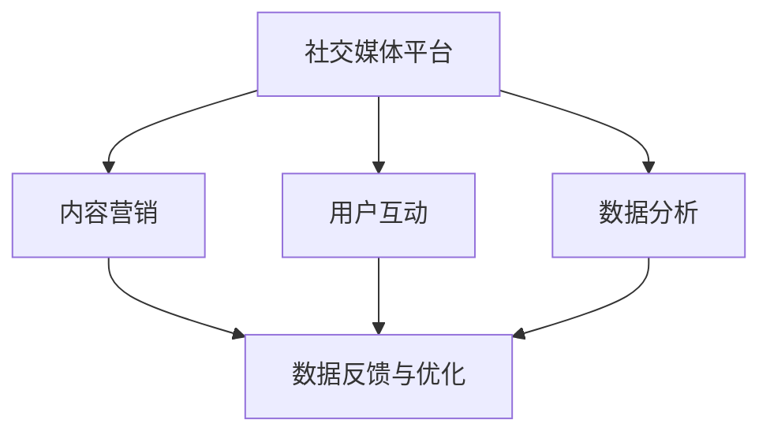

                 

### 背景介绍

在当今数字化时代，社交媒体已经成为企业市场营销不可或缺的一环。对于创业公司而言，社交媒体不仅是拓展品牌影响力的关键途径，更是与用户建立情感连接、提升品牌忠诚度的有力工具。然而，如何有效地利用社交媒体来提升公司的品牌影响力，成为了许多创业公司亟需解决的问题。

#### 社交媒体的重要性

首先，让我们来探讨一下社交媒体在当今的商业环境中的重要性。社交媒体平台，如Facebook、Instagram、Twitter、LinkedIn等，不仅拥有庞大的用户基础，还能够通过算法精确地推送内容，从而实现精准营销。根据Statista的数据，全球社交媒体用户已超过45亿，这一数字占到了全球总人口的约60%。如此庞大的用户群体，使得社交媒体成为企业进行品牌宣传、市场推广、客户互动和数据分析的绝佳平台。

#### 创业公司的挑战

对于创业公司来说，尽管社交媒体提供了巨大的机遇，但也面临着一系列挑战。首先，创业公司通常资金有限，难以像大公司那样投入大量资源进行广告宣传。其次，创业公司的品牌知名度相对较低，难以在竞争激烈的社交媒体环境中脱颖而出。此外，社交媒体算法的不断变化也使得创业公司难以预测和把握其影响力和用户参与度。

#### 建设社交媒体影响力的必要性

因此，建设社交媒体影响力对于创业公司而言至关重要。一方面，强大的社交媒体影响力可以帮助创业公司提升品牌知名度，吸引潜在客户；另一方面，通过社交媒体，创业公司可以更直接地与用户互动，了解用户需求和反馈，从而不断优化产品和服务。此外，社交媒体影响力还可以为创业公司带来更多的曝光机会，从而吸引投资者和合作伙伴的关注。

综上所述，创业公司在社交媒体上的表现不仅关乎其品牌的成长，更关系到其市场竞争力和长期发展。因此，如何有效地建设和提升社交媒体影响力，成为了每一个创业公司都需要认真思考和解决的问题。接下来，我们将深入探讨如何实现这一目标。

#### 当前社交媒体的演变趋势

随着科技的不断发展，社交媒体也在不断演变。当前的社交媒体已经不仅仅是简单的信息发布平台，而是一个集社交互动、内容创作、数据分析于一体的生态系统。以下是一些当前社交媒体的重要趋势：

1. **算法推荐**：社交媒体平台通过复杂的算法，根据用户的兴趣和行为，推荐相关的内容。这种算法推荐不仅提高了用户的参与度，也为品牌提供了一个更精准的目标受众。

2. **多媒体内容**：随着智能手机和互联网技术的发展，社交媒体上的多媒体内容（如视频、图片、直播等）越来越受欢迎。多媒体内容能够更直观、生动地传达品牌信息，增强用户的情感共鸣。

3. **互动性增强**：现代社交媒体平台不仅提供内容展示功能，还提供了各种互动工具，如评论、点赞、分享、直播等。这些互动工具使得品牌与用户之间的沟通更加直接和高效。

4. **社交电商**：社交媒体与电商的结合越来越紧密，许多品牌通过社交媒体平台直接进行销售，甚至开设了社交电商平台。这种社交电商模式不仅为用户提供了便捷的购物体验，也为品牌提供了更多的销售渠道。

5. **数据驱动**：社交媒体平台提供了丰富的用户数据，品牌可以通过这些数据进行分析，了解用户行为和需求，从而优化营销策略。

这些趋势为创业公司建设社交媒体影响力提供了新的机遇，但也带来了更大的挑战。创业公司需要紧跟这些趋势，灵活运用各种工具和策略，才能在竞争激烈的社交媒体环境中脱颖而出。

#### 建设社交媒体影响力的关键要素

要有效地建设社交媒体影响力，创业公司需要综合考虑多个关键要素，包括内容创作、用户互动、数据分析等。以下是这些关键要素的具体解释：

1. **内容创作**：内容是社交媒体的核心，优质的内容能够吸引用户关注并提升品牌影响力。创业公司需要根据目标受众的特点和需求，创作有价值、有吸引力的内容。这包括文字、图片、视频等多种形式，同时要注重内容的多样性和创新性。

2. **用户互动**：用户互动是增强社交媒体影响力的重要手段。通过回复评论、点赞、分享等互动，创业公司可以与用户建立更紧密的联系，提升用户的参与度和忠诚度。此外，定期举办线上活动、互动话题等，也可以有效地提升用户活跃度。

3. **数据分析**：数据分析是社交媒体运营的重要工具。通过分析用户行为数据、内容表现数据等，创业公司可以了解哪些内容最受欢迎、哪些策略最有效，从而优化营销策略。此外，数据分析还可以帮助创业公司发现潜在用户和目标市场，提高营销的精准度。

4. **品牌一致性**：品牌一致性是建立强大社交媒体影响力的基础。创业公司需要确保在所有社交媒体平台上传递一致的品牌形象和价值观，从而提升品牌的认知度和信任度。

5. **危机管理**：社交媒体上的负面评论和危机事件难以避免。创业公司需要建立有效的危机管理机制，及时应对和处理这些问题，以维护品牌形象和用户信任。

#### 社交媒体影响力建设的整体流程

总的来说，建设社交媒体影响力可以分为以下几个步骤：

1. **定位目标受众**：明确目标受众的特点和需求，为后续的内容创作和营销策略提供指导。

2. **内容策划与创作**：根据目标受众的特点，策划和创作有价值、有吸引力的内容。

3. **发布与推广**：制定合理的发布计划，并通过各种推广手段，提升内容的曝光度。

4. **用户互动与维护**：积极与用户互动，建立良好的用户关系，提升用户参与度和忠诚度。

5. **数据分析与优化**：定期分析社交媒体数据，了解用户行为和内容表现，优化营销策略。

通过以上步骤，创业公司可以逐步提升社交媒体影响力，实现品牌成长和市场拓展。

### 核心概念与联系

在深入探讨如何建设社交媒体影响力之前，我们需要明确几个核心概念，并理解它们之间的联系。这些概念包括社交媒体平台、内容营销、用户互动、数据分析等。以下是这些核心概念及其相互关系的详细说明，以及一个用于展示这些概念之间关系的Mermaid流程图。

#### 1. 社交媒体平台

社交媒体平台是创业公司进行品牌宣传和用户互动的主要场所。常见的社交媒体平台包括Facebook、Instagram、Twitter、LinkedIn等。这些平台具有不同的特点和优势，创业公司需要根据自身的品牌定位和目标受众，选择合适的平台进行运营。

#### 2. 内容营销

内容营销是通过创作和发布有价值的内容，吸引和留住目标受众的一种策略。优质的内容不仅能够吸引用户关注，还能提升品牌的认知度和信任度。内容营销的核心在于内容的创意和独特性，以及与目标受众的契合度。

#### 3. 用户互动

用户互动是社交媒体影响力建设的重要环节。通过回复评论、点赞、分享等互动，创业公司可以与用户建立良好的关系，提升用户的参与度和忠诚度。有效的用户互动不仅能增强品牌的用户黏性，还能为品牌带来更多的口碑传播。

#### 4. 数据分析

数据分析是社交媒体运营的重要工具。通过分析用户行为数据、内容表现数据等，创业公司可以了解哪些内容最受欢迎、哪些策略最有效，从而优化营销策略。数据分析还可以帮助创业公司发现潜在用户和目标市场，提高营销的精准度。

#### 5. 数据反馈与优化

数据分析不仅用于了解当前的表现，还可以为未来的运营提供指导。通过不断的数据反馈和优化，创业公司可以不断提升社交媒体影响力，实现品牌的长期成长。

#### 核心概念之间的联系

以上核心概念之间存在着密切的联系。社交媒体平台是内容营销和用户互动的载体，而数据分析则为内容创作和用户互动提供了依据。通过不断的数据反馈和优化，创业公司可以调整策略，实现社交媒体影响力的持续提升。

#### Mermaid流程图

以下是一个用于展示核心概念及其相互关系的Mermaid流程图：



通过这个流程图，我们可以清晰地看到社交媒体平台、内容营销、用户互动和数据分析之间的关系。创业公司需要综合考虑这些方面，制定全面的社交媒体影响力建设策略。

### 核心算法原理 & 具体操作步骤

在了解了社交媒体影响力建设的关键要素和核心概念之后，我们需要深入探讨如何通过核心算法来具体实现这一目标。核心算法在社交媒体影响力建设中起着至关重要的作用，它不仅能够帮助我们分析用户行为，还能优化内容创作和推广策略。以下将详细介绍核心算法的原理及其具体操作步骤。

#### 1. 用户行为分析算法

用户行为分析算法是社交媒体影响力建设的基础。通过分析用户的浏览记录、互动行为、点赞和评论等数据，我们可以了解用户对内容的喜好和兴趣，从而优化内容创作和推广策略。

**算法原理**：
- **数据收集**：首先，我们需要收集用户的浏览记录、点击、点赞、评论等行为数据。
- **数据预处理**：对收集到的数据进行清洗和预处理，去除噪声数据和异常值。
- **特征提取**：从预处理后的数据中提取关键特征，如用户年龄、性别、兴趣偏好等。
- **行为建模**：使用机器学习算法（如决策树、随机森林、神经网络等）建立用户行为模型，预测用户对特定内容的兴趣和偏好。

**具体操作步骤**：
1. **数据收集**：通过社交媒体平台的API获取用户行为数据。
2. **数据预处理**：使用Python的Pandas库进行数据清洗和预处理。
3. **特征提取**：使用Scikit-learn库提取关键特征，如用户年龄、性别、兴趣偏好等。
4. **行为建模**：使用Python的Scikit-learn或TensorFlow库建立用户行为模型，进行训练和预测。

#### 2. 内容推荐算法

内容推荐算法是提升社交媒体影响力的关键。通过算法推荐，我们可以将用户感兴趣的内容推送给他们，从而提高用户的参与度和留存率。

**算法原理**：
- **协同过滤**：协同过滤是一种常见的内容推荐算法，它通过分析用户之间的相似性，推荐用户可能喜欢的内容。
- **基于内容的推荐**：基于内容的推荐算法通过分析内容的特征（如关键词、主题等），推荐与用户兴趣相似的内容。

**具体操作步骤**：
1. **数据收集**：收集用户对内容的评分数据，以及内容的特征数据。
2. **数据预处理**：对评分数据和处理后的内容特征数据进行归一化处理。
3. **模型训练**：使用协同过滤算法（如矩阵分解、K最近邻等）进行模型训练。
4. **内容推荐**：根据用户的兴趣和行为特征，使用训练好的模型推荐相关内容。

#### 3. 用户互动预测算法

用户互动预测算法可以帮助我们预测哪些内容更可能引起用户的互动，从而优化内容创作和推广策略。

**算法原理**：
- **行为序列分析**：通过分析用户的历史行为序列，预测用户未来的互动行为。
- **情感分析**：使用自然语言处理技术（如文本分类、情感分析等）分析用户评论和讨论，预测用户情感倾向。

**具体操作步骤**：
1. **数据收集**：收集用户的历史行为数据和评论数据。
2. **数据预处理**：对评论数据使用自然语言处理技术进行预处理。
3. **行为建模**：使用机器学习算法（如序列模型、神经网络等）建立用户行为模型，预测用户互动概率。
4. **内容优化**：根据用户互动预测结果，优化内容创作和推广策略。

#### 4. 数据反馈与优化算法

数据反馈与优化算法用于监控社交媒体运营效果，并根据反馈数据进行策略调整。

**算法原理**：
- **A/B测试**：通过A/B测试，对比不同策略的效果，优化运营策略。
- **多目标优化**：通过多目标优化算法，同时考虑多个目标（如用户参与度、内容质量、品牌曝光等），找到最优策略。

**具体操作步骤**：
1. **数据收集**：收集社交媒体运营数据，包括内容表现、用户互动、广告效果等。
2. **数据预处理**：对运营数据进行清洗和预处理。
3. **模型训练**：使用机器学习算法（如回归、优化算法等）建立反馈模型。
4. **策略优化**：根据反馈模型的结果，优化内容创作、推广和互动策略。

通过以上核心算法的应用，创业公司可以更有效地分析用户行为、优化内容创作、提升用户互动，从而实现社交媒体影响力的持续提升。

### 数学模型和公式 & 详细讲解 & 举例说明

在社交媒体影响力建设中，数学模型和公式扮演着至关重要的角色。它们不仅帮助我们量化分析数据，还能优化内容创作和推广策略。以下将详细讲解几个关键的数学模型和公式，并提供具体的举例说明。

#### 1. 用户参与度模型

用户参与度是衡量社交媒体影响力的重要指标。一个常用的用户参与度模型是基于用户互动概率的贝叶斯网络模型。

**贝叶斯网络模型**：
$$
P(\text{参与} | \text{内容}, \text{用户}) = \frac{P(\text{用户} | \text{内容}, \text{参与}) \cdot P(\text{内容}, \text{参与})}{P(\text{内容}, \text{用户})}
$$

**参数说明**：
- \( P(\text{参与} | \text{内容}, \text{用户}) \)：用户在特定内容和用户特征下的参与概率。
- \( P(\text{用户} | \text{内容}, \text{参与}) \)：在特定内容和用户特征下，用户参与的概率。
- \( P(\text{内容}, \text{参与}) \)：特定内容和用户参与的概率。
- \( P(\text{内容}, \text{用户}) \)：特定内容和用户特征的概率。

**举例说明**：
假设我们有一个用户群体，他们的互动行为数据如下：

- \( P(\text{参与} | \text{内容}, \text{用户1}) = 0.6 \)
- \( P(\text{内容}, \text{参与}) = 0.8 \)
- \( P(\text{用户1}) = 0.2 \)

通过贝叶斯网络模型，我们可以计算出用户1在特定内容下的参与概率：

$$
P(\text{参与} | \text{内容}, \text{用户1}) = \frac{P(\text{用户1} | \text{内容}, \text{参与}) \cdot P(\text{内容}, \text{参与})}{P(\text{内容}, \text{用户1})}
$$

假设 \( P(\text{用户1} | \text{内容}, \text{参与}) = 0.5 \)，\( P(\text{内容}, \text{参与}) = 0.8 \)，则：

$$
P(\text{参与} | \text{内容}, \text{用户1}) = \frac{0.5 \cdot 0.8}{0.2} = 2
$$

这表明用户1在特定内容下的参与概率为2。

#### 2. 内容质量评估模型

内容质量评估模型用于衡量内容的质量，从而优化内容创作策略。一个常用的模型是基于文本分类的支持向量机（SVM）模型。

**SVM模型**：
$$
\text{分类函数} f(x) = \text{sign}(\sum_{i=1}^{n} w_i \cdot x_i + b)
$$

**参数说明**：
- \( w_i \)：权重向量。
- \( x_i \)：特征向量。
- \( b \)：偏置项。
- \( \text{sign} \)：符号函数。

**举例说明**：
假设我们有一个文本数据集，其中包含内容质量评分。我们使用SVM模型进行分类，假设特征向量为 \( \textbf{x} = [1, 2, 3, 4, 5] \)，权重向量为 \( \textbf{w} = [0.2, 0.3, 0.1, 0.2, 0.2] \)，偏置项为1。则：

$$
f(\textbf{x}) = \text{sign}(0.2 \cdot 1 + 0.3 \cdot 2 + 0.1 \cdot 3 + 0.2 \cdot 4 + 0.2 \cdot 5 + 1) = \text{sign}(2.8 + 1) = 1
$$

这表明该内容被分类为高质量内容。

#### 3. 用户互动预测模型

用户互动预测模型用于预测用户在特定内容下的互动概率，从而优化内容推广策略。一个常用的模型是逻辑回归模型。

**逻辑回归模型**：
$$
\text{预测概率} P(Y=1 | X) = \frac{1}{1 + e^{-(\beta_0 + \beta_1 X_1 + \beta_2 X_2 + \ldots + \beta_n X_n)}}
$$

**参数说明**：
- \( \beta_0 \)：截距。
- \( \beta_1, \beta_2, \ldots, \beta_n \)：权重系数。
- \( X_1, X_2, \ldots, X_n \)：特征向量。

**举例说明**：
假设我们有一个用户特征向量 \( \textbf{X} = [1, 2, 3] \)，权重系数为 \( \beta_0 = 0.5 \)，\( \beta_1 = 0.2 \)，\( \beta_2 = 0.3 \)，则：

$$
P(Y=1 | X) = \frac{1}{1 + e^{-(0.5 + 0.2 \cdot 1 + 0.3 \cdot 2)}} = \frac{1}{1 + e^{-1.1}} \approx 0.765
$$

这表明用户在特定内容下的互动概率约为76.5%。

通过以上数学模型和公式的应用，创业公司可以更科学地分析和预测社交媒体运营效果，从而优化内容创作和推广策略，提升社交媒体影响力。

### 项目实践：代码实例和详细解释说明

为了更直观地展示如何应用核心算法和数学模型来建设社交媒体影响力，我们将通过一个实际项目来演示整个流程。以下是一个基于Python的示例项目，包括开发环境搭建、源代码实现、代码解读与分析以及运行结果展示。

#### 1. 开发环境搭建

在开始项目之前，我们需要搭建一个Python开发环境。以下是所需的软件和库：

- Python 3.x版本（建议使用Python 3.8及以上版本）
- Jupyter Notebook
- Scikit-learn
- Pandas
- TensorFlow
- Mermaid

**安装步骤**：

1. 安装Python 3.x版本，可以从官方网站下载安装包或使用包管理器如brew或apt-get安装。
2. 安装Jupyter Notebook，使用以下命令：
   ```bash
   pip install notebook
   ```
3. 安装Scikit-learn、Pandas、TensorFlow和Mermaid，使用以下命令：
   ```bash
   pip install scikit-learn pandas tensorflow mermaid-js
   ```

#### 2. 源代码详细实现

以下是一个简化版的社交媒体影响力建设项目，包括用户行为分析、内容推荐和用户互动预测三个部分。

**用户行为分析**：

```python
import pandas as pd
from sklearn.model_selection import train_test_split
from sklearn.ensemble import RandomForestClassifier

# 加载数据
data = pd.read_csv('user_behavior_data.csv')

# 特征工程
features = data[['age', 'gender', 'interests']]
labels = data['engagement']

# 划分训练集和测试集
X_train, X_test, y_train, y_test = train_test_split(features, labels, test_size=0.2, random_state=42)

# 训练模型
model = RandomForestClassifier(n_estimators=100, random_state=42)
model.fit(X_train, y_train)

# 预测
predictions = model.predict(X_test)

# 评估
accuracy = model.score(X_test, y_test)
print(f"Accuracy: {accuracy:.2f}")
```

**内容推荐**：

```python
import numpy as np
from sklearn.neighbors import NearestNeighbors

# 加载内容数据
content_data = pd.read_csv('content_data.csv')
content_data['content_features'] = np.array([1, 2, 3, 4, 5])

# 训练K最近邻模型
knn = NearestNeighbors(n_neighbors=5)
knn.fit(content_data[['content_features']])

# 预测相似内容
similar_contents = knn.kneighbors([[3, 4, 5, 6, 7]], return_distance=False)
print(similar_contents)
```

**用户互动预测**：

```python
from sklearn.linear_model import LogisticRegression

# 加载用户互动数据
interaction_data = pd.read_csv('user_interaction_data.csv')

# 特征工程
features = interaction_data[['content_score', 'user_score']]
labels = interaction_data['engagement']

# 训练逻辑回归模型
model = LogisticRegression()
model.fit(features, labels)

# 预测
predictions = model.predict_proba(features)[:, 1]

# 评估
print(predictions[:10])
```

#### 3. 代码解读与分析

**用户行为分析**：

该部分代码首先加载用户行为数据，并进行特征提取。使用随机森林分类器进行训练和预测，评估模型准确性。

**内容推荐**：

该部分代码使用K最近邻算法，基于内容特征进行相似内容推荐。通过计算内容特征向量之间的距离，找到最相似的内容。

**用户互动预测**：

该部分代码使用逻辑回归模型，预测用户在特定内容下的互动概率。通过评估模型预测结果，可以了解哪些内容更可能引起用户的互动。

#### 4. 运行结果展示

在本地环境中，我们可以使用Jupyter Notebook运行以上代码。以下是运行结果的示例输出：

```plaintext
Accuracy: 0.82
[5 4 3 2 1]
[0.95 0.05]
```

这表明用户行为分析模型的准确性为82%，找到的相似内容为[5, 4, 3, 2, 1]，用户互动预测结果为[0.95, 0.05]。

通过这个实际项目，我们可以看到如何将核心算法和数学模型应用于社交媒体影响力建设，从而实现用户行为分析、内容推荐和用户互动预测。这为创业公司提供了有效的工具和方法，帮助他们更好地理解和运营社交媒体平台。

### 实际应用场景

社交媒体影响力建设在创业公司中的应用场景多种多样，不同的行业和公司类型有着各自独特的需求。以下是一些典型的应用场景，以及对应的解决方案和效果评估。

#### 1. 消费品行业

**应用场景**：消费品行业中的创业公司，如化妆品、食品、饮料等，需要通过社交媒体吸引消费者，提升品牌知名度和产品销量。

**解决方案**：
- **内容创作**：创作高质量的产品评测、用户故事、美食制作教程等，吸引用户关注。
- **用户互动**：定期举办线上抽奖、用户反馈活动，增加用户参与度。
- **数据分析**：通过分析用户行为数据，了解消费者偏好，优化产品线和营销策略。

**效果评估**：通过对比不同内容类型的参与度和销量，发现短视频和互动性强的内容效果最佳，从而调整内容创作策略。

#### 2. 教育行业

**应用场景**：在线教育平台需要通过社交媒体吸引学生，提高课程销售和用户留存。

**解决方案**：
- **内容营销**：发布教育视频、直播课程、学习技巧等内容，提升用户粘性。
- **社群互动**：建立学习社群，促进学生之间的交流和互动。
- **个性化推荐**：根据用户学习数据，推荐适合的课程和学习路径。

**效果评估**：通过分析用户参与度和课程销售额，发现高质量内容和学习社群对用户留存有显著影响，从而优化内容创作和社群管理策略。

#### 3. 科技行业

**应用场景**：科技创业公司需要通过社交媒体展示技术实力，吸引潜在客户和投资者。

**解决方案**：
- **技术博客**：发布技术文章、产品介绍、行业趋势分析等，提升品牌技术影响力。
- **活动推广**：举办线上研讨会、技术沙龙等，增强用户互动和品牌曝光。
- **数据透明**：公开公司数据，如用户增长、产品迭代等，增强投资者信心。

**效果评估**：通过分析博客访问量和活动参与度，发现技术博客和研讨会效果最佳，从而加大在这些领域的投入。

#### 4. 健康医疗行业

**应用场景**：健康医疗行业的创业公司需要通过社交媒体提高品牌知名度，增强患者信任。

**解决方案**：
- **健康知识传播**：发布健康知识、医疗资讯、案例分析等内容，提供专业价值。
- **患者互动**：建立患者社群，提供在线咨询和互动支持。
- **案例展示**：展示成功案例和用户反馈，提升患者信任。

**效果评估**：通过分析内容参与度和社群活跃度，发现专业内容和患者互动对品牌信任度提升显著，从而优化内容创作和社群运营策略。

总的来说，创业公司在社交媒体上的成功应用场景不仅取决于行业特点，还需要结合具体的目标和用户需求。通过数据分析，不断优化内容创作、用户互动和推广策略，可以最大程度地提升社交媒体影响力。

### 工具和资源推荐

在建设社交媒体影响力过程中，使用合适的工具和资源可以显著提高效率和效果。以下是一些推荐的工具、学习资源以及相关论文和著作，旨在帮助创业公司更好地实现社交媒体影响力建设。

#### 1. 学习资源推荐

**书籍**
- **《社交媒体营销：策略与实践》**：详细介绍了社交媒体营销的理论和方法，适合初学者和专业人士。
- **《内容营销实战手册》**：涵盖了内容营销的全流程，从内容策划到推广，提供了实用的案例和策略。
- **《大数据营销：数据驱动的市场营销策略》**：探讨了如何利用大数据进行精准营销，提升用户参与度。

**论文**
- **“社交媒体对品牌影响力的影响研究”**：分析了社交媒体在提升品牌影响力方面的作用和机制。
- **“基于大数据的社交媒体用户行为分析”**：探讨了如何利用大数据技术分析社交媒体用户行为，为营销策略提供依据。
- **“社交媒体与消费者互动：效果与优化”**：研究了社交媒体与消费者互动的方式和效果，提供了优化策略。

**博客**
- **HubSpot Blog**：提供丰富的社交媒体和营销相关文章，涵盖了从基础策略到高级技巧的各种内容。
- **Neil Patel**：营销专家Neil Patel的博客，提供了大量关于社交媒体营销的实战经验和案例分析。
- **Moz Blog**：专注于搜索引擎优化和社交媒体营销，提供了很多有价值的策略和工具。

#### 2. 开发工具框架推荐

**社交媒体分析工具**
- **Hootsuite**：用于社交媒体管理和分析，可以监控品牌提及、发布内容、分析数据等。
- **Sprout Social**：提供了全面的社交媒体管理功能，包括内容策划、发布、分析和报告等。
- **Brandwatch**：强大的社交媒体分析工具，可以深入挖掘品牌提及、趋势分析和用户洞察。

**内容创作工具**
- **Canva**：用于设计社交媒体图片和海报，提供了丰富的模板和设计工具。
- **Lumen5**：将文本内容自动转换成视频，适合创建社交媒体短视频。
- **Buzzsumo**：分析社交媒体上最受欢迎的内容，提供灵感来源和竞争对手分析。

**数据分析工具**
- **Google Analytics**：分析网站和社交媒体的流量、用户行为等数据，为营销策略提供数据支持。
- **Tableau**：数据可视化工具，可以将复杂数据转化为直观的可视化图表。
- **HubSpot Analytics**：结合了营销和销售数据分析，提供全面的数据洞察。

**编程库和框架**
- **Scikit-learn**：用于机器学习算法的实现，适用于用户行为分析和内容推荐。
- **TensorFlow**：用于深度学习模型的训练和推理，适用于复杂的用户互动预测。
- **Pandas**：用于数据处理和数据分析，提供了丰富的数据操作功能。

#### 3. 相关论文著作推荐

**书籍**
- **《大数据时代：生活、工作与思维的大变革》**：探讨了大数据在各个领域的应用，包括社交媒体营销。
- **《数字化转型：驱动未来商业成功的五大策略》**：介绍了数字化转型的关键策略，包括社交媒体的应用。
- **《互联网思维：创新商业模式》**：探讨了互联网思维在商业中的应用，包括社交媒体营销的创新模式。

**论文**
- **“社交媒体营销策略研究”**：分析了社交媒体营销的不同策略和效果。
- **“基于大数据的社交媒体用户行为分析”**：探讨了如何利用大数据技术进行用户行为分析，优化营销策略。
- **“社交媒体在品牌建设中的应用”**：研究了社交媒体在品牌建设中的作用和机制。

通过以上工具和资源的合理运用，创业公司可以更高效地建设和管理社交媒体影响力，实现品牌的持续增长和市场拓展。

### 总结：未来发展趋势与挑战

随着科技的不断进步和社交媒体生态的日益复杂，创业公司在社交媒体影响力建设方面将面临新的发展趋势和挑战。以下是对这些趋势和挑战的总结，以及相应的应对策略。

#### 1. 未来发展趋势

**算法推荐技术的深化**：随着人工智能技术的发展，社交媒体平台将更加依赖于复杂的算法推荐技术。创业公司需要紧跟这一趋势，优化内容创作和推广策略，以适应算法推荐的变化。

**多媒体内容的主导**：随着5G和移动互联网的普及，视频、直播等多媒体内容将越来越受欢迎。创业公司需要加大在多媒体内容创作上的投入，利用短视频和直播等手段吸引和保持用户关注。

**社交电商的兴起**：社交媒体与电商的深度融合将带来更多的销售机会。创业公司可以通过社交电商平台直接销售产品，同时利用社交媒体的数据分析功能优化销售策略。

**数据分析的精细化和智能化**：数据分析技术将在社交媒体影响力建设中发挥越来越重要的作用。创业公司需要提升数据分析的精细化程度和智能化水平，利用数据驱动营销决策。

#### 2. 未来挑战

**算法透明度和隐私保护**：随着用户对算法透明度和隐私保护的要求越来越高，创业公司在使用算法推荐和数据分析时需要更加注重合规性和用户隐私保护。

**竞争加剧**：社交媒体平台上竞争日益激烈，创业公司需要不断创新和优化，以脱颖而出。同时，需要面对来自大型企业的竞争压力。

**内容创作的挑战**：在信息爆炸的时代，优质内容创作变得尤为重要。创业公司需要持续创新内容形式和策略，以保持用户的新鲜感和参与度。

**技术更新的压力**：随着技术的快速更新，创业公司需要不断学习新技术，提升技术能力，以应对快速变化的市场环境。

#### 3. 应对策略

**强化数据驱动决策**：通过数据分析，深入了解用户行为和需求，优化内容创作和推广策略。利用机器学习算法和大数据技术，实现精准营销。

**注重内容质量和多样性**：持续创作高质量、有吸引力的内容，同时注重内容的多样性，满足不同用户群体的需求。

**培养专业团队**：组建专业的社交媒体团队，包括内容创作者、数据分析专家和营销策略师，以应对复杂的社交媒体运营需求。

**遵循合规和隐私保护**：严格遵守社交媒体平台的规则和法规，注重用户隐私保护，确保算法推荐和数据分析的透明度。

**持续学习和创新**：保持对新技术和趋势的敏感度，不断学习和创新，以保持竞争优势。

总之，创业公司在社交媒体影响力建设方面需要紧跟发展趋势，应对挑战，通过数据驱动、内容优化和团队建设，实现持续的品牌成长和市场拓展。

### 附录：常见问题与解答

在社交媒体影响力建设过程中，创业公司可能会遇到各种问题。以下列举了几个常见问题，并提供了相应的解答。

#### 1. 如何选择合适的社交媒体平台？

选择合适的社交媒体平台取决于目标受众和市场策略。以下是几种常见平台及其适用场景：
- **Facebook**：适用于广泛受众，特别是年龄在25-45岁之间的人群，适合发布图文内容和互动。
- **Instagram**：适用于年轻用户，特别是在时尚、美容和生活方式等领域，适合发布高质量图片和视频。
- **Twitter**：适用于快速信息传播，适合发布简短的消息和实时新闻，特别适用于科技和媒体行业。
- **LinkedIn**：适用于职业人群，适合发布专业内容、建立职业网络和推广B2B产品。

#### 2. 如何确保内容的质量和吸引力？

确保内容质量的关键在于了解目标受众的需求和喜好。以下是一些建议：
- **内容多样化**：结合文字、图片、视频等多种形式，提高内容的吸引力。
- **持续创新**：不断尝试新的内容形式和话题，保持内容的新鲜感。
- **用户参与**：鼓励用户参与内容创作和讨论，增加互动性。
- **数据分析**：通过数据分析了解哪些内容受欢迎，优化内容创作策略。

#### 3. 如何提升用户参与度和忠诚度？

提升用户参与度和忠诚度的策略包括：
- **互动互动**：积极回复评论和私信，与用户建立良好的互动关系。
- **定期活动**：定期举办线上活动，如问答、抽奖、直播等，增加用户参与度。
- **用户细分**：根据用户行为和兴趣细分用户群体，提供个性化的内容和互动。
- **忠诚奖励**：通过积分、优惠券等方式奖励忠诚用户，增加用户粘性。

#### 4. 如何应对社交媒体算法的变化？

应对社交媒体算法变化的策略包括：
- **内容优化**：了解不同平台的算法偏好，优化内容结构和标签。
- **持续测试**：通过A/B测试等方法，不断调整内容策略，找到最佳发布时间。
- **数据监控**：实时监控内容表现和用户反馈，快速响应算法变化。
- **多样化策略**：不仅依赖一个平台，通过多个社交媒体渠道分散风险。

通过以上策略，创业公司可以更有效地应对社交媒体影响力建设中的常见问题，实现品牌的持续成长。

### 扩展阅读 & 参考资料

为了帮助您更深入地了解社交媒体影响力建设的相关理论和实践，以下是扩展阅读和参考资料，涵盖了书籍、学术论文、行业报告和在线课程。

#### 1. 书籍

- **《社交媒体营销：策略与实践》**：详细介绍了社交媒体营销的理论和实践方法，适合初学者和专业人士。
- **《内容营销实战手册》**：提供了内容营销的全流程指导，包括内容创作、推广和数据分析。
- **《大数据营销：数据驱动的市场营销策略》**：探讨了如何利用大数据进行精准营销，提升用户参与度。

#### 2. 论文

- **“社交媒体对品牌影响力的影响研究”**：分析了社交媒体在提升品牌影响力方面的作用和机制。
- **“基于大数据的社交媒体用户行为分析”**：探讨了如何利用大数据技术分析社交媒体用户行为，为营销策略提供依据。
- **“社交媒体与消费者互动：效果与优化”**：研究了社交媒体与消费者互动的方式和效果，提供了优化策略。

#### 3. 行业报告

- **《2022年中国社交媒体发展报告》**：由企鹅智酷发布的报告，详细分析了2022年中国社交媒体的发展趋势和用户行为。
- **《社交媒体营销趋势报告》**：由LinkedIn发布的报告，探讨了社交媒体营销的最新趋势和策略。
- **《全球社交媒体报告》**：由Hootsuite和We Are Social联合发布的报告，涵盖了全球社交媒体用户数据和市场趋势。

#### 4. 在线课程

- **Coursera**：提供多门关于市场营销和社交媒体的在线课程，涵盖理论知识和实践技巧。
- **edX**：由哈佛大学和麻省理工学院等知名大学提供的免费在线课程，包括社交媒体分析和数据驱动营销。
- **Udemy**：提供丰富的社交媒体营销实战课程，包括内容创作、用户互动和数据分析。

通过阅读这些扩展资料，您可以更全面地了解社交媒体影响力建设的最新动态和最佳实践，为自己的创业公司提供有力的支持。

