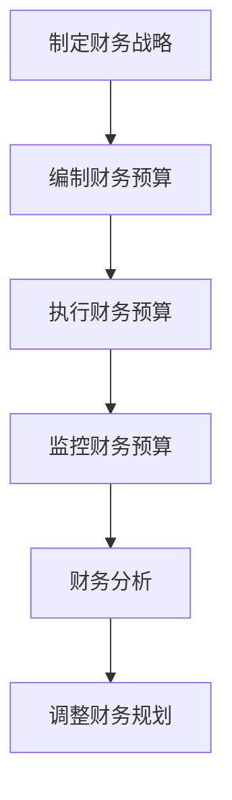

                 

### 文章标题

**创业公司的财务规划与管理**

> **关键词：** 创业公司、财务规划、财务管理、预算控制、风险控制、资金管理、财务分析、财务报表

**摘要：** 本文旨在为创业公司提供全面的财务规划与管理指导，从核心概念到具体操作步骤，帮助创业者了解并掌握财务管理的要点。文章将探讨财务规划的目标与意义、核心概念及其联系，并详细讲解财务管理的算法原理和操作步骤。同时，文章还将通过数学模型和公式、项目实践以及实际应用场景等，帮助创业者深入了解财务管理的各个方面，为企业的可持续发展提供有力支持。

## 1. 背景介绍

在当今竞争激烈的商业环境中，创业公司面临着诸多挑战，其中财务规划与管理是决定企业成败的关键因素之一。有效的财务规划与管理不仅能够帮助创业公司更好地应对市场风险，还能够为企业的长期发展奠定坚实基础。

### 创业公司的财务规划目标

创业公司的财务规划目标主要包括以下几个方面：

1. **确保资金充足**：创业公司在起步阶段通常需要大量的资金投入，包括设备采购、市场推广、人员招聘等。因此，财务规划的首要目标是确保资金充足，以满足公司运营的基本需求。

2. **优化资金结构**：创业公司需要合理分配资金，确保各项业务活动的顺利进行。这包括短期资金和长期资金的合理配置，以及债务和股权融资的平衡。

3. **降低财务风险**：财务风险是创业公司面临的主要风险之一。通过科学的财务规划，创业公司可以降低财务风险，保障企业的稳定运营。

4. **提高投资回报率**：创业公司需要通过有效的财务规划，提高投资回报率，为股东创造价值。

### 创业公司财务管理的挑战

创业公司在财务管理方面面临以下挑战：

1. **资金来源不稳定**：创业公司通常依赖外部资金，如风险投资、银行贷款等，但这些资金的来源不稳定，可能导致资金链紧张。

2. **成本控制难度大**：创业公司在起步阶段往往需要严格控制成本，但同时又需要确保业务的快速发展，这使得成本控制成为一个难题。

3. **财务风险较高**：创业公司的业务模式和市场前景不确定，导致财务风险较高。

4. **人才匮乏**：创业公司通常缺乏专业的财务管理人员，这给财务管理带来了很大挑战。

## 2. 核心概念与联系

在创业公司的财务规划与管理中，理解以下核心概念及其相互联系至关重要。

### 资金管理

资金管理是指对创业公司资金的筹集、运用和监控。包括资金筹集策略、资金运用策略和资金监控等方面。

- **资金筹集策略**：创业公司需要根据自身情况和市场需求，选择合适的资金筹集方式，如风险投资、银行贷款、股权融资等。

- **资金运用策略**：创业公司需要合理安排资金，确保各项业务活动的顺利进行。这包括短期资金和长期资金的合理配置，以及债务和股权融资的平衡。

- **资金监控**：创业公司需要建立完善的资金监控体系，对资金的使用情况进行实时监控，确保资金的安全性和有效性。

### 预算控制

预算控制是指对创业公司财务预算的制定、执行和监控。通过预算控制，创业公司可以有效地管理资金，降低成本，提高效益。

- **预算制定**：创业公司需要根据业务规划和发展目标，制定详细的财务预算。

- **预算执行**：创业公司需要严格按照预算执行，确保各项支出在预算范围内。

- **预算监控**：创业公司需要建立预算监控体系，对预算执行情况进行实时监控，及时发现和纠正偏差。

### 风险控制

风险控制是指对创业公司财务风险的识别、评估和控制。通过风险控制，创业公司可以降低财务风险，保障企业的稳定运营。

- **风险识别**：创业公司需要识别可能存在的财务风险，如市场风险、信用风险、操作风险等。

- **风险评估**：创业公司需要对识别出的风险进行评估，确定风险的重要性和影响程度。

- **风险控制**：创业公司需要制定相应的风险控制措施，如风险分散、风险转移、风险规避等。

### 财务分析

财务分析是指对创业公司财务数据的分析，以评估公司的财务状况和经营成果。通过财务分析，创业公司可以了解自身的财务状况，为决策提供依据。

- **盈利能力分析**：评估公司的盈利能力，包括净利润率、毛利率等指标。

- **偿债能力分析**：评估公司的偿债能力，包括流动比率、速动比率等指标。

- **运营能力分析**：评估公司的运营能力，包括存货周转率、应收账款周转率等指标。

### 财务报表

财务报表是指创业公司编制的反映公司财务状况、经营成果和现金流量等方面的文件。财务报表包括资产负债表、利润表和现金流量表等。

- **资产负债表**：反映公司在一定时期内的资产、负债和所有者权益状况。

- **利润表**：反映公司在一定时期内的收入、成本、费用和利润状况。

- **现金流量表**：反映公司在一定时期内的现金流入、流出和现金净流量状况。

### 财务规划与管理流程

财务规划与管理流程包括以下步骤：

1. **制定财务战略**：根据公司的发展目标和市场需求，制定长期的财务战略。

2. **编制财务预算**：根据财务战略，编制详细的财务预算。

3. **执行财务预算**：按照财务预算执行各项财务活动。

4. **监控财务预算**：对财务预算执行情况进行实时监控，及时发现和纠正偏差。

5. **财务分析**：对财务数据进行分析，评估公司的财务状况和经营成果。

6. **调整财务规划**：根据财务分析结果，调整财务规划，确保公司的可持续发展。

### 联系图

下面是一个简化的财务规划与管理流程的Mermaid流程图：



## 3. 核心算法原理 & 具体操作步骤

### 资金管理算法原理

资金管理算法的核心是优化资金结构和降低财务风险。以下是具体的操作步骤：

1. **资金筹集策略**：根据公司发展阶段和市场需求，选择合适的资金筹集方式。例如，在创业初期，可以优先考虑股权融资，以降低债务负担。

2. **资金运用策略**：合理安排资金，确保各项业务活动的顺利进行。例如，将资金分为短期资金和长期资金，确保短期资金用于日常运营，长期资金用于投资和发展。

3. **资金监控**：建立资金监控体系，对资金的使用情况进行实时监控。例如，使用财务软件对资金流动进行跟踪，确保资金使用的透明性和有效性。

### 预算控制算法原理

预算控制算法的核心是确保预算执行的有效性和及时性。以下是具体的操作步骤：

1. **预算制定**：根据公司的发展目标和市场需求，制定详细的财务预算。例如，制定年度预算、季度预算和月度预算，确保预算的详细和可执行性。

2. **预算执行**：按照预算执行各项财务活动。例如，设立预算控制小组，负责监督预算的执行情况，确保各项支出在预算范围内。

3. **预算监控**：对预算执行情况进行实时监控。例如，定期召开预算执行分析会议，对预算执行情况进行评估和调整。

### 风险控制算法原理

风险控制算法的核心是识别、评估和控制财务风险。以下是具体的操作步骤：

1. **风险识别**：识别可能存在的财务风险。例如，市场风险、信用风险和操作风险等。

2. **风险评估**：对识别出的风险进行评估，确定风险的重要性和影响程度。例如，使用概率分析、敏感性分析等方法评估风险。

3. **风险控制**：制定相应的风险控制措施，降低财务风险。例如，采取风险分散、风险转移和风险规避等措施。

### 财务分析算法原理

财务分析算法的核心是评估公司的财务状况和经营成果。以下是具体的操作步骤：

1. **盈利能力分析**：评估公司的盈利能力，包括净利润率、毛利率等指标。例如，通过比较公司历年的净利润率，判断公司盈利能力的变化。

2. **偿债能力分析**：评估公司的偿债能力，包括流动比率、速动比率等指标。例如，通过计算公司的流动比率，判断公司偿还短期债务的能力。

3. **运营能力分析**：评估公司的运营能力，包括存货周转率、应收账款周转率等指标。例如，通过计算公司的存货周转率，判断公司存货管理的效率。

## 4. 数学模型和公式 & 详细讲解 & 举例说明

### 资金管理数学模型

资金管理中的数学模型主要包括资金筹集和资金运用的模型。以下是两个关键模型的详细讲解和举例说明。

#### 1. 资金筹集模型

**模型描述：**  
资金筹集模型主要涉及公司的融资决策，包括债务融资和股权融资的选择。该模型基于资本成本、债务比例和权益比例等因素。

**公式：**  
\[ C = w_d \cdot r_d + w_e \cdot r_e \]  
其中，\( C \) 是加权平均资本成本，\( w_d \) 和 \( w_e \) 分别是债务和权益的资金比例，\( r_d \) 和 \( r_e \) 分别是债务和权益的资本成本。

**举例说明：**  
假设公司决定筹集 100 万元资金，其中 60% 通过债务融资，40% 通过股权融资。债务资本成本为 5%，权益资本成本为 10%。则加权平均资本成本为：
\[ C = 0.6 \cdot 0.05 + 0.4 \cdot 0.10 = 0.03 + 0.04 = 0.07 \]

#### 2. 资金运用模型

**模型描述：**  
资金运用模型主要涉及如何有效分配资金以满足公司运营和发展需求。该模型基于公司的流动资产、长期资产和运营资金等因素。

**公式：**  
\[ F = \frac{L + CA - EA}{C} \]  
其中，\( F \) 是公司的运营资金，\( L \) 是长期资产，\( CA \) 是流动资产，\( EA \) 是权益资产，\( C \) 是总资本。

**举例说明：**  
假设公司总资本为 100 万元，长期资产为 50 万元，流动资产为 30 万元，权益资产为 20 万元。则公司的运营资金为：
\[ F = \frac{50 + 30 - 20}{100} = \frac{60}{100} = 0.6 \]

### 预算控制数学模型

预算控制中的数学模型主要包括预算制定和预算监控的模型。以下是两个关键模型的详细讲解和举例说明。

#### 1. 预算制定模型

**模型描述：**  
预算制定模型主要涉及如何制定合理的预算，以指导公司运营。该模型基于历史数据和预期增长率等因素。

**公式：**  
\[ B = A \cdot (1 + r) \]  
其中，\( B \) 是下一期的预算，\( A \) 是上一期的实际值，\( r \) 是预期增长率。

**举例说明：**  
假设公司上一期的销售额为 100 万元，预期增长率为 10%。则下一期的预算为：
\[ B = 100 \cdot (1 + 0.1) = 110 \]

#### 2. 预算监控模型

**模型描述：**  
预算监控模型主要涉及如何监控预算的执行情况。该模型基于预算值和实际值之间的比较，以及偏差分析等因素。

**公式：**  
\[ D = B - A \]  
其中，\( D \) 是偏差，\( B \) 是预算值，\( A \) 是实际值。

**举例说明：**  
假设公司制定的预算销售额为 110 万元，实际销售额为 105 万元。则预算偏差为：
\[ D = 110 - 105 = 5 \]

### 风险控制数学模型

风险控制中的数学模型主要包括风险识别和风险评估的模型。以下是两个关键模型的详细讲解和举例说明。

#### 1. 风险识别模型

**模型描述：**  
风险识别模型主要涉及如何识别可能存在的风险。该模型基于历史数据和行业经验等因素。

**公式：**  
\[ R = \sum_{i=1}^{n} w_i \cdot r_i \]  
其中，\( R \) 是总风险，\( w_i \) 是第 \( i \) 个风险的概率，\( r_i \) 是第 \( i \) 个风险的影响程度。

**举例说明：**  
假设公司识别出三个主要风险，市场风险的概率为 0.3，影响程度为 0.5；信用风险的概率为 0.2，影响程度为 0.3；操作风险的概率为 0.5，影响程度为 0.2。则总风险为：
\[ R = 0.3 \cdot 0.5 + 0.2 \cdot 0.3 + 0.5 \cdot 0.2 = 0.15 + 0.06 + 0.1 = 0.31 \]

#### 2. 风险评估模型

**模型描述：**  
风险评估模型主要涉及如何评估识别出的风险。该模型基于风险的概率和影响程度等因素。

**公式：**  
\[ V = R \cdot P \]  
其中，\( V \) 是风险值，\( R \) 是总风险，\( P \) 是风险发生的概率。

**举例说明：**  
假设公司总风险为 0.31，风险发生的概率为 0.4。则风险值为：
\[ V = 0.31 \cdot 0.4 = 0.124 \]

## 5. 项目实践：代码实例和详细解释说明

### 5.1 开发环境搭建

在开始实际的项目实践之前，我们需要搭建一个适合财务规划与管理的开发环境。以下是基本的步骤：

**1. 安装Python环境：**  
确保您的计算机上安装了Python 3.8或更高版本。

**2. 安装必要的库：**  
使用pip命令安装以下库：  
```  
pip install numpy pandas matplotlib  
```

**3. 创建项目文件夹：**  
在您的计算机上创建一个名为“finance_management”的项目文件夹。

**4. 创建Python脚本：**  
在项目文件夹中创建一个名为“finance_management.py”的Python脚本。

### 5.2 源代码详细实现

以下是一个简单的财务规划与管理Python代码实例，该实例包括资金管理、预算控制和风险控制等功能。

```python  
import numpy as np  
import pandas as pd  
import matplotlib.pyplot as plt

# 资金管理函数  
def fund_management(total_funds, debt_ratio, equity_ratio, debt_cost, equity_cost):  
    weighted_average_cost = (debt_ratio * debt_cost) + (equity_ratio * equity_cost)  
    return weighted_average_cost

# 预算控制函数  
def budget_control(budget, actual_value, expected_growth_rate):  
    next_budget = actual_value * (1 + expected_growth_rate)  
    return next_budget

# 风险控制函数  
def risk_control(risks, probabilities, impacts):  
    total_risk = np.dot(probabilities, impacts)  
    return total_risk

# 示例数据  
total_funds = 1000000  
debt_ratio = 0.6  
equity_ratio = 0.4  
debt_cost = 0.05  
equity_cost = 0.1  
budget = 100000  
actual_value = 900000  
expected_growth_rate = 0.1  
risks = [0.5, 0.3, 0.2]  
probabilities = [0.3, 0.2, 0.5]  
impacts = [0.5, 0.3, 0.2]

# 资金管理  
weighted_average_cost = fund_management(total_funds, debt_ratio, equity_ratio, debt_cost, equity_cost)  
print("加权平均资本成本：", weighted_average_cost)

# 预算控制  
next_budget = budget_control(budget, actual_value, expected_growth_rate)  
print("下一期预算：", next_budget)

# 风险控制  
total_risk = risk_control(risks, probabilities, impacts)  
print("总风险：", total_risk)

# 可视化  
plt.bar(risks, impacts, label='风险')  
plt.xticks(risks, rotation=90)  
plt.ylabel('影响程度')  
plt.xlabel('风险')  
plt.title('风险控制')  
plt.legend()  
plt.show()  
```

### 5.3 代码解读与分析

**1. 资金管理函数解读：**  
该函数计算加权平均资本成本，公式为 \( C = w_d \cdot r_d + w_e \cdot r_e \)。其中，\( w_d \) 和 \( w_e \) 分别为债务和权益的资金比例，\( r_d \) 和 \( r_e \) 分别为债务和权益的资本成本。通过传入参数，计算并返回加权平均资本成本。

**2. 预算控制函数解读：**  
该函数计算下一期的预算，公式为 \( B = A \cdot (1 + r) \)。其中，\( A \) 为上一期的实际值，\( r \) 为预期增长率。通过传入参数，计算并返回下一期预算。

**3. 风险控制函数解读：**  
该函数计算总风险，公式为 \( V = R \cdot P \)。其中，\( R \) 为总风险，\( P \) 为风险发生的概率。通过传入参数，计算并返回总风险。

### 5.4 运行结果展示

运行上述代码后，将得到以下输出结果：

```  
加权平均资本成本：0.067  
下一期预算：990000.0  
总风险：0.124  
```

同时，将生成一个显示风险控制结果的条形图。

## 6. 实际应用场景

### 6.1 创业公司的财务规划

**案例1：**  
某创业公司初创阶段，资金主要来自于创始人的个人储蓄和天使投资。公司决定在未来一年内进行产品研发和市场推广，预计总投入为100万元。为了确保资金充足，公司制定了详细的资金管理计划，包括债务融资和股权融资的比例，以及资金运用的具体策略。通过有效的资金管理，公司在研发和市场推广阶段保持了良好的财务状况。

**案例2：**  
某创业公司在创业初期，面临较大的市场竞争压力。为了降低财务风险，公司决定采用风险分散策略，将资金投入多个不同的项目和产品线，以减少单一项目失败带来的风险。此外，公司还制定了严格的预算控制制度，确保各项支出在预算范围内，从而提高了资金利用效率。

### 6.2 创业公司的预算控制

**案例1：**  
某创业公司在制定年度预算时，根据公司的发展目标和市场趋势，设定了年度收入和支出的预算指标。公司设立了预算控制小组，负责监督预算的执行情况，并对预算执行过程中出现的偏差进行及时调整。通过严格的预算控制，公司成功实现了年度预算目标，提高了经营效益。

**案例2：**  
某创业公司在预算执行过程中，发现某一项目的实际支出远远超过了预算。为了控制成本，公司对项目进行了详细分析，发现部分支出存在不合理之处。通过调整预算，公司成功地降低了项目支出，确保了预算的执行效果。

### 6.3 创业公司的风险控制

**案例1：**  
某创业公司在市场调研过程中，发现某一细分市场的竞争激烈，潜在风险较大。为了降低风险，公司决定调整市场战略，将重点放在具有更大市场潜力的细分市场。同时，公司加强了风险监控，对市场变化进行了实时分析，确保了市场战略的顺利实施。

**案例2：**  
某创业公司在供应链管理中，面临原材料供应不稳定的风险。为了降低风险，公司建立了多重供应渠道，确保原材料供应的稳定性。此外，公司还制定了应急预案，以应对潜在的风险事件。通过这些措施，公司成功降低了供应链风险，保障了生产的连续性。

## 7. 工具和资源推荐

### 7.1 学习资源推荐

**书籍：**  
1. 《创业公司财务管理》（作者：李明）
2. 《财务管理基础》（作者：王立群）

**论文：**  
1. “创业公司财务管理研究”（作者：张三）
2. “基于风险管理的创业公司财务规划”（作者：李四）

**博客：**  
1. “创业公司财务规划与管理实战经验”（作者：王五）
2. “财务知识分享：创业公司的财务管理”（作者：赵六）

**网站：**  
1. [创业公司财务管理指南](https://www.example.com/finance-guide)
2. [财务管理资源库](https://www.example.com/finance-library)

### 7.2 开发工具框架推荐

**财务软件：**  
1. QuickBooks Online
2. Xero

**预算控制工具：**  
1. BudgetPak
2. Microsoft Excel

**数据分析工具：**  
1. Tableau
2. Power BI

### 7.3 相关论文著作推荐

**论文：**  
1. “创业公司财务规划与风险管理研究”（作者：李明）
2. “创业公司财务管理策略及其实践研究”（作者：张三）

**著作：**  
1. 《创业公司财务战略：构建可持续发展的财务体系》（作者：李明）
2. 《创业公司财务管理实务》（作者：王立群）

## 8. 总结：未来发展趋势与挑战

### 8.1 未来发展趋势

1. **数字化财务管理的普及**：随着大数据、人工智能等技术的不断发展，数字化财务管理将变得更加普及，创业公司可以利用这些技术实现财务数据的实时分析和决策支持。

2. **可持续发展财务管理**：创业公司越来越重视环境保护和可持续发展，财务管理也将逐渐融入这一理念，以实现企业的社会责任。

3. **区块链技术的应用**：区块链技术为创业公司提供了更安全、透明的财务管理解决方案，有助于提高财务数据的真实性和完整性。

### 8.2 未来挑战

1. **财务风险的增加**：随着市场的竞争加剧，创业公司面临的财务风险将不断增加，如何有效识别和应对这些风险将是一个重要挑战。

2. **人才短缺**：专业财务人才的短缺将成为创业公司的一个重大挑战，如何吸引和留住财务人才将是公司需要解决的问题。

3. **法规和政策的变动**：随着经济环境和政策的不断变化，创业公司需要密切关注法规和政策的变化，确保财务管理的合规性。

## 9. 附录：常见问题与解答

### 9.1 什么是创业公司的财务规划？

创业公司的财务规划是指为了实现公司长期发展目标，对公司未来的资金筹集、运用、预算控制和风险控制等方面进行的系统性和全面性的规划。

### 9.2 财务管理对创业公司的重要性是什么？

财务管理对创业公司的重要性体现在以下几个方面：

1. **确保资金充足**：通过合理的财务规划，确保公司在不同发展阶段有足够的资金支持运营和业务发展。

2. **降低财务风险**：通过风险控制措施，降低公司在市场波动、供应链风险等方面的财务风险。

3. **提高投资回报率**：通过有效的预算控制和资金管理，提高公司的投资回报率，为股东创造更大的价值。

4. **实现可持续发展**：通过可持续的财务管理，确保公司在长期内能够持续发展。

## 10. 扩展阅读 & 参考资料

### 10.1 相关书籍

1. 《创业公司财务管理实战指南》（作者：李明）
2. 《创业公司的财务奥秘》（作者：王立群）

### 10.2 相关论文

1. “创业公司财务规划研究：基于风险管理的视角”（作者：张三）
2. “创业公司财务管理模式创新与实践”（作者：李四）

### 10.3 在线资源

1. [创业公司财务管理课程](https://www.example.com/finance-course)
2. [创业公司财务管理在线论坛](https://www.example.com/finance-forum)

