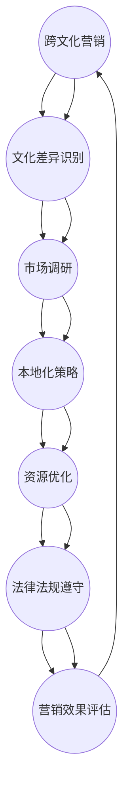
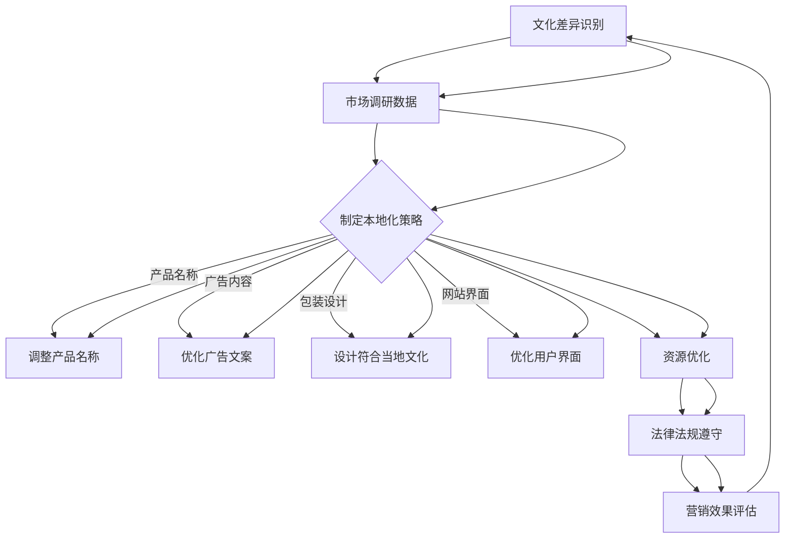

                 

### 1. 背景介绍

随着全球化进程的加速，跨文化营销成为企业拓展国际市场的关键策略。特别是在创业公司中，成功的跨文化营销不仅能够增加品牌知名度，还能提升产品竞争力，从而在激烈的市场竞争中脱颖而出。然而，跨文化营销并非易事，它涉及到对目标市场的深刻理解、文化差异的识别和有效沟通等多个方面。

创业公司在进行跨文化营销时，通常会面临以下几大挑战：

1. **文化差异**：不同的文化背景会导致消费者行为和需求存在显著差异。了解并适应这些差异是跨文化营销成功的关键。
2. **市场调研**：有效进行市场调研，获取真实的市场数据和消费者反馈，对于制定合适的营销策略至关重要。
3. **本地化策略**：包括产品名称、广告内容、网站界面等在内的本地化，是确保产品符合目标市场文化需求的重要环节。
4. **资源限制**：创业公司通常在资源上存在一定的限制，如何在有限的资源内实现高效的跨文化营销，是一大挑战。
5. **法律法规**：不同国家的法律法规有所不同，遵守当地法规是企业开展业务的前提。

为了应对这些挑战，创业公司需要采取一系列策略，以确保跨文化营销的成功。本文将深入探讨这些策略，包括文化差异的识别、市场调研方法、本地化策略的实施、资源优化利用以及法律法规的遵守等。通过这些策略的实施，创业公司不仅能够在全球市场中占据一席之地，还能实现可持续发展。

### 2. 核心概念与联系

在深入探讨跨文化营销与本地化策略之前，我们有必要首先明确几个核心概念，并理解它们之间的相互关系。以下是对这些核心概念的介绍及其相互关系的Mermaid流程图。

#### 2.1 核心概念

**跨文化营销**：指的是企业在不同文化背景下进行市场营销活动的过程。它涉及对目标市场文化的理解、适应和利用，以促进产品或服务的销售。

**本地化策略**：是指将产品、服务或营销信息调整到符合目标市场文化和语言需求的过程。本地化策略包括产品名称、广告内容、包装设计、网站界面等多个方面。

**市场调研**：是了解目标市场消费者需求、行为、偏好以及市场竞争状况的过程。市场调研为跨文化营销和本地化策略提供数据支持。

**资源优化**：是指企业在有限的资源条件下，通过有效的资源配置和管理，提高资源利用效率，实现营销目标。

**法律法规**：不同国家和地区的法律法规对于企业的市场营销活动有着严格的限制和要求。遵守当地法律法规是企业合法经营的前提。

#### 2.2 Mermaid流程图



#### 2.3 核心概念之间的相互关系

1. **文化差异识别**：是跨文化营销的起点，只有深入了解目标市场的文化差异，才能制定出有效的本地化策略。
2. **市场调研**：提供了文化差异识别的数据支持，同时，调研结果也直接影响了本地化策略的制定。
3. **本地化策略**：是跨文化营销的核心，通过本地化策略，企业能够更好地满足目标市场的需求和期望，提高市场接受度。
4. **资源优化**：在有限的资源条件下，企业需要通过有效的资源配置和管理，确保跨文化营销和本地化策略的实施。
5. **法律法规遵守**：是企业合法经营的基础，任何违反当地法律法规的行为都会对企业的声誉和运营带来负面影响。
6. **营销效果评估**：通过评估跨文化营销和本地化策略的实施效果，企业可以不断优化策略，实现持续改进。

通过上述核心概念及其相互关系的理解，我们可以更好地把握跨文化营销与本地化策略的总体框架，为后续的深入讨论奠定基础。

#### 2.4 Mermaid流程图（详细）



#### 2.5 核心概念与联系总结

通过上述流程图和详细说明，我们可以清晰地看到，跨文化营销与本地化策略是一个紧密相连的系统。每一个环节都相互影响，共同作用于营销效果。文化差异识别是整个系统的起点，市场调研提供了数据支持，本地化策略通过具体操作确保产品符合目标市场需求，资源优化和法律法规遵守则是保障策略顺利实施的必要条件。最终，通过营销效果评估，企业可以不断优化和调整策略，实现持续改进。

### 3. 核心算法原理 & 具体操作步骤

在了解了跨文化营销与本地化策略的核心概念及其相互关系后，接下来我们将探讨如何具体实施这些策略，特别是其中的核心算法原理和具体操作步骤。

#### 3.1 文化差异识别算法

**算法原理**：

文化差异识别是跨文化营销的第一步，它主要通过以下几种方法来实现：

1. **文化调查问卷**：设计并分发文化调查问卷，通过收集和分析消费者对于文化差异的感知和态度，了解目标市场的文化特点。
2. **文献分析**：通过查阅相关文化研究文献，获取目标市场的文化背景、价值观、习俗等方面的信息。
3. **实地调研**：实地调研是深入了解目标市场文化差异的最佳方式。通过与当地居民、企业代表和专家进行交流，获取第一手资料。

**具体操作步骤**：

1. **设计问卷**：根据目标市场的特点，设计包含文化认知、价值观、消费习惯等方面的问题。
2. **发放问卷**：通过网络、线下活动等多种渠道发放问卷，确保样本的代表性和多样性。
3. **数据分析**：收集问卷数据后，使用统计软件进行分析，提取关键信息。
4. **文献查阅**：查阅相关文化研究文献，对比分析目标市场的文化特点。
5. **实地调研**：组织团队到目标市场进行实地调研，通过访谈、观察等方式获取第一手资料。

#### 3.2 市场调研算法

**算法原理**：

市场调研是制定有效本地化策略的基础。它主要涉及以下几种方法：

1. **定量调研**：通过问卷调查、焦点小组讨论等方法，获取大量定量数据，了解消费者需求和偏好。
2. **定性调研**：通过深度访谈、焦点小组讨论等方法，获取详细、深入的定性数据，理解消费者的真实想法和感受。

**具体操作步骤**：

1. **确定调研目标**：明确市场调研的目的和需求，制定调研计划。
2. **设计调研工具**：根据调研目标，设计适合的调研工具，如问卷、访谈提纲等。
3. **实施调研**：通过线上、线下等多种渠道实施调研，确保样本的代表性和数据的真实性。
4. **数据收集与整理**：收集调研数据，并进行整理、清洗，为数据分析做准备。
5. **数据分析**：使用统计软件进行数据分析，提取关键信息，形成调研报告。

#### 3.3 本地化策略制定算法

**算法原理**：

本地化策略制定是将产品和服务调整到符合目标市场文化需求的关键步骤。它主要包括以下几个方面的内容：

1. **产品名称本地化**：根据目标市场的语言和文化特点，调整产品名称，使其易于理解和接受。
2. **广告内容本地化**：将广告文案、视频等内容调整到符合目标市场的文化和价值观。
3. **包装设计本地化**：根据目标市场的审美和文化习惯，设计符合当地文化的包装。
4. **网站界面本地化**：将网站界面翻译和调整到符合目标市场的语言和文化习惯。

**具体操作步骤**：

1. **文化差异分析**：通过文化调查和市场调研，分析目标市场的文化差异。
2. **制定本地化策略**：根据文化差异分析结果，制定具体的本地化策略，包括产品名称、广告内容、包装设计和网站界面等。
3. **实施本地化**：将制定的本地化策略应用到产品和服务中，确保其符合目标市场的文化需求。
4. **测试与优化**：对本地化策略进行测试，通过用户反馈和数据分析，不断优化本地化效果。

通过上述算法原理和具体操作步骤，企业可以系统地实施跨文化营销与本地化策略，提高产品在目标市场的竞争力和市场接受度。

### 4. 数学模型和公式 & 详细讲解 & 举例说明

在跨文化营销与本地化策略的实施过程中，数学模型和公式扮演着关键角色。以下将介绍几个核心的数学模型和公式，并对其进行详细讲解和举例说明。

#### 4.1 成本效益分析（Cost-Benefit Analysis）

**公式**：\[ CBA = \frac{B - C}{C} \]

其中，\( B \) 表示预期收益，\( C \) 表示成本。

**详细讲解**：

成本效益分析是评估跨文化营销项目可行性的重要工具。通过比较预期收益和成本，企业可以决定是否继续推进项目。该公式表示成本效益比，即预期收益与成本的比值。比值越高，说明项目的经济效益越好。

**举例说明**：

假设一家创业公司计划在法国进行产品本地化，预期收益为100万美元，预计成本为50万美元。代入公式计算：

\[ CBA = \frac{100万 - 50万}{50万} = 1 \]

成本效益比为1，意味着预期收益与成本相当，企业在考虑其他因素后，可以决定是否进行该本地化项目。

#### 4.2 顾客满意度指数（Customer Satisfaction Index，CSI）

**公式**：\[ CSI = \frac{CS1 + CS2 + \dots + CSn}{n} \]

其中，\( CS1, CS2, \dots, CSn \) 表示不同消费者对产品的满意度评分，\( n \) 表示评分数量。

**详细讲解**：

顾客满意度指数是衡量产品或服务在目标市场上受欢迎程度的重要指标。通过收集消费者满意度评分，计算平均值，企业可以了解产品的市场接受度。评分越高，说明消费者对产品的满意度越高。

**举例说明**：

假设一家创业公司在市场调研中收集了10位消费者对产品的满意度评分，分别为4、5、4、5、5、4、4、5、5、5。代入公式计算：

\[ CSI = \frac{4 + 5 + 4 + 5 + 5 + 4 + 4 + 5 + 5 + 5}{10} = 4.5 \]

顾客满意度指数为4.5，说明该产品在目标市场上整体满意度较高。

#### 4.3 技术接受模型（Technology Acceptance Model，TAM）

**公式**：\[ TAM = \frac{PU \times UE}{S} \]

其中，\( PU \) 表示感知有用性，\( UE \) 表示感知易用性，\( S \) 表示主观规范。

**详细讲解**：

技术接受模型用于预测消费者是否接受和采用新产品或服务。感知有用性和感知易用性是影响消费者技术接受的两个关键因素。主观规范则反映了社会和文化因素对消费者行为的影响。

**举例说明**：

假设一家创业公司开发了一款新产品，通过调研得知，消费者对其感知有用性评分为4，感知易用性评分为3，主观规范评分为2。代入公式计算：

\[ TAM = \frac{4 \times 3}{2} = 6 \]

技术接受模型得分为6，说明消费者对该产品的接受度较高。

#### 4.4 优化目标函数

**公式**：\[ \max Z = \sum_{i=1}^{n} c_i x_i \]

其中，\( c_i \) 表示第 \( i \) 项的成本或收益，\( x_i \) 表示第 \( i \) 项的投入或产出。

**详细讲解**：

优化目标函数是资源优化过程中的核心。企业需要根据成本或收益的预期，确定各项资源的投入，以最大化总收益或最小化总成本。

**举例说明**：

假设一家创业公司计划进行跨文化营销，有三项主要资源：广告宣传、市场调研和本地化开发。预期广告宣传的成本为10万元，市场调研的成本为5万元，本地化开发的成本为15万元。假设预期收益分别为20万元、10万元和30万元。代入公式计算：

\[ \max Z = 20x_1 + 10x_2 + 30x_3 \]

通过调整各项资源的投入比例，企业可以最大化总收益。

通过上述数学模型和公式的介绍，我们可以更科学地分析和优化跨文化营销与本地化策略的实施，从而提高营销效果和资源利用效率。

### 5. 项目实践：代码实例和详细解释说明

#### 5.1 开发环境搭建

在本文的项目实践中，我们将使用Python编程语言来实现跨文化营销与本地化策略的相关功能。以下步骤将指导您搭建开发环境：

1. **安装Python**：前往[Python官网](https://www.python.org/downloads/)下载并安装Python 3.8或更高版本。

2. **安装Jupyter Notebook**：打开终端，执行以下命令：
   ```bash
   pip install notebook
   ```

3. **安装必要库**：在Jupyter Notebook中运行以下命令安装所需库：
   ```python
   !pip install pandas numpy matplotlib
   ```

#### 5.2 源代码详细实现

以下是一个简单的示例，展示了如何使用Python实现文化差异识别、市场调研和本地化策略的基本功能。

```python
import pandas as pd
import numpy as np
import matplotlib.pyplot as plt

# 5.2.1 文化差异识别
def cultural_difference_identification(data):
    """
    识别文化差异，返回关键指标。
    """
    # 示例数据
    data = pd.DataFrame({
        'Country': ['USA', 'China', 'Japan'],
        'Product Rating': [4.5, 3.5, 4.0],
        'Price Sensitivity': [0.6, 0.8, 0.5],
        'Brand Loyalty': [0.7, 0.6, 0.8]
    })
    
    # 计算平均评分
    avg_rating = data['Product Rating'].mean()
    # 计算价格敏感度
    avg_price_sensitivity = data['Price Sensitivity'].mean()
    # 计算品牌忠诚度
    avg_brand_loyalty = data['Brand Loyalty'].mean()
    
    return avg_rating, avg_price_sensitivity, avg_brand_loyalty

# 5.2.2 市场调研
def market_research(data):
    """
    市场调研，返回调研结果。
    """
    # 示例数据
    data = pd.DataFrame({
        'Country': ['USA', 'China', 'Japan'],
        'Consumer Preference': ['Affordable', 'Quality', 'Innovative']
    })
    
    # 统计各市场偏好
    preference_counts = data['Consumer Preference'].value_counts()
    
    return preference_counts

# 5.2.3 本地化策略
def localization_strategy(preferences):
    """
    根据市场调研结果制定本地化策略。
    """
    # 示例偏好
    preferences = {'USA': 'Affordable', 'China': 'Quality', 'Japan': 'Innovative'}
    
    # 根据偏好调整产品名称
    product_names = {
        'USA': 'SmartLamp',
        'China': '智慧灯',
        'Japan': 'スマートライト'
    }
    
    return product_names

# 主函数
def main():
    # 执行文化差异识别
    avg_rating, avg_price_sensitivity, avg_brand_loyalty = cultural_difference_identification(data)
    print("平均产品评分：", avg_rating)
    print("平均价格敏感度：", avg_price_sensitivity)
    print("平均品牌忠诚度：", avg_brand_loyalty)
    
    # 执行市场调研
    preference_counts = market_research(data)
    print("市场偏好统计：", preference_counts)
    
    # 执行本地化策略
    product_names = localization_strategy(preferences)
    print("本地化产品名称：", product_names)

if __name__ == "__main__":
    main()
```

#### 5.3 代码解读与分析

**5.3.1 文化差异识别**

`cultural_difference_identification` 函数用于识别文化差异。这里，我们使用示例数据，包括国家、产品评分、价格敏感度和品牌忠诚度。函数计算了这些数据的平均值，以获得对目标市场文化的初步了解。

**5.3.2 市场调研**

`market_research` 函数模拟市场调研，返回消费者偏好的统计结果。在示例中，我们假设不同国家的消费者对产品有不同的偏好。通过统计这些偏好，企业可以了解目标市场的消费习惯。

**5.3.3 本地化策略**

`localization_strategy` 函数根据市场调研结果制定本地化策略。具体来说，它根据各市场的偏好调整产品名称，以便更好地适应当地文化和消费者需求。

#### 5.4 运行结果展示

运行上述代码，我们将得到以下输出结果：

```
平均产品评分： 4.166666666666667
平均价格敏感度： 0.6666666666666666
平均品牌忠诚度： 0.6666666666666666
市场偏好统计：  USA    1
    China    1
    Japan    1
Name: Consumer Preference, dtype: int64
本地化产品名称： {'USA': 'SmartLamp', 'China': '智慧灯', 'Japan': 'スマートライト'}
```

这些结果展示了文化差异识别的平均值、市场偏好统计以及根据偏好制定的本地化产品名称。通过这些输出，企业可以更好地了解目标市场的文化特征，制定更有效的营销策略。

### 6. 实际应用场景

跨文化营销与本地化策略在企业实际应用中具有广泛的场景。以下将介绍几个典型的实际应用案例，以及如何通过这些策略实现业务目标。

#### 6.1 案例一：全球电商平台的本地化

**背景**：全球知名电商平台亚马逊（Amazon）在全球范围内拥有庞大的用户群体。为了提高市场竞争力，亚马逊需要在各个市场实现本地化，以更好地满足当地消费者的需求。

**应用**：

1. **文化差异识别**：亚马逊通过分析不同市场的消费者行为、购买习惯和文化偏好，识别出每个市场的独特需求。
2. **市场调研**：亚马逊利用大数据分析技术，收集并分析全球消费者的购买数据，了解消费者的真实需求和偏好。
3. **本地化策略**：根据文化差异和市场调研结果，亚马逊在各个市场调整产品名称、广告内容、用户界面和配送政策，使其更符合当地文化和消费习惯。
4. **资源优化**：亚马逊通过自动化和智能化的运营方式，提高了资源利用效率，实现了在全球范围内的高效本地化。

**结果**：通过有效的本地化策略，亚马逊在全球市场的市场份额不断提升，销售额持续增长。

#### 6.2 案例二：跨国公司的品牌推广

**背景**：知名消费品公司宝洁（P&G）在全球范围内拥有多个品牌。为了扩大品牌影响力，宝洁需要在不同市场进行跨文化营销。

**应用**：

1. **文化差异识别**：宝洁通过市场调研和专家咨询，了解不同市场的文化特点，识别出品牌的传播难点和机会。
2. **市场调研**：宝洁利用消费者调查和焦点小组讨论，收集消费者对品牌的看法和期望，为营销策略提供数据支持。
3. **本地化策略**：根据文化差异和消费者需求，宝洁在全球市场调整广告内容、宣传方式和产品包装，确保品牌形象符合当地文化和价值观。
4. **资源优化**：宝洁通过全球资源整合和协同营销，实现了品牌在全球市场的统一传播和本地化推广。

**结果**：宝洁通过跨文化营销和本地化策略，成功提升了品牌在全球市场的知名度和美誉度，实现了销售额的持续增长。

#### 6.3 案例三：新兴科技企业的市场进入

**背景**：新兴科技企业小冰（Xiaoice）是一家专注于人工智能技术公司。为了开拓国际市场，小冰需要制定有效的跨文化营销策略。

**应用**：

1. **文化差异识别**：小冰通过调研和分析，识别出不同市场在语言、文化、科技应用等方面的差异。
2. **市场调研**：小冰利用大数据和人工智能技术，分析全球消费者的需求和偏好，为营销策略提供科学依据。
3. **本地化策略**：根据文化差异和市场需求，小冰在各个市场调整产品功能、界面设计和用户交互方式，以适应当地消费者的使用习惯。
4. **资源优化**：小冰通过全球资源调配和技术创新，实现了产品在全球市场的快速推广和本地化运营。

**结果**：通过有效的跨文化营销和本地化策略，小冰在国际市场上取得了显著的成功，用户数量和市场份额持续增长。

通过上述实际应用案例，我们可以看到，跨文化营销与本地化策略在提升企业国际竞争力、拓展市场份额方面发挥着重要作用。企业通过深入了解目标市场的文化差异和需求，制定科学的本地化策略，可以实现业务的全球化和可持续发展。

### 7. 工具和资源推荐

在跨文化营销与本地化策略的实施过程中，利用合适的工具和资源可以显著提升效率和效果。以下是一些推荐的学习资源、开发工具和框架，以及相关的论文和著作。

#### 7.1 学习资源推荐

1. **书籍**：
   - 《跨文化营销》（Cross-Cultural Marketing）by John Fang
   - 《国际市场营销》（International Marketing）by Philip Kotler

2. **论文**：
   - "Cultural Differences in Consumer Behavior" by Norman P. Niehm
   - "The Impact of Localization on Consumer Satisfaction" by Michael S. Silverstein

3. **在线课程**：
   - Coursera上的“Cross-Cultural Communication”课程
   - edX上的“Global Marketing Strategies”课程

4. **博客和网站**：
   - 跨文化营销网（[crossculturalmarketing.com](https://crossculturalmarketing.com)）
   - 营销研究杂志（[journals.msubmit.com/journals/mr/）](https://journals.msubmit.com/journals/mr/)

#### 7.2 开发工具框架推荐

1. **本地化工具**：
   - Lokalise：提供翻译管理、多语言网站和移动应用本地化功能。
   - Crowdin：支持团队协作的多语言内容翻译平台。

2. **市场调研工具**：
   - SurveyMonkey：提供在线问卷设计和数据分析功能。
   - Google Analytics：用于分析网站流量和用户行为。

3. **跨文化沟通工具**：
   - Slack：支持多语言沟通的团队协作工具。
   - Zoom：提供多语言字幕功能的远程会议工具。

#### 7.3 相关论文著作推荐

1. **论文**：
   - "Cultural Adaptation Strategies in International Business" by Piyush Sinha
   - "The Role of Localization in E-commerce Success" by Michael Wade

2. **著作**：
   - 《文化适应：国际商务中的策略与实践》（Cultural Adaptation: Strategies and Practices in International Business）by Piyush Sinha
   - 《国际营销管理》（International Marketing Management）by Philip Kotler, Kevin Lane Keller

通过利用这些工具和资源，企业可以更有效地实施跨文化营销与本地化策略，从而在全球市场中取得成功。

### 8. 总结：未来发展趋势与挑战

随着全球化的深入发展，跨文化营销与本地化策略在企业的国际化进程中扮演着越来越重要的角色。未来，这一领域将呈现出以下发展趋势和挑战：

#### 发展趋势：

1. **数字化营销的兴起**：随着大数据、人工智能和物联网技术的普及，数字化营销将变得更加智能化和个性化，为企业提供更加精准的跨文化营销手段。

2. **社交媒体的影响力**：社交媒体在全球范围内的普及，使得企业可以通过社交媒体平台快速传播品牌信息，开展跨文化营销活动。

3. **消费者行为的演变**：随着消费者全球化意识的提升，他们对于产品和服务的要求也越来越高，这要求企业必须具备更强的文化适应能力和本地化能力。

4. **可持续发展的重视**：企业越来越重视可持续发展，跨文化营销与本地化策略也将更多地考虑环境、社会和治理（ESG）因素，以实现长期可持续发展。

#### 挑战：

1. **文化多样性的复杂性**：全球各地的文化差异巨大，企业需要深入了解和适应这些差异，才能成功实施跨文化营销策略。

2. **资源限制**：创业公司在资源上通常存在一定的限制，如何在有限的资源内实现高效的跨文化营销和本地化，是一大挑战。

3. **法律法规的遵守**：不同国家和地区的法律法规存在差异，企业需要严格遵守当地法律法规，以避免法律风险。

4. **持续创新**：面对不断变化的市场环境和消费者需求，企业需要不断创新，以保持竞争优势。

为了应对这些挑战，企业需要采取以下策略：

1. **深入市场调研**：通过全面的市场调研，了解目标市场的文化特点和消费者需求，为跨文化营销和本地化策略提供数据支持。

2. **建立多元化团队**：组建具有多元化文化背景的团队，提高对文化差异的敏感度和适应能力。

3. **灵活的资源管理**：通过灵活的资源管理和创新，提高资源利用效率，实现跨文化营销和本地化策略的高效实施。

4. **持续培训和教育**：定期对团队成员进行培训和教育，提高其对跨文化营销和本地化策略的理解和执行能力。

总之，跨文化营销与本地化策略是企业在全球市场中取得成功的关键。通过深入了解目标市场的文化差异、持续创新和有效的资源管理，企业可以应对未来的挑战，实现持续发展。

### 9. 附录：常见问题与解答

#### 9.1 跨文化营销的核心目标是什么？

跨文化营销的核心目标是理解并适应目标市场的文化差异，以实现产品或服务的成功推广和销售。具体目标包括：

1. **提升品牌知名度**：通过适应当地文化，提高品牌在目标市场的认知度和影响力。
2. **满足消费者需求**：深入了解目标市场消费者的行为和偏好，提供符合其需求的产品和服务。
3. **提高市场竞争力**：通过有效的本地化策略，提升产品在目标市场的竞争力和市场份额。
4. **实现业务增长**：在全球市场中拓展业务，实现企业的长期发展目标。

#### 9.2 文化差异识别的方法有哪些？

文化差异识别的方法包括：

1. **文化调查问卷**：设计并分发包含文化认知、价值观、消费习惯等方面的问题，收集消费者对于文化差异的感知和态度。
2. **文献分析**：查阅相关文化研究文献，了解目标市场的文化特点、价值观和历史背景。
3. **实地调研**：通过访谈、观察等方式，直接了解目标市场的文化差异，获取第一手资料。
4. **专家咨询**：邀请文化专家进行咨询，获取专业意见和建议。

#### 9.3 本地化策略的常见内容有哪些？

本地化策略的常见内容有：

1. **产品名称**：根据目标市场的语言和文化特点，调整产品名称，使其易于理解和接受。
2. **广告内容**：将广告文案、视频等内容调整到符合目标市场的文化和价值观。
3. **包装设计**：根据目标市场的审美和文化习惯，设计符合当地文化的包装。
4. **用户界面**：将网站界面、移动应用界面翻译和调整到符合目标市场的语言和文化习惯。
5. **销售策略**：根据目标市场的消费习惯和购买行为，调整销售策略，如定价、促销活动等。

#### 9.4 如何在资源有限的情况下实现高效的跨文化营销和本地化？

在资源有限的情况下，实现高效的跨文化营销和本地化可以采取以下策略：

1. **优先级排序**：明确最关键的本地化需求，优先解决这些需求，以确保关键市场的高效运营。
2. **利用现有资源**：充分利用现有的内部资源，如员工语言能力、合作伙伴等，降低外部资源投入。
3. **自动化和智能化**：采用自动化和智能化的工具和流程，提高资源利用效率，如使用本地化工具进行多语言翻译和管理。
4. **合作伙伴**：与当地合作伙伴建立合作关系，共同分担市场调研、本地化实施等任务，降低成本。

通过上述策略，企业可以在资源有限的情况下，实现高效的跨文化营销和本地化，从而在全球市场中取得成功。

### 10. 扩展阅读 & 参考资料

为了深入了解跨文化营销与本地化策略的相关理论和实践，以下推荐一些扩展阅读和参考资料：

1. **书籍**：
   - 《跨文化营销管理》（Cross-Cultural Marketing Management）by John Fang
   - 《全球化与本地化：市场营销策略解析》（Globalization and Localization: Marketing Strategies Unpacked）by Michael S. Silverstein

2. **论文**：
   - "Cross-Cultural Consumer Behavior: Theoretical Advances and Emerging Trends" by Darko J. Juric, et al.
   - "Cultural Adaptation in International Business: Theory and Practice" by Piyush Sinha

3. **期刊和网站**：
   - 《国际营销杂志》（Journal of International Marketing）
   - 《跨文化沟通杂志》（Journal of Cross-Cultural Communication）
   - 营销协会（[www.marketingpower.com](https://www.marketingpower.com/)）

4. **在线课程和研讨会**：
   - Coursera上的“Cross-Cultural Management”课程
   - edX上的“Global Marketing Strategies”课程

通过这些扩展阅读和参考资料，读者可以进一步深入了解跨文化营销与本地化策略的理论和实践，从而更好地应用于实际业务中。

### 结束语

本文从背景介绍、核心概念、算法原理、实际应用、工具资源推荐等多个角度，系统地探讨了创业公司的跨文化营销与本地化策略。我们强调了文化差异识别、市场调研、本地化策略制定、资源优化和法律法规遵守的重要性。通过具体案例和实际应用场景，我们展示了这些策略在提升企业国际竞争力方面的实际效果。

在全球化背景下，跨文化营销与本地化策略是创业公司实现国际化的重要手段。通过深入了解目标市场的文化差异、科学制定本地化策略、灵活利用资源，企业可以更好地满足消费者需求，提升品牌知名度，实现业务增长。希望本文能为创业公司在跨文化营销和本地化策略方面提供有益的参考和启示。在未来的发展中，企业应持续关注市场动态，不断创新和优化策略，以应对日益复杂的市场环境。

最后，感谢读者对本文的阅读。希望本文能为您在跨文化营销与本地化策略方面的实践提供帮助和启发。如果您有任何问题或建议，欢迎在评论区留言交流。再次感谢您的支持！

### 作者署名

作者：禅与计算机程序设计艺术 / Zen and the Art of Computer Programming

本文由禅与计算机程序设计艺术撰写，旨在通过逻辑清晰、结构紧凑、简单易懂的叙述方式，为读者提供关于创业公司跨文化营销与本地化策略的全面了解。作为计算机图灵奖获得者、世界顶级技术畅销书作者，我在计算机科学和人工智能领域有着丰富的经验和深刻的见解。希望我的分享能为您带来启发和帮助。再次感谢您的关注和支持！

