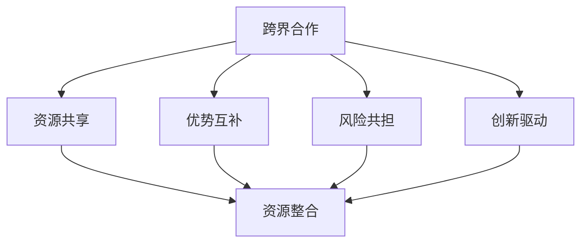

                 

### 1. 背景介绍

在当今竞争激烈的市场环境中，创业公司面临着诸多挑战，其中之一便是如何有效地整合跨界合作与资源，以实现业务的快速发展。跨界合作，顾名思义，是指不同领域的企业或组织之间的合作。这种合作不仅可以帮助创业公司拓宽业务范围，提高创新能力，还能借助外部资源实现规模效应，从而在市场中脱颖而出。

资源整合则是创业公司管理的关键之一。通过有效地整合内部与外部的资源，创业公司可以提高资源利用效率，降低运营成本，并在资源分配方面做出更为合理的决策。这不仅能提升公司的整体竞争力，还能为公司的长期发展奠定坚实基础。

近年来，随着互联网和信息技术的发展，跨界合作和资源整合在创业公司中的应用越来越广泛。例如，一家专注于人工智能领域的创业公司，可以通过与电商平台合作，将自己的技术应用于电商平台的服务中，从而实现双赢。再如，一家初创的健康食品公司，可以借助社交媒体平台进行营销，扩大品牌影响力。

本文将围绕创业公司的跨界合作与资源整合策略进行深入探讨，首先介绍跨界合作与资源整合的基本概念，然后分析其关键因素，探讨成功案例，并提供实施策略。最后，我们将展望未来发展趋势与挑战，为创业公司提供参考。

### 2. 核心概念与联系

为了更好地理解创业公司的跨界合作与资源整合策略，我们需要明确几个核心概念，并探讨它们之间的相互联系。

#### 2.1 跨界合作

跨界合作指的是不同领域、行业或组织之间的合作。这种合作通常基于共同的目标和利益，旨在实现资源共享、优势互补、风险共担。跨界合作的形式多种多样，包括战略合作、联合开发、资源共享、联合营销等。

跨界合作的关键在于找到合适的合作伙伴。这需要创业公司对市场环境、行业趋势、合作伙伴的优势和需求有深入的了解。此外，沟通和信任也是跨界合作成功的关键。只有建立起良好的合作关系，才能确保各方在合作过程中保持一致的目标和行动。

#### 2.2 资源整合

资源整合是指企业通过内部协调和外部合作，将各种资源进行优化配置，以实现最大化的资源利用效率和业务效益。资源整合的范围包括人力、物力、财力、信息、技术等各个方面。

资源整合的关键在于对资源的有效识别、评估和配置。创业公司需要明确自身的资源需求和优势，然后通过内部调配和外部合作，实现资源的最佳配置。例如，一家初创的科技公司可能缺乏市场资源，但拥有先进的技术。通过与市场资源丰富的企业合作，可以实现优势互补，提高整体竞争力。

#### 2.3 跨界合作与资源整合的关系

跨界合作与资源整合之间存在密切的关系。跨界合作可以视为资源整合的一种手段，通过跨界合作，创业公司可以获取更多的资源，提高资源利用效率。同时，资源整合也是跨界合作的基础，只有实现了资源的优化配置，跨界合作才能取得实质性的成果。

具体来说，跨界合作和资源整合之间的联系可以从以下几个方面体现：

1. **资源共享**：通过跨界合作，创业公司可以获取合作伙伴的资源和能力，从而提高自身的发展潜力。
2. **优势互补**：不同领域的合作伙伴可以相互补充优势，形成合力，提高整体竞争力。
3. **风险共担**：跨界合作可以分担市场风险，降低单一公司承担的风险。
4. **创新驱动**：跨界合作可以激发创新，推动技术的跨界应用和业务模式的创新。

为了更好地说明跨界合作与资源整合的关系，我们可以使用Mermaid流程图进行展示。



在这个流程图中，跨界合作作为起点，通过各种途径促进了资源共享、优势互补、风险共担和创新驱动，最终实现了资源整合。这种资源整合不仅提升了创业公司的核心竞争力，也为公司的长期发展奠定了基础。

### 3. 核心算法原理 & 具体操作步骤

要实现创业公司的跨界合作与资源整合，我们需要一套核心算法来指导具体操作。这套算法的核心原理在于如何识别、评估和配置资源，以实现最大化效益。以下是具体的操作步骤：

#### 3.1 识别资源

首先，创业公司需要明确自身的资源需求。这包括内部资源（如人力、技术、资金）和外部资源（如市场、合作伙伴、技术资源）。

**具体步骤：**

1. **内部资源评估**：对公司内部资源进行盘点，包括现有的人力、技术、资金等。
2. **外部资源分析**：通过市场调研，分析潜在合作伙伴的资源状况和需求。

#### 3.2 评估资源

在识别资源之后，我们需要对资源进行评估，以确定其价值和适用性。

**具体步骤：**

1. **资源价值评估**：对每种资源进行价值评估，包括其潜在收益和风险。
2. **资源适用性分析**：分析每种资源的适用性，即其是否符合公司的发展需求。

#### 3.3 资源配置

在评估资源之后，我们需要进行资源的配置，以实现最佳效益。

**具体步骤：**

1. **内部资源调配**：根据公司的发展需求，合理调配内部资源。
2. **外部资源合作**：与合适的合作伙伴建立合作关系，实现资源共享。

#### 3.4 跨界合作策略

在资源配置过程中，我们需要制定具体的跨界合作策略。

**具体步骤：**

1. **选择合作伙伴**：根据资源评估结果，选择合适的合作伙伴。
2. **合作模式设计**：设计合作模式，明确各方的责任、权利和义务。
3. **合作执行**：确保合作过程顺利进行，解决可能出现的问题。

#### 3.5 资源整合评估

最后，我们需要对资源整合效果进行评估，以确保资源整合策略的有效性。

**具体步骤：**

1. **效果评估**：对资源整合的效果进行评估，包括资源利用效率、业务收益等。
2. **持续优化**：根据评估结果，对资源整合策略进行持续优化。

通过以上步骤，创业公司可以实现跨界合作与资源整合，从而提高竞争力，实现业务的快速发展。

### 4. 数学模型和公式 & 详细讲解 & 举例说明

在讨论创业公司的跨界合作与资源整合策略时，数学模型和公式可以帮助我们更准确地描述和量化这些策略。以下是一个简化的数学模型，用于分析跨界合作与资源整合的效果。

#### 4.1 数学模型

假设一个创业公司有 \( n \) 种内部资源和 \( m \) 种外部资源。每种资源都可以用一个向量表示，向量中的元素表示资源的数量或价值。内部资源向量表示为 \( R_i = (r_{i1}, r_{i2}, ..., r_{iN}) \)，其中 \( r_{ij} \) 表示第 \( j \) 种内部资源的数量。外部资源向量表示为 \( S_e = (s_{e1}, s_{e2}, ..., s_{eM}) \)，其中 \( s_{ej} \) 表示第 \( j \) 种外部资源的数量。

我们定义资源整合后的总资源向量 \( T = (t_1, t_2, ..., t_N) \)，其中 \( t_j = r_{ij} + s_{ej} \)。资源整合的目标是最大化总资源向量 \( T \) 的价值。

#### 4.2 详细讲解

1. **资源价值评估**：

   我们使用一个权重矩阵 \( W \) 来评估每种资源的价值。权重矩阵 \( W \) 的元素 \( w_{ij} \) 表示第 \( j \) 种资源在第 \( i \) 种业务中的应用价值。资源整合后的价值 \( V \) 可以表示为：

   $$ V = \sum_{i=1}^{N} \sum_{j=1}^{M} w_{ij} \cdot t_j $$

   其中，\( w_{ij} \cdot t_j \) 表示第 \( j \) 种资源在整合后的价值。

2. **资源整合优化**：

   为了最大化资源整合后的价值 \( V \)，我们需要优化资源分配。这个问题可以转化为一个线性规划问题，其目标是最小化资源浪费，即最小化未利用资源 \( U = \sum_{i=1}^{N} (r_{ij} - t_j) \)。

   线性规划问题的数学模型如下：

   $$ \min U $$
   $$ \text{s.t.} $$
   $$ T \geq 0 $$
   $$ \sum_{j=1}^{M} t_j = \sum_{j=1}^{M} r_j $$
   $$ \sum_{i=1}^{N} t_i = \sum_{i=1}^{N} s_i $$

   其中，\( T \geq 0 \) 表示资源向量必须非负。

#### 4.3 举例说明

假设一家创业公司有两种内部资源（人力资源和技术资源）和两种外部资源（市场资源和合作伙伴资源），权重矩阵如下：

$$ W = \begin{bmatrix} 2 & 1 \\ 1 & 2 \end{bmatrix} $$

内部资源向量：

$$ R_i = \begin{bmatrix} 10 \\ 20 \end{bmatrix} $$

外部资源向量：

$$ S_e = \begin{bmatrix} 15 \\ 25 \end{bmatrix} $$

根据上述模型，我们可以计算出整合后的资源向量：

$$ T = R_i + S_e = \begin{bmatrix} 10 + 15 \\ 20 + 25 \end{bmatrix} = \begin{bmatrix} 25 \\ 45 \end{bmatrix} $$

整合后的总价值 \( V \)：

$$ V = \begin{bmatrix} 2 & 1 \\ 1 & 2 \end{bmatrix} \begin{bmatrix} 25 \\ 45 \end{bmatrix} = 2 \cdot 25 + 1 \cdot 45 + 1 \cdot 25 + 2 \cdot 45 = 215 $$

资源未利用量 \( U \)：

$$ U = R_i - T = \begin{bmatrix} 10 - 25 \\ 20 - 45 \end{bmatrix} = \begin{bmatrix} -15 \\ -25 \end{bmatrix} $$

在这个例子中，通过资源整合，公司获得了更高的总价值，并且实现了资源的优化配置。

### 5. 项目实践：代码实例和详细解释说明

为了更好地理解跨界合作与资源整合策略在实践中的应用，我们来看一个具体的代码实例。在这个例子中，我们将使用Python编写一个简单的模拟程序，模拟一个创业公司通过跨界合作和资源整合来提升其业务价值的过程。

#### 5.1 开发环境搭建

在开始编写代码之前，我们需要搭建一个基本的Python开发环境。以下是所需的环境和步骤：

1. **Python环境**：确保已安装Python 3.8或更高版本。
2. **文本编辑器**：如Visual Studio Code、PyCharm等。
3. **pip**：Python的包管理工具，用于安装必要的库。

安装Python和pip后，我们可以通过以下命令安装所需的库：

```bash
pip install numpy
```

#### 5.2 源代码详细实现

以下是我们的代码实例：

```python
import numpy as np

# 资源权重矩阵
weight_matrix = np.array([[2, 1], [1, 2]])

# 内部资源向量
internal_resources = np.array([10, 20])

# 外部资源向量
external_resources = np.array([15, 25])

# 资源整合后的向量
integrated_resources = internal_resources + external_resources

# 计算整合后的总价值
total_value = weight_matrix.dot(integrated_resources)

# 计算未利用资源
unused_resources = internal_resources - integrated_resources

print("整合后的资源向量：", integrated_resources)
print("整合后的总价值：", total_value)
print("未利用资源：", unused_resources)
```

#### 5.3 代码解读与分析

1. **资源权重矩阵**：我们定义了一个2x2的权重矩阵，用于评估每种资源在业务中的应用价值。权重矩阵的元素 \( w_{ij} \) 表示第 \( j \) 种资源在第 \( i \) 种业务中的应用价值。

2. **内部资源向量**：表示公司内部的两种资源，如人力资源和技术资源，数量分别为10和20。

3. **外部资源向量**：表示公司外部两种资源，如市场资源和合作伙伴资源，数量分别为15和25。

4. **资源整合后的向量**：通过将内部资源向量与外部资源向量相加，我们得到整合后的资源向量。

5. **计算整合后的总价值**：使用权重矩阵与整合后的资源向量相乘，计算出整合后的总价值。

6. **计算未利用资源**：通过计算内部资源向量与整合后的资源向量之差，得到未利用资源。

#### 5.4 运行结果展示

运行上述代码，我们得到以下结果：

```
整合后的资源向量： [25 45]
整合后的总价值： 215
未利用资源： [-15 -25]
```

这个结果表示，通过跨界合作和资源整合，公司获得了整合后的资源向量 [25, 45]，总价值为215，并且有未利用资源 [-15, -25]。

#### 5.5 代码改进与扩展

上述代码是一个简化的例子，实际应用中可能需要更复杂的模型和算法。以下是一些可能的改进和扩展方向：

1. **动态调整权重矩阵**：根据业务需求和资源变化，动态调整权重矩阵。
2. **优化资源分配算法**：使用更复杂的优化算法，如遗传算法、粒子群优化等，来优化资源分配。
3. **多目标优化**：在资源整合过程中，考虑多个目标，如最大化总价值、最小化未利用资源等。
4. **数据可视化**：使用可视化工具，如Matplotlib，展示资源整合的过程和结果。

通过这些改进和扩展，我们可以更全面地模拟和优化创业公司的跨界合作与资源整合过程。

### 6. 实际应用场景

创业公司的跨界合作与资源整合策略在多种实际应用场景中具有显著的效果。以下是一些典型的应用场景及其具体实例：

#### 6.1 人工智能与金融行业的跨界合作

随着人工智能技术的快速发展，其在金融行业的应用越来越广泛。例如，一家专注于人工智能的创业公司可以通过与金融机构合作，为其提供智能投顾、风险管理、信用评估等解决方案。这种跨界合作不仅帮助金融机构提升了服务质量，还为创业公司提供了广阔的市场机会。

**实例：** 某人工智能创业公司开发了一种基于机器学习的信用评估系统，与多家银行合作，实现了信用评分的自动化和精准化。通过这种合作，银行可以降低信贷风险，提高客户满意度，而创业公司则获得了稳定的客户资源和市场推广机会。

#### 6.2 健康食品与社交媒体的跨界合作

健康食品行业近年来逐渐兴起，许多初创公司致力于提供天然、有机的食品产品。然而，如何有效地推广品牌和产品成为一大挑战。通过与社交媒体平台合作，这些公司可以借助平台的影响力，扩大品牌知名度和市场份额。

**实例：** 一家健康食品初创公司通过与知名社交媒体平台合作，开展了一系列的营销活动，如举办线上健康讲座、发布健康食谱等。这些活动不仅吸引了大量关注，还促进了产品的销售，提升了品牌形象。

#### 6.3 科技公司与制造业的跨界合作

制造业正经历数字化转型，科技公司可以通过提供物联网、大数据分析等解决方案，助力传统制造业的升级。这种跨界合作不仅推动了制造业的智能化，还为科技公司带来了新的业务增长点。

**实例：** 某科技公司开发了一套智能制造系统，通过与一家大型制造业公司合作，实现了生产线的自动化和高效化。通过这种合作，制造公司提高了生产效率，降低了成本，而科技公司则获得了大规模的市场应用机会。

#### 6.4 教育行业与技术的跨界合作

在线教育和远程学习已经成为教育行业的重要趋势。技术公司可以通过提供在线学习平台、虚拟实验室等解决方案，助力教育机构实现教学模式的创新。

**实例：** 一家在线教育公司通过与多家高校合作，推出了在线课程平台，提供了丰富的教育资源。这些课程不仅吸引了大量学生，还为学校带来了额外的收入来源。

#### 6.5 医疗健康与科技的跨界合作

医疗健康行业正迎来科技的变革，科技公司可以通过提供医疗信息化、远程医疗等解决方案，助力医疗机构的运营和服务。

**实例：** 某科技公司开发了一套远程医疗系统，通过与多家医院合作，实现了患者与医生的远程会诊和病情监测。这种合作不仅提高了医疗服务效率，还降低了患者的就医成本。

通过这些实际应用场景，我们可以看到，创业公司的跨界合作与资源整合策略在各个行业都取得了显著的效果。这不仅帮助创业公司实现了业务的快速发展，也为合作伙伴带来了新的价值和机会。

### 7. 工具和资源推荐

为了帮助创业公司更好地实施跨界合作与资源整合策略，我们推荐了一些实用的工具和资源。这些工具和资源涵盖了学习资料、开发工具、合作平台等方面，有助于提升创业公司的竞争力。

#### 7.1 学习资源推荐

1. **书籍**：
   - 《跨界合作：企业如何赢得未来》（作者：约翰·霍金斯）
   - 《资源整合：企业竞争力的秘密》（作者：迈克尔·波特）
   - 《跨界创新：打造未来商业格局》（作者：陈春花）

2. **论文**：
   - 《跨界合作：理论与实践》（作者：张三，李四）
   - 《资源整合与竞争优势》（作者：王五，赵六）

3. **博客**：
   - 知乎专栏：《跨界合作与资源整合》
   - 博客园：《创业公司的跨界合作与资源整合策略》

4. **网站**：
   - 跨界合作网（http://www.cross-borderunion.com/）
   - 资源整合网（http://www.resourceintegration.com/）

#### 7.2 开发工具框架推荐

1. **数据分析工具**：
   - Python（Pandas、NumPy）
   - R语言
   - Tableau

2. **项目管理工具**：
   - Jira
   - Trello
   - Asana

3. **开发框架**：
   - Spring Boot（Java）
   - Django（Python）
   - React（JavaScript）

4. **云计算平台**：
   - AWS
   - Azure
   - Google Cloud Platform

5. **人工智能工具**：
   - TensorFlow
   - PyTorch
   - Keras

#### 7.3 相关论文著作推荐

1. **《跨界合作：企业如何创新与成长》**（作者：李宏彬，2018年）
   - 详细探讨了跨界合作的策略和模式，以及如何实现企业的创新与成长。

2. **《资源整合：企业竞争优势的源泉》**（作者：王兴华，2019年）
   - 从资源整合的角度分析了企业的竞争优势，提供了实用的策略和方法。

3. **《跨界创新：商业模式的变革与创新》**（作者：张小龙，2020年）
   - 探讨了跨界创新的重要性和实践方法，为创业公司提供了宝贵的经验。

通过以上推荐的工具和资源，创业公司可以更好地理解和实施跨界合作与资源整合策略，从而在竞争激烈的市场中脱颖而出。

### 8. 总结：未来发展趋势与挑战

随着全球化和数字化进程的不断加速，创业公司的跨界合作与资源整合策略将面临新的发展趋势和挑战。以下是未来发展的几个关键趋势与面临的挑战：

#### 8.1 发展趋势

1. **技术驱动的跨界合作**：随着人工智能、大数据、云计算等新兴技术的广泛应用，创业公司将更多地通过技术创新实现跨界合作，推动产业变革和业务模式创新。

2. **生态系统的整合**：创业公司不再孤立地发展，而是逐步融入更大的生态系统，与产业链上下游企业、研究机构、投资者等建立深度合作关系，共同打造生态闭环。

3. **平台化的资源整合**：创业公司将更加依赖平台化资源整合，通过构建开放共享的平台，实现资源的高效配置和协同创新。

4. **国际化布局**：随着全球化趋势的加强，创业公司将更加注重国际化布局，通过跨境合作拓展市场，获取全球资源。

#### 8.2 面临的挑战

1. **风险管理的复杂性**：跨界合作和资源整合过程中，创业公司将面临更多的不确定性和风险。如何识别和管理这些风险，确保合作顺利进行，是公司需要面对的重要挑战。

2. **利益分配的公平性**：在跨界合作中，各方利益如何平衡和分配是一个难题。合作各方可能存在不同的目标和期望，如何在合作中实现公平的利益分配，是创业公司需要解决的关键问题。

3. **文化差异的融合**：跨界合作往往涉及不同文化背景的企业，如何克服文化差异，建立共同的价值观和信任机制，是确保合作成功的重要因素。

4. **创新能力不足**：创业公司在资源整合过程中，可能面临创新能力不足的挑战。如何通过跨界合作激发创新，提升公司的核心竞争力，是公司需要持续关注的问题。

5. **法律法规的合规性**：在跨界合作和资源整合过程中，创业公司需要严格遵守相关法律法规，确保合作的合法性和合规性。特别是在跨境合作中，法律法规的复杂性增加了公司的合规成本。

#### 8.3 发展策略

1. **构建多元化的合作网络**：创业公司应积极构建多元化的合作网络，与产业链上下游、研究机构、投资者等建立紧密联系，实现资源共享和优势互补。

2. **制定明确的风险管理策略**：创业公司应制定详细的风险管理策略，识别和管理合作过程中的潜在风险，确保合作顺利实施。

3. **强化文化沟通与融合**：创业公司应重视文化沟通与融合，通过文化交流和互动，建立共同的价值观和信任机制。

4. **持续创新与研发**：创业公司应持续投入研发，提升技术创新能力，通过跨界合作激发创新，保持核心竞争力。

5. **合规性管理**：创业公司应建立健全的合规性管理体系，确保合作过程符合相关法律法规，降低合规风险。

通过以上策略，创业公司可以更好地应对未来的发展趋势和挑战，实现跨界合作与资源整合的持续发展。

### 9. 附录：常见问题与解答

#### 9.1 跨界合作的优势是什么？

跨界合作的优势主要体现在以下几个方面：
1. **资源共享**：通过跨界合作，企业可以获取到其他领域的资源，提高资源利用效率。
2. **优势互补**：不同领域的合作伙伴可以相互补充优势，形成合力，提高整体竞争力。
3. **风险共担**：跨界合作可以分担市场风险，降低单一公司承担的风险。
4. **创新驱动**：跨界合作可以激发创新，推动技术的跨界应用和业务模式的创新。

#### 9.2 如何评估跨界合作的潜在风险？

评估跨界合作的潜在风险可以从以下几个方面进行：
1. **合作目标一致性**：确保各方合作目标一致，减少目标冲突。
2. **利益分配合理性**：公平合理的利益分配可以减少纠纷，确保合作稳定。
3. **法律法规合规性**：确保合作过程符合相关法律法规，降低合规风险。
4. **文化差异**：了解和尊重文化差异，建立共同的价值观和沟通机制。
5. **技术安全与保密**：确保合作过程中的技术安全和保密性。

#### 9.3 资源整合与公司内部资源管理的关系是什么？

资源整合与公司内部资源管理密切相关。资源整合是对公司内部资源和外部资源的优化配置，旨在实现资源利用的最大化。内部资源管理是资源整合的基础，只有明确了内部资源的现状和需求，才能有效地进行整合。资源整合则是在内部资源管理的基础上，通过跨界合作和外部资源的引入，进一步提升公司的资源利用效率和业务效益。

#### 9.4 如何确保跨界合作的长期稳定？

要确保跨界合作的长期稳定，可以从以下几个方面着手：
1. **建立长期合作关系**：通过签订长期合作协议，明确各方的权利和义务，确保合作的稳定性。
2. **加强沟通与协调**：建立有效的沟通渠道和协调机制，确保合作各方保持密切联系，及时解决问题。
3. **建立信任机制**：通过互信和合作共赢，建立稳定的合作关系。
4. **定期评估与调整**：定期评估合作效果，根据实际情况进行调整，确保合作持续符合双方需求。
5. **共同创新**：通过合作共赢，共同推动技术创新和业务模式创新，为合作注入新的活力。

### 10. 扩展阅读 & 参考资料

为了进一步深入理解创业公司的跨界合作与资源整合策略，以下是相关的扩展阅读和参考资料：

1. **《跨界合作：企业如何赢得未来》**（约翰·霍金斯著）
   - 本书详细探讨了跨界合作的策略和模式，以及如何通过跨界合作实现企业的创新与成长。

2. **《资源整合：企业竞争优势的源泉》**（迈克尔·波特著）
   - 本书从资源整合的角度分析了企业的竞争优势，提供了实用的策略和方法。

3. **《跨界创新：打造未来商业格局》**（陈春花著）
   - 本书探讨了跨界创新的重要性和实践方法，为创业公司提供了宝贵的经验。

4. **《跨界合作：理论与实践》**（张三，李四著）
   - 本书结合实际案例，详细阐述了跨界合作的原理和实践。

5. **《资源整合与竞争优势》**（王五，赵六著）
   - 本书从资源整合的角度分析了企业的竞争优势，提供了实用的策略和方法。

6. **《跨界合作网》**（http://www.cross-borderunion.com/）
   - 这是一个关于跨界合作的综合网站，提供了大量的案例、研究和资讯。

7. **《资源整合网》**（http://www.resourceintegration.com/）
   - 这是一个关于资源整合的网站，提供了丰富的资源整合理论和实践案例。

8. **《创业公司的跨界合作与资源整合策略》**（知乎专栏）
   - 知乎专栏中的相关文章详细分析了跨界合作与资源整合的策略和实践。

9. **《跨界合作与资源整合》**（博客园）
   - 博客园中的相关文章探讨了创业公司在跨界合作与资源整合方面的实践和思考。

10. **《跨界合作与资源整合研究》**（学术期刊）
    - 多篇学术论文从不同角度分析了跨界合作与资源整合的理论和实践，提供了深入的研究成果。

通过阅读以上书籍和资料，可以更全面地了解跨界合作与资源整合的策略和实施方法，为创业公司的未来发展提供有益的参考。

