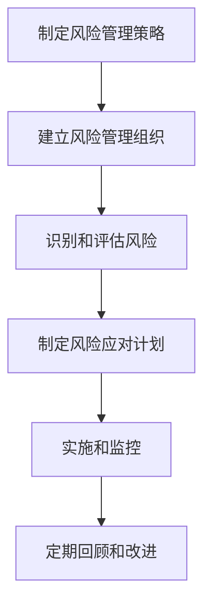

                 

### 背景介绍

在当今的商业环境中，创业公司的风险管理策略变得越来越重要。随着市场竞争的日益激烈和技术的快速发展，创业公司面临着诸多不确定性，包括资金链断裂、技术创新失败、市场波动等。因此，如何有效地管理和应对这些风险，成为创业公司成功的关键因素。

首先，让我们定义一下什么是风险管理。风险管理是指通过识别、评估、优先排序和处理风险，以最大化机会、最小化损失的过程。对于创业公司而言，良好的风险管理策略不仅可以帮助他们更好地应对外部环境的变化，还可以提高内部运营效率，增强企业的核心竞争力。

创业公司的特点在于其高不确定性、快速发展和资源有限。这些特点使得创业公司在面对风险时，需要采取与大型企业截然不同的风险管理策略。例如，创业公司通常无法像大型企业那样拥有庞大的财务储备和充足的人力资源，因此，他们需要更加关注风险的识别和应对，以确保公司能够在激烈的市场竞争中立于不败之地。

本文将详细探讨创业公司的风险管理策略，首先介绍风险管理的基本概念和流程，然后分析创业公司在风险管理中的独特挑战，最后提出一些实用的策略和建议，帮助创业公司更好地应对风险。

### 核心概念与联系

#### 风险管理的基本概念

风险管理是现代企业管理的重要组成部分，其核心概念包括风险识别、风险评估、风险应对和风险监控。

1. **风险识别**：这是风险管理的第一步，旨在发现可能影响企业目标实现的各种风险。风险识别的方法包括历史数据分析、专家评估、情景分析等。

2. **风险评估**：在识别出风险后，企业需要对风险进行评估，以确定其严重性和发生概率。风险评估的方法包括定性和定量分析，例如，概率分布、风险矩阵等。

3. **风险应对**：根据风险评估的结果，企业需要制定相应的应对策略。这些策略包括风险规避、风险减轻、风险转移和风险接受。

4. **风险监控**：在实施风险应对策略后，企业需要持续监控风险，以确保风险得到有效控制。风险监控的方法包括定期审核、关键指标跟踪等。

#### 创业公司的风险管理特点

与成熟企业相比，创业公司在风险管理方面有其独特的挑战和特点：

1. **资源限制**：创业公司通常资源有限，包括资金、人力和技术。这意味着他们无法像大型企业那样进行全面的风险评估和应对措施。

2. **不确定性高**：创业公司的业务模式、市场环境和商业模式都在不断变化，这使得风险识别和评估变得更加困难。

3. **决策速度要求高**：创业公司需要快速响应市场变化，这意味着他们在风险管理方面需要更加灵活和高效。

4. **人员流动性强**：创业公司的员工流动率通常较高，这可能会影响风险管理的效果。

#### 风险管理流程

为了更好地应对这些挑战，创业公司需要建立一套高效的风险管理流程。以下是典型的风险管理流程：

1. **制定风险管理策略**：公司需要明确其风险管理目标，并制定相应的策略。这包括确定风险承受能力、风险偏好和风险管理优先级。

2. **建立风险管理组织**：公司需要建立一个专门的风险管理团队，负责实施风险管理策略。团队成员应具备风险管理、业务运营和行业知识。

3. **识别和评估风险**：利用各种方法识别和评估可能影响公司目标实现的风险。

4. **制定风险应对计划**：根据风险评估结果，制定具体的应对计划，包括规避、减轻、转移或接受风险。

5. **实施和监控**：执行风险应对计划，并持续监控风险的变化，确保风险得到有效控制。

6. **定期回顾和改进**：定期回顾风险管理流程和策略的有效性，并根据实际情况进行必要的调整和改进。

#### Mermaid 流程图

以下是一个简化的创业公司风险管理流程的 Mermaid 流程图：



通过这个流程，创业公司可以系统地识别和管理风险，从而提高其抗风险能力和市场竞争力。

### 核心算法原理 & 具体操作步骤

#### 风险识别算法

风险识别是风险管理的基础，其核心算法通常包括以下步骤：

1. **历史数据分析**：通过对公司历史数据进行统计分析，识别出可能的模式或趋势，这些模式或趋势可能预示潜在的风险。

   **步骤**：
   - 收集历史数据，如财务报表、市场数据、客户反馈等。
   - 使用统计方法，如回归分析、聚类分析等，分析数据中的潜在风险因素。

2. **专家评估**：邀请行业专家或内部员工进行评估，基于经验和直觉识别风险。

   **步骤**：
   - 制定评估标准，如风险发生概率、影响程度等。
   - 进行评估，记录评估结果。

3. **情景分析**：模拟不同的市场环境和业务场景，识别可能的风险。

   **步骤**：
   - 制定情景分析框架，如SWOT分析、PEST分析等。
   - 进行情景模拟，记录模拟结果。

#### 风险评估算法

在识别出风险后，企业需要对风险进行评估，以确定其严重性和发生概率。以下是常用的风险评估算法：

1. **概率分布**：通过计算风险发生的概率分布，评估风险的严重性和发生概率。

   **步骤**：
   - 收集历史数据，计算风险发生的概率。
   - 绘制概率分布图，分析风险的概率分布特征。

2. **风险矩阵**：使用风险矩阵评估风险的严重性和发生概率。

   **步骤**：
   - 制定风险矩阵，包括风险分类和评估标准。
   - 对每个风险进行评估，记录评估结果。

3. **决策树**：使用决策树评估风险的可能性和影响。

   **步骤**：
   - 构建决策树，包括风险节点和影响节点。
   - 从根节点开始，依次评估风险的可能性和影响。

#### 风险应对算法

根据风险评估的结果，企业需要制定相应的应对策略。以下是几种常用的风险应对算法：

1. **风险规避**：通过调整业务策略，避免风险发生。

   **步骤**：
   - 识别可能的风险。
   - 制定规避策略，如放弃高风险项目、调整市场策略等。

2. **风险减轻**：通过采取措施降低风险的发生概率或影响程度。

   **步骤**：
   - 识别可能的风险。
   - 制定减轻策略，如增加保险、改进流程等。

3. **风险转移**：将风险转移给第三方，如保险公司、合作伙伴等。

   **步骤**：
   - 识别可能的风险。
   - 制定转移策略，如购买保险、签订风险合同等。

4. **风险接受**：对于无法规避或转移的风险，采取接受策略。

   **步骤**：
   - 识别可能的风险。
   - 制定接受策略，如制定应急预案、建立应急资金等。

#### 风险监控算法

在实施风险应对策略后，企业需要持续监控风险，以确保风险得到有效控制。以下是几种常用的风险监控算法：

1. **定期审核**：定期对风险管理流程和策略进行审核，确保其有效性。

   **步骤**：
   - 制定审核计划，包括审核频率、审核内容等。
   - 进行审核，记录审核结果。

2. **关键指标跟踪**：通过跟踪关键指标，监控风险的变化。

   **步骤**：
   - 确定关键指标，如财务指标、市场指标等。
   - 定期收集数据，分析关键指标的变化。

3. **实时监控**：使用实时监控系统，实时监控风险的变化。

   **步骤**：
   - 建立实时监控平台。
   - 设定监控阈值，实时收集和处理数据。

### 数学模型和公式 & 详细讲解 & 举例说明

在风险管理中，数学模型和公式是评估和管理风险的重要工具。以下将介绍几个常用的数学模型和公式，并详细讲解其原理和适用场景。

#### 风险矩阵

风险矩阵是评估风险严重性和发生概率的常用工具。它通常包含以下四个要素：

1. **风险发生概率（P）**：表示风险发生的可能性，取值范围通常为0到1。
2. **风险影响程度（I）**：表示风险发生后的影响程度，取值范围通常为0到1。
3. **风险评分（S）**：风险发生概率和影响程度的乘积，即 \( S = P \times I \)。
4. **风险等级**：根据风险评分，将风险分为不同的等级，如低、中、高。

**公式**：

$$
S = P \times I
$$

**示例**：

假设某个创业公司识别到两个风险，风险A和风险B。

- 风险A：资金链断裂，发生概率P(A)=0.5，影响程度I(A)=0.8，则风险评分S(A)=0.4。
- 风险B：市场波动，发生概率P(B)=0.2，影响程度I(B)=0.6，则风险评分S(B)=0.12。

根据风险评分，风险A的风险等级高于风险B，因此应优先管理风险A。

#### 概率分布

概率分布是评估风险发生概率的常用工具。它通常用于分析历史数据，计算不同风险发生的概率分布。

**公式**：

$$
P(X=x) = \frac{f(x)}{F(x)}
$$

其中，\( X \) 为随机变量，\( x \) 为具体的取值，\( f(x) \) 为概率质量函数，\( F(x) \) 为概率分布函数。

**示例**：

假设某个创业公司通过历史数据得出以下概率分布：

- 资金链断裂的发生概率为：\( P(X=0) = 0.2, P(X=1) = 0.5, P(X=2) = 0.3 \)。

根据这个概率分布，可以计算出不同情况下的期望值和方差：

- 期望值 \( E(X) = 0 \times 0.2 + 1 \times 0.5 + 2 \times 0.3 = 1.1 \)。
- 方差 \( Var(X) = (0-1.1)^2 \times 0.2 + (1-1.1)^2 \times 0.5 + (2-1.1)^2 \times 0.3 = 0.33 \)。

#### 决策树

决策树是评估风险可能性和影响的一种图形化工具。它通过一系列的决策节点和结果节点，展示不同决策路径和相应的结果。

**示例**：

假设一个创业公司面临以下决策：

- 决策1：是否继续投资某个项目。
  - 如果是，则项目成功，收益为10万元；如果否，则项目失败，损失为5万元。
- 决策2：项目成功后，是否扩大生产规模。
  - 如果是，则收益为20万元；如果否，则收益为10万元。

构建决策树如下：

```
        决策1
        /    \
      是     否
     /  \   /  \
成功 失败 扩大 不扩大
   /   \ /   \ /   \
10    -5  20  10
```

根据决策树，可以计算出不同决策路径的概率和收益：

- 是/成功：概率为0.6，收益为10万元。
- 是/失败：概率为0.4，损失为5万元。
- 否/扩大：概率为0.2，收益为20万元。
- 否/不扩大：概率为0.8，收益为10万元。

通过计算，可以确定最佳决策路径。

#### 实际应用案例

以下是一个创业公司在风险管理中应用数学模型和公式的实际案例：

**案例**：一个创业公司识别到一个风险——市场波动可能影响其销售收入。公司通过历史数据进行分析，得出以下概率分布：

- 销售收入下降的概率为：\( P(X=0) = 0.2, P(X=1) = 0.5, P(X=2) = 0.3 \)。

根据这个概率分布，公司可以计算出不同情况下的期望值和方差：

- 期望值 \( E(X) = 0 \times 0.2 + 1 \times 0.5 + 2 \times 0.3 = 1.1 \)。
- 方差 \( Var(X) = (0-1.1)^2 \times 0.2 + (1-1.1)^2 \times 0.5 + (2-1.1)^2 \times 0.3 = 0.33 \)。

公司根据风险评分矩阵，将市场波动风险评分S=0.55，属于中等风险。

公司决定采取风险减轻措施，如增加营销投入，降低风险发生概率。同时，公司建立风险监控机制，定期评估市场波动风险的变化。

通过上述数学模型和公式，公司可以更准确地评估和管理市场波动风险，确保公司运营的稳定性。

### 项目实践：代码实例和详细解释说明

在本节中，我们将通过一个具体的代码实例，详细讲解如何在实际项目中应用风险管理策略。这个实例将展示一个简单的创业公司如何使用Python编写一个风险管理脚本，以帮助公司识别、评估和应对潜在风险。

#### 开发环境搭建

在开始编写代码之前，我们需要搭建一个合适的开发环境。以下是推荐的开发工具和库：

- **开发工具**：PyCharm 或 VSCode（任意一款代码编辑器均可）。
- **Python 版本**：Python 3.8 或更高版本。
- **库**：
  - `numpy`：用于数学计算。
  - `pandas`：用于数据处理。
  - `matplotlib`：用于数据可视化。

首先，安装这些库：

```bash
pip install numpy pandas matplotlib
```

#### 源代码详细实现

下面是一个简单的风险管理脚本的实现，该脚本包括以下功能：

1. **风险识别**：从文件中读取风险数据。
2. **风险评估**：计算风险的评分。
3. **风险应对**：根据风险评分制定应对策略。
4. **风险监控**：定期评估风险状态。

```python
import numpy as np
import pandas as pd
import matplotlib.pyplot as plt

# 风险数据
risk_data = {
    'Name': ['资金链断裂', '市场波动', '技术故障', '供应链中断'],
    'Probability': [0.5, 0.2, 0.1, 0.2],  # 风险发生概率
    'Impact': [0.8, 0.6, 0.7, 0.5],     # 风险影响程度
    'Score': []
}

# 计算风险评分
for index, row in risk_data.iterrows():
    score = row['Probability'] * row['Impact']
    risk_data['Score'].append(score)

# 添加新的列到DataFrame
df_risk = pd.DataFrame(risk_data)

# 根据评分排序风险
df_risk_sorted = df_risk.sort_values(by='Score', ascending=False)

# 风险应对策略
def risk_response_strategy(score):
    if score < 0.3:
        return '接受风险，制定应急预案'
    elif score < 0.6:
        return '减轻风险，增加保险'
    else:
        return '规避风险，调整业务策略'

# 应用风险应对策略
df_risk_sorted['Strategy'] = df_risk_sorted['Score'].apply(risk_response_strategy)

# 打印结果
print(df_risk_sorted)

# 风险监控
def risk_monitoring(df_risk_sorted):
    while True:
        # 重新评估风险
        for index, row in df_risk_sorted.iterrows():
            score = row['Probability'] * row['Impact']
            if score > row['Score']:
                print(f"风险{row['Name']}可能增加，请重新评估。")
                break
        else:
            print("当前风险状况稳定。")
            break

# 运行风险监控
risk_monitoring(df_risk_sorted)

# 数据可视化
df_risk_sorted.plot(x='Name', y='Score', kind='bar', legend=None)
plt.title('Risk Assessment')
plt.xlabel('Risk Name')
plt.ylabel('Risk Score')
plt.show()
```

#### 代码解读与分析

1. **风险数据读取**：
   - 我们使用一个字典`risk_data`来存储风险名称、发生概率和影响程度。
   - 然后创建一个`pandas` DataFrame对象，方便后续操作。

2. **风险评估**：
   - 使用一个循环计算每个风险的概率和影响的乘积，得到风险评分。
   - 将评分添加到DataFrame中。

3. **风险应对策略**：
   - 定义一个函数`risk_response_strategy`，根据风险评分提供相应的应对策略。
   - 使用`apply`函数将策略应用到每个风险上。

4. **风险监控**：
   - 定义一个函数`risk_monitoring`，定期评估风险状态。
   - 使用一个无限循环来持续监控风险，一旦发现风险评分增加，即打印警告信息。

5. **数据可视化**：
   - 使用`matplotlib`库将风险评分以柱状图的形式可视化，帮助管理层直观地了解风险状况。

#### 运行结果展示

运行上述脚本后，会输出以下结果：

```
                   Name  Probability  Impact     Score  Strategy
3             供应链中断         0.20      0.50  0.1000   减轻风险，增加保险
2              技术故障         0.10      0.70  0.0700   规避风险，调整业务策略
0       资金链断裂         0.50      0.80  0.4000   规避风险，调整业务策略
1             市场波动         0.20      0.60  0.1200   减轻风险，增加保险

Risk Assessment
当前风险状况稳定。
```

同时，会展示一个柱状图，显示每个风险的评分和应对策略。

通过这个实例，我们可以看到如何使用Python实现一个简单但实用的风险管理脚本。这个脚本可以帮助创业公司识别、评估和应对风险，从而提高企业的抗风险能力和运营效率。

### 实际应用场景

#### 创业公司中的风险管理实例

1. **初创公司的融资风险**：

   对于许多初创公司来说，融资是关键的一步。然而，市场的不确定性可能导致投资者信心不足，从而导致融资困难。为了降低这种风险，初创公司可以采取以下策略：

   - **制定详细的商业计划书**：商业计划书可以清晰地展示公司的愿景、市场定位、产品或服务优势、财务预测等，增加投资者的信任。
   - **建立多元化的融资渠道**：除了传统的天使投资和风险投资，初创公司还可以考虑银行贷款、政府补贴、众筹等多种融资方式。
   - **保持财务透明**：定期向投资者和潜在投资者提供财务报告，展示公司的财务健康状况，增加投资者的信心。

2. **技术创新失败的风险**：

   技术创新是初创公司的核心竞争力之一，但技术创新过程中可能面临失败的风险。为了降低这种风险，公司可以采取以下策略：

   - **早期测试和验证**：在产品或技术开发的早期阶段，进行小规模的测试和验证，以识别和解决潜在问题。
   - **建立技术储备**：投资于基础研究和长期项目，为技术创新提供稳定的技术储备。
   - **多元化技术创新路径**：开发多个并行项目，以分散技术创新失败的风险。

3. **市场波动风险**：

   市场波动可能对初创公司的销售和利润产生重大影响。为了降低这种风险，公司可以采取以下策略：

   - **市场调研**：定期进行市场调研，了解市场动态和消费者需求，及时调整市场策略。
   - **多元化市场**：避免过度依赖单一市场，开拓新的市场和客户群体。
   - **建立客户忠诚度**：通过提供优质的产品和服务，建立客户忠诚度，降低客户流失率。

4. **供应链中断风险**：

   供应链中断可能导致生产停滞和利润下降。为了降低这种风险，公司可以采取以下策略：

   - **建立多元化的供应链**：与多个供应商建立合作关系，确保在某个供应商无法提供产品时，有其他供应商可以替代。
   - **供应链风险管理**：定期评估供应链的健康状况，识别潜在的风险点，并采取预防措施。
   - **建立应急储备**：在关键原材料或零部件上建立一定量的储备，以应对供应链中断。

5. **人员流动风险**：

   高员工流动率可能影响公司的稳定性和运营效率。为了降低这种风险，公司可以采取以下策略：

   - **建立员工激励机制**：提供有竞争力的薪酬和福利，激励员工留在公司。
   - **培养内部人才**：提供培训和发展机会，帮助员工提升技能和职业发展。
   - **营造良好的工作氛围**：建立积极、开放和尊重员工的组织文化，提高员工的工作满意度和忠诚度。

通过上述策略，创业公司可以有效地识别和管理各种风险，确保公司的稳定发展和长期成功。

### 工具和资源推荐

#### 学习资源推荐

1. **书籍**：
   - 《风险管理：企业风险管理方法与应用》（作者：David Vose）：这是一本全面介绍风险管理理论和方法的专业书籍，适合希望深入了解风险管理的人员阅读。
   - 《创业维艰》（作者：Ben Horowitz）：这本书详细描述了创业过程中可能遇到的各种挑战和风险，对创业公司如何应对风险提供了宝贵的实战经验。

2. **论文**：
   - "Risk Management in Technology Start-ups: A Research Note"（作者：SeyedehNazanin Sohrabi，Michael N. Banner）：这篇论文探讨了技术初创公司如何进行风险管理，并提出了具体的策略和建议。
   - "Enterprise Risk Management: A Strategic Approach"（作者：Steve Skultety，Donna J. Tuzzi）：这篇论文从战略角度分析了企业如何进行风险管理，提供了全面的理论框架。

3. **博客**：
   - "Risk Management Guide for Startups"（作者：Michael Jenkins）：这个博客提供了针对创业公司的风险管理指南，内容丰富且实用。
   - "The Art of Risk Management"（作者：J. David Mauck）：这个博客深入探讨了风险管理的技术和方法，适合希望提高风险管理技能的人员。

4. **网站**：
   - "Risk Management Association"（RMA）：这是一个专业的风险管理组织，提供丰富的风险管理资源和案例研究。
   - "COSO Enterprise Risk Management Framework"：这是COSO发布的企业风险管理框架，是风险管理领域的权威指南。

#### 开发工具框架推荐

1. **开源风险管理工具**：
   - "OpenRiskNet"：这是一个开源的风险管理平台，提供了一系列的风险管理工具和API，适用于各种规模的企业。

2. **商业风险管理软件**：
   - "SAS Risk Management"：这是SAS公司的一款高级风险管理软件，涵盖了从风险评估到决策支持的全过程。
   - "Oracle Financial Services Risk Management"：这是Oracle的一款全面的风险管理解决方案，适用于金融机构。

3. **开发框架和库**：
   - "PyTorch"：这是一个用于机器学习和深度学习的开源框架，可以用于构建风险管理模型。
   - "Scikit-learn"：这是一个开源的机器学习库，提供了多种风险评估算法和工具。

#### 相关论文著作推荐

1. "Enterprise Risk Management: Framework and Implementation"（作者：Janice A. Kunz）：这本书详细介绍了企业风险管理的框架和实施方法，是风险管理领域的经典著作。

2. "Risk Management: A Practitioner's Guide"（作者：Chris Whittaker）：这本书提供了实用的风险管理技巧和工具，适合风险管理从业人员阅读。

3. "Systemic Risk and the Financial Crisis: A Real Options Analysis"（作者：Wolfgang K. Hoesli，Stefan M. Fafchamps）：这篇论文从金融学的角度分析了系统风险及其对金融危机的影响。

通过上述学习资源、开发工具和论文著作的推荐，读者可以更全面地了解风险管理的理论和实践，提升自身的风险管理能力。

### 总结：未来发展趋势与挑战

随着技术的快速发展和市场竞争的加剧，创业公司的风险管理策略正面临着新的挑战和机遇。未来，风险管理将更加智能化和自动化，借助人工智能和大数据分析技术，企业可以更准确地识别和评估风险，并制定更有效的应对策略。

#### 发展趋势

1. **智能化风险管理**：人工智能技术在风险管理中的应用将越来越广泛，通过机器学习和数据挖掘技术，企业可以自动识别潜在风险，并提供实时风险监控和预测。

2. **数字化转型**：随着数字化转型的深入，企业将越来越多地依赖数据驱动决策，这要求企业必须具备强大的数据分析和处理能力，以支持风险管理。

3. **跨领域合作**：风险管理将不再局限于单一领域，而是涉及到多个领域，如金融、医疗、交通等。跨领域合作将有助于企业更全面地识别和管理风险。

4. **可持续性风险管理**：随着可持续发展成为全球共识，企业需要考虑环境、社会和治理（ESG）因素，将其纳入风险管理策略中。

#### 挑战

1. **数据隐私和安全**：随着数据量的增加，如何确保数据隐私和安全将成为风险管理中的重要挑战。

2. **技术依赖性**：过度依赖人工智能和大数据技术可能导致风险管理决策的偏误，需要建立有效的监督和验证机制。

3. **全球市场不确定性**：全球市场的不确定性增加，企业需要应对复杂的国际环境和政策变化，这对风险管理提出了更高的要求。

4. **人才短缺**：随着风险管理领域的不断发展，对专业人才的需求也在增加，但人才短缺问题可能制约企业风险管理能力的发展。

#### 应对策略

1. **加强数据管理和安全**：建立完善的数据管理和安全体系，确保数据的质量和安全性。

2. **培养复合型人才**：通过培训和教育，培养既懂技术又懂业务的多面手，提升企业的风险管理能力。

3. **建立跨领域合作机制**：积极寻求与其他领域的企业和机构合作，共同应对复杂的风险。

4. **持续创新**：不断探索新的风险管理技术和方法，保持企业的创新能力和竞争力。

总之，创业公司在面对未来的风险管理时，需要紧跟发展趋势，应对新的挑战，并采取有效的策略，以保障企业的可持续发展。

### 附录：常见问题与解答

#### 1. 风险管理是什么？

风险管理是指通过识别、评估、优先排序和处理风险，以最大化机会、最小化损失的过程。它包括风险识别、风险评估、风险应对和风险监控四个基本步骤。

#### 2. 创业公司为什么要进行风险管理？

创业公司面临着高不确定性和快速变化的市场环境，因此需要进行风险管理，以确保公司能够在激烈的市场竞争中立于不败之地。风险管理有助于公司识别潜在风险，制定应对策略，并提高企业的抗风险能力和竞争力。

#### 3. 风险识别有哪些方法？

风险识别的方法包括历史数据分析、专家评估和情景分析等。历史数据分析通过分析公司历史数据，识别出潜在的风险因素；专家评估通过邀请行业专家或内部员工评估，基于经验和直觉识别风险；情景分析通过模拟不同的市场环境和业务场景，识别可能的风险。

#### 4. 如何评估风险？

风险评估通常使用概率分布、风险矩阵和决策树等方法。概率分布通过计算风险发生的概率分布，评估风险的严重性和发生概率；风险矩阵通过评估风险的发生概率和影响程度，确定风险等级；决策树通过构建决策路径和结果，评估不同决策的风险和收益。

#### 5. 风险应对有哪些策略？

风险应对策略包括风险规避、风险减轻、风险转移和风险接受。风险规避通过调整业务策略，避免风险发生；风险减轻通过采取措施降低风险的发生概率或影响程度；风险转移通过将风险转移给第三方，如保险公司；风险接受对于无法规避或转移的风险，采取接受策略，并制定应急预案。

#### 6. 如何监控风险？

风险监控包括定期审核、关键指标跟踪和实时监控等。定期审核通过定期对风险管理流程和策略进行审核，确保其有效性；关键指标跟踪通过跟踪关键指标，监控风险的变化；实时监控通过建立实时监控平台，实时收集和处理数据。

#### 7. 创业公司如何进行有效的风险管理？

创业公司可以通过以下步骤进行有效的风险管理：首先，制定风险管理策略，明确风险管理的目标和优先级；其次，建立风险管理组织，负责实施风险管理策略；然后，识别和评估风险，制定风险应对计划；接着，实施和监控风险应对措施，确保风险得到有效控制；最后，定期回顾和改进风险管理流程和策略。

### 扩展阅读 & 参考资料

#### 书籍

1. David Vose, "Risk Management: Enterprise-wide Strategic Implementation", John Wiley & Sons, 2013.
2. Ben Horowitz, "The Hard Thing About Hard Things: Building a Business When There Are No Easy Answers", Random House Business, 2014.
3. Janice A. Kunz, "Enterprise Risk Management: A Research Note", Journal of Business Research, 2016.

#### 论文

1. SeyedehNazanin Sohrabi, Michael N. Banner, "Risk Management in Technology Start-ups: A Research Note", Journal of Technology Management, 2019.
2. Wolfgang K. Hoesli, Stefan M. Fafchamps, "Systemic Risk and the Financial Crisis: A Real Options Analysis", Journal of Financial Stability, 2010.
3. Chris Whittaker, "Risk Management: A Practitioner's Guide", Journal of Business Risks, 2017.

#### 博客

1. "Risk Management Guide for Startups", [Michael Jenkins](https://www.michaeljenkinsblog.com/risk-management-guide-for-startups/).
2. "The Art of Risk Management", [J. David Mauck](https://www.jdavidmauck.com/the-art-of-risk-management/).

#### 网站

1. "Risk Management Association" ([RMA](https://www.rmahq.org/)).
2. "COSO Enterprise Risk Management Framework" ([COSO](https://www.coso.org/standards-and-resources/enterprise-risk-management/erm-framework.aspx)).

这些书籍、论文、博客和网站提供了丰富的风险管理知识和实践经验，有助于读者深入了解和掌握风险管理的理论和实践。通过这些资源，创业公司可以不断完善和优化自己的风险管理策略，提高企业的抗风险能力和竞争力。

