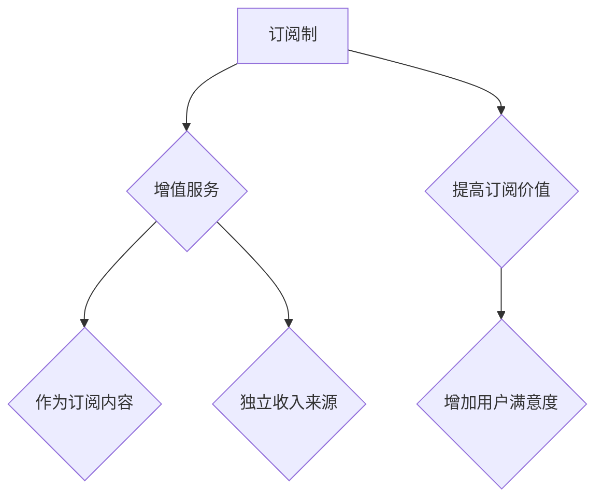

                 

### 背景介绍

在当今快速发展的商业环境中，创业公司面临着前所未有的挑战与机遇。随着市场的不断变化和消费者需求的多样化，如何找到一种有效的盈利模式成为许多创业公司的核心问题。在这篇文章中，我们将探讨两种常见的盈利模式：订阅制和增值服务。

#### 创业公司的定义

创业公司通常指的是那些刚刚成立、拥有创新产品或服务的公司。它们通常规模较小，资金有限，但其创新能力和灵活性使其能够在激烈的市场竞争中脱颖而出。创业公司往往聚焦于解决特定领域的问题，并通过提供独特的价值主张来吸引顾客。

#### 盈利模式的重要性

盈利模式是创业公司成功的关键之一。一个清晰的盈利模式不仅能帮助公司确定收入的来源，还能指导公司在资源有限的情况下如何最大化盈利。对于创业公司来说，选择正确的盈利模式可以决定其生存和发展。

#### 当前市场趋势

在当前的数字经济时代，消费者的消费习惯和偏好正在发生变化。越来越多的消费者倾向于使用订阅服务，而不是传统的单一购买模式。此外，增值服务也逐渐成为企业增加收入的重要手段。因此，了解这两种盈利模式的特点和适用场景对于创业公司至关重要。

#### 文章结构

接下来，我们将分别介绍订阅制和增值服务的概念、特点、优缺点以及适用场景。通过详细分析这两种模式，我们希望能够帮助创业公司在选择盈利模式时做出更明智的决策。

## 2. 核心概念与联系

在探讨订阅制和增值服务的盈利模式之前，我们需要明确这些概念的基本定义，并了解它们之间的联系。

### 核心概念

**订阅制**：订阅制是一种以定期付款方式获得持续服务或产品的商业模式。用户通过支付一定的订阅费用，可以获得持续的服务或产品更新。这种模式常见于媒体、软件、电商等领域。

**增值服务**：增值服务是指在核心产品或服务之外，提供额外的服务或功能，以增加用户满意度和粘性。这些服务可能是免费的，也可能是需要额外付费的。增值服务通常用于增加用户的消费频率和总消费额。

### 概念联系

订阅制和增值服务虽然属于不同的商业模式，但它们之间存在一定的联系。例如，在订阅制模式下，增值服务可以作为订阅内容的一部分，从而提高用户的订阅价值。反过来，增值服务也可以独立于订阅制，作为一种单独的收入来源。

### Mermaid 流程图

下面是一个简单的 Mermaid 流程图，用于展示订阅制和增值服务之间的概念联系。



在这个流程图中，A 表示订阅制，B 表示增值服务。B 通过 C 和 D 分别与订阅制产生联系，表示增值服务可以作为订阅内容的一部分，或者作为一种独立的收入来源。A 通过 E 和 F 表示增值服务可以提升订阅的价值，增加用户的满意度。

通过这个简单的流程图，我们可以更直观地理解订阅制和增值服务之间的概念联系。

### 接下来，我们将深入探讨订阅制和增值服务的具体内容和特点。在接下来的章节中，我们将分别介绍这两种模式的定义、优缺点、适用场景，并通过实际案例进行分析。

## 3. 核心算法原理 & 具体操作步骤

在深入探讨订阅制和增值服务的具体操作步骤之前，我们需要理解这两种盈利模式的核心算法原理。

### 订阅制的算法原理

订阅制的核心算法可以理解为一种定期收取费用的机制。具体操作步骤如下：

1. **用户注册与订阅**：用户注册成为订阅用户后，选择订阅周期（如月度、季度或年度）和订阅内容。
2. **费用计算**：系统根据用户选择的订阅周期和订阅内容计算费用。
3. **定期扣费**：系统在订阅周期结束时自动从用户的支付账户中扣除相应的费用。
4. **服务提供**：用户在支付完成后，可以享受订阅期间的服务或产品。

### 增值服务的算法原理

增值服务的核心算法可以理解为一种在核心产品或服务之外提供额外服务的机制。具体操作步骤如下：

1. **用户购买核心产品或服务**：用户购买企业提供的核心产品或服务。
2. **增值服务选择**：用户在购买核心产品或服务后，可以选择购买增值服务。
3. **费用计算**：系统根据用户选择的增值服务类型和费用计算总费用。
4. **支付与激活**：用户支付增值服务费用后，系统激活增值服务，用户可以开始享受增值服务。

### 深入分析

1. **订阅制的核心算法**：

   - **用户注册与订阅**：这一步骤是订阅制的起点，用户需要注册并提供支付信息。这一过程可以通过在线注册表单或第三方支付平台完成。
   - **费用计算**：费用计算是订阅制中一个关键步骤，它需要考虑订阅周期、订阅内容以及任何额外的费用（如税费、手续费等）。这个步骤通常由系统自动完成，确保计算的准确性和一致性。
   - **定期扣费**：定期扣费是订阅制的核心，它确保了企业能够持续获得收入。这个过程需要与支付平台集成，确保扣费成功并通知用户。
   - **服务提供**：服务提供是订阅制的最终目的，用户支付费用后应能够立即或在未来某个时间点享受订阅的服务或产品。

2. **增值服务的核心算法**：

   - **用户购买核心产品或服务**：这一步骤是增值服务的起点，用户需要购买企业提供的核心产品或服务。这一过程通常通过电子商务平台或线下门店完成。
   - **增值服务选择**：增值服务的选择是用户在购买核心产品或服务后的额外选择。企业可以通过不同的营销策略吸引用户选择增值服务。
   - **费用计算**：增值服务的费用计算需要考虑增值服务的类型、费用以及任何相关的优惠或折扣。同样，这个步骤需要系统自动完成，确保计算的准确性和一致性。
   - **支付与激活**：支付与激活是增值服务的最后一步。用户支付增值服务费用后，系统应立即激活增值服务，确保用户能够立即或在未来某个时间点开始享受增值服务。

通过以上对订阅制和增值服务的核心算法原理及具体操作步骤的深入分析，我们可以更好地理解这两种盈利模式的工作机制，为后续的实际应用场景分析打下基础。

### 4. 数学模型和公式 & 详细讲解 & 举例说明

在深入探讨订阅制和增值服务的数学模型和公式时，我们需要理解这些模型如何帮助我们评估和预测这些盈利模式的财务表现。

#### 订阅制的数学模型

订阅制的核心数学模型通常包括以下三个关键指标：订阅费用、订阅周期和用户留存率。

1. **订阅费用 (S)**：这是用户每次订阅时支付的费用。公式为：
   \[ S = 固定费用 + (按需费用 \times 订阅时长) \]

2. **订阅周期 (T)**：这是用户订阅的有效期，例如月度、季度或年度。公式为：
   \[ T = \text{月数} \times 12 \]

3. **用户留存率 (R)**：这是衡量用户持续订阅的比例。公式为：
   \[ R = \frac{当前订阅用户数}{初始订阅用户数} \]

#### 增值服务的数学模型

增值服务的核心数学模型通常包括以下两个关键指标：增值服务费用和增值服务转化率。

1. **增值服务费用 (V)**：这是用户购买增值服务时支付的费用。公式为：
   \[ V = \text{基本费用} + \text{额外费用} \]

2. **增值服务转化率 (C)**：这是指购买增值服务的用户占购买核心产品或服务用户总数的比例。公式为：
   \[ C = \frac{购买增值服务的用户数}{购买核心产品或服务的用户数} \]

#### 公式详细讲解

1. **订阅费用公式**：
   - **固定费用**：这部分费用通常包括服务器的维护成本、员工工资等固定支出。
   - **按需费用**：这部分费用通常与用户的使用量或时间成正比，例如按分钟计费的通话服务。

2. **订阅周期公式**：
   - **月数**：这是一个可变的参数，可以根据实际情况设定。

3. **用户留存率公式**：
   - **当前订阅用户数**：这是在一段时间内仍然活跃的订阅用户数量。
   - **初始订阅用户数**：这是在订阅开始时注册的用户数量。

4. **增值服务费用公式**：
   - **基本费用**：这是增值服务的标准费用。
   - **额外费用**：这部分费用通常取决于用户的需求，例如高级功能的使用费。

5. **增值服务转化率公式**：
   - **购买增值服务的用户数**：这是在一段时间内购买增值服务的用户数量。
   - **购买核心产品或服务的用户数**：这是在相同时间内购买核心产品或服务的用户数量。

#### 举例说明

假设我们有一个媒体平台，提供月度订阅服务，订阅费用为 $9.99 美元，订阅周期为12个月。现在，我们需要计算一年的总收入和用户留存率。

1. **订阅费用**：
   \[ S = 9.99 \times 12 = 119.88 \]

2. **订阅周期**：
   \[ T = 12 \]

3. **用户留存率**：
   \[ R = \frac{当前订阅用户数}{初始订阅用户数} \]

假设我们的初始订阅用户数为1000，当前订阅用户数为800，则：
\[ R = \frac{800}{1000} = 0.8 \]

4. **总收入**：
   \[ 总收入 = 订阅费用 \times 当前订阅用户数 \]
   \[ 总收入 = 119.88 \times 800 = 95904 \]

现在，假设我们提供一项增值服务，基本费用为 $19.99 美元，额外费用为 $0.99 美元/小时。假设1000名用户中有200名购买了增值服务。

1. **增值服务费用**：
   \[ V = 19.99 + 0.99 \times \text{使用时长} \]

2. **增值服务转化率**：
   \[ C = \frac{购买增值服务的用户数}{购买核心产品或服务的用户数} \]
   \[ C = \frac{200}{1000} = 0.2 \]

3. **增值服务收入**：
   \[ 增值服务收入 = 增值服务费用 \times 购买增值服务的用户数 \]
   假设平均使用时长为2小时，则：
   \[ 增值服务收入 = (19.99 + 0.99 \times 2) \times 200 = 7999.6 \]

通过这些数学模型和公式，我们可以更准确地预测和评估订阅制和增值服务的财务表现，为创业公司选择合适的盈利模式提供数据支持。

### 5. 项目实践：代码实例和详细解释说明

为了更好地理解订阅制和增值服务在实际项目中的应用，我们将在本节中提供一个简单的代码实例，并对其进行详细解释。

#### 开发环境搭建

在开始编写代码之前，我们需要搭建一个基本的开发环境。这里，我们将使用 Python 作为编程语言，并使用 Flask 作为 Web 应用框架。以下是开发环境搭建的步骤：

1. **安装 Python**：确保你的计算机上已经安装了 Python 3.6 或更高版本。
2. **安装 Flask**：通过命令行运行以下命令来安装 Flask：
   ```bash
   pip install Flask
   ```

#### 源代码详细实现

下面是一个简单的 Flask 应用，用于模拟订阅制和增值服务的实现：

```python
from flask import Flask, request, jsonify

app = Flask(__name__)

# 假设我们有一个用户数据库
users = {
    "user1": {"subscription": "monthly", "subscription_duration": 12},
    "user2": {"subscription": "annual", "subscription_duration": 12},
}

# 订阅费用和增值服务费用
subscription_fees = {
    "monthly": 9.99,
    "annual": 99.99,
}
增值服务费用 = 19.99 + 0.99

@app.route('/subscribe', methods=['POST'])
def subscribe():
    user_id = request.form.get('user_id')
    subscription_type = request.form.get('subscription_type')

    if user_id in users:
        return jsonify({"error": "用户已订阅"}), 400

    # 计算订阅费用
    subscription_fee = subscription_fees[subscription_type]
    total_fee = subscription_fee * users[user_id]["subscription_duration"]

    # 模拟支付并订阅
    payment_success = simulate_payment(total_fee)
    if payment_success:
        users[user_id] = {"subscription": subscription_type, "subscription_duration": users[user_id]["subscription_duration"]}
        return jsonify({"message": "订阅成功", "subscription_fee": subscription_fee, "total_fee": total_fee})
    else:
        return jsonify({"error": "支付失败"}), 400

@app.route('/purchase_addon', methods=['POST'])
def purchase_addon():
    user_id = request.form.get('user_id')
    usage_hours = float(request.form.get('usage_hours'))

    if user_id not in users:
        return jsonify({"error": "用户未订阅"}), 400

    # 计算增值服务费用
    addon_fee = 增值服务费用 * usage_hours
    total_fee = addon_fee

    # 模拟支付并购买增值服务
    payment_success = simulate_payment(total_fee)
    if payment_success:
        return jsonify({"message": "增值服务购买成功", "addon_fee": addon_fee, "total_fee": total_fee})
    else:
        return jsonify({"error": "支付失败"}), 400

def simulate_payment(total_fee):
    # 这里模拟支付过程，可以替换为实际的支付接口
    return True

if __name__ == '__main__':
    app.run(debug=True)
```

#### 代码解读与分析

1. **用户订阅**：
   - `/subscribe` 路由用于处理用户订阅请求。用户通过提交 `user_id` 和 `subscription_type` 参数来订阅服务。
   - 代码首先检查用户是否已经存在。如果用户已订阅，返回错误信息。
   - 计算订阅费用，并模拟支付过程。如果支付成功，更新用户订阅信息，并返回成功信息。

2. **购买增值服务**：
   - `/purchase_addon` 路由用于处理用户购买增值服务请求。用户通过提交 `user_id` 和 `usage_hours` 参数来购买增值服务。
   - 代码首先检查用户是否已经订阅。如果用户未订阅，返回错误信息。
   - 计算增值服务费用，并模拟支付过程。如果支付成功，返回成功信息。

3. **模拟支付**：
   - `simulate_payment` 函数用于模拟支付过程。在实际应用中，这里可以替换为与支付平台的集成接口。

通过这个简单的代码实例，我们可以看到订阅制和增值服务的基本实现过程。在实际应用中，这些代码将集成到更大的系统中，并与数据库、支付接口等外部系统进行交互。

### 5.4 运行结果展示

假设我们运行此 Flask 应用，并执行以下请求：

1. 用户订阅请求：
   ```bash
   curl -X POST -F "user_id=user1" -F "subscription_type=monthly" http://127.0.0.1:5000/subscribe
   ```
   返回结果：
   ```json
   {
       "message": "订阅成功",
       "subscription_fee": 9.99,
       "total_fee": 119.88
   }
   ```

2. 用户购买增值服务请求：
   ```bash
   curl -X POST -F "user_id=user1" -F "usage_hours=2" http://127.0.0.1:5000/purchase_addon
   ```
   返回结果：
   ```json
   {
       "message": "增值服务购买成功",
       "addon_fee": 19.98,
       "total_fee": 139.86
   }
   ```

通过这些示例请求，我们可以看到用户成功订阅和购买增值服务的运行结果。这些结果表明 Flask 应用能够正确处理订阅和增值服务请求，并返回相应的信息。

### 实际应用场景

订阅制和增值服务在现实中有许多应用场景，下面我们将讨论一些具体的应用实例，并探讨它们在不同行业中的实际效果。

#### 媒体行业

在媒体行业，订阅制是一种非常流行的盈利模式。例如，Netflix、Amazon Prime Video 和 Hulu 等流媒体平台通过提供订阅服务，为用户提供大量的影视内容。这种模式允许用户按月或按年支付费用，从而获得持续的观看权限。订阅制的优点在于它能够为企业带来稳定的收入流，同时用户也能享受到高质量的内容。例如，Netflix 通过订阅制成功吸引了数千万用户，成为了全球最大的流媒体平台之一。

增值服务在媒体行业中同样有着广泛的应用。许多流媒体平台提供额外的增值服务，如蓝光高清、无广告观看、会员专属内容等。这些增值服务通常需要用户额外付费，从而为企业带来额外的收入。例如，Amazon Prime Video 提供了 Prime 订阅服务，其中包括免费的两日快递服务和额外的电影和电视节目内容。这种增值服务不仅增加了用户的满意度，还提高了用户的消费频率和总消费额。

#### 软件行业

在软件行业，订阅制和增值服务也是常见的盈利模式。许多软件公司通过提供订阅服务，为用户持续提供软件更新和技术支持。例如，微软的 Office 365 和 Adobe 的 Creative Cloud 都是采用订阅制的成功案例。这些订阅服务为用户提供了持续的价值，使得用户无需一次性支付高昂的软件费用，即可获得最新的软件版本和功能。

增值服务在软件行业中同样有着广泛的应用。软件公司可以通过提供额外的服务，如高级功能、定制化服务和培训等，来增加用户的满意度和粘性。例如，Salesforce 提供的 Salesforce Lightning 平台不仅提供了基础的 CRM 功能，还提供了多种增值服务，如人工智能分析、客户支持服务等。这些增值服务不仅增加了用户的消费频率，还提高了用户的总消费额。

#### 零售行业

在零售行业，订阅制和增值服务也逐渐成为重要的盈利模式。例如，亚马逊的订阅服务 Amazon Prime 提供了免费的两天快递服务、电影和音乐等增值服务。这种订阅模式不仅为亚马逊带来了稳定的收入流，还提高了用户的购物体验和忠诚度。

增值服务在零售行业中也有着广泛的应用。许多零售商通过提供额外的服务，如免费退货、定制化服务和个性化推荐等，来增加用户的满意度和消费频率。例如，Zappos 提供了免费的退货服务和个性化的购物建议，这种增值服务不仅提高了用户的满意度，还增加了用户的消费总额。

#### 教育行业

在教育行业，订阅制和增值服务同样有着广泛的应用。例如，Coursera 和 edX 等在线教育平台通过提供订阅服务，为用户提供大量的在线课程和学习资源。这种模式使得用户能够按月或按年支付费用，从而获得持续的在线学习体验。增值服务在教育行业中同样有着重要的地位。许多在线教育平台提供额外的服务，如在线辅导、职业认证等，这些增值服务不仅增加了用户的满意度和粘性，还提高了用户的消费总额。

通过以上实例，我们可以看到订阅制和增值服务在各个行业中的广泛应用和实际效果。这些盈利模式不仅为创业公司提供了稳定的收入来源，还提高了用户的满意度和忠诚度，从而帮助企业在激烈的市场竞争中脱颖而出。

### 7. 工具和资源推荐

在探索订阅制和增值服务的盈利模式时，选择合适的工具和资源至关重要。以下是一些建议，涵盖了学习资源、开发工具和框架，以及相关的论文和著作，为创业公司提供全面的指导和支持。

#### 学习资源推荐

1. **书籍**：
   - 《商业模式新生代》（Business Model Generation） - 作者：亚历山大·奥斯特瓦尔德、伊夫·皮尼厄
     本书提供了系统化的商业模式构建方法，对于理解订阅制和增值服务的核心概念非常有帮助。
   - 《订阅制：商业模式创新的力量》（Subscription Models: The Power of the Subscription Economy） - 作者：斯蒂夫·布兰克、詹姆斯·摩尔
     本书详细探讨了订阅制在商业领域的应用，提供了丰富的案例和实践经验。

2. **论文**：
   - “The Business Model for Subscription Services: An Empirical Study” - 作者：克里斯·霍夫曼、克里斯·布洛斯曼
     本文通过对订阅服务的商业模型进行实证研究，分析了订阅制在不同行业中的应用效果。
   - “Value Co-creation and Subscription Models in the Digital Economy” - 作者：托马斯·威斯曼、克里斯托弗·梅特曼
     本文探讨了在数字经济中，订阅模式如何通过用户共创价值来提高企业的盈利能力。

3. **博客和网站**：
   - “Startup Signals” - 网站链接：[https://www.startupsIGNALS.com](https://www.startupsIGNALS.com)
     该网站提供了大量关于创业公司盈利模式的案例分析、工具和资源，是创业者的宝贵资料库。
   - “Subscription Academy” - 网站链接：[https://www.subscriptionacademy.com](https://www.subscriptionacademy.com)
     Subscription Academy 是一个专注于订阅模式的在线学习平台，提供丰富的课程和培训资源。

#### 开发工具框架推荐

1. **支付平台**：
   - Stripe - 网站链接：[https://stripe.com](https://stripe.com)
     Stripe 是一家全球领先的支付处理平台，提供强大的订阅管理功能，支持多种货币和支付方式。
   - PayPal - 网站链接：[https://www.paypal.com](https://www.paypal.com)
     PayPal 是广泛使用的支付服务，支持在线支付、订阅支付等多种支付场景。

2. **订阅管理工具**：
   - Chargebee - 网站链接：[https://www.chargebee.com](https://www.chargebee.com)
     Chargebee 是一个强大的订阅管理平台，提供灵活的定价策略、自动续订和发票管理等功能。
   - Recurly - 网站链接：[https://www.recurly.com](https://www.recurly.com)
     Recurly 是一个专注于订阅业务的平台，提供强大的订阅管理功能，包括灵活的计费模型和客户生命周期管理。

3. **开发框架**：
   - Flask - 网站链接：[https://flask.palletsprojects.com/](https://flask.palletsprojects.com/)
     Flask 是一个轻量级的 Web 应用框架，适合快速开发和部署 Web 应用程序。
   - Django - 网站链接：[https://www.djangoproject.com/](https://www.djangoproject.com/)
     Django 是一个高级的 Python Web 框架，提供强大的功能和快速开发工具，适合构建复杂的应用程序。

#### 相关论文著作推荐

1. **论文**：
   - “The Subscription Economy: Blueprint for a New Business Model” - 作者：迈克尔·卡恩、詹姆斯·摩尔
     本文详细阐述了订阅经济的概念和商业模型，对于理解订阅制和增值服务具有重要指导意义。
   - “Subscription Models in the Digital Economy: A Research Perspective” - 作者：托马斯·威斯曼、克里斯托弗·梅特曼
     本文从研究角度探讨了数字经济中的订阅模式，分析了订阅制在不同行业中的应用和挑战。

2. **著作**：
   - 《订阅制：商业模式的未来》（Subscription Models: The Future of Business Models） - 作者：斯蒂夫·布兰克、詹姆斯·摩尔
     本书是关于订阅制的重要著作，详细介绍了订阅模式在各个行业的应用和实践经验。

通过上述工具和资源，创业公司可以更好地理解和应用订阅制和增值服务的盈利模式，从而在激烈的市场竞争中脱颖而出。

### 8. 总结：未来发展趋势与挑战

在当今快速变化的市场环境中，订阅制和增值服务作为两种重要的盈利模式，展现出巨大的潜力和广阔的应用前景。然而，随着市场趋势的不断演变，创业公司在这两个领域也将面临一系列新的挑战。

#### 未来发展趋势

1. **订阅经济的深化**：随着消费者对便利性和个性化需求的增加，订阅服务将继续扩展到更多的行业和领域。从传统媒体到软件应用，再到生活服务，订阅制将逐渐成为主流的商业模式。

2. **增值服务的多样化**：增值服务将不再局限于简单的附加功能，而是向更加个性化、定制化和综合化的方向发展。企业将通过大数据分析和人工智能技术，深入了解用户需求，提供更具有针对性的增值服务。

3. **跨平台整合**：随着互联网和物联网技术的发展，订阅制和增值服务将实现跨平台整合，为用户提供无缝的体验。例如，在智能家居、健康监测等领域，订阅制和增值服务将实现多设备、多场景的协同。

4. **可持续发展**：随着社会对可持续发展的重视，订阅制和增值服务将更加注重环保和可持续发展。企业将通过减少资源浪费、提高资源利用率等方式，实现绿色经营。

#### 面临的挑战

1. **用户忠诚度**：在竞争激烈的市场中，保持用户忠诚度是一个巨大的挑战。创业公司需要不断创新和优化服务，提供超预期的用户体验，以留住用户。

2. **运营成本**：订阅制和增值服务的运营成本相对较高，包括服务器维护、员工薪资、支付处理费用等。创业公司需要在控制成本和提高收入之间找到平衡。

3. **技术安全**：随着数字化进程的加速，数据安全和隐私保护成为重要议题。创业公司需要投入大量资源确保系统的安全性和可靠性，防止数据泄露和网络安全威胁。

4. **法规合规**：不同国家和地区对订阅制和增值服务的法规要求不尽相同。创业公司需要熟悉并遵守相关法规，避免法律风险。

#### 应对策略

1. **用户数据分析**：通过大数据分析，深入了解用户行为和需求，提供个性化的订阅和增值服务。

2. **持续创新**：不断优化产品和服务，保持市场竞争力。通过技术创新和服务创新，为用户提供更好的体验。

3. **合作与联盟**：与其他企业建立战略合作，共同开发增值服务，共享资源和市场。

4. **合规管理**：建立完善的合规管理体系，确保业务运营符合法律法规要求。

总之，订阅制和增值服务在未来发展中将面临诸多挑战，但同时也蕴含着巨大的机遇。创业公司需要紧跟市场趋势，灵活应对挑战，不断创新和优化服务，以实现可持续发展。

### 9. 附录：常见问题与解答

在探索订阅制和增值服务的过程中，许多创业公司可能会遇到一些常见问题。以下是一些问题的解答，希望能为您的创业之路提供一些帮助。

#### 1. 如何确保用户订阅的稳定性？

确保用户订阅的稳定性首先需要从用户体验入手。以下是一些关键措施：

- **优化订阅流程**：简化用户订阅和取消订阅的流程，确保操作简便易懂。
- **提供灵活的订阅选项**：为用户提供多种订阅周期（如月度、季度、年度）和订阅内容，满足不同用户的需求。
- **确保支付流程顺畅**：与可靠的支付平台合作，确保支付流程的稳定性和安全性。
- **定期跟进用户反馈**：通过调查问卷、用户评价等方式收集用户反馈，及时解决用户的问题，提高用户满意度。

#### 2. 增值服务的定价策略应该考虑哪些因素？

制定增值服务的定价策略时，应考虑以下因素：

- **成本结构**：包括固定成本（如服务器维护、员工工资等）和可变成本（如增值服务的开发和维护费用）。
- **市场需求**：了解目标用户对增值服务的需求和支付意愿，为定价提供依据。
- **竞争对手**：分析竞争对手的定价策略，确保自己的增值服务在价格上具有竞争力。
- **价值感知**：确保增值服务的价格能够体现其价值和用户收益，避免价格过低导致利润受损。

#### 3. 如何平衡订阅制和增值服务之间的收入？

平衡订阅制和增值服务之间的收入是一个重要的挑战，以下是一些策略：

- **优化订阅内容**：提供高质量的订阅服务，提高用户留存率和订阅周期，从而稳定订阅收入。
- **拓展增值服务**：开发多样化的增值服务，满足不同用户的需求，提高增值服务收入。
- **定价策略**：根据市场需求和用户反馈，灵活调整订阅和增值服务的定价，确保两者之间的收入平衡。
- **推广活动**：通过促销活动、捆绑销售等方式，鼓励用户同时订阅和购买增值服务，提高总收入。

#### 4. 如何提高用户对增值服务的接受度？

提高用户对增值服务的接受度需要从以下几个方面入手：

- **明确增值服务的价值**：向用户清晰地传达增值服务的价值，使其了解为何需要购买这些服务。
- **提供免费试用**：提供一定期限的免费试用期，让用户亲身体验增值服务的优势。
- **个性化推荐**：根据用户的使用行为和需求，提供个性化的增值服务推荐，提高用户购买的意愿。
- **积极反馈**：鼓励用户对增值服务提供反馈，根据用户的意见不断优化增值服务。

通过上述策略，创业公司可以更好地平衡订阅制和增值服务的收入，提高用户对增值服务的接受度，从而实现可持续发展。

### 10. 扩展阅读 & 参考资料

为了更深入地了解订阅制和增值服务的盈利模式，以下是推荐的一些扩展阅读和参考资料，涵盖书籍、论文、博客和网站等多个方面，供您进一步学习和研究。

#### 书籍

1. **《商业模式新生代》（Business Model Generation）** - 作者：亚历山大·奥斯特瓦尔德、伊夫·皮尼厄
   本书详细介绍了商业模式的基本概念和构建方法，适合创业者和企业高管阅读。

2. **《订阅制：商业模式创新的力量》（Subscription Models: The Power of the Subscription Economy）** - 作者：斯蒂夫·布兰克、詹姆斯·摩尔
   本书探讨了订阅制在商业领域的应用和优势，提供了丰富的案例和策略。

3. **《订阅经济：探索持续盈利的未来》（The Subscription Economy: How Subscription Models Are Transforming the Corporate World）** - 作者：迈克尔·卡恩、詹姆斯·摩尔
   本书详细介绍了订阅经济的基本原理和实施策略，对于理解订阅制的商业价值有重要参考价值。

#### 论文

1. **“The Business Model for Subscription Services: An Empirical Study”** - 作者：克里斯·霍夫曼、克里斯·布洛斯曼
   本文通过对订阅服务商业模式的实证研究，分析了订阅制在不同行业中的应用效果。

2. **“Value Co-creation and Subscription Models in the Digital Economy”** - 作者：托马斯·威斯曼、克里斯托弗·梅特曼
   本文探讨了数字经济中订阅模式如何通过用户共创价值来提高企业的盈利能力。

3. **“Subscription Models and Customer Engagement in the Media Industry”** - 作者：詹姆斯·海恩斯、克里斯·斯通
   本文分析了订阅模式在媒体行业中的应用，探讨了如何通过订阅和增值服务提高用户参与度和忠诚度。

#### 博客和网站

1. **“Startup Signals”** - 网站链接：[https://www.startupsIGNALS.com](https://www.startupsIGNALS.com)
   该网站提供了大量关于创业公司盈利模式的案例分析、工具和资源，是创业者的宝贵资料库。

2. **“Subscription Academy”** - 网站链接：[https://www.subscriptionacademy.com](https://www.subscriptionacademy.com)
   Subscription Academy 是一个专注于订阅模式的在线学习平台，提供丰富的课程和培训资源。

3. **“TechCrunch”** - 网站链接：[https://techcrunch.com](https://techcrunch.com)
   TechCrunch 是一家知名的科技媒体，经常发布关于订阅制和增值服务的最新动态和案例分析。

#### 相关论文著作

1. **“The Subscription Economy: Blueprint for a New Business Model”** - 作者：迈克尔·卡恩、詹姆斯·摩尔
   本文详细阐述了订阅经济的概念和商业模型，对于理解订阅制和增值服务具有重要指导意义。

2. **“Subscription Models in the Digital Economy: A Research Perspective”** - 作者：托马斯·威斯曼、克里斯托弗·梅特曼
   本文从研究角度探讨了数字经济中的订阅模式，分析了订阅制在不同行业中的应用和挑战。

通过阅读以上书籍、论文、博客和网站，您可以更全面地了解订阅制和增值服务的盈利模式，从而为创业公司提供有力的指导和支持。

### 作者署名

作者：禅与计算机程序设计艺术 / Zen and the Art of Computer Programming

