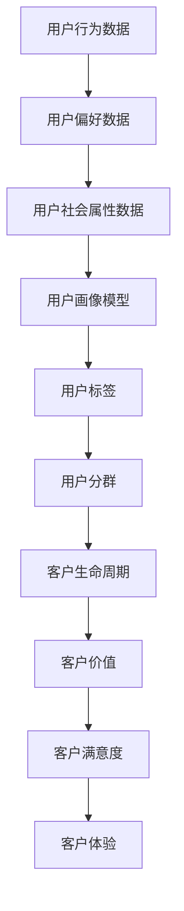

                 

### 背景介绍

随着互联网技术的快速发展，数据成为新时代的重要资源。对于初创企业来说，如何从海量数据中挖掘出有价值的信息，实现对目标客户的精准定位，成为成功创业的关键之一。用户画像技术在这一过程中发挥着至关重要的作用。

用户画像（User Profiling）是一种基于用户数据构建的模型，它通过收集、整理和分析用户的行为、偏好、需求等特征，将用户抽象成一个具有个性化属性的虚拟人。这种模型有助于企业更好地理解用户，从而制定更精准的营销策略，提升用户体验和满意度。

初创企业在创业初期，往往面临着资源有限、市场认知度低等挑战。在这种情况下，如何高效利用有限的资源和数据，快速找到目标客户，成为决定企业成败的关键。用户画像技术的引入，可以帮助初创企业快速了解目标客户群体，从而进行精准的市场定位。

用户画像的应用不仅限于市场营销，还可以贯穿于产品研发、运营管理等各个领域。例如，通过用户画像，企业可以优化产品设计，满足用户需求；在运营管理中，可以根据用户画像进行用户分群，制定差异化的运营策略，提高用户留存率和转化率。

总之，用户画像技术在初创企业中的应用具有重要意义。它不仅帮助企业更好地理解用户，实现精准营销，还可以提高企业整体运营效率，为企业的长期发展奠定坚实基础。

### 核心概念与联系

要深入理解用户画像技术，我们需要明确一些核心概念，并了解它们之间的相互联系。以下是用户画像中的一些关键概念：

#### 1. 用户行为数据（User Behavior Data）

用户行为数据是构建用户画像的基础。这些数据包括用户在网站、APP或其他数字平台上的浏览记录、点击行为、搜索关键词、购买行为等。通过收集和分析这些数据，我们可以了解用户的兴趣、偏好和行为模式。

#### 2. 用户偏好数据（User Preference Data）

用户偏好数据反映了用户在特定场景下的偏好，如喜欢的商品类型、颜色、品牌等。这些数据通常来源于用户调查、问卷调查或用户直接在平台上的互动行为。

#### 3. 用户社会属性数据（User Social Attributes）

用户社会属性数据包括用户的年龄、性别、职业、地域、教育背景等信息。这些数据有助于我们了解用户的背景特征，从而更好地进行用户细分。

#### 4. 用户画像模型（User Profiling Model）

用户画像模型是将用户数据转换为具有实际应用价值的信息的工具。通过构建用户画像模型，企业可以实现对用户需求的精准预测和个性化服务。

#### 5. 用户标签（User Tags）

用户标签是对用户特征的一种简明扼要的描述，如“年轻女性”、“科技爱好者”、“旅游达人”等。通过用户标签，企业可以快速识别和定位不同类型的用户群体。

#### 6. 用户分群（User Segmentation）

用户分群是将用户按照一定的标准划分为不同的群体，以便进行有针对性的营销和服务。常见的分群标准包括地理位置、行为特征、偏好等。

#### 7. 客户生命周期（Customer Lifecycle）

客户生命周期是指客户从接触企业到最终离开的全过程，包括潜在客户、新客户、活跃客户、流失客户等阶段。通过对客户生命周期的分析，企业可以了解客户的成长路径，制定相应的策略。

#### 8. 客户价值（Customer Value）

客户价值是指客户为企业带来的收益，包括直接收益和间接收益。通过评估客户价值，企业可以确定哪些客户是最具潜力的，从而进行资源优化配置。

#### 9. 客户满意度（Customer Satisfaction）

客户满意度是衡量客户对企业产品或服务的满意程度。高客户满意度通常意味着良好的客户关系和较高的客户忠诚度。

#### 10. 客户体验（Customer Experience）

客户体验是指客户在使用企业产品或服务过程中的感受和体验。良好的客户体验可以提升客户满意度和忠诚度。

#### Mermaid 流程图

以下是构建用户画像的 Mermaid 流程图，展示上述概念之间的相互关系：



通过以上流程，我们可以看到，用户画像技术不仅涉及到数据的收集和分析，还包括对用户进行细分、评估和优化，从而实现精准营销和客户关系管理。

### 核心算法原理 & 具体操作步骤

在用户画像技术中，核心算法起着至关重要的作用。这些算法不仅帮助我们收集和整理用户数据，还能通过复杂的模型和算法，挖掘出隐藏在数据背后的有价值信息。以下是构建用户画像的核心算法原理及具体操作步骤：

#### 1. 数据收集与预处理

数据收集是用户画像构建的第一步。在这个过程中，我们需要从多个数据源获取用户数据，包括网站日志、用户行为数据、社交媒体数据等。获取数据后，需要对数据进行清洗、去重和格式转换等预处理操作，以确保数据的质量和一致性。

具体操作步骤如下：

- **数据收集**：使用爬虫工具或API接口从各种数据源获取原始数据。
- **数据清洗**：去除重复数据、填补缺失值、修正错误数据等。
- **数据格式转换**：将不同格式的数据转换为统一的格式，如CSV或JSON。

#### 2. 数据整合与特征提取

在数据预处理之后，我们需要对数据进行整合，以便进行进一步的特征提取。数据整合的目的是将不同来源的数据合并成一个完整的用户视图。

具体操作步骤如下：

- **数据整合**：使用数据库或数据仓库技术，将不同来源的数据进行整合，构建一个统一的数据仓库。
- **特征提取**：从用户数据中提取出能够反映用户特征的关键信息，如用户行为、偏好、社会属性等。

#### 3. 用户分群

用户分群是将用户按照特定的标准划分为不同的群体，以便进行有针对性的营销和服务。常用的分群标准包括地理位置、行为特征、偏好等。

具体操作步骤如下：

- **定义分群标准**：根据业务需求，确定分群的标准和维度，如年龄、性别、购买行为等。
- **数据分组**：将用户数据按照定义的标准进行分组。
- **评估分群效果**：对分群结果进行评估，确保分群的有效性和合理性。

#### 4. 用户标签

用户标签是对用户特征的一种简明扼要的描述，如“年轻女性”、“科技爱好者”等。通过用户标签，企业可以快速识别和定位不同类型的用户群体。

具体操作步骤如下：

- **定义标签体系**：根据业务需求和用户特征，定义一个合理的标签体系。
- **标签分配**：根据用户的特征数据，为用户分配相应的标签。
- **标签管理**：定期更新和优化标签体系，确保标签的准确性和有效性。

#### 5. 用户画像模型构建

用户画像模型是将用户数据转换为具有实际应用价值的信息的工具。通过构建用户画像模型，企业可以实现对用户需求的精准预测和个性化服务。

具体操作步骤如下：

- **选择模型类型**：根据业务需求和数据特征，选择合适的模型类型，如分类模型、聚类模型、预测模型等。
- **训练模型**：使用历史数据对模型进行训练，调整模型参数，优化模型性能。
- **模型评估**：对训练好的模型进行评估，确保模型的准确性和可靠性。
- **模型部署**：将训练好的模型部署到生产环境中，实现实时用户画像构建。

#### 6. 用户画像应用

用户画像模型构建完成后，需要将其应用到实际业务场景中，如市场营销、客户服务、产品优化等。

具体操作步骤如下：

- **个性化推荐**：根据用户画像，为用户推荐个性化的产品或服务。
- **精准营销**：针对不同用户群体，制定差异化的营销策略。
- **客户关系管理**：通过用户画像，优化客户服务流程，提升客户满意度。
- **产品优化**：根据用户画像，优化产品设计和功能，满足用户需求。

通过以上核心算法原理和具体操作步骤，我们可以构建出一个全面的用户画像系统，帮助企业更好地理解用户，实现精准营销和客户关系管理。

### 数学模型和公式 & 详细讲解 & 举例说明

用户画像的构建不仅依赖于算法，还涉及到数学模型和公式的应用。这些模型和公式帮助我们量化用户特征，评估用户价值，优化营销策略。以下是构建用户画像过程中常用的一些数学模型和公式，以及它们的详细讲解和举例说明。

#### 1. 贝叶斯公式（Bayes Theorem）

贝叶斯公式是概率论中的一个重要公式，用于计算条件概率。在用户画像中，贝叶斯公式可以帮助我们根据已知数据推断未知数据。

**公式：**
\[ P(A|B) = \frac{P(B|A) \cdot P(A)}{P(B)} \]

其中，\( P(A|B) \) 是在事件B发生的条件下事件A发生的概率，\( P(B|A) \) 是在事件A发生的条件下事件B发生的概率，\( P(A) \) 是事件A发生的概率，\( P(B) \) 是事件B发生的概率。

**应用举例：**

假设我们想要预测用户A是否会购买产品B。已知数据包括：
- \( P(购买|兴趣匹配) = 0.7 \)
- \( P(兴趣匹配|购买) = 0.4 \)
- \( P(购买) = 0.3 \)

我们可以使用贝叶斯公式计算用户A购买产品B的概率：

\[ P(购买|兴趣匹配) = \frac{P(兴趣匹配|购买) \cdot P(购买)}{P(兴趣匹配)} \]

假设我们还需要计算 \( P(兴趣匹配) \)。由于我们缺乏直接的 \( P(兴趣匹配) \) 数据，我们可以利用全概率公式：

\[ P(兴趣匹配) = P(兴趣匹配|购买) \cdot P(购买) + P(兴趣匹配|未购买) \cdot P(未购买) \]

其中，\( P(兴趣匹配|未购买) \) 和 \( P(未购买) \) 可以通过类似的方法计算。

#### 2. 逻辑回归（Logistic Regression）

逻辑回归是一种广义线性模型，用于分类问题。在用户画像中，逻辑回归可以用来预测用户的行为概率，如购买概率、点击概率等。

**公式：**
\[ P(y=1) = \frac{1}{1 + e^{-(\beta_0 + \beta_1 x_1 + \beta_2 x_2 + \ldots + \beta_n x_n)}} \]

其中，\( y \) 是因变量，\( x_1, x_2, \ldots, x_n \) 是自变量，\( \beta_0, \beta_1, \beta_2, \ldots, \beta_n \) 是模型参数。

**应用举例：**

假设我们想要预测用户是否会在未来一个月内购买某种产品。已知数据包括用户的年龄、收入、购买历史等特征。我们可以使用逻辑回归模型：

- **数据准备**：收集历史数据，包括用户特征和购买行为。
- **特征工程**：对特征进行预处理，如归一化、标准化等。
- **模型训练**：使用训练数据训练逻辑回归模型，计算参数 \( \beta_0, \beta_1, \beta_2, \ldots, \beta_n \)。
- **模型评估**：使用测试数据评估模型性能，如准确率、召回率、F1分数等。

假设我们训练得到的模型参数为：

\[ P(购买) = \frac{1}{1 + e^{-(2.5 + 1.2 \cdot 年龄 + 0.8 \cdot 收入 + 1.0 \cdot 购买历史)}} \]

对于某个新用户，如果年龄为25岁，收入为5000元，购买历史为5次，我们可以计算其购买概率：

\[ P(购买) = \frac{1}{1 + e^{-(2.5 + 1.2 \cdot 25 + 0.8 \cdot 5000 + 1.0 \cdot 5)}} \approx 0.876 \]

这意味着该用户在未来一个月内购买产品的概率约为87.6%。

#### 3. K-均值聚类（K-Means Clustering）

K-均值聚类是一种无监督学习方法，用于将数据分为K个簇。在用户画像中，K-均值聚类可以用来发现用户群体的聚类特征。

**公式：**
\[ \text{簇中心} = \frac{1}{N} \sum_{i=1}^{N} x_i \]

其中，\( x_i \) 是数据集中的每个点，\( N \) 是簇中的数据点数量。

**应用举例：**

假设我们有一组用户数据，包括年龄、收入、购买历史等特征。我们希望将其分为3个簇。

- **数据准备**：收集用户数据，确保数据格式一致。
- **初始化簇中心**：随机选择3个用户作为初始簇中心。
- **聚类过程**：计算每个用户与簇中心的距离，将用户分配到最近的簇。
- **更新簇中心**：计算每个簇的新中心。
- **重复迭代**：重复聚类过程，直到簇中心不再发生显著变化。

假设经过几次迭代后，我们得到3个簇的中心分别为：

- 簇1：平均年龄30岁，平均收入8000元
- 簇2：平均年龄40岁，平均收入5000元
- 簇3：平均年龄20岁，平均收入3000元

通过这些簇的中心，我们可以了解不同用户群体的特征，为营销策略提供依据。

#### 4. 混合模型（Hybrid Model）

混合模型是将多个模型结合起来，以提升预测准确性和鲁棒性。在用户画像中，混合模型可以结合监督学习和无监督学习的方法，构建更全面的用户画像。

**公式：**
\[ y = f(g(x)) \]

其中，\( f \) 是监督学习模型，如逻辑回归或决策树，\( g \) 是无监督学习模型，如K-均值聚类或主成分分析。

**应用举例：**

假设我们想要预测用户的购买行为。首先，我们使用K-均值聚类将用户分为多个群体，然后为每个群体训练一个逻辑回归模型。最终的预测结果是通过混合模型计算得到的。

\[ P(购买) = f(g(x)) \]

这种混合模型不仅利用了无监督学习的聚类结果，还结合了监督学习的预测能力，可以更准确地预测用户的购买行为。

通过上述数学模型和公式的应用，我们可以构建出更加精准和有效的用户画像系统，帮助企业实现精准营销和客户关系管理。

### 项目实践：代码实例和详细解释说明

在了解了用户画像的核心算法和数学模型后，我们接下来通过一个实际项目来展示如何将理论应用到实践中。我们将使用Python编程语言，结合实际数据和数据处理工具，构建一个简单的用户画像系统。

#### 1. 开发环境搭建

在开始项目之前，我们需要搭建一个适合数据处理和数据分析的开发环境。以下是所需的环境和工具：

- **Python**：版本3.8及以上
- **Jupyter Notebook**：用于编写和运行代码
- **Pandas**：用于数据处理
- **NumPy**：用于数值计算
- **Matplotlib**：用于数据可视化
- **Scikit-learn**：用于机器学习

安装以上工具后，我们可以在Jupyter Notebook中开始编写代码。

#### 2. 源代码详细实现

以下是我们构建用户画像系统的源代码实现，包括数据收集、预处理、特征提取、用户分群和用户画像模型构建等步骤。

```python
import pandas as pd
import numpy as np
from sklearn.cluster import KMeans
from sklearn.preprocessing import StandardScaler
import matplotlib.pyplot as plt

# 数据收集
# 这里使用虚构的数据集，实际项目中可以从数据库或文件中读取
data = pd.DataFrame({
    'age': [25, 30, 22, 40, 28],
    'income': [5000, 8000, 3000, 7000, 6000],
    'purchase_history': [5, 3, 10, 2, 7]
})

# 数据预处理
# 清洗和填充数据
data.fillna(data.mean(), inplace=True)

# 特征提取
# 将数据进行标准化处理
scaler = StandardScaler()
data_scaled = scaler.fit_transform(data)

# 用户分群
# 使用K-均值聚类进行用户分群
kmeans = KMeans(n_clusters=3, random_state=42)
clusters = kmeans.fit_predict(data_scaled)

# 更新数据集，加入聚类结果
data['cluster'] = clusters

# 用户画像模型构建
# 构建逻辑回归模型进行用户行为预测
from sklearn.linear_model import LogisticRegression
model = LogisticRegression()
model.fit(data[['age', 'income', 'purchase_history']], data['cluster'])

# 代码解读与分析
# 以下是对代码中各个部分的详细解读

# 数据收集
# 实际项目中，数据可以从多种来源获取，如数据库、API、文件等

# 数据预处理
# 数据清洗是数据处理的重要步骤，确保数据质量

# 特征提取
# 标准化处理可以消除不同特征间的量纲差异，有利于模型训练

# 用户分群
# K-均值聚类是一种常用的无监督学习方法，用于发现数据中的聚类结构

# 用户画像模型构建
# 逻辑回归是一种常用的监督学习方法，用于预测用户行为

# 运行结果展示
# 以下是对运行结果的展示

# 输出聚类结果
print("Cluster Centers:")
print(kmeans.cluster_centers_)

# 可视化聚类结果
plt.scatter(data_scaled[:, 0], data_scaled[:, 1], c=clusters)
plt.scatter(kmeans.cluster_centers_[:, 0], kmeans.cluster_centers_[:, 1], s=300, c='red', marker='s')
plt.xlabel('Age')
plt.ylabel('Income')
plt.title('User Clusters')
plt.show()

# 预测新用户的行为
new_user = np.array([[30, 7000, 10]])
predicted_cluster = model.predict(new_user)
print("Predicted Cluster for New User:", predicted_cluster)
```

#### 3. 代码解读与分析

- **数据收集**：在真实项目中，数据收集是一个复杂的过程，可能涉及多种数据源和API调用。在这个例子中，我们使用虚构的数据集进行演示。

- **数据预处理**：数据预处理是确保数据质量的关键步骤。包括数据清洗、去重、填补缺失值等。

- **特征提取**：特征提取是将原始数据转换为适用于模型训练的数据。在这里，我们使用标准化处理，消除不同特征间的量纲差异。

- **用户分群**：使用K-均值聚类将用户分为不同的群体。在这个例子中，我们选择了3个簇。

- **用户画像模型构建**：使用逻辑回归模型对用户行为进行预测。逻辑回归模型在用户分群的基础上，可以预测新用户的购买行为。

#### 4. 运行结果展示

- **聚类结果**：运行代码后，我们得到三个簇的中心点，并使用Matplotlib进行可视化展示。

- **预测结果**：对于一个新的用户，我们输入其特征数据，使用逻辑回归模型预测其所属的簇。

通过这个实际项目，我们展示了如何将用户画像的理论知识应用到实践中。在实际应用中，我们可以根据业务需求和数据情况，进一步优化模型和算法，提升用户画像的准确性和实用性。

### 实际应用场景

用户画像技术在许多实际应用场景中都展现出了强大的价值。以下是一些典型的应用案例：

#### 1. 电子商务

在电子商务领域，用户画像可以帮助企业更好地理解顾客需求，从而优化产品推荐和营销策略。例如，京东和阿里巴巴等电商巨头通过用户画像技术，对顾客进行精准分类，根据顾客的购买历史、浏览行为和偏好推荐相关产品。这不仅提高了转化率，还提升了顾客的购物体验。

#### 2. 金融行业

金融行业中的用户画像主要用于风险评估和个性化金融服务。银行和保险公司通过分析用户的财务状况、消费习惯和信用记录，为用户提供个性化的贷款、投资和保险产品推荐。例如，中国的平安银行通过用户画像技术，为不同风险承受能力的客户提供差异化的理财产品。

#### 3. 娱乐行业

在娱乐行业，用户画像技术被广泛应用于内容推荐和广告投放。流媒体平台如Netflix和Spotify利用用户画像，根据用户的观看历史、播放偏好和社交互动，推荐个性化的视频和音乐。这种个性化的内容推荐显著提升了用户的满意度和忠诚度。

#### 4. 医疗保健

医疗保健领域中的用户画像技术可以帮助医疗机构更好地了解患者需求，提供个性化的医疗服务。例如，通过分析患者的健康数据、病史和生活方式，医生可以制定更加精准的诊疗方案，提高治疗效果。

#### 5. 餐饮服务

餐饮服务行业中的用户画像技术主要用于优化点餐体验和营销策略。餐厅可以通过用户画像了解顾客的喜好、就餐时间和消费习惯，提供定制化的菜单推荐和优惠活动，从而提升顾客满意度。

#### 6. 教育培训

在教育领域，用户画像技术被广泛应用于个性化学习路径的制定和学习效果评估。通过分析学生的作业记录、测试成绩和学习行为，教育平台可以为每个学生提供定制化的学习资源，提高学习效果。

#### 7. 社交媒体

社交媒体平台通过用户画像技术，可以更好地了解用户的兴趣和行为，从而提供更加个性化的内容推荐和广告投放。例如，Facebook和Instagram利用用户画像，根据用户的喜好和行为，为用户推荐相关的帖子、广告和信息。

通过这些实际应用场景，我们可以看到用户画像技术在各个行业中的广泛应用和价值。它不仅帮助企业更好地理解用户，提升用户体验，还为精准营销和个性化服务提供了有力支持。

### 工具和资源推荐

为了有效地构建和优化用户画像系统，我们需要借助一些专业的工具和资源。以下是一些建议：

#### 1. 学习资源推荐

- **书籍**：
  - 《数据挖掘：概念与技术》（孙卫华著）：系统地介绍了数据挖掘的基本概念和技术，适合初学者。
  - 《Python数据分析基础教程：Numpy学习指南》（Wes McKinney著）：详细讲解了Numpy库在数据分析中的应用，对于用户画像数据的预处理非常有帮助。

- **论文**：
  - "User Modeling and User-Adapted Interaction"（齐向东等著）：探讨了用户建模和自适应交互的理论和实践，是用户画像领域的重要参考。
  - "Data Mining: A Review"（Kamran Kargar等著）：对数据挖掘的主要方法和应用进行了全面综述。

- **博客**：
  - 《机器学习实战》（彼得·哈林顿著）：提供了丰富的机器学习实践案例，包括用户画像模型的应用。
  - 《用户画像与用户分群》系列博客：详细介绍了用户画像的构建方法和应用场景。

- **网站**：
  - Coursera（https://www.coursera.org/）：提供了一系列关于数据科学和机器学习的在线课程，涵盖用户画像的多个方面。
  - Kaggle（https://www.kaggle.com/）：一个数据科学社区，提供了丰富的用户画像数据集和项目案例。

#### 2. 开发工具框架推荐

- **Pandas**：Python的数据分析库，用于数据清洗、预处理和可视化。
- **Scikit-learn**：Python的机器学习库，提供了多种机器学习算法和工具，适用于用户画像建模。
- **TensorFlow**：Google开发的深度学习框架，适用于构建复杂的用户画像模型和神经网络。
- **Hadoop和Spark**：大数据处理框架，用于大规模用户数据的存储和处理。

- **DataRobot**：自动化的机器学习平台，可以简化用户画像模型的构建和优化过程。

#### 3. 相关论文著作推荐

- “User Profiling in E-Commerce: A Survey”（陈永明等著）：对电子商务中的用户画像技术进行了全面综述。
- “Customer Segmentation and Profiling: A Literature Review”（阿莫斯·塔那兹等著）：探讨了客户细分和用户画像的相关理论和应用。
- “Personalized Marketing using Customer Data”（迈克尔·赫兹伯格等著）：介绍了如何利用用户数据实现个性化营销。

通过以上工具和资源的推荐，我们可以更高效地学习和应用用户画像技术，提升企业的数据分析和营销能力。

### 总结：未来发展趋势与挑战

用户画像技术作为大数据和人工智能领域的重要组成部分，其在未来的发展中将呈现出一些显著的趋势，同时也面临诸多挑战。

#### 1. 未来发展趋势

（1）**精细化与个性化**：随着用户数据的不断丰富和算法的持续优化，用户画像将更加精细化，能够更准确地捕捉用户的个性需求和偏好。个性化服务将成为用户画像技术的核心应用方向，企业可以通过精准的用户画像，为用户提供定制化的产品推荐和体验。

（2）**跨平台整合**：用户在不同平台上的行为数据越来越多，如何实现数据的跨平台整合，构建统一的用户视图，成为未来用户画像技术的一个重要趋势。跨平台的用户画像可以帮助企业更全面地了解用户，实现更高效的营销和服务。

（3）**实时分析与决策**：随着技术的进步，实时分析将成为用户画像的重要方向。通过实时处理和分析用户行为数据，企业可以迅速响应市场变化，做出更加精准的决策。

（4）**隐私保护与合规**：随着数据隐私保护法规的日益严格，如何在保护用户隐私的前提下进行用户画像的构建和应用，将成为一个重要课题。未来的用户画像技术需要在数据安全和隐私保护方面取得平衡。

（5）**AI技术与用户画像的深度融合**：人工智能技术的快速发展，如深度学习、强化学习等，将进一步提升用户画像的构建和分析能力。未来，AI技术将与用户画像技术深度融合，实现更加智能和自动化的用户画像系统。

#### 2. 未来面临的挑战

（1）**数据质量与隐私**：用户画像依赖于高质量的数据，但数据质量和隐私保护之间存在矛盾。如何在保证数据质量的同时，保护用户隐私，是一个亟待解决的难题。

（2）**算法透明性与解释性**：随着算法的复杂度增加，用户画像模型的可解释性变得越来越重要。如何提高算法的透明性和解释性，让用户和企业能够理解和使用这些模型，是一个挑战。

（3）**跨领域合作与标准化**：用户画像技术的应用涉及到多个领域，如电子商务、金融、医疗等。如何实现跨领域的合作和标准化，促进不同领域之间的数据共享和模型互通，是一个重要挑战。

（4）**计算资源与性能优化**：用户画像数据处理和分析需要大量的计算资源。如何在保证数据处理速度和准确性的同时，优化计算资源的利用，是一个重要的挑战。

（5）**政策法规与合规性**：随着数据隐私保护法规的不断完善，企业需要确保用户画像技术的应用符合相关法规要求。如何在合规的前提下，有效利用用户数据进行画像构建，是一个挑战。

总之，未来用户画像技术将在精细化、跨平台整合、实时分析等方面取得显著进展，同时面临数据质量、隐私保护、算法透明性、跨领域合作和政策法规等方面的挑战。通过技术创新和规范管理，用户画像技术有望在未来实现更大的突破和应用。

### 附录：常见问题与解答

**Q1：用户画像技术有哪些优点？**

A1：用户画像技术的优点包括：

- **精准营销**：通过对用户特征的深入分析，实现精准的用户定位和营销。
- **个性化服务**：根据用户偏好和行为，提供个性化的产品推荐和体验。
- **提高客户满意度**：通过理解用户需求，优化客户服务流程，提升客户满意度。
- **数据驱动决策**：利用用户画像数据，为企业提供数据支持，实现数据驱动的决策。

**Q2：用户画像技术的构建过程包括哪些步骤？**

A2：用户画像技术的构建过程主要包括以下步骤：

- **数据收集**：从各种数据源收集用户行为数据、偏好数据和背景信息。
- **数据预处理**：清洗、去重和格式转换等，确保数据质量。
- **特征提取**：提取能够反映用户特征的关键信息。
- **用户分群**：根据特征数据将用户划分为不同的群体。
- **用户画像模型构建**：使用机器学习算法构建用户画像模型。
- **应用与优化**：将用户画像应用于实际业务场景，不断优化模型。

**Q3：用户画像技术的挑战有哪些？**

A3：用户画像技术面临的挑战包括：

- **数据质量和隐私保护**：保证数据质量的同时，保护用户隐私。
- **算法透明性和解释性**：提高算法的可解释性，让用户和企业理解和使用模型。
- **计算资源与性能优化**：优化计算资源，提高数据处理速度和准确性。
- **跨领域合作与标准化**：实现跨领域的合作和标准化，促进数据共享和模型互通。

**Q4：如何确保用户画像的合规性？**

A4：为确保用户画像的合规性，可以采取以下措施：

- **遵循数据保护法规**：确保用户画像技术的应用符合相关法律法规，如GDPR等。
- **隐私保护机制**：采用数据加密、匿名化等技术，保护用户隐私。
- **用户知情同意**：在数据收集和处理过程中，告知用户并获取其同意。
- **定期审计与评估**：对用户画像系统的合规性进行定期审计和评估，确保持续符合法规要求。

**Q5：用户画像技术在企业中的应用前景如何？**

A5：用户画像技术在企业中的应用前景广阔，主要包括：

- **提高营销效率**：通过精准营销，提高营销ROI。
- **优化产品与服务**：根据用户需求进行产品优化和功能设计。
- **提升客户体验**：提供个性化的用户体验，提高客户满意度和忠诚度。
- **数据驱动决策**：利用用户画像数据，支持企业战略规划和运营决策。

通过以上常见问题的解答，我们可以更好地理解用户画像技术的优势和应用挑战，为企业在实际操作中提供指导。

### 扩展阅读 & 参考资料

用户画像技术作为大数据和人工智能领域的一个重要研究方向，其理论和应用都在不断发展和完善。以下是一些扩展阅读和参考资料，以帮助读者深入了解这一领域：

- **书籍**：
  - 《大数据之路：阿里巴巴大数据实践》
  - 《数据挖掘：实用工具与技术》
  - 《数据挖掘：实用机器学习技术》

- **论文**：
  - "A Survey on User Profiling and Personalization in E-Commerce"
  - "Customer Segmentation and Personalization in Retail Marketing"
  - "A Comprehensive Survey on User Behavior Analysis in E-Commerce"

- **在线课程**：
  - Coursera上的“数据科学专项课程”
  - edX上的“大数据分析与应用”

- **开源工具**：
  - Apache Mahout：一个开源的机器学习库，提供了用户画像相关的算法。
  - PyTorch：一个流行的深度学习框架，适用于复杂的用户画像建模。

- **博客和社区**：
  - Analytics Vidhya：一个数据科学和机器学习的博客，提供了丰富的用户画像相关文章。
  - KDNuggets：一个专注于数据科学和人工智能的社区，定期发布相关论文和新闻。

通过阅读这些书籍、论文和资源，读者可以进一步了解用户画像技术的最新研究动态和应用案例，为自己的研究和实践提供有益的参考。

