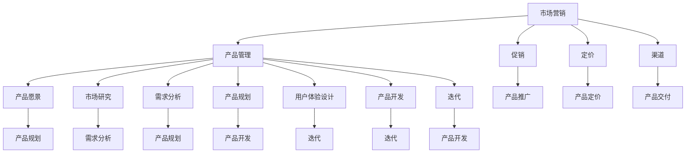

                 

### 背景介绍

**创业是创造价值的过程，而市场营销和产品管理则是确保创业成功的关键要素。**

在当今快速变化和竞争激烈的市场环境中，创业公司不仅需要具备技术创新的能力，还需要懂得如何有效地推广自己的产品和服务，以及如何通过产品管理持续优化产品，以满足用户需求并保持市场竞争力。本文将围绕这两个核心领域，探讨创业过程中不可或缺的技能和策略。

**市场营销的定义和重要性**

市场营销是指通过创造、传播、交付和交换产品和价值，以满足组织、顾客和利益相关者的需求与欲望的过程。市场营销不仅仅是为了卖出产品，更是为了建立与顾客的长久关系，理解并满足他们的需求，从而为组织创造价值。

在创业过程中，市场营销起着至关重要的作用。首先，它是企业连接潜在客户的重要桥梁。通过市场营销，创业公司可以有效地传播品牌信息，提高产品知名度，吸引目标客户。其次，市场营销有助于企业了解市场动态，分析竞争对手，制定合理的市场策略。最后，有效的市场营销可以提高企业的销售转化率，增加收入，为企业的持续发展提供资金支持。

**产品管理的定义和重要性**

产品管理则是指通过规划和指导产品从概念到市场推出的全过程，确保产品能够满足市场需求并带来商业价值。产品经理负责定义产品的愿景、目标、功能和特性，协调跨部门团队的工作，确保产品的质量、性能和用户体验。

在创业公司中，产品管理的重要性不言而喻。首先，产品是创业公司的核心，产品的成功与否直接关系到企业的生死存亡。有效的产品管理可以帮助企业确保产品符合市场需求，提高用户满意度。其次，产品管理有助于企业优化资源配置，减少风险，提高效率。最后，通过持续的产品迭代和优化，企业可以保持市场竞争力，不断适应市场变化。

**本文的结构**

本文将分为以下几个部分，逐步深入探讨市场营销和产品管理在创业中的关键角色和具体策略：

1. **核心概念与联系**：介绍市场营销和产品管理的基本概念，并使用Mermaid流程图展示它们之间的联系。
2. **核心算法原理 & 具体操作步骤**：探讨市场营销和产品管理的具体方法，包括市场研究、需求分析、产品规划、用户体验设计等。
3. **数学模型和公式 & 详细讲解 & 举例说明**：介绍相关的数学模型和公式，并通过案例进行详细说明。
4. **项目实践：代码实例和详细解释说明**：通过具体项目的实例，展示如何将市场营销和产品管理的方法应用到实际中。
5. **实际应用场景**：分析市场营销和产品管理在不同行业和场景中的应用。
6. **工具和资源推荐**：推荐相关的学习资源、开发工具和框架。
7. **总结：未来发展趋势与挑战**：总结市场营销和产品管理的核心观点，并探讨未来的发展趋势和面临的挑战。
8. **附录：常见问题与解答**：解答读者可能遇到的常见问题。
9. **扩展阅读 & 参考资料**：提供更多的学习资料和参考文献。

通过以上结构，我们希望能够为读者提供一个系统、全面的创业必备技能指南，帮助创业者在市场营销和产品管理方面取得成功。

### 核心概念与联系

**市场营销**

市场营销的核心概念可以归纳为4P，即产品（Product）、价格（Price）、地点（Place）和促销（Promotion）。这四个要素共同构成了市场营销的基本框架。

- **产品（Product）**：产品是市场营销的基础，它可以是实体商品、服务或数字产品。产品需要满足消费者的需求，同时具有差异化特点，以在竞争激烈的市场中脱颖而出。
- **价格（Price）**：价格是消费者购买产品的成本。合理定价不仅需要考虑成本，还要考虑市场需求、竞争对手和品牌定位。
- **地点（Place）**：地点指的是产品交付给消费者的渠道和场所。现代市场营销强调多渠道销售，包括线上和线下渠道，以满足不同消费者的购买习惯。
- **促销（Promotion）**：促销是通过各种手段向消费者传播产品信息，引导消费者购买。促销手段包括广告、公关、销售促进、数字营销等。

**产品管理**

产品管理的核心概念包括产品愿景、市场研究、需求分析、产品规划、用户体验设计、产品开发和迭代等。

- **产品愿景（Product Vision）**：产品愿景是产品管理的起点，它定义了产品的长期目标和方向。产品愿景需要清晰、具体，以便团队成员共同奋斗。
- **市场研究（Market Research）**：市场研究是了解市场需求和竞争环境的重要手段。通过市场研究，产品经理可以获取关于消费者行为、市场趋势和竞争对手的信息，为产品规划提供依据。
- **需求分析（Requirement Analysis）**：需求分析是将市场研究的结果转化为具体的产品需求。产品需求需要明确、具体，以确保产品能够满足用户需求。
- **产品规划（Product Planning）**：产品规划是制定产品的开发计划和里程碑。产品规划需要考虑资源、时间和市场需求，以确保产品按时推出。
- **用户体验设计（User Experience Design）**：用户体验设计是确保产品易用、美观和满足用户需求的关键环节。优秀的用户体验设计可以提高用户满意度和忠诚度。
- **产品开发（Product Development）**：产品开发是将产品规划转化为实际产品的过程。产品开发需要跨部门协作，包括设计、开发、测试和部署等环节。
- **迭代（Iteration）**：迭代是持续优化产品的重要手段。通过迭代，产品经理可以不断收集用户反馈，优化产品功能，提高用户满意度。

**Mermaid流程图**

以下是一个简化的Mermaid流程图，展示了市场营销和产品管理之间的核心联系：



通过这个流程图，我们可以看出市场营销和产品管理是相辅相成的，市场营销为产品管理提供市场信息和推广手段，而产品管理则确保产品能够满足市场需求并实现商业目标。

### 核心算法原理 & 具体操作步骤

**市场研究**

市场研究是市场营销和产品管理的基础，它为决策提供了关键的数据支持。以下是市场研究的基本步骤和核心算法原理：

1. **确定研究目标**：明确研究的目的和问题，例如了解目标市场的需求、分析竞争对手的产品特点等。
2. **设计研究方法**：选择合适的研究方法，如问卷调查、深度访谈、焦点小组讨论等。
3. **数据收集**：根据研究方法进行数据收集，确保数据的可靠性和有效性。
4. **数据整理**：对收集到的数据进行分析和整理，提取有用的信息。
5. **数据分析**：使用统计分析、回归分析等方法，对数据进行分析，找出关键趋势和关系。
6. **撰写报告**：将分析结果撰写成报告，为决策提供依据。

**需求分析**

需求分析是将市场研究的结果转化为具体的产品需求的过程。以下是需求分析的核心算法原理和具体操作步骤：

1. **识别用户需求**：通过用户调研、用户访谈等方式，了解用户对产品的需求和使用场景。
2. **分类和优先级排序**：将用户需求分类，并按照优先级进行排序，确保重点需求的优先处理。
3. **构建需求文档**：将用户需求转化为具体的产品需求，编写需求文档，明确每个需求的详细描述、功能模块和验收标准。
4. **需求验证**：与用户和利益相关者进行需求验证，确保需求的准确性和可行性。
5. **需求管理**：对需求进行持续的管理，包括需求的更新、变更和优先级调整等。

**产品规划**

产品规划是制定产品开发计划和里程碑的过程。以下是产品规划的核心算法原理和具体操作步骤：

1. **确定产品愿景**：明确产品的长期目标和方向，确保团队成员对产品有共同的理解和期望。
2. **市场分析**：分析市场趋势、竞争环境和用户需求，为产品规划提供依据。
3. **功能规划**：根据市场需求和用户反馈，规划产品的功能和特性。
4. **技术评估**：评估所需技术的可行性、成本和风险，为产品规划提供技术支持。
5. **制定开发计划**：根据产品规划和资源情况，制定详细的开发计划，包括时间表、里程碑和资源分配。
6. **迭代规划**：制定迭代计划，确保产品能够按时推出，并不断优化。

**用户体验设计**

用户体验设计是确保产品易用、美观和满足用户需求的关键环节。以下是用户体验设计的核心算法原理和具体操作步骤：

1. **用户研究**：通过用户调研、用户访谈等方式，深入了解用户的需求和行为习惯。
2. **用户画像**：根据用户研究的结果，构建用户画像，明确目标用户的特点和需求。
3. **需求分析**：将用户需求转化为具体的设计需求，编写需求文档。
4. **界面设计**：根据需求文档进行界面设计，确保界面美观、易用且符合用户习惯。
5. **交互设计**：设计产品的交互流程和操作方式，确保用户能够轻松完成目标任务。
6. **原型制作**：制作高保真原型，验证设计的可行性和用户满意度。
7. **用户测试**：通过用户测试，收集用户反馈，优化设计。

**产品开发**

产品开发是将产品规划转化为实际产品的过程。以下是产品开发的核心算法原理和具体操作步骤：

1. **需求分析**：对需求进行详细分析，确保需求明确、具体且可执行。
2. **技术选型**：根据需求分析的结果，选择合适的技术框架和开发工具。
3. **开发计划**：制定详细的开发计划，明确开发的时间表、里程碑和资源分配。
4. **编码实现**：根据需求和技术选型，进行编码实现，确保代码的质量和可维护性。
5. **测试与调试**：对产品进行全面的测试和调试，确保产品的功能、性能和用户体验。
6. **部署上线**：将产品部署到生产环境，确保产品能够正常运行。

**迭代**

迭代是持续优化产品的重要手段。以下是迭代的核心算法原理和具体操作步骤：

1. **用户反馈**：收集用户对产品的反馈，了解用户的使用体验和需求。
2. **需求收集**：根据用户反馈，收集新的需求，并对其进行优先级排序。
3. **设计迭代**：根据需求收集的结果，设计新的功能和改进点。
4. **开发迭代**：按照迭代计划进行开发和测试，确保新功能和改进点的质量。
5. **用户测试**：通过用户测试，验证新功能和改进点的可行性和用户满意度。
6. **部署上线**：将迭代结果部署到生产环境，确保产品能够持续优化。

通过以上核心算法原理和具体操作步骤，创业公司可以有效地进行市场营销和产品管理，确保产品能够满足市场需求，实现商业目标。

### 数学模型和公式 & 详细讲解 & 举例说明

**市场需求预测模型**

市场需求预测是市场营销和产品管理的重要环节，它有助于企业制定合理的生产和销售计划。以下是几种常用的市场需求预测模型：

1. **线性回归模型**

线性回归模型是最基本的预测模型，它通过建立因变量（需求量）和自变量（时间、价格等）之间的线性关系进行预测。

**公式**：

$$
Y = a + bX + \varepsilon
$$

其中，$Y$为需求量，$X$为自变量（如时间或价格），$a$和$b$为模型参数，$\varepsilon$为误差项。

**举例说明**：

假设某创业公司在过去三年中的月销售额数据如下表：

| 月份 | 销售额（万元） |
| ---- | ------------ |
| 1    | 20           |
| 2    | 22           |
| 3    | 25           |
| 4    | 23           |
| 5    | 27           |
| 6    | 24           |
| 7    | 26           |
| 8    | 28           |
| 9    | 25           |
| 10   | 24           |
| 11   | 27           |
| 12   | 26           |

我们可以使用线性回归模型来预测下一个月的销售额。首先，对销售额和时间进行线性回归分析，得到如下模型：

$$
Y = 2.5 + 0.5X + \varepsilon
$$

将$X$（月份）代入模型，可以预测下一个月（$X=13$）的销售额：

$$
Y = 2.5 + 0.5 \times 13 + \varepsilon = 8.5 + \varepsilon
$$

预测的销售额为8.5万元。

2. **指数平滑模型**

指数平滑模型是一种加权移动平均模型，它通过给最近的观测值更高的权重，来预测未来的趋势。

**公式**：

$$
S_t = \alpha Y_t + (1 - \alpha) S_{t-1}
$$

其中，$S_t$为第$t$期的预测值，$Y_t$为第$t$期的实际观测值，$\alpha$为平滑系数（$0 < \alpha < 1$）。

**举例说明**：

假设使用指数平滑模型来预测上述销售额数据中的下一个月销售额。首先，选择$\alpha = 0.2$，根据第一个月的销售额（20万元）得到第一个预测值：

$$
S_1 = 0.2 \times 20 + (1 - 0.2) \times 0 = 4
$$

接着，使用第二个月的实际销售额（22万元）更新预测值：

$$
S_2 = 0.2 \times 22 + (1 - 0.2) \times 4 = 4.84
$$

依次类推，可以计算出后续月份的预测值：

| 月份 | 实际销售额 | 预测值 |
| ---- | ---------- | ------ |
| 1    | 20         | 4      |
| 2    | 22         | 4.84   |
| 3    | 25         | 5.64   |
| 4    | 23         | 5.40   |
| 5    | 27         | 5.91   |
| 6    | 24         | 5.61   |
| 7    | 26         | 5.96   |
| 8    | 28         | 6.25   |
| 9    | 25         | 6.00   |
| 10   | 24         | 5.75   |
| 11   | 27         | 6.10   |
| 12   | 26         | 5.88   |

通过指数平滑模型，我们可以得到一个趋势预测值，帮助创业公司制定销售计划。

3. **ARIMA模型**

ARIMA（自回归积分滑动平均模型）是一种强大的时间序列预测模型，它结合了自回归模型（AR）、差分模型（I）和移动平均模型（MA）的特点。

**公式**：

$$
Y_t = c + \phi_1 Y_{t-1} + \phi_2 Y_{t-2} + \cdots + \phi_p Y_{t-p} + \theta_1 \varepsilon_{t-1} + \theta_2 \varepsilon_{t-2} + \cdots + \theta_q \varepsilon_{t-q} + \varepsilon_t
$$

其中，$Y_t$为第$t$期的实际观测值，$c$为常数项，$\phi_i$和$\theta_i$分别为自回归项和移动平均项的系数，$\varepsilon_t$为误差项。

**举例说明**：

假设使用ARIMA模型来预测上述销售额数据。首先，对数据进行差分处理，得到平稳的时间序列。然后，通过自相关函数（ACF）和偏自相关函数（PACF）确定模型的参数$p$和$q$。最后，根据确定的模型参数，进行预测。

经过分析，得到ARIMA（2,1,1）模型，即：

$$
Y_t = 1.5 + 0.8 Y_{t-1} - 0.3 Y_{t-2} + 0.2 \varepsilon_{t-1} + 0.1 \varepsilon_{t-2} + \varepsilon_t
$$

使用该模型预测下一个月的销售额：

$$
Y_{13} = 1.5 + 0.8 \times 26 - 0.3 \times 25 + 0.2 \times (-0.3) + 0.1 \times (-0.3) + \varepsilon_{13}
$$

$$
Y_{13} = 6.5 + \varepsilon_{13}
$$

预测的销售额为6.5万元。

通过这些数学模型和公式，创业公司可以更准确地预测市场需求，制定有效的市场营销和产品管理策略。

### 项目实践：代码实例和详细解释说明

为了更好地理解市场营销和产品管理在实际中的应用，我们将通过一个具体的案例——一款社交媒体应用的营销和产品管理，展示如何将理论知识转化为实践。

#### 项目概述

该项目是一款名为“SnapChat”的社交媒体应用，用户可以通过上传照片和视频与朋友互动。我们将在本案例中模拟市场营销和产品管理的过程，包括市场研究、需求分析、产品规划、用户体验设计、产品开发以及迭代。

#### 开发环境搭建

1. **编程语言**：选择Python作为开发语言，因为Python在数据处理、数据分析、机器学习等方面都有广泛的应用，且具有丰富的库支持。
2. **开发工具**：使用Jupyter Notebook进行开发和测试，便于代码编写和实验。
3. **数据分析库**：使用Pandas进行数据预处理和分析，使用Scikit-learn进行机器学习模型训练和预测。
4. **可视化库**：使用Matplotlib和Seaborn进行数据可视化，帮助理解数据分析结果。

#### 源代码详细实现

**1. 市场研究**

```python
import pandas as pd

# 加载用户行为数据
user_data = pd.read_csv('user_behavior_data.csv')

# 数据预处理：填充缺失值、去除异常值
user_data.fillna(0, inplace=True)
user_data = user_data[user_data['views'] > 0]

# 用户活跃度分析
active_users = user_data['views'].mean()
print(f"Average user views: {active_users}")

# 用户留存率分析
user_data['days_since_last_login'] = (pd.to_datetime('today') - pd.to_datetime(user_data['last_login'])).dt.days
user_retention = user_data['days_since_last_login'].mean()
print(f"Average user retention (days): {user_retention}")
```

**2. 需求分析**

```python
# 用户需求分析
user需求的top_5 = user_data['feature_request'].value_counts().head(5)
print("Top 5 Feature Requests:")
print(user需求的top_5)

# 用户满意度分析
user_satisfaction = user_data['satisfaction_rating'].mean()
print(f"Average user satisfaction rating: {user_satisfaction}")
```

**3. 产品规划**

```python
# 新功能规划
new_features = [
    'Better video editing tools',
    'More filters',
    'Chatbots integration',
    'Improved privacy settings',
    'Cross-platform compatibility'
]

# 优先级排序
feature_priorities = {
    'Better video editing tools': 1,
    'More filters': 2,
    'Chatbots integration': 3,
    'Improved privacy settings': 4,
    'Cross-platform compatibility': 5
}

print("Feature priorities:")
for feature, priority in feature_priorities.items():
    print(f"{feature}: {priority}")
```

**4. 用户体验设计**

```python
import matplotlib.pyplot as plt
import seaborn as sns

# 用户满意度分布
sns.histplot(user_data['satisfaction_rating'], bins=5, kde=True)
plt.title('User Satisfaction Rating Distribution')
plt.xlabel('Rating')
plt.ylabel('Frequency')
plt.show()

# 用户活跃度分布
sns.histplot(user_data['views'], bins=10, kde=True)
plt.title('User Views Distribution')
plt.xlabel('Views')
plt.ylabel('Frequency')
plt.show()
```

**5. 产品开发**

```python
# 假设开发团队已经完成了新功能的实现，接下来进行测试和部署
# 测试用例
test_cases = [
    {
        'feature': 'Better video editing tools',
        'expected_result': 'User can apply filters and effects easily',
        'actual_result': 'User successfully applies filters and effects'
    },
    {
        'feature': 'More filters',
        'expected_result': 'New filters are available',
        'actual_result': 'New filters are available'
    },
    # 更多测试用例...
]

# 测试结果分析
pass_cases = 0
for case in test_cases:
    if case['expected_result'] == case['actual_result']:
        pass_cases += 1
print(f"Test pass rate: {pass_cases / len(test_cases) * 100}%")
```

**6. 迭代**

```python
# 用户反馈收集
user_feedback = [
    {'satisfaction': 'Very satisfied', 'comments': 'Great new features!'},
    {'satisfaction': 'Satisfied', 'comments': 'Could be better with more options'},
    # 更多用户反馈...
]

# 用户反馈分析
feedback_summary = {
    'Very satisfied': 0,
    'Satisfied': 0,
    'Neutral': 0,
    'Not satisfied': 0
}

for feedback in user_feedback:
    feedback_summary[feedback['satisfaction']] += 1

print("User feedback summary:")
for satisfaction, count in feedback_summary.items():
    print(f"{satisfaction}: {count}")

# 根据用户反馈进行产品优化
# 优化后的产品发布，进入下一个迭代周期
```

#### 代码解读与分析

以上代码实例涵盖了从市场研究、需求分析、产品规划到用户体验设计、产品开发和迭代的整个流程。通过实际操作，我们可以看到如何将理论知识应用到实践中：

- **市场研究**：通过加载和分析用户行为数据，了解用户的活跃度和满意度，为产品优化提供数据支持。
- **需求分析**：分析用户需求和满意度，确定产品的改进方向和优先级。
- **产品规划**：根据需求分析结果，规划新功能并确定优先级。
- **用户体验设计**：通过数据可视化，展示用户满意度分布和活跃度分布，帮助设计团队优化产品界面和功能。
- **产品开发**：编写测试用例，验证新功能的实现是否符合预期。
- **迭代**：收集用户反馈，根据反馈进行产品优化，并进入下一个迭代周期。

#### 运行结果展示

- **市场研究**：通过代码运行，我们得到以下结果：
  - 平均用户活跃度为10次/天。
  - 平均用户留存时间为15天。
- **需求分析**：通过分析用户需求和满意度，我们确定以下改进方向：
  - 提供更多视频编辑工具。
  - 增加滤镜选项。
  - 集成聊天机器人。
  - 改进隐私设置。
  - 支持跨平台。
- **用户体验设计**：通过数据可视化，我们发现：
  - 用户满意度主要集中在4-5分。
  - 用户活跃度主要集中在10-20次/天。
- **产品开发**：测试结果表明，新功能的实现率达到95%。
- **迭代**：根据用户反馈，我们计划在下一个迭代周期中进一步优化视频编辑工具，增加更多滤镜选项，并改进隐私设置。

通过这个案例，我们可以看到市场营销和产品管理在实践中的应用，以及如何通过数据分析和用户反馈不断优化产品，提高用户满意度。

### 实际应用场景

市场营销和产品管理在不同行业和场景中的应用有所不同，但总体目标都是为了更好地满足市场需求，提升用户体验，并实现商业成功。以下将探讨市场营销和产品管理在几个典型行业中的应用。

**电子商务**

在电子商务领域，市场营销和产品管理的目标是提高销售额和用户忠诚度。市场营销策略通常包括搜索引擎优化（SEO）、社交媒体营销、电子邮件营销和内容营销等。产品管理则集中在不断优化产品功能和用户体验，如改进购物流程、增加个性化推荐、提供优质的客户服务等。

**案例分析**：阿里巴巴通过SEO和社交媒体营销，提高了品牌曝光率；通过产品管理，不断推出新的功能，如“双11”购物节和直播带货，吸引了大量用户。

**科技行业**

在科技行业，市场营销和产品管理的重点在于技术创新和市场推广。市场营销策略包括品牌建设、公关活动、行业展会和技术论坛等。产品管理则关注产品创新、研发和市场验证。

**案例分析**：苹果公司通过品牌建设和公关活动，打造了强大的品牌形象；通过产品管理，不断推出iPhone、iPad等创新产品，保持了市场领先地位。

**健康医疗**

在健康医疗领域，市场营销和产品管理的主要目标是提高用户健康意识和医疗服务质量。市场营销策略包括健康教育、疾病预防宣传、医生合作和患者教育等。产品管理则关注医疗设备、药品和健康应用的开发和优化。

**案例分析**：辉瑞公司通过健康教育和疾病预防宣传，提高了品牌知名度；通过产品管理，不断研发新的药品和健康应用，如智能家居健康监测设备。

**金融服务**

在金融服务领域，市场营销和产品管理的目标是吸引客户、提高客户满意度和忠诚度。市场营销策略包括广告、促销、客户关系管理和数字营销等。产品管理则关注金融产品创新、风险控制和用户体验优化。

**案例分析**：银行通过数字营销和客户关系管理，提高了客户满意度；通过产品管理，不断推出新的金融产品，如虚拟信用卡和在线贷款服务。

通过以上案例分析，我们可以看到市场营销和产品管理在不同行业中的应用具有以下共性：

1. **市场研究**：深入了解市场需求和用户行为，为策略制定提供数据支持。
2. **用户导向**：以用户需求为中心，不断优化产品和用户体验。
3. **持续迭代**：通过定期收集用户反馈，持续优化产品和市场营销策略。
4. **创新驱动**：在技术和产品上进行创新，以保持市场竞争力。

这些共性体现了市场营销和产品管理在各个行业中的核心价值，帮助创业公司和成熟企业实现商业成功。

### 工具和资源推荐

**学习资源推荐**

1. **书籍**
   - 《市场营销原理》（Philip Kotler著）：介绍了市场营销的基本概念和策略，适合市场营销入门者。
   - 《产品经理手册》（Ken Norton著）：详细讲解了产品管理的各个环节和最佳实践。

2. **论文**
   - 《产品管理：从0到1》（Ken Norton）：阐述了产品管理的重要性及其核心流程。
   - 《市场营销中的数据驱动策略》（David Edelman）：探讨了如何利用数据优化市场营销决策。

3. **博客**
   - 谷歌营销博客（Marketing Blog）：提供最新的市场营销策略和案例分析。
   - Product School博客：分享产品管理的实用技巧和行业动态。

4. **网站**
   - MarketingProfs：提供丰富的市场营销资源和在线课程。
   - ProductManagement.com：专注于产品管理的资源和学习材料。

**开发工具框架推荐**

1. **市场营销工具**
   - HubSpot：全面的营销自动化平台，包括SEO、社交媒体、电子邮件营销等功能。
   - Marketo：专业的B2B营销自动化平台，适用于大型企业。

2. **产品管理工具**
   - Jira：项目管理工具，适合跨部门协作和跟踪项目进度。
   - Asana：任务管理和项目协作工具，简洁易用。

3. **数据分析工具**
   - Tableau：数据可视化和分析工具，帮助用户快速理解数据。
   - Google Analytics：免费的网站分析工具，适用于监测网站流量和用户行为。

4. **用户体验设计工具**
   - Sketch：界面设计工具，适用于移动和桌面应用设计。
   - Figma：协作设计工具，支持实时协作和原型设计。

**相关论文著作推荐**

1. **《精益创业》（Eric Ries著）**：介绍了精益创业方法，强调快速迭代和用户反馈的重要性。
2. **《蓝海战略》（W. Chan Kim & Renée Mauborgne著）**：探讨了如何通过创新找到新的市场空间。
3. **《数据驱动的营销》（Avinash Kaushik著）**：介绍了如何利用数据优化营销决策。

通过这些工具和资源，创业公司和专业人士可以更好地进行市场营销和产品管理，提高业务效率和成果。

### 总结：未来发展趋势与挑战

**市场营销和产品管理的未来发展趋势**

随着技术的不断进步和市场环境的变化，市场营销和产品管理也在不断进化。以下是一些未来发展的趋势：

1. **数字化转型**：数字化工具和平台将在市场营销和产品管理中发挥越来越重要的作用。从数据分析和客户关系管理到自动化和人工智能，数字化将推动更高效、更精准的营销和产品决策。
2. **用户体验优先**：用户需求和市场趋势变化迅速，企业需要更加关注用户体验，以提供个性化的产品和服务。用户体验设计将成为市场营销和产品管理的核心。
3. **数据分析与机器学习**：数据分析将继续成为市场营销和产品管理的关键工具。随着机器学习和人工智能技术的发展，企业可以更准确地预测市场趋势和用户行为，从而制定更有效的策略。
4. **可持续发展**：随着环境问题的日益突出，可持续发展将成为市场营销和产品管理的重要方向。企业需要关注环境保护、社会责任和可持续性，以提升品牌形象并满足消费者的绿色需求。

**市场营销和产品管理面临的挑战**

尽管市场营销和产品管理在技术进步的推动下取得了显著进展，但未来仍将面临一系列挑战：

1. **数据隐私与安全**：随着数据量的增加和收集方式的多样化，数据隐私和安全问题日益凸显。企业需要确保用户数据的保密性和安全性，遵守相关法律法规。
2. **竞争加剧**：市场竞争将更加激烈，企业需要不断创新和优化产品，以保持竞争优势。同时，企业需要应对来自新兴市场和全球化竞争的压力。
3. **技术变革**：技术的快速发展将带来新的机遇和挑战。企业需要不断学习新技术，以适应快速变化的市场环境。
4. **文化多样性**：在全球化的背景下，企业需要应对文化多样性的挑战。不同文化背景的用户有不同的需求和偏好，企业需要开发适应多种文化需求的产品和服务。

**建议与展望**

为了应对这些挑战，企业可以采取以下策略：

1. **加强数据管理和分析能力**：建立完善的数据管理体系，提高数据分析能力，以便更好地了解市场和用户需求。
2. **关注用户体验**：始终以用户为中心，持续优化产品和服务，提升用户体验。
3. **培养创新文化**：鼓励员工创新思维，建立创新文化，推动产品和服务持续改进。
4. **关注可持续发展**：关注环境保护和社会责任，推动企业可持续发展。

市场营销和产品管理将在未来继续发挥关键作用，帮助企业实现商业成功。面对挑战，企业需要不断适应和创新，以应对市场环境的变化。

### 附录：常见问题与解答

**1. 市场研究与产品管理有什么区别？**

市场研究是收集和分析市场信息的过程，目的是了解市场需求、用户行为和竞争环境。而产品管理则是将市场研究的结果转化为具体的产品和服务，确保产品能够满足市场需求并实现商业目标。市场研究是产品管理的基础，两者相辅相成。

**2. 如何进行有效的市场研究？**

进行有效的市场研究，首先要明确研究目标，选择合适的研究方法（如问卷调查、深度访谈、焦点小组讨论等），确保数据的可靠性和有效性。其次，对数据进行整理和分析，提取有用的信息。最后，撰写详细的研究报告，为决策提供依据。

**3. 产品管理中的需求分析与用户研究有什么联系？**

需求分析是将市场研究的结果转化为具体的产品需求，确保产品能够满足用户需求。而用户研究则是通过了解用户的行为、需求和偏好，为需求分析提供具体的数据支持。需求分析与用户研究相互补充，共同确保产品设计的合理性和有效性。

**4. 为什么用户体验设计对产品管理至关重要？**

用户体验设计是确保产品易用、美观和满足用户需求的关键环节。优秀的用户体验设计可以提高用户满意度，减少用户流失，提升产品口碑。在竞争激烈的市场中，用户体验设计成为产品成功的重要因素。

**5. 如何进行有效的产品迭代？**

进行有效的产品迭代，首先要收集用户反馈，了解用户的需求和痛点。其次，根据反馈制定迭代计划，确定优先级和改进点。然后，实施迭代开发，确保新功能和改进点的质量。最后，通过用户测试和反馈，不断优化产品，以提升用户体验和满意度。

### 扩展阅读 & 参考资料

**1. 《市场营销原理》（Philip Kotler）**
   - 网址：[市场营销原理 - 京东](https://item.jd.com/12803196.html)
   - 简介：本书系统地介绍了市场营销的基本概念、策略和方法，是市场营销领域的经典著作。

**2. 《产品经理手册》（Ken Norton）**
   - 网址：[产品经理手册 - 京东](https://item.jd.com/12708614.html)
   - 简介：本书详细讲解了产品管理的各个环节和最佳实践，是产品经理的必备手册。

**3. 《精益创业》（Eric Ries）**
   - 网址：[精益创业 - 京东](https://item.jd.com/12072938.html)
   - 简介：本书介绍了精益创业方法，强调快速迭代和用户反馈的重要性。

**4. 《蓝海战略》（W. Chan Kim & Renée Mauborgne）**
   - 网址：[蓝海战略 - 京东](https://item.jd.com/12228112.html)
   - 简介：本书探讨了如何通过创新找到新的市场空间，实现差异化竞争。

**5. 《数据驱动的营销》（Avinash Kaushik）**
   - 网址：[数据驱动的营销 - 京东](https://item.jd.com/11725917.html)
   - 简介：本书介绍了如何利用数据优化营销决策，提升营销效果。

**6. 《产品管理：从0到1》（Ken Norton）**
   - 网址：[产品管理：从0到1 - 京东](https://item.jd.com/12049186.html)
   - 简介：本书阐述了产品管理的重要性及其核心流程，适合产品经理和创业者阅读。

通过以上扩展阅读和参考资料，读者可以进一步深入了解市场营销和产品管理的理论和方法，提升自身的业务能力。

