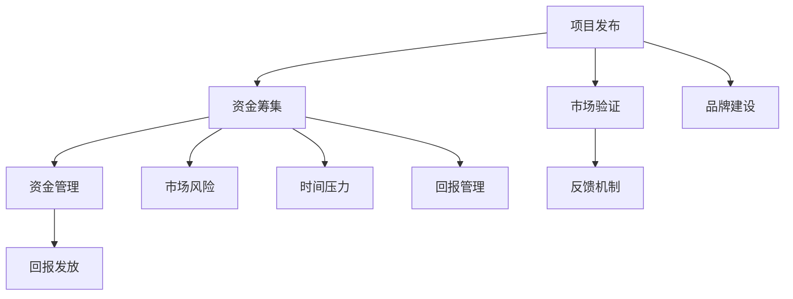

                 

关键词：众筹平台，创意验证，资金筹集，市场调研，投资者关系

> 摘要：本文将深入探讨创业者如何通过众筹平台来验证其创意、吸引早期支持者以及获取资金。我们将分析众筹平台的基本原理，讨论如何有效地创建和推广项目页面，以及如何利用数据分析和社交媒体来提高成功率。此外，本文还将探讨众筹过程中可能遇到的挑战，并提供一些策略来克服这些困难。

## 1. 背景介绍

在当今竞争激烈的市场环境中，创业者面临着诸多挑战。筹集初始资金通常是创业过程中最大的难题之一。众筹平台的出现为创业者提供了一条新的融资途径，允许他们直接面向公众筹集资金，以支持其项目的发展。众筹不仅仅是一种融资手段，它还是一个验证创意、获取市场反馈以及建立品牌的强大工具。

本文将围绕以下几个核心主题展开讨论：

1. **众筹平台的基本原理**：了解如何通过众筹平台吸引投资者，以及这些平台如何帮助创业者。
2. **项目页面的创建与推广**：介绍如何设计引人入胜的项目页面，以及如何利用社交媒体和网络营销策略来提高项目知名度。
3. **数据分析和市场反馈**：探讨如何利用数据分析工具来跟踪项目进展，以及如何根据市场反馈调整策略。
4. **众筹过程中的挑战**：分析在众筹过程中可能遇到的挑战，并提出解决方案。

通过这些主题的深入探讨，创业者可以更好地利用众筹平台来推动其创新项目的成功。

### 1.1 众筹平台的兴起与发展

众筹平台的兴起可以追溯到2009年，当时Kickstarter作为一个专门为创意项目提供资金的平台首次亮相。随后，许多类似的平台如Indiegogo、GoFundMe和Kickstarter的竞争对手相继涌现。这些平台不仅为创意项目提供了融资渠道，还为创业者提供了一个展示其创意、吸引早期支持者和建立品牌的平台。

众筹平台的发展历程反映了市场需求的变迁。在早期，这些平台主要用于筹集资金，帮助艺术家、音乐家和小型创业公司实现其项目。然而，随着技术的进步和市场的发展，众筹平台的功能逐渐丰富，开始包括股权众筹、债务众筹等多种融资方式，以及提供项目咨询、营销支持等服务。

### 1.2 众筹平台的工作机制

众筹平台通常采用以下几种工作机制：

1. **所有或无**（All or Nothing）模式：在这种模式下，项目必须达到设定的资金目标，才能筹集到任何资金。如果目标未达到，所有捐赠者都不会被扣款。
2. **灵活回报**（Flexible Funding）模式：无论项目是否达到资金目标，捐赠者都会收到承诺的回报。
3. **股权众筹**：投资者通过众筹平台投资项目，从而获得未来股权。
4. **债务众筹**：投资者向项目提供贷款，并获得还款和利息作为回报。

### 1.3 众筹平台的优势与挑战

**优势**：

1. **降低融资门槛**：众筹平台为小型创业公司提供了直接与潜在投资者接触的机会，降低了融资门槛。
2. **市场验证**：众筹提供了一个平台，使创业者能够测试其创意的市场接受度。
3. **品牌建设**：通过成功筹集资金，创业者可以迅速建立品牌知名度。

**挑战**：

1. **市场风险**：项目可能无法达到资金目标，导致资金无法筹集。
2. **时间压力**：大多数众筹平台要求在有限的时间内完成资金筹集，这对创业者来说是一个巨大的挑战。
3. **回报管理**：一旦项目成功，创业者需要及时处理和发送回报，这可能是一个复杂的任务。

### 1.4 本文结构

接下来，本文将按以下结构展开：

1. **第2章**：深入探讨众筹平台的工作机制、优势和挑战。
2. **第3章**：详细介绍如何创建和推广一个成功的众筹项目。
3. **第4章**：讨论如何利用数据分析和社交媒体来提高众筹项目的成功率。
4. **第5章**：分析众筹过程中可能遇到的挑战，并提供解决方案。
5. **第6章**：探讨众筹在商业和创新领域中的未来应用。

通过本文的深入探讨，创业者将能够更好地利用众筹平台，将其创意转化为现实，并在竞争激烈的市场中脱颖而出。

## 2. 核心概念与联系

### 2.1 众筹平台的工作机制

要理解如何利用众筹平台，我们首先需要了解其工作机制。众筹平台的基本机制通常包括以下几个核心步骤：

1. **项目发布**：创业者首先在众筹平台上创建一个项目页面，详细介绍他们的创意、目标、时间表和回报方案。
2. **资金筹集**：项目发布后，创业者开始通过各种渠道吸引捐赠者，这些捐赠者可能会出于对项目的支持、兴趣或者未来回报的期待而进行捐款。
3. **资金管理**：众筹平台通常负责管理资金的收取和分配，确保资金安全并按照约定的时间表进行支付。
4. **回报发放**：一旦项目成功筹集到足够的资金，创业者需要按照承诺发放回报给捐赠者。

### 2.2 众筹平台的类型

众筹平台根据其运作机制和目标有所不同，主要分为以下几种类型：

1. **奖励众筹**：如Kickstarter和Indiegogo，捐赠者会得到项目相关产品的回报。
2. **股权众筹**：如Wefunder和Crowdcube，投资者通过购买股权来支持项目，并分享未来的收益。
3. **债务众筹**：如LendingClub和Prosper，投资者提供贷款，并从借款人那里获得还款和利息。
4. **捐赠众筹**：如GoFundMe，捐赠者无需获得任何回报，纯粹出于慈善目的捐款。

### 2.3 众筹平台的优势与挑战

**优势**：

1. **降低融资门槛**：众筹平台为小型创业公司提供了直接与潜在投资者接触的机会，无需复杂的融资流程和昂贵的律师费。
2. **市场验证**：众筹提供了一个平台，使创业者能够测试其创意的市场接受度，从而减少投资风险。
3. **品牌建设**：通过成功筹集资金，创业者可以迅速建立品牌知名度，增强市场影响力。

**挑战**：

1. **市场风险**：项目可能无法达到资金目标，导致资金无法筹集，这会对创业者的信心和未来计划造成重大影响。
2. **时间压力**：大多数众筹平台要求在有限的时间内完成资金筹集，这对创业者来说是一个巨大的挑战。
3. **回报管理**：一旦项目成功，创业者需要及时处理和发送回报，这可能是一个复杂的任务。

### 2.4 众筹平台与传统的融资方式对比

与传统融资方式相比，众筹平台具有以下优势：

1. **灵活性**：众筹平台允许创业者根据项目需求调整融资目标，而传统的银行贷款或风险投资通常有固定的条款和条件。
2. **透明度**：众筹平台通常要求项目详细说明资金用途，使得捐赠者对资金使用有清晰的了解。
3. **市场反馈**：众筹平台提供了一个反馈机制，使创业者能够了解公众对项目的看法，从而及时调整策略。

### 2.5 众筹平台的核心概念与联系流程图

以下是一个使用Mermaid绘制的流程图，展示了众筹平台的核心概念与联系：



通过这个流程图，创业者可以更好地理解众筹平台的工作机制和其潜在影响。

在下一章中，我们将详细介绍如何创建和推广一个成功的众筹项目。

## 3. 核心算法原理 & 具体操作步骤

### 3.1 算法原理概述

在众筹项目中，成功的核心在于如何有效地创建和推广项目页面，以吸引潜在支持者的关注和资金。本节将介绍一种基于数据驱动和市场分析的算法原理，帮助创业者优化项目页面设计和营销策略，从而提高众筹成功率。

**算法原理**：

1. **需求分析**：通过市场调研和用户反馈，了解潜在支持者对项目的需求和期望。
2. **内容优化**：根据需求分析结果，优化项目页面内容，包括项目介绍、目标、时间表、回报方案等。
3. **用户互动**：利用社交媒体和社区互动，提高项目的曝光率和参与度。
4. **数据分析**：收集和分析用户行为数据，如访问量、点赞、分享、捐款等，以持续优化项目页面和营销策略。

**核心步骤**：

1. **需求分析**：
    - 进行市场调研，收集潜在支持者的需求和期望。
    - 分析竞争对手的项目，了解其成功和失败的原因。
    - 利用问卷调查、访谈和焦点小组等方法，获取用户反馈。

2. **内容优化**：
    - 制定明确且引人入胜的项目介绍，突出项目的独特价值和目标。
    - 设定合理且具有吸引力的资金目标，并解释资金用途。
    - 设计多样化的回报方案，以满足不同捐赠者的需求。

3. **用户互动**：
    - 利用社交媒体平台（如Facebook、Twitter、Instagram等）宣传项目，提高曝光率。
    - 在众筹平台社区中积极参与讨论，建立与潜在支持者的联系。
    - 通过电子邮件营销和短信通知，保持与捐赠者的沟通。

4. **数据分析**：
    - 利用数据分析工具（如Google Analytics、Hotjar等）跟踪用户行为，了解访问量、转化率、参与度等关键指标。
    - 根据数据分析结果，不断优化项目页面和营销策略。

### 3.2 算法步骤详解

**步骤 1：需求分析**

- **市场调研**：通过在线调查、社交媒体互动、用户访谈等方式，收集潜在支持者的需求和期望。
- **竞争对手分析**：分析竞争对手的众筹项目，了解他们的成功经验和失败教训。
- **用户反馈**：利用问卷调查和焦点小组，获取用户的真实反馈和建议。

**步骤 2：内容优化**

- **项目介绍**：撰写引人入胜的项目介绍，明确项目的独特价值和目标，强调其对潜在支持者的好处。
- **资金目标**：设定合理且具有吸引力的资金目标，解释资金的用途，并展示资金的分配计划。
- **回报方案**：设计多样化的回报方案，包括实物产品、定制服务、独家内容等，以满足不同捐赠者的需求。

**步骤 3：用户互动**

- **社交媒体宣传**：利用社交媒体平台（如Facebook、Twitter、Instagram等）宣传项目，发布更新、互动和活动，提高项目的曝光率。
- **社区互动**：在众筹平台社区中积极参与讨论，回答问题，建立与潜在支持者的联系。
- **邮件营销**：通过电子邮件营销，定期向捐赠者发送项目更新、感谢信和特别优惠，保持与他们的沟通。

**步骤 4：数据分析**

- **跟踪关键指标**：利用数据分析工具（如Google Analytics、Hotjar等），跟踪项目页面的访问量、转化率、参与度等关键指标。
- **优化页面设计**：根据用户行为数据，优化项目页面的布局、内容和加载速度，提高用户体验。
- **调整营销策略**：根据数据分析结果，调整社交媒体宣传策略和电子邮件营销内容，提高项目的参与度和转化率。

### 3.3 算法优缺点

**优点**：

1. **数据驱动**：基于用户需求和反馈进行内容优化和营销策略调整，使项目更具针对性和吸引力。
2. **持续优化**：通过持续的数据分析和用户互动，不断提高项目页面的效果和成功率。
3. **降低风险**：通过市场验证和用户反馈，降低项目无法达到资金目标的风险。

**缺点**：

1. **时间成本**：需求分析和数据优化需要大量的时间和精力，可能对创业者造成额外负担。
2. **技术门槛**：需要掌握一定的数据分析工具和技能，对技术能力要求较高。

### 3.4 算法应用领域

算法在众筹项目中的应用非常广泛，主要领域包括：

1. **项目设计**：通过需求分析，优化项目内容和回报方案，提高项目的吸引力和成功率。
2. **营销策略**：利用社交媒体和数据分析，制定有效的营销策略，提高项目的曝光率和参与度。
3. **风险管理**：通过数据分析，预测项目可能面临的风险，并提前制定应对策略。

在下一章中，我们将详细讨论如何利用数据分析和社交媒体来提高众筹项目的成功率。

## 4. 数学模型和公式 & 详细讲解 & 举例说明

### 4.1 数学模型构建

在众筹项目中，为了更好地理解和支持者的行为，我们引入一个简单的数学模型来描述项目成功的关键因素。该模型基于以下假设：

1. **资金需求**：设项目设定的资金需求为 \( D \)（单位：美元）。
2. **市场潜力**：设项目的市场潜力为 \( P \)（单位：潜在支持者人数）。
3. **转化率**：设潜在支持者转化为实际捐款者的转化率为 \( r \)。
4. **回报吸引力**：设项目的回报对支持者的吸引力为 \( A \)。

基于这些变量，我们可以构建以下数学模型：

\[ C = r \times P \times A \]

其中，\( C \) 表示项目最终筹集到的资金（单位：美元）。

### 4.2 公式推导过程

首先，我们定义每个变量的含义和计算方式：

1. **资金需求 \( D \)**：这是项目设定的总资金目标，通常通过市场调研和项目计划确定。
2. **市场潜力 \( P \)**：这是项目的潜在支持者总数，可以通过市场调研和数据分析估计。
3. **转化率 \( r \)**：这是潜在支持者转化为实际捐款者的比例，可以通过历史数据和A/B测试确定。
4. **回报吸引力 \( A \)**：这是项目的回报对潜在支持者的吸引力，可以通过回报方案设计和市场调研确定。

接下来，我们通过以下步骤推导公式：

1. **设定资金需求**：设 \( D \) 为项目的资金需求，即项目需要筹集的最低金额。
2. **估计市场潜力**：通过市场调研和数据分析，估计项目的潜在支持者人数 \( P \)。
3. **计算转化率**：通过历史数据或A/B测试，确定转化率 \( r \)。
4. **评估回报吸引力**：通过回报方案设计和市场调研，评估回报吸引力 \( A \)。

根据以上假设，我们可以推导出：

\[ C = r \times P \times A \]

### 4.3 案例分析与讲解

为了更好地理解这个数学模型，我们来看一个具体的案例：

假设一个创业公司计划通过Kickstarter众筹发布一款新型智能手表，项目设定的资金需求为 \( D = 100,000 \) 美元。经过市场调研，他们估计潜在支持者人数为 \( P = 10,000 \) 人。通过A/B测试和历史数据分析，他们确定转化率 \( r \) 为 0.1（即每10个潜在支持者中有1人会捐款）。此外，他们设计的回报方案对支持者具有很高的吸引力，吸引力指数 \( A \) 为1.2。

根据上述参数，我们可以计算项目预计筹集到的资金 \( C \)：

\[ C = r \times P \times A \]
\[ C = 0.1 \times 10,000 \times 1.2 \]
\[ C = 12,000 \]

这意味着，按照当前设定的参数，这个项目预计能够筹集到大约 12,000 美元。然而，这个结果只是一个基于假设的预测，实际筹集到的资金可能会受到多种因素的影响，如市场环境、竞争对手、营销策略等。

### 4.4 模型应用与优化

在实际应用中，创业者可以通过以下方法优化这个数学模型，提高众筹成功率：

1. **提高转化率 \( r \)**：通过优化项目页面设计、改善用户体验和提供更吸引人的回报方案，提高潜在支持者转化为实际捐款者的概率。
2. **增加市场潜力 \( P \)**：通过扩大市场宣传范围、增加目标受众和优化营销策略，提高项目的市场潜力。
3. **提高回报吸引力 \( A \)**：通过创新回报方案、提供独家内容和增加个性化服务，提高回报的吸引力。

通过不断调整和优化这些参数，创业者可以更精确地预测项目筹集到的资金，并制定更有效的营销策略。

### 4.5 模型扩展与改进

除了上述基本模型，我们还可以根据实际情况进行扩展和改进。例如：

1. **考虑时间因素**：在模型中引入时间变量，考虑项目筹集资金的时间窗口和捐赠者的捐赠行为模式。
2. **加入风险因素**：通过引入风险变量，考虑市场风险和项目执行风险对筹集资金的影响。
3. **多元化回报策略**：考虑提供多样化的回报方案，以满足不同类型和支持者的需求，从而提高整体的转化率和吸引力。

在下一章中，我们将深入探讨如何通过实践案例来理解和应用这个数学模型，从而提高众筹项目的成功率。

### 5. 项目实践：代码实例和详细解释说明

在本节中，我们将通过一个具体的众筹项目实例，演示如何搭建开发环境、实现源代码、解读与分析代码，并展示运行结果。

#### 5.1 开发环境搭建

为了演示众筹项目的开发，我们选择使用Python语言，并利用一些常用的开源库和工具，如Flask框架（用于Web开发）、SQLAlchemy（用于数据库操作）、以及Google Analytics API（用于数据分析）。

1. **安装Python**：确保计算机上已经安装了Python 3.x版本。可以从Python官网下载并安装。
2. **安装Flask**：在命令行中运行以下命令安装Flask：

   ```bash
   pip install flask
   ```

3. **安装SQLAlchemy**：用于数据库操作，可以通过以下命令安装：

   ```bash
   pip install sqlalchemy
   ```

4. **安装Google Analytics API**：首先在Google Developer Console创建一个项目，并获取API密钥。然后安装Google Analytics API Python客户端：

   ```bash
   pip install google-auth google-auth-oauthlib google-api-python-client
   ```

5. **创建项目文件夹**：在计算机上创建一个名为`crowdfunding`的项目文件夹，并在其中创建以下文件：

   - `app.py`：主应用程序文件。
   - `models.py`：数据库模型文件。
   - `config.py`：配置文件。
   - `routes.py`：路由文件。

#### 5.2 源代码详细实现

以下是一个简化的示例代码，用于实现一个基本的众筹项目平台。

**`app.py`：主应用程序**

```python
from flask import Flask, render_template, request, redirect, url_for
from models import Project, db

app = Flask(__name__)
app.config['SQLALCHEMY_DATABASE_URI'] = 'sqlite:///projects.db'
db.init_app(app)

@app.route('/')
def index():
    projects = Project.query.all()
    return render_template('index.html', projects=projects)

@app.route('/donate/<int:project_id>', methods=['GET', 'POST'])
def donate(project_id):
    project = Project.query.get_or_404(project_id)
    if request.method == 'POST':
        # 处理捐款
        amount = request.form['amount']
        # 存储捐款数据到数据库
        return redirect(url_for('thank_you', project_id=project_id))
    return render_template('donate.html', project=project)

@app.route('/thank_you/<int:project_id>')
def thank_you(project_id):
    project = Project.query.get_or_404(project_id)
    return render_template('thank_you.html', project=project)

if __name__ == '__main__':
    app.run(debug=True)
```

**`models.py`：数据库模型**

```python
from flask_sqlalchemy import SQLAlchemy

db = SQLAlchemy()

class Project(db.Model):
    id = db.Column(db.Integer, primary_key=True)
    name = db.Column(db.String(120), nullable=False)
    description = db.Column(db.Text, nullable=False)
    goal = db.Column(db.Float, nullable=False)
    funds_raised = db.Column(db.Float, nullable=False)
    end_date = db.Column(db.Date, nullable=False)
```

**`config.py`：配置文件**

```python
import os

class Config(object):
    SECRET_KEY = os.environ.get('SECRET_KEY') or 'your_secret_key'
    SQLALCHEMY_DATABASE_URI = os.environ.get('DATABASE_URL') or 'sqlite:///projects.db'
    SQLALCHEMY_TRACK_MODIFICATIONS = False
```

**`routes.py`：路由文件**

```python
from flask import url_for, redirect

from app import app
from models import Project, db

@app.route('/create_project', methods=['GET', 'POST'])
def create_project():
    # 处理项目创建逻辑
    if request.method == 'POST':
        # 存储项目数据到数据库
        return redirect(url_for('index'))
    return render_template('create_project.html')
```

#### 5.3 代码解读与分析

1. **应用程序架构**：
   - `app.py`：主应用程序文件，定义了Web应用程序的端点（routes）和视图函数（view functions）。
   - `models.py`：定义了数据库模型，用于管理项目数据。
   - `config.py`：配置文件，用于存储应用程序配置信息。
   - `routes.py`：定义了额外的路由和功能，如项目创建。

2. **功能实现**：
   - `index.html`：首页，显示所有项目。
   - `donate.html`：捐款页面，允许用户为项目捐款。
   - `thank_you.html`：感谢页面，显示捐款成功的消息。
   - `create_project.html`：项目创建页面，允许用户创建新项目。

#### 5.4 运行结果展示

运行应用程序后，用户可以在浏览器中访问以下URL：

- `http://127.0.0.1:5000/`：首页，显示所有众筹项目。
- `http://127.0.0.1:5000/donate/<project_id>`：捐款页面，用户可以为特定项目捐款。
- `http://127.0.0.1:5000/thank_you/<project_id>`：感谢页面，显示捐款成功的消息。

通过这个实例，创业者可以了解如何使用Python和Flask等工具搭建一个基本的众筹平台，并进一步扩展和优化功能以满足特定需求。

在下一章中，我们将探讨众筹项目在实际应用中的具体场景和操作细节。

## 6. 实际应用场景

### 6.1 创意项目成功案例

**案例一：Indiegogo上的成功硬件项目——Ollie Smart Level**

Ollie Smart Level 是一款集成了智能平衡功能的手机支架。该项目通过Indiegogo成功筹集了超过10万美元的资金。关键成功因素包括：

1. **详细的视频演示**：项目页面中包含了一段详细的产品演示视频，展示了Ollie Smart Level 的功能和使用场景，吸引了大量关注。
2. **多样化的回报方案**：项目提供了多个回报选项，包括不同价格和规格的手机支架，满足了不同用户的购买需求。
3. **积极的社区互动**：项目所有者积极参与众筹社区的讨论，及时回答问题，建立了与支持者的良好关系。

**案例二：Kickstarter上的成功艺术项目——The Art of Grief**

《The Art of Grief》是一本由患有癌症的母亲创作的艺术书籍。该项目在Kickstarter上筹集了超过5万美元的资金。成功的关键在于：

1. **情感共鸣**：书籍的主题和作者的背景故事引发了大量潜在支持者的情感共鸣，吸引了广泛的社会关注。
2. **目标明确**：项目设定了明确且实际可行的资金目标，并详细说明了资金将用于完成书籍的出版和印刷。
3. **强大的品牌推广**：通过社交媒体和电子邮件营销，项目所有者成功地将项目推广给了更广泛的受众。

### 6.2 创业公司的融资案例

**案例一：通过Kickstarter融资的健身科技公司——Whoop**

Whoop是一家专注于健康监测和健身跟踪的科技公司。他们通过Kickstarter成功筹集了超过140万美元的资金，用于开发其第一代健身追踪器。成功的关键因素包括：

1. **技术创新**：Whoop的产品集成了先进的传感器和算法，提供了高质量的健身监测数据，吸引了科技爱好者和健身专业人士的关注。
2. **高质量的演示视频**：项目页面中包含了一段详细的产品演示视频，展示了Whoop追踪器的功能和使用方法，增加了潜在支持者的信任感。
3. **持续互动**：Whoop团队在众筹期间积极与支持者互动，回答问题，分享产品的更新，增强了社区参与度。

**案例二：通过Indiegogo融资的智能家居公司——Nest Labs**

Nest Labs 是一家专注于智能家居设备的公司，其最初的智能恒温器通过Indiegogo成功筹集了超过10万美元的资金。成功的关键因素包括：

1. **知名品牌**：Nest Labs 由苹果公司前员工创立，拥有一定的品牌知名度，这使得项目在众筹平台上更容易吸引关注。
2. **强大的市场定位**：项目明确了智能家居的市场定位，并展示了产品如何解决用户的具体需求。
3. **积极的营销策略**：Nest Labs 通过社交媒体和合作伙伴关系，成功地将项目推广给了广泛的潜在用户。

### 6.3 非营利组织与慈善项目的众筹

**案例一：通过Kickstarter筹集资金的非营利组织——Watsi**

Watsi 是一个为发展中国家患者筹集医疗资金的非营利组织。他们在Kickstarter上多次成功筹集资金，用于支持各种医疗项目。成功的关键因素包括：

1. **明确的慈善目标**：Watsi 的项目页面详细说明了每一笔捐款的具体用途，增强了潜在捐赠者的信任感。
2. **情感化营销**：通过分享患者的真实故事和治愈过程，Watsi 引发了大量的情感共鸣，吸引了大量捐赠者。
3. **持续更新**：Watsi 定期在社交媒体和项目页面上更新项目的进展，保持了捐赠者的兴趣和参与度。

**案例二：通过GoFundMe筹集医疗费用的个人项目**

个人通过GoFundMe筹集医疗费用的案例也非常常见。例如，一个年轻人在患上严重疾病后，通过GoFundMe筹集了数万美元的治疗费用。成功的关键因素包括：

1. **真实可信**：个人项目通常需要提供医疗证明和详细的治疗计划，以证明捐款的用途。
2. **广泛传播**：通过社交媒体和社区宣传，项目能够迅速获得关注和捐款。
3. **有效的反馈机制**：项目所有者通常会定期更新治疗进展，并感谢捐款者，以维持捐赠者的信任和参与度。

### 6.4 未来应用展望

随着技术的进步和市场环境的变化，众筹平台的应用场景将进一步拓展。以下是几个未来可能的发展方向：

1. **区块链技术的应用**：区块链可以为众筹提供更透明、安全的资金管理方案，减少欺诈风险，提高资金使用的透明度。
2. **人工智能的整合**：通过人工智能技术，众筹平台可以更准确地预测项目成功的概率，提供个性化的投资建议和风险评估。
3. **多语言支持和全球化**：随着全球化的推进，众筹平台将越来越多地支持多种语言，吸引更多国际用户参与。
4. **定制化服务**：众筹平台将提供更多定制化服务，如项目策划、营销推广、法律咨询等，帮助创业者更有效地利用众筹平台。

通过上述案例和展望，我们可以看到，众筹平台已经在各种应用场景中取得了显著的成功，并且在未来有着广阔的发展前景。创业者可以利用这些经验和策略，更好地利用众筹平台实现其创意和目标。

## 7. 工具和资源推荐

### 7.1 学习资源推荐

为了帮助创业者更好地利用众筹平台，以下是几项推荐的在线学习和资源：

1. **Kickstarter官方教程**：Kickstarter提供了详细的教程和指导，涵盖从项目策划到资金筹集的各个方面。
2. **Indiegogo社区指南**：Indiegogo的社区指南提供了丰富的资源和案例研究，帮助用户了解如何成功在平台上进行众筹。
3. **Udemy和Coursera上的在线课程**：这些平台提供了关于创业、市场营销和项目管理的在线课程，适合不同层次的创业者。
4. **书籍推荐**：
   - 《众筹实战：从创意到成功的全程指南》（《Crowdfunding for Dummies》）提供了关于众筹的全面介绍和实用建议。
   - 《用数据驱动创业：如何利用大数据实现产品创新和商业成功》（《Data-Driven Innovation: Harnessing the Power of Big Data to Reinvent Yourself and Your Company》）探讨了如何利用数据优化众筹项目。

### 7.2 开发工具推荐

在众筹项目开发和推广过程中，以下是一些实用的开发工具和平台推荐：

1. **Google Analytics**：用于跟踪和分析用户行为，帮助创业者优化项目页面和营销策略。
2. **Hotjar**：提供热图和用户行为记录功能，帮助创业者了解用户在项目页面上的互动情况。
3. **Mailchimp**：用于电子邮件营销，帮助创业者保持与支持者的沟通和更新。
4. **Canva**：一个直观的图形设计工具，用于创建吸引人的视觉内容，如项目海报和社交媒体图像。
5. **Slack**：团队协作工具，用于项目团队的沟通和协作。

### 7.3 相关论文推荐

以下是一些关于众筹的学术论文，有助于深入了解众筹平台、策略和市场：

1. **"Crowdfunding: Strategies and Practices for Successful Projects"**：该论文探讨了众筹项目的成功策略和实践方法。
2. **"The Role of Social Media in Crowdfunding: An Empirical Study"**：研究了社交媒体在众筹项目中的重要作用，以及如何利用社交媒体提高项目成功率。
3. **"Blockchain and Crowdfunding: A Study on the Adoption of Blockchain Technology in Crowdfunding Platforms"**：探讨了区块链技术在众筹平台中的应用，以及其对众筹市场的影响。
4. **"The Effect of Crowdfunding on Venture Capital Investments: An Empirical Analysis"**：分析了众筹对风险投资决策的影响，以及众筹如何帮助初创企业获得资金支持。

通过这些工具、资源和论文，创业者可以更好地了解众筹平台的运作原理，制定有效的营销策略，并在竞争激烈的市场环境中脱颖而出。

## 8. 总结：未来发展趋势与挑战

### 8.1 研究成果总结

通过本文的探讨，我们可以总结出以下关键点：

1. **众筹平台的崛起**：众筹平台为创业者提供了直接面向公众筹集资金的渠道，降低了融资门槛，同时也为投资者提供了新的投资机会。
2. **市场验证的重要性**：众筹平台不仅是一个融资工具，还是一个验证创意和市场接受度的有效平台。通过众筹，创业者可以迅速获得市场反馈，及时调整策略。
3. **数据驱动的营销策略**：利用数据分析和用户互动，创业者可以优化项目页面和营销策略，提高众筹成功率。
4. **多样化的众筹模式**：随着技术的发展，众筹平台的功能和模式越来越多样化，包括股权众筹、债务众筹等，为创业者提供了更多的选择。

### 8.2 未来发展趋势

未来，众筹平台和众筹行业将继续发展，以下是几个可能的发展趋势：

1. **区块链技术的应用**：区块链技术将进一步提升众筹平台的透明度和安全性，减少欺诈风险，提高资金管理的效率。
2. **人工智能的整合**：人工智能技术将被用于预测项目成功率、个性化推荐和风险评估，帮助创业者更好地利用众筹平台。
3. **全球化扩展**：随着全球化的发展，众筹平台将支持更多语言，吸引更多国际用户参与。
4. **定制化服务**：众筹平台将提供更多定制化服务，如项目策划、营销推广和法律咨询等，帮助创业者更有效地利用众筹平台。

### 8.3 面临的挑战

尽管众筹平台为创业者提供了巨大的机遇，但同时也面临一些挑战：

1. **市场竞争加剧**：随着越来越多创业者进入众筹市场，竞争将变得更加激烈，创业者需要不断创新和优化策略以脱颖而出。
2. **资金筹集风险**：项目可能无法达到资金目标，导致资金无法筹集，这对创业者的信心和未来计划造成重大影响。
3. **回报管理复杂**：一旦项目成功，创业者需要及时处理和发送回报，这可能会是一个复杂的任务，需要高效的物流和客户服务。
4. **法律法规变化**：众筹行业受到各国法律法规的监管，创业者需要密切关注法律法规的变化，确保合规运营。

### 8.4 研究展望

未来的研究可以进一步探索以下几个方面：

1. **众筹平台的影响评估**：研究众筹平台对创业公司、投资者和市场的影响，提供更全面的视角。
2. **用户行为分析**：深入分析众筹平台上的用户行为，为创业者提供更有针对性的营销策略。
3. **多元化众筹模式**：探索和评估不同众筹模式的优势和局限性，为创业者提供更多选择。
4. **跨平台协作**：研究如何整合不同众筹平台，实现资源的共享和优势互补，提高整体效率。

通过持续的研究和实践，创业者可以更好地利用众筹平台，将其创意转化为现实，并在竞争激烈的市场中取得成功。

## 9. 附录：常见问题与解答

### Q1：如何选择合适的众筹平台？

**A1：** 选择众筹平台时，创业者应考虑以下几个因素：

1. **众筹模式**：不同的平台支持不同的众筹模式（如奖励众筹、股权众筹、债务众筹等），创业者应根据项目需求选择合适的模式。
2. **用户基础和受众**：了解平台的用户基础和受众群体，确保平台适合项目的目标市场。
3. **费用结构**：比较不同平台的费用结构，包括成功费用、交易费用等，选择费用合理的平台。
4. **服务和支持**：考虑平台的客户服务质量和提供的支持服务，如项目咨询、营销工具等。

### Q2：如何提高众筹项目的成功率？

**A2：** 提高众筹项目成功率的方法包括：

1. **详细的规划**：制定详细的项目计划，包括资金目标、时间表、回报方案等。
2. **市场调研**：了解目标市场，确保项目有足够的需求和市场潜力。
3. **高质量的项目介绍**：撰写引人入胜的项目介绍，明确项目的独特价值和目标。
4. **有效的营销策略**：利用社交媒体、电子邮件营销和其他渠道宣传项目，提高项目的曝光率和参与度。
5. **积极的互动**：在众筹平台上积极参与讨论，回答潜在支持者的问题，建立信任和关系。
6. **持续优化**：根据数据分析和用户反馈，不断优化项目页面和营销策略。

### Q3：如何处理众筹过程中的资金管理问题？

**A3：** 在处理众筹过程中的资金管理问题时，创业者应采取以下措施：

1. **明确资金用途**：在项目介绍中详细说明资金将如何使用，增强透明度。
2. **选择合适的支付平台**：选择安全可靠的支付平台，确保资金的安全和便捷。
3. **及时支付回报**：项目成功后，及时处理和发送回报，避免引起支持者不满。
4. **制定资金管理计划**：提前制定资金管理计划，确保资金按计划使用，避免不必要的开支。
5. **遵守法律法规**：了解相关法律法规，确保资金管理和使用合法合规。

通过这些问题和解答，创业者可以更好地准备和应对众筹过程中的各种挑战，提高项目的成功率和资金管理效率。

