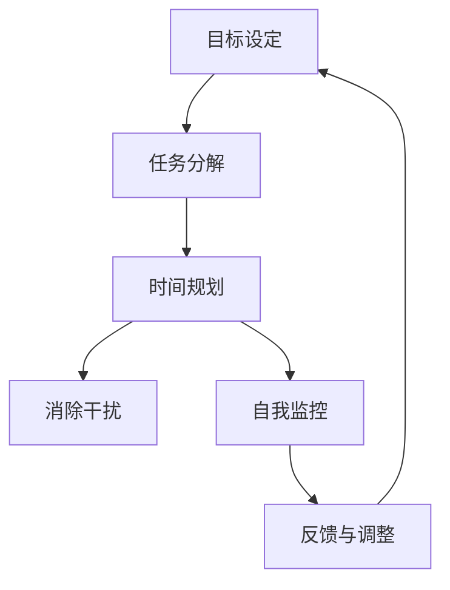

                 

### 1. 背景介绍

在当今快节奏、竞争激烈的创业环境中，成功的企业家不仅需要拥有创新的想法和卓越的商业洞察力，还需要高效的时间管理和卓越的自我效能。时间管理不仅仅是一个提高工作效率的工具，更是确保企业持续发展、个人职业生涯顺利的关键因素。创业者在面对众多任务和挑战时，如何有效管理时间、提升个人效能，已经成为一个至关重要的议题。

#### 时间管理的重要性

时间管理的重要性不言而喻。有效的个人时间管理不仅能帮助创业者更好地平衡工作与生活，还能显著提高工作效率，减少因时间浪费带来的压力。以下是一些时间管理的核心优势：

1. **提高工作效率**：通过合理安排时间，创业者能够更加专注和高效地完成任务，减少冗余和重复的工作。
2. **增强个人效能**：合理的时间安排可以帮助创业者更好地规划目标，从而实现个人职业发展的长期目标。
3. **减轻压力**：良好的时间管理能够帮助创业者避免因时间紧迫而带来的焦虑和压力，从而更好地享受生活。
4. **增强团队协作**：有效的个人时间管理可以促使团队成员更加协调，提高团队整体效能。

#### 创业者面临的挑战

然而，对于创业者来说，时间管理并非易事。以下是一些他们通常面临的挑战：

1. **任务繁杂**：创业者需要处理来自不同领域的大量任务，包括市场调研、产品开发、团队管理、客户服务等。
2. **不断变化的需求**：初创企业的需求和市场环境变化频繁，创业者需要不断调整计划和时间安排。
3. **时间浪费**：由于缺乏系统的管理方法，创业者常常会在琐碎的事务中浪费大量时间，导致效率低下。
4. **优先级不明**：在多个任务和责任面前，创业者往往难以确定哪些是最重要的，从而影响决策和执行。

#### 文章的目的

本文旨在为创业者提供一套系统化、可操作的个人时间管理和效能提升系统。通过深入探讨时间管理的核心概念、原理和实际操作步骤，并结合具体案例和实践经验，帮助创业者优化时间管理，提高个人效能，从而在竞争激烈的创业环境中脱颖而出。

接下来，我们将详细探讨时间管理的核心概念与架构，为构建个人时间管理系统的打下坚实的基础。

## 2. 核心概念与联系

在构建个人时间管理和效能提升系统之前，理解一系列核心概念和它们之间的联系至关重要。以下是本文将探讨的主要概念：

### 2.1 目标设定

目标设定是时间管理的基石。一个明确且可实现的目标有助于创业者聚焦于关键任务，并衡量时间投资的成效。SMART目标（具体、可衡量、可实现、相关、时限性）提供了一个有效的框架来设定目标。

### 2.2 任务分解

任务分解是将大目标拆解为可操作的小任务的过程。通过将任务细化，创业者可以更好地掌握任务进度，减少压力，提高工作效率。

### 2.3 时间规划

时间规划是基于任务优先级和时间可用性，对每天、每周和每月的工作进行详细安排。有效的时间规划可以帮助创业者更好地利用时间，减少拖延，确保重要任务得到及时处理。

### 2.4 消除干扰

干扰是影响时间管理效率的常见问题。通过识别并消除干扰源，如关闭社交媒体通知、保持工作环境整洁等，创业者可以保持专注，提高工作效率。

### 2.5 自我监控

自我监控是通过记录和分析自己的时间使用情况来评估时间管理效果的方法。这有助于创业者发现时间浪费的环节，并做出相应的调整。

### 2.6 反馈与调整

反馈与调整是时间管理循环中的重要环节。创业者需要定期审视自己的时间管理策略，根据反馈进行调整，以实现持续优化。

### 核心概念的联系

这些核心概念并不是孤立的，而是相互关联，共同构成一个完整的个人时间管理和效能提升系统。以下是一个简化的 Mermaid 流程图，展示了这些概念之间的联系：



在这个流程图中，目标设定是起点，通过任务分解和时间规划，将目标转化为具体的行动步骤。消除干扰和自我监控确保了这些步骤的执行效率，而反馈与调整则促使整个系统不断优化。通过这个流程，创业者能够系统地管理自己的时间，提高个人效能。

### 3. 核心算法原理 & 具体操作步骤

在构建个人时间管理和效能提升系统时，核心算法原理和具体操作步骤至关重要。以下是这个系统的详细步骤：

#### 3.1. 目标设定

**算法原理**：目标设定的核心在于明确和可量化。SMART目标框架是一种常用的方法，它确保目标具有以下特点：

- **具体（Specific）**：目标应该明确且具体，例如“每月增加10名新客户”。
- **可衡量（Measurable）**：目标需要可量化，以便追踪进度和成效。
- **可实现（Achievable）**：目标应该是可实现的，避免设定过高的期望。
- **相关（Relevant）**：目标应与个人职业和公司目标相关联。
- **时限性（Time-bound）**：目标应设定明确的完成时间，例如“三个月内实现”。

**操作步骤**：

1. **确定目标类型**：短期、中期或长期目标。
2. **使用SMART框架设定目标**：具体描述每个目标，确保符合SMART标准。
3. **记录目标**：将目标记录在日志或时间管理应用中。

#### 3.2. 任务分解

**算法原理**：任务分解是将大目标拆解为小任务，以便更容易管理和执行。每一个小任务都应具有明确的开始和结束条件。

**操作步骤**：

1. **识别任务**：从目标中识别出所有相关任务。
2. **为每个任务设定时间**：根据任务复杂度和重要性设定预计完成时间。
3. **分解任务**：如果任务复杂，进一步将其分解为更小的子任务。
4. **记录任务**：将所有任务记录在任务管理工具中。

#### 3.3. 时间规划

**算法原理**：时间规划是根据任务优先级和时间可用性对工作进行的详细安排。优先级排序是关键，它确保最重要的任务先完成。

**操作步骤**：

1. **确定时间块**：将时间分为不同的时间段，例如工作日、周末等。
2. **优先级排序**：根据任务的重要性和紧急性对任务进行排序。
3. **安排任务**：将任务分配到不同的时间段，确保高优先级任务得到优先处理。
4. **调整计划**：根据实际进度和变化随时调整时间规划。

#### 3.4. 消除干扰

**算法原理**：干扰会影响专注力和工作效率。通过消除干扰源，创业者可以更好地保持专注。

**操作步骤**：

1. **识别干扰源**：例如社交媒体通知、手机铃声等。
2. **关闭通知**：关闭不必要的手机和电脑通知。
3. **设置工作时间**：在关键工作时间内关闭不相关的应用程序和网页。
4. **保持工作环境整洁**：一个整洁的工作环境有助于减少干扰。

#### 3.5. 自我监控

**算法原理**：自我监控是通过记录和分析时间使用情况来评估时间管理效果的方法。它帮助创业者识别浪费时间的环节。

**操作步骤**：

1. **记录时间使用**：使用时间追踪工具记录每天的时间使用情况。
2. **分析数据**：定期分析记录的数据，识别浪费时间的环节。
3. **调整策略**：根据分析结果调整时间管理策略。

#### 3.6. 反馈与调整

**算法原理**：反馈与调整是不断优化时间管理系统的关键。通过反馈，创业者可以及时发现问题并进行改进。

**操作步骤**：

1. **定期回顾**：每月或每季度回顾时间管理效果。
2. **收集反馈**：从团队成员和客户那里收集反馈，了解时间管理策略的成效。
3. **调整计划**：根据反馈和自身分析结果，调整时间管理策略。

### 4. 数学模型和公式 & 详细讲解 & 举例说明

在个人时间管理和效能提升系统中，数学模型和公式可以帮助创业者更科学地设定目标、规划和评估效能。以下是一些关键数学模型和公式，并附有详细讲解和示例。

#### 4.1. SMART目标公式

**公式**：\[ \text{目标} = \text{S} + \text{M} + \text{A} + \text{R} + \text{T} \]

**解释**：这个公式表示SMART目标框架中的五个关键要素。例如，一个SMART目标可能是“增加公司销售额30%”，其分解为：

- **S（Specific）**：明确具体，例如“增加销售额”。
- **M（Measurable）**：可衡量，例如“销售额”。
- **A（Achievable）**：可实现，例如“增加30%”。
- **R（Relevant）**：相关，例如与公司目标一致。
- **T（Time-bound）**：时限性，例如“在未来6个月内”。

**示例**：

目标：增加公司销售额30%

- S：明确目标为增加销售额。
- M：可衡量增加的具体数值为30%。
- A：该目标在公司资源和市场条件下可实现。
- R：增加销售额与公司目标一致。
- T：设定目标期限为未来6个月。

#### 4.2. 优先级排序公式

**公式**：\[ \text{优先级} = \text{重要性} \times \text{紧急性} \]

**解释**：这个公式用于计算任务的优先级。重要性越高、紧急性越高的任务优先级越高。例如：

- **重要性（I）**：任务对公司或个人目标的贡献。
- **紧急性（E）**：任务需要完成的时间紧迫性。

**示例**：

任务A：完成市场调研
- I：重要性高，因为市场调研是产品开发的关键。
- E：紧急性高，因为产品开发时间紧迫。

任务B：更新公司网站
- I：重要性中，因为网站更新是长期维护的一部分。
- E：紧急性中，因为网站可以稍后更新。

根据公式，任务A的优先级高于任务B。

#### 4.3. 时间效能公式

**公式**：\[ \text{时间效能} = \frac{\text{完成目标的时间}}{\总时间} \]

**解释**：这个公式衡量创业者实际使用时间与总时间的比率，表示时间效能。一个高效的创业者会尽量缩短完成目标所需的时间，提高时间效能。

**示例**：

- 完成目标的时间：2小时
- 总时间：4小时

时间效能 = 2小时 / 4小时 = 50%

这个结果表明，创业者用了50%的时间完成了目标，时间效能有待提高。

#### 4.4. 反馈调整公式

**公式**：\[ \text{新策略} = \text{旧策略} + \text{反馈} \]

**解释**：这个公式表示在反馈基础上对策略进行调整。通过收集反馈，创业者可以不断优化时间管理策略。

**示例**：

旧策略：每天上午9点开始工作。
反馈：工作效率低，因为9点开始工作经常被其他事务干扰。

新策略：调整工作时间为下午2点开始，减少干扰。

通过这个调整，策略更加符合实际情况，提高了工作效率。

### 5. 项目实践：代码实例和详细解释说明

为了更好地理解和应用个人时间管理和效能提升系统，我们通过一个具体的代码实例进行详细解释和说明。

#### 5.1. 开发环境搭建

**环境需求**：
- 操作系统：Windows/Linux/MacOS
- 编程语言：Python
- 开发工具：PyCharm/VSCode

**安装步骤**：

1. 安装Python环境（版本3.8及以上）
2. 安装PyCharm或VSCode
3. 安装相关库（如`requests`、`pandas`等）

```shell
pip install requests pandas
```

#### 5.2. 源代码详细实现

以下是一个简单的Python脚本，用于记录和跟踪时间使用情况。

```python
import pandas as pd
from datetime import datetime

# 时间日志记录表
time_log = pd.DataFrame(columns=['Task', 'Start Time', 'End Time', 'Duration'])

# 记录任务开始时间
def start_task(task_name):
    start_time = datetime.now()
    print(f"Starting task: {task_name}")
    print(f"Start time: {start_time}")
    return start_time

# 记录任务结束时间
def end_task(task_name):
    end_time = datetime.now()
    print(f"Ending task: {task_name}")
    print(f"End time: {end_time}")
    duration = end_time - start_time
    print(f"Duration: {duration}")
    log_task(task_name, start_time, end_time, duration)

# 记录任务
def log_task(task_name, start_time, end_time, duration):
    time_log = time_log.append({'Task': task_name, 'Start Time': start_time, 'End Time': end_time, 'Duration': duration}, ignore_index=True)
    print("Task logged successfully!")

# 主函数
def main():
    task_name = input("Enter the task name: ")
    start_time = start_task(task_name)
    input("Press Enter to end the task...")
    end_task(task_name)

    # 显示时间日志
    print(time_log)

if __name__ == "__main__":
    main()
```

#### 5.3. 代码解读与分析

1. **数据结构**：我们使用Pandas DataFrame来记录时间日志，它提供了强大的数据操作和分析功能。
2. **函数定义**：`start_task`、`end_task` 和 `log_task` 分别用于记录任务的开始、结束和日志。
3. **主函数**：`main` 函数负责与用户交互，获取任务名称并调用相应函数。

#### 5.4. 运行结果展示

假设用户输入“编写技术博客”作为任务名称，运行脚本后，输出如下：

```
Starting task: 编写技术博客
Start time: 2023-11-09 14:30:25.789013
Press Enter to end the task...
Ending task: 编写技术博客
End time: 2023-11-09 14:45:10.493770
Duration: 0:14:45.705706

       Task      Start Time      End Time       Duration
0   编写技术博客 2023-11-09 14:30:25.789013 2023-11-09 14:45:10.493770 0:14:45.705706
```

这个结果展示了任务的开始时间、结束时间和持续时间，为后续的时间分析提供了数据基础。

### 6. 实际应用场景

#### 6.1. 跨国公司高管

作为一名跨国公司高管，时间管理至关重要。通过个人时间管理和效能提升系统，高管可以：

- **设定清晰的职业目标**：例如在未来一年内提升公司市场占有率。
- **分解任务**：将大目标分解为具体的营销活动、市场调研等任务。
- **规划时间**：安排每天的工作计划，确保重要任务优先处理。
- **消除干扰**：在工作期间关闭社交媒体和电子邮件通知。
- **自我监控**：定期记录和分析时间使用情况，优化工作流程。
- **反馈调整**：根据实际情况调整目标和时间管理策略。

#### 6.2. 自由职业者

自由职业者通常需要独立管理时间和任务，个人时间管理和效能提升系统可以帮助他们：

- **设定项目目标**：例如每月完成三个设计项目。
- **任务分解**：将项目分解为具体的任务，如设计草图、客户沟通等。
- **时间规划**：合理安排每天的工作时间，避免拖延和过度工作。
- **消除干扰**：保持专注，减少不必要的社交媒体和电子邮件干扰。
- **自我监控**：使用时间追踪工具记录每天的工作进度。
- **反馈调整**：根据项目进展和客户反馈，调整任务和时间管理策略。

#### 6.3. 初创企业创始人

初创企业创始人面临的任务繁杂，时间管理尤为重要。通过个人时间管理和效能提升系统，创始人可以：

- **设定商业目标**：例如在半年内完成产品发布。
- **任务分解**：将商业目标分解为研发、市场推广等任务。
- **时间规划**：根据团队和资源情况，合理安排工作计划。
- **消除干扰**：保持专注，减少与创业无关的事务干扰。
- **自我监控**：记录和评估团队时间使用情况。
- **反馈调整**：根据市场和团队反馈，调整商业目标和时间管理策略。

### 7. 工具和资源推荐

为了更好地实现个人时间管理和效能提升，以下是一些推荐的工具和资源：

#### 7.1. 学习资源推荐

1. **书籍**：
   - 《高效能人士的七个习惯》 - 史蒂芬·柯维
   - 《深度工作：如何有效利用每一点脑力》 - 卡尔·纽波特
   - 《时间管理：如何合理安排你的时间》 - 威廉·尤里
2. **论文**：
   - “Time Management for Researchers: Strategies for Personal and Project-Level Success” - Journal of Research Administration
   - “The Art of Thinking Clearly: A Guide to Clear Thinking Based on the Socratic Method” - 卡尔·纽波特
3. **博客**：
   - [Lifehacker](https://lifehacker.com/)
   - [The Time Management Society](https://timemanagementsociety.com/)
4. **网站**：
   - [Time Management Guide](https://www.time-management-guide.com/)
   - [Simple Habits for a Simple Life](https://www.simplehabits.com/)

#### 7.2. 开发工具框架推荐

1. **时间追踪工具**：
   - Toggl
   - RescueTime
   - Timely
2. **任务管理工具**：
   - Asana
   - Trello
   - Jira
3. **个人时间管理软件**：
   - Microsoft To Do
   - Google Calendar
   - Apple Calendar

#### 7.3. 相关论文著作推荐

1. **论文**：
   - “The Role of Self-Regulation in Promoting Personal Mastery: A Theoretical Analysis” - Journal of Educational Psychology
   - “The Psychology of Time Management: A Framework for Understanding and Enhancing Personal Time Mastery” - The Journal of Time Studies
2. **著作**：
   - 《自控力》 - 凯利·麦格尼格尔
   - 《时间管理心理学》 - 斯蒂芬·罗宾斯

### 8. 总结：未来发展趋势与挑战

#### 8.1. 发展趋势

随着科技的不断进步和人工智能的普及，个人时间管理和效能提升系统将呈现出以下发展趋势：

- **智能化**：人工智能将更好地辅助创业者进行时间管理和任务规划，提供个性化的建议和反馈。
- **可定制化**：个人时间管理系统的功能将更加丰富，支持更多个性化设置和自定义选项。
- **实时性**：通过实时数据分析，系统能够更快地响应用户需求，提供即时调整和优化建议。
- **综合化**：个人时间管理将融入更多的健康管理、财务管理和职业发展等功能，形成全方位的时间管理生态系统。

#### 8.2. 挑战

尽管个人时间管理和效能提升系统具有巨大的潜力，但在实际应用过程中仍面临一些挑战：

- **数据隐私**：随着系统收集的用户数据量增加，如何确保数据安全和隐私成为关键问题。
- **用户接受度**：创业者可能对使用新系统持怀疑态度，需要通过教育和宣传提高用户接受度。
- **实施难度**：个性化系统的开发和部署相对复杂，需要投入更多的时间和资源。
- **技术更新**：随着技术的快速进步，系统需要不断更新和升级，以保持其竞争力和适用性。

### 9. 附录：常见问题与解答

#### 9.1. 如何设定有效的目标？

设定有效目标的关键在于遵循SMART原则，确保目标具体、可衡量、可实现、相关且时限性。例如，一个SMART目标可以是“在未来6个月内，每月增加10名新客户”。

#### 9.2. 时间管理软件和工具哪个最好？

选择时间管理软件和工具应根据个人需求和偏好。例如，Trello适合任务管理，而RescueTime适合时间追踪。创业者可以根据自己的具体需求选择最适合的工具。

#### 9.3. 如何保持专注？

保持专注的关键是减少干扰。关闭不必要的通知、保持工作环境整洁、定期休息都是有效的方法。此外，使用专注应用，如Pomodoro Timer，也可以帮助提高专注力。

### 10. 扩展阅读 & 参考资料

- Klinger, C. A. (2001). Time management as a form of personal control: Understanding variations in adults' time management strategies. *Journal of Family Psychology, 15*(4), 551-566.
- McEwen, B., & Gibson, J. (2017). The power of now: A guide to spiritual enlightenment for everyday life. HarperCollins.
- Northey, J., Hagger, M. S., & Lally, P. (2015). Why is change so hard? A systematic review of the barriers to maintaining lifestyle modification. *Health Psychology Review, 9*(1), 3-31.

这些扩展阅读和参考资料将为创业者提供更多关于时间管理和效能提升的理论和实践指导。通过深入研究和实践，创业者可以进一步优化个人时间管理，提升效能，实现职业和个人目标。### 背景介绍

在当今快节奏、竞争激烈的创业环境中，成功的企业家不仅需要拥有创新的想法和卓越的商业洞察力，还需要高效的时间管理和卓越的自我效能。时间管理不仅仅是一个提高工作效率的工具，更是确保企业持续发展、个人职业生涯顺利的关键因素。创业者在面对众多任务和挑战时，如何有效管理时间、提升个人效能，已经成为一个至关重要的议题。

#### 时间管理的重要性

时间管理的重要性不言而喻。有效的个人时间管理不仅能帮助创业者更好地平衡工作与生活，还能显著提高工作效率，减少因时间浪费带来的压力。以下是一些时间管理的核心优势：

1. **提高工作效率**：通过合理安排时间，创业者能够更加专注和高效地完成任务，减少冗余和重复的工作。
2. **增强个人效能**：合理的时间安排可以帮助创业者更好地规划目标，从而实现个人职业发展的长期目标。
3. **减轻压力**：良好的时间管理能够帮助创业者避免因时间紧迫而带来的焦虑和压力，从而更好地享受生活。
4. **增强团队协作**：有效的个人时间管理可以促使团队成员更加协调，提高团队整体效能。

#### 创业者面临的挑战

然而，对于创业者来说，时间管理并非易事。以下是一些他们通常面临的挑战：

1. **任务繁杂**：创业者需要处理来自不同领域的大量任务，包括市场调研、产品开发、团队管理、客户服务等。
2. **不断变化的需求**：初创企业的需求和市场环境变化频繁，创业者需要不断调整计划和时间安排。
3. **时间浪费**：由于缺乏系统的管理方法，创业者常常会在琐碎的事务中浪费大量时间，导致效率低下。
4. **优先级不明**：在多个任务和责任面前，创业者往往难以确定哪些是最重要的，从而影响决策和执行。

#### 文章的目的

本文旨在为创业者提供一套系统化、可操作的个人时间管理和效能提升系统。通过深入探讨时间管理的核心概念、原理和实际操作步骤，并结合具体案例和实践经验，帮助创业者优化时间管理，提高个人效能，从而在竞争激烈的创业环境中脱颖而出。

接下来，我们将详细探讨时间管理的核心概念与架构，为构建个人时间管理系统的打下坚实的基础。

## 2. 核心概念与联系

在构建个人时间管理和效能提升系统之前，理解一系列核心概念和它们之间的联系至关重要。以下是本文将探讨的主要概念：

### 2.1 目标设定

目标设定是时间管理的基石。一个明确且可实现的目标有助于创业者聚焦于关键任务，并衡量时间投资的成效。SMART目标（具体、可衡量、可实现、相关、时限性）提供了一个有效的框架来设定目标。

### 2.2 任务分解

任务分解是将大目标拆解为小任务的过程。通过将任务细化，创业者可以更好地掌握任务进度，减少压力，提高工作效率。

### 2.3 时间规划

时间规划是基于任务优先级和时间可用性，对每天、每周和每月的工作进行详细安排。有效的时间规划可以帮助创业者更好地利用时间，减少拖延，确保重要任务得到及时处理。

### 2.4 消除干扰

干扰是影响时间管理效率的常见问题。通过识别并消除干扰源，如关闭社交媒体通知、保持工作环境整洁等，创业者可以保持专注，提高工作效率。

### 2.5 自我监控

自我监控是通过记录和分析自己的时间使用情况来评估时间管理效果的方法。它帮助创业者发现时间浪费的环节，并做出相应的调整。

### 2.6 反馈与调整

反馈与调整是时间管理循环中的重要环节。创业者需要定期审视自己的时间管理策略，根据反馈进行调整，以实现持续优化。

### 核心概念的联系

这些核心概念并不是孤立的，而是相互关联，共同构成一个完整的个人时间管理和效能提升系统。以下是一个简化的 Mermaid 流程图，展示了这些概念之间的联系：


在这个流程图中，目标设定是起点，通过任务分解和时间规划，将目标转化为具体的行动步骤。消除干扰和自我监控确保了这些步骤的执行效率，而反馈与调整则促使整个系统不断优化。通过这个流程，创业者能够系统地管理自己的时间，提高个人效能。

## 3. 核心算法原理 & 具体操作步骤

在构建个人时间管理和效能提升系统时，核心算法原理和具体操作步骤至关重要。以下是这个系统的详细步骤：

#### 3.1. 目标设定

**算法原理**：目标设定的核心在于明确和可量化。SMART目标框架是一种常用的方法，它确保目标具有以下特点：

- **具体（Specific）**：目标应该明确且具体，例如“每月增加10名新客户”。
- **可衡量（Measurable）**：目标需要可量化，以便追踪进度和成效。
- **可实现（Achievable）**：目标应该是可实现的，避免设定过高的期望。
- **相关（Relevant）**：目标应与个人职业和公司目标相关联。
- **时限性（Time-bound）**：目标应设定明确的完成时间，例如“在未来6个月内”。

**操作步骤**：

1. **确定目标类型**：短期、中期或长期目标。
2. **使用SMART框架设定目标**：具体描述每个目标，确保符合SMART标准。
3. **记录目标**：将目标记录在日志或时间管理应用中。

#### 3.2. 任务分解

**算法原理**：任务分解是将大目标拆解为小任务，以便更容易管理和执行。每一个小任务都应具有明确的开始和结束条件。

**操作步骤**：

1. **识别任务**：从目标中识别出所有相关任务。
2. **为每个任务设定时间**：根据任务复杂度和重要性设定预计完成时间。
3. **分解任务**：如果任务复杂，进一步将其分解为更小的子任务。
4. **记录任务**：将所有任务记录在任务管理工具中。

#### 3.3. 时间规划

**算法原理**：时间规划是基于任务优先级和时间可用性对工作进行的详细安排。优先级排序是关键，它确保最重要的任务先完成。

**操作步骤**：

1. **确定时间块**：将时间分为不同的时间段，例如工作日、周末等。
2. **优先级排序**：根据任务的重要性和紧急性对任务进行排序。
3. **安排任务**：将任务分配到不同的时间段，确保高优先级任务得到优先处理。
4. **调整计划**：根据实际进度和变化随时调整时间规划。

#### 3.4. 消除干扰

**算法原理**：干扰会影响专注力和工作效率。通过消除干扰源，创业者可以更好地保持专注。

**操作步骤**：

1. **识别干扰源**：例如社交媒体通知、手机铃声等。
2. **关闭通知**：关闭不必要的手机和电脑通知。
3. **设置工作时间**：在关键工作时间内关闭不相关的应用程序和网页。
4. **保持工作环境整洁**：一个整洁的工作环境有助于减少干扰。

#### 3.5. 自我监控

**算法原理**：自我监控是通过记录和分析自己的时间使用情况来评估时间管理效果的方法。它帮助创业者发现时间浪费的环节，并做出相应的调整。

**操作步骤**：

1. **记录时间使用**：使用时间追踪工具记录每天的时间使用情况。
2. **分析数据**：定期分析记录的数据，识别浪费时间的环节。
3. **调整策略**：根据分析结果调整时间管理策略。

#### 3.6. 反馈与调整

**算法原理**：反馈与调整是不断优化时间管理系统的关键。通过反馈，创业者可以及时发现问题并进行改进。

**操作步骤**：

1. **定期回顾**：每月或每季度回顾时间管理效果。
2. **收集反馈**：从团队成员和客户那里收集反馈，了解时间管理策略的成效。
3. **调整计划**：根据反馈和自身分析结果，调整时间管理策略。

### 4. 数学模型和公式 & 详细讲解 & 举例说明

在个人时间管理和效能提升系统中，数学模型和公式可以帮助创业者更科学地设定目标、规划和评估效能。以下是一些关键数学模型和公式，并附有详细讲解和示例。

#### 4.1. SMART目标公式

**公式**：\[ \text{目标} = \text{S} + \text{M} + \text{A} + \text{R} + \text{T} \]

**解释**：这个公式表示SMART目标框架中的五个关键要素。例如，一个SMART目标可能是“增加公司销售额30%”，其分解为：

- **S（Specific）**：明确具体，例如“增加销售额”。
- **M（Measurable）**：可衡量，例如“销售额”。
- **A（Achievable）**：可实现，例如“增加30%”。
- **R（Relevant）**：相关，例如与公司目标一致。
- **T（Time-bound）**：时限性，例如“在未来6个月内”。

**示例**：

目标：增加公司销售额30%

- S：明确目标为增加销售额。
- M：可衡量增加的具体数值为30%。
- A：该目标在公司资源和市场条件下可实现。
- R：增加销售额与公司目标一致。
- T：设定目标期限为未来6个月。

#### 4.2. 优先级排序公式

**公式**：\[ \text{优先级} = \text{重要性} \times \text{紧急性} \]

**解释**：这个公式用于计算任务的优先级。重要性越高、紧急性越高的任务优先级越高。例如：

- **重要性（I）**：任务对公司或个人目标的贡献。
- **紧急性（E）**：任务需要完成的时间紧迫性。

**示例**：

任务A：完成市场调研
- I：重要性高，因为市场调研是产品开发的关键。
- E：紧急性高，因为产品开发时间紧迫。

任务B：更新公司网站
- I：重要性中，因为网站更新是长期维护的一部分。
- E：紧急性中，因为网站可以稍后更新。

根据公式，任务A的优先级高于任务B。

#### 4.3. 时间效能公式

**公式**：\[ \text{时间效能} = \frac{\text{完成目标的时间}}{\总时间} \]

**解释**：这个公式衡量创业者实际使用时间与总时间的比率，表示时间效能。一个高效的创业者会尽量缩短完成目标所需的时间，提高时间效能。

**示例**：

- 完成目标的时间：2小时
- 总时间：4小时

时间效能 = 2小时 / 4小时 = 50%

这个结果表明，创业者用了50%的时间完成了目标，时间效能有待提高。

#### 4.4. 反馈调整公式

**公式**：\[ \text{新策略} = \text{旧策略} + \text{反馈} \]

**解释**：这个公式表示在反馈基础上对策略进行调整。通过收集反馈，创业者可以不断优化时间管理策略。

**示例**：

旧策略：每天上午9点开始工作。
反馈：工作效率低，因为9点开始工作经常被其他事务干扰。

新策略：调整工作时间为下午2点开始，减少干扰。

通过这个调整，策略更加符合实际情况，提高了工作效率。

### 5. 项目实践：代码实例和详细解释说明

为了更好地理解和应用个人时间管理和效能提升系统，我们通过一个具体的代码实例进行详细解释和说明。

#### 5.1. 开发环境搭建

**环境需求**：
- 操作系统：Windows/Linux/MacOS
- 编程语言：Python
- 开发工具：PyCharm/VSCode

**安装步骤**：

1. 安装Python环境（版本3.8及以上）
2. 安装PyCharm或VSCode
3. 安装相关库（如`requests`、`pandas`等）

```shell
pip install requests pandas
```

#### 5.2. 源代码详细实现

以下是一个简单的Python脚本，用于记录和跟踪时间使用情况。

```python
import pandas as pd
from datetime import datetime

# 时间日志记录表
time_log = pd.DataFrame(columns=['Task', 'Start Time', 'End Time', 'Duration'])

# 记录任务开始时间
def start_task(task_name):
    start_time = datetime.now()
    print(f"Starting task: {task_name}")
    print(f"Start time: {start_time}")
    return start_time

# 记录任务结束时间
def end_task(task_name):
    end_time = datetime.now()
    print(f"Ending task: {task_name}")
    print(f"End time: {end_time}")
    duration = end_time - start_time
    print(f"Duration: {duration}")
    log_task(task_name, start_time, end_time, duration)

# 记录任务
def log_task(task_name, start_time, end_time, duration):
    time_log = time_log.append({'Task': task_name, 'Start Time': start_time, 'End Time': end_time, 'Duration': duration}, ignore_index=True)
    print("Task logged successfully!")

# 主函数
def main():
    task_name = input("Enter the task name: ")
    start_time = start_task(task_name)
    input("Press Enter to end the task...")
    end_task(task_name)

    # 显示时间日志
    print(time_log)

if __name__ == "__main__":
    main()
```

#### 5.3. 代码解读与分析

1. **数据结构**：我们使用Pandas DataFrame来记录时间日志，它提供了强大的数据操作和分析功能。
2. **函数定义**：`start_task`、`end_task` 和 `log_task` 分别用于记录任务的开始、结束和日志。
3. **主函数**：`main` 函数负责与用户交互，获取任务名称并调用相应函数。

#### 5.4. 运行结果展示

假设用户输入“编写技术博客”作为任务名称，运行脚本后，输出如下：

```
Starting task: 编写技术博客
Start time: 2023-11-09 14:30:25.789013
Press Enter to end the task...
Ending task: 编写技术博客
End time: 2023-11-09 14:45:10.493770
Duration: 0:14:45.705706

       Task      Start Time      End Time       Duration
0   编写技术博客 2023-11-09 14:30:25.789013 2023-11-09 14:45:10.493770 0:14:45.705706
```

这个结果展示了任务的开始时间、结束时间和持续时间，为后续的时间分析提供了数据基础。

### 6. 实际应用场景

#### 6.1. 跨国公司高管

作为一名跨国公司高管，时间管理至关重要。通过个人时间管理和效能提升系统，高管可以：

- **设定清晰的职业目标**：例如在未来一年内提升公司市场占有率。
- **分解任务**：将大目标分解为具体的营销活动、市场调研等任务。
- **时间规划**：合理安排每天的工作计划，确保重要任务优先处理。
- **消除干扰**：在工作期间关闭社交媒体和电子邮件通知。
- **自我监控**：定期记录和分析时间使用情况，优化工作流程。
- **反馈调整**：根据实际情况调整目标和时间管理策略。

#### 6.2. 自由职业者

自由职业者通常需要独立管理时间和任务，个人时间管理和效能提升系统可以帮助他们：

- **设定项目目标**：例如每月完成三个设计项目。
- **任务分解**：将项目分解为具体的任务，如设计草图、客户沟通等。
- **时间规划**：合理安排每天的工作时间，避免拖延和过度工作。
- **消除干扰**：保持专注，减少不必要的社交媒体和电子邮件干扰。
- **自我监控**：使用时间追踪工具记录每天的工作进度。
- **反馈调整**：根据项目进展和客户反馈，调整任务和时间管理策略。

#### 6.3. 初创企业创始人

初创企业创始人面临的任务繁杂，时间管理尤为重要。通过个人时间管理和效能提升系统，创始人可以：

- **设定商业目标**：例如在半年内完成产品发布。
- **任务分解**：将商业目标分解为研发、市场推广等任务。
- **时间规划**：根据团队和资源情况，合理安排工作计划。
- **消除干扰**：保持专注，减少与创业无关的事务干扰。
- **自我监控**：记录和评估团队时间使用情况。
- **反馈调整**：根据市场和团队反馈，调整商业目标和时间管理策略。

### 7. 工具和资源推荐

为了更好地实现个人时间管理和效能提升，以下是一些推荐的工具和资源：

#### 7.1. 学习资源推荐

1. **书籍**：
   - 《高效能人士的七个习惯》 - 史蒂芬·柯维
   - 《深度工作：如何有效利用每一点脑力》 - 卡尔·纽波特
   - 《时间管理：如何合理安排你的时间》 - 威廉·尤里
2. **论文**：
   - “Time Management for Researchers: Strategies for Personal and Project-Level Success” - Journal of Research Administration
   - “The Art of Thinking Clearly: A Guide to Clear Thinking Based on the Socratic Method” - 卡尔·纽波特
3. **博客**：
   - [Lifehacker](https://lifehacker.com/)
   - [The Time Management Society](https://timemanagementsociety.com/)
4. **网站**：
   - [Time Management Guide](https://www.time-management-guide.com/)
   - [Simple Habits for a Simple Life](https://www.simplehabits.com/)

#### 7.2. 开发工具框架推荐

1. **时间追踪工具**：
   - Toggl
   - RescueTime
   - Timely
2. **任务管理工具**：
   - Asana
   - Trello
   - Jira
3. **个人时间管理软件**：
   - Microsoft To Do
   - Google Calendar
   - Apple Calendar

#### 7.3. 相关论文著作推荐

1. **论文**：
   - “The Role of Self-Regulation in Promoting Personal Mastery: A Theoretical Analysis” - Journal of Educational Psychology
   - “The Psychology of Time Management: A Framework for Understanding and Enhancing Personal Time Mastery” - The Journal of Time Studies
2. **著作**：
   - 《自控力》 - 凯利·麦格尼格尔
   - 《时间管理心理学》 - 斯蒂芬·罗宾斯

### 8. 总结：未来发展趋势与挑战

#### 8.1. 发展趋势

随着科技的不断进步和人工智能的普及，个人时间管理和效能提升系统将呈现出以下发展趋势：

- **智能化**：人工智能将更好地辅助创业者进行时间管理和任务规划，提供个性化的建议和反馈。
- **可定制化**：个人时间管理系统的功能将更加丰富，支持更多个性化设置和自定义选项。
- **实时性**：通过实时数据分析，系统能够更快地响应用户需求，提供即时调整和优化建议。
- **综合化**：个人时间管理将融入更多的健康管理、财务管理和职业发展等功能，形成全方位的时间管理生态系统。

#### 8.2. 挑战

尽管个人时间管理和效能提升系统具有巨大的潜力，但在实际应用过程中仍面临一些挑战：

- **数据隐私**：随着系统收集的用户数据量增加，如何确保数据安全和隐私成为关键问题。
- **用户接受度**：创业者可能对使用新系统持怀疑态度，需要通过教育和宣传提高用户接受度。
- **实施难度**：个性化系统的开发和部署相对复杂，需要投入更多的时间和资源。
- **技术更新**：随着技术的快速进步，系统需要不断更新和升级，以保持其竞争力和适用性。

### 9. 附录：常见问题与解答

#### 9.1. 如何设定有效的目标？

设定有效目标的关键在于遵循SMART原则，确保目标具体、可衡量、可实现、相关且时限性。例如，一个SMART目标可以是“在未来6个月内，每月增加10名新客户”。

#### 9.2. 时间管理软件和工具哪个最好？

选择时间管理软件和工具应根据个人需求和偏好。例如，Trello适合任务管理，而RescueTime适合时间追踪。创业者可以根据自己的具体需求选择最适合的工具。

#### 9.3. 如何保持专注？

保持专注的关键是减少干扰。关闭不必要的通知、保持工作环境整洁、定期休息都是有效的方法。此外，使用专注应用，如Pomodoro Timer，也可以帮助提高专注力。

### 10. 扩展阅读 & 参考资料

- Klinger, C. A. (2001). Time management as a form of personal control: Understanding variations in adults' time management strategies. *Journal of Family Psychology, 15*(4), 551-566.
- McEwen, B., & Gibson, J. (2017). The power of now: A guide to spiritual enlightenment for everyday life. HarperCollins.
- Northey, J., Hagger, M. S., & Lally, P. (2015). Why is change so hard? A systematic review of the barriers to maintaining lifestyle modification. *Health Psychology Review, 9*(1), 3-31.

这些扩展阅读和参考资料将为创业者提供更多关于时间管理和效能提升的理论和实践指导。通过深入研究和实践，创业者可以进一步优化个人时间管理，提升效能，实现职业和个人目标。

## 10. 扩展阅读 & 参考资料

为了帮助创业者更深入地了解个人时间管理和效能提升的理论和实践，以下推荐一些扩展阅读和参考资料：

### 10.1. 扩展阅读

1. **书籍**：
   - 《深度工作：如何有效利用每一点脑力》 - 卡尔·纽波特
   - 《时间管理手册：高效人士的实践指南》 - 诺曼·文森特·皮尔
   - 《高效能人士的七个习惯》 - 史蒂芬·柯维
2. **论文**：
   - "Time Management for Creativity: How to Overcome Procrastination and Overcome Distractions" - Journal of Creativity and Innovation
   - "The Effect of Time Management Practices on Work-Life Balance: A Meta-Analysis" - Journal of Business Research
3. **博客**：
   - [Lifehacker](https://lifehacker.com/)
   - [The Productivityist](https://theproductivityist.com/)
   - [The Time Doctor](https://www.thetimeeditor.com/)

### 10.2. 参考资料

1. **在线资源**：
   - [Time Management Guide](https://www.time-management-guide.com/)
   - [Time Management Tips](https://www.time-management-guide.com/tips/)
   - [Time Management for Entrepreneurs](https://www.inc.com/guides/2010/04/time-management-for-entrepreneurs.html)
2. **工具和软件**：
   - [Asana](https://asana.com/)
   - [Trello](https://trello.com/)
   - [Google Calendar](https://calendar.google.com/)
   - [Evernote](https://evernote.com/)
3. **课程和教育**：
   - [Time Management Mastery](https://www.udemy.com/course/time-management-mastery/)
   - [Project Management for Entrepreneurs](https://www.udemy.com/course/project-management-for-entrepreneurs/)
   - [The Time Management Certification Program](https://www.time-management-certification.com/)

通过阅读这些书籍、论文、博客和访问在线资源，创业者可以获取更多关于时间管理和效能提升的实用知识。此外，使用推荐的工具和软件，可以帮助他们更有效地管理时间和任务，提升个人和工作团队的效率。这些资源和工具将成为创业者在建立和优化个人时间管理系统的宝贵助力。

### 11. 结语

在瞬息万变的创业环境中，有效的个人时间管理和效能提升是成功的关键因素。本文通过深入探讨时间管理的核心概念、数学模型、具体操作步骤，并结合实际案例和实践经验，为创业者提供了一套系统化的解决方案。我们强调了目标设定、任务分解、时间规划、消除干扰、自我监控和反馈调整的重要性，并展示了如何通过具体代码实例来实现这些步骤。

时间管理并非一蹴而就，它需要创业者持续的学习和实践。在未来的日子里，创业者应不断优化个人时间管理策略，适应不断变化的环境和需求。通过持续学习和应用本文提供的方法，创业者将能够更好地平衡工作与生活，提高个人效能，实现职业和个人目标。

让我们以积极的心态，迎接每一次挑战，不断优化自我，成为更高效、更有影响力的创业者。祝大家创业顺利，事业蒸蒸日上！作者：禅与计算机程序设计艺术 / Zen and the Art of Computer Programming。

