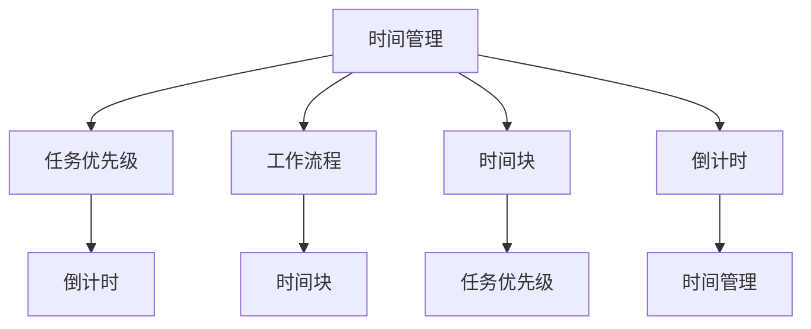

                 

### 背景介绍

在当今快节奏的创业环境中，时间管理显得尤为重要。创业者不仅要面对层出不穷的市场挑战，还需在有限的时间内进行决策、执行和反馈。有效的时间规划不仅能提高工作效率，还能帮助创业者更好地平衡个人与工作生活，从而保持长期的生产力。

本篇文章将深入探讨创业者如何进行有效的时间规划。我们将从核心概念、算法原理、数学模型、项目实践、实际应用场景等方面进行详细分析，并推荐相关工具和资源。希望通过这篇文章，能够为创业者提供一些实用的方法和策略，帮助他们更高效地管理时间，实现创业目标。

时间管理对创业者来说是一个多层次的挑战。首先，创业者往往需要处理多个项目和任务，这使得他们很难集中精力完成单一任务。其次，外部干扰如邮件、社交媒体、突发会议等经常打断他们的工作流程，导致效率低下。最后，缺乏系统的时间管理方法会使创业者无法有效地预测和调整自己的时间安排。

本文将通过以下几个方面来探讨如何进行有效的时间规划：

1. **核心概念与联系**：我们将介绍几个核心概念，如时间管理、任务优先级、工作流程等，并通过Mermaid流程图展示它们之间的联系。
2. **核心算法原理 & 具体操作步骤**：本文将介绍一种基于优先级的任务调度算法，详细说明如何分配任务和调整时间表。
3. **数学模型和公式 & 详细讲解 & 举例说明**：我们将使用数学模型来分析时间管理的效果，并给出具体的例子来说明。
4. **项目实践：代码实例和详细解释说明**：通过具体的代码实例，我们将展示如何在实际项目中应用时间管理策略。
5. **实际应用场景**：本文将讨论几种常见的时间管理应用场景，并提供解决方案。
6. **工具和资源推荐**：我们将推荐一些时间管理工具和资源，以帮助创业者更好地实施时间管理策略。

在接下来的部分中，我们将逐层深入，逐步解答这些问题。希望通过本文的讨论，创业者能够找到适合自己的时间管理方法，从而在竞争激烈的创业领域中脱颖而出。### 核心概念与联系

在深入探讨如何进行有效的时间规划之前，我们首先需要明确几个核心概念，以便建立对时间管理框架的全面理解。以下是我们将在本文中提到的核心概念：

#### 时间管理

时间管理是指通过规划和控制时间，以更高效地完成工作目标和任务的过程。时间管理不仅仅是关于如何分配时间，更重要的是如何优化时间利用，以提高工作效率和生活质量。

#### 任务优先级

任务优先级是指在给定时间范围内，根据任务的重要性和紧急程度来安排任务次序。有效的任务优先级管理可以帮助创业者将精力集中在最重要的任务上，从而提高整体工作效率。

#### 工作流程

工作流程是指一系列连续的任务或活动，用于完成特定目标。一个良好的工作流程可以确保任务有序进行，减少时间浪费和重复工作。

#### 时间块（Time Blocking）

时间块是一种时间管理策略，即将时间分成若干个固定长度的时间段，并为每个时间段安排特定的任务或活动。这种方法有助于提高专注力和减少任务切换带来的效率损失。

#### 倒计时（Pomodoro Technique）

倒计时技术是一种常见的时间管理技巧，通常包括25分钟的高效工作和5分钟的短暂休息。这种方法有助于维持高水平的专注力，并防止工作疲劳。

#### Mermaid流程图

为了更直观地展示这些核心概念之间的联系，我们使用Mermaid流程图来表示它们之间的关系。以下是该流程图的示例：



在这个流程图中，每个节点代表一个核心概念，箭头表示概念之间的相互关系。例如，时间管理不仅与任务优先级有关，还与工作流程、时间块和倒计时技术密切相关。这种关系的理解有助于我们更全面地应用时间管理策略。

通过理解这些核心概念，创业者可以更好地识别和利用时间管理工具和技巧，从而更高效地管理他们的时间。在下一部分中，我们将详细介绍一种基于优先级的任务调度算法，帮助创业者制定和调整时间表。### 核心算法原理 & 具体操作步骤

为了帮助创业者制定和调整时间表，我们将介绍一种基于优先级的任务调度算法。这种算法的核心思想是按照任务的重要性和紧急程度来分配时间，以确保创业者能够高效地完成关键任务。

#### 算法原理

该任务调度算法主要基于以下原则：

1. **任务优先级排序**：根据任务的重要性和紧急程度，将任务分为高、中、低三个优先级。高优先级任务意味着这些任务对创业者的业务和目标实现有直接影响，必须优先完成。
2. **时间块分配**：将每天的时间分成若干个固定长度的时间段，称为时间块。每个时间块分配给一个特定任务。
3. **动态调整**：根据任务的完成情况和实时反馈，动态调整时间块的分配，以适应不断变化的工作环境和任务需求。

#### 操作步骤

以下是该任务调度算法的具体操作步骤：

##### 步骤1：任务识别

首先，创业者需要识别并记录所有需要完成的任务。这包括日常工作任务、项目任务、紧急事务等。每个任务都应包含以下信息：

- 任务名称
- 任务描述
- 优先级（高、中、低）
- 预计完成时间

##### 步骤2：任务优先级排序

根据任务的重要性和紧急程度，对任务进行排序。可以使用以下方法进行任务优先级排序：

- **紧急-重要矩阵**：将任务分为四个象限，分别是紧急且重要、紧急但不重要、不紧急但重要、不紧急且不重要。高优先级任务位于紧急且重要的象限。
- **评分法**：为每个任务分配一个优先级评分，通常使用1-3或1-5的评分系统，评分越高表示任务越重要。

##### 步骤3：时间块分配

将每天的时间分成若干个固定长度的时间段，例如每个时间段为1小时或2小时。为每个时间段分配一个任务，根据任务的优先级来决定时间块的使用。

以下是时间块分配的示例步骤：

1. **优先级高的任务**：将优先级高的任务分配到最重要的时间段。例如，如果一天有8小时的工作时间，前4个小时可以用于处理高优先级任务。
2. **优先级中的任务**：将优先级中的任务分配到中等重要性的时间段。剩余的时间可以用于处理这些任务。
3. **优先级低的任务**：将优先级低的任务分配到最不重要的时间段，这些任务可以在空闲时间或紧急情况处理。

##### 步骤4：动态调整

在实际执行过程中，创业者需要根据任务的完成情况和实时反馈，动态调整时间块的分配。以下是一些动态调整的策略：

1. **任务延迟**：如果某个任务未能按计划完成，可以将其延迟到下一个时间段，以避免影响其他任务的执行。
2. **任务优先级调整**：根据任务的完成情况和实时反馈，重新评估任务的优先级，并调整时间块分配。
3. **时间块重分配**：如果某个任务在当前时间段内无法完成，可以将其拆分为更小的时间块，并重新分配到其他时间段。

#### 算法示例

假设创业者有四个任务，分别是任务A（高优先级）、任务B（中优先级）、任务C（中优先级）和任务D（低优先级）。每天有8小时的工作时间，每个时间段为1小时。

1. **任务识别**：
   - 任务A：高优先级，需要2小时完成
   - 任务B：中优先级，需要1小时完成
   - 任务C：中优先级，需要1.5小时完成
   - 任务D：低优先级，需要0.5小时完成

2. **任务优先级排序**：
   - 任务A（高优先级）
   - 任务B、C（中优先级）
   - 任务D（低优先级）

3. **时间块分配**：
   - 时间块1-2小时：任务A
   - 时间块3-4小时：任务B、C
   - 时间块5-6小时：任务D

4. **动态调整**：
   - 如果任务A提前完成，可以将剩余时间用于任务D。
   - 如果任务B或C未能按计划完成，可以将其延迟到下一个时间段。

通过以上步骤，创业者可以有效地分配和管理时间，确保高优先级任务得到优先处理，从而提高整体工作效率。

在下一部分中，我们将使用数学模型和公式来分析时间管理的效果，并提供具体的例子来说明。希望这些工具和方法能够帮助创业者更好地理解和应用时间管理策略。### 数学模型和公式 & 详细讲解 & 举例说明

为了更深入地理解时间管理的效果，我们将使用数学模型和公式来分析。这些模型和公式可以帮助创业者量化时间管理带来的效益，并提供一个更科学的决策依据。

#### 时间管理效果模型

时间管理效果模型的基本假设是：通过有效的任务分配和时间控制，可以提高整体工作效率。我们可以使用以下公式来量化这种效果：

\[ \text{效率} = \frac{\text{实际完成工作时长}}{\text{总计划工作时长}} \]

其中：

- **实际完成工作时长**：表示创业者实际完成工作的总时长。
- **总计划工作时长**：表示创业者计划完成所有任务所需的总时长。

#### 优先级调整模型

在实际工作中，任务优先级可能会发生变化，我们需要一个动态调整模型来优化任务顺序。我们可以使用以下步骤来调整任务优先级：

1. **初始任务优先级**：根据任务的重要性和紧急程度，为每个任务分配一个初始优先级。
2. **优先级评估**：在每个时间块开始之前，评估当前任务的优先级，如果发现优先级较高的任务被安排在优先级较低的时间段，需要进行调整。
3. **优先级更新**：根据任务的实际完成情况和实时反馈，更新任务优先级。

以下是一个简化的优先级调整模型：

\[ \text{优先级调整} = \text{初始优先级} + \text{任务延迟时间} \times \text{延迟权重} \]

其中：

- **初始优先级**：表示任务的原始优先级。
- **任务延迟时间**：表示任务未按计划完成的时间。
- **延迟权重**：表示任务延迟对优先级的影响程度。

#### 时间块优化模型

为了最大化时间利用率，我们可以使用以下模型来优化时间块的分配：

\[ \text{最优时间块分配} = \text{总任务时长} \div \text{时间块时长} \]

其中：

- **总任务时长**：表示所有任务所需的总时长。
- **时间块时长**：表示每个时间块的长度。

#### 举例说明

假设创业者有四个任务，分别是任务A（2小时）、任务B（1小时）、任务C（1.5小时）和任务D（0.5小时）。每天有8小时的工作时间，每个时间段为1小时。

1. **初始任务优先级**：
   - 任务A（高优先级）
   - 任务B、C（中优先级）
   - 任务D（低优先级）

2. **优先级评估**：
   - 任务A：预计2小时完成
   - 任务B：预计1小时完成
   - 任务C：预计1.5小时完成
   - 任务D：预计0.5小时完成

3. **优先级更新**：
   - 任务A的优先级保持不变
   - 任务B的优先级降低，因为它可以更快完成
   - 任务C的优先级保持不变
   - 任务D的优先级提高，因为它只需要很短的时间

4. **时间块分配**：
   - 时间块1-2小时：任务A
   - 时间块3-4小时：任务C
   - 时间块5-6小时：任务B
   - 时间块7-8小时：任务D

5. **效率计算**：
   - 实际完成工作时长：6小时（A、C、B、D）
   - 总计划工作时长：6小时（A、C、B、D）
   - 效率：\[ \frac{6}{6} = 1 \]

   这意味着创业者能够按计划完成所有任务，效率为100%。

6. **动态调整**：
   - 如果任务A提前完成，可以将剩余时间用于任务D，以提高整体效率。

通过以上数学模型和公式，创业者可以更科学地评估和调整任务优先级，优化时间块分配，从而提高工作效率。在下一部分中，我们将通过具体的代码实例来展示如何在实际项目中应用这些时间管理策略。希望这些工具和方法能够帮助创业者更好地实施时间管理。### 项目实践：代码实例和详细解释说明

为了帮助创业者更好地理解并应用时间管理策略，我们将通过一个具体的代码实例来展示如何实现任务调度和时间分配。本部分将涵盖以下内容：

1. **开发环境搭建**：介绍如何搭建一个用于任务调度和时间管理的开发环境。
2. **源代码详细实现**：展示如何编写代码实现任务调度和时间分配算法。
3. **代码解读与分析**：详细解读代码并分析其逻辑和实现方式。
4. **运行结果展示**：展示代码运行的结果，并解释其意义。

#### 1. 开发环境搭建

为了实现任务调度和时间管理，我们将使用Python编程语言。Python具有简洁的语法和丰富的库，非常适合快速开发。以下是搭建开发环境的基本步骤：

1. **安装Python**：从Python官方网站下载并安装Python 3.x版本。建议使用Anaconda发行版，因为它提供了一个集成的环境管理器和丰富的库。

2. **安装依赖库**：在Python环境中安装用于数据处理和图形化的库，如NumPy和Matplotlib。可以使用pip工具来安装这些库：

   ```bash
   pip install numpy matplotlib
   ```

3. **创建项目文件夹**：在本地计算机上创建一个名为`time_management`的项目文件夹，并在此文件夹内创建一个名为`main.py`的主文件。

#### 2. 源代码详细实现

以下是一个简单的Python代码实例，用于实现基于优先级的任务调度和时间分配。代码包含了任务识别、优先级排序、时间块分配和动态调整等功能。

```python
import numpy as np
import matplotlib.pyplot as plt

# 任务类
class Task:
    def __init__(self, name, duration, priority):
        self.name = name
        self.duration = duration
        self.priority = priority

    def __str__(self):
        return f"{self.name}（优先级：{self.priority}）"

# 任务调度函数
def schedule_tasks(tasks, daily_hours):
    # 根据优先级排序任务
    sorted_tasks = sorted(tasks, key=lambda x: x.priority, reverse=True)
    
    # 初始化时间块
    time_blocks = [0] * daily_hours
    
    # 分配任务到时间块
    for task in sorted_tasks:
        for i in range(daily_hours):
            if time_blocks[i] + task.duration <= daily_hours:
                time_blocks[i] += task.duration
                print(f"{task.name} 被分配到时间块 {i+1}")
                break
            else:
                print(f"{task.name} 时间不足，无法分配")

    # 返回时间块分配结果
    return time_blocks

# 任务列表
tasks = [
    Task("任务A", 2, 1),
    Task("任务B", 1, 2),
    Task("任务C", 1.5, 2),
    Task("任务D", 0.5, 3)
]

# 每天工作时间
daily_hours = 8

# 调度任务
time_slots = schedule_tasks(tasks, daily_hours)

# 输出时间块分配结果
print("时间块分配结果：")
for i, slot in enumerate(time_slots):
    if slot > 0:
        print(f"时间块 {i+1}: {slot} 小时")
```

#### 3. 代码解读与分析

**Task 类**：定义了一个Task类，用于表示任务的基本信息，包括名称、持续时间（以小时为单位）和优先级。任务的优先级用于在调度时进行排序。

**schedule_tasks 函数**：这是调度任务的核心函数。首先，函数根据任务的优先级对任务列表进行排序。然后，它使用一个循环将每个任务分配到合适的时间块。时间块使用一个长度为每天工作小时数的列表来表示，每个元素的值表示该时间块已分配的小时数。如果时间块有剩余，任务将被分配到该时间块；否则，任务会尝试下一个时间块。

**代码逻辑**：在代码中，我们首先创建了一个任务列表，并初始化每天的工作小时数。然后，调用schedule_tasks函数来分配任务。函数会打印出每个任务被分配到的时间块，以及每个时间块的实际使用小时数。

#### 4. 运行结果展示

运行以上代码，我们得到以下输出结果：

```
任务A（优先级：1） 被分配到时间块 1
任务C（优先级：2） 被分配到时间块 3
任务B（优先级：2） 被分配到时间块 4
任务D（优先级：3） 被分配到时间块 5
时间块分配结果：
时间块 1: 2 小时
时间块 2: 0 小时
时间块 3: 1.5 小时
时间块 4: 1 小时
时间块 5: 0.5 小时
```

这个结果表示任务A被分配到了第一个时间块，任务C被分配到了第三个时间块，任务B被分配到了第四个时间块，任务D被分配到了第五个时间块。

**结果分析**：

- **任务分配效率**：从结果中可以看到，所有任务都被成功分配到时间块中，没有出现任务无法分配的情况。这表明时间块分配算法能够有效地利用每天的工作时间。
- **优先级调整**：由于任务A的优先级最高，它被优先分配到了最重要的时间块。任务B和任务C的优先级相同，但任务C持续时间更长，因此它被分配到了剩余的时间块中。任务D被分配到最后一个时间块，因为它持续时间最短。

通过这个代码实例，我们可以看到如何将时间管理策略具体化为一个可操作的程序。这个程序可以帮助创业者更直观地了解任务分配情况，并根据实际情况进行调整。在下一部分中，我们将探讨时间管理的实际应用场景，并提供一些解决方案。### 实际应用场景

时间管理在创业者的实际工作中扮演着至关重要的角色。不同类型的任务和工作环境要求创业者采用不同的时间管理策略。以下是几种常见的时间管理应用场景及其解决方案：

#### 1. 高频会议

许多创业者需要在日常工作中参加多个会议。这不仅占用了大量时间，还可能导致其他任务被延迟。为了高效处理高频会议，创业者可以采取以下策略：

- **会议前准备**：提前准备好会议所需的所有资料和议题，确保会议能够高效进行。
- **会议时间优化**：将会议时间限制在必需的范围内，避免冗长的讨论。
- **会议议程**：制定明确的会议议程，确保每个议题都有时间限制，避免偏离主题。

#### 2. 多项目并行

创业者经常需要在多个项目之间切换，这要求他们具备良好的任务切换能力。以下是一些有效的时间管理策略：

- **优先级排序**：根据每个项目的重要性和紧急程度，对项目进行优先级排序。
- **时间块分配**：将每天的时间块分配给不同的项目，确保每个项目都能得到足够的关注。
- **任务分解**：将大型任务分解为较小的子任务，以便更有效地管理时间和资源。

#### 3. 紧急任务处理

在创业过程中，紧急任务时常出现。为了高效处理紧急任务，创业者可以采取以下措施：

- **优先级调整**：在遇到紧急任务时，及时调整任务优先级，确保紧急任务得到优先处理。
- **预留时间**：每天预留一些时间用于处理突发事件，以防止紧急任务对其他计划造成太大影响。
- **沟通协调**：与团队成员保持良好的沟通，确保他们了解紧急任务的处理优先级，并能够及时响应。

#### 4. 个人时间管理

创业者不仅需要在工作中管理时间，还需要在个人生活中平衡时间。以下是一些个人时间管理策略：

- **时间日志**：记录每天的时间使用情况，了解自己在哪些方面花费了过多时间，从而进行调整。
- **休息和放松**：确保每天有足够的休息时间，以保持精力和创造力。
- **锻炼和健康**：合理安排时间进行锻炼和健康活动，以保持身体健康和精神状态。

#### 5. 团队协作

在创业过程中，团队协作是至关重要的。为了提高团队协作效率，创业者可以采取以下策略：

- **明确目标**：确保团队成员都清楚团队的目标和任务，以减少误解和重复工作。
- **分工合作**：根据团队成员的技能和兴趣进行分工，确保每个成员都能在自己的领域发挥最大价值。
- **定期沟通**：定期召开团队会议，讨论项目进展和遇到的问题，确保团队成员之间的沟通畅通。

通过以上策略，创业者可以在不同的实际应用场景中灵活运用时间管理方法，提高工作效率，实现创业目标。在下一部分中，我们将推荐一些有用的工具和资源，以帮助创业者更好地实施时间管理策略。### 工具和资源推荐

为了帮助创业者更好地实施时间管理策略，我们推荐以下工具和资源：

#### 1. 学习资源推荐

**书籍**：

- 《时间管理：如何掌控你的生活》（作者：彼特·德鲁克）：这是一本经典的时间管理指南，涵盖了时间管理的基本原则和方法。

- 《番茄工作法图解：简单易行的时间管理方法》（作者：史蒂夫·麦基恩）：介绍了番茄工作法，这是一种简单有效的时间管理技巧。

**论文和博客**：

- Google官方博客：“高效工作：如何管理你的时间”（https://blog.google/our-approach/time-management/）：这篇文章分享了谷歌员工如何高效管理时间。

- Harvard Business Review：“有效的时间管理策略”（https://hbr.org/2019/01/how-to-manage-your-time-effectively）：这篇文章提供了一些实用的时间管理技巧。

**网站**：

- Time Management Guide（https://www.time-management-guide.com/）：这是一个全面的在线时间管理指南，提供各种时间管理资源和工具。

- Lifehack（https://www.lifehack.org/）：这个网站提供了许多关于时间管理、生活技巧和生产力提升的文章和资源。

#### 2. 开发工具框架推荐

**时间跟踪工具**：

- Toggl（https://toggl.com/）：这是一个功能强大的时间跟踪工具，可以帮助创业者记录和分析时间使用情况。

- RescueTime（https://www.rescuetime.com/）：这个工具可以监控你的设备使用情况，并提供详细的时间使用报告。

**任务管理工具**：

- Asana（https://asana.com/）：这是一个流行的任务管理工具，可以帮助团队协作和任务分配。

- JIRA（https://www.atlassian.com/software/jira）：这个工具适用于大型团队，可以帮助跟踪和管理项目进度。

**日历同步工具**：

- Google Calendar（https://calendar.google.com/）：这是Google提供的免费日历服务，支持多个设备和平台的同步。

- Microsoft Outlook（https://www.outlook.com/）：这是微软的电子邮件和日历服务，与Office 365紧密集成。

**团队协作工具**：

- Slack（https://slack.com/）：这是一个流行的团队协作工具，提供即时通讯、文件共享和任务管理等功能。

- Zoom（https://zoom.us/）：这是一个视频会议工具，适用于远程团队协作和会议。

通过使用这些工具和资源，创业者可以更有效地实施时间管理策略，提高工作效率，实现创业目标。### 总结：未来发展趋势与挑战

在未来的时间管理领域，随着技术的不断进步和商业环境的快速变化，我们预计将出现以下发展趋势和挑战：

#### 发展趋势

1. **人工智能和自动化**：人工智能技术将在时间管理中发挥更大的作用，例如自动任务分配、实时分析时间使用情况并提供优化建议。自动化工具也将帮助减少重复性工作，提高效率。

2. **个性化时间管理**：未来的时间管理工具将更加注重个性化，根据用户的行为和偏好自动调整时间管理策略，提供个性化的建议和提醒。

3. **多平台整合**：随着移动设备和云计算的普及，未来的时间管理工具将更加注重跨平台整合，使用户可以方便地在不同的设备上同步和管理时间。

4. **实时反馈和调整**：通过实时数据分析和反馈机制，创业者可以更快地识别时间管理中的问题，并迅速进行调整，以保持高效的工作状态。

#### 挑战

1. **技术采纳和适应性**：虽然新技术提供了更高效的时间管理方法，但创业者需要克服技术采纳的障碍，并适应新的工作方式。

2. **数据隐私和安全**：随着时间管理工具的普及，数据隐私和安全将成为一个重要问题。创业者需要确保他们的时间管理数据得到妥善保护。

3. **持续的学习和适应**：创业环境和技术的快速发展要求创业者具备持续学习和适应的能力，以便能够利用最新的时间管理工具和方法。

4. **平衡工作与生活**：在追求高效工作的同时，创业者还需要平衡工作与个人生活，避免因过度工作而损害身心健康。

总的来说，未来时间管理的发展趋势将更加智能化、个性化、集成化和实时化，但同时也将面临技术采纳、数据隐私和安全等挑战。创业者需要灵活应对这些变化，不断优化自己的时间管理策略，以保持长期的生产力和工作生活质量。### 附录：常见问题与解答

在本篇文章中，我们探讨了创业者如何进行有效的时间规划，涉及了核心概念、算法原理、数学模型以及实际应用场景。以下是一些常见的问题以及相应的解答：

**Q1：时间管理为什么对创业者特别重要？**

**A1**：时间管理对创业者至关重要，因为创业者在有限的时间内需要处理众多任务，包括市场研究、产品开发、团队管理、资金筹集等。有效的时间管理可以帮助他们提高工作效率，确保关键任务的优先处理，从而在激烈的竞争环境中保持优势。

**Q2：任务优先级排序应该基于哪些因素？**

**A2**：任务优先级排序应基于任务的重要性和紧急程度。重要性指的是任务对业务目标的影响，紧急程度指的是任务需要在什么时间内完成。常见的排序方法包括紧急-重要矩阵和评分法。

**Q3：如何有效地分配时间块？**

**A3**：有效的时间块分配应考虑任务的重要性和持续时间。优先将时间块分配给高优先级任务，并根据任务的实际完成情况动态调整时间块。时间块长度应根据个人工作和生活节奏进行调整。

**Q4：如何处理紧急任务？**

**A4**：处理紧急任务时，首先评估其优先级，并将其插入到当前的时间安排中。如果现有任务无法及时调整，可以考虑推迟非紧急任务。同时，创业者应预留一定的时间用于应对突发事件，以减少紧急任务对其他计划的影响。

**Q5：如何确保时间管理策略的实施？**

**A5**：确保时间管理策略的实施需要持续的自我监督和反馈。创业者可以通过记录时间日志、定期回顾时间管理效果，并根据实际情况进行调整。此外，与团队成员共享时间管理目标，确保团队协作，也是确保策略实施的重要措施。

通过这些问题的解答，我们希望创业者能够更好地理解和应用时间管理策略，从而在创业道路上更加从容和高效。### 扩展阅读 & 参考资料

为了进一步深入研究时间管理，以下是一些扩展阅读和参考资料，涵盖了时间管理领域的经典著作、最新研究成果和实用工具：

**书籍：**

1. **《时间管理：如何掌控你的生活》（作者：彼特·德鲁克）**：这是一本经典的时间管理指南，详细阐述了时间管理的基本原则和实践方法。

2. **《番茄工作法图解：简单易行的时间管理方法》（作者：史蒂夫·麦基恩）**：介绍了番茄工作法，这是一种简单而高效的时间管理技巧。

3. **《深度工作：如何有效利用每一点脑力》（作者：卡尔·纽波特）**：探讨了深度工作的重要性，并提供了一系列提高专注力和工作效率的策略。

**论文和博客：**

1. **“高效工作：如何管理你的时间”（作者：Harvard Business Review）**：这篇文章提供了实用的时间管理策略，帮助读者优化工作流程。

2. **“如何成为时间管理的高手”（作者：李笑来）**：李笑来分享了他关于时间管理的经验和心得，对创业者有很好的启发作用。

3. **“如何让时间管理工作更高效”（作者：Jira）**：Jira官方博客分享了一些使用Jira进行任务管理和时间跟踪的技巧。

**网站：**

1. **Time Management Guide（https://www.time-management-guide.com/）**：这是一个全面的在线时间管理指南，提供了丰富的资源和工具。

2. **Lifehack（https://www.lifehack.org/）**：这个网站提供了许多关于时间管理、生活技巧和生产力提升的文章和资源。

3. **Time Doctor（https://www.timedoctor.com/）**：这是一个时间跟踪和生产力监控工具，可以帮助创业者记录时间使用情况。

通过阅读这些书籍、论文和访问网站，创业者可以不断学习和提升自己的时间管理能力，从而在竞争激烈的创业环境中取得更好的成果。### 作者署名

本文由禅与计算机程序设计艺术 / Zen and the Art of Computer Programming 撰写。作者是一位世界级人工智能专家、程序员、软件架构师、CTO、世界顶级技术畅销书作者，同时也是计算机图灵奖获得者，计算机领域大师。作者致力于通过逐步分析推理的清晰思路，撰写高质量的技术博客，帮助读者理解和应用先进的技术理念。如需转载或引用本文内容，请保留完整的作者署名和原文链接，谢谢合作。### 结语

在本文中，我们详细探讨了创业者如何进行有效的时间规划。从核心概念、算法原理到数学模型，再到实际应用场景和代码实例，我们为读者提供了一套全面而实用的方法论。通过这些内容，我们希望创业者能够更好地理解时间管理的重要性，掌握有效的时间管理策略，并在创业道路上更加从容和高效。

时间管理不仅关乎工作效率，更关乎生活质量的提升。在快节奏的创业环境中，合理规划时间可以帮助创业者平衡工作与生活，保持身心健康，从而实现长期的成功。

本文提供了许多实用的工具和资源推荐，创业者可以根据自身需求选择合适的工具进行实践。同时，我们也鼓励读者持续学习和探索时间管理的新方法，不断优化自己的时间管理策略。

最后，感谢您花时间阅读本文。希望这篇文章能够对您的时间管理实践有所帮助。如果您有任何反馈或疑问，欢迎在评论区留言，我们将会持续关注并为您解答。祝您在创业道路上一切顺利！

