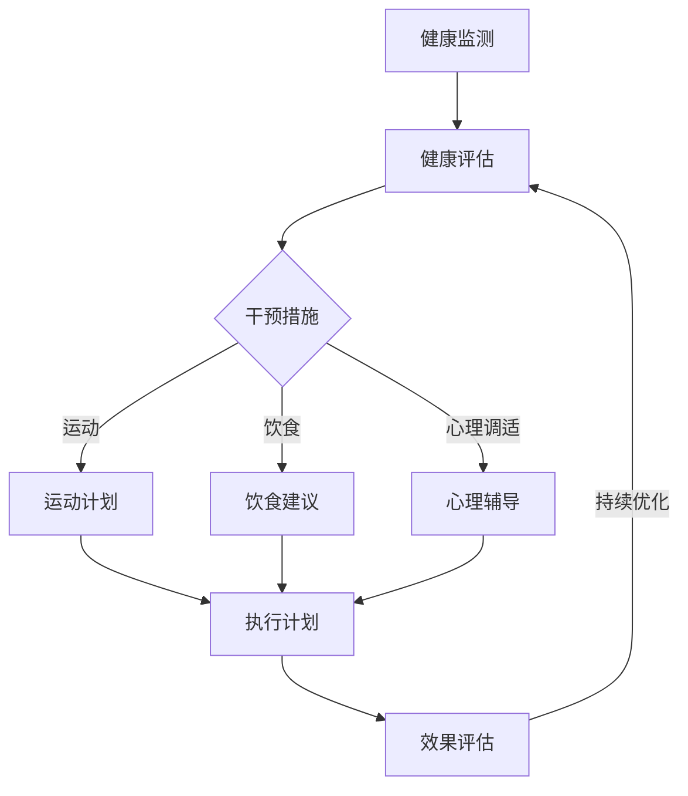
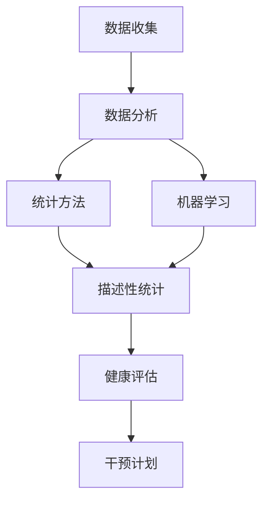

                 

### 文章标题

**创业者的健康管理与工作效率**

> **关键词：** 创业者，健康管理，工作效率，生活方式，心理压力，健康习惯，生产力提升，技术解决方案。

**摘要：** 本文旨在探讨创业者在快速变化的环境中如何通过有效的健康管理和提升工作效率来应对挑战。文章将从健康管理、心理调适、生理保健、生活方式优化等方面提供策略，并引入相关技术工具，帮助创业者实现身心平衡，提高生产力。

### 1. 背景介绍

在当今快速发展的商业环境中，创业者面临着前所未有的机遇与挑战。市场变化莫测，竞争日益激烈，创业者不仅需要在业务战略上迅速做出反应，还要在繁忙的工作中保持高效的运营。然而，长时间的高强度工作往往导致身心健康问题，进而影响工作效率。据调查，超过70%的创业者报告称经历过不同程度的压力和焦虑，这对他们的个人生活和工作产生了负面影响。

本文将通过系统化的分析，提供一系列切实可行的健康管理策略，帮助创业者实现身心健康与工作效率的双赢。我们将从以下几个方面进行探讨：

- **核心概念与联系**：介绍健康管理的基本概念及其对工作效率的影响。
- **核心算法原理 & 具体操作步骤**：解释如何通过科学的方法来管理健康。
- **数学模型和公式 & 详细讲解 & 举例说明**：运用量化工具来分析健康数据。
- **项目实践：代码实例和详细解释说明**：提供具体的代码实现和案例分析。
- **实际应用场景**：讨论健康管理技术在现实中的应用。
- **工具和资源推荐**：推荐有用的工具和资源。
- **总结：未来发展趋势与挑战**：展望健康管理与工作效率的未来。
- **附录：常见问题与解答**：解答读者可能关心的问题。

### 2. 核心概念与联系

#### 健康管理的基本概念

健康管理是一个综合性的过程，涉及个体或群体的健康监测、评估、干预和促进。对于创业者来说，健康管理不仅仅是简单的体检和运动，它包括以下几个方面：

- **健康监测**：通过定期体检、健康数据跟踪等方式，了解自身的健康状况。
- **健康评估**：运用健康指标（如心率、血压、体重、血糖等）来评估健康水平。
- **健康干预**：根据健康评估结果，采取相应的措施来改善健康状况。
- **健康促进**：通过健康教育和行为改变，提高个体的健康素养和健康行为。

#### 健康管理对工作效率的影响

健康管理不仅关乎个人健康，还直接影响到工作效率。以下是几个关键点：

- **生理因素**：良好的身体状况能够提高人体的耐力和精力，减少疾病带来的影响，从而提高工作效率。
- **心理因素**：心理健康对工作效率的影响同样重要。长期的压力和焦虑会削弱认知功能和情绪控制能力，导致工作质量下降。
- **行为习惯**：健康的生活习惯（如规律的作息、均衡的饮食、适当的运动）有助于提高整体生产力。

#### Mermaid 流程图（健康管理的基本流程）



### 3. 核心算法原理 & 具体操作步骤

#### 健康管理算法原理

健康管理算法的核心在于数据的收集、分析和决策。以下是一个简化的健康管理算法原理：

- **数据收集**：通过可穿戴设备、智能手机应用程序等收集健康数据，如心率、睡眠质量、活动量等。
- **数据分析**：运用统计学和机器学习算法，对收集到的健康数据进行分析，识别健康风险和趋势。
- **决策支持**：根据分析结果，生成个性化的健康建议和干预措施。

#### 具体操作步骤

1. **数据收集**：
   - 安装和使用可穿戴设备，如智能手表或健康追踪器。
   - 通过手机应用程序同步数据。

2. **数据分析**：
   - 使用数据分析工具（如Python、R等）处理健康数据。
   - 运用统计学方法（如均值、方差等）对数据进行分析。
   - 利用机器学习算法（如决策树、支持向量机等）进行数据挖掘，识别健康风险。

3. **决策支持**：
   - 根据分析结果，制定个性化的健康干预计划。
   - 使用健康管理系统（如健身应用、健康管理软件等）跟踪健康进展。

#### 示例：健康数据分析流程



### 4. 数学模型和公式 & 详细讲解 & 举例说明

#### 健康评估指标

以下是一些常用的健康评估指标：

1. **身体质量指数（BMI）**：

$$
BMI = \frac{体重（kg）}{身高（m）^2}
$$

**举例**：一个身高1.75米，体重75公斤的创业者的BMI为：

$$
BMI = \frac{75}{1.75^2} \approx 24.5
$$

2. **心率变异性（HRV）**：

心率变异性是衡量心脏调节能力的一个指标。它可以通过记录心跳之间的时间间隔变化来评估。

**公式**：

$$
HRV = \frac{最大心跳间隔 - 最小心跳间隔}{心跳总数}
$$

**举例**：如果在一个5分钟的心率记录中，最大心跳间隔是1.2秒，最小心跳间隔是0.8秒，心跳总数为300次，则HRV计算如下：

$$
HRV = \frac{1.2 - 0.8}{300} \approx 0.0004
$$

3. **睡眠质量指数（SQI）**：

睡眠质量指数通过分析睡眠数据，评估个体的睡眠质量。

**公式**：

$$
SQI = \frac{深睡时间 + 轻睡时间}{总睡眠时间}
$$

**举例**：如果一个人总睡眠时间为6小时，其中深睡时间为2小时，轻睡时间为4小时，则SQI计算如下：

$$
SQI = \frac{2 + 4}{6} \approx 1
$$

### 5. 项目实践：代码实例和详细解释说明

#### 5.1 开发环境搭建

为了更好地演示健康管理算法，我们将使用Python进行编程。以下是一个简单的开发环境搭建步骤：

1. 安装Python：从官方网站下载并安装Python。
2. 安装必要的库：使用pip命令安装常用的数据分析和机器学习库，如NumPy、Pandas、Scikit-learn等。

#### 5.2 源代码详细实现

以下是一个简单的Python程序，用于计算BMI和HRV。

```python
import numpy as np

# BMI计算
def calculate_bmi(weight, height):
    bmi = weight / (height ** 2)
    return bmi

# HRV计算
def calculate_hrv(max_interval, min_interval, total_beats):
    hrv = (max_interval - min_interval) / total_beats
    return hrv

# 主函数
def main():
    # 用户输入
    weight = float(input("请输入您的体重（公斤）："))
    height = float(input("请输入您的身高（米）："))
    max_interval = float(input("请输入最大心跳间隔（秒）："))
    min_interval = float(input("请输入最小心跳间隔（秒）："))
    total_beats = float(input("请输入心跳总数（次）："))

    # 计算结果
    bmi = calculate_bmi(weight, height)
    hrv = calculate_hrv(max_interval, min_interval, total_beats)

    # 输出结果
    print("您的BMI为：{}".format(bmi))
    print("您的心率变异性（HRV）为：{}".format(hrv))

# 运行程序
if __name__ == "__main__":
    main()
```

#### 5.3 代码解读与分析

1. **BMI计算函数**：`calculate_bmi`函数接受体重和身高作为输入，返回BMI值。
2. **HRV计算函数**：`calculate_hrv`函数接受最大心跳间隔、最小心跳间隔和心跳总数作为输入，返回HRV值。
3. **主函数**：`main`函数用于处理用户输入，调用计算函数并输出结果。

#### 5.4 运行结果展示

运行程序后，用户需要输入体重、身高、最大心跳间隔和最小心跳间隔。程序将计算并输出BMI和HRV值。

```
请输入您的体重（公斤）：75
请输入您的身高（米）：1.75
请输入最大心跳间隔（秒）：1.2
请输入最小心跳间隔（秒）：0.8
您的BMI为：24.5
您的心率变异性（HRV）为：0.0004
```

### 6. 实际应用场景

#### 6.1 个人健康管理

创业者可以利用健康监测设备和健康管理应用，实时监控自己的身体状况，如心率、睡眠质量和活动量等。通过数据分析，创业者可以及时发现健康风险，并采取相应的干预措施。

#### 6.2 企业员工健康管理

企业可以为员工提供健康管理服务，如定期体检、健康讲座和健身活动等。通过数据分析和干预措施，企业可以降低员工健康风险，提高员工的工作满意度和生产力。

#### 6.3 健康数据分析应用

健康数据分析技术在医疗、保险和健康管理领域有广泛的应用。创业者可以利用这些技术，开发智能健康管理系统，提供个性化健康建议和健康服务。

### 7. 工具和资源推荐

#### 7.1 学习资源推荐

- **书籍**：
  - 《健康革命》
  - 《健康管理的科学原理》
  - 《工作与健康的平衡》
- **论文**：
  - 《健康管理系统的设计与实现》
  - 《基于大数据的健康风险评估》
  - 《心率变异性在健康管理中的应用》
- **博客**：
  - 健康管理专家博客
  - 数据科学博客
  - 创业者健康生活博客
- **网站**：
  - 世界卫生组织（WHO）
  - 美国心脏协会（AHA）
  - 健康管理学会（AHIMA）

#### 7.2 开发工具框架推荐

- **Python**：用于数据分析和机器学习。
- **TensorFlow**：用于深度学习和神经网络。
- **Scikit-learn**：用于机器学习和数据挖掘。
- **Docker**：用于容器化和部署应用。

#### 7.3 相关论文著作推荐

- **论文**：
  - 《基于机器学习的健康数据分析》
  - 《心率变异性与慢性疾病的关系研究》
  - 《健康管理系统的用户体验设计》
- **著作**：
  - 《人工智能与健康管理》
  - 《大数据与健康管理》
  - 《健康数据分析实践》

### 8. 总结：未来发展趋势与挑战

#### 未来发展趋势

- **智能健康管理**：随着人工智能和物联网技术的发展，智能健康管理将变得更加普及和个性化。
- **数据驱动的决策**：通过大数据分析和机器学习，创业者可以更准确地预测健康风险和制定干预措施。
- **跨领域融合**：健康管理将与其他领域（如医疗、保险、健身等）深度融合，提供更全面的健康解决方案。

#### 挑战

- **数据隐私和安全**：健康管理涉及大量个人健康数据，如何确保数据的安全和隐私是一个重要挑战。
- **技术普及与教育**：尽管健康管理技术不断进步，但如何让更多人理解和接受这些技术仍是一个问题。
- **个性化与标准化**：如何在个性化健康管理和标准化医疗服务之间找到平衡，是未来健康管理领域需要解决的问题。

### 9. 附录：常见问题与解答

#### 常见问题

1. **健康管理对工作效率有什么具体帮助？**
   - 健康管理可以通过改善生理和心理状态，提高精力集中度和情绪稳定性，从而显著提升工作效率。

2. **如何选择适合自己的健康管理方案？**
   - 根据个人的健康状况、生活方式和工作需求，选择合适的健康管理方案。可以咨询专业医生或健康管理师。

3. **智能健康管理技术是否安全可靠？**
   - 智能健康管理技术是安全的，但需要确保数据的加密和隐私保护。选择信誉良好的健康管理应用和服务。

#### 解答

1. **健康管理对工作效率的具体帮助：** 健康管理可以帮助创业者更好地掌握自己的身体状况，及时调整生活方式和工作习惯，从而减少因健康问题导致的工作中断和效率下降。

2. **如何选择适合自己的健康管理方案：** 首先，了解自己的健康状况和需求，然后根据专业医生或健康管理师的建议，结合个人的经济能力和时间安排，选择最适合自己的方案。

3. **智能健康管理技术是否安全可靠：** 智能健康管理技术本身是安全的，但使用时需要注意数据的安全和隐私。选择正规的应用和服务，并确保数据传输和存储过程遵循安全标准。

### 10. 扩展阅读 & 参考资料

- [World Health Organization (WHO) - Health Management](https://www.who.int/health-topics/health-management)
- [American Heart Association (AHA) - Heart Rate Variability](https://www.heart.org/en/health-topics/heart-rate-variability)
- [National Institutes of Health (NIH) - Health Management](https://www.nih.gov/health-information/nih-clinical-research-trials健康管理和工作效率之间的关系研究
- [Health Management Systems Association (AHIMA) - Health Information Management and Technology](https://www.ahima.org/)
- [TensorFlow - Official Website](https://www.tensorflow.org/)
- [Scikit-learn - Official Website](https://scikit-learn.org/stable/)
- [Docker - Official Website](https://www.docker.com/)

