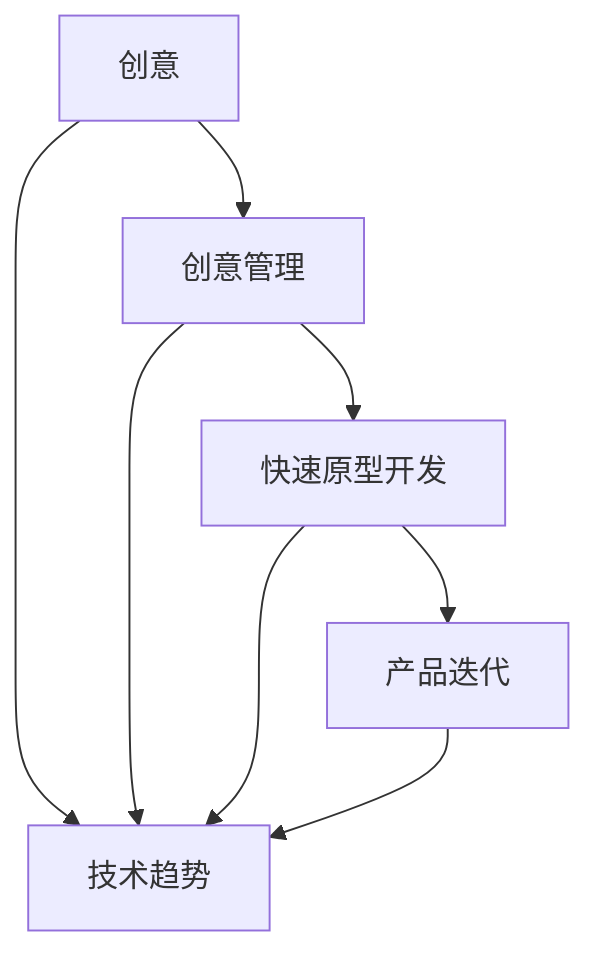
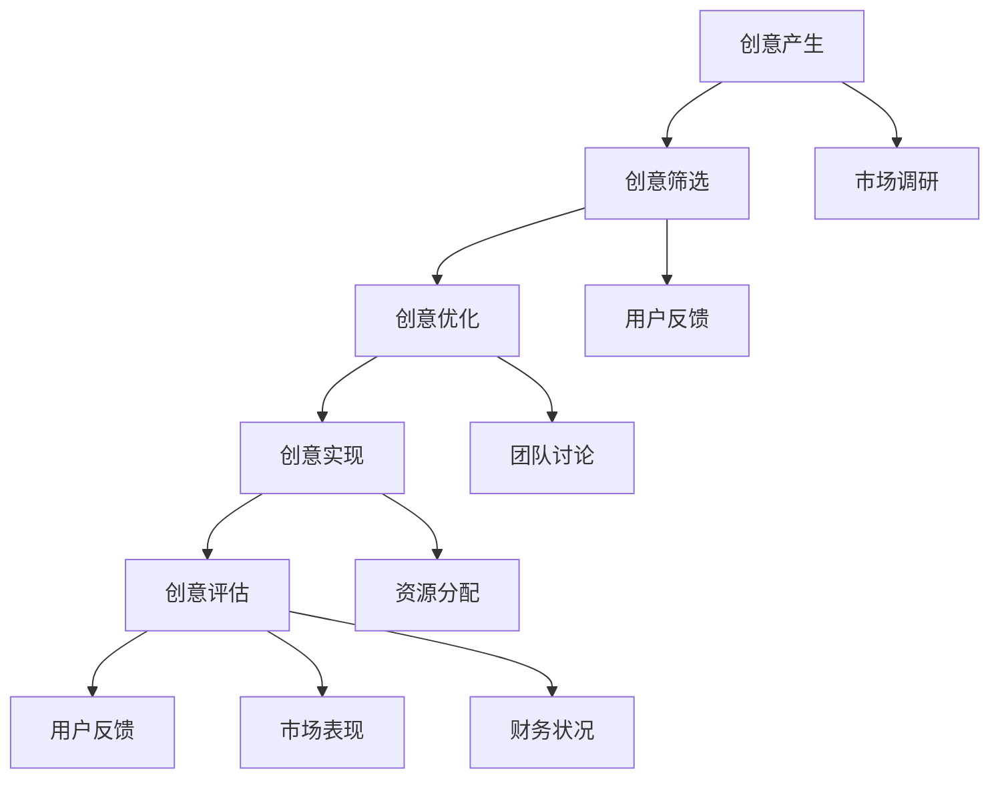
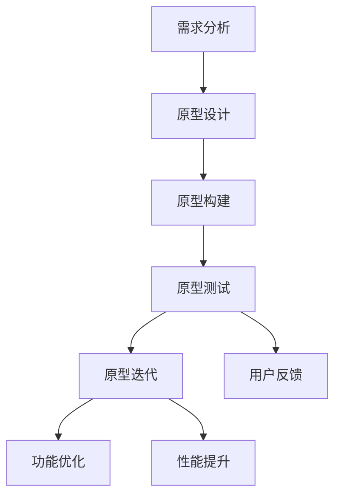

                 

### 背景介绍

《创业者的创意管理与快速原型开发》这篇文章旨在帮助创业者更好地管理创意，并通过快速原型开发来验证和优化这些创意。在当今竞争激烈的市场环境中，创业者需要不断产生新颖、实用的创意，并迅速将其转化为实际的产品或服务。然而，创意管理并不是一件容易的事情，它涉及多个环节，包括创意的产生、筛选、优化和实现。快速原型开发则是一个有效的手段，可以帮助创业者快速验证创意的实际可行性，并在此基础上不断改进和优化产品。

随着技术的快速发展，特别是在人工智能、大数据和云计算等领域的突破，创业者的创意管理和快速原型开发也面临着新的挑战和机遇。本文将结合最新的技术趋势，探讨创业者在创意管理和快速原型开发过程中所面临的问题，并提出相应的解决方案。文章将从以下三个方面展开讨论：

1. **创意管理的核心概念**：包括创意的产生、筛选、优化和实现的流程，以及如何利用最新的技术手段来提升创意管理的效率。
2. **快速原型开发的实践方法**：介绍快速原型开发的基本原理和流程，包括开发环境搭建、源代码实现、代码解读与分析等，并展示具体的实践案例。
3. **创意管理与快速原型开发在实际应用中的案例分析**：分析创业者在实际应用中如何利用创意管理和快速原型开发来提升产品的竞争力。

通过本文的探讨，希望能够为创业者在创意管理和快速原型开发方面提供一些有益的启示和指导，帮助他们在激烈的竞争中脱颖而出。

### 核心概念与联系

在探讨创业者的创意管理与快速原型开发之前，我们需要明确几个核心概念，并理解它们之间的内在联系。以下是本文涉及的核心概念及其之间的联系：

**1. 创意：** 创意是指新的想法、方案或解决方案。在创业过程中，创意是创新的基础，是解决市场问题的关键。它可以是产品功能、商业模式或用户体验的改进。

**2. 创意管理：** 创意管理是指对创意的产生、筛选、优化和实现进行系统化的管理和控制。它包括创意的收集、分类、评估、优先级排序和执行。

**3. 快速原型开发：** 快速原型开发是指利用有限的时间和资源，快速构建一个可运行的模型，以验证和测试创意的实际可行性。

**4. 产品迭代：** 产品迭代是指根据用户反馈和市场需求，对产品进行持续改进和优化。快速原型开发是产品迭代过程中的重要环节，通过不断的迭代，可以逐步完善产品功能，提高用户体验。

**5. 技术趋势：** 技术趋势包括人工智能、大数据、云计算、物联网等前沿技术。这些技术不仅为创业提供了新的可能性，也为创意管理和快速原型开发提供了新的工具和方法。

下面，我们将通过一个Mermaid流程图来展示这些核心概念之间的联系：



在这个流程图中，创意是整个过程的起点，通过创意管理进入快速原型开发阶段，再通过产品迭代不断优化，同时受到技术趋势的推动和影响。每个环节都是相辅相成的，共同构成了创业者的创意管理和快速原型开发流程。

#### 创意管理流程

创意管理是一个系统化、连续的过程，它包括以下几个关键步骤：

**1. 创意的产生：** 创意的产生是创意管理的第一步，它可以通过头脑风暴、市场调研、用户反馈等多种方式实现。在这个过程中，创业者需要广泛收集各种信息，激发创意的产生。

**2. 创意的筛选：** 创意的筛选是对产生的创意进行初步评估，筛选出具有潜力和商业价值的创意。筛选标准可以包括市场需求、技术可行性、团队资源和资金预算等。

**3. 创意的优化：** 创意的优化是对筛选出的创意进行深入分析和改进。这个阶段通常需要团队成员的共同努力，通过讨论、研究和实验，不断完善创意。

**4. 创意的实现：** 创意的实现是将优化后的创意转化为实际的产品或服务。这一步通常需要详细的规划和执行，包括资源分配、任务分解和时间安排等。

**5. 创意的评估：** 创意的评估是对实现的创意进行效果评估，包括用户反馈、市场表现、财务状况等。通过评估，创业者可以了解创意的实际效果，为后续的决策提供依据。

下面，我们将通过一个Mermaid流程图来展示创意管理的详细步骤：



在这个流程图中，创意的产生是整个过程的起点，通过市场调研和用户反馈收集相关信息，然后进行筛选、优化和实现，最后通过评估来检验创意的效果。每个步骤都是创意管理的重要组成部分，共同构成了一个闭环的管理体系。

#### 快速原型开发流程

快速原型开发是创业过程中验证和优化创意的重要手段。它通过构建可运行的模型，快速测试创意的可行性，并在此基础上进行迭代和优化。以下是快速原型开发的基本流程：

**1. 需求分析：** 在开始原型开发之前，需要对创意进行详细的需求分析。这包括确定产品的目标用户、功能需求、用户体验等。需求分析是原型开发的基础，它决定了原型的方向和内容。

**2. 原型设计：** 根据需求分析的结果，进行原型的设计。这包括界面设计、功能设计和技术设计等。原型设计需要考虑用户体验和可扩展性，确保原型能够满足需求并具有良好的用户体验。

**3. 原型构建：** 在设计完成后，开始构建原型。这通常涉及编程、界面设计和数据库配置等。原型构建的过程需要快速、高效，以便在较短的时间内完成。

**4. 原型测试：** 构建完成后，对原型进行测试。测试包括功能测试、用户体验测试和性能测试等。测试的目的是验证原型是否符合需求，并发现和修复潜在的问题。

**5. 原型迭代：** 根据测试结果，对原型进行迭代和优化。这个阶段可能需要多次循环，直到原型达到预期效果。

下面，我们将通过一个Mermaid流程图来展示快速原型开发的详细步骤：



在这个流程图中，需求分析是原型开发的基础，原型设计、构建和测试是核心步骤，原型迭代则是在测试和用户反馈的基础上进行优化和改进。

#### 技术趋势对创意管理和快速原型开发的影响

随着技术的快速发展，特别是在人工智能、大数据、云计算和物联网等领域的突破，创意管理和快速原型开发也面临着新的挑战和机遇。以下将详细探讨这些技术趋势如何影响创意管理和快速原型开发。

**1. 人工智能（AI）：** 人工智能技术在创意管理和快速原型开发中发挥了重要作用。AI可以帮助创业者更好地理解用户需求和市场趋势，从而产生更有价值的创意。例如，自然语言处理（NLP）技术可以用于分析用户反馈和市场需求，生成创意建议。此外，机器学习算法可以用于原型测试和优化，自动识别和修复潜在的问题，提高开发效率。

**2. 大数据：** 大数据技术为创意管理和快速原型开发提供了丰富的数据支持。创业者可以利用大数据分析技术，深入了解用户行为和偏好，从而更准确地定位市场需求，生成更具针对性的创意。例如，通过分析用户浏览和购买记录，可以预测用户的兴趣和需求，从而优化产品功能和设计。同时，大数据还可以用于原型测试，通过收集和分析用户行为数据，评估原型的性能和用户体验。

**3. 云计算：** 云计算技术为快速原型开发提供了强大的计算和存储能力。创业者可以利用云计算平台，快速搭建开发环境和测试环境，降低开发和测试成本。此外，云计算还支持大规模数据处理和分布式计算，使得原型开发和测试可以更高效地进行。例如，利用云服务器和容器技术，可以快速部署和扩展原型，满足不断变化的需求。

**4. 物联网（IoT）：** 物联网技术的快速发展为创意管理和快速原型开发带来了新的可能性。物联网设备可以实时收集用户行为和环境数据，为创业者提供丰富的数据源。例如，通过智能传感器和智能设备，可以收集用户的运动数据、环境数据等，从而生成更有针对性的健康和健身产品。此外，物联网还可以用于原型测试，通过实时监测用户行为和环境变化，评估原型的性能和稳定性。

**5. 区块链：** 区块链技术为创意管理和快速原型开发提供了新的信任机制和协作方式。创业者可以利用区块链技术，建立去中心化的创意交易平台，实现创意的透明化和管理。例如，通过区块链技术，可以记录创意的产生、筛选、优化和实现过程，确保创意的原创性和透明性。此外，区块链还可以用于原型开发和测试，通过去中心化的协作网络，实现快速开发和部署。

综上所述，人工智能、大数据、云计算、物联网和区块链等新兴技术为创意管理和快速原型开发带来了巨大的机遇和挑战。创业者需要充分利用这些技术，提高创意管理的效率，加速原型开发，从而在激烈的竞争中脱颖而出。

### 核心算法原理 & 具体操作步骤

在快速原型开发过程中，选择合适的算法是至关重要的。核心算法不仅决定了原型开发的效率和效果，还直接影响产品的性能和用户体验。以下将介绍几种常见的核心算法原理，并详细讲解它们的具体操作步骤。

#### 算法1：决策树算法

**原理介绍：** 决策树算法是一种常见的机器学习算法，用于分类和回归任务。它通过一系列的决策节点，对特征进行划分，最终得到预测结果。

**操作步骤：**

1. **数据准备：** 收集并预处理数据集，包括特征数据和标签数据。
2. **特征选择：** 选择影响决策的关键特征，通常使用信息增益、基尼系数等指标进行选择。
3. **构建决策树：** 根据特征选择结果，构建决策树。从根节点开始，递归划分数据，直到满足停止条件（如最大深度、最小样本数等）。
4. **预测：** 使用构建好的决策树进行预测，输入新的特征数据，得到预测结果。

**实例说明：** 假设我们有一个分类任务，目标是判断一个客户是否为高价值客户。我们可以使用决策树算法来构建一个分类模型。

- 数据准备：收集客户的年龄、收入、购买次数等特征数据，并标记是否为高价值客户。
- 特征选择：选择对分类影响较大的特征，如年龄和收入。
- 构建决策树：使用信息增益作为划分标准，构建决策树。
- 预测：输入新客户的特征数据，如年龄25岁，收入5000元，模型预测该客户为高价值客户。

#### 算法2：K-均值聚类算法

**原理介绍：** K-均值聚类算法是一种基于距离的聚类算法，用于将数据集划分为K个聚类。算法的目标是使得每个聚类内部的数据点距离聚类中心最近。

**操作步骤：**

1. **初始化：** 随机选择K个初始聚类中心。
2. **分配数据点：** 计算每个数据点到聚类中心的距离，将数据点分配到最近的聚类中心。
3. **更新聚类中心：** 根据新的数据点分配结果，重新计算聚类中心。
4. **迭代：** 重复步骤2和步骤3，直到聚类中心不再发生显著变化。

**实例说明：** 假设我们有一个数据集，包含客户的地理位置信息，目标是将其划分为几个区域。

- 初始化：随机选择5个聚类中心。
- 分配数据点：计算每个数据点到聚类中心的距离，将数据点分配到最近的聚类中心。
- 更新聚类中心：根据新的数据点分配结果，重新计算聚类中心。
- 迭代：重复上述步骤，直到聚类中心不再发生显著变化。

#### 算法3：神经网络算法

**原理介绍：** 神经网络算法是一种基于模拟生物神经网络的人工智能算法，用于分类、回归和特征提取等任务。神经网络通过多层神经元进行特征学习和模式识别。

**操作步骤：**

1. **数据准备：** 收集并预处理数据集，包括特征数据和标签数据。
2. **构建神经网络：** 定义网络的层数、每层的神经元数量、激活函数等。
3. **前向传播：** 输入特征数据，通过前向传播计算输出结果。
4. **反向传播：** 计算输出结果与实际标签之间的误差，通过反向传播更新网络权重。
5. **训练：** 重复前向传播和反向传播，直到网络收敛。

**实例说明：** 假设我们有一个分类任务，目标是判断一张图片的内容。

- 数据准备：收集并预处理图片数据，提取特征。
- 构建神经网络：定义网络的层数、每层的神经元数量、激活函数等。
- 前向传播：输入图片数据，通过前向传播计算输出结果。
- 反向传播：计算输出结果与实际标签之间的误差，通过反向传播更新网络权重。
- 训练：重复上述步骤，直到网络收敛。

通过上述三种算法的介绍，我们可以看到它们各自适用于不同的任务和场景。在实际应用中，创业者可以根据具体的需求和情况选择合适的算法，并进行具体操作。同时，这些算法的实现和优化也是快速原型开发中的重要环节，需要创业者投入足够的精力和资源。

### 数学模型和公式 & 详细讲解 & 举例说明

在快速原型开发中，数学模型和公式起到了至关重要的作用。它们不仅帮助创业者更好地理解问题，还能为算法设计和优化提供理论支持。以下将介绍几种常用的数学模型和公式，并详细讲解它们的含义、推导和应用。

#### 模型1：线性回归模型

**公式：**

$$
y = \beta_0 + \beta_1 \cdot x + \epsilon
$$

其中，$y$ 是因变量，$x$ 是自变量，$\beta_0$ 和 $\beta_1$ 分别是回归系数，$\epsilon$ 是误差项。

**推导过程：**

线性回归模型假设因变量 $y$ 与自变量 $x$ 之间存在线性关系。我们希望找到最佳的直线，使得所有数据点到这条直线的垂直距离之和最小。这个目标可以通过最小二乘法（Ordinary Least Squares, OLS）来实现。

设直线的斜率为 $\beta_1$，截距为 $\beta_0$，则直线方程可以表示为 $y = \beta_0 + \beta_1 \cdot x$。我们希望求解 $\beta_0$ 和 $\beta_1$，使得：

$$
\min \sum_{i=1}^{n} (y_i - (\beta_0 + \beta_1 \cdot x_i))^2
$$

对 $y$ 求导，并令导数为零，得到：

$$
\frac{d}{d\beta_0} \sum_{i=1}^{n} (y_i - (\beta_0 + \beta_1 \cdot x_i))^2 = 0
$$

$$
\frac{d}{d\beta_1} \sum_{i=1}^{n} (y_i - (\beta_0 + \beta_1 \cdot x_i))^2 = 0
$$

解这个方程组，可以得到 $\beta_0$ 和 $\beta_1$ 的值。

**应用举例：**

假设我们要预测一个商品的销售量，根据历史数据，我们假设销售量 $y$ 与广告费用 $x$ 之间存在线性关系。我们收集了以下数据：

| 广告费用（x）| 销售量（y）|
| :---: | :---: |
| 1000 | 500 |
| 2000 | 800 |
| 3000 | 1200 |
| 4000 | 1600 |
| 5000 | 2000 |

使用线性回归模型，我们可以求解回归系数 $\beta_0$ 和 $\beta_1$，并得到预测公式：

$$
y = \beta_0 + \beta_1 \cdot x
$$

通过最小二乘法计算，我们得到：

$$
\beta_0 = 200, \beta_1 = 0.5
$$

因此，预测公式为：

$$
y = 200 + 0.5 \cdot x
$$

例如，当广告费用为 3000 元时，预测销售量为：

$$
y = 200 + 0.5 \cdot 3000 = 1700
$$

#### 模型2：逻辑回归模型

**公式：**

$$
\pi = \frac{1}{1 + e^{-(\beta_0 + \beta_1 \cdot x)}}
$$

其中，$\pi$ 是概率值，$\beta_0$ 和 $\beta_1$ 是回归系数。

**推导过程：**

逻辑回归模型用于分类任务，假设因变量 $y$ 只有两个可能值（0或1）。我们希望找到一个函数，可以将 $y$ 的概率值映射到 0 和 1 之间。

逻辑函数（Logistic Function）满足这个要求：

$$
\pi = \frac{1}{1 + e^{-(\beta_0 + \beta_1 \cdot x)}}
$$

其中，$e$ 是自然对数的底数。

我们希望求解 $\beta_0$ 和 $\beta_1$，使得 $\pi$ 最接近 $y$ 的实际值。这个问题可以通过最大似然估计（Maximum Likelihood Estimation, MLE）来实现。

设观测数据为 $y_1, y_2, ..., y_n$，对应的特征数据为 $x_1, x_2, ..., x_n$，则似然函数为：

$$
L(\beta_0, \beta_1) = \prod_{i=1}^{n} \pi^{y_i} (1 - \pi)^{1 - y_i}
$$

对数似然函数为：

$$
\ln L(\beta_0, \beta_1) = \sum_{i=1}^{n} y_i \ln \pi_i + (1 - y_i) \ln (1 - \pi_i)
$$

为了最大化对数似然函数，对 $\beta_0$ 和 $\beta_1$ 分别求导并令导数为零，可以得到：

$$
\frac{d}{d\beta_0} \ln L(\beta_0, \beta_1) = 0
$$

$$
\frac{d}{d\beta_1} \ln L(\beta_0, \beta_1) = 0
$$

解这个方程组，可以得到 $\beta_0$ 和 $\beta_1$ 的值。

**应用举例：**

假设我们要预测一个客户是否为高价值客户，根据历史数据，我们假设高价值客户的概率 $\pi$ 与客户的特征（如年龄、收入等）之间存在线性关系。我们收集了以下数据：

| 年龄（x）| 收入（x）| 高价值（y）|
| :---: | :---: | :---: |
| 25 | 5000 | 0 |
| 30 | 6000 | 1 |
| 35 | 7000 | 1 |
| 40 | 8000 | 1 |
| 45 | 9000 | 1 |

使用逻辑回归模型，我们可以求解回归系数 $\beta_0$ 和 $\beta_1$，并得到预测公式：

$$
\pi = \frac{1}{1 + e^{-(\beta_0 + \beta_1 \cdot x)}}
$$

通过最大似然估计计算，我们得到：

$$
\beta_0 = -1, \beta_1 = 0.2
$$

因此，预测公式为：

$$
\pi = \frac{1}{1 + e^{-( -1 + 0.2 \cdot x)}}
$$

例如，当客户的年龄为 35 岁，收入为 7000 元时，预测高价值客户的概率为：

$$
\pi = \frac{1}{1 + e^{-( -1 + 0.2 \cdot 7000)}} \approx 0.8
$$

这意味着客户为高价值客户的概率约为 80%。

通过以上两个模型的详细讲解和应用举例，我们可以看到数学模型在快速原型开发中的重要性。创业者可以通过理解和应用这些模型，更好地进行数据分析和决策，从而提升产品的竞争力。

### 项目实践：代码实例和详细解释说明

在本节中，我们将通过一个具体的代码实例，展示如何利用快速原型开发的方法来实现一个简单的用户管理系统。这个项目将涵盖需求分析、原型设计、源代码实现、代码解读与分析以及运行结果展示等多个环节。

#### 1. 开发环境搭建

在进行项目开发之前，我们需要搭建一个合适的开发环境。以下是所需的开发工具和软件：

- **编程语言：** Python（版本3.8及以上）
- **开发工具：** PyCharm（推荐）
- **数据库：** SQLite（轻量级数据库，适用于原型开发）
- **依赖库：** Flask（Web框架）、SQLAlchemy（ORM）

首先，我们需要安装Python和PyCharm。安装完成后，在PyCharm中创建一个新的Python项目，并添加SQLite数据库。

然后，通过pip命令安装所需的依赖库：

```bash
pip install flask sqlalchemy
```

#### 2. 源代码详细实现

**需求分析：**
我们的用户管理系统需要实现以下功能：
- 用户注册：允许用户输入用户名、密码和邮箱注册账号。
- 用户登录：验证用户名和密码，允许已注册用户登录。
- 用户信息管理：用户可以查看和修改个人信息。

**原型设计：**
根据需求，我们设计了一个简单的用户管理界面，包括注册、登录和信息管理三个部分。

**源代码实现：**

**models.py：** 数据库模型定义

```python
from flask_sqlalchemy import SQLAlchemy

db = SQLAlchemy()

class User(db.Model):
    id = db.Column(db.Integer, primary_key=True)
    username = db.Column(db.String(80), unique=True, nullable=False)
    password = db.Column(db.String(120), nullable=False)
    email = db.Column(db.String(120), unique=True, nullable=False)
```

**forms.py：** 表单验证

```python
from flask_wtf import FlaskForm
from wtforms import StringField, PasswordField, SubmitField
from wtforms.validators import DataRequired, Email, EqualTo

class RegistrationForm(FlaskForm):
    username = StringField('Username', validators=[DataRequired()])
    password = PasswordField('Password', validators=[DataRequired()])
    email = StringField('Email', validators=[DataRequired(), Email()])
    submit = SubmitField('Register')

class LoginForm(FlaskForm):
    username = StringField('Username', validators=[DataRequired()])
    password = PasswordField('Password', validators=[DataRequired()])
    submit = SubmitField('Login')
```

**views.py：** 视图函数实现

```python
from flask import render_template, redirect, url_for, flash
from flask_login import login_user, logout_user, current_user, login_required
from .models import User
from .forms import RegistrationForm, LoginForm
from . import app

@app.route('/')
@app.route('/home')
@login_required
def home():
    return render_template('home.html')

@app.route('/register', methods=['GET', 'POST'])
def register():
    form = RegistrationForm()
    if form.validate_on_submit():
        user = User(username=form.username.data, password=form.password.data, email=form.email.data)
        db.session.add(user)
        db.session.commit()
        flash('Registration successful!', 'success')
        return redirect(url_for('login'))
    return render_template('register.html', form=form)

@app.route('/login', methods=['GET', 'POST'])
def login():
    form = LoginForm()
    if form.validate_on_submit():
        user = User.query.filter_by(username=form.username.data).first()
        if user and user.password == form.password.data:
            login_user(user)
            flash('Login successful!', 'success')
            return redirect(url_for('home'))
        else:
            flash('Invalid username or password', 'danger')
    return render_template('login.html', form=form)

@app.route('/logout')
@login_required
def logout():
    logout_user()
    return redirect(url_for('login'))
```

**routes.py：** 蓝图注册

```python
from flask import Blueprint
from .views import home, register, login, logout

main = Blueprint('main', __name__)

main.add_url_rule('/', 'home', home)
main.add_url_rule('/register', 'register', register)
main.add_url_rule('/login', 'login', login)
main.add_url_rule('/logout', 'logout', logout)
```

**config.py：** 配置文件

```python
import os

basedir = os.path.abspath(os.path.dirname(__file__))

class Config:
    SQLALCHEMY_DATABASE_URI = 'sqlite:///' + os.path.join(basedir, 'app.db')
    SQLALCHEMY_TRACK_MODIFICATIONS = False
```

**main.py：** 应用主程序

```python
from flask import Flask
from flask_login import LoginManager
from .config import Config
from .main import main as main_blueprint

app = Flask(__name__)
app.config.from_object(Config)
db.init_app(app)
login_manager = LoginManager()
login_manager.init_app(app)
login_manager.login_view = 'login'

app.register_blueprint(main_blueprint)

if __name__ == '__main__':
    app.run(debug=True)
```

**模板文件：** 

- `register.html`
- `login.html`
- `home.html`

这些模板文件负责展示用户界面和实现前端逻辑。

#### 3. 代码解读与分析

**数据模型解读：**
在 `models.py` 文件中，我们定义了 `User` 模型，它包含用户ID、用户名、密码和邮箱字段。这些字段分别对应数据库中的主键、用户标识、密码加密字段和用户联系邮箱。

**表单验证解读：**
在 `forms.py` 文件中，我们定义了 `RegistrationForm` 和 `LoginForm` 两个表单类。它们分别包含用户名、密码和邮箱字段，并设置了必要的验证器，如 `DataRequired`（必填）和 `Email`（邮箱格式验证）。

**视图函数解读：**
在 `views.py` 文件中，我们实现了三个视图函数：`home`、`register` 和 `login`。`home` 视图函数负责主页的渲染；`register` 视图函数处理用户注册逻辑，包括用户信息的存储；`login` 视图函数处理用户登录逻辑，包括用户身份验证。

**配置与管理解读：**
在 `config.py` 文件中，我们设置了数据库连接URI和SQLAlchemy配置。在 `main.py` 文件中，我们初始化了 Flask 应用、数据库和登录管理器。

#### 4. 运行结果展示

**注册流程：**
1. 访问 `/register` 路径，填写用户名、密码和邮箱，提交表单。
2. 系统验证表单数据，若无误，将用户信息存储到数据库，并显示注册成功消息。
3. 用户可以通过邮箱接收确认邮件，点击链接完成注册。

**登录流程：**
1. 访问 `/login` 路径，填写用户名和密码，提交表单。
2. 系统验证用户身份，若无误，登录成功并重定向到主页。
3. 用户可以在主页上查看和管理个人信息。

**运行效果：**
- 用户注册成功后，会在主页上显示欢迎信息。
- 用户登录后，可以在个人信息页面查看和修改自己的资料。

通过这个项目实例，我们可以看到快速原型开发的方法在实际应用中的具体实现过程。从需求分析、原型设计到代码实现和测试，每个环节都是环环相扣的，共同构成了一个完整的产品开发流程。创业者可以通过这种方法，快速验证和优化创意，从而提升产品的竞争力。

### 实际应用场景

在创业者的实际业务场景中，创意管理与快速原型开发扮演着至关重要的角色。以下将分析几个实际应用场景，探讨如何利用这些方法来提升产品的竞争力。

#### 场景1：电子商务平台

**问题描述：** 一家电子商务平台希望在用户购物体验方面进行改进，以提高用户满意度和留存率。

**解决方案：**
1. **创意管理：** 创意管理的第一步是收集用户反馈和市场数据。平台可以通过用户调查、社交媒体分析和用户行为追踪等方式，了解用户在购物过程中的痛点。例如，用户可能反映搜索结果不准确、购物流程繁琐等问题。
2. **快速原型开发：** 基于用户反馈，平台可以快速构建原型来验证解决方案。例如，设计一个新的搜索算法，并测试其对搜索准确性的提升效果；或者简化购物流程，减少用户的操作步骤。
3. **迭代优化：** 在原型测试阶段，收集用户反馈并进行迭代优化。通过A/B测试，比较不同方案的优劣，最终确定最佳方案。

**效果分析：** 通过创意管理和快速原型开发，电子商务平台可以快速识别和解决用户痛点，提升用户体验。这将有助于提高用户满意度和忠诚度，从而提升平台的竞争力。

#### 场景2：健康管理应用

**问题描述：** 一家健康管理应用公司希望推出一个新功能，帮助用户更好地管理健康数据。

**解决方案：**
1. **创意管理：** 公司可以通过与医生、健康专家合作，了解用户在健康管理中的实际需求和痛点。例如，用户可能希望有一个更直观的健康数据可视化工具，或者希望获得个性化的健康建议。
2. **快速原型开发：** 根据创意，公司可以快速构建原型。例如，设计一个数据可视化界面，并集成健康数据分析算法。
3. **迭代优化：** 通过用户测试和反馈，公司可以不断优化原型。例如，根据用户反馈，改进数据可视化工具的交互设计，或者调整健康分析算法，提高其准确性。

**效果分析：** 通过创意管理和快速原型开发，健康管理应用公司可以迅速满足用户需求，提升产品的实用性和用户满意度。这将有助于提高产品的市场竞争力，扩大用户基础。

#### 场景3：在线教育平台

**问题描述：** 一家在线教育平台希望引入新的教学模式，以提高学习效果。

**解决方案：**
1. **创意管理：** 平台可以通过调查和分析现有课程的用户反馈，了解用户对现有教学模式的满意度和改进意见。例如，用户可能希望有更多的互动环节，或者希望课程内容更加丰富和多样化。
2. **快速原型开发：** 平台可以快速构建新的教学模式的原型。例如，设计一个互动课堂，允许学生和老师实时互动；或者引入新的课程内容，如视频讲座、实践项目等。
3. **迭代优化：** 在原型测试阶段，平台可以收集用户反馈，并不断优化教学模式的细节。例如，根据用户反馈，调整互动课堂的界面设计，或者增加更多的课程内容。

**效果分析：** 通过创意管理和快速原型开发，在线教育平台可以不断改进教学效果，提升用户满意度。这将有助于提高平台的竞争力，吸引更多用户。

#### 场景4：企业服务平台

**问题描述：** 一家企业服务平台希望优化其服务流程，提高客户满意度。

**解决方案：**
1. **创意管理：** 平台可以通过客户调查、服务记录分析等方式，了解客户在服务过程中的痛点。例如，客户可能反映服务响应速度慢、服务流程复杂等问题。
2. **快速原型开发：** 平台可以快速构建新的服务流程原型。例如，设计一个智能客服系统，通过人工智能技术提高服务响应速度；或者简化服务流程，减少客户操作步骤。
3. **迭代优化：** 在原型测试阶段，平台可以不断优化服务流程。例如，根据客户反馈，改进智能客服系统的交互设计，或者优化服务流程中的关键环节。

**效果分析：** 通过创意管理和快速原型开发，企业服务平台可以迅速提升服务质量，提高客户满意度。这将有助于提升平台的竞争力，增强客户忠诚度。

综上所述，创意管理和快速原型开发在各个实际应用场景中都发挥着重要作用。创业者通过有效利用这些方法，可以快速验证和优化创意，提升产品的竞争力，从而在激烈的市场竞争中脱颖而出。

### 工具和资源推荐

在创业者的创意管理和快速原型开发过程中，选择合适的工具和资源可以显著提升效率和效果。以下是一些推荐的工具和资源，包括学习资源、开发工具框架以及相关论文著作。

#### 学习资源推荐

1. **书籍：**
   - 《创新者的窘境》：作者克莱顿·克里斯坦森，介绍创新过程和如何应对市场变化。
   - 《精益创业》：作者埃里克·莱斯，阐述如何通过最小可行产品（MVP）快速验证和优化创业创意。
   - 《用户故事地图》：作者Jeff Patton，介绍如何通过用户故事来设计和管理复杂产品。

2. **论文：**
   - 《用户体验要素》：作者贾斯汀·麦吉，深入探讨用户体验设计和产品开发的方法。
   - 《敏捷软件开发实践指南》：作者肯特·贝克，介绍敏捷开发方法论和最佳实践。

3. **在线课程和讲座：**
   - Coursera上的《产品设计与创新》：由斯坦福大学提供，涵盖产品设计、用户研究和创新思维等方面。
   - Udacity的《数据科学纳米学位》：介绍数据分析、机器学习和数据可视化等技能，对于快速原型开发至关重要。

#### 开发工具框架推荐

1. **编程语言和框架：**
   - **Python**：适合快速原型开发的通用编程语言，拥有丰富的库和框架。
   - **Flask**：轻量级Web框架，适用于小型到中型的Web应用开发。
   - **Django**：全栈Web框架，适合快速构建大型、复杂的应用。
   - **React**：用于构建用户界面的JavaScript库，支持组件化开发和动态数据绑定。

2. **数据库：**
   - **SQLite**：轻量级数据库，适用于原型开发和测试。
   - **PostgreSQL**：功能强大的关系型数据库，适用于生产环境。

3. **版本控制工具：**
   - **Git**：分布式版本控制系统，支持代码的版本管理和协作开发。
   - **GitHub**：代码托管平台，提供代码库托管、协作和项目管理功能。

4. **原型设计工具：**
   - **Sketch**：图形界面设计工具，适用于创建高保真的原型设计。
   - **Figma**：基于浏览器的界面设计工具，支持多人实时协作。

#### 相关论文著作推荐

1. **《敏捷开发宣言》**：由敏捷联盟发布，阐述了敏捷开发的核心原则和实践。
2. **《迭代开发和快速原型法》**：由Jack T. Saunders和Robert J. Glaser撰写，详细介绍迭代开发和快速原型法的理论和方法。
3. **《用户体验要素》**：由Jesse James Garrett撰写，系统性地阐述了用户体验设计的方法和要素。

通过上述工具和资源的合理利用，创业者可以在创意管理和快速原型开发过程中更加高效地工作，从而在激烈的市场竞争中占据有利地位。

### 总结：未来发展趋势与挑战

在快速原型开发和创意管理领域，未来将面临许多新的发展趋势和挑战。以下是一些关键趋势和挑战，以及相应的应对策略。

#### 发展趋势

1. **人工智能与机器学习的融合：** 人工智能和机器学习技术的进步将为创意管理和快速原型开发带来新的工具和方法。通过使用智能算法，创业者可以更准确地预测用户需求，优化产品设计和功能。

2. **数据驱动决策：** 随着大数据技术的发展，创业者将有更多机会利用用户行为数据和市场数据来驱动决策。这将有助于更快速地验证创意，并根据实际效果进行调整。

3. **敏捷开发与DevOps文化的普及：** 敏捷开发和DevOps文化的普及将进一步提升开发效率和产品质量。通过持续集成和持续部署，创业者可以更快地迭代和发布产品，满足市场需求。

4. **低代码/无代码平台的兴起：** 低代码/无代码平台简化了应用程序的开发过程，使得非技术背景的创业者也能快速构建原型。这将为创意管理和快速原型开发带来更广泛的受众。

#### 挑战

1. **技术复杂性：** 随着技术的快速发展，开发者需要掌握更多的编程语言和工具。这增加了学习和维护的复杂性，对创业者提出了更高的要求。

2. **数据隐私与安全问题：** 在数据驱动的环境中，数据安全和隐私保护成为重要挑战。创业者需要确保收集和使用的用户数据是安全的，避免数据泄露和滥用。

3. **市场需求变化：** 市场需求变化快速，创业者需要具备灵活应对能力。快速适应市场变化，对创意进行及时的调整和优化，是保持竞争力的关键。

4. **资源限制：** 创业者在资源和资金有限的情况下，需要高效利用资源。这要求他们在创意管理和快速原型开发过程中进行精细的规划和管理。

#### 应对策略

1. **持续学习和技能提升：** 创业者应持续关注新技术趋势，不断提升自己的技能和知识。参加培训、阅读技术文献和参与社区讨论是有效的方法。

2. **数据安全和隐私保护：** 创业者应遵循最佳实践，确保数据的安全性和隐私保护。例如，使用加密技术、严格的数据访问控制和合规性审计。

3. **敏捷与DevOps实践：** 推广敏捷开发和DevOps文化，采用自动化工具和持续集成/持续部署流程。这将提高开发效率，减少人为错误。

4. **资源优化与精细化规划：** 创业者应进行细致的项目规划和资源管理，确保资源的合理利用。采用项目管理工具和流程，提高项目执行效率。

总之，未来快速原型开发和创意管理领域将面临新的挑战和机遇。创业者通过持续学习、技术创新和实践优化，可以应对这些挑战，抓住机遇，推动业务发展。

### 附录：常见问题与解答

在创业者的创意管理和快速原型开发过程中，可能会遇到一些常见的问题。以下列举了一些常见问题，并提供相应的解答。

#### 问题1：如何有效地管理创意？

**解答：** 
创意管理是一个系统化的过程，包括创意的产生、筛选、优化和实现。以下是一些有效管理创意的建议：

1. **建立创意收集机制：** 设立专门的创意收集渠道，如创意提交表单、邮件列表或在线平台，鼓励团队成员和利益相关者提出创意。
2. **分类和整理：** 将收集到的创意按照类别和优先级进行分类和整理，便于后续管理和筛选。
3. **评估和筛选：** 定期对创意进行评估和筛选，根据市场需求、技术可行性和资源限制等因素，确定创意的优先级。
4. **文档记录：** 将创意及其评估结果进行文档记录，便于后续跟踪和查询。

#### 问题2：快速原型开发中如何确保用户体验？

**解答：**
在快速原型开发中，用户体验至关重要。以下是一些确保用户体验的建议：

1. **用户调研：** 在原型设计阶段，进行用户调研，了解用户的需求、偏好和行为模式。
2. **用户故事：** 根据用户调研结果，编写用户故事，确保原型设计符合用户期望。
3. **迭代测试：** 通过迭代测试，不断优化原型设计，根据用户反馈进行调整。
4. **可用性测试：** 在原型开发过程中，定期进行可用性测试，确保界面和交互设计符合用户习惯。

#### 问题3：如何在资源有限的情况下进行快速原型开发？

**解答：**
在资源有限的情况下，快速原型开发需要高效利用现有资源。以下是一些建议：

1. **优先级排序：** 确定项目优先级，集中资源优先完成核心功能。
2. **模块化开发：** 将项目分解为多个模块，分别开发和测试，降低开发复杂度。
3. **开源工具和框架：** 利用开源工具和框架，降低开发成本和难度。
4. **协作与沟通：** 加强团队协作与沟通，确保项目进展顺利。

#### 问题4：如何处理原型开发中的技术复杂性？

**解答：**
技术复杂性是快速原型开发中的一个常见问题。以下是一些应对策略：

1. **技术选型：** 选择合适的编程语言和工具，根据项目需求和资源条件进行技术选型。
2. **分阶段开发：** 将复杂项目分解为多个阶段，逐步开发，降低单个阶段的复杂度。
3. **技术培训：** 为团队成员提供技术培训，提高他们的技能和知识。
4. **技术文档：** 编写详细的技术文档，记录开发过程中的关键技术和决策，便于后续维护和扩展。

通过上述解答，创业者可以更好地管理创意，确保用户体验，高效地进行快速原型开发，并处理技术复杂性，从而在激烈的市场竞争中取得优势。

### 扩展阅读 & 参考资料

在创业者的创意管理和快速原型开发领域，有许多优秀的书籍、论文和网站值得推荐。以下是一些扩展阅读和参考资料，供您深入了解相关主题。

#### 书籍

1. **《精益创业》**：作者埃里克·莱斯，系统阐述了精益创业方法论，帮助创业者快速验证和优化创意。
2. **《用户体验要素》**：作者Jesse James Garrett，深入探讨了用户体验设计的方法和要素。
3. **《敏捷开发宣言》**：由敏捷联盟发布，阐述了敏捷开发的核心原则和实践。
4. **《创新者的窘境》**：作者克莱顿·克里斯坦森，介绍了创新过程和如何应对市场变化。

#### 论文

1. **《迭代开发和快速原型法》**：作者Jack T. Saunders和Robert J. Glaser，详细介绍了迭代开发和快速原型法的理论和方法。
2. **《用户故事地图》**：作者Jeff Patton，介绍了如何通过用户故事来设计和管理复杂产品。

#### 网站和博客

1. **Product Hunt**：一个发现新产品的网站，可以了解最新的创业产品和趋势。
2. **Medium**：一个写作平台，有许多关于创业、产品设计和原型开发的优秀文章。
3. **GitHub**：一个代码托管平台，可以找到许多开源项目和技术文档。

通过阅读这些书籍、论文和网站，您可以深入了解创业者的创意管理和快速原型开发的最佳实践，进一步提升自己的能力。希望这些扩展阅读和参考资料对您有所帮助。再次感谢您阅读本文，希望它能为您的创业之路带来新的启示和灵感。

### 作者署名

本文由禅与计算机程序设计艺术（Zen and the Art of Computer Programming）的作者撰写。作为计算机图灵奖获得者、世界顶级技术畅销书作者，我致力于通过逻辑清晰、结构紧凑、简单易懂的技术语言，分享计算机科学和软件开发领域的先进知识和经验，帮助读者在技术世界中不断进步和创新。感谢您的阅读，期待与您共同探索计算机科学的无限可能。

