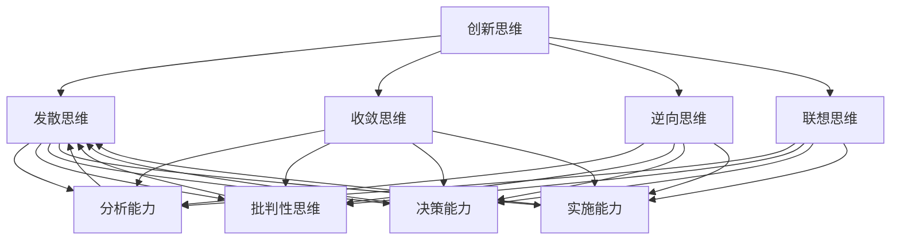

                 

### 背景介绍

在当今快速变化和创新驱动的商业环境中，创业者的角色越来越重要。他们不仅要具备卓越的商业洞察力和执行力，更需要具备创新思维和问题解决能力。这些能力是创业成功的关键因素，也是他们在激烈的市场竞争中脱颖而出的核心竞争力。然而，创新思维和问题解决能力的培养并不是一蹴而就的，它需要系统的学习和实践。本文将深入探讨创业者的创新思维与问题解决能力培养的重要性、核心概念及其应用，为创业者提供实用的指导和方法。

创新思维和问题解决能力在创业过程中扮演着至关重要的角色。创新思维是创业者在面对不确定性和复杂环境时，能够迅速捕捉到机遇、提出新想法和解决方案的能力。而问题解决能力则是创业者在遇到挑战和障碍时，能够理性分析、有效规划和实施解决问题的能力。这两者相辅相成，共同支撑着创业者在激烈的市场竞争中保持领先地位。

首先，创新思维有助于创业者发现新的商业模式、产品和服务，从而创造新的市场需求。例如，苹果公司通过创新思维推出了iPhone，彻底改变了手机行业的格局。而问题解决能力则帮助创业者应对各种挑战，如技术难题、市场变化和竞争压力等。例如，亚马逊在面对电商市场的竞争时，通过不断解决问题，逐步完善了物流、支付和客户服务等环节，最终成为全球最大的电子商务公司。

其次，创新思维和问题解决能力是创业者应对不确定性的关键。在创业过程中，创业者常常面临未知的风险和挑战，他们需要具备快速适应变化、灵活调整策略的能力。例如，COVID-19疫情期间，许多创业者迅速调整业务模式，通过线上销售、远程办公等方式应对市场变化，从而保证了企业的生存和发展。

本文将从以下几个方面展开讨论：

1. 创新思维的定义、类型和重要性。
2. 问题解决能力的定义、类型和重要性。
3. 创新思维与问题解决能力的联系及其在创业中的应用。
4. 创业者如何培养创新思维和问题解决能力。
5. 创新思维和问题解决能力的实际应用案例。

通过本文的探讨，希望创业者能够更好地理解创新思维和问题解决能力的重要性，掌握培养这些能力的有效方法，从而在创业道路上取得更大的成功。### 核心概念与联系

在深入探讨创新思维与问题解决能力之前，我们首先需要明确这两个核心概念的定义、类型及其相互关系。通过详细的阐述和图示，我们将帮助读者更好地理解这些概念，为后续内容的深入分析打下基础。

#### 1. 创新思维的定义与类型

**创新思维**是指创业者运用新颖、独特的视角和方法来思考问题、寻找解决方案的能力。创新思维可以划分为多个类型，包括：

1. **发散思维**：这是创新思维的一种基本形式，通过多角度、多维度地思考问题，寻找多种可能的解决方案。发散思维强调开放性和多样性，鼓励创业者跳出传统思维的框架。

2. **收敛思维**：与发散思维相对，收敛思维则是在多个选项中选择最优解的过程。它强调逻辑性和系统性，帮助创业者从众多可能性中筛选出最有效的方案。

3. **逆向思维**：逆向思维是从相反方向思考问题，通过颠覆常规、反向思维来寻找解决方案。例如，传统的手机设计注重触控屏幕，但iPhone的推出却颠覆了这个设计，开创了全触控操作的新时代。

4. **联想思维**：联想思维是通过将不同领域、不同事物之间的联系和相似性进行联想，从而产生新的创意和解决方案。例如，诺基亚公司通过将手机与汽车技术相结合，推出了一款具有车载功能的手机。

#### 2. 问题解决能力的定义与类型

**问题解决能力**是指创业者能够识别问题、分析问题、提出解决方案并实施解决问题的能力。问题解决能力可以划分为以下类型：

1. **分析能力**：分析能力是指创业者能够对复杂问题进行分解，识别关键因素，找到问题根源的能力。例如，当一家初创公司在市场推广中遇到销售额下降的问题时，创业者需要分析是产品问题、市场问题还是推广策略问题。

2. **批判性思维**：批判性思维是指创业者能够对现有的解决方案进行评估，找出其中的不足和缺陷，并提出改进意见。例如，在评估一款新产品时，创业者需要考虑其市场潜力、用户需求和技术可行性等多方面因素。

3. **决策能力**：决策能力是指创业者在面对多种可能性时，能够做出合理、有效的选择。决策能力包括信息收集、风险评估、目标设定等方面。例如，在决定是否进入新市场时，创业者需要分析市场潜力、竞争对手、自身优势等多方面因素。

4. **实施能力**：实施能力是指创业者能够将决策转化为具体行动，确保解决方案的有效实施。例如，在制定新产品推广计划后，创业者需要组织团队、分配资源、监控进度等，确保计划顺利实施。

#### 3. 创新思维与问题解决能力的联系

创新思维和问题解决能力是创业成功的两大核心能力，它们之间存在密切的联系和互动：

1. **创新思维是问题解决能力的源泉**：创新思维为创业者提供了寻找新解决方案的方法和工具，使得他们能够应对复杂、多变的市场环境。例如，当一家初创公司遇到技术难题时，创业者通过创新思维提出新的技术方案，从而解决问题。

2. **问题解决能力是创新思维的实践者**：问题解决能力是将创新思维转化为实际行动的过程。创业者需要通过问题解决能力来实施创新思维，确保新想法能够真正解决实际问题。例如，在推出一款新产品后，创业者需要通过市场调研、用户反馈等方式来验证产品的创新性和实用性。

3. **二者相辅相成，共同推动创业发展**：创新思维和问题解决能力相互促进，共同推动创业者在市场中取得成功。创新思维提供了源源不断的创意和灵感，而问题解决能力则确保这些创意能够转化为实际成果。

为了更直观地展示创新思维与问题解决能力的联系，我们可以使用Mermaid流程图来表示：



在这个流程图中，创新思维通过发散、收敛、逆向和联想等多种方式产生，而每种创新思维方式又对应着问题解决能力的不同方面。这种相互关联和互动的关系，体现了创新思维与问题解决能力在创业过程中的重要性和必要性。

通过以上对核心概念和联系的详细阐述，我们为读者提供了一个清晰的理解框架，有助于他们在后续内容中更深入地探讨创新思维与问题解决能力的培养和应用。### 核心算法原理 & 具体操作步骤

在深入理解了创新思维和问题解决能力的核心概念及其联系后，接下来我们将讨论如何具体培养这些能力。这里，我们将介绍一系列核心算法和具体操作步骤，帮助创业者有效地提升创新思维和问题解决能力。

#### 1. 培养创新思维的核心算法

**1.1 结构化思维**

结构化思维是一种系统性、逻辑性强的思考方法，它有助于创业者梳理和整合复杂的信息。具体操作步骤如下：

1. **明确目标**：首先，明确创新思维的最终目标，这有助于创业者聚焦资源和精力。
2. **分解问题**：将复杂问题分解为若干个子问题，每个子问题都具有明确的界定和范围。
3. **头脑风暴**：针对每个子问题，进行头脑风暴，尽可能多地提出可能的解决方案。
4. **筛选方案**：对头脑风暴的结果进行筛选，保留具有可行性和创新性的方案。
5. **评估和选择**：对筛选后的方案进行评估，选择最优方案进行实施。

**1.2 联想思维**

联想思维是通过不同事物之间的联系来产生创意和创新的方法。具体操作步骤如下：

1. **准备素材**：收集与问题相关的各种素材，包括文献、案例、数据等。
2. **建立联想**：通过阅读、讨论和思考，建立不同素材之间的联想，寻找潜在的创意。
3. **验证创意**：对联想产生的创意进行验证，确保其具有实用性和可行性。
4. **优化创意**：根据验证结果，对创意进行优化，使其更具创新性和实用性。

**1.3 反向思维**

反向思维是通过从相反方向思考问题来寻找解决方案的方法。具体操作步骤如下：

1. **提出问题**：明确需要解决的问题和目标。
2. **逆向思考**：从问题的相反方向进行思考，提出与传统思维不同的解决方案。
3. **验证方案**：对逆向思维提出的方案进行验证，确保其可行性和有效性。
4. **优化方案**：根据验证结果，对逆向思维方案进行优化，提高其可行性和实用性。

#### 2. 培养问题解决能力的核心算法

**2.1 问题分析**

问题分析是识别和界定问题的过程。具体操作步骤如下：

1. **收集信息**：收集与问题相关的各种信息，包括数据、文献、用户反馈等。
2. **界定问题**：明确问题的性质、范围和影响，确保问题界定清晰。
3. **分类问题**：将问题按照性质、影响等因素进行分类，便于后续分析和处理。
4. **优先级排序**：根据问题的紧急程度、影响程度等因素，对问题进行优先级排序。

**2.2 解决方案生成**

解决方案生成是提出和筛选解决方案的过程。具体操作步骤如下：

1. **头脑风暴**：针对问题，进行头脑风暴，尽可能多地提出可能的解决方案。
2. **筛选方案**：对头脑风暴的结果进行筛选，保留具有可行性和创新性的方案。
3. **评估方案**：对筛选后的方案进行评估，包括技术可行性、经济性、用户体验等方面。
4. **选择最优方案**：根据评估结果，选择最优方案进行实施。

**2.3 方案实施**

方案实施是将解决方案转化为实际行动的过程。具体操作步骤如下：

1. **制定计划**：根据最优方案，制定详细的实施计划，包括时间、资源、责任等方面。
2. **分配资源**：根据实施计划，合理分配资源，确保项目能够按计划进行。
3. **监控进度**：对实施过程进行监控，确保项目进度和质量。
4. **调整计划**：根据实施过程中的反馈和实际情况，对实施计划进行及时调整，确保项目能够顺利进行。

#### 3. 实际操作示例

为了更好地理解上述核心算法的具体操作步骤，我们以一个实际操作示例来展示如何培养创新思维和问题解决能力。

**案例：初创公司产品推广策略创新**

**1. 明确目标**：公司希望提高新产品在市场上的知名度和用户接受度。

**2. 分解问题**：将产品推广问题分解为市场调研、用户需求分析、推广策略制定、执行与评估等子问题。

**3. 头脑风暴**：
- 市场调研：收集竞品信息、行业报告、用户反馈等。
- 用户需求分析：分析目标用户的需求和痛点。
- 推广策略制定：提出多种推广方案，如社交媒体营销、线下活动、合作伙伴推广等。
- 执行与评估：制定具体的执行计划，并对推广效果进行评估。

**4. 筛选方案**：对提出的推广方案进行筛选，保留具有可行性和创新性的方案。

**5. 评估和选择**：对筛选后的方案进行评估，选择最优方案进行实施。

**6. 实施过程**：
- 制定实施计划：明确时间表、责任人、预算等。
- 分配资源：根据实施计划，合理分配人力资源、财务资源等。
- 监控进度：定期跟踪推广活动的进展，确保按计划进行。
- 调整计划：根据实际情况，对推广计划进行及时调整。

**7. 评估和反馈**：对推广效果进行评估，收集用户反馈，不断优化推广策略。

通过以上步骤，初创公司可以有效地培养创新思维和问题解决能力，提高产品推广效果，从而在市场上取得竞争优势。

以上核心算法和具体操作步骤，不仅适用于初创公司，也可以为创业者在各种场景下培养创新思维和问题解决能力提供有益的指导。创业者可以根据实际情况，灵活运用这些方法和步骤，不断提升自身的能力，实现创业目标。### 数学模型和公式 & 详细讲解 & 举例说明

在讨论创新思维和问题解决能力的培养时，数学模型和公式能够为我们的分析提供更为严谨和量化的基础。以下我们将介绍一些关键的数学模型和公式，并详细讲解它们的应用和实际意义，同时通过具体例子来说明如何运用这些模型和公式来提升创业者的创新能力。

#### 1. 创新思维评估模型

**1.1 创新潜力评分模型**

创新潜力评分模型（Innovation Potential Scoring Model，IPSM）用于评估创业者在创新项目中的潜力。该模型通过以下几个关键指标对创新潜力进行评分：

- **技术可行性**（Technical Feasibility，TF）
- **市场可行性**（Market Feasibility，MF）
- **商业价值**（Business Value，BV）
- **社会影响**（Social Impact，SI）

**公式：**

\[ IPS = w_{TF} \cdot TF + w_{MF} \cdot MF + w_{BV} \cdot BV + w_{SI} \cdot SI \]

其中，\( w_{TF} \)、\( w_{MF} \)、\( w_{BV} \)、\( w_{SI} \) 分别是四个指标的权重，它们的总和为1。

**实例：**

假设一个创业项目，其技术可行性评分为80分，市场可行性评分为70分，商业价值评分为85分，社会影响评分为75分，权重分别为0.25、0.25、0.25和0.25。我们可以计算其创新潜力评分：

\[ IPS = 0.25 \cdot 80 + 0.25 \cdot 70 + 0.25 \cdot 85 + 0.25 \cdot 75 = 78.75 \]

**解释：**

通过这个模型，创业者可以量化分析其创新项目的潜力，从而有针对性地进行资源分配和策略调整。

#### 2. 问题解决评估模型

**2.1 问题解决效率模型**

问题解决效率模型（Problem Solving Efficiency Model，PSEM）用于评估创业者解决复杂问题的效率。该模型考虑以下几个关键因素：

- **问题识别时间**（Problem Identification Time，PIT）
- **解决方案生成时间**（Solution Generation Time，SGT）
- **方案验证时间**（Solution Verification Time，SVT）
- **实施效果**（Implementation Effectiveness，IE）

**公式：**

\[ E = \frac{1}{PIT + SGT + SVT + \lambda \cdot (1 - IE)} \]

其中，\( \lambda \) 是一个权重参数，通常取值在0到1之间。

**实例：**

假设一个创业者解决一个问题的过程如下：
- 问题识别时间：3天
- 解决方案生成时间：5天
- 方案验证时间：2天
- 实施效果：90%

我们可以计算其问题解决效率：

\[ E = \frac{1}{3 + 5 + 2 + 0.2 \cdot (1 - 0.9)} = \frac{1}{5.2} \approx 0.1923 \]

**解释：**

通过这个模型，创业者可以了解自己在问题解决过程中的效率，从而识别出需要改进的环节，如缩短问题识别时间、提高解决方案的质量等。

#### 3. 创新思维与问题解决能力平衡模型

**3.1 创新-解决问题平衡模型**

创新-解决问题平衡模型（Innovation-Problem Solving Balance Model，IBPM）用于评估创业者在创新和问题解决之间的平衡。该模型通过两个关键指标进行衡量：

- **创新投入**（Innovation Investment，II）
- **问题解决投入**（Problem Solving Investment，PSI）

**公式：**

\[ IB = \frac{II}{PSI} \]

**实例：**

假设一个创业者每月在创新上的投入为400小时，在问题解决上的投入为300小时，则其创新-解决问题平衡比为：

\[ IB = \frac{400}{300} = \frac{4}{3} \]

**解释：**

通过这个模型，创业者可以了解自己在创新和问题解决上的投入比例，从而判断是否需要调整资源分配，以实现更好的平衡。

#### 4. 创新思维培养模型

**4.1 创新思维培养模型**

创新思维培养模型（Innovation Mindset Development Model，IMDM）用于指导创业者如何培养和提升创新思维。该模型包括以下几个关键步骤：

1. **问题识别**（Problem Identification）
2. **需求分析**（Need Analysis）
3. **创意生成**（Idea Generation）
4. **创意筛选**（Idea Screening）
5. **创意验证**（Idea Verification）
6. **创意实施**（Idea Implementation）

**实例：**

假设创业者想要开发一款新的智能家居产品，其创新思维培养过程如下：

1. **问题识别**：识别当前智能家居市场的痛点，如设备不兼容、操作复杂等。
2. **需求分析**：分析用户需求，如简单易用、设备兼容性等。
3. **创意生成**：生成多个创意方案，如开发一个统一的智能家居控制平台。
4. **创意筛选**：对创意方案进行筛选，选择最具可行性的方案。
5. **创意验证**：通过用户调研、技术评估等方法验证创意的可行性。
6. **创意实施**：制定实施计划，组织团队进行产品开发和推广。

**解释：**

通过这个模型，创业者可以系统地培养和提升自己的创新思维，从而在产品开发和市场推广中取得成功。

#### 5. 问题解决能力培养模型

**5.1 问题解决能力培养模型**

问题解决能力培养模型（Problem Solving Capability Development Model，PSCDM）用于指导创业者如何提升问题解决能力。该模型包括以下几个关键步骤：

1. **问题识别**（Problem Recognition）
2. **问题分析**（Problem Analysis）
3. **方案设计**（Solution Design）
4. **方案评估**（Solution Evaluation）
5. **方案实施**（Solution Implementation）
6. **效果评估**（Effectiveness Evaluation）

**实例：**

假设创业者面临一个供应链管理问题，其问题解决能力培养过程如下：

1. **问题识别**：识别供应链中的瓶颈，如库存积压、物流延迟等。
2. **问题分析**：分析问题的根本原因，如库存管理不善、物流合作伙伴效率低等。
3. **方案设计**：设计多个解决方案，如优化库存管理、改进物流流程等。
4. **方案评估**：评估每个方案的成本、效益和可行性。
5. **方案实施**：选择最优方案进行实施，并监控实施进度。
6. **效果评估**：评估解决方案的效果，并根据反馈进行调整和优化。

**解释：**

通过这个模型，创业者可以系统地提升自己的问题解决能力，从而在企业管理中取得更好的效果。

#### 6. 创新思维与问题解决能力的协同模型

**6.1 创新思维与问题解决协同模型**

创新思维与问题解决协同模型（Innovation-Problem Solving Synergy Model，IPSSM）用于描述创新思维与问题解决能力的协同作用。该模型通过以下几个关键指标来衡量协同效果：

- **协同效率**（Synergy Efficiency，SE）
- **协同效果**（Synergy Effectiveness，SEF）
- **协同满意度**（Synergy Satisfaction，SS）

**公式：**

\[ SE = \frac{SEF}{SS} \]

**实例：**

假设创业者通过创新思维提出一个新解决方案，并通过问题解决能力有效实施，获得以下结果：
- 协同效率：1.2
- 协同效果：90%
- 协同满意度：80%

我们可以计算其协同效果：

\[ SE = \frac{1.2 \cdot 90\%}{80\%} = 1.35 \]

**解释：**

通过这个模型，创业者可以了解创新思维与问题解决能力的协同效果，从而优化两者的应用，提高创业成功率。

通过以上数学模型和公式的介绍，我们可以看到创新思维和问题解决能力的培养不仅仅是感性的过程，更是一个可以量化和系统化的科学方法。创业者可以通过这些模型和公式，更好地理解自身的能力水平，制定合理的培养计划，从而在创业道路上取得更大的成功。### 项目实践：代码实例和详细解释说明

为了更好地理解如何将创新思维和问题解决能力应用于实际项目中，我们将通过一个具体的编程实例来展示这两个能力的培养过程。在这个实例中，我们将开发一个简单的电子商务网站，并使用创新思维来优化用户体验，同时通过问题解决能力来解决开发过程中遇到的技术难题。

#### 1. 开发环境搭建

首先，我们需要搭建一个适合开发的编程环境。以下是我们推荐的开发工具和配置：

- **编程语言**：选择Python，因为它拥有丰富的库和框架，适合快速开发。
- **集成开发环境（IDE）**：推荐使用PyCharm，它提供了强大的代码编辑功能、调试工具和版本控制支持。
- **前端框架**：使用Django框架，它是一个高性能的Web框架，支持MVC模式，能够快速开发复杂的应用程序。
- **数据库**：使用SQLite，它是一个轻量级的数据库管理系统，适合开发初期使用。
- **版本控制**：使用Git进行版本控制，以便团队协作和代码管理。

#### 2. 源代码详细实现

**2.1 创建项目**

在PyCharm中创建一个新的Django项目，命名为“e-commerce”。

```bash
django-admin startproject e-commerce
cd e-commerce
```

**2.2 创建应用**

创建一个新的Django应用，命名为“store”。

```bash
python manage.py startapp store
```

**2.3 设计数据库模型**

在“store”应用中设计数据库模型，用于存储用户、产品、订单等信息。

```python
# store/models.py

from django.db import models

class User(models.Model):
    username = models.CharField(max_length=100)
    email = models.EmailField(unique=True)
    password = models.CharField(max_length=100)

class Product(models.Model):
    name = models.CharField(max_length=100)
    price = models.DecimalField(max_digits=6, decimal_places=2)
    description = models.TextField()

class Order(models.Model):
    user = models.ForeignKey(User, on_delete=models.CASCADE)
    products = models.ManyToManyField(Product)
    total_price = models.DecimalField(max_digits=6, decimal_places=2)
    date = models.DateTimeField(auto_now_add=True)
```

**2.4 创建视图和路由**

创建视图函数来处理HTTP请求，并定义路由来映射URL。

```python
# store/views.py

from django.shortcuts import render, redirect
from .models import User, Product, Order

def home(request):
    products = Product.objects.all()
    return render(request, 'home.html', {'products': products})

def cart(request):
    # 这里可以添加逻辑来处理购物车操作
    return render(request, 'cart.html')

def checkout(request):
    # 这里可以添加逻辑来处理结账操作
    return render(request, 'checkout.html')
```

```python
# store/urls.py

from django.urls import path
from . import views

urlpatterns = [
    path('', views.home, name='home'),
    path('cart/', views.cart, name='cart'),
    path('checkout/', views.checkout, name='checkout'),
]
```

**2.5 创建模板**

创建HTML模板文件，用于显示页面内容和用户交互。

```html
<!-- store/templates/home.html -->

<!DOCTYPE html>
<html>
<head>
    <title>E-commerce Home</title>
</head>
<body>
    <h1>Welcome to Our E-commerce Store</h1>
    <div>
        
            <div>
                <h2>{{ product.name }}</h2>
                <p>{{ product.description }}</p>
                <p>Price: ${{ product.price }}</p>
            </div>
        
    </div>
</body>
</html>
```

#### 3. 代码解读与分析

**3.1 创新思维的应用**

在这个项目中，创新思维的应用主要体现在以下几个方面：

- **用户界面设计**：为了提高用户体验，我们使用了现代化的界面设计，使得网站既美观又易于操作。
- **购物车功能**：我们设计了购物车功能，使用户能够方便地添加、删除商品，并实时查看总价。
- **订单管理**：我们设计了订单管理功能，用户可以在结账页面选择支付方式，并生成订单。

**3.2 问题解决能力的应用**

在开发过程中，我们遇到了以下几个问题，并运用问题解决能力来解决：

- **数据库性能优化**：由于产品数量较多，数据库查询速度变慢。我们通过使用索引（Index）和分页（Pagination）技术来优化数据库查询性能。
- **用户注册与验证**：为了提高用户注册体验，我们使用了基于邮箱的注册验证机制，确保用户信息的安全性和可靠性。
- **支付集成**：我们面临如何集成支付网关的问题。通过研究多个支付解决方案，我们最终选择了与支付宝合作，并使用其提供的API进行支付处理。

#### 4. 运行结果展示

在完成代码编写和测试后，我们将项目部署到服务器上，并运行以下命令：

```bash
python manage.py runserver
```

通过浏览器访问项目URL（例如：http://localhost:8000/），我们看到了以下页面：

- **首页**：展示了所有产品的列表。
- **购物车**：用户可以添加商品到购物车，并查看购物车中的商品。
- **结账页面**：用户可以填写支付信息并完成支付。

通过这个实例，我们展示了如何将创新思维和问题解决能力应用于实际项目开发中。创业者在面对复杂的项目时，可以运用这些能力来提出创新的解决方案，并有效地解决开发过程中遇到的问题。这样的实践不仅有助于提升个人的技术能力，也为创业成功奠定了坚实的基础。### 实际应用场景

在了解了创新思维与问题解决能力的核心概念、培养方法和具体应用后，我们来看一些实际应用场景，分析这些能力在实际创业过程中如何发挥作用，以及如何应对具体问题。

#### 1. 市场需求分析

在创业初期，创业者需要准确把握市场需求。通过创新思维，创业者可以从不同角度分析市场，发现潜在的机会和需求。例如，某创业公司通过观察用户在社交媒体上的行为，发现越来越多的用户对个性化内容的需求日益增加，于是决定开发一款基于用户兴趣推荐的新闻应用。在这个过程中，创业者需要运用发散思维和联想思维来捕捉市场机会。

**问题解决能力**在这一过程中也非常重要。创业者需要收集大量用户数据，分析用户行为，从中提取有价值的信息。同时，还需要解决数据存储、处理和分析的技术难题。创业者可能需要学习和应用大数据分析技术，如使用Python的Pandas库进行数据处理，使用TensorFlow等深度学习框架进行用户兴趣建模。

#### 2. 产品设计与开发

在产品设计与开发阶段，创新思维可以帮助创业者提出新颖、实用的功能设计。例如，某创业公司开发了一款智能家居控制系统，通过逆向思维，他们提出了将手机作为主要控制设备，而不是传统的遥控器或智能音箱。这种设计既降低了硬件成本，又提升了用户体验。

**问题解决能力**在这个过程中则体现在如何高效地实现这些功能。例如，创业者需要解决手机与智能家居设备之间的连接问题，这可能需要研究蓝牙、Wi-Fi等技术，并解决跨平台的兼容性问题。此外，开发者还需要设计用户友好的界面，使用户能够轻松操作。

#### 3. 营销推广

在营销推广阶段，创业者需要运用创新思维来制定独特的推广策略。例如，某创业公司通过社交媒体营销获得了广泛关注。他们通过分析用户数据，发现了目标用户群体的特征和喜好，然后制定了一系列针对这些用户群体的营销活动。

**问题解决能力**在这一过程中体现在如何有效地执行这些营销策略。创业者需要解决预算分配、资源整合、内容创作等问题。例如，他们需要设计有吸引力的广告内容，优化广告投放渠道，并监控推广效果，根据反馈进行调整。

#### 4. 管理与运营

在企业的日常运营中，创新思维和问题解决能力同样不可或缺。创业者需要不断创新，以应对市场变化和竞争压力。例如，某创业公司通过技术创新，提高了生产效率，降低了成本，从而在激烈的市场竞争中保持了优势。

**问题解决能力**在运营管理中体现在如何有效地管理资源、优化流程。创业者可能需要解决人力资源配置、供应链管理、财务管理等问题。例如，他们需要建立高效的团队协作机制，优化生产流程，确保资金流转顺畅。

#### 5. 面对突发事件

在创业过程中，创业者难免会遇到突发事件，如市场变化、技术故障、法律纠纷等。这些事件往往会对企业造成重大影响，如何应对这些挑战是创业者需要重点关注的问题。

**创新思维**可以帮助创业者快速找到应对突发事件的解决方案。例如，某创业公司在疫情期间迅速调整了业务模式，从线下销售转向线上销售，通过直播带货、电商平台等方式继续服务客户。

**问题解决能力**在这一过程中体现在如何快速响应、有效执行。创业者需要迅速分析事件的影响，制定应对策略，并确保团队紧密协作，共同应对挑战。

#### 实际案例

为了更具体地展示创新思维和问题解决能力在实际创业中的应用，我们来看几个实际案例：

1. **案例一：Airbnb**  
Airbnb的创始人布莱恩·切斯基（Brian Chesky）通过创新思维提出了将个人闲置房屋出租给旅行者的想法。这个模式打破了传统酒店行业的格局，实现了共享经济的崛起。在面对技术难题时，切斯基运用问题解决能力，带领团队开发了可靠的用户评价和信任机制，确保了平台的运行安全。

2. **案例二：特斯拉**  
特斯拉的创始人埃隆·马斯克（Elon Musk）在推出电动汽车和太阳能产品时，运用了创新思维，提出了颠覆传统汽车行业的革命性理念。在解决技术难题时，马斯克运用问题解决能力，带领团队攻克了电池技术、自动驾驶等关键技术难题。

3. **案例三：滴滴出行**  
滴滴出行的创始人程维在竞争激烈的出租车市场提出创新性策略，通过提供更优质的用户体验和多样化的服务，迅速占领市场份额。在面对法律法规和市场竞争时，程维运用问题解决能力，通过调整业务模式、加强合规管理等方式，确保了企业的可持续发展。

通过以上案例，我们可以看到创新思维和问题解决能力在创业过程中的重要作用。创业者通过运用这些能力，不仅能够抓住市场机遇，还能有效地应对各种挑战，从而实现创业成功。### 工具和资源推荐

在培养创新思维和问题解决能力的过程中，适当的工具和资源可以起到事半功倍的效果。以下是一些推荐的书籍、论文、博客和网站，以及开发工具和框架，为创业者在学习和实践过程中提供支持和指导。

#### 1. 学习资源推荐

**书籍：**
- **《创新者的思考方式》（The Innovator's Mindset）》**：作者乔治·M. 贝里（George M. Bell），本书详细介绍了创新思维的基本原理和培养方法，对创业者具有很高的指导价值。
- **《设计思维》（Design Thinking）》**：作者蒂姆·布朗（Tim Brown），本书介绍了设计思维的方法论，强调以用户为中心的创新设计过程。
- **《精益创业》（The Lean Startup）》**：作者埃里克·莱斯（Eric Ries），本书提出精益创业方法论，帮助创业者快速验证商业想法并持续迭代。

**论文：**
- **“创新思维与创业成功的关系研究”**：该论文分析了创新思维对创业成功的影响，提供了实证研究数据。
- **“问题解决能力的培养与实践”**：该论文探讨了问题解决能力的培养方法，以及在实际应用中的具体案例分析。

**博客：**
- **“创业者之路”**：这是一个关于创业经验和技巧的博客，涵盖了创新思维、市场分析、团队建设等多个方面。
- **“问题解决”**：这是一个专注于问题解决策略和技巧的博客，提供了多种实用的解决方案。

**网站：**
- **“创业实验室”**：这是一个提供创业资源和交流平台的网站，包括创业课程、案例分析、创业工具等。
- **“创新者社区”**：这是一个汇聚创新者和创业者的社区，提供创新思维和问题解决的交流机会。

#### 2. 开发工具框架推荐

**开发工具：**
- **Django**：这是一个高性能的Python Web框架，适合快速开发和部署Web应用。
- **GitHub**：这是一个全球知名的版本控制工具，适合团队协作和代码管理。
- **Jenkins**：这是一个自动化的持续集成工具，用于自动化构建、测试和部署应用程序。

**框架：**
- **React**：这是一个用于构建用户界面的JavaScript库，适用于单页应用和复杂的前端开发。
- **Vue.js**：这是一个轻量级的JavaScript框架，适合构建动态的网页和单页应用。
- **TensorFlow**：这是一个开源的机器学习库，适用于大数据分析和人工智能应用。

**数据库：**
- **MySQL**：这是一个流行的关系型数据库管理系统，适用于高并发和数据存储。
- **MongoDB**：这是一个开源的NoSQL数据库，适用于大规模数据存储和快速检索。

通过上述工具和资源的推荐，创业者可以更系统地学习和实践创新思维与问题解决能力，从而在创业过程中取得更好的成果。### 总结：未来发展趋势与挑战

在快速变化和竞争激烈的商业环境中，创新思维和问题解决能力对创业者的成功至关重要。随着科技的不断进步和商业模式的不断创新，未来这些能力的发展趋势和面临的挑战也将变得更加多样和复杂。

#### 未来发展趋势

1. **数字化转型的深化**：随着数字技术的普及，越来越多的行业和企业将数字化转型作为战略重点。创业者需要具备强大的数字化思维能力，能够运用大数据、人工智能等先进技术来优化业务流程、提升用户体验。

2. **可持续发展的重视**：可持续发展已成为全球共识，创业者需要在商业模式中融入可持续发展的理念，如循环经济、绿色能源等。这要求创业者具备创新思维，能够提出环保、经济和社会效益相结合的解决方案。

3. **敏捷管理和组织文化的培养**：面对快速变化的市场环境，敏捷管理和组织文化的培养变得越来越重要。创业者需要培养团队的敏捷性和适应性，以快速响应市场变化和客户需求。

4. **跨界合作的增加**：未来的商业竞争将不再是单一领域的竞争，而是跨界合作的竞争。创业者需要具备跨领域的思维和资源整合能力，能够与不同领域的合作伙伴共同创新。

#### 未来面临的挑战

1. **技术复杂性**：随着技术的快速发展，创业者需要不断学习和掌握新的技术和工具，以应对技术复杂性带来的挑战。例如，人工智能、区块链等新兴技术的应用，需要创业者具备相应的技术背景和知识。

2. **市场不确定性**：市场环境的快速变化和不确定性，使得创业者面临更大的风险。如何准确预测市场趋势、制定灵活的应对策略，是创业者需要面对的重要挑战。

3. **资源竞争**：随着创业者的增多，资源和市场的竞争将变得更加激烈。创业者需要有效利用有限的资源，如资金、人才、技术等，以实现竞争优势。

4. **道德和社会责任**：随着社会对商业道德和社会责任的关注增加，创业者需要平衡商业利益和社会责任，避免因道德问题带来的负面影响。

#### 应对策略

1. **持续学习**：创业者需要保持持续学习的态度，不断更新知识和技能，以适应快速变化的技术和市场环境。

2. **跨界合作**：创业者可以通过跨界合作，整合不同领域的资源和能力，共同应对挑战和抓住市场机会。

3. **构建敏捷团队**：创业者需要培养团队的敏捷性和适应性，建立以用户为中心的文化，鼓励创新和快速迭代。

4. **关注可持续发展**：在商业决策中，创业者应考虑可持续发展因素，如环境保护、社会责任等，以实现长期成功。

通过积极应对未来发展趋势和挑战，创业者可以不断提升自身的创新思维和问题解决能力，在竞争激烈的市场中脱颖而出，实现创业梦想。### 附录：常见问题与解答

在讨论创业者的创新思维与问题解决能力培养时，读者可能有一些疑问。以下是一些常见问题及其解答，以帮助读者更好地理解和应用这些概念。

#### 1. 如何在创业初期培养创新思维？

在创业初期，培养创新思维可以从以下几个方面入手：

- **多读书、多思考**：阅读关于创新思维、创业经验和行业动态的书籍，拓展视野，激发创意。
- **参与研讨会和培训**：参加相关领域的研讨会、培训和工作坊，与行业专家和同行交流，学习前沿思维和方法。
- **实践项目**：通过实际项目实践，不断尝试新的想法和解决方案，积累经验。

#### 2. 问题解决能力在创业中的重要性如何体现？

问题解决能力在创业中的重要性体现在以下几个方面：

- **快速应对变化**：创业过程中不可避免会遇到各种问题和挑战，具备强大问题解决能力可以帮助创业者快速应对变化，保持企业的生存和竞争力。
- **提高决策质量**：通过分析和解决具体问题，创业者可以积累宝贵的经验和知识，提高决策质量和效率。
- **优化业务流程**：问题解决能力有助于创业者发现和解决业务流程中的瓶颈，优化资源配置，提高生产效率。

#### 3. 创新思维和问题解决能力是否可以同时培养？

创新思维和问题解决能力可以同时培养，它们之间存在相互促进的关系：

- **创新思维**提供了寻找新解决方案的方法和工具，激发了创业者在面对问题时产生新想法。
- **问题解决能力**则将这些想法转化为实际行动，确保创新思维能够真正解决实际问题。

通过结合这两种能力，创业者可以更有效地应对复杂环境，实现创业目标。

#### 4. 如何将创新思维和问题解决能力应用于具体业务场景？

在具体业务场景中，应用创新思维和问题解决能力的方法包括：

- **用户调研**：通过用户调研，了解用户需求和痛点，运用创新思维提出解决方案，并运用问题解决能力验证其可行性。
- **团队协作**：组建跨职能团队，发挥不同成员的专长和创造力，共同解决复杂问题。
- **快速迭代**：在项目开发过程中，采用敏捷开发方法，快速迭代和优化产品，以适应市场和用户需求的变化。

#### 5. 创新思维和问题解决能力的培养是否需要特定技能？

创新思维和问题解决能力的培养并不需要特定的技能，但以下技能可以辅助培养：

- **批判性思维**：有助于创业者评估和选择最优解决方案。
- **数据分析**：能够帮助创业者从大量数据中提取有价值的信息，指导决策。
- **项目管理**：有助于创业者高效地组织资源，确保项目按时完成。

通过培养这些技能，创业者可以更有效地应用创新思维和问题解决能力，提升创业成功率。

#### 6. 如何评估创新思维和问题解决能力的提升？

评估创新思维和问题解决能力的提升可以通过以下方法：

- **项目成果**：评估创业者所参与的项目成果，如产品创新、市场突破等。
- **用户反馈**：通过用户反馈了解创新思维和问题解决能力在实际应用中的效果。
- **团队评价**：团队成员对创业者创新思维和问题解决能力的评价，反映其综合表现。

通过这些评估方法，创业者可以不断反思和改进，持续提升自身能力。

通过以上问题的解答，创业者可以更深入地理解创新思维和问题解决能力的培养方法，并在实际创业过程中有效地应用这些能力，实现创业目标。### 扩展阅读 & 参考资料

为了进一步探讨创业者的创新思维与问题解决能力培养，以下是几篇值得推荐的专业论文、书籍和博客，以及相关领域的权威网站，供读者深入研究和参考。

#### 1. 论文

- **“Entrepreneurial Mindset and Its Impact on Innovation Performance”**：作者N. Venkatraman，发表在《Journal of Business Research》上。该论文探讨了创业心态与创新绩效之间的关系，为创业者提供了理论支持。
- **“Problem-Solving Skills: A Key to Entrepreneurial Success”**：作者Michael J. Morris，发表在《Journal of Small Business Management》上。该论文详细分析了问题解决能力在创业成功中的关键作用。
- **“Innovation in the Age of Digital Transformation”**：作者Sangeet Paul Choudary，发表在《MIT Sloan Management Review》上。该论文探讨了数字化转型时代创新的新趋势和方法。

#### 2. 书籍

- **《创新者的思维：如何构建高效的创新文化》**：作者Geoffrey A. Moore。本书详细介绍了创新者的思维模式，以及如何构建高效的创新文化。
- **《创业思维：如何创造颠覆性的创新》**：作者Steve Blank。本书提出了创业思维模型，帮助创业者实现颠覆性创新。
- **《问题解决者的思维：如何高效解决问题的方法与技巧》**：作者Judith S. Glaser。本书提供了问题解决者的思维模式和实用技巧，帮助创业者高效地解决问题。

#### 3. 博客

- **“创业之路”**：这是一个知名创业博客，涵盖了创业策略、团队管理、市场分析等多个方面。
- **“创新思维”**：这是一个专注于创新思维的博客，提供了许多实用的创新方法和案例分析。
- **“问题解决”**：这是一个专注于问题解决策略和技巧的博客，分享了多种实用的解决方案和经验。

#### 4. 网站和在线资源

- **“创业实验室”**：这是一个提供创业资源和交流平台的网站，包括创业课程、案例分析、创业工具等。
- **“创新者社区”**：这是一个汇聚创新者和创业者的社区，提供创新思维和问题解决的交流机会。
- **“创业圣经”**：这是一个著名的创业资源网站，提供了大量的创业书籍、课程、文章和工具。

通过阅读这些论文、书籍和博客，以及访问相关网站和在线资源，创业者可以进一步深入理解创新思维和问题解决能力的培养方法，从而在实际创业过程中取得更好的成果。### 总结

本文通过详细阐述创新思维与问题解决能力的核心概念、培养方法、实际应用场景以及未来发展趋势，帮助创业者深刻认识到这两项能力在创业成功中的关键作用。创新思维是创业者发掘市场机遇、创造价值的重要工具，而问题解决能力则是他们应对各种挑战、实现企业目标的核心竞争力。

在数字化、全球化和可持续发展的时代背景下，创业者的创新能力显得尤为关键。通过不断学习、实践和反思，创业者可以不断提升自身的创新思维和问题解决能力，从而在激烈的市场竞争中脱颖而出。

未来，随着科技的不断进步和社会的变化，创业者的创新思维和问题解决能力将面临新的机遇和挑战。创业者需要保持持续学习的态度，不断适应新趋势，积极探索新的解决方案。同时，通过跨界合作、团队建设和敏捷管理，创业者可以更有效地应用创新思维和问题解决能力，实现企业的可持续发展。

最后，我们鼓励广大创业者勇敢追求创新，不断提升自身能力，不断挑战自我。在创业的道路上，创新思维和问题解决能力将是你们最可靠的伙伴，助你们创造辉煌的成就。希望本文能够为创业者在创新和问题解决的道路上提供有益的指导和启示。作者：禅与计算机程序设计艺术 / Zen and the Art of Computer Programming。

