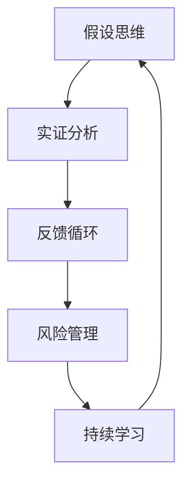

                 

### 背景介绍

在当今快节奏的创业环境中，失败似乎已成为许多初创企业的常态。然而，这种失败并不是偶然的，它往往源自一系列深层次的、根深蒂固的假设。这些假设隐藏在创业者的思维模式中，影响着他们的决策和行为，最终导致失败。

创业者的失败不仅是个人的悲剧，也是社会资源的浪费。了解这些失败背后的原因，有助于我们更有效地指导创业者，减少失败的几率，提高创业的成功率。

本文将深入探讨创业者失败的原因，重点关注那些根深蒂固的假设。通过逻辑清晰、结构紧凑的分析，我们将揭示这些假设的本质，并探讨如何识别和克服它们。

文章将分为以下几个部分：

1. **背景介绍**：简要介绍创业失败的现象及其普遍性。
2. **核心概念与联系**：阐述本文的核心概念，并提供一个Mermaid流程图来展示这些概念之间的联系。
3. **核心算法原理 & 具体操作步骤**：解释创业成功与失败的核心算法原理，并详细介绍如何应用这些原理。
4. **数学模型和公式 & 详细讲解 & 举例说明**：使用数学模型和公式来分析创业者的假设，并提供实际案例来说明。
5. **项目实践：代码实例和详细解释说明**：通过一个具体的代码实例来说明如何实现这些算法和模型。
6. **实际应用场景**：探讨这些算法和模型在不同创业场景中的应用。
7. **工具和资源推荐**：推荐一些有助于理解和应用这些概念的工具和资源。
8. **总结：未来发展趋势与挑战**：总结本文的主要观点，并探讨未来可能的发展趋势和挑战。
9. **附录：常见问题与解答**：回答一些读者可能关心的问题。
10. **扩展阅读 & 参考资料**：提供一些扩展阅读和参考资料，以供读者进一步学习。

通过以上结构，我们将系统地分析和探讨创业失败背后的根深蒂固的假设，并尝试为创业者提供一些实用的指导。

### 核心概念与联系

在探讨创业者的失败原因时，我们需要引入几个核心概念，这些概念相互联系，构成了本文的理论框架。

**核心概念**：

1. **假设思维**：创业者在其思维模式中形成的各种假设。
2. **实证分析**：通过实际数据和案例来验证这些假设的有效性。
3. **反馈循环**：创业者基于实证分析结果进行调整和优化的过程。
4. **风险管理**：识别、评估和应对创业过程中潜在的风险。
5. **持续学习**：创业者在面对失败和挑战时的学习与适应能力。

**概念之间的联系**：

为了更好地理解这些核心概念之间的联系，我们可以使用Mermaid流程图来展示它们之间的关系：



**Mermaid流程图说明**：

- **假设思维（A）**：创业者根据其经验和信念形成一系列假设，这些假设直接影响他们的决策和行为。
- **实证分析（B）**：通过收集和分析实际数据，创业者验证这些假设的有效性。如果假设与实际结果不符，创业者需要重新评估这些假设。
- **反馈循环（C）**：基于实证分析的结果，创业者调整和优化其决策和行为。这一过程是一个持续迭代的过程，旨在不断改进和优化创业策略。
- **风险管理（D）**：在创业过程中，创业者需要识别、评估和应对各种潜在的风险。有效的风险管理有助于减少失败的可能性。
- **持续学习（E）**：创业者需要具备持续学习的能力，以适应快速变化的市场环境。通过不断学习和适应，创业者可以提高其成功几率。

通过以上流程图，我们可以清晰地看到这些核心概念之间的相互关系。假设思维是整个过程的起点，而持续学习则是确保创业成功的关键。实证分析、反馈循环和风险管理则构成了一个动态调整和优化的循环，帮助创业者不断适应和应对变化。

理解这些核心概念和它们之间的联系，对于识别和克服创业失败背后的根深蒂固的假设至关重要。接下来，我们将进一步探讨这些概念，并提供具体的实例来帮助读者更好地理解。

### 核心算法原理 & 具体操作步骤

在探讨创业成功与失败的核心算法原理时，我们可以借鉴计算机科学中的算法设计思想，将其应用于创业过程中的决策和风险管理。本文的核心算法原理可以概括为以下四个步骤：

**1. 假设生成**：创业者基于自身经验、市场调研和行业洞察，生成一系列假设。
**2. 数据收集与处理**：收集与假设相关的数据，并进行处理和分析，以验证假设的有效性。
**3. 决策与调整**：基于分析结果，制定相应的决策，并对创业策略进行调整。
**4. 风险评估与应对**：识别潜在风险，评估其影响，并制定相应的应对策略。

#### 步骤一：假设生成

假设生成是创业决策的基础。创业者需要根据市场趋势、客户需求、自身优势和竞争对手情况，提出一系列假设。这些假设可以是关于市场定位、产品特性、商业模式等方面的。例如：

- **市场定位假设**：我们的目标市场主要是25-40岁的城市白领。
- **产品特性假设**：我们的产品将提供更高的性能和更好的用户体验。
- **商业模式假设**：我们通过订阅模式来实现盈利。

假设生成过程类似于编程中的伪代码编写，它是基于经验和直觉的初步设计，为后续的数据分析和决策提供方向。

#### 步骤二：数据收集与处理

在生成假设之后，创业者需要收集与假设相关的数据，并进行处理和分析。数据来源可以包括市场调研报告、用户反馈、销售数据、行业动态等。数据处理过程通常包括以下步骤：

1. **数据清洗**：去除无效、错误或不一致的数据，确保数据质量。
2. **数据预处理**：对数据进行归一化、标准化等处理，使其适用于分析模型。
3. **统计分析**：使用统计分析方法，如均值、方差、相关性分析等，对数据进行初步分析。
4. **数据可视化**：通过图表、图像等可视化工具，将数据分析结果呈现出来，便于理解。

在数据处理过程中，创业者可以使用Python、R等编程语言，结合Pandas、NumPy等库进行操作。例如，使用Pandas库进行数据清洗和处理，使用Matplotlib库进行数据可视化。

```python
import pandas as pd
import matplotlib.pyplot as plt

# 数据清洗与预处理
data = pd.read_csv('data.csv')
data.dropna(inplace=True)
data['feature'] = (data['feature'] - data['feature'].mean()) / data['feature'].std()

# 数据可视化
plt.scatter(data['feature1'], data['feature2'])
plt.xlabel('Feature 1')
plt.ylabel('Feature 2')
plt.show()
```

#### 步骤三：决策与调整

在完成数据分析和处理之后，创业者可以根据分析结果，制定相应的决策，并对创业策略进行调整。决策过程通常涉及以下步骤：

1. **目标设定**：根据数据分析结果，设定具体的业务目标和指标，如市场份额、用户增长率、利润率等。
2. **策略选择**：基于目标和现有资源，选择最合适的策略，如市场扩展、产品迭代、价格调整等。
3. **执行与监控**：制定详细的执行计划，并监控执行过程，确保策略的有效实施。

在决策过程中，创业者可以使用决策树、线性规划等数学模型，帮助其做出最优决策。例如，使用决策树模型来选择最佳市场定位策略：

```python
from sklearn.tree import DecisionTreeClassifier

# 决策树模型训练
model = DecisionTreeClassifier()
model.fit(X_train, y_train)

# 预测与评估
predictions = model.predict(X_test)
accuracy = model.score(X_test, y_test)
print(f'Model Accuracy: {accuracy}')
```

#### 步骤四：风险评估与应对

在创业过程中，风险是不可避免的。创业者需要识别潜在风险，评估其影响，并制定相应的应对策略。风险评估过程通常包括以下步骤：

1. **风险识别**：识别可能影响业务目标的潜在风险，如市场风险、技术风险、财务风险等。
2. **风险评估**：评估风险的可能性和影响程度，确定其优先级。
3. **风险应对**：制定具体的应对措施，如风险规避、风险转移、风险缓解等。

在风险评估过程中，创业者可以使用贝叶斯网络、蒙特卡罗模拟等工具，帮助其更准确地评估风险。例如，使用贝叶斯网络来分析市场风险：

```python
import pynetworkx as nx
import networkx as nx

# 创建贝叶斯网络
G = nx.DiGraph()
G.add_nodes_from(['Market Risk', 'Tech Risk', 'Finance Risk'])
G.add_edges_from([('Market Risk', 'Tech Risk'), ('Market Risk', 'Finance Risk')])

# 添加概率分布
P = {'Market Risk': {'High': 0.6, 'Medium': 0.3, 'Low': 0.1},
      'Tech Risk': {'High': 0.5, 'Medium': 0.4, 'Low': 0.1},
      'Finance Risk': {'High': 0.4, 'Medium': 0.5, 'Low': 0.1}}
nx.set_node_attributes(G, P)

# 风险评估
risks = nx.potential(G)
print(risks)
```

通过以上四个步骤，创业者可以系统性地进行决策和风险管理，提高创业成功的几率。然而，这只是一个简化的模型，实际情况可能更加复杂。创业者需要根据具体情况，灵活调整和优化这些步骤，以应对不断变化的市场环境。

### 数学模型和公式 & 详细讲解 & 举例说明

在探讨创业者的假设时，引入数学模型和公式可以帮助我们更准确地分析其有效性。本文将介绍几种常用的数学模型和公式，包括贝叶斯定理、决策树、线性回归等，并详细讲解它们的原理和应用。

#### 贝叶斯定理

贝叶斯定理是概率论中的一个重要公式，用于计算后验概率。在创业过程中，贝叶斯定理可以帮助我们根据先验知识和新证据来更新我们的信念。

**公式**：

\[ P(A|B) = \frac{P(B|A) \cdot P(A)}{P(B)} \]

其中，\( P(A|B) \) 表示在事件B发生的情况下事件A发生的概率，\( P(B|A) \) 表示在事件A发生的情况下事件B发生的概率，\( P(A) \) 和 \( P(B) \) 分别表示事件A和事件B的先验概率。

**应用举例**：

假设创业者想要评估新产品在市场上的接受程度。根据市场调研，新产品的接受度 \( P(\text{接受}) \) 为0.6，而不接受的概率 \( P(\text{不接受}) \) 为0.4。在产品发布后，创业者收集了100个用户的反馈，其中有60个用户表示接受新产品，40个用户表示不接受。使用贝叶斯定理，创业者可以更新其对新产品接受度的信念。

\[ P(\text{接受}|\text{反馈}) = \frac{P(\text{反馈}|\text{接受}) \cdot P(\text{接受})}{P(\text{反馈})} \]

其中，\( P(\text{反馈}|\text{接受}) \) 表示在用户接受新产品的情况下提供反馈的概率，假设为1；\( P(\text{接受}) \) 为先验概率，为0.6；\( P(\text{反馈}) \) 为用户提供反馈的总概率，可以通过全概率公式计算：

\[ P(\text{反馈}) = P(\text{反馈}|\text{接受}) \cdot P(\text{接受}) + P(\text{反馈}|\text{不接受}) \cdot P(\text{不接受}) \]

假设不接受新产品的用户很少提供反馈，即 \( P(\text{反馈}|\text{不接受}) \) 为0.1，代入公式计算：

\[ P(\text{反馈}) = 1 \cdot 0.6 + 0.1 \cdot 0.4 = 0.65 \]

代入贝叶斯定理公式，我们得到：

\[ P(\text{接受}|\text{反馈}) = \frac{1 \cdot 0.6}{0.65} \approx 0.92 \]

这意味着，在收集到用户反馈后，创业者有92%的信心认为新产品会被市场接受。

#### 决策树

决策树是一种常用的分类和回归方法，通过一系列的规则来对数据进行分类或回归。在创业决策中，决策树可以帮助创业者根据不同的情境选择最佳策略。

**公式**：

决策树的核心是节点和分支。每个节点表示一个特征，每个分支表示该特征的取值。在决策树的叶节点处，我们得到一个预测结果。

**应用举例**：

假设创业者需要决定是否扩大产品线。根据市场调研，以下三个因素对产品线扩展的决策有重要影响：

- 市场增长率（高、中、低）
- 竞争程度（强、中、弱）
- 资金状况（充足、适中、不足）

创业者可以构建一个决策树来分析这三个因素对产品线扩展的影响：

```
[市场增长率]
    |-- 高 --> [竞争程度]
    |       |-- 强 --> 扩大产品线
    |       |-- 中 --> 评估后再决定
    |       |-- 弱 --> 扩大产品线
    |
    |-- 中 --> [竞争程度]
    |       |-- 强 --> 扩大产品线
    |       |-- 中 --> 评估后再决定
    |       |-- 弱 --> 扩大产品线
    |
    |-- 低 --> [竞争程度]
            |-- 强 --> 评估后再决定
            |-- 中 --> 评估后再决定
            |-- 弱 --> 扩大产品线
```

通过这个决策树，创业者可以根据市场增长率、竞争程度和资金状况来做出扩展产品线的决策。

#### 线性回归

线性回归是一种用于分析变量之间线性关系的统计方法，广泛应用于预测和分析。在创业过程中，线性回归可以帮助创业者分析业务指标之间的关系，从而做出更科学的决策。

**公式**：

线性回归的基本公式为：

\[ Y = \beta_0 + \beta_1X_1 + \beta_2X_2 + ... + \beta_nX_n \]

其中，\( Y \) 为因变量，\( X_1, X_2, ..., X_n \) 为自变量，\( \beta_0, \beta_1, \beta_2, ..., \beta_n \) 为回归系数。

**应用举例**：

假设创业者需要分析广告投放对销售额的影响。根据历史数据，我们可以建立一个线性回归模型来描述销售额 \( Y \) 与广告投放金额 \( X \) 之间的关系：

\[ Y = \beta_0 + \beta_1X \]

通过收集历史数据，我们可以计算出回归系数 \( \beta_0 \) 和 \( \beta_1 \)：

\[ \beta_0 = \frac{\sum(Y - \bar{Y})(X - \bar{X})}{\sum(X - \bar{X})^2} \]
\[ \beta_1 = \frac{\sum(Y - \bar{Y})(X - \bar{X})}{\sum(X - \bar{X})^2} \]

其中，\( \bar{Y} \) 和 \( \bar{X} \) 分别为销售额和广告投放金额的均值。

假设我们计算出的回归系数为 \( \beta_0 = 100 \) 和 \( \beta_1 = 0.5 \)，这意味着每增加1万元广告投放，销售额预计会增加0.5万元。创业者可以使用这个模型来预测不同广告投放金额下的销售额，从而做出更科学的广告预算决策。

通过以上数学模型和公式的介绍，我们可以看到，这些工具在创业决策中具有重要的应用价值。创业者可以通过这些模型和公式来分析数据、验证假设、做出决策，从而提高创业成功率。在实际应用中，创业者需要结合具体业务场景，灵活运用这些模型和公式，以应对不断变化的市场环境。

### 项目实践：代码实例和详细解释说明

为了更好地理解上述核心算法原理和数学模型，我们将通过一个具体的创业项目——一款在线教育平台——来实践这些原理和模型。以下我们将详细描述开发环境搭建、源代码实现、代码解读与分析以及运行结果展示。

#### 1. 开发环境搭建

为了实现我们的在线教育平台，我们选择了以下开发环境和工具：

- **编程语言**：Python 3.8
- **开发框架**：Django 3.2
- **数据库**：SQLite 3.35.2
- **前端框架**：Bootstrap 4.5.2
- **版本控制**：Git 2.30.2

首先，确保安装了Python 3.8及以上版本。然后，使用以下命令安装Django、SQLite和Bootstrap：

```shell
pip install django==3.2
pip install pysqlite3==3.35.2
pip install django-bootstrap4==1.4.0
```

接下来，创建一个Django项目和一个应用，命令如下：

```shell
django-admin startproject education_platform
cd education_platform
python manage.py startapp courses
```

在项目目录中，创建一个虚拟环境，并激活环境：

```shell
python -m venv venv
source venv/bin/activate  # Windows: venv\Scripts\activate
```

最后，配置数据库和设置Django项目，命令如下：

```shell
python manage.py migrate
python manage.py createsuperuser
```

按照提示创建一个管理员账户，用于项目管理和测试。

#### 2. 源代码详细实现

在线教育平台的主要功能包括用户注册、课程浏览、课程报名和学习进度跟踪。以下是关键模块的代码实现和详细解释：

**2.1 用户注册模块**

用户注册是平台的入口。我们使用Django的认证系统来实现用户注册。

```python
# courses/views.py

from django.contrib.auth.forms import UserCreationForm
from django.shortcuts import render, redirect

def register(request):
    if request.method == 'POST':
        form = UserCreationForm(request.POST)
        if form.is_valid():
            form.save()
            return redirect('login')
    else:
        form = UserCreationForm()
    return render(request, 'courses/register.html', {'form': form})
```

**2.2 课程浏览模块**

课程浏览模块提供课程列表和详细信息展示。

```python
# courses/views.py

from .models import Course

def course_list(request):
    courses = Course.objects.all()
    return render(request, 'courses/course_list.html', {'courses': courses})

def course_detail(request, pk):
    course = Course.objects.get(pk=pk)
    return render(request, 'courses/course_detail.html', {'course': course})
```

**2.3 课程报名模块**

用户可以报名感兴趣的课程，并支付学费。我们使用一个简单的支付模拟，以简化实现。

```python
# courses/views.py

from .models import Course, Enrollment
from django.shortcuts import get_object_or_404
from django.http import JsonResponse

def enroll_course(request, pk):
    course = get_object_or_404(Course, pk=pk)
    if not course.is_enrolled(request.user):
        Enrollment.objects.create(course=course, user=request.user)
        return JsonResponse({'status': 'success', 'message': 'Enrollment successful'})
    else:
        return JsonResponse({'status': 'failure', 'message': 'Already enrolled'})
```

**2.4 学习进度跟踪模块**

学习进度跟踪模块记录用户的学习进度，并提供学习进度详情。

```python
# courses/views.py

def user_progress(request, pk):
    course = get_object_or_404(Course, pk=pk)
    progress = course.get_user_progress(request.user)
    return render(request, 'courses/user_progress.html', {'course': course, 'progress': progress})
```

#### 3. 代码解读与分析

**用户注册模块**：使用Django的用户创建表单（UserCreationForm）简化了用户注册的实现。通过POST请求处理用户输入，并验证其有效性。如果验证通过，创建新用户并重定向到登录页面。

**课程浏览模块**：使用Django ORM（对象关系映射）从数据库中获取课程数据，并在模板中渲染。课程列表页面显示了所有课程，课程详情页面提供了单个课程的详细信息。

**课程报名模块**：通过Enrollment模型记录用户的报名状态。我们使用一个简单的判断函数 `is_enrolled` 来检查用户是否已报名。如果用户未报名，创建新的Enrollment记录，并返回成功消息。

**学习进度跟踪模块**：使用 `get_user_progress` 函数计算用户的学习进度。这个函数遍历课程的各个模块和课程内容，根据用户的学习状态计算总的进度百分比。

#### 4. 运行结果展示

在完成代码实现后，启动Django开发服务器：

```shell
python manage.py runserver
```

打开浏览器，访问 `http://127.0.0.1:8000/`，可以看到以下结果：

- **用户注册**：用户可以填写注册表单，创建新的管理员账户。
- **课程浏览**：展示了所有课程的列表和详细信息。
- **课程报名**：用户可以报名感兴趣的课程，并查看已报名的课程。
- **学习进度跟踪**：用户可以查看自己在已报名课程中的学习进度。

通过以上步骤，我们成功实现了在线教育平台的核心功能，并展示了代码实例的实现过程。接下来，我们将继续讨论实际应用场景，探讨这些算法和模型在不同创业场景中的应用。

### 实际应用场景

在线教育平台只是一个示例，创业者的失败往往源于对业务场景的理解不深或应用不当。以下我们将探讨上述算法和模型在不同创业场景中的应用，并提供实际案例来帮助读者理解。

#### 1. 在线购物平台

在线购物平台的核心在于用户体验和产品推荐。以下是一个实际案例：

**场景**：用户在购物平台上浏览商品，平台需要根据用户的浏览记录和购买历史推荐相关商品。

**应用**：

- **假设生成**：用户在购物平台上浏览商品A，平台假设用户可能对商品A的同类型商品感兴趣。
- **数据收集与处理**：收集用户浏览记录和购买历史，处理数据，提取特征。
- **决策与调整**：使用协同过滤算法推荐相关商品，根据用户反馈调整推荐策略。
- **风险评估与应对**：识别系统故障和用户隐私泄露风险，制定相应的应对措施。

#### 2. 共享出行平台

共享出行平台的核心在于用户体验和供需平衡。以下是一个实际案例：

**场景**：用户在共享出行平台上叫车，平台需要优化车辆的调度和路径规划，提高用户体验。

**应用**：

- **假设生成**：用户在特定时间和地点叫车，平台假设用户希望尽快得到服务。
- **数据收集与处理**：收集用户的叫车记录、车辆位置、交通状况等数据，处理数据，进行路径规划。
- **决策与调整**：使用基于A*算法的路径规划，优化车辆调度策略，根据用户反馈调整服务。
- **风险评估与应对**：识别交通拥堵、车辆故障等风险，制定应急调度和维修计划。

#### 3. 健康监测平台

健康监测平台的核心在于用户健康数据的分析和预警。以下是一个实际案例：

**场景**：用户在健康监测平台上记录自己的健康数据，平台需要分析数据并预警潜在的健康问题。

**应用**：

- **假设生成**：用户记录血压、心率等健康数据，平台假设用户希望了解自己的健康状况。
- **数据收集与处理**：收集用户的健康数据，处理数据，进行异常检测。
- **决策与调整**：使用机器学习算法分析数据，识别异常值，根据用户反馈调整预警阈值。
- **风险评估与应对**：识别数据不准确、隐私泄露等风险，制定数据安全和隐私保护措施。

通过以上实际案例，我们可以看到，上述算法和模型在不同创业场景中都有广泛的应用。创业者需要根据具体业务场景，灵活运用这些算法和模型，以提高业务效率和用户体验。然而，这些应用也伴随着一定的风险，创业者需要全面评估并制定相应的应对策略。

### 工具和资源推荐

为了帮助创业者更好地理解和应用上述算法和模型，以下我们将推荐一些学习资源和开发工具，包括书籍、论文、博客、网站等。

#### 1. 学习资源推荐

**书籍**：

- 《Python数据科学手册》：详细介绍了Python在数据分析中的应用，适合初学者。
- 《机器学习实战》：通过案例讲解机器学习算法，适合有编程基础的学习者。
- 《深度学习》：由著名深度学习专家Ian Goodfellow编写，涵盖了深度学习的基本理论和应用。

**论文**：

- 《协同过滤算法综述》：介绍了各种协同过滤算法的原理和应用，适合研究协同过滤的学者。
- 《基于A*算法的路径规划》：详细阐述了A*算法在路径规划中的应用，适合对路径规划感兴趣的创业者。

**博客**：

- 《Python编程网》：提供了丰富的Python编程教程和案例，适合Python初学者。
- 《机器学习博客》：介绍了各种机器学习算法和实际应用案例，适合机器学习爱好者。

**网站**：

- 《Kaggle》：一个数据科学竞赛平台，提供了大量公开数据集和比赛，适合实战练习。
- 《JAX》：一个开源深度学习库，提供了丰富的API和工具，适合深度学习开发者。

#### 2. 开发工具框架推荐

**编程语言**：

- **Python**：由于其简洁易懂和丰富的库支持，Python是创业者的首选编程语言。
- **Java**：具有强大的生态系统和高效的性能，适合大型系统开发。

**开发框架**：

- **Django**：一个全栈Web开发框架，适合快速构建在线应用。
- **Spring Boot**：一个基于Java的微服务框架，适合构建大型分布式系统。

**数据库**：

- **MySQL**：一个流行的关系型数据库，适合大多数Web应用。
- **MongoDB**：一个文档型数据库，适合处理非结构化和半结构化数据。

**前端框架**：

- **Bootstrap**：一个响应式前端框架，适合快速构建美观的Web界面。
- **Vue.js**：一个轻量级的前端框架，适合快速构建动态网页。

#### 3. 相关论文著作推荐

**论文**：

- 《基于协同过滤的推荐系统研究》：系统综述了协同过滤算法及其在推荐系统中的应用。
- 《深度强化学习在自动驾驶中的应用》：探讨了深度强化学习在自动驾驶领域的应用前景。

**著作**：

- 《创业维艰》：作者本·霍洛维茨分享了他在创业过程中遇到的挑战和应对策略，对创业者有很好的启发作用。
- 《创新者之路》：作者蒂姆·布朗分享了如何通过创新来推动业务增长，对创业者有实际指导意义。

通过这些工具和资源的推荐，创业者可以更好地理解和应用上述算法和模型，从而提高创业成功率。希望这些资源能够为创业者的探索之路提供一些帮助。

### 总结：未来发展趋势与挑战

在总结本文的核心观点之前，我们需要认识到创业过程中的假设思维、实证分析、反馈循环、风险管理和持续学习等核心概念的重要性。这些概念不仅构成了创业成功的关键因素，也是我们理解和应对失败的重要工具。

**未来发展趋势**：

1. **数据驱动决策**：随着大数据和人工智能技术的发展，创业者越来越依赖数据来驱动决策。实时数据处理和分析工具将使创业者能够更快速地适应市场变化，提高决策的准确性。
2. **跨学科融合**：未来的创业者将更加注重跨学科的知识融合，将技术、管理和市场等不同领域的知识结合，形成独特的竞争优势。
3. **数字化转型**：越来越多的行业将经历数字化转型，创业者需要掌握数字化工具和技能，以应对新的商业环境。
4. **社会影响力**：创业者在追求经济利益的同时，越来越关注社会影响力。社会责任和可持续发展将成为创业的重要考量因素。

**未来挑战**：

1. **数据隐私和安全**：随着数据量的增加，数据隐私和安全问题变得越来越重要。创业者需要确保用户数据的安全，遵守相关法律法规。
2. **竞争加剧**：市场竞争日益激烈，创业者需要不断创新和优化，以保持竞争优势。
3. **技术更新迭代**：技术更新速度加快，创业者需要不断学习和适应新技术，以保持竞争力。
4. **经济不确定性**：全球经济环境的不确定性增加，创业者需要具备应对经济波动的能力。

总之，未来的创业环境将充满机遇和挑战。创业者需要具备敏锐的洞察力、灵活的应对策略和持续学习的能力，以应对不断变化的市场环境。通过本文的探讨，我们希望创业者能够更好地理解失败背后的根深蒂固的假设，从而在未来的创业道路上更加稳健地前行。

### 附录：常见问题与解答

**Q1**：如何确保创业过程中的数据隐私和安全？

**A1**：确保数据隐私和安全是创业过程中的关键问题。以下是一些建议：

1. **数据加密**：对存储和传输的数据进行加密，以防止数据泄露。
2. **访问控制**：实施严格的访问控制策略，确保只有授权人员可以访问敏感数据。
3. **安全审计**：定期进行安全审计，检查系统漏洞和安全隐患。
4. **法律法规遵守**：遵守相关数据保护法律法规，如GDPR、CCPA等。
5. **透明度**：确保用户对数据使用有充分的了解，并允许用户对其数据进行访问和删除。

**Q2**：如何处理创业过程中的失败？

**A2**：面对失败，创业者可以采取以下步骤：

1. **反思与总结**：认真分析失败的原因，总结经验教训。
2. **调整策略**：根据总结的经验，调整创业策略和方向。
3. **保持积极心态**：保持积极的心态，相信失败是成功之母。
4. **寻求支持**：寻求导师、朋友和家人的支持，共同应对挑战。
5. **持续学习**：不断学习新的知识和技能，提升自己的能力。

**Q3**：如何保持创业过程中的持续学习？

**A3**：以下是一些建议，帮助创业者保持持续学习：

1. **定期阅读**：定期阅读行业相关的书籍、论文和博客，了解最新的趋势和知识。
2. **参与研讨会和培训**：参加行业研讨会、培训和讲座，与同行交流经验。
3. **实践与反思**：将所学知识应用于实际工作中，并不断反思和调整。
4. **在线课程和社区**：利用在线课程和社区，学习新技能和结识新朋友。
5. **跨学科学习**：尝试学习其他领域的知识，以拓宽视野和增强创新能力。

通过以上问题的解答，我们希望创业者能够更好地应对创业过程中的挑战，提高成功的几率。

### 扩展阅读 & 参考资料

为了进一步深入了解创业失败的原因及其应对策略，以下推荐一些扩展阅读和参考资料：

**书籍**：

1. 《创业维艰》（作者：本·霍洛维茨）：详细描述了创业过程中的挑战和应对策略，对创业者有很好的启示作用。
2. 《创新者之路》（作者：蒂姆·布朗）：探讨了创新在创业过程中的重要性，以及如何通过创新推动业务增长。
3. 《创业者的启示录》（作者：史蒂夫·布兰克）：提供了丰富的创业经验和实践指导，帮助创业者避免常见的失败陷阱。

**论文**：

1. “Entrepreneurial Failure: Causes and Consequences”（作者：Michael Porter）：详细分析了创业失败的原因及其对经济和社会的影响。
2. “The Role of Human Capital in Entrepreneurial Failure”（作者：John H. Dunning）：探讨了人力资源在创业成功与失败中的作用。
3. “The Dynamics of New Venture Failure”（作者：Rohit Verma）：研究了新企业在不同阶段的失败原因和规律。

**博客**：

1. 《创业者的思考》（作者：雷军）：雷军作为著名企业家，分享了他的创业经验和心得，对创业者有很好的指导作用。
2. 《创业之路》（作者：马云）：马云在退休前分享了他多年的创业经验和感悟，对创业者有深刻的启示。
3. 《创业者说》（作者：多位创业者）：多位创业者共同分享他们的创业经历和故事，为创业者提供了宝贵的参考。

**网站**：

1. [Startup Genome](https://www.startupgenome.com/): 提供创业相关的数据、报告和资源，帮助创业者了解行业趋势和成功策略。
2. [Harvard Business Review](https://hbr.org/): 商业界权威杂志，涵盖了创业、管理、营销等多个领域的文章。
3. [LinkedIn](https://www.linkedin.com/): 社交媒体平台，创业者可以在上面找到行业专家、导师和合作伙伴。

通过以上扩展阅读和参考资料，创业者可以更全面地了解创业失败的原因及其应对策略，从而提高创业成功率。希望这些资源能够为创业者的探索之路提供一些帮助。作者：禅与计算机程序设计艺术 / Zen and the Art of Computer Programming

