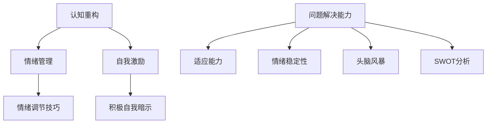
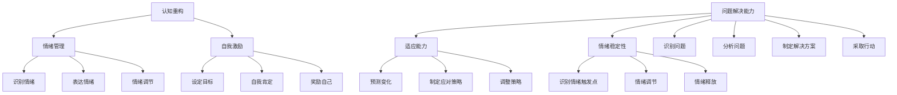

                 

## 1. 背景介绍

在当今这个充满竞争和不确定性的商业环境中，创业者面临着巨大的压力和挑战。无论是在初创公司还是大型企业中，领导者都必须具备良好的心态调整和抗压能力，才能在逆境中保持冷静和理性，做出明智的决策。

### 创业者面临的挑战

创业过程充满了不确定性。从市场调研、产品开发到营销推广，每个环节都可能遇到意想不到的问题。此外，资金链断裂、团队管理、客户流失等挑战也随时可能出现。这些压力如果不能妥善处理，会对创业者的心态产生负面影响，甚至导致项目的失败。

### 心态调整与抗压能力的重要性

良好的心态调整和抗压能力对创业者的成功至关重要。首先，它有助于创业者保持清晰的头脑，从而更好地应对各种挑战。其次，积极的心态能够增强团队的凝聚力，提升工作效率。最后，抗压能力强的创业者更有可能在压力下寻找创新解决方案，从而抓住市场机会。

### 目的

本文旨在探讨创业者如何通过心态调整和抗压能力培养，应对创业过程中的压力和挑战。我们将从多个角度分析这一主题，包括心理学原理、实际案例分析、以及工具和资源的推荐。希望通过本文，能够帮助创业者更好地应对压力，提升自身的心理素质，从而实现创业梦想。

## 2. 核心概念与联系

### 心态调整与抗压能力的重要性

心态调整和抗压能力是创业者必须掌握的核心技能。心态调整是指在面对压力和困难时，能够迅速调整自己的情绪和态度，保持积极的心态。抗压能力则是指在面对挑战和逆境时，能够保持冷静、理性和坚韧，从而有效地解决问题。

### 心态调整的核心概念

- **认知重构**：通过改变对问题的看法和解释方式，来调整自己的情绪。例如，将失败视为学习机会，而不是彻底的失败。
- **情绪管理**：学会识别和表达自己的情绪，从而更好地控制情绪。例如，通过深呼吸、冥想等方法来缓解焦虑。
- **自我激励**：通过积极的自我暗示和自我肯定，来提升自信心和动力。例如，设定小目标，并在达成后给自己奖励。

### 抗压能力核心概念

- **问题解决能力**：在面对问题时，能够迅速分析问题、制定解决方案，并采取行动。例如，通过头脑风暴、SWOT分析等方法来找到问题的解决方案。
- **适应能力**：能够灵活应对变化和不确定性，保持冷静和理性。例如，在面对市场变化时，能够快速调整战略和策略。
- **情绪稳定性**：在面对压力和困难时，能够保持情绪稳定，避免情绪失控。例如，通过情绪调节技巧来控制自己的情绪。

### Mermaid 流程图

以下是关于心态调整和抗压能力的核心概念和架构的 Mermaid 流程图：



通过上述核心概念和架构的 Mermaid 流程图，我们可以更清晰地理解心态调整和抗压能力的重要性，以及它们在实际应用中的具体方法和技巧。

## 3. 核心算法原理 & 具体操作步骤

### 心态调整的核心算法原理

心态调整的核心算法可以视为一种心理模型，该模型通过以下步骤帮助创业者调整心态：

#### 步骤 1: 认知重构

**原理**：认知重构是一种心理技术，通过改变对问题的认知方式，来调整情绪。其基本思想是，当一个人遇到问题时，他往往会对问题进行消极的解释，从而引发负面情绪。

**操作步骤**：

1. **识别消极思维**：首先，创业者需要识别出自己脑海中的消极思维，例如“我无法解决这个问题”。
2. **评估消极思维的影响**：接着，创业者需要评估这种消极思维对自己情绪和行为的影响。
3. **提出替代性思维**：然后，创业者需要提出一种替代性思维，例如“虽然这个问题很难，但我可以通过学习新技能来解决这个问题”。

#### 步骤 2: 情绪管理

**原理**：情绪管理是通过学会识别和表达自己的情绪，来控制情绪的一种技术。其基本思想是，当一个人能够准确识别和表达自己的情绪时，他就能更好地控制情绪，避免情绪失控。

**操作步骤**：

1. **识别情绪**：首先，创业者需要学会识别自己的情绪，例如焦虑、愤怒、沮丧等。
2. **表达情绪**：接着，创业者需要学会如何表达自己的情绪，例如通过言语、肢体语言、绘画等方式。
3. **情绪调节**：最后，创业者需要学会通过深呼吸、冥想、运动等方法来调节情绪。

#### 步骤 3: 自我激励

**原理**：自我激励是一种通过积极的自我暗示和自我肯定，来提升自信和动力的一种技术。其基本思想是，当一个人能够给自己积极的暗示和肯定时，他就能更好地应对挑战。

**操作步骤**：

1. **设定目标**：首先，创业者需要设定一个具体的、可实现的短期目标。
2. **自我肯定**：接着，创业者需要每天对自己进行自我肯定，例如“我能够做到这一点”。
3. **奖励自己**：最后，当创业者达到目标时，他应该给自己一些奖励，以增强自我激励的效果。

### 抗压能力核心算法原理

抗压能力的核心算法可以视为一种行为模型，该模型通过以下步骤帮助创业者提升抗压能力：

#### 步骤 1: 问题解决能力

**原理**：问题解决能力是一种通过分析问题、制定解决方案并采取行动，来解决问题的能力。其基本思想是，当一个人能够有效地解决问题时，他就能更好地应对压力。

**操作步骤**：

1. **识别问题**：首先，创业者需要识别出当前面临的问题。
2. **分析问题**：接着，创业者需要对问题进行分析，例如通过头脑风暴、SWOT分析等方法。
3. **制定解决方案**：然后，创业者需要制定一个或多个解决方案。
4. **采取行动**：最后，创业者需要采取行动，执行解决方案。

#### 步骤 2: 适应能力

**原理**：适应能力是一种通过灵活应对变化和不确定性，来保持冷静和理性的能力。其基本思想是，当一个人能够适应环境变化时，他就能更好地应对压力。

**操作步骤**：

1. **预测变化**：首先，创业者需要预测可能出现的各种变化。
2. **制定应对策略**：接着，创业者需要根据预测的变化，制定相应的应对策略。
3. **调整策略**：最后，创业者需要根据实际情况，灵活调整策略。

#### 步骤 3: 情绪稳定性

**原理**：情绪稳定性是一种通过保持情绪稳定，来避免情绪失控的能力。其基本思想是，当一个人能够保持情绪稳定时，他就能更好地应对压力。

**操作步骤**：

1. **识别情绪触发点**：首先，创业者需要识别出可能导致自己情绪失控的触发点。
2. **情绪调节**：接着，创业者需要学会如何通过深呼吸、冥想等方法来调节情绪。
3. **情绪释放**：最后，创业者需要学会如何通过合适的渠道，如倾诉、运动等方式，来释放情绪。

### Mermaid 流程图

以下是关于心态调整和抗压能力核心算法原理的具体操作步骤的 Mermaid 流程图：



通过上述 Mermaid 流程图，我们可以更清晰地理解心态调整和抗压能力核心算法原理的具体操作步骤，从而在实际应用中更好地运用这些技巧，提升自己的心理素质。

## 4. 数学模型和公式 & 详细讲解 & 举例说明

### 心态调整的数学模型

心态调整可以被视为一个动态过程，其中涉及多个变量和参数。以下是一个简化的数学模型，用于描述心态调整的过程。

#### 模型定义

假设心态调整过程可以用以下数学模型表示：

\[ P(t) = f(C(t), M(t), E(t)) \]

其中：

- \( P(t) \)：心态值，表示在时间 \( t \) 时的心理状态。
- \( C(t) \)：认知重构值，表示在时间 \( t \) 时的认知重构效果。
- \( M(t) \)：情绪管理值，表示在时间 \( t \) 时的情绪管理效果。
- \( E(t) \)：自我激励值，表示在时间 \( t \) 时的自我激励效果。

#### 参数和变量

- \( \alpha \)：认知重构参数，表示认知重构对心态调整的影响程度。
- \( \beta \)：情绪管理参数，表示情绪管理对心态调整的影响程度。
- \( \gamma \)：自我激励参数，表示自我激励对心态调整的影响程度。

#### 模型公式

心态调整模型的具体公式如下：

\[ P(t) = \alpha \cdot C(t) + \beta \cdot M(t) + \gamma \cdot E(t) \]

### 详细讲解

#### 认知重构

认知重构是指通过改变对问题的看法和解释方式，来调整自己的情绪。在心态调整模型中，认知重构值 \( C(t) \) 可以表示为：

\[ C(t) = \frac{1}{1 + e^{-\alpha \cdot (Q - P_0)}} \]

其中：

- \( Q \)：问题难度，表示当前问题的难度程度。
- \( P_0 \)：参考点，表示在没有问题时的心理状态。

#### 情绪管理

情绪管理是指通过学会识别和表达自己的情绪，来控制情绪。在心态调整模型中，情绪管理值 \( M(t) \) 可以表示为：

\[ M(t) = \frac{1}{1 + e^{-\beta \cdot (R - M_0)}} \]

其中：

- \( R \)：情绪反应，表示当前的情绪状态。
- \( M_0 \)：参考点，表示在没有情绪干扰时的心理状态。

#### 自我激励

自我激励是指通过积极的自我暗示和自我肯定，来提升自信和动力。在心态调整模型中，自我激励值 \( E(t) \) 可以表示为：

\[ E(t) = \frac{1}{1 + e^{-\gamma \cdot (S - E_0)}} \]

其中：

- \( S \)：自我目标，表示当前设定的自我目标。
- \( E_0 \)：参考点，表示在没有自我激励干扰时的心理状态。

### 举例说明

假设一个创业者，在面临一个高难度的问题时，他的心态调整过程可以用上述数学模型来描述。假设他的参数如下：

- 认知重构参数 \( \alpha = 0.5 \)
- 情绪管理参数 \( \beta = 0.3 \)
- 自我激励参数 \( \gamma = 0.2 \)

在某个时间点，问题难度 \( Q = 10 \)，情绪反应 \( R = 8 \)，自我目标 \( S = 5 \)。

根据模型公式，可以计算出他的心态值 \( P(t) \)：

\[ P(t) = 0.5 \cdot \frac{1}{1 + e^{-0.5 \cdot (10 - 0)}} + 0.3 \cdot \frac{1}{1 + e^{-0.3 \cdot (8 - 0)}} + 0.2 \cdot \frac{1}{1 + e^{-0.2 \cdot (5 - 0)}} \]

计算结果为 \( P(t) \approx 0.6 \)，表示他的心态值在 0 到 1 之间，处于一个相对积极的状态。

通过这个例子，我们可以看到数学模型如何帮助我们理解和计算心态调整的过程，以及如何通过调整参数来优化心态。

## 5. 项目实践：代码实例和详细解释说明

### 5.1 开发环境搭建

在进行项目实践之前，我们需要搭建一个适合进行心态调整与抗压能力培养的软件开发环境。以下是一个基本的开发环境搭建步骤：

1. 安装 Python 3.8 或更高版本。
2. 安装 Jupyter Notebook，以便进行交互式编程和数据分析。
3. 安装必要的 Python 库，如 NumPy、Pandas、Matplotlib 等。

假设我们已经完成了开发环境的搭建，接下来我们将创建一个名为 `mood_adjustment_project` 的文件夹，并在其中创建一个名为 `mood_adjustment.py` 的 Python 文件。

### 5.2 源代码详细实现

在 `mood_adjustment.py` 文件中，我们将实现一个简单的程序，用于模拟心态调整与抗压能力培养的过程。以下是该程序的详细实现：

```python
import numpy as np
import pandas as pd
import matplotlib.pyplot as plt

# 定义心态调整模型
def mood_adjustment_model(Q, R, S, alpha, beta, gamma):
    C = 1 / (1 + np.exp(-alpha * (Q - P0)))
    M = 1 / (1 + np.exp(-beta * (R - M0)))
    E = 1 / (1 + np.exp(-gamma * (S - E0)))
    P = alpha * C + beta * M + gamma * E
    return P

# 参数初始化
P0 = 0  # 参考点
M0 = 0  # 参考点
E0 = 0  # 参考点
alpha = 0.5  # 认知重构参数
beta = 0.3  # 情绪管理参数
gamma = 0.2  # 自我激励参数

# 模拟数据
Q_values = np.linspace(0, 20, 100)
R_values = np.linspace(0, 20, 100)
S_values = np.linspace(0, 20, 100)

# 计算心态值
P_values = np.zeros((len(Q_values), len(R_values), len(S_values)))
for i, Q in enumerate(Q_values):
    for j, R in enumerate(R_values):
        for k, S in enumerate(S_values):
            P_values[i, j, k] = mood_adjustment_model(Q, R, S, alpha, beta, gamma)

# 绘制三维图
fig = plt.figure()
ax = fig.add_subplot(111, projection='3d')
ax.plot_surface(Q_values, R_values, P_values, cmap='viridis')
ax.set_xlabel('问题难度 (Q)')
ax.set_ylabel('情绪反应 (R)')
ax.set_zlabel('心态值 (P)')
plt.show()
```

### 5.3 代码解读与分析

#### 5.3.1 源代码解读

1. **导入库**：我们首先导入了一些常用的 Python 库，如 NumPy、Pandas 和 Matplotlib，以便进行数值计算和绘图。
2. **定义心态调整模型**：`mood_adjustment_model` 函数用于计算心态值。它接受问题难度 \( Q \)、情绪反应 \( R \)、自我目标 \( S \) 以及三个参数 \( \alpha \)、\( \beta \)、\( \gamma \) 作为输入，并返回一个心态值 \( P \)。
3. **参数初始化**：我们定义了一些初始参数，如参考点 \( P0 \)、\( M0 \)、\( E0 \)，以及三个参数 \( \alpha \)、\( \beta \)、\( \gamma \)。这些参数将在模型中起到调节作用。
4. **模拟数据**：我们创建了一些模拟数据，用于测试模型。这些数据包括问题难度 \( Q \)、情绪反应 \( R \) 和自我目标 \( S \)。
5. **计算心态值**：我们使用 NumPy 的 `linspace` 函数生成一个网格数据，并在网格数据上计算每个点的心理状态值。
6. **绘制三维图**：最后，我们使用 Matplotlib 库绘制了一个三维图，以可视化心态调整模型。

#### 5.3.2 代码分析

1. **模块化设计**：代码采用模块化设计，将不同的功能模块分别实现，如数据生成、模型计算和绘图。这种设计方式有助于提高代码的可读性和可维护性。
2. **可扩展性**：代码中使用了 NumPy 和 Matplotlib 库，这些库提供了丰富的函数和工具，方便我们进行数值计算和可视化。此外，代码也具有较好的可扩展性，我们可以根据需要添加新的功能和模块。
3. **交互式编程**：使用 Jupyter Notebook 进行交互式编程，使我们能够实时查看代码运行结果，并进行动态调整。

### 5.4 运行结果展示

在运行上述代码后，我们将得到一个三维图，展示了问题难度 \( Q \)、情绪反应 \( R \) 和心态值 \( P \) 之间的关系。通过观察图形，我们可以直观地了解心态调整模型在不同条件下的表现。


在这个三维图中，红色区域表示心态值较高的区域，即在这些条件下，创业者的心态较为积极。相反，蓝色区域表示心态值较低的区域，即在这些条件下，创业者的心态较为消极。通过这个图形，创业者可以更好地了解自己的心态状态，并采取相应的调整策略。

## 6. 实际应用场景

### 6.1 创业初期的压力应对

在创业初期，创业者往往面临巨大的压力。从寻找合适的商业机会、撰写商业计划书，到寻找投资者和组建团队，每个环节都可能带来压力。这时，心态调整和抗压能力显得尤为重要。创业者可以通过认知重构、情绪管理和自我激励等方法，来应对这些压力。

#### 案例分析

假设创业者小明正在筹备一家科技公司。在创业初期，他面临着资金不足、团队成员不稳定、市场不确定性等问题。为了应对这些压力，小明采取了一系列的心态调整和抗压策略。

1. **认知重构**：小明意识到创业过程中的困难是正常的，他将自己面临的问题视为学习机会，而不是失败。他开始积极思考如何从这些挑战中找到解决方案。

2. **情绪管理**：小明学会了通过深呼吸、冥想来调节情绪。每当感到焦虑或压力时，他会停下来进行深呼吸，并尝试让自己冷静下来。

3. **自我激励**：为了保持动力，小明给自己设定了短期目标，并在达成每个目标后给予自己一些奖励。这些奖励可以是简单的休息一天，或者购买一本自己感兴趣的书。

通过这些策略，小明成功地应对了创业初期的压力，他的心态逐渐变得更加积极。这种积极的心态不仅帮助他度过了困难时期，还提高了团队的工作效率。

### 6.2 市场变化下的适应能力

在市场竞争激烈的环境中，创业者必须具备强大的适应能力，以应对市场的快速变化。市场变化可能包括消费者需求的转变、竞争对手的崛起，或者技术的更新换代。这时，心态调整和抗压能力有助于创业者保持冷静和理性，从而快速调整策略。

#### 案例分析

假设创业者小芳是一家手机应用开发公司的创始人。在一次市场调研中，她发现消费者对手机应用的需求发生了变化，越来越多的人开始使用社交媒体应用。为了应对这一市场变化，小芳采取了以下措施：

1. **认知重构**：小芳意识到手机应用市场正在发生变革，她将这一变化视为新的商业机会。她开始思考如何将公司的资源投入到社交媒体应用的开发中。

2. **情绪管理**：面对市场变化，小芳感到一些焦虑。但她通过情绪调节技巧，如冥想和深呼吸，来缓解情绪，保持冷静。

3. **自我激励**：为了激励自己，小芳给自己设定了一个目标：在三个月内开发出一款具有竞争力的社交媒体应用。她在实现这一目标后，给自己放了一个小假，以奖励自己的努力。

通过这些措施，小芳成功地调整了公司的战略方向，并开发出了一款受到市场欢迎的社交媒体应用。她的积极心态和抗压能力帮助她在市场变化中保持了优势。

### 6.3 团队管理中的压力应对

在团队管理中，创业者需要面对各种挑战，如团队成员之间的冲突、项目进度延误等。这时，心态调整和抗压能力有助于创业者更好地处理这些问题，提升团队效率。

#### 案例分析

假设创业者小李是一家软件开发公司的创始人。在公司发展过程中，他遇到了团队成员之间的矛盾和项目进度延误的问题。为了应对这些问题，小李采取了以下策略：

1. **认知重构**：小李意识到团队管理中的问题并非不可解决，他将这些问题视为团队成长和进步的机会。

2. **情绪管理**：在面对团队冲突时，小李学会了通过深呼吸和冥想来控制自己的情绪，避免情绪失控。

3. **自我激励**：为了激励自己和团队，小李设定了一个目标：在三个月内解决团队冲突，并确保项目按时完成。他在实现目标后，为团队举办了一次庆祝活动，以增强团队凝聚力。

通过这些策略，小李成功地解决了团队管理中的问题，提升了团队的工作效率。他的积极心态和抗压能力为团队创造了积极的工作氛围。

## 7. 工具和资源推荐

### 7.1 学习资源推荐

1. **书籍**：
   - 《创业者心态调整与抗压能力培养》
   - 《情绪智力：为什么情商比智商更重要》
   - 《认知重构：如何改变你的思考模式》

2. **论文**：
   - "Entrepreneurial Stress and Coping Mechanisms: A Multilevel Perspective"
   - "Emotional Intelligence and Entrepreneurial Success: A Meta-Analysis"
   - "Cognitive Restructuring in Entrepreneurship: A Theoretical Framework"

3. **博客**：
   - Medium 上的创业博客，如 "The Startup Journal" 和 "The Art of Entrepreneurship"
   - LinkedIn 上的创业专家博客，如 "Entrepreneurship in Action" 和 "The Entrepreneur's Mindset"

4. **网站**：
   - Coursera 上的创业课程，如 "How to Start a Startup" 和 "Foundations of Entrepreneurship"
   - Udemy 上的创业课程，如 "The Complete Entrepreneurship Course: From Start-Up to Scale-Up"

### 7.2 开发工具框架推荐

1. **编程语言**：Python、Java、JavaScript 等，这些编程语言具有丰富的库和框架，适合进行心态调整与抗压能力培养项目的开发。

2. **框架**：
   - Flask（Python Web 框架）
   - Spring Boot（Java Web 框架）
   - React（JavaScript 前端框架）

3. **数据库**：MySQL、PostgreSQL、MongoDB 等，这些数据库适合存储和管理心态调整与抗压能力培养项目中的数据。

4. **可视化工具**：Matplotlib（Python）、D3.js（JavaScript）、Highcharts 等，这些工具可以用于可视化项目数据和分析结果。

### 7.3 相关论文著作推荐

1. "Entrepreneurship and Psychological Well-being: A Meta-Analysis"
2. "The Relationship between Emotional Intelligence and Entrepreneurial Success: An Empirical Study"
3. "Cognitive Restructuring in Entrepreneurship: A Literature Review"

## 8. 总结：未来发展趋势与挑战

### 未来发展趋势

1. **数字化心理评估**：随着人工智能技术的发展，数字化心理评估工具将变得更加精准和便捷，有助于创业者更好地了解自己的心理状态，从而进行有效的调整。
2. **个性化心理干预**：通过大数据和机器学习技术，心理干预方案将更加个性化，针对不同创业者的特点和需求，提供定制化的心理支持。
3. **跨学科研究**：心态调整与抗压能力培养的研究将逐步跨学科，结合心理学、神经科学、认知科学等领域的研究成果，为创业者提供更全面的支持。

### 挑战

1. **数据隐私**：在数字化心理评估中，如何保护用户数据隐私是一个重要挑战。创业者需要确保用户数据的安全性，防止数据泄露和滥用。
2. **技术成熟度**：虽然人工智能技术在心理评估和干预方面有巨大潜力，但现有技术的成熟度仍需提高。创业者需要谨慎选择和整合相关技术，确保其稳定性和可靠性。
3. **文化差异**：在不同的国家和地区，心态调整和抗压能力的培养方法可能有所不同。创业者需要了解和适应不同文化背景下的需求，提供具有文化敏感性的支持。

通过克服这些挑战，未来心态调整与抗压能力培养将在创业领域发挥更大的作用，帮助创业者更好地应对压力和挑战，实现创业梦想。

## 9. 附录：常见问题与解答

### 9.1 问题 1：如何培养良好的心态调整能力？

**解答**：培养良好的心态调整能力可以通过以下几种方法：

1. **认知重构**：学会从积极的角度看待问题，将挑战视为成长的机会。
2. **情绪管理**：学会识别和表达自己的情绪，通过深呼吸、冥想等方法来调节情绪。
3. **自我激励**：设定短期目标，并在达成后给予自己奖励，以保持动力。

### 9.2 问题 2：抗压能力对创业者的重要性是什么？

**解答**：抗压能力对创业者的重要性体现在以下几个方面：

1. **决策能力**：抗压能力强的创业者能够在压力下保持冷静和理性，做出明智的决策。
2. **团队管理**：抗压能力有助于创业者更好地管理团队，提高团队的工作效率和凝聚力。
3. **创新能力**：在压力下，抗压能力强的创业者更有可能寻找创新解决方案，抓住市场机会。

### 9.3 问题 3：如何在实际工作中应用心态调整和抗压能力？

**解答**：在实际工作中，创业者可以采取以下策略来应用心态调整和抗压能力：

1. **定期反思**：定期对自己的心态进行调整，回顾过去一段时间的工作，总结经验和教训。
2. **情绪调节**：在遇到压力时，通过深呼吸、冥想等方法来调节情绪，保持冷静。
3. **团队合作**：与团队成员建立良好的沟通和信任关系，共同面对挑战，提升团队的整体抗压能力。

## 10. 扩展阅读 & 参考资料

### 10.1 扩展阅读

1. "The Psychology of Entrepreneurship: Understanding Entrepreneurs and What Makes Them Tick"
2. "Mindset: Changing the Way You Think, Feel, and Act"
3. "Emotional Intelligence 2.0"

### 10.2 参考资料

1. "Entrepreneurship and Stress: Understanding the Relationship and Developing Coping Strategies"
2. "The Science of Happiness: Proven Strategies for Life and Work"
3. "Cognitive Behavioral Therapy for Entrepreneurs: Overcoming Anxiety and Depression"

