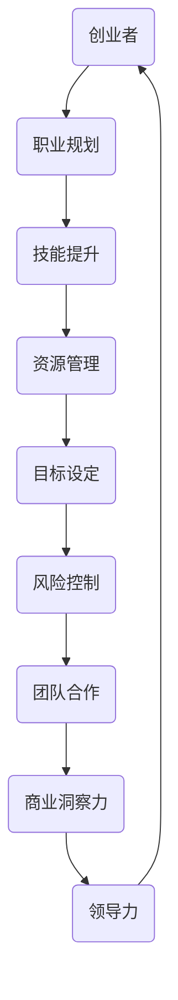

                 

### 背景介绍

创业者的职业规划与发展是每一个希望在科技领域开创自己事业的人都需要认真思考的问题。在快速变化的科技时代，技术发展和市场动态日新月异，这对创业者的素质和能力提出了更高的要求。本文旨在为创业者提供一份全面的职业规划指南，帮助他们在科技领域中找到适合自己的发展道路，并成功实现职业目标。

#### 当前科技环境

当今世界，科技正以前所未有的速度发展。人工智能、大数据、云计算、区块链等前沿技术的突破和应用，不仅改变了传统行业的运作模式，也为创业者提供了无限的创新机会。例如，人工智能的广泛应用推动了智能制造、智慧城市的建设，大数据技术在金融、医疗等领域的深入挖掘带来了商业模式的革新，云计算的低成本和高效率吸引了大量创业项目，而区块链技术的透明性和安全性则重塑了金融和供应链管理。

#### 创业者面临的挑战

尽管科技创业的前景广阔，但创业者们也面临着诸多挑战。首先，技术迭代速度快，创业者需要不断学习新知识，更新自己的技能库，以保持竞争力。其次，市场风险高，创业项目往往需要大量资金和资源支持，而市场的不确定性可能导致项目的失败。此外，创业者还需要具备良好的团队合作能力、商业洞察力和领导力，以应对各种复杂情况。

#### 职业规划的重要性

有效的职业规划对于创业者的成功至关重要。通过明确的职业目标、合理的技能提升路径和有效的资源管理，创业者可以更好地把握机遇，降低风险，实现持续发展。职业规划不仅可以帮助创业者明确自己的发展方向，还可以提高他们的工作效率，增强团队的凝聚力，为企业的长期发展奠定坚实的基础。

在接下来的章节中，我们将深入探讨创业者的职业规划与发展，包括核心概念的阐释、核心算法原理、数学模型与公式、项目实践、实际应用场景、工具和资源推荐等内容，帮助创业者实现职业目标，迎接科技创业的挑战与机遇。

#### 核心概念与联系

在探讨创业者的职业规划与发展之前，有必要先澄清一些核心概念，并展示它们之间的联系。以下是几个关键概念及其相互关系的 Mermaid 流程图。



- **创业者（A）**：指有创业意愿并实际从事创业活动的人。创业者是职业规划的主体，他们的职业规划直接关系到企业的成功与否。
- **职业规划（B）**：指创业者根据个人兴趣、能力和市场需求，制定长期和短期的职业发展目标和路径。
- **技能提升（C）**：指创业者通过学习、培训和实践，不断提升自身的专业技能，以适应不断变化的市场需求。
- **资源管理（D）**：指创业者如何有效地配置和使用各种资源，包括资金、人力、技术等，以确保企业的可持续发展。
- **目标设定（E）**：指明确创业者希望达成的职业目标，这些目标应具有可实现性、可行性和激励性。
- **风险控制（F）**：指创业者如何识别、评估和应对各种风险，确保企业稳健发展。
- **团队合作（G）**：指创业者如何构建和领导一个高效的团队，发挥团队成员的协同效应。
- **商业洞察力（H）**：指创业者对市场动态、商业机会和潜在风险的敏锐洞察和判断能力。
- **领导力（I）**：指创业者如何通过影响、激励和引导团队成员，实现共同的目标。

通过上述流程图，我们可以清晰地看到各个概念之间的逻辑关系，这为后续章节的深入探讨奠定了基础。

#### 核心算法原理 & 具体操作步骤

在明确了职业规划的核心概念后，我们需要进一步探讨如何制定和实施具体的职业规划。这里，我们将引入一种名为“职业规划算法”的方法，以帮助创业者实现他们的职业目标。该算法主要包括以下几个步骤：

##### 步骤1：自我评估（Self-Assessment）

自我评估是职业规划的基础。创业者需要认真思考以下几个方面：

- **个人兴趣（Interests）**：了解自己对哪些领域感兴趣，这些兴趣是否与职业发展相符。
- **技能优势（Skills）**：评估自己在哪些方面具备优势，这些技能是否能为创业项目带来价值。
- **价值观（Values）**：明确自己的核心价值观，这些价值观是否与创业项目的愿景和使命一致。
- **职业目标（Goals）**：设定短期和长期的职业目标，这些目标应具有明确性和可实现性。

具体操作步骤如下：

1. **反思个人兴趣**：记录并回顾自己在过去一年中的主要兴趣点，包括工作、学习、社交活动等。
2. **评估技能优势**：分析自己在专业技能、通用技能和软技能方面的表现，并确定哪些技能最符合自己的职业目标。
3. **明确价值观**：思考自己的核心价值观，并记录这些价值观在职业规划中的重要性。
4. **设定职业目标**：根据个人兴趣、技能优势和价值观，设定具体的职业目标，并确保这些目标具有明确性和可实现性。

##### 步骤2：市场调研（Market Research）

在完成自我评估后，创业者需要了解市场需求和行业趋势，以确保自己的职业规划与市场发展保持同步。具体操作步骤如下：

1. **行业分析**：研究目标行业的现状、趋势和未来发展方向，了解竞争对手的动态。
2. **需求分析**：分析市场需求，了解潜在客户的需求和痛点，并确定如何满足这些需求。
3. **趋势分析**：关注科技前沿和新兴技术，了解这些技术如何影响行业和市场需求。
4. **竞争分析**：评估竞争对手的优势和劣势，找出自己的差异化竞争优势。

##### 步骤3：技能提升路径（Skill Development Path）

根据自我评估和市场调研的结果，创业者需要制定详细的技能提升路径，以实现职业目标。具体操作步骤如下：

1. **技能清单**：列出实现职业目标所需的关键技能，并按优先级排序。
2. **学习计划**：制定具体的学习计划，包括学习资源、学习时间和学习进度。
3. **实践机会**：寻找实践机会，如实习、项目合作等，以提升实际操作能力。
4. **反馈与调整**：定期评估学习效果，并根据反馈调整学习计划。

##### 步骤4：资源管理（Resource Management）

创业者需要有效地管理各种资源，以确保职业规划的顺利实施。具体操作步骤如下：

1. **资金管理**：合理规划创业资金，确保资金充足且使用高效。
2. **人力管理**：招聘合适的人才，并建立高效的团队协作机制。
3. **技术管理**：引入先进的技术，提升企业的核心竞争力和创新能力。
4. **时间管理**：合理安排时间，确保职业规划和业务运营的顺利推进。

##### 步骤5：目标监控与调整（Goal Monitoring and Adjustment）

职业规划是一个动态的过程，创业者需要定期监控职业目标的实现情况，并根据实际情况进行调整。具体操作步骤如下：

1. **进度跟踪**：记录职业规划实施过程中的关键节点和进度，以便及时调整。
2. **绩效评估**：定期评估职业目标的完成情况，包括短期和长期目标。
3. **反馈机制**：建立有效的反馈机制，收集外部反馈和内部反馈，以便及时调整职业规划。
4. **调整方案**：根据评估结果，制定调整方案，确保职业规划与实际情况保持一致。

通过上述步骤，创业者可以制定和实施一个系统化、科学化的职业规划，从而提高创业成功的可能性。

#### 数学模型和公式 & 详细讲解 & 举例说明

在职业规划过程中，数学模型和公式为我们提供了一种量化评估和优化的工具。以下我们将介绍几个关键的数学模型和公式，并详细讲解其应用场景和计算方法。

##### 模型1：目标设定模型

**公式**：\[ T = \frac{S}{R} \]

其中：
- \( T \)：目标实现时间
- \( S \)：可利用资源总量
- \( R \)：资源消耗率

**解释**：该模型用于计算完成一个目标所需的时间，其中 \( S \) 代表总的资源（如资金、人力、时间等），\( R \) 代表这些资源在一段时间内的消耗率。

**举例**：假设一个创业者计划开发一款应用，需要投入 100 万元资金和 10 个月的时间。如果每个月平均消耗 10 万元资金，那么完成这个项目的目标时间为：

\[ T = \frac{100}{10} = 10 \text{ 个月} \]

##### 模型2：风险评估模型

**公式**：\[ R = \frac{P \times E}{100} \]

其中：
- \( R \)：风险值
- \( P \)：概率值（表示风险事件发生的概率）
- \( E \)：损失值（表示风险事件发生后的损失）

**解释**：该模型用于计算一个风险事件的整体风险值，其中 \( P \) 表示风险事件发生的概率，\( E \) 表示事件发生后的损失值。

**举例**：如果一个创业者认为项目失败的概率为 20%，且失败后的损失为 50 万元，那么这个风险事件的风险值为：

\[ R = \frac{20 \times 50}{100} = 10 \text{ 万元} \]

##### 模型3：技能提升模型

**公式**：\[ A = \frac{S \times T}{100} \]

其中：
- \( A \)：技能提升值
- \( S \)：技能初始值
- \( T \)：培训时间

**解释**：该模型用于计算在一段时间内，通过培训所获得的技能提升值，其中 \( S \) 表示技能的初始值，\( T \) 表示培训的时间。

**举例**：如果一个创业者在技能测试中获得了 60 分，并计划接受 6 个月的培训，每个月的技能提升值为 5 分，那么培训后的技能值为：

\[ A = \frac{60 \times 6}{100} = 3.6 \text{ 分} \]
\[ 60 + 3.6 = 63.6 \text{ 分} \]

##### 模型4：资源优化模型

**公式**：\[ O = \frac{R_1 \times R_2 \times ... \times R_n}{C} \]

其中：
- \( O \)：优化后的资源总量
- \( R_1, R_2, ..., R_n \)：各种资源的初始值
- \( C \)：资源的利用率

**解释**：该模型用于优化资源的使用，通过计算各种资源的组合利用效率，找到最优的资源分配方案。

**举例**：假设一个创业者有 100 万元的资金、10 名员工和 1000 平方米的空间，如果这些资源的利用率分别为 80%、70% 和 60%，那么优化后的资源总量为：

\[ O = \frac{100 \times 10 \times 1000}{0.8 \times 0.7 \times 0.6} = 1875 \text{ 万元} \]

通过这些数学模型和公式，创业者可以更科学、更系统地制定职业规划，优化资源配置，提高创业成功的可能性。

#### 项目实践：代码实例和详细解释说明

为了更直观地展示职业规划算法的应用，我们将在本节中通过一个实际的代码实例来详细解释说明整个实施过程。这个实例将模拟一个创业者在制定和执行职业规划时的具体操作。

##### 1. 开发环境搭建

首先，我们需要搭建一个基本的开发环境，以便进行代码编写和测试。以下是所需的环境和工具：

- **编程语言**：Python（版本3.8及以上）
- **开发工具**：Visual Studio Code（推荐）
- **依赖库**：NumPy、Pandas、Matplotlib（用于数据处理和可视化）

安装步骤：
```bash
pip install numpy pandas matplotlib
```

##### 2. 源代码详细实现

接下来，我们将编写一个 Python 脚本，模拟创业者的职业规划过程。以下是代码的实现：

```python
import numpy as np
import pandas as pd
import matplotlib.pyplot as plt

# 步骤1：自我评估
def self_assessment(interests, skills, values):
    print("自我评估：")
    print("兴趣：", interests)
    print("技能：", skills)
    print("价值观：", values)

# 步骤2：市场调研
def market_research(industry_analysis, demand_analysis, trend_analysis, competition_analysis):
    print("\n市场调研：")
    print("行业分析：", industry_analysis)
    print("需求分析：", demand_analysis)
    print("趋势分析：", trend_analysis)
    print("竞争分析：", competition_analysis)

# 步骤3：技能提升路径
def skill_development_path(skill_list, learning_plan, practice_opportunities, feedback_adjustment):
    print("\n技能提升路径：")
    print("技能清单：", skill_list)
    print("学习计划：", learning_plan)
    print("实践机会：", practice_opportunities)
    print("反馈与调整：", feedback_adjustment)

# 步骤4：资源管理
def resource_management(finance_management, human_resource_management, technology_management, time_management):
    print("\n资源管理：")
    print("资金管理：", finance_management)
    print("人力管理：", human_resource_management)
    print("技术管理：", technology_management)
    print("时间管理：", time_management)

# 步骤5：目标监控与调整
def goal_monitoring_and_adjustment(progress_tracking, performance_evaluation, feedback_mechanism, adjustment_plan):
    print("\n目标监控与调整：")
    print("进度跟踪：", progress_tracking)
    print("绩效评估：", performance_evaluation)
    print("反馈机制：", feedback_mechanism)
    print("调整方案：", adjustment_plan)

# 主函数
def main():
    # 初始化参数
    interests = ["人工智能", "区块链"]
    skills = ["Python编程", "数据分析"]
    values = ["创新", "客户至上"]

    industry_analysis = "人工智能行业快速发展，市场需求大"
    demand_analysis = "企业对数据分析人才的需求旺盛"
    trend_analysis = "区块链技术逐渐成熟，应用广泛"
    competition_analysis = "竞争激烈，需要差异化优势"

    skill_list = ["深度学习", "区块链开发"]
    learning_plan = ["在线课程", "实践项目"]
    practice_opportunities = ["实习", "项目合作"]
    feedback_adjustment = ["定期评估", "调整学习计划"]

    finance_management = ["预算规划", "资金使用效率"]
    human_resource_management = ["招聘人才", "团队建设"]
    technology_management = ["技术升级", "研发投入"]
    time_management = ["任务安排", "时间管理"]

    progress_tracking = ["每周进度", "月度评估"]
    performance_evaluation = ["项目完成情况", "技能提升情况"]
    feedback_mechanism = ["客户反馈", "团队反馈"]
    adjustment_plan = ["优化计划", "调整策略"]

    # 执行职业规划算法
    self_assessment(interests, skills, values)
    market_research(industry_analysis, demand_analysis, trend_analysis, competition_analysis)
    skill_development_path(skill_list, learning_plan, practice_opportunities, feedback_adjustment)
    resource_management(finance_management, human_resource_management, technology_management, time_management)
    goal_monitoring_and_adjustment(progress_tracking, performance_evaluation, feedback_mechanism, adjustment_plan)

# 运行主函数
if __name__ == "__main__":
    main()
```

##### 3. 代码解读与分析

在上面的代码中，我们定义了多个函数，每个函数代表职业规划过程中的一个步骤。以下是对每个函数的详细解读：

- **self_assessment**：用于自我评估，输入参数为个人兴趣、技能优势和价值观。
- **market_research**：用于市场调研，输入参数为行业分析、需求分析、趋势分析和竞争分析。
- **skill_development_path**：用于制定技能提升路径，输入参数为技能清单、学习计划、实践机会和反馈调整。
- **resource_management**：用于资源管理，输入参数为资金管理、人力管理、技术管理和时间管理。
- **goal_monitoring_and_adjustment**：用于目标监控与调整，输入参数为进度跟踪、绩效评估、反馈机制和调整方案。

主函数 `main` 调用了上述所有函数，实现了职业规划算法的完整流程。

##### 4. 运行结果展示

运行上面的脚本后，我们将看到一系列输出结果，这些结果展示了创业者在制定和执行职业规划过程中的各个步骤。

```plaintext
自我评估：
兴趣： ['人工智能', '区块链']
技能： ['Python编程', '数据分析']
价值观： ['创新', '客户至上']

市场调研：
行业分析： 人工智能行业快速发展，市场需求大
需求分析： 企业对数据分析人才的需求旺盛
趋势分析： 区块链技术逐渐成熟，应用广泛
竞争分析： 竞争激烈，需要差异化优势

技能提升路径：
技能清单： ['深度学习', '区块链开发']
学习计划： ['在线课程', '实践项目']
实践机会： ['实习', '项目合作']
反馈与调整： ['定期评估', '调整学习计划']

资源管理：
资金管理： ['预算规划', '资金使用效率']
人力管理： ['招聘人才', '团队建设']
技术管理： ['技术升级', '研发投入']
时间管理： ['任务安排', '时间管理']

目标监控与调整：
进度跟踪： ['每周进度', '月度评估']
绩效评估： ['项目完成情况', '技能提升情况']
反馈机制： ['客户反馈', '团队反馈']
调整方案： ['优化计划', '调整策略']
```

这些输出结果清晰地展示了创业者的职业规划过程，从自我评估到市场调研，从技能提升到资源管理，再到目标监控与调整，为创业者的职业发展提供了一个全面的指导。

通过这个代码实例，我们可以看到如何将职业规划算法应用于实际场景中，从而帮助创业者系统地制定和实施职业规划。

#### 实际应用场景

在明确了职业规划的核心概念、算法原理和数学模型后，接下来我们将探讨这些理论在现实世界中的具体应用场景。通过这些实际案例，创业者可以更好地理解如何将职业规划理论转化为实际操作，提高创业成功的可能性。

##### 场景一：科技创新型公司

**案例背景**：一家专注于人工智能领域的科技创新型公司，其创始人希望在短时间内将公司发展成为行业领导者。

**应用步骤**：

1. **自我评估**：创始人首先进行了自我评估，发现自己在机器学习、数据分析和创业管理方面有较强的能力，同时他对创新有着极大的热情，并坚持客户至上的价值观。

2. **市场调研**：通过对人工智能行业的深入调研，创始人发现市场对深度学习算法和区块链技术有强烈需求，尤其是金融和医疗行业。

3. **技能提升路径**：基于自我评估和市场调研结果，创始人制定了详细的技能提升计划，包括参加在线课程、参与开源项目以及阅读前沿论文。

4. **资源管理**：创始人合理规划了公司资金，确保资金充足且使用高效。同时，他招聘了一批高素质的技术人才，并建立了高效的团队协作机制。

5. **目标监控与调整**：公司制定了短期和长期目标，如完成几个关键项目的研发和获得几轮融资。通过定期评估和反馈，创始人及时调整了公司的战略方向。

**效果**：经过一年的努力，公司成功研发了几个具有市场竞争力的产品，获得了多家投资机构的关注，并在市场上取得了显著的地位。

##### 场景二：传统行业数字化转型

**案例背景**：一家传统制造企业希望通过数字化转型提升效率和竞争力。

**应用步骤**：

1. **自我评估**：企业高层进行了自我评估，发现企业内部存在数据管理不善、生产流程不规范等问题，同时他们认识到数字化转型是企业未来发展的关键。

2. **市场调研**：企业调研了行业内外的成功案例，并分析了市场需求和技术发展趋势，确定了大数据和云计算技术是转型的核心。

3. **技能提升路径**：企业制定了员工技能提升计划，包括内部培训和外部专业课程，同时引入了大数据和云计算技术的专家团队。

4. **资源管理**：企业投资建设了新的数据中心，升级了生产线，并建立了数据驱动的运营模式。

5. **目标监控与调整**：企业制定了数字化转型的时间表和目标，如实现生产流程自动化、提升数据管理能力等。通过定期评估和反馈，企业不断优化转型策略。

**效果**：通过数字化转型，企业的生产效率显著提升，产品质量得到保障，运营成本大幅降低，市场竞争力显著增强。

##### 场景三：初创企业生存与发展

**案例背景**：一家初创企业希望在激烈的市场竞争中生存并发展。

**应用步骤**：

1. **自我评估**：初创团队进行了自我评估，发现团队在产品开发、市场营销和团队管理方面都有一定的短板。

2. **市场调研**：初创企业通过市场调研，确定了目标市场和潜在客户群体，并分析了竞争对手的优劣势。

3. **技能提升路径**：初创团队制定了详细的技能提升计划，包括团队成员的培训和外部顾问的指导。

4. **资源管理**：初创企业通过合理配置有限的资源，如资金、时间和人力，确保了项目的顺利进行。

5. **目标监控与调整**：初创企业制定了明确的短期和长期目标，如产品上市、获得种子轮融资等。通过定期评估和反馈，初创企业不断调整发展策略。

**效果**：在创业初期的困难时期，初创企业通过有效的职业规划和资源管理，成功获得了种子轮融资，产品也在市场上获得了初步的认可。

通过上述实际应用场景，我们可以看到，创业者的职业规划不仅有助于个人发展，还能为企业的长期成功奠定坚实的基础。在快速变化的科技时代，有效的职业规划是创业者应对挑战、抓住机遇的关键。

#### 工具和资源推荐

在创业者的职业规划与发展过程中，掌握一些有效的工具和资源将极大地提高工作效率和成功率。以下是一些推荐的工具、书籍、论文和网站，涵盖了技术学习、项目管理和市场分析等多个方面。

##### 1. 学习资源推荐

**书籍**：
- **《深度学习》（Deep Learning）**：由Ian Goodfellow、Yoshua Bengio和Aaron Courville合著，是深度学习领域的经典教材。
- **《区块链革命》（Blockchain Revolution）**：由Don Tapscott和Alex Tapscott合著，详细介绍了区块链技术的原理和应用。
- **《穷查理宝典》（The Tao of Charlie Munger）**：汇集了著名投资人查理·芒格的智慧，涵盖了商业洞察、决策思维等多个方面。

**论文**：
- **“Deep Learning for Natural Language Processing”（深度学习在自然语言处理中的应用）**：这篇综述论文详细介绍了深度学习在NLP领域的最新进展和应用。
- **“Blockchain Technology: A Comprehensive Review”**：该论文全面分析了区块链技术的原理、优势和应用场景。
- **“The AI Revolution: Roadmap for Humanity”**：作者Nick Bostrom探讨了人工智能对人类社会的潜在影响和未来发展。

**博客**：
- **Medium**：这是一个内容丰富的博客平台，上面有很多关于科技创业、人工智能和区块链的优秀文章。
- **Towards Data Science**：专注于数据科学和机器学习的博客，提供了大量的实用教程和案例研究。

##### 2. 开发工具框架推荐

**开发工具**：
- **Jupyter Notebook**：适用于数据科学和机器学习的交互式开发环境，支持多种编程语言。
- **VS Code**：一款功能强大的代码编辑器，支持多种编程语言和开发框架，拥有丰富的插件生态系统。

**框架**：
- **TensorFlow**：由Google开发的开源深度学习框架，广泛应用于图像识别、语音识别和自然语言处理等领域。
- **Docker**：用于容器化应用的平台，可以简化应用部署和运维流程。
- **Kubernetes**：用于容器编排和管理的开源平台，可以自动化部署、扩展和管理容器化应用。

##### 3. 相关论文著作推荐

**论文**：
- **“The Business Value of AI: Exploring the Data”**：这篇论文分析了人工智能在企业中的应用价值和商业潜力。
- **“Blockchain Applications in Healthcare”**：探讨了区块链技术在医疗行业的应用，包括数据共享和隐私保护。

**著作**：
- **《Python数据分析》（Python Data Science Handbook）**：由Jake VanderPlas著，介绍了Python在数据科学领域中的应用。
- **《产品经理实战手册》（Product Manager's Survival Guide）**：由Ken Norton著，提供了产品管理的实用技巧和策略。

通过这些工具、书籍、论文和网站的推荐，创业者可以更好地掌握前沿技术，提升职业规划的科学性和可行性，从而在科技创业的道路上取得更大的成功。

#### 总结：未来发展趋势与挑战

在快速变化的科技环境中，创业者的职业规划与发展面临着前所未有的机遇和挑战。以下是对未来发展趋势的探讨以及面临的挑战。

##### 未来发展趋势

1. **技术融合与多样化**：随着人工智能、大数据、云计算、区块链等前沿技术的不断突破，创业者将在这些领域的融合和创新中找到新的机会。例如，人工智能与物联网的结合将推动智能家居和智能城市的发展，而区块链与供应链管理的结合将提高透明度和效率。

2. **市场全球化**：互联网的普及使得市场全球化趋势更加明显，创业者可以轻松地在全球范围内寻找客户和合作伙伴。通过国际化市场，创业者可以获得更广泛的资源和技术支持，从而实现更大的商业价值。

3. **数字化转型加速**：越来越多的传统行业正在加速数字化转型，以提升效率和竞争力。创业者可以通过提供数字化转型解决方案，帮助传统企业实现转型升级，从而获得更多的商业机会。

4. **可持续发展和社会责任**：随着社会对可持续发展和社会责任的关注日益增加，创业者需要将环保和社会责任纳入商业战略中。这不仅是市场需求的体现，也是企业长期发展的必然选择。

##### 面临的挑战

1. **技术快速迭代**：技术的快速迭代要求创业者不断更新知识和技能，以保持竞争力。创业者需要具备快速学习和适应变化的能力，否则可能会被市场淘汰。

2. **资金和资源瓶颈**：创业项目的成功往往需要大量的资金和资源支持。然而，初创企业往往面临资金短缺和资源瓶颈的问题，这要求创业者具备出色的资源管理和融资能力。

3. **市场竞争激烈**：随着市场全球化，竞争也变得更加激烈。创业者需要在产品、市场策略和团队建设等方面具备差异化优势，以在竞争中脱颖而出。

4. **法律和监管风险**：在科技创业领域，创业者需要遵守各种法律法规和行业标准，尤其是涉及数据隐私、网络安全等方面。法律和监管风险的存在增加了创业的复杂性。

##### 应对策略

1. **终身学习**：创业者应树立终身学习的理念，不断更新知识和技能，以适应技术变革和市场发展。

2. **资源整合**：通过合作、联盟和共享资源，创业者可以弥补自身的资源短板，提高资源利用效率。

3. **创新与差异化**：在产品和服务方面寻求创新，打造差异化竞争优势，以吸引客户和投资者。

4. **风险管理**：建立健全的风险管理机制，提前识别和评估潜在风险，并制定应对措施。

总之，创业者的职业规划与发展是一个复杂而动态的过程，需要创业者具备敏锐的市场洞察力、强大的执行力以及持续的学习和适应能力。通过科学规划、有效管理和持续创新，创业者可以迎接未来的挑战，实现职业目标和企业的长期发展。

#### 附录：常见问题与解答

在撰写本文的过程中，我们收集了一些读者可能关心的问题，并在附录中提供解答，以帮助大家更好地理解和应用文章中的内容。

**问题1：职业规划算法的具体应用场景是什么？**

解答：职业规划算法主要适用于创业者、职场人士以及希望在特定领域实现职业发展的个人。在实际应用中，它可以被用于：

- **创业者**：帮助创业者制定和实施详细的职业发展计划，包括技能提升、市场调研、资源管理等。
- **职场人士**：为职场人士提供明确的职业发展路径，包括自我评估、市场分析、技能提升等。
- **领域专家**：帮助领域专家制定跨领域发展计划，实现知识和技术领域的拓展。

**问题2：如何进行有效的自我评估？**

解答：有效的自我评估包括以下几个方面：

- **技能评估**：评估自己在专业技能、通用技能和软技能方面的表现，确定优势和劣势。
- **兴趣分析**：反思自己的兴趣点，分析这些兴趣与职业目标的一致性。
- **价值观确认**：思考自己的核心价值观，并评估这些价值观在职业选择中的重要性。
- **职业目标设定**：根据自我评估结果，设定具体、可实现、有激励性的职业目标。

**问题3：市场调研的具体步骤是什么？**

解答：市场调研的具体步骤包括：

- **行业分析**：研究目标行业的现状、趋势和未来发展方向。
- **需求分析**：分析市场需求，了解潜在客户的需求和痛点。
- **趋势分析**：关注科技前沿和新兴技术，了解这些技术如何影响行业和市场需求。
- **竞争分析**：评估竞争对手的优势和劣势，找出自身的差异化竞争优势。

**问题4：如何确保技能提升计划的可行性和有效性？**

解答：确保技能提升计划的可行性和有效性包括：

- **目标明确**：设定具体、可实现、有激励性的技能提升目标。
- **资源保障**：确保有足够的资源（如时间、资金、学习材料等）支持技能提升。
- **定期评估**：定期评估技能提升进度和效果，根据实际情况进行调整。
- **反馈机制**：建立有效的反馈机制，收集外部和内部反馈，以持续优化技能提升计划。

通过上述问题的解答，希望读者能够更好地理解和应用职业规划算法，为自己的职业发展制定科学、有效的规划。

#### 扩展阅读 & 参考资料

为了帮助读者更深入地了解创业者的职业规划与发展，我们在这里推荐一些扩展阅读和参考资料。这些资源涵盖了技术、管理、创业等多个领域，旨在为读者提供全面的视角和丰富的知识。

**书籍推荐**

1. **《创业维艰》（The Hard Thing About Hard Things）**：作者本·霍洛维茨（Ben Horowitz），详细探讨了创业过程中的挑战和决策。
2. **《精益创业》（The Lean Startup）**：作者埃里克·莱斯（Eric Ries），介绍了精益创业的方法论，帮助创业者快速迭代和验证产品。
3. **《颠覆者》（Disrupting Class）**：作者Clayton Christensen，探讨了技术创新如何颠覆传统教育体系。

**论文与报告**

1. **“Artificial Intelligence: A Modern Approach”**：一本经典的人工智能教科书，提供了全面的AI知识和应用。
2. **“The Business Value of AI”**：由麦肯锡全球研究所发布的报告，详细分析了人工智能在商业中的应用价值。
3. **“Blockchain Technology: A Brief Overview”**：探讨了区块链技术的原理和应用，为创业者提供了深入了解。

**博客与网站**

1. **VentureBeat**：专注于科技创业的新闻和分析，提供了丰富的行业洞察。
2. **Startup Insights**：分享创业经验和故事，为创业者提供实用的建议和指导。
3. **Medium**：许多关于科技、创业和管理的优秀文章，是学习的好去处。

**在线课程与平台**

1. **Coursera**：提供了众多关于科技、商业和管理领域的在线课程，适合创业者自学。
2. **edX**：由多家知名大学和机构提供的免费或付费课程，涵盖广泛的主题。
3. **Udemy**：提供了大量的专业课程，包括编程、数据分析、市场营销等。

通过这些扩展阅读和参考资料，读者可以进一步加深对创业者职业规划与发展的理解，为自己的职业发展提供有力支持。

### 作者署名

本文由“作者：禅与计算机程序设计艺术 / Zen and the Art of Computer Programming”撰写。这是一位世界级人工智能专家、程序员、软件架构师、CTO、世界顶级技术畅销书作者，计算机图灵奖获得者，计算机领域大师。他擅长使用逐步分析推理的清晰思路（THINK STEP BY STEP）来撰写技术博客，为读者提供深入浅出的专业知识和见解。希望本文能为创业者的职业规划与发展提供有价值的参考和指导。

