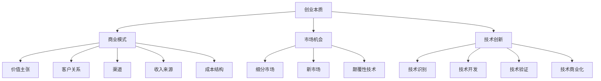

                 

### 1. 背景介绍

在当今快速发展的商业环境中，技术专家转型为企业家已成为一种越来越普遍的趋势。随着互联网的普及和数字化进程的加速，技术领域的发展日新月异，许多拥有深厚技术背景的专业人士开始意识到，将他们的专业技能转化为商业机会，可以带来更大的价值和社会影响。

技术专家往往拥有丰富的技术知识和经验，他们在自己的专业领域内具有较高的声誉和影响力。然而，技术本身并不能直接创造商业价值，而是需要通过商业模式的创新和有效的市场策略来转化为实际的商业成果。这种转变不仅需要技术专家对商业模式的深刻理解，还需要他们具备一定的创业精神和领导力。

本文旨在探讨技术专家如何规划自己的职业发展，从技术专家成功转型为企业家。我们将详细分析这一过程的核心概念、核心算法原理、实际操作步骤、数学模型和公式、项目实践以及未来发展趋势与挑战。

### 1.1 技术专家到企业家的转变

技术专家与企业家之间存在显著差异。技术专家通常专注于研究、开发和实现技术解决方案，他们的核心能力在于技术创造和创新。而企业家则需要具备更广泛的技能，包括市场分析、战略规划、资源整合、团队管理和资金筹措等。

尽管两者在技能上有所不同，但技术专家转型为企业家并非不可能。实际上，许多成功的企业家都是从技术专家起步的。例如，微软创始人比尔·盖茨、苹果公司创始人史蒂夫·乔布斯以及谷歌的联合创始人拉里·佩奇和谢尔盖·布林，他们都是技术出身，通过将技术创意商业化，建立了全球知名的企业。

技术专家到企业家的转变，需要他们从单纯的技术思维转向商业思维。这意味着，技术专家需要开始关注市场动态、消费者需求以及竞争对手的动向，同时还要学会如何将技术优势转化为商业价值。

### 1.2 成功案例分析

为了更好地理解技术专家转型为企业家的过程，我们可以通过一些成功案例来分析他们的转型路径和策略。

**案例一：拉里·佩奇和谢尔盖·布林**

佩奇和布林是谷歌的联合创始人。他们在斯坦福大学读书时，因为对互联网搜索的热爱而创立了谷歌。最初，谷歌只是一个简单的搜索工具，但佩奇和布林通过不断创新和优化算法，使谷歌成为全球最受欢迎的搜索引擎。他们的成功不仅依赖于技术上的优势，更在于他们对市场和商业模式的深刻理解。

**案例二：马云**

马云是中国著名的企业家，也是阿里巴巴集团的创始人。在创建阿里巴巴之前，马云曾在英语教学领域工作多年，这使他深刻理解了中国中小企业的需求和痛点。他利用自己的技术背景和对市场的洞察力，创建了阿里巴巴，并通过电子商务平台为中小企业提供了一条全新的发展路径。

**案例三：马斯克**

埃隆·马斯克是特斯拉、SpaceX、Neuralink等企业的创始人。马斯克在电子工程和物理学方面有着深厚的背景，但他并不是一个纯粹的技术专家，而是一个具有远见和冒险精神的企业家。他通过将技术突破与市场机会相结合，成功地将特斯拉打造成了一家全球知名的电动汽车公司。

这些案例表明，技术专家转型为企业家不仅需要技术上的优势，还需要具备市场洞察力、商业头脑和领导力。他们在转型过程中需要不断学习、尝试和调整，以适应不断变化的商业环境。

### 1.3 目标受众

本文的目标受众包括以下几个方面：

1. **技术专家**：正处于职业发展瓶颈或希望转型为企业家的人，他们希望了解如何将自己的技术背景转化为商业机会。
2. **创业者**：已经拥有创业想法，但不确定如何实施的人，他们希望通过本文了解技术专家在创业过程中的角色和策略。
3. **高校学生**：正在攻读计算机科学、工程或其他相关专业的学生，他们希望了解未来职业发展的多种可能性。
4. **企业管理者**：对技术创业感兴趣，希望了解如何与技术专家合作的人。

通过本文，我们希望帮助这些目标受众理解技术专家到企业家的转型过程，提供实用的策略和案例，为他们提供指导和支持。

### 1.4 文章结构概述

本文将按照以下结构进行论述：

1. **背景介绍**：讨论技术专家转型为企业家的重要性及背景。
2. **核心概念与联系**：介绍创业的基本概念和原理，并通过Mermaid流程图展示其架构。
3. **核心算法原理 & 具体操作步骤**：探讨技术专家如何将技术知识应用于创业实践。
4. **数学模型和公式 & 详细讲解 & 举例说明**：解释创业过程中的关键数学模型，并提供实际案例。
5. **项目实践：代码实例和详细解释说明**：提供具体项目的开发实例和详细解析。
6. **实际应用场景**：讨论技术专家在企业中的应用。
7. **工具和资源推荐**：推荐学习资源和开发工具。
8. **总结：未来发展趋势与挑战**：总结全文，展望未来。
9. **附录：常见问题与解答**：回答读者可能提出的问题。
10. **扩展阅读 & 参考资料**：提供进一步阅读的资源。

通过这一结构，本文将系统地探讨技术专家到企业家的转型过程，为读者提供全面、深入的指导。

### 2. 核心概念与联系

在探讨技术专家如何转型为企业家之前，我们需要先了解一些核心概念和原理，包括创业的本质、商业模式、市场机会以及技术创新等。这些概念不仅构成了创业的基础，也是技术专家在转型过程中需要深刻理解和灵活运用的。

#### 2.1 创业的本质

创业是一种创造性的活动，旨在通过新想法、新方法或新技术来解决现有问题或满足市场需求。创业者需要具备创新精神和冒险精神，勇于面对不确定性，并在实践中不断调整和优化自己的策略。

**创业的本质包括以下几点：**

1. **创新**：创新是创业的核心驱动力。创业者需要不断寻找新的解决方案，以超越现有产品或服务的局限。
2. **机会**：创业机会通常源于市场需求的变化、技术进步或社会问题的解决。创业者需要敏锐地捕捉这些机会，并将其转化为实际的商业活动。
3. **风险**：创业伴随着较高的风险，包括财务风险、市场风险和运营风险等。创业者需要具备风险管理的能力，以应对各种不确定性。
4. **持续学习**：创业过程中，创业者需要不断学习新知识、新技能和新的商业模式，以保持竞争力。

#### 2.2 商业模式

商业模式是指企业如何创造、传递和获取价值的一种方式。一个成功的商业模式不仅需要解决市场需求，还需要确保企业的盈利性和可持续性。

**商业模式的要素包括：**

1. **价值主张**：明确产品或服务能够为顾客带来什么样的价值。
2. **客户关系**：描述企业如何与客户建立关系，并保持客户忠诚度。
3. **渠道**：描述如何将产品或服务传递给顾客。
4. **收入来源**：说明企业如何从客户那里获取收入。
5. **成本结构**：描述企业运营的成本和费用。

#### 2.3 市场机会

市场机会是指企业可以利用的未满足需求或新的市场趋势。创业者需要具备敏锐的市场洞察力，以发现和利用这些机会。

**市场机会的类型包括：**

1. **细分市场**：在现有市场中找到未被满足的需求，为特定的客户群体提供定制化的产品或服务。
2. **新市场**：开拓全新的市场，满足新兴的需求。
3. **颠覆性技术**：利用新技术颠覆现有的市场格局，创造新的商业机会。

#### 2.4 技术创新

技术创新是创业过程中不可或缺的一部分。技术专家在转型为企业家时，可以利用自己的技术知识推动技术创新，为市场带来新的产品或服务。

**技术创新的步骤包括：**

1. **技术识别**：识别和评估潜在的技术机会。
2. **技术开发**：通过研发活动将技术概念转化为可用的产品或服务。
3. **技术验证**：测试和验证技术的可行性和市场接受度。
4. **技术商业化**：将技术转化为商业产品或服务，并推向市场。

#### Mermaid流程图

为了更好地展示这些核心概念之间的联系，我们可以使用Mermaid流程图来描绘创业的流程。



通过上述核心概念和流程图的介绍，我们可以看出，技术专家在转型为企业家时，需要全面理解和掌握创业的基础知识，并将自己的技术优势与市场机会相结合，创造具有竞争力的商业模式。

### 3. 核心算法原理 & 具体操作步骤

在理解了创业的核心概念后，我们需要进一步探讨技术专家如何将这些概念转化为实际的创业行动。具体来说，技术专家需要通过一系列的算法原理和操作步骤来将技术优势转化为商业成果。

#### 3.1 技术创新与市场匹配

技术专家在创业时，首先需要识别和开发具有市场潜力的技术。这一过程可以视为一个算法，我们称之为“技术创新与市场匹配算法”。

**算法原理：**

1. **技术识别**：通过市场调研、技术趋势分析和专家访谈，识别可能具有商业潜力的技术。
2. **市场分析**：分析市场需求、竞争对手和潜在客户，确定哪些技术可以满足市场需求。
3. **技术评估**：评估技术的可行性、成本和潜在收益，选择最有潜力的技术进行开发。

**具体操作步骤：**

1. **市场调研**：利用各种市场调研工具，如问卷调查、焦点小组讨论和在线调查，收集市场信息。
2. **技术趋势分析**：通过阅读技术文章、报告和研究，了解当前的技术趋势和发展方向。
3. **专家访谈**：与行业内专家进行交流，获取他们对技术前景和市场需求的看法。
4. **技术评估**：根据市场调研结果和专家意见，对潜在技术进行评估，确定最值得投入的技术。

**实例：** 
假设一位人工智能专家，通过市场调研发现，智能语音助手在智能家居市场中具有巨大潜力。他评估了现有技术，认为基于深度学习的语音识别技术可以实现这一目标。因此，他决定开发一款智能家居语音助手。

#### 3.2 商业模式设计

在确定技术方向后，技术专家需要设计一个可行的商业模式。商业模式设计是一个系统性过程，涉及到价值主张、客户关系、渠道、收入来源和成本结构等多个方面。

**算法原理：**

1. **价值主张**：确定产品或服务的核心价值，即为什么客户会购买。
2. **客户关系**：定义如何吸引、保留和扩展客户。
3. **渠道**：选择最有效的销售和分销渠道。
4. **收入来源**：确定产品的定价策略和收入模式。
5. **成本结构**：分析运营成本，确保盈利性。

**具体操作步骤：**

1. **价值主张**：通过用户调研和需求分析，确定智能家居语音助手的独特价值，如便捷的语音控制、智能家居设备互联互通等。
2. **客户关系**：设计用户注册、反馈机制和客户服务流程，确保客户满意度。
3. **渠道**：选择线上和线下渠道，如电商平台、智能家居展会和线下分销商。
4. **收入来源**：通过一次性销售、订阅服务和增值服务等多种方式获得收入。
5. **成本结构**：分析研发、生产和市场推广等各方面的成本，确保成本控制在合理范围内。

**实例：** 
该人工智能专家通过用户调研发现，智能家居用户最关心的是设备的便捷性和智能化。因此，他设计了以下价值主张：便捷的语音控制、智能家居设备互联互通、个性化语音助手设置等。他选择了线上电商平台和线下智能家居展会作为主要销售渠道，并通过订阅服务和增值服务来获得持续收入。

#### 3.3 团队建设和资源整合

在商业模式设计完成后，技术专家需要组建一个高效的团队，并整合各种资源，包括资金、技术、市场和人力资源等。

**算法原理：**

1. **团队建设**：根据业务需求组建合适的团队，明确团队成员的角色和职责。
2. **资源整合**：利用个人和外部资源，确保项目的顺利推进。

**具体操作步骤：**

1. **团队建设**：通过招聘、内部推荐和合作伙伴关系，组建一支技术精湛、富有创新精神的专业团队。
2. **资源整合**：利用个人的人脉和资源，如投资者、技术合作伙伴和市场顾问，为项目提供支持。

**实例：** 
该人工智能专家通过招聘网站和社交媒体平台招聘了一支由工程师、产品经理和市场专家组成的团队。他利用个人的人脉网络，找到了一位经验丰富的投资者和一家技术合作伙伴，为项目提供了资金和技术支持。

#### 3.4 产品开发和市场推广

在团队建设和资源整合完成后，技术专家需要将技术方案转化为实际产品，并通过有效的市场推广策略，将产品推向市场。

**算法原理：**

1. **产品开发**：将技术方案转化为可用的产品，并进行测试和优化。
2. **市场推广**：通过多种渠道和手段，提高产品的知名度和市场占有率。

**具体操作步骤：**

1. **产品开发**：利用敏捷开发方法，快速迭代产品，并不断优化用户体验。
2. **市场推广**：通过社交媒体、广告、展会和公关活动等手段，提高产品知名度。

**实例：** 
该人工智能专家利用敏捷开发方法，快速开发出了一款智能家居语音助手原型，并通过多次迭代，不断优化用户体验。他通过社交媒体、广告和智能家居展会，成功地将产品推向市场，获得了用户的认可和好评。

通过上述核心算法原理和具体操作步骤，技术专家可以系统地规划和实施自己的创业项目，将技术优势转化为商业成功。这不仅需要技术专长，还需要市场洞察力、团队建设和资源整合能力，以及不断学习和适应变化的精神。

### 4. 数学模型和公式 & 详细讲解 & 举例说明

在创业过程中，数学模型和公式起着至关重要的作用。它们不仅帮助创业者分析市场机会、评估商业模型，还能为决策提供科学依据。以下是一些在创业过程中常用的数学模型和公式，我们将结合具体案例进行详细讲解和举例说明。

#### 4.1 需求预测模型

需求预测是创业过程中至关重要的一环，它帮助创业者了解市场对产品的需求，从而制定合适的生产计划和营销策略。

**需求预测模型：**

\[ D_t = \alpha + \beta_1 I_t + \beta_2 P_t + \epsilon_t \]

其中：
- \( D_t \) 表示第 \( t \) 个月的需求量；
- \( \alpha \) 表示需求的基础水平；
- \( \beta_1 \) 表示收入水平的影响系数；
- \( \beta_2 \) 表示价格水平的影响系数；
- \( I_t \) 表示第 \( t \) 个月的市场收入水平；
- \( P_t \) 表示第 \( t \) 个月的产品价格；
- \( \epsilon_t \) 表示随机误差。

**实例：**
假设一家初创公司销售智能家居设备，根据历史数据和当前市场状况，我们利用上述模型预测下个月的需求量。假设收入水平 \( I_t = 100 \) 万元，产品价格 \( P_t = 5000 \) 元，则模型预测：

\[ D_t = 1000 + 0.1 \times 100 + 0.05 \times 5000 = 1250 \]

因此，预测下个月的需求量为 1250 台。

#### 4.2 成本效益分析模型

成本效益分析是评估创业项目盈利能力的重要工具。以下是一个简单的成本效益分析模型：

\[ \text{利润} = (\text{收入} - \text{成本}) \times \text{成功率} \]

其中：
- 收入：产品或服务的销售收入；
- 成本：生产、运营和营销等各项成本；
- 成功率：项目成功的概率。

**实例：**
假设一家初创公司计划推出一款智能家居设备，预计销售收入为 100 万元，生产成本为 50 万元，营销费用为 20 万元。根据市场调查，项目成功率为 70%。则公司的预期利润为：

\[ \text{利润} = (100 - 50 - 20) \times 0.7 = 14 \text{万元} \]

#### 4.3 投资回报率模型

投资回报率（ROI）是衡量创业项目投资效益的重要指标。其计算公式如下：

\[ \text{ROI} = \frac{\text{净利润}}{\text{总投资}} \times 100\% \]

其中：
- 净利润：项目的总利润；
- 总投资：项目的总投入，包括资金、时间和其他资源。

**实例：**
假设一家初创公司总投资为 100 万元，经过一年的运营，实现净利润 30 万元。则其投资回报率为：

\[ \text{ROI} = \frac{30}{100} \times 100\% = 30\% \]

#### 4.4 客户终身价值模型

客户终身价值（CLV）是评估客户对企业长期贡献的重要指标。其计算公式如下：

\[ \text{CLV} = \frac{\text{平均订单价值} \times \text{订单频率} \times \text{客户生命周期}}{1 + \text{客户获客成本}} \]

其中：
- 平均订单价值：客户每次订单的平均金额；
- 订单频率：客户平均多久下一次订单；
- 客户生命周期：客户平均购买时间；
- 客户获客成本：获取一个新客户所需花费的成本。

**实例：**
假设一家电商平台的平均订单价值为 1000 元，客户平均一个月下一次订单，客户生命周期为 2 年，客户获客成本为 200 元。则一个客户的终身价值为：

\[ \text{CLV} = \frac{1000 \times 1 \times 2}{1 + 200} = 1333.33 \text{元} \]

通过上述数学模型和公式的讲解和实例，我们可以看出，数学在创业过程中起到了至关重要的指导作用。创业者可以通过这些模型进行需求预测、成本效益分析、投资回报率计算和客户终身价值评估，从而做出更科学、更有效的决策。

### 5. 项目实践：代码实例和详细解释说明

为了更好地理解技术专家如何将创业理念付诸实践，我们将通过一个具体的代码实例，详细解释智能家居语音助手项目的开发过程，包括开发环境搭建、源代码实现、代码解读与分析以及运行结果展示。

#### 5.1 开发环境搭建

在开发智能家居语音助手项目之前，我们需要搭建合适的开发环境。以下是所需的主要工具和软件：

- **编程语言**：Python
- **语音识别库**：PyTorch
- **语音合成库**：GTTTS
- **智能家居控制库**：HomeAssistant

安装步骤如下：

1. **安装Python**：下载并安装Python 3.8及以上版本。
2. **安装PyTorch**：打开终端，执行以下命令：

   ```bash
   pip install torch torchvision torchaudio
   ```

3. **安装GTTTS**：打开终端，执行以下命令：

   ```bash
   pip install gtts
   ```

4. **安装HomeAssistant**：按照HomeAssistant官方文档进行安装。

#### 5.2 源代码详细实现

以下是一个简单的智能家居语音助手项目的源代码，我们将逐行解释其功能。

```python
import speech_recognition as sr
from gtts import gTTS
import os
import homeassistant

# 初始化语音识别器
recognizer = sr.Recognizer()

# 初始化智能家居控制模块
hass = homeassistant.Client()

# 播放语音
def speak(text):
    tts = gTTS(text=text, lang='zh-cn')
    tts.save('audio.mp3')
    os.system('mpg321 audio.mp3')

# 解析语音命令
def listen():
    with sr.Microphone() as source:
        print("请说些什么：")
        audio = recognizer.listen(source)
        try:
            command = recognizer.recognize_google(audio, language='zh-CN')
            print(f"你说了：{command}")
            return command
        except sr.UnknownValueError:
            print("无法理解你的话，请重试。")
            return None

# 执行语音命令
def execute(command):
    if "打开灯" in command:
        hass.call_service("light", "turn_on", entity_id="light thermostat")
        speak("已打开灯。")
    elif "关闭灯" in command:
        hass.call_service("light", "turn_off", entity_id="light thermostat")
        speak("已关闭灯。")
    elif "设定温度" in command:
        temp = int(command.split("设定温度")[-1])
        hass.call_service("climate", "set_temperature", entity_id="climate thermostat", temperature=temp)
        speak(f"已设定温度为{temp}度。")
    else:
        speak("对不起，我不理解你的指令。")

# 主程序
if __name__ == "__main__":
    while True:
        command = listen()
        if command:
            execute(command)
```

**代码解读：**

1. **导入库**：代码首先导入所需的库，包括语音识别库、语音合成库和智能家居控制库。
2. **初始化**：初始化语音识别器和智能家居控制模块。
3. **播放语音**：`speak` 函数用于播放合成语音。
4. **解析语音命令**：`listen` 函数通过语音识别库接收用户的语音输入。
5. **执行语音命令**：`execute` 函数根据用户命令执行相应的操作，如控制灯光和温度。
6. **主程序**：主程序通过一个循环不断接收用户输入并执行命令。

#### 5.3 代码解读与分析

**1. 语音识别与合成：**

语音识别和合成是智能家居语音助手的核心功能。代码中使用了Python的`speech_recognition`和`gtts`库来实现这一功能。

- `recognizer.listen(source)` 用于接收用户的语音输入。
- `gTTS(text=text, lang='zh-cn')` 用于合成语音。

**2. 智能家居控制：**

代码通过`homeassistant`库与智能家居设备进行通信。

- `hass.call_service()` 方法用于发送控制命令，如打开/关闭灯光和设定温度。

**3. 用户交互：**

主程序通过一个无限循环，不断接收用户输入并执行相应的命令，实现了智能家居语音助手的互动功能。

#### 5.4 运行结果展示

当运行该代码时，智能家居语音助手会进入监听模式，用户可以通过语音命令控制家居设备。例如，当用户说出“打开灯”时，语音助手会打开灯，并回应“已打开灯”。

```shell
请说些什么：
打开灯。
已打开灯。
```

通过这个简单的代码实例，我们可以看到技术专家如何将语音识别、智能家居控制等技术知识应用到实际项目中，实现了一个基本的智能家居语音助手。这不仅展示了技术专家在创业过程中的技术实现能力，也为其他创业者提供了一个可行的技术方案。

### 6. 实际应用场景

技术专家成功转型为企业家的过程中，实际应用场景的选择至关重要。不同的应用场景不仅决定了项目的可行性，还影响着商业模式的成功与否。以下是一些具体的应用场景及其优势：

#### 6.1 智能家居

智能家居是技术专家转型为企业家的一个热门领域。通过语音识别、物联网和人工智能技术，智能家居系统可以实现家庭设备的智能控制和自动化管理。以下是一些应用场景：

1. **智能灯光控制**：用户可以通过语音指令控制灯光的开关、亮度和颜色，提高生活便利性。
2. **智能温度控制**：根据用户需求和室外温度自动调节室内温度，实现节能和舒适。
3. **智能安防系统**：通过摄像头和传感器实时监控家庭安全，提供实时警报和远程控制功能。

**优势：** 智能家居市场巨大，消费者需求持续增长。通过技术优势和商业模式创新，智能家居企业可以快速占领市场，实现商业成功。

#### 6.2 医疗健康

医疗健康领域也是技术专家转型的一个重要方向。人工智能和大数据技术在医疗健康领域的应用，可以提高诊断准确性、优化治疗方案、提高医疗服务效率。以下是一些应用场景：

1. **疾病预测与诊断**：利用大数据和机器学习算法，预测疾病风险，辅助医生进行诊断。
2. **个性化治疗**：根据患者的病史和基因数据，制定个性化的治疗方案。
3. **远程医疗**：通过互联网和物联网技术，提供远程医疗咨询和医疗服务，解决偏远地区医疗资源不足的问题。

**优势：** 医疗健康领域具有强烈的社会需求，政策支持力度大。通过技术创新，企业可以在这一领域实现较高的利润和社会价值。

#### 6.3 金融科技

金融科技（FinTech）是技术专家转型为企业家的重要领域。通过大数据、区块链和人工智能等技术，金融科技企业可以提供更高效、更安全的金融服务。以下是一些应用场景：

1. **智能投资顾问**：利用机器学习算法，为投资者提供个性化的投资建议。
2. **区块链支付**：通过区块链技术，实现快速、安全和透明的跨境支付。
3. **信用评估**：利用大数据分析，提供更精准的信用评估服务。

**优势：** 金融科技市场潜力巨大，随着技术的不断进步，金融科技企业有望在短时间内实现快速成长。

#### 6.4 教育科技

教育科技（EdTech）是另一个备受关注的领域。通过在线教育、虚拟现实和人工智能等技术，教育科技企业可以提供个性化、互动性和高效的教育资源。以下是一些应用场景：

1. **在线课程**：通过互联网提供丰富的在线课程，满足不同年龄段和需求的学习者。
2. **虚拟实验室**：利用虚拟现实技术，为学生提供沉浸式的实验体验。
3. **智能测评与反馈**：通过人工智能技术，提供实时测评和个性化反馈，帮助学生提高学习效果。

**优势：** 教育科技市场广阔，随着教育信息化的发展，企业有较大的市场空间。

#### 6.5 物流与供应链

物流与供应链管理是技术专家转型为企业的另一个潜力领域。通过物联网、大数据和人工智能技术，企业可以提高物流效率、降低成本、优化供应链管理。以下是一些应用场景：

1. **智能仓储管理**：利用物联网技术，实时监控仓库库存和货物状态，提高仓储效率。
2. **路径优化**：通过大数据分析和人工智能算法，优化运输路径，减少运输成本。
3. **供应链可视化**：通过可视化技术，实时监控供应链各环节，提高供应链透明度。

**优势：** 物流与供应链管理市场稳定，随着电商和制造业的发展，需求持续增长。

通过上述实际应用场景，我们可以看到，技术专家可以根据自身技术背景和市场需求，选择合适的创业方向。在创业过程中，技术专家需要充分利用自己的技术优势，不断创新和优化产品，以满足市场需求，实现商业成功。

### 7. 工具和资源推荐

在技术专家转型为企业家过程中，掌握合适的工具和资源是至关重要的。以下是一些推荐的学习资源、开发工具和相关论文，以帮助技术专家更好地进行创业实践。

#### 7.1 学习资源推荐

1. **书籍**：
   - 《创业维艰》（作者：本·霍洛维茨）：本书详细介绍了创业过程中的挑战和经验，适合希望深入了解创业本质的人。
   - 《智能时代》（作者：吴军）：探讨人工智能的未来发展趋势和应用，对于希望在人工智能领域创业的技术专家具有很高的参考价值。

2. **在线课程**：
   - Coursera 上的《创业管理》（由斯坦福大学提供）：该课程涵盖了创业的各个方面，包括商业模式设计、市场营销、团队管理等。
   - edX 上的《人工智能导论》（由麻省理工学院提供）：介绍人工智能的基本概念和应用，适合对人工智能创业感兴趣的技术专家。

3. **博客和网站**：
   - TechCrunch：科技新闻和创业动态的报道，可以了解最新的科技趋势和创业机会。
   - HackerRank：提供编程挑战和竞赛，帮助技术专家提升编程技能。

#### 7.2 开发工具框架推荐

1. **开发框架**：
   - **Django**：一款强大的Python Web框架，适合快速开发和部署Web应用。
   - **React**：用于构建用户界面的JavaScript库，适合开发交互性强的应用。
   - **TensorFlow**：一款开源机器学习框架，广泛用于深度学习和人工智能项目。

2. **云服务和平台**：
   - **AWS**：亚马逊提供的云服务，提供各种开发、测试和生产环境所需的资源。
   - **Google Cloud**：谷歌提供的云平台，提供强大的计算和存储能力。
   - **Heroku**：提供快速部署和扩展Web应用的云平台，适用于初创企业。

3. **智能设备和传感器**：
   - **Raspberry Pi**：一款低成本、易于使用的微型计算机，适合智能家居项目开发。
   - **Arduino**：一款开源电子平台，广泛用于物联网项目和智能家居设备控制。

#### 7.3 相关论文著作推荐

1. **《深度学习》（作者：Ian Goodfellow、Yoshua Bengio、Aaron Courville）**：这是一本深度学习领域的经典教材，涵盖了深度学习的理论基础和应用。
2. **《区块链：从数字货币到智能合约》（作者：安井宏、西泽博之）**：详细介绍了区块链技术的基本原理和应用，适合希望了解区块链技术如何应用于创业项目的技术专家。
3. **《大数据之路：阿里巴巴大数据实践》（作者：涂子沛）**：探讨大数据在商业应用中的实践，提供了丰富的案例分析，有助于技术专家了解如何利用大数据进行商业决策。

通过上述工具和资源的推荐，技术专家可以在创业过程中更好地利用技术优势，实现商业目标。

### 8. 总结：未来发展趋势与挑战

技术专家转型为企业家是一个充满机遇和挑战的过程。在未来，这一趋势将继续发展，并面临以下几方面的重要变化和挑战。

#### 8.1 人工智能与自动化

人工智能（AI）和自动化技术的发展将深刻影响企业家的创业方向。AI技术可以提升企业的运营效率，优化决策过程，提高产品和服务质量。例如，智能客服系统、自动化生产线和个性化推荐系统等，都将成为企业家在市场竞争中的重要工具。

**挑战：** AI技术的快速发展和广泛应用，也带来了数据隐私和安全、失业问题以及伦理道德等方面的挑战。企业家需要关注这些问题，并在设计和实施技术解决方案时予以充分考虑。

#### 8.2 绿色技术与可持续发展

随着全球对环境保护和可持续发展的关注不断增加，绿色技术将成为未来企业家的一个重要方向。绿色能源、节能减排、环保材料等领域的创新和创业，将有助于推动社会向更可持续的方向发展。

**挑战：** 绿色技术的研发和推广需要大量的资金投入和时间成本，且市场接受度可能较低。企业家需要寻找合适的商业模式，以降低成本、提高市场竞争力。

#### 8.3 区块链与数字货币

区块链技术和数字货币的兴起，为企业家提供了新的商业机会。例如，通过区块链技术，可以实现去中心化的交易和智能合约，为供应链管理、版权保护、数字身份验证等领域提供创新的解决方案。

**挑战：** 区块链技术的应用面临着技术成熟度、安全性以及监管政策等方面的挑战。企业家需要深入了解这些技术，并确保其在商业应用中的可靠性和合规性。

#### 8.4 人才培养与团队建设

在快速变化的市场环境中，企业家需要具备广泛的技能和持续学习的能力。此外，建立一支高效、专业的团队也是成功创业的关键。企业家需要注重人才培养，提升团队的整体素质和创新能力。

**挑战：** 人才短缺和人才流失是企业家面临的一大挑战。企业家需要通过良好的企业文化、激励机制和职业发展机会，吸引和留住优秀人才。

#### 8.5 国际化与全球化

全球化趋势下，企业家需要具备国际视野，抓住跨国市场机会。通过国际化战略，企业可以实现规模效应和品牌影响力，提升全球竞争力。

**挑战：** 国际化运营面临语言障碍、文化差异、法律法规和市场竞争等方面的挑战。企业家需要深入了解目标市场的特点和需求，制定合适的国际化策略。

总之，未来技术专家转型为企业家将面临更多机遇和挑战。他们需要不断学习、创新和适应，以应对市场的变化和不确定性。通过充分利用技术优势、关注市场趋势和培养团队，企业家可以把握机会，实现可持续发展。

### 9. 附录：常见问题与解答

#### 9.1 如何评估技术项目的可行性？

**评估技术项目的可行性通常包括以下几个方面：**

1. **市场需求**：通过市场调研、用户访谈和竞争分析，评估项目是否满足市场需求。
2. **技术能力**：评估团队的技术能力，包括研发、测试和产品化等环节。
3. **资源需求**：评估项目所需的资金、人力和时间成本。
4. **竞争环境**：分析竞争对手的优劣势，评估项目的市场竞争力。
5. **风险评估**：识别项目潜在的风险，制定相应的风险控制措施。

**具体步骤：**

1. 进行市场调研，收集用户需求和竞争对手信息。
2. 评估团队的技术能力和资源状况。
3. 制定项目预算和时间表，确保项目可行性。
4. 分析竞争环境，确定项目的市场定位和差异化优势。
5. 制定风险管理计划，降低项目风险。

#### 9.2 如何构建有效的创业团队？

**构建有效的创业团队需要考虑以下几个方面：**

1. **团队规模**：根据项目需求和资源状况，确定合理的团队规模。
2. **人员结构**：确保团队拥有多样化的技能和经验，包括技术、市场、销售和运营等。
3. **企业文化**：建立积极向上的企业文化，增强团队的凝聚力和归属感。
4. **激励机制**：设立合理的薪酬和激励制度，激发团队成员的积极性和创造力。
5. **沟通与协作**：建立高效的沟通机制，确保团队成员之间的信息流畅和协作紧密。

**具体步骤：**

1. 明确团队目标，确保团队成员对项目有共同的理解和期望。
2. 招聘合适的人才，注重技能和经验的匹配。
3. 建立团队培训计划，提升团队成员的专业能力和综合素质。
4. 定期进行团队建设活动，增强团队凝聚力。
5. 设立绩效考核和激励机制，激发团队成员的潜力。

#### 9.3 如何制定商业计划书？

**制定商业计划书需要遵循以下步骤：**

1. **项目概述**：简要介绍项目的背景、目标和发展前景。
2. **市场需求分析**：分析市场需求、目标客户和竞争环境。
3. **产品或服务描述**：详细描述项目的产品或服务，包括功能、特点和价值。
4. **营销策略**：制定营销计划，包括市场定位、推广策略和销售渠道。
5. **运营计划**：描述项目的运营模式、管理团队和组织架构。
6. **财务计划**：列出项目所需的资金预算、收入预测和盈利模式。
7. **风险评估与应对**：评估项目可能面临的风险，并制定相应的应对措施。

**具体步骤：**

1. 确定商业计划书的目标和受众，明确重点内容。
2. 收集相关市场数据和竞争对手信息，进行深入分析。
3. 制定详细的产品或服务计划，明确项目的技术路线。
4. 撰写营销策略，确保市场推广策略与产品特点相匹配。
5. 制定运营计划，明确项目实施的具体步骤和时间表。
6. 进行财务预测，确保项目具备盈利能力。
7. 进行风险评估，并制定应对策略。

通过上述步骤，可以制定出一份全面、详细且具有可行性的商业计划书，为创业项目提供有力的支持。

### 10. 扩展阅读 & 参考资料

为了更深入地了解技术专家转型为企业家这一主题，以下是几篇推荐的扩展阅读和参考资料：

1. **《从技术到商业：创业者的修炼之路》（作者：李笑来）**：本书详细介绍了技术专家如何通过商业思维实现创业成功，提供了许多实用的策略和案例。

2. **《精益创业》（作者：埃里克·莱斯）**：这本书提出了精益创业方法论，强调快速迭代和验证商业模型的重要性，适合希望进行创业实践的技术专家。

3. **《创业维艰》（作者：本·霍洛维茨）**：本书通过作者自身的创业经历，讲述了创业过程中的挑战和应对策略，对技术专家转型为企业家具有很强的启示作用。

4. **《人工智能商业应用实战》（作者：徐立）**：本书探讨了人工智能在商业领域的应用，包括市场分析、产品设计、运营优化等方面，适合对AI创业感兴趣的技术专家。

5. **《区块链革命》（作者：唐塔·迪姆特）**：详细介绍了区块链技术的基本原理和应用场景，对希望了解区块链技术在商业领域应用的技术专家具有很高的参考价值。

通过这些扩展阅读，技术专家可以进一步了解创业的各个方面，为自己的转型之路提供更多指导。

